# 006 抖音电商-新手起号特训营，菜鸟变老手 快速入门 新手商家超全入门课程大全 - P1：0.【视频】抖音电商FACT+方法论- - 早安睿睿 - BV1Q7421d71A

让直播电商更简单。大家好，我是常妈妈电商学院的讲师一凡，擅长抖音店铺运营策略，主研抖音商城玩法，拥有丰富的抖音店铺运营管理经验。那同时也获得了抖音电商的fect经营认证。

那本次分享的课程是抖音电商fact的加方法论。那本节主要讲解fect加方法论的拆解和全域兴趣电商的经营方向，比较适合入局抖音电商的同学学习。那通过学习后能够在全域兴趣电商的环境下知道该如何经营。

那接下来我们正式开始学习。那第一节我们来讲解我们的fect经营方法论。那我们大家都知道，抖音是兴趣电商。那官方对于兴趣电商的定义是什么呢？那是我们人们对于美好生活的向往，满足用户潜在的购物兴趣。

以及去提升我们的生活品质的电商。那我们。

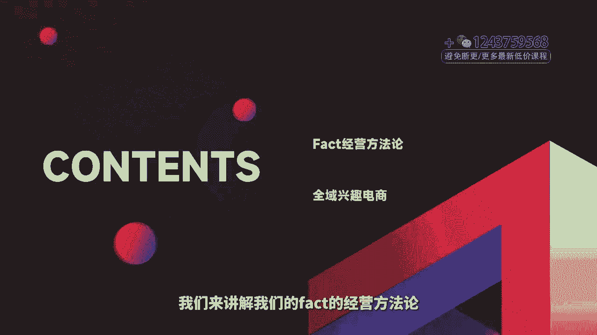

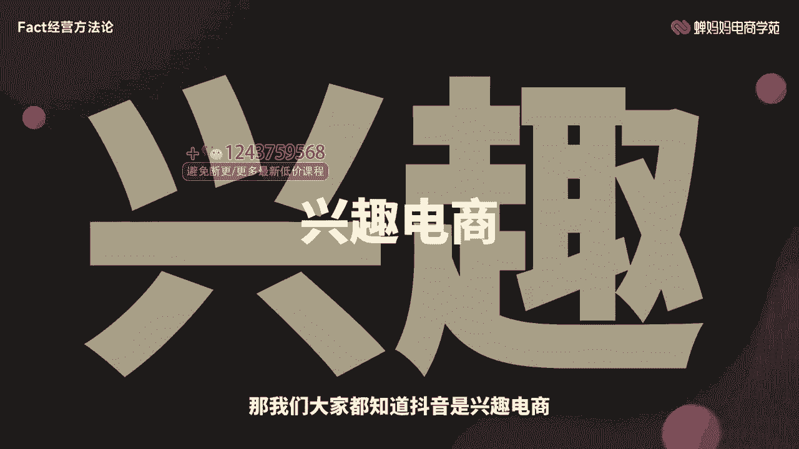

通过这三句话可以看到我们抖音官方对于我们用户的一个感受，用户的一个体验是非常重视的那在我们抖音兴趣电商的前提下，我们就知道优质内容的一个重要性。内容作为我们承载用户与商品之间的一个桥梁是或缺不可的。

同时内容可以吸引用户是重要的一个触达以及互动的渠道。那同时内容也是我们承载商品是场景化的一个生动的呈现方式。

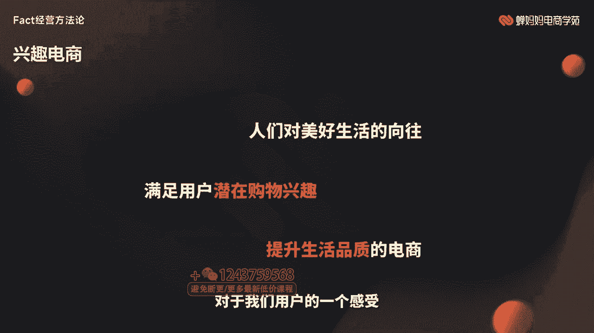

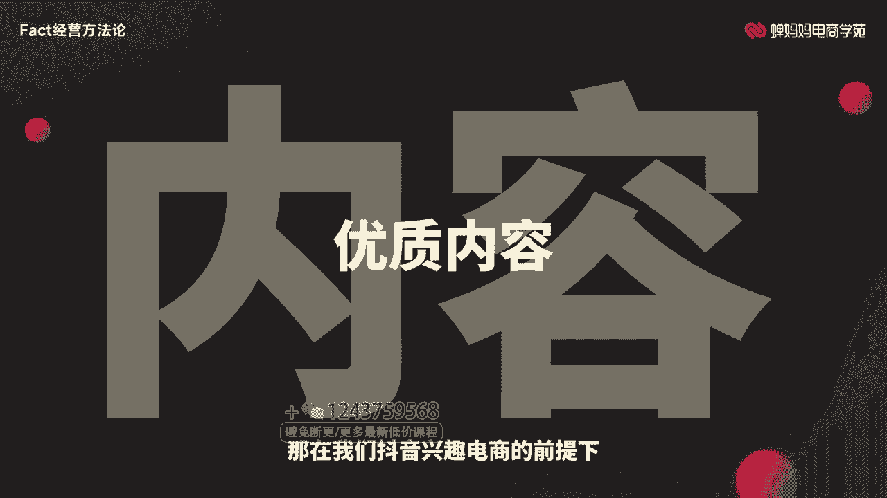

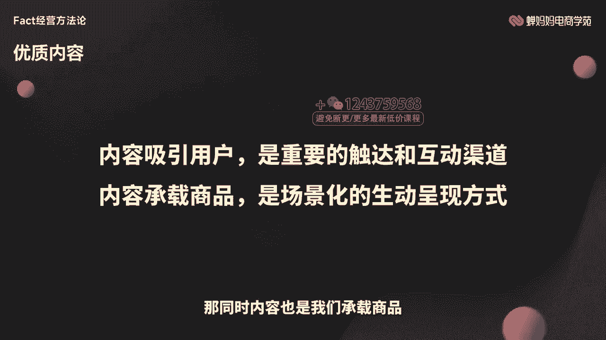

那我们来正式讲解我们今天的重要课程fact经营方法论。

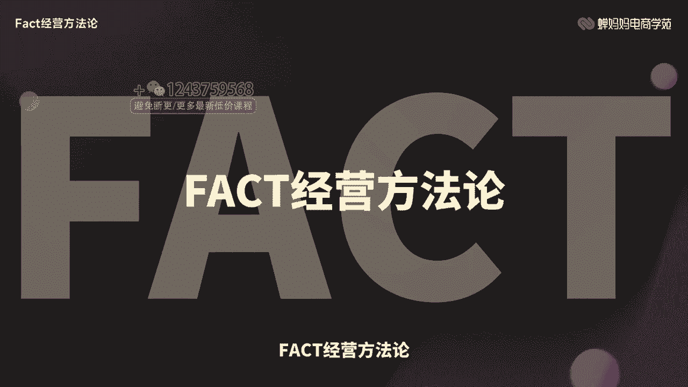

那fect的经营方法论主要包含4个点。第一个是我们的阵地自营，我们的商家阵地，我们的持续内容生产基地。那第二个是我们的达人矩阵，我们的海量作者矩阵以及提供了我们丰富的一个内容。

那第三个就是我们的主题活动，就是匹配我们的一个主题内容，包括我们的双十一活动啊，520活动等等。那第四个就是我们的头部大V，就需要我们去联合头部大V去打造我们的品牌影响力。

那由这四个内容去组成了我们fect的经营方法论里面的内容经营场。那我们首先来讲解第一个阵地自营，我们的商家需要做什么呢？我们需要去做好我们的短视频，我们短视频是干嘛用的呢？我们可以实现种草引流转化。

它是打通我们获找人的一个消费链路。那同时我们也需要去做好直播，直播可以去承接我们的流量，从而去实现我们高效转化的一个交易场。那我们的短视频和直播一起做短值共振。才能去提高我们的整个店铺的一个转化效率。

那这是我们正地自营需要告诉我们商家需要去做的。那我们第二个就是我们的达人矩阵，我们商家以及我们的品牌需要去结合我们自己目标的一个人群画像进行一个达人筛选。那也要和我们多层级的达人进行配合。

去分发不同层级的粉丝承接，以及我们也和以及我们也可以和达人进行长期合作，进行一个共同成长。

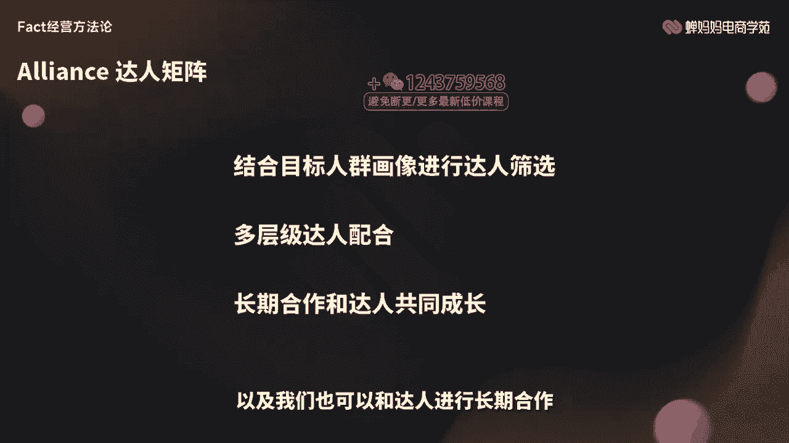

那第三个就是我们的主题活动。主题活动大家可以看到我们平台是有非常多的一些活动。那商家也是那平台也是鼓励商家可以多去参与平台的活动，从而去获得更多的曝关，包括我们的抖音双十一呀，我们的520啊。

618等等。那以及包括我们的单项IP活动，比如我们的超级品牌日，以及我们的呃专属的行业活动，比如说我们的白象微啊、宝贝计划等等。那每个行业都有相对应的一些主打活动。

我们商家也是可以多去参与我们平台的活动，从而去获得更多的曝关，去提升我们的转化。那第四个就是我们的头部大V了。那头部大V，大家肯定都不陌生。比如说我们的董先生，比如说我们的李佳琪等等。那这些头部大V。

他们有专业的影响力，可以为我们的品牌以及我们的商家可以去提供很好的一个背书。那同时也可以去带动我们的一个销量去从而去实现一个爆发式的一个增长。那同时呢我们的明星以及我们的头部达人，他可以去。

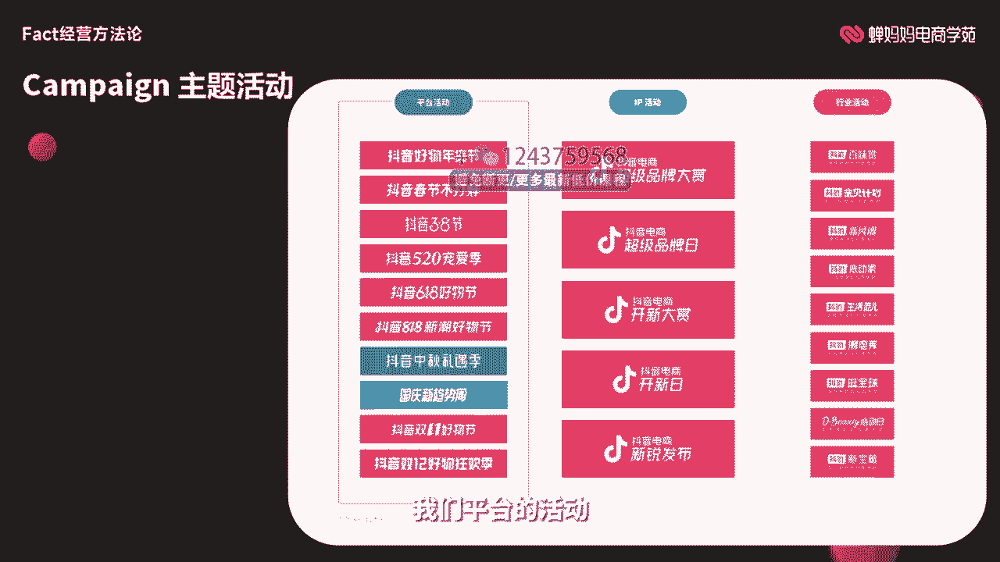

撬动他们自己比较庞大的一个粉丝群体，从而去制造相对应的一些品牌以及行业的一个热点，可以去快速的帮助我们品牌去破圈。那在这边举一个例子，比如我们呃抖音的一哥李佳琦。

大家都知道之前的花西子就是他带起来的那呃我们的fact经营方法论也是需要告诉我们大家告诉我们大家也需如果品牌想要快速破圈的话，也需要去和我们的头部呃达人以及明星进行一个合作。那我们的阵地自营。

我们的达人举阵，以及我们的主题活动和头部大V就组成了我们的effect经营方法论。那它实现了一个动作就是我们的一个货找人的动作。那第二节我们来讲解全域性趣电商。那全域性趣电商，它是fact家。

那fact家加在哪里呢？他打通了我们人找货的一个链路，从而去提升了我们高效的转化消费兴趣。那我们之前faact经营方法论，它是。打通了我们货找人的一个链路。那本次的全域性电商进行了全面升级。

打通了我们人找货的链路。那我们fect家主要增加了两个场。第一个就是我们的中心产，中心产主要包括我们的抖音商场，它是我们生意经营稳定的一个交易场。那第二个就是我们的搜索。

我们的搜索可以去精准匹配我们自己的一个流量枢纽。那大家最近也可以发现，我们最近在抖音上面的搜索的这个动作也是越来越多了。所以这个也是接下来我们流量渠道的一个重要来源。那第二个就是我们的一个营销场。

营销场主要是告诉我们需要进行一个广电协同，我们需要去呃进行一个投流广告。那去结合我们自己的好的内容，去加速我们生意的一个增长。那同时我们自己也要去提升我们自己的一个广告投放能力。

从而去优化我们电商经营的一个协同。那fa加新增了我们中心产和营销场，我们就形成了全域性去域电商。

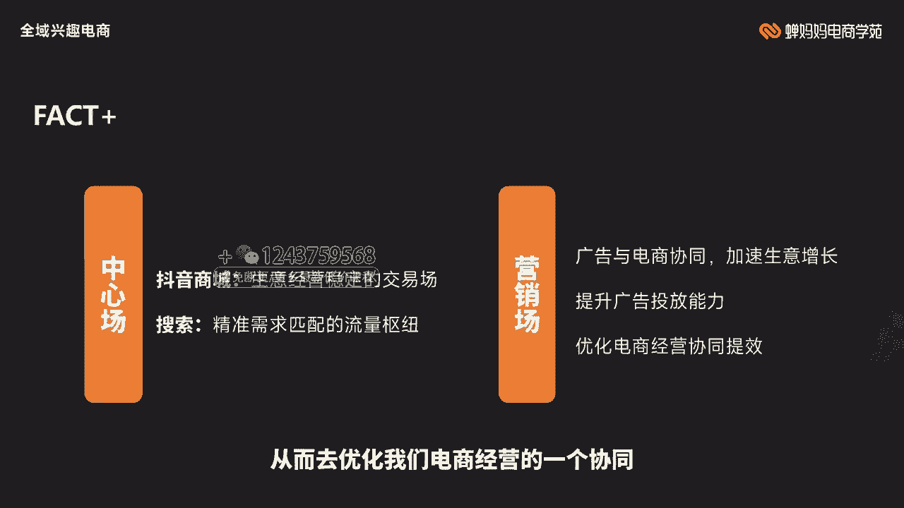

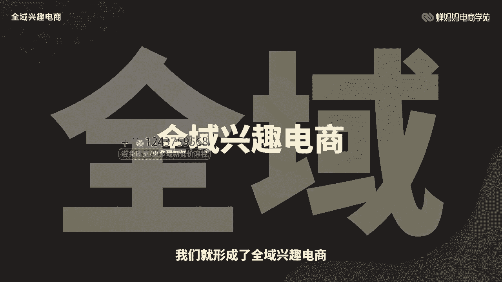

我们通过这张图更完整的去了解全域兴趣电商包含哪些内容。第一个就是我们的人群策略。人群策略就是我们需要去做好我们的种草拉新以及我们的复购。那我们的产域策略就是我们的内容厂家中心产和营销场。

那内容场就是我们刚才介绍的f经营方法论。那中心产和营销场就是我们的抖音商城搜索，以及我们的流量协同。那第三个货品策略，就是需要告诉我们品牌以及商家，我们需需要去做好我们的优价好物，我们的商品成长。

以及我们需要去开发新品等等底下最基体的我们的体验优化。我们可以很清楚的看到它包含我们的商品体验，我们的物流体验，我们的服务体验。那这三个其实就是我们自己店铺的一个体验分。

那店铺体验分作为我们店铺的一个经营基石，我们抖音电商的一个基石。在这其中是非常重要的。所以我们也需要去关注好我们自己店铺的一个体验分的具体状况，去做好我们的一个店铺口碑。那这样子的话，我们再去做。

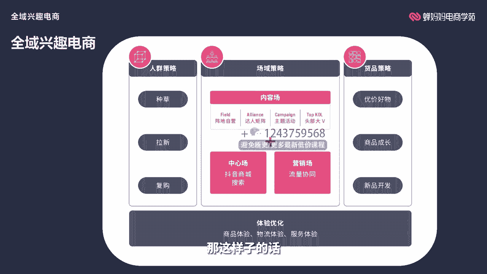

他产域的一个内容就可以更上一层楼了。那我们今天来拆解一下我们的一个科沃斯的案例，它是如何在我们全域兴趣电商的环境下来做到了我们G威达到了8000万，以及我们的曝光达到了6。5个亿。

同时也是通过我们三个产域来进行一个营销策略的。我们的中心产内容产和我们的营销场。

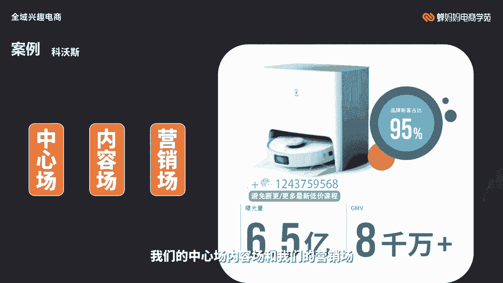

那第一个就是我们的内容场。我们的内容场。我们的科沃斯通过了我们的短视频直播商城以及搜索。那短视频的话，它是发起了我们的话题挑战赛，去参与了我们平台的热点话题。那以及结合了我们科技相关的达人抖音号。

以及我们的虚拟IP联动等等，去实现品牌破圈，去提升我们的品牌认知，从而去实现我们的一个高效种草。科沃斯直播的时候，与变形金刚IP进行跨界联名。因为他们本身就是做扫地机器人的，所以和变形金刚进行一个联名。

可以去提升自己的一个品牌影响力，也可以去提升用户的一个心智。只要一说到我们科沃斯就可以和我们的变形金刚高科技进行一个联想。那同时我们的品牌官方的直播间也和多位达人的直播间进行共同的一个转化直播。

去我去转化我们的一个种草用户，从而去实现我们的一个销量爆发。那第三个就是我们的抖音商城啦。抖音商城是本次新增的一个流。入口。那他在抖音商城里面的一个矩阵位啊，以及流量位等等。

去通过我们中心化的场景去带来我们的转化的一个新增量。那我们的搜索搜索主要是覆盖我们的一个搜索结果显示，以及我们的搜索路径覆盖，从而去承接我们兴趣用户的一个精准人群。那我们的内容场。

我们还有我们的好商品以及我们的好服务好商品，就是他们提供了自己的旗舰商品以及的潜力新品，从而去提升用户的一个关注以及转化。那同时呢他们还提供了一个好的服务。从商品的质量导购以及售后和物流。

他们就去做好我们的用户服务，从而去提升用户的一个体验感受。那我们来看一下他的营销场案例。营销场，它是发起了话题挑战赛。那在抖音上面的一个话题挑战赛达到了1。5亿次的一个曝光。

那平台肯定也是会给到相对应的一个流量服务池。那第二个就是我们的1个IP联名和我们的变形金刚联名进行一个聚合。

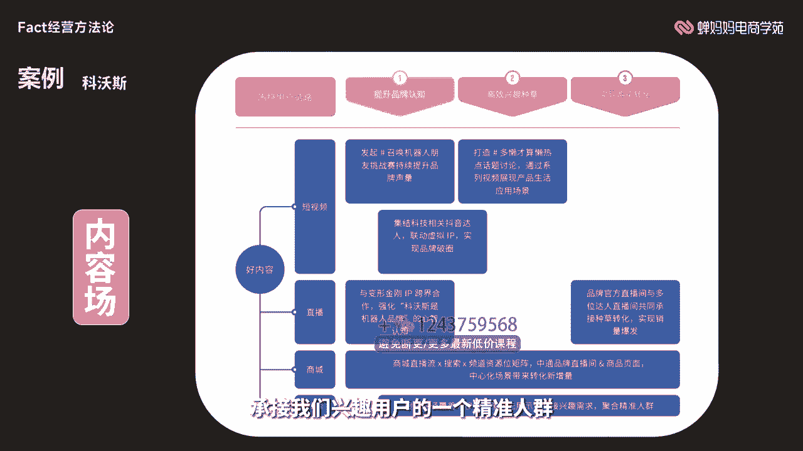

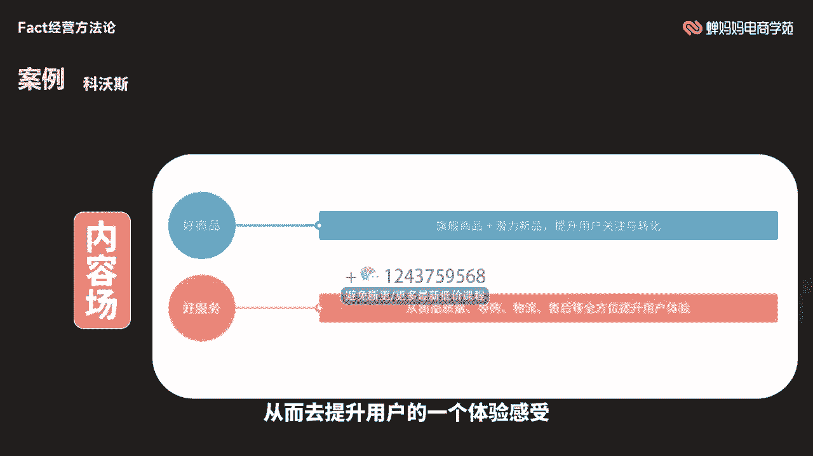

转化，从而去提升科沃斯扫地机器人科技品牌和我们变形金刚的一个联想，去增加自己产品的一个信任以及背书。那我们来看一下中心产，那中心产的话，是我们的商城以及搜索。那在商城里面。

他去参与了我们品牌馆的一个置顶展示。那第二个就是我们的一个居家好物的品牌置顶。那第三个就是我们的抖音商城的一个定向展示。那通过这三个渠道去扩大了自己在商城流量的一个曝光，获得更多的转化机会。

那还有我们的一个搜索新流量。那搜索的话，它主要是通过了我们启发式搜索，在你还没有搜索科沃斯的时候，它其实已经在餐饮享收的底下已经给你置顶了我们科沃斯的品牌。那第二个就是我们的一个联想截货词。

我们只要搜索扫地，还没有搜索机器人的时候，它已经直接把自己当下活动的三款热门的呃扫地机器人的型号，已经置顶给你进行一个搜索了。

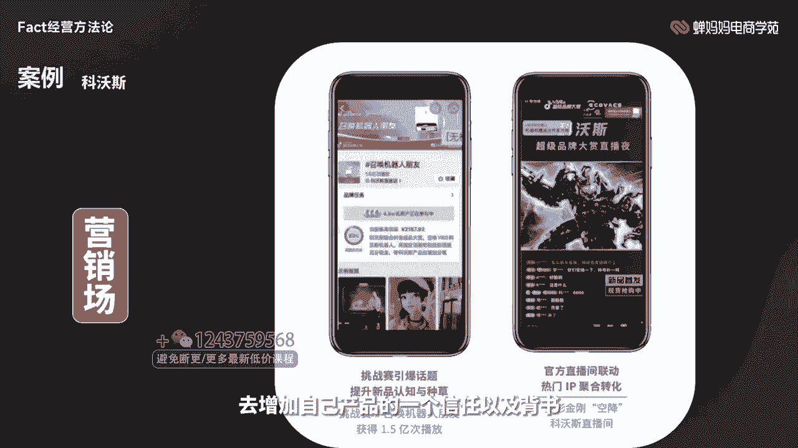

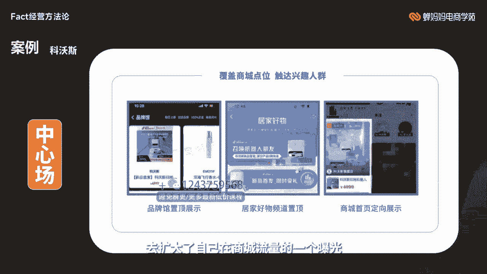

那在我们活动期间呢，可以获得相对大量的一个活动曝光。那我们就可以很简单的去理解到，我们想做全域性趣电商，就是要做到我们的全域分发。我们可以通过我们的内容场和中心产。

我们的短视频要做我们的直播要做以及我们新增的两个流量中心场的流量路口。我们的商场，我们的搜索需要去做，以及最好还要做好我们的体验分，我们的服务等等。那第二个就是我们的营销场。

我们需要去做好我们的付费流量，以及我们的官方大促，去参与我们的官方活动等等，去获得更多的流量以及我们的营销工具啊，我们的达人合作，不管是头部大V还是多层级的达人，我们都需要去进行我们品牌的一个举阵分发。

从而去提升我们商品在针对于不同人群的一个曝光，从而去扩大我们的一个转化链路。那这就是我们全域性趣电商主要的呃经营方向。那我们大家在学习完后也可以去记住这呃三个场的主要内容。

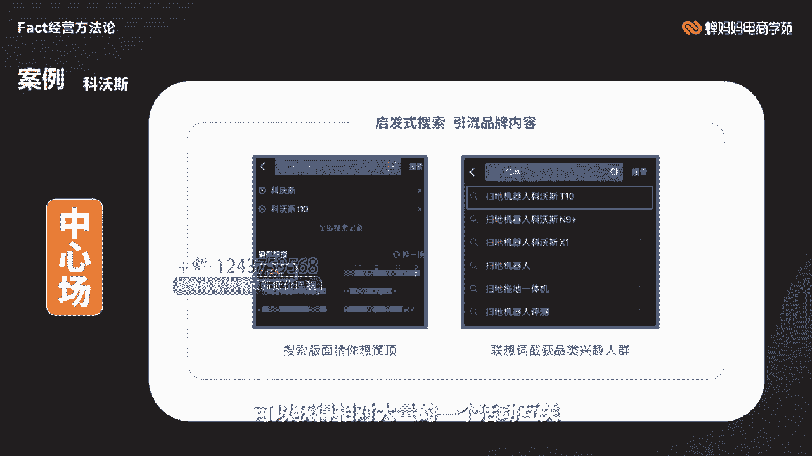

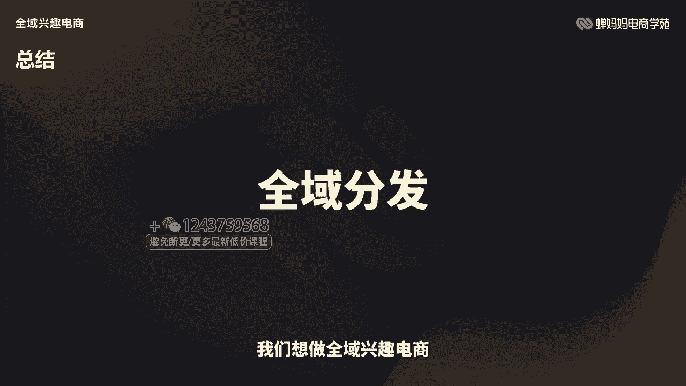

然后后续在自己经营店铺的时候也可以用到。那我们一起来回顾一下本节课的重点内容。本节主要讲解的是兴趣电商的基本框架和我们的经营方向。建议我们在学习后可以去尝试自己往全域的方向去经营。

本节的内容就分享到这里，感谢大家。

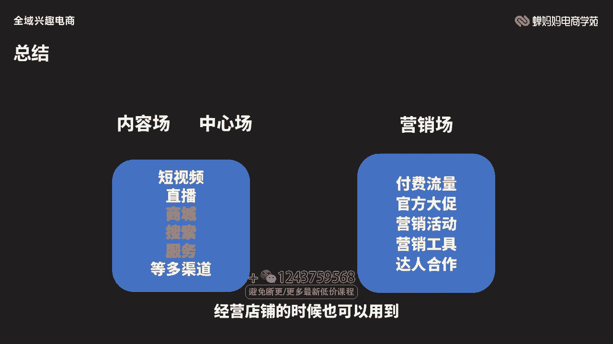

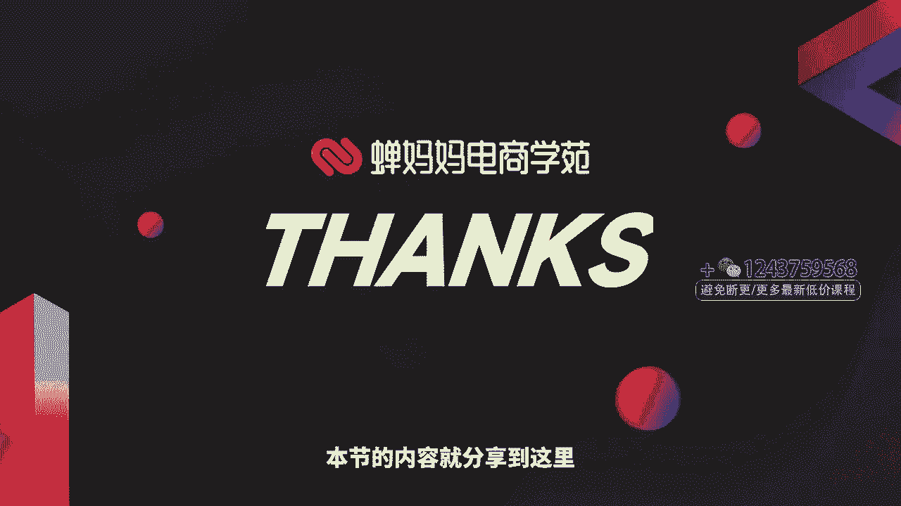