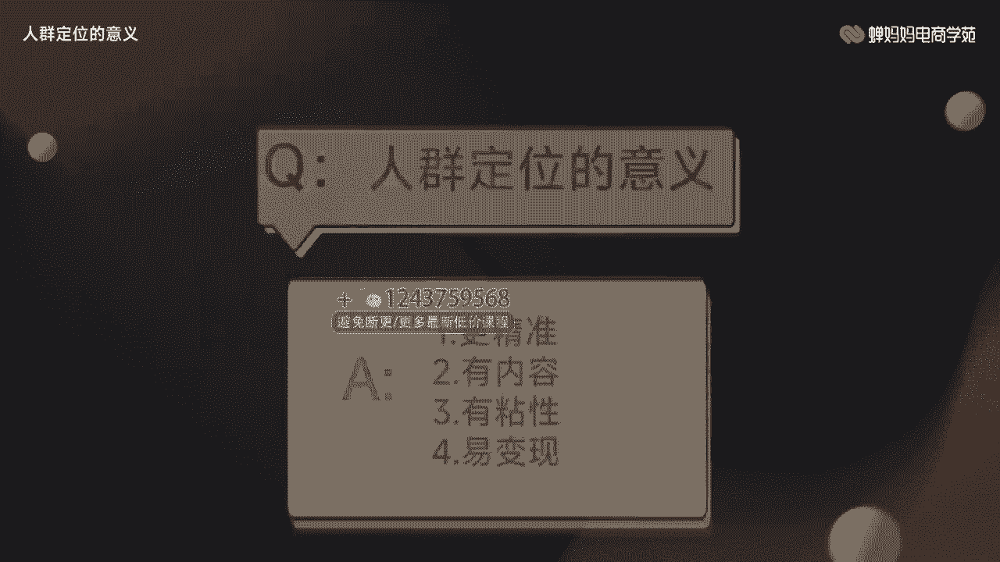
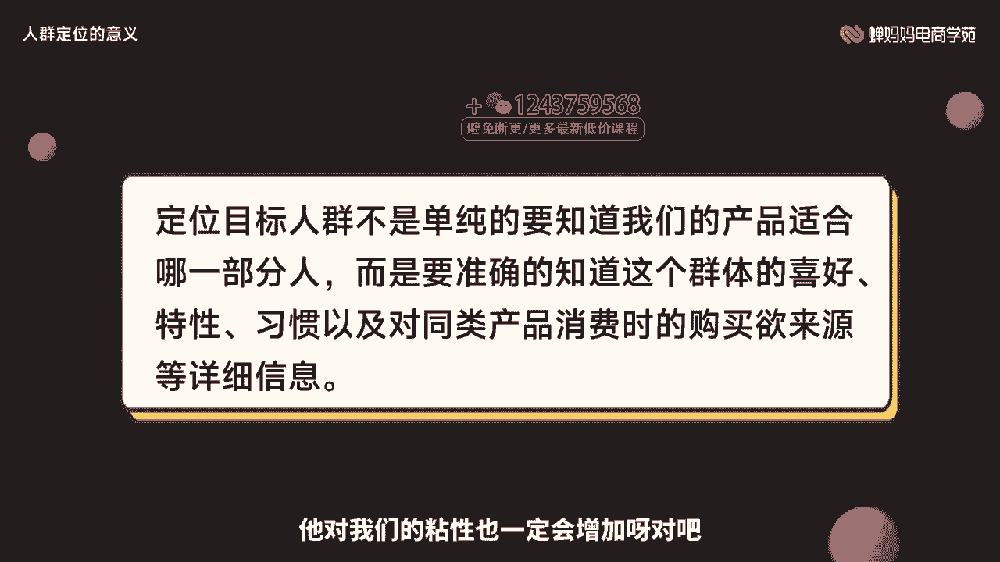
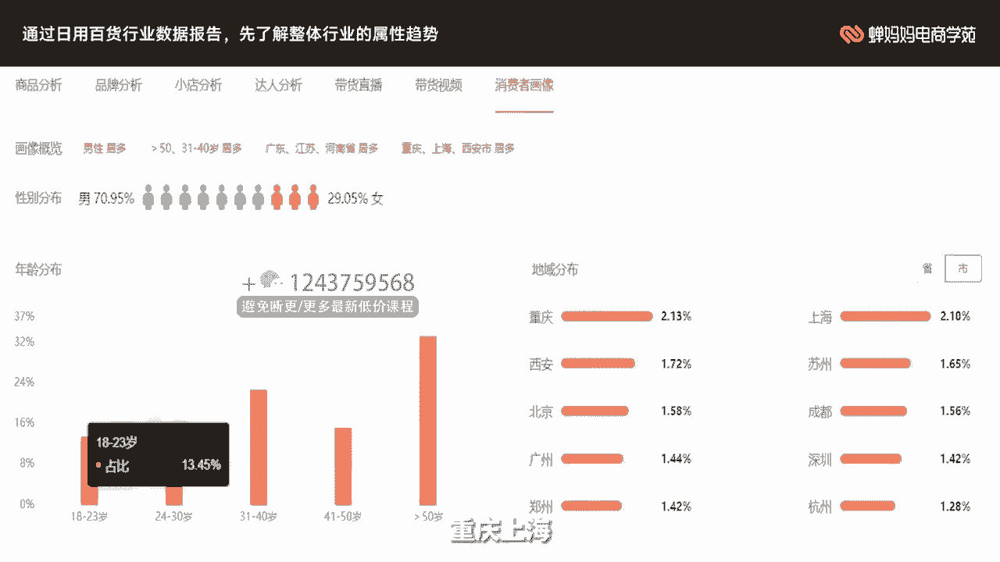
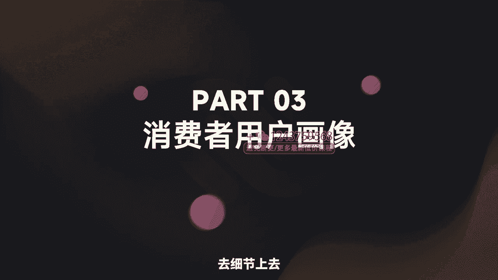
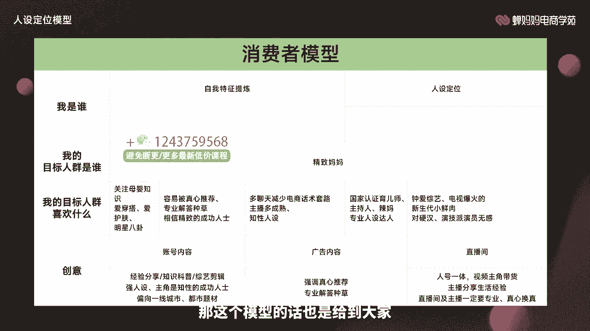
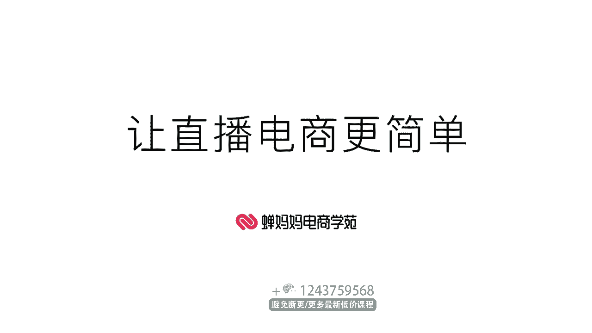

# 006 抖音电商-新手起号特训营，菜鸟变老手 快速入门 新手商家超全入门课程大全 - P2：2.【视频】八大人群定位目标用户- - 早安睿睿 - BV1Q7421d71A

Yeah。

让直播电商更简单。大家好，我是长巴巴电商学院的讲师雨浩。好，本次分享的课程是八大人群定位目标用户。本节课呢主要讲解的是人群定位的重要性，人群定位的基础属性以及消费者用户画像。

比较适合一些基础薄弱的同学进行学习的。通过咱们这次培训后，大家能够了解到人群定位的基础属性有哪些。通过这些基础的属性进行延展成消费者用户画像，了解这些消费者平时的一些喜好啊，有掌握这样的技能就可以了。

那我们接下来话不多说，开始我们正式的学习part one啊，人群定义的意义。如果说我们对于自己产品要卖给谁都不知道的话，那你说我们的直播播给谁看产品卖给谁，文案怎么写，主播播什么卖什么。

是不是视频怎么拍，货品怎么卖，话术怎么写，是不是全部都是一团浆，只有说我们不明确吧，我们这个产品卖给谁，我们才可以通过这些人的这些平时的一些喜好去研制我们的内容，把我们的直播脚本。

短视频脚本都是做的更好呢？对吧？所以说人群定位的意义。就是能够让我们的这些产品，或者说我们去做这些内容更加的精准，或者说我们有内容可以去做啊。那通过这两个部分啊。

是不是我们这个就个可以让我们的内容的质量提升很多，或者说我们可以吸引到更加精准的这些用户，那更加精准的用户啊，那我们都知道刚才我们上一节课又给大家去讲过。

如果一旦我们去把这些人群这些更加精准的用户把握住了之后，那我们发的内容他爱看，那我的这个数据是不是各项的指标都会上升。那各项指标上升了，我的流量是不是就会增加。

那如果说我的产品我的内容能够一直满足我这部分的消费者，那这些部分消费者是否就会对我产生依赖，他是不是就有粘性。那一个有对我有粘性的这个消费者对我的产品又肯定，那我这个产品卖给他们，是不是就会更加容易。

所以说这就是人群定位的四个意义，更精准，有内容有粘性易变现。

好，我们先跟大家说一下，定位目标人群不是单纯的要知道我们的产品适合哪一部分人，而是要准确的知道这个群体的喜好、特性、习惯以及同类产品消费时购买月来源等信息啊等这些详细的信息。

如果说我们单纯的知道我们产品卖给只适合这部分人，那这部分人一定会对我们的产品买单吗？当然不一定了，但是我们要知道他的喜好，哎，这个人就喜欢八卦，哎，这个人就喜欢追星。

是不是那我们的产品我们的内容拍摄的角度是不是就可以根据他们这些喜好的角度哎啊，那如果说我们根据他的喜好去制作我们的内容，那我们的内容他更加喜欢各项的指标也会有所上升，对吧？他对我们的年限也一定会增加呀。

对吧？这就是整体的一个意义。

好，我们来进入今天的第二个环节，人群定位的基础属性啊，大家明确了意义啊，光知道这些还不够。我们还得具体去看一下基础属性有哪些啊，最基础的人群定位的属性就三点性别、年龄、地域。

你的产品是针对男性还是女性还是说都可以，是吧？你针对的年龄又是哪一个层级的，是不是18到23岁，24岁到30岁，这部分年轻的群体根不入这个社会对这个社会都充满了一系列的信任和希望啊。

还是说我们知道在31岁到40岁，41岁到50岁这部分啊，具备了一定的消费能力的这部分人群啊，或者说这部分人群是哪一部分是一线城市，二线城市是不是还是说正在该地区啊，他就在这部分旅游啊，过两天他就走了。

你的产品推不了给他还是说他在这地方是一个常年的一个居住的一个状态，我们一定要先搞清楚这个部分啊，它作为我们的基础的一个画像。

我们先来看一下啊。这是一个女装行业的一个数据报告。我们先了解一下整体行业的一个属性趋势是什么。首先对于女装来说，整个行业的性别分布对这个感兴趣的男性只有20%，啊，女性占到了79%，对吧？

年龄层次的分布我们可以看到41岁到5岁的人并不多。而24岁到30岁、31到40岁，这部分人群的这个年龄区间啊，是我们的一个目标的一个人群啊，对感兴趣的人最多。

地域上呢啊省市上来说来说是河南、广东、山东啊，广东河南、广东、江苏、山东四个省最多啊，具体呢重庆西安、上海市啊，这是整体的一个行业上的报告。我们再来看具体的一个产品。它是什么样子的？哎。

这个女装哎正正好好符合这个人群的一个画像，那说明什么啊？说明这个行业大盘非常的精准。我们可以根据这个大这个行业的大盘去制定我们这个人群的一个定位的一个目标策略的一个方向。哎，我们来看一下这个店铺啊。

这个店铺是某销售额top泡女装店铺的人群画像，基本上和大盘是完全啊不能说完全基本上80%到90%的一个重合率。大家可以看一下，她的是这个人群画像是什么样子。

女性居多31到40岁、24岁到30岁这部分人群啊居多，是河南江苏、山东、四川啊，这个省份就比较多。北京成都郑州居多，基本上啊它就是和咱们的这个整个体的大盘画像是完全趋于完全趋于一致的。

所以说啊我咱们可以去制定人这个人群这个我们自己去目标画像的时候，就这个战略上的这个制定的时候，可以去参考我们的一个行业大盘。那我们这边呢再通过日用百货行业。大家再去举一个例子。

了解一下这个行业的整体属性趋势是什么样子的。大家可以看一下，是男性居多，是大于50岁和31岁到40岁这部分人群居多。广东、江苏、河南省居多，重庆、上海、西安市居多啊，我们先记一下这个人群画像。

我们再来看一下这个销售top榜啊。

好，我们来看一下这个销售和top的这种百货店铺的人群画像啊，大家看一下他的性别占比依然是男性占比非常的高，大概是在70%以上。年龄层次呢是31岁到40岁。它的地域分布呢是重庆、西安、上海和。郑州好。

我们来看一下这个画像和刚才的大盘画像基本又是趋于吻合的。所以说什么呢？所以说我们在正常之正常去做我们的人群定位的时候，完全可以拿大盘去做一个参考看一下啊。

拿大盘的一个这个平均的一个趋势来判断我们的人群的基本基础的一个定位。好，我们进入本章的第三环节，消费者用户画像。刚才给大家讲的呢是人群的一些基础上的属性。

我们光知道性别年龄地域并不能把这个人群做的更加的精准啊，它只是给了我们一个方向。那如何根据这些基础的属性进行去推演呢，是不是把它放大去细节上去寻找这些消费者用户的画像呢？

那么我们这边的话直接给大家这张图片啊，八大消费者的用户画像。它横轴呢分别就是精致妈妈都市银发都市满领新锐白领资深中产Z小镇青年小镇中老年等等啊这一系列的人群。

那纵坐标呢就是技础属性、类幕偏好、原生视频、广告内容，电商直播间和媒信达人。通过我们这一张简单的图片，就可以进行一个正向的推理和一个反向的一个推理。比如说我们通过广告内容哎。

可以看一下哪一部分人群是受众，也可以通过这部分人群推一下这部分人群喜欢哪部分的一些广告内容，明白了吧。他是都我们光知道产品啊，比如说我们现在已经知道了这个电商直播间啊，我们是什么样的电商直播间。

我们可以这样的通过我们的直播间去对应看一下是属于哪部分群体的喜好，也可以通过这部分群体去推这部分群体到底喜欢什么样的直播间，我们就做成什么样，他都可以做一个正向和反向的一个推理。那很好。

我们来具体来看一下这部分人群到底喜欢的都是什么东西。我们来看一下精致妈妈。给大家看一下啊，首先精致妈妈的这部分基础属性呢就是25岁到35岁，三线级以上的这种城市啊。

属于一种高线城市和高线高消费的一个水平。那内幕偏好呢就是一些生鲜啊、营养品啊、休闲零食啊之类的。比如说代餐啊、饮料冲调啊、乳制品啊、羊油米面酒之类的那平时关注一些什么样的原生视频呢。

他们比较关注的是一些母婴类型的知识。爱穿搭爱护肤，明星八卦，也他们也不会落下。那如果说你的视频啊，全部都是关于一些母婴的那你这边目标人群就可以反对冲调啦。

是偏向于精致妈妈的那我们现在已经知道它是精致妈妈。那我们广告内容又如何去做呢？是不是？那我们就可以做这种。为这些可以受这些精致妈妈喜欢的广告内容，那他们喜欢什么样子呢？比如说他们容易被真心的推荐啊。

专业解答种草，相信精致的成功人士，多聊天，减少电商话术套路，多这个主播多成熟和知兴的人设。那也好。直播间的一个主播的人设也给到大家。以及最后的啊中爱中艺电视那个比较爆火的新生代的小鲜肉。

对硬汉和这种演技派的明星啊，反而是没什么感觉啊，那我们这些就是怎么说呢？我们一些内容上的选择可能就要避开这两个走项哈，他这怎么说呢？也是一定偏好的，他的偏好就是国家认证的一些育儿师啊，主持人啊。

妈妈等啊专业人设达人，因为大家都是用这种妈妈，然后这些辣妈呢可能就是在身材管理上做的会更好啊。那面对这样的比较专业和职业的这种人设呢，是比较吸引这部分人群的那如果说我们呢是不是已经该告诉大家啊。

你的直播间人设到底是应该什么样子的，那你就按照这个群去走就好。那我们这边呢再给大家进行拆解一下，那就拆解一个。😊，资深中产吧，资深中产大概就是36岁到50岁，三线级以上的高线城市高消费水平。

内部偏好就是酒营养品、饮料烹调。比如说羊油米面啊、乳制品啊、代餐啊、生鲜啊，还有一些休闲的一些零食。爱旅游，爱理财，注重身材管理。

对生活这种健身呢是比较感兴趣的那如果说你的目标人群是这种这种中产的自深中产这个这种人群的话，那你是不是你可以发一些啊，在这一些旅游或者说理财的视频中直接植入你的这些部分产品啊。

是不是相信明星大品牌容易将自己对号入座啊，那这部分人群就喜欢对号入座。那你这样的话就可以不妨给这部分人去反复一个假设让他们可以自身的带入这种情景之中。😊，啊，他也是多强的这种地域的一个属性的达人。

主要内目呢就是酒味茶类海鲜啊，你还自深中产嘛，离不开烟酒茶啊，那你的产品的话，如果说你的产品是烟酒茶，那你的这个对应的人群就有可能是这种资深的一些中产人士。好，那这部分人群呢喜欢资深演员。

然后平均的出道的时间大概就是20年的这部分人群的话和这个机致妈妈正好相反，他比较喜欢有一些演技派人的资深妈妈就喜欢一些小鲜肉，这是明显的一个对比。那在我们在去人群已经确定的时候。

那我们再找这些主播打人的时候，要注意一些他喜欢有知识内容分享给达人，教授、老师、导游、健身博主等等这一系列的那我们可以把自己的人设就架在这个上面啊。

根据这部分人群去调整我们的用这个实时去调整我们的人设啊，你只有让这部分人群满意了，他们高兴了，愿意看你的视频，才可能有进一步的消费的可能，对吧？我这些人的信任啊，先不说信任了。

连这些人的兴趣你都引起不起来，他连产品都不会看，怎么会去购买你，对吧？那很好，我们根据八大消费者的用户画像去进行一个推理啊，如何去使用啊。刚才给大家讲的是比较简单的这种方法。那首先我们要判断我是谁。

我的目标人群是谁，这个我是谁的话，就是我们自己的一个定位自我定位啊，前面有讲的也一样是这个五环的定位法，大家把自己的定位摸清楚啊，再去看一下我们的目标人群是哪一种。好，这部分目标人群就喜欢什么？

我们的创意又如何去做很好，这个时候我已经定位了我的目标人群是精致妈妈啊，好已经是已经定位好了，那这部人群喜欢什么，我们跟快看怕大家看看不太清晰，我们就放大来看啊，关注母婴知识，爱穿搭明星八卦啊。

倒数第二个国家认证的育儿师主持人，辣妈专业人设的达人，以及最后的中爱综艺电视爆我的新生代的小鲜肉，对硬汉哪。😊，派这种演员无感，哎，直接就把你的账号内容的里面的创意已经给您做好了。

就是可以去做一些经验分享啊，知识科普啊、综艺剪辑啊，这种强人设的主角是这种啊知性的成功人士做好是成功女性偏向于一线城市的都市题材等等你的账号内容的创意，是不是就给到大家了。那很好。

他实在是容易被真心推荐专业解答种草，相信精致的成功人士，哎，又钟爱综艺电视爆火的这种新生代小鲜肉，是不是那我们的广告内容也有啊，你就拿这些广告这种比较爆火的新生代的显生小鲜肉作为主角。

去帮他们做这种真心的这种推荐专业解答种草上来就解我真心推荐你一款什么什么产品，是不是广告内容也有啊，那直播间是怎么去做呢？哎，多聊天减少电商话术套路，主播当成多成熟和知性人设，主播人设也给你给你了。

你的直播间方法，哎，你就别玩玩那些套路啊，什么满减呀，今天又什么赔了亏了的呀，给大家什么。什么又上什么库存啊，完全没有必要，大家就真诚一点，真诚是必杀技嘛。然后一体视频主角带货，主播分享生活经验。

直播间及主播一定要专业用真心换真心啊。大家可以看一下国家认证的育儿师、主持人、辣么专业人设，这种达人是不是又成熟又有知行人设，哎，加在一起，相辅相成，基本上就能征服这部分的用户群体。很好。

那我们刚才根据刚才大家的这种连线，可能看起来也不是很方便。那我们这边呢就为大家去整理这个消费者模型，大家可以看一下啊，可以把自己已知的和我们想要去填写的放上去，就已经就可以完成这部分模型。

你就要按照你自己模型搭建的这个部分去做你这些直播也好啊，或者短视频的内容啊，人设场景等等一系列都要从这里面进行一个参考，或者说是完全依据这个也没有任何问题。那我是谁。

这个部分在前面的自我定位上已经给大家去进行确立了。那这部分的话就不给大家去举例啊，直接我们看下方的我的目标人群是谁？精致妈妈啊，目标人群喜欢什么创意。这边的话给他去分享啊，给大家去已经填写好了。

那你也可以这样去进行填写。作为你的模型去做。那账号内容我们就根据上面的自我特特征提炼，以及这部分，哎，还有什么一些哎什么人设定位啊等等，这些全全部都是啊这个自我定位的这部分。

那下面这个部分哎刚才已经跟大家解释过了，什么关注母婴知识啊，爱穿达，有爱护服，爱明星八卦等等一系列去可以去做成你的账号内容啊。那这个模型的话也是给到大家。

那现在给大家去做一下本节课的重点内容。首先就是人群定位的一个重要性啊，这些所有的这些关系全部都是层层递进的，只有把握好你自己的人群，你才能够精准的掌部分这部人群。那你拍什么，那就是这部分人群喜欢什么。

你就拍什么就变得更加精准，有内容，你更精准又有内容，那用户对你这个账号或者说你的定位非常的满意，那我他就会经常的去看你的视频，对吧？你发布的视频他都满意，那自然粘性就会提升，他对你的视频满意。

你经引起他的这个好奇心了。他对你这个东西有一定的关注之后，你就收割了部分的信任。那这部分用户自然会然会在你的直播间买东西，对吧？那就变成了易变现，所以说。所以说人群定位的重要性就这4点，更精准。

有内容有粘性易变现。第二个人群定位的基础属性。我们记一下基础属性就是信节年龄、地域。这三个部分组成和人群定位的基础属性，主要就是给咱们去找这部分人群的一个方向。

但是这三项呢只是给到了一些粗犷的一个大概啊，又没有一些非常精准啊，他并不能称之为一个精准定位。那根据这部分基础属性进行延伸，组成了消费者的用户画像。比如说它的内容偏好啊，人生视频啊、广告内容啊。

电商直播间啊，明星达人啊，他们都喜欢什么样的东西啊，组成了我们的用户画像，并根据用户画像给大家这样的模型，大家就可以根据那个模型去找到你对应的这部分人群，并根据我们这部分人群去制作你的内容啊。

就是我们的短视频和直播，你的短视频脚本直播的话术就要围绕这部分人所喜好的这个内容进行一个开展啊，就相当于把我们所有的目标方向全部都设好啊。接下来只是要按照这个方向。去做就可以了。好。

那本节课的内容就分享到这里，感谢大家。啊，当然也建议咱们学习以后啊可以去尝试。Yeah。🎼。

