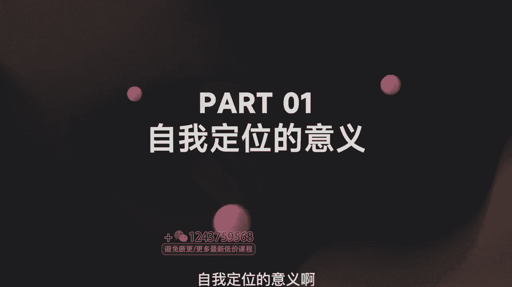
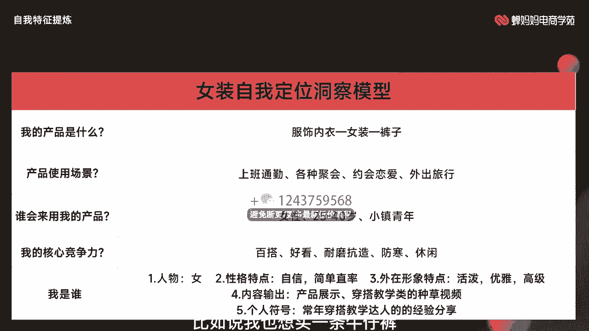
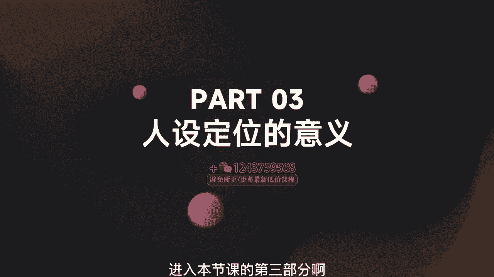
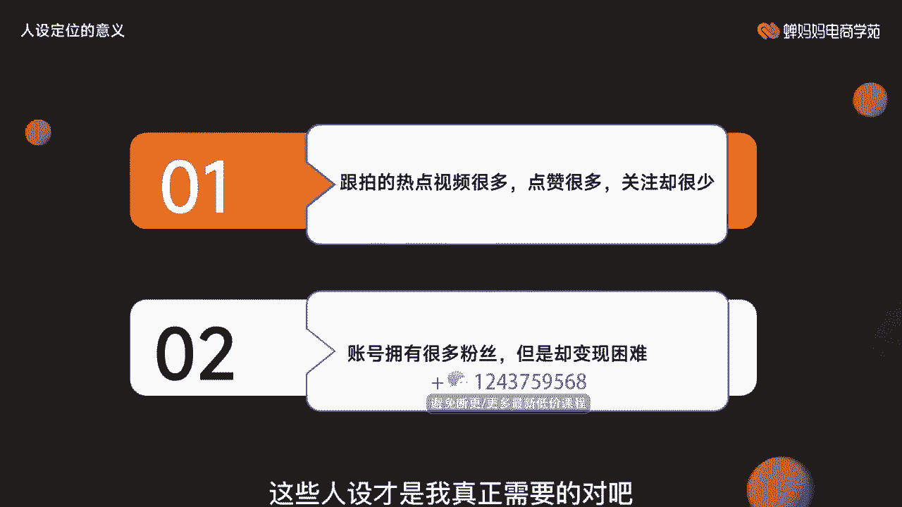
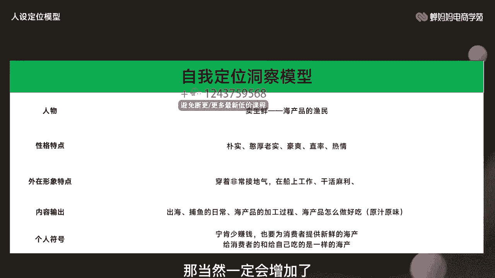
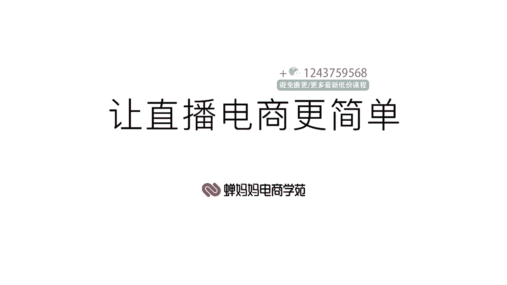

# 006 抖音电商-新手起号特训营，菜鸟变老手 快速入门 新手商家超全入门课程大全 - P3：3.【视频】五环定位打造人设IP- - 早安睿睿 - BV1Q7421d71A

Yeah。

让直播电商更简单。大家好，我是馋巴巴电商学院的讲师雨浩。那先给大家做一个自我介绍啊，我擅长食品饮料、3C、电器、服饰鞋包等这些类部直播间上面的一些玩法。助力多家企业从零到一打造直播商业化体系。

累积为500多家直播间深度诊断账号，有完整的直播间复盘诊断方法以及实操经验。好，那我们话不多说，直接开始本节课的内容啊。那本次分享的课程是五环定位法，打造人设IP。本节课主要讲解的是自我定位的意义。

自我特征的体验以及人设定位的意义，比较适合一些基础比较薄弱的同学进行学习，通过咱们的本次学习后能够掌握自我特征体验，就是你可以把自己的一些优势提炼出来，并根据你的这些优势去打造一个人设啊。

掌握这样的一个技能就可以了。那好，话不多说啊，咱们就正式开始第一节自我定位的意义啊，因为很多人不太了解啊，我做直播电商我就是为了卖东西，我只要把东西卖的出去就好了。我有必要去做一些什么什么账号定位呀。

人设定位啊等等这一系列嘛。那当然有必要啊，那为什么呢？首先这两点啊，贯穿到咱们整个账号的这两点，第一就是粉丝粘性。第二就是变现能力。说白了就是让更多人关注你，而且他们不离不开你啊，那离不开你的同。

时呢又被你产生了更多的一些一些利益啊，他从你的直播间买东西，给你点赞，是不是还可以刷礼物等等这一系列自我定位越准，粉丝粘性就越高变现能力也就越强啊，等等这一系列。

它在你的直播间反馈的是啊数据就是越好明白吧？你的这些转粉率啊，或者说是进入到你的直播间啊，是不是商品点击率啊等等一系列在你直播间的一些数据啊，都好啊。那平台自然认为你的内容比较优质。

自然而然的也会为给你提供更多的一些流量啊，所以粉丝粘性变现能力，这两个是比较空的，它反馈到你的一些直播间上等等一系列的。比如说还有一些你的视频就变成了一些商品的点击率啊，直播间的进入率啊。

还有最后的一个商品的一个转化率啊等等这一系列的数据越好。内容越优质，流量就增加啊。那么这有一点小注意啊，就是定位不是要改变产品，而是要调整潜在顾客的想法。也就是说是在潜在顾客心中对产品进行了一个定位。

那我们这边呢给大家去举个例子啊，那什么是定位信息，比如说我们给大家去举这样的一个图片意义啊，他是叉叉的海鲜美食。那我们都知道他就可能就是卖海鲜的嘛。那他把自己的自我定位放到了这个位置。

同时拍摄了大量关于这个海鲜怎么吃，以及他平时怎么去捕捉这些海鲜，因为它是一个渔民嘛，他的定位就是这个样子的那我们对这个账号的第一印象是什么？那他就是一个渔民，平时卖海鲜。

通过他的视频内容或者说是直播内容，我们不知道他的卖这个海鲜还挺好的，可能会比较鲜活，价格也比较便宜等等一系列，这是后话。但是我们现在给他的一个定位就是。我现在想吃海鲜，那我就要找他。

那我们来看第二个账号，它是叉叉房产官方账号啊，它所有的这些视频全部都是什么一线海景关于一些房产的内容，而它的橱窗里面大部分的内容就全部都是海鲜。那他给自己的自我定位做的就是不标准不清晰。

那我我对这个账号的了解，就是啊我可能比如说我想买房子，或者说我想装修房子了，或者说我对这些房地产上面有一些信息想要了解的，我会关注这个账号。但你买海鲜。

你想想我们会从这样的账号上去去进到他的直播间去买他的海鲜吗？是吧？那我们来看继续啊自我特征的体变啊。自我特征提炼就是我们刚才给大家说的本节课的最重要的就是五环定位啊。你首先要要清晰我是谁。

我的产品是什么？我的产品使用场景是什么样子的，又有谁或来用我的产品，以及我的核心竞争力啊，就是我大家都是卖海鲜的，我的竞争力跟别人一比是什么啊，那同样的话，这5点就是贯穿我们整个自我特征。

究竟是什么样子的，给大家去具体的进行一个举例啊。我的产品是什么产品使用场景啊等等一系列。这个就是一个表格的形式给大家去做一个这样自我定位的一个洞察模型。我们把自己的内容填进去了啊，就完成了一个自我定位。

那我们这边呢给大家去举例就是一个女装啊，我的产品是什么？不是内衣里面的一个女装啊，裤子具体一点，牛仔裤，产品使用场景呢，就是我的上班通勤可能要用以及各种聚会约会恋爱呀，外出旅行呢，我们都知道这个牛仔裤。

它这个使用的这种场景是非常多的，因为它比较百搭，那谁会来用过的产品呢，这个时候你要想好啊，你这个产品到底是谁来用。因为我们这也涉及到一些人群定位上面的一些小画像啊，首先我们是女装的牛仔裤。

专门卖女性卖给女性的，所以那我们这个性品上，那肯定就是女性。那大概多大年龄的，那我们都知道牛仔裤这个东西啊，因为我们这比如上学期间可能就是大部分时间大家都穿。那大学毕业了，哎。

或者说我们大学期间以及我们刚找工作这一部分。因为我们都知道我们正常就是如果说你的工作是比较正式的那你可能去穿一些正装啊，只有在你正常的一些。比如说节假日休息的时候，他有机会去穿。

那我们这边给自己简单定一个年龄，那就是25岁到40岁啊，大部分的话就是一些小镇青年。因为我们都知道牛仔裤，它本身也是比较便宜的那并不是一个奢侈品，对吧？那它我们这样的一些小镇青年。

这些人就具备了付费的能力，那我的核心竞争能力是什么？首先我们从大的方向来看啊，牛仔裤就是百搭，穿什么都行，它不影响整体的一个协调性，那就是百搭好看，啊，再到我们自自己的一个具体产品的时候。

也就是说我的核心竞争力和别人不一样的，就是我的这个牛仔裤特别抗和抗造，对吧？别人这个牛仔裤穿一天回来就褶皱啊，我这边没有这种现象是吧？他这个牛仔裤穿两天他可能就会就是会出现一些磨损，但我都没有啊。

那如果说我的牛仔裤里边可以加绒，是不是可以防寒啊，那我们这边的话，如果说我们再提出一些比如说什么休闲类啊，它的颜色会产生一些变化啊等等，这都是你的产品和别人的产品之间可能出现不一样的。

也就是所谓的你的核心竞争力啊，最后我是谁，这一点很重要啊，给大家先去做一个这样的一个定位。就是我的人物就是一个女性啊，这个就是咱们接下来在直播间去做这个人设啊，提前给大家先讲解这部分人设的一部分内容。

就是比如说我这个人设就是女性。那我的性格特点呢就是自信简单直率等等，这一系列全部都符合咱们这个牛仔裤的这个调性。因为你想一想什么人穿这个牛仔裤，这部分人又喜欢什么样的人群啊，自信简单直率。外段时间。

特点就是活泼优雅啊，我就是平时比较爱玩，登个山，是不是我平时喜欢旅游等等去各大各大样的一个一些名胜啊，是不是？然后我们平时出去约会也比较优雅啊，比较高级啊那我们内容输出的话，就是偏一些产品展示啊。

穿搭教学的一些种草视频，我平时就发这个东西。那我的个人个人这个符号，就是我常年就是做这些活动啊，我没什么上班的时候，我就教大家上班的穿搭休闲的时候，比如说节假日，我就教大家节假日的穿搭。

过年过节缝一些节那些一些特殊的一些时间节点，我教大家这些节点上怎么进行穿搭。然后我把这些经验进行一个分享。那大家对我来说啊，我这个现在面向大家的人设，就是我是一个常年教大家进行穿搭衣服。

不是为穿搭教学的一个达人啊，经常分发这些经验，那我是常年给月给大家去发这个东西，大家对我这个定位就已经很清晰哈。你这个人就是教我怎么穿衣服的。那我就是关注你，然后你在你正常教我穿搭的时候。

你说这个牛仔裤很好，百搭特别配，又怎么怎么样的习惯啊。那我可能如果说对产品有一定的需求，比如说我也想买一条牛仔裤，那我可能就会根据你的这个这个职业去购买啊。

进入本节课的第三部分啊，人设定位的意义。我为什么要去做到这样的一个人设。我有没有人设又能怎么样呢？我就有产品，我就直接卖呗，是不是我自我定位也很清心啊。我把我这个特点表达清楚就可以呗，有必要去做人设吗？

好，那我这边的话问大家两个问题。第一个就是你发没发现你跟拍热点视频非常多，点赞也很多，但是关注你的人就很少啊，第二个就是你账号因有很多粉丝，但是变现就非常的困难，是不是你都知道有一些拍情景剧的。

他就会有大量的粉丝啊，但是他变现就是很困难。大家都刚才看那段子，但并不愿意为他的直播间产生消费，是为什么呢？这个就是咱们跟才给他开头说的，只有你的定位准确嘛，啊，用户的粘性才会增加，变现能力才会增长。

对吧？我现在给我们现在怎么说呢？就是你现在做这个人设，他有可能是真的有可能是假的。但是就是为了给消费者这种平易近人的感觉。你告诉他我就是你身边的人，我就是你身边的专业啊，你明白吧？他对他对这个。😊。

如果说他是一个小镇的青年，他平时对这些东西有一定的需求，那你就是穿搭的达人，教他怎么穿。如果说他你是一个科普类型的这种达人，那你就是给他怎么说，就是给他专门去解惑，他有什么问题他都会问你，明白吧？

你相当充当是一个老师这样的一个角色，尽可能的我们所做的这些人设，就是为了让他相信我们在某一领域上是专业的，听我们的建议就对啊，是传达是这样的一个概念那我们去拍很多的热点视频。如果说我没有自己的人设啊。

我拍了很多很多的热点视频，什么活我们拍什么。那我们整个账号来说，他是非常的综合类啊，说综合类是好听，难听一点，就是特别杂啊，没有固定的人群。那他只会对我的视频内容，觉得他这个东西不错。

但是啊一看到一进到我的主页发现我这是做什么的都有啊，可能不是他想关注的账号，可能他就只能说对我们的视频某一个内容感兴趣，而不是对我们整个账号感兴趣，那对我们账号都没兴趣吗？

能对我们账号所推出的产品感兴趣吗？是吧？第二个也一样，各给大家去举那个段子的例子啊。我平时大部分都是一些情景去段子，或者说是一些奇葩说等等这系列非常抓人的眼球啊。

那大家想没想过他们这些对对标的是什么样的一些人，这些人都是想通过我们的账号内容去学习一定的知识啊，或者说是获得快乐，而不是想通过我们的账号，获得什么样的商品解决他们什么样的困难，明白了吧？

所以说我们一定要把自己的人设定位定的很清晰。比如说开头的时候给大家去举那样的一个例子。如果说我是一个专门卖海鲜的一个人，我这些定位啊，就是渔民，明白吧？我就是一个渔民，每天起澡谈还就是打鱼。

只为给大家提供最。新鲜的这些海产啊，早上你在我这进行购买，中部买文店我就给你发，晚上你就能吃得上。你对我的印象到这儿为止啊，就够了。那如果说你想吃海鲜，你就找我给用消费者留下这样的一个印象，就可以了。

想吃新鲜的海鲜就找我巴啦巴啦巴啦等等一系列，这些不重要了，而不是说啊我看看一个段子，你进到他的商品店铺啊，卖海鲜的。你说我们有可能会找这样的一个啊段子手，或者说是情景剧的这些主播人设啊。

我们去找他们去买这些产品嘛，肯定不会，对吧？肯定是谁更加的贴地气，或者说是更加的从他的个专业领域上能够打动我这些人设才是我真正需要的对吧。

那很好，那我们这边的话把人设定位给大家进行一个拆解。什么是人设？人设就是你的人物，加上你的性格特点，加上你的外在形象特点，再加上你一个内容的一个输出，加上个人符号等等这一系列组成了人设。首先。

人物不是长相，人物的表演是否有张力有特色。是吧如果说我现在给你定位的这个人物一定长得很好看吗？我们都知道一些比如说我们的啊各大主播，是不是我们现在就随手打开你的抖音，打开你的那些直播。

你进去进到每个直播间，你说这些人他真的就长得就是像明星一样吗？或者说是像网红一样，他就那么好看吗？也不一定，但是他为什么依然会我们比如说一些专业的什么耐克呀，阿迪啊，是不是这些运动品牌。

或者说是一些3C电器、海尔等等一系列他们的直播间我们就愿意去看的。因为他们专业呀，他在这个领域上他就是强啊，是不是我们听从专业者的建议，购买专业的产品，那不是一件很正常的事情嘛，对吧？

那具体他如何专业啊，是不是他一定真的专业吗？他是否能够通过一定的表演是不是展现他的特色，让你觉得他专业啊，你想想一个专业的人他一定会去做这种主播这些话术嘛，他不一定学的会呀，而专门去学这些主播话术的人。

对产品知识可以去了解，他就了解的可能没有那么深，但是他可以去学呀。😊，哪一方面更容易呢？肯定是使得这方面会更容易一些吧，就是使一些咱们的这些产品的一些参数啊，简单的给大家去讲解啊，让大家觉得它很专业。

这就够了。而不是说我这是真的具备这种专业的知识。那性格特点呢？那每个行业就不一样。比如说我们现在去想去购买一定的数码产品，那这个人肯定是对数码产品非常的了解啊，会各种参数信手拈来呀。

是不是这样的人能够打动我。那你去买海产的时候，他跟你说，我这个鱼多长多长，哎，生活什么周期是不是你说他说这么多有什么用，还不如直接他就通俗朴素，是不是憨厚老实一点，贴地气一点，我就是渔民。

你这个鱼多少钱啊，我给你便宜就够了，是不是我上回给你报什么参数，这鱼多长活了多久有什么意义吗？是不是这个意义并不大，明白吧？那外在形象特点，就是跟刚才这个性格特点就是有一定的区分。

我们刚说是内在的形象特点。那外在形象特点就是表现的出来的啊，那比如说我这个人物有专业感有职业感，是不是我这个就是鱼。😊，因为我是外在，我就穿那个渔民专门穿那个捕鱼的一个服装，是不是一看你就特特贴地气。

是不是我一个送外卖的，我就专门穿那个送外卖的服装，表现我的专业力。我在送外卖上啊，我对这个整个咱们这个市镇的地图啊，目线非常熟悉，这个是不是不用说你也能感觉得到，对吧？外在形性特点，就是通过他的一些。

比如说他能展现出来的一些性格呀，或者说是他的一些着装啊，或者说表现出来的态度啊等等一系列，不需要他去说明他在某一方面专业，而是让你感受到。比如说现在我就在工厂开播。

那我是不是想跟你想跟大家表达是我们是工厂源头。但我一定是工厂源头吗？也不一定啊，我可能就是获得有这样的条件，能够在这种工厂进行直播的一个条件，是不是他这些全部都是给用户去造成一定的心理暗示。

让你觉得我在这方面就是专业的。你只需要按照这个方法去购买就可以了。传递出来的是这样的一个信号啊，那这是一定的心理暗示，具体他本人是否具备占有能力，不不一定啊。第四个就是咱们的内容输出。

比如说我一个农民每天给教你教大家发发一些视频，都是怎么打游戏啊，怎么去买这些电器啊，装修房子，那谁唉跟他跟那个我这个本质也不符合呀，是吧？

你肯定得符合产品符合自我定位的去做这些内容或者直播上面的一个输出啊，那什么样的呢？比如说你一个意样我们家渔民，那渔民去拍什么样的视频，这出海打鱼啊，是不是这鱼从船里边一箱一箱往外拿，在冷冻。

在上就是在上冷面再分发到各就是。把那个全国各地发他的货吧，那肯定这个符合他的定位啊，是不是我们之后再去做一些这些海产品，是不是进行一个初加工是什么样的？比如说煮熟啊啊，我们就能直接吃，是不是他们去表演。

他去做这样的一个就是教大家去怎么做，怎么料理这个海鲜，它也是比较符合它的定位的，是不是这样的情况下，它的内容是完全符合他的产品，符合他的定位的，他不产生突入。那用户看看呢，也不许会觉得奇怪。那这种。

不管说是以上的这些所谓给大家去做这些人设啊，以及自我特征的总结。其实说白了就是让用户产生信任感的，对不对？你所做的每一步，让用户觉得啊你真的就是一个移民。那你卖的个产品是你今天早上打上出来的。

然后你就给我价格便宜，又很新鲜，能冷链到我手里，我什么都不用管。那我这个信任层级是不是一年一的增加。那信任层级达到了这个关系之后，那用户自然会跟你产生购买嘛，是吧？如果说你的产品啊，比如说它真的很新鲜。

或价格真的很便宜，那这以后这个用户基本上就归你了，他以后想再买海鲜的时候，不会考虑别人只会考虑你最后一个就是个人符号，个人记一点，人物我有特点，大家都是卖海鲜的，往外出海的时候。

那传百80条的往外出大家都补海鲜内容大家能你能做到的，别人也都能做到，如何去做这个个人记忆点的，你可以去做一些口头禅啊，是不是或者说人我有特点啊，比如说你。😊，啊，大家比如说都是5点钟啊。

或者说是就怎么说的，你的视频发布时间比别人提前一点点啊，或者说怎么怎么样的，让别人对你这个账号有一个清晰的啊，就比如说两个海鲜账号放在我面前，我对你的印象不光是海鲜账号啊是叉叉叉具体一点个人啊。

比如说张老四啊，李老三呢，是不是李老三的海鲜啊，我就买李老三的，把你的个人形象突出啊，区别于其他账号，让你的基点更加的丰富。比如说我们可以给你的人设上去加很多东西嘛，比如说你啊夫妻啊。

你的人设就是我们就是夫妻捕鱼啊，家族捕鱼，每天带着儿子去捕鱼啊，然后或者说是我每天捕回来的鱼第一顿饭啊，马上就要做啊，这个鱼直接我就在船上做嘛，专门在船上去做这个饭啊，让看看渔民的生活是什么样子的等等。

这就是你的具体的一个个人上面的一个符号。那么一样呢去给大家去总结这样的表格啊，把你这些东西添进去，它就是可以做成作为你的模型去进行一个使用。那我们这边呢依然给大家去举这个实例啊，自我定位洞察模型。

人物呢我就是卖生鲜的海产品的一个渔民性闻特点呢就是朴实憨厚啊，豪爽直率热情是不是？然后我们的外在形象特点就穿的非常惦记接地气嘛，就穿那个渔民专门穿那个服装，在船上工作，我干活特别麻利。

那的海产品我一箱一箱的从船上往下搬，完者直给你们打包好，给你们发货，是不是那就输出呢就是平常的一些视频啊，直播，就是出海捕鱼的一些日常，或者说海产品的一些出加工啊，或者说是海产品咱们怎么做好吃啊。

就直接煮的是原味，是不是那个人符号呢，就是比如说我宁可少赚钱也要为消费者提供新鲜的海产给消费者和给自己吃的东西是一样的，没有做区分啊，给你们发的就是我平常吃的那用户对你的信鲜度会不会增加。

那当然一定会增加了。

啊，那好，那我们本节课呢给大家去做这样的一个课程的一个小节，一起回顾一下本节课的重点内容啊。第一个就是自我定位的重要性。定位越精准的这个账号呢，它就粉丝年轻越高，变现能力就越强。第二个，自我特征的提炼。

我是谁，产品是什么，谁来用，怎么用竞争力是什么？这就是咱们的五环定位法以及最后的人设定位，从哪几个方面出发呢，你的人物啊、性格特点哪、外在形象特点啊、内容输出啊、个人符号等等这方面，建议您在学习后啊。

可以去尝试给自己做这样的一个定位。那好，本节课的内容就分享到这里，感谢大家。😊，第。🎼。

