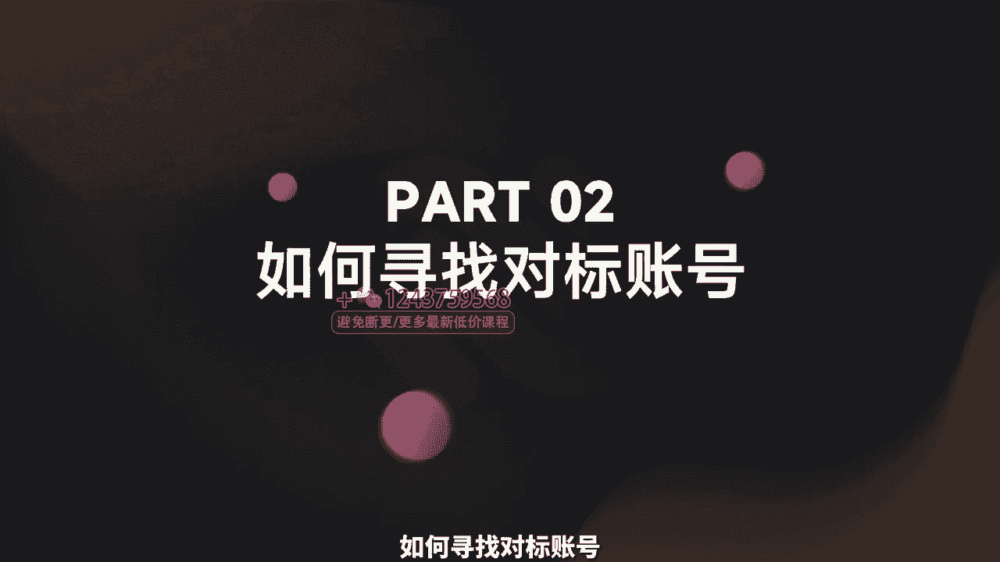
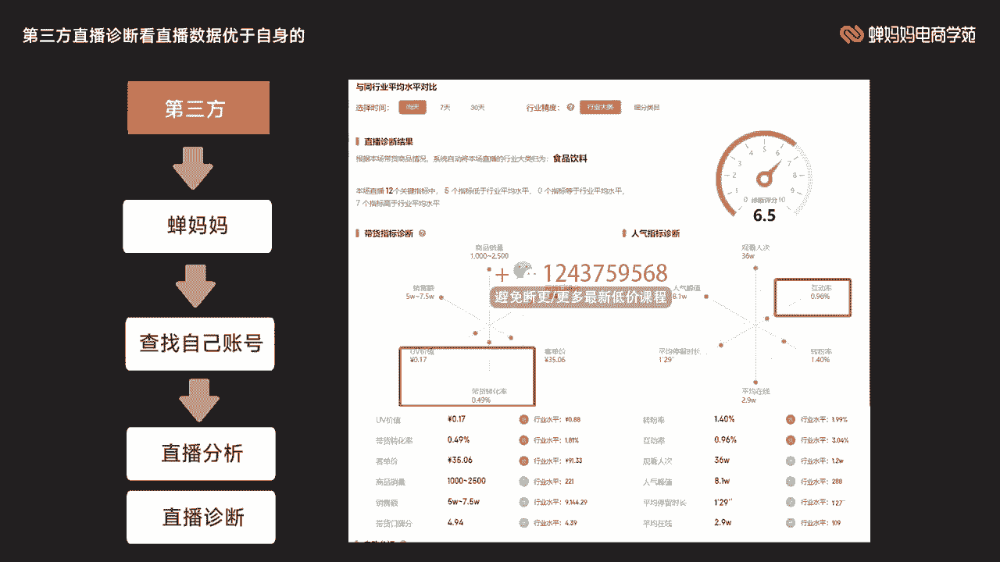
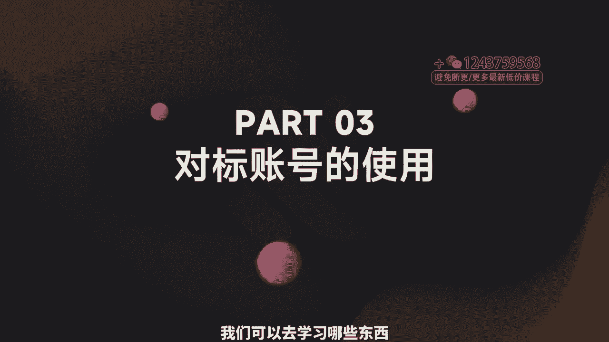
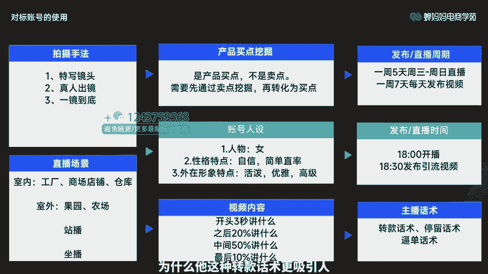
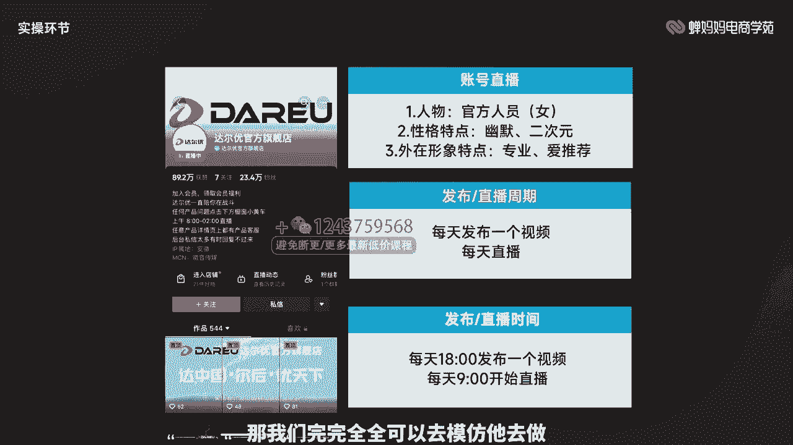

# 006 抖音电商-新手起号特训营，菜鸟变老手 快速入门 新手商家超全入门课程大全 - P4：4.【视频】对标账号拆解逻辑- - 早安睿睿 - BV1Q7421d71A

Yeah。

让直播电商更简单。大家好，我是馋巴巴电商学院的讲师宇浩。本次分享的课程是对标账号的拆解逻辑。那本节呢主要讲解的是对标账号的重要性。如何寻找对标账号以及对标账号的使用。比较适合基础比较薄弱的同学进行学习。

通过学习之后啊，能够正确的找到自己对标账号，并把这些对标账号优于我们自己账号的这些内容啊，加以学习使用啊，就掌握这部分技能就可以了。好，那我们接下来就开始我们正式的学习，进入我们本章的第一环节。

对标账号的一个重要性啊，那我们这边的话就是直接告诉就不给大家去做一些悬念啊，什么是对标账号重要性，就是通过对竞品的分析和模仿，寻找出适合自己又适合传播的表现形式，通过对比找出差异化啊。

首先什么是要找出自己适合这种传播形式啊。我就跟大家说，这这个内容有很多，我们去把这些竞品的这些他平时发布的一些视频也好啊，或者他去做一些直播内容也好啊，我们要看哪一种方式，或者说它哪一种类型的视频。

我们知道视频本身也分很多种啊，比如说一定到底呀，产品展示啊，真人口播呀，或者是配热门的。BGM等等方法非常多。我们要去找出具体的哪一种适合我们，而不是说我们这个竞对它做的很好，我们拿来直接用。

发现它并不适合我们这种情况下非常的多啊，所以说一定要找出。竞品做的好又同的同时又非常适合我们的啊，我们去发同步量内容，发现哎也都不错的这种视频啊。做这种事我们要去找到这种表现的形式。

然后我们要去找出差异化，看看我们平时发的一些那些视频和我们竞队发这些视频究竟有哪些差异，究竟是哪一个点出现了不同。导致我们进队发的这个视频优于我们找到这个点，然后进行一个优化啊，就可以了。好。

进入我们今天的第二环节，如何寻找对标账号？那我们这边呢给大家三个方向啊。

首先我们去搜索啊。打开我们的抖音平台，它上面有个搜索的这个界面，我们可以在这个位置。去搜你的行业也可以去直接搜这个产品。比如我是一个服装的，我是卖女装的，我直接搜女装也可以。或者说我女装里边。

我具体啊我是卖这个女性牛仔裤的，你既可以搜行业也可以去搜产品，然后看一下哪一个账号和你搜的这个东西，它是高度相关的。比如说排在第一的，肯定是有一定原因。他为什么他能放到他第一点，是吧？

人家U做的好人没对这个东西感兴趣，关键他的这账号的关联性强。这个时候这个账号你就可以进去看一看平时他的一些他的内种它的视频，他的直播，看看他的这有什么样的一些效果，他就可以作为你知这个竞对之一啊。

第二个就是找爆款商品的同类型账号。比如说我们是卖女装的啊，比如说还是一样，我们去举这个例子啊，服装的，我是卖女装的，我卖牛仔裤的，我直接去搜这个东搜这个产品啊，看看谁卖的好，卖的爆啊。

我直接去找他就可以了。还有第三个看各项数据优于自身的账号。那我们都知道啊，我们在直播或者短视频的过程之中，可一定会伴随着大量的数据，比如说我们直播过程之中，转粉率啊，互动率啊。

是不是等等这一系列的那我们当我们有知道自己的具体的一个值之后啊，比如说我们现在跟大盘做比较，我的互动率比较低。那我是不是就要去在找我同相同行业的过程之中，看看这个行业底下哪一个人做的比我好。

他的互动率很高啊，高于大盘。那我是不是这个账号就可以作为我竞对的东西，是不是找竞对就是找学习的对象啊。好，我们进入到我们的第一个啊统音搜索。那我们这边的话去给大家去举这样的一个例子啊。

产业、产品啊、行业话题啊都是可以去扫的。然后我这边还可以进行有一个筛选。比如说我们可以看一下最多点赞的是哪一条啊，是不是？然后我们可以在或者说我们可以规定时间内，比如说一周之内啊。

因为我们都知道我们去单搜这个最新发布的，他数据不一定很好，那我们就给他进行一个期限嘛，一周之内一天之内半年之内最多点赞的是哪一个啊，那下边的话比如说我们这个视频还可以根据时长啊。

是不是比如说我们擅长做长视频，那我们就找这个1到5分钟或者5分钟以上的这个筛选瀑布是吧？还有一些比如说搜索页面，比如说我已经关注了很多的人啊，或者说最近看过的呀，或者说没有看过的，是不是进行一个区分。

让你更快速的去找到这个视频啊，然后再去通过这个视频去找到背后的这个达人，他是最近是怎么做的啊。那第二个啊就是他专门去搜这个产品，看看哪个关联性强。然后我们可以看一下。

我或者说我们根据这个产品去看一下这个用户啊，是哪一个用户跟我们的产品关关联性比较强。以及最后一个我们可以看一下这个话题，看这个话题里面啊，点在里面比较多的是哪一个人。

那这个人我们就可以拿出来看一看他平时是做短视频还是做直播呀，是不是他什么几点啊，或者他发布的这个周期呀，都是我们可以去学习和参考的对象。好，我们来看一下第二种方法，就是通过第三方去搜索这个爆款。

然后看他的关联达人这个款它已经爆完。我们现在搜的具体的产品，然后我们经过一定的筛选，他现在已经是直播间销量件数的一个降序。他现在排到第一说明卖的最多。我们看到这个商品的只关联了一个达人。

说明他通过一个人把这个商品做报了。那你想想他通过他自己的努力，把这个产品做爆是不是就可以成为我们学习对象。他的短视频脚本内容，他的短视频拍摄手法。

直播间话术、主播场景等等这一系列是不是都是可以我们可以知道去学习的地方。那这个人就可以成为我们的竞队之一啊，所谓的竞队刚才已经跟大家说过，就是我们要去学习对象，我们看人家是怎么做的。然后先去模仿。

然后最后去找差异化，然后最后的一个超越。很好，那我们先来看看看第三种这第三种方法啊。一样通过第三方啊，长妈妈这个平台，它可以有这样的一个功能，它可以看到你具体的直播，然后根据你的直播啊。

它有一定的具体的一个诊断啊。我们看一下这个诊断的一个结果，它会呈现出这样的一个一个图片，它是会有这样的一个具体的数据。它会告诉你在整场直播过程之中，和行业大盘做对比，你有哪些数据是优于大盘的。

又有哪些数据是远低于自己大盘的那我们接下来看一下啊，它这场整场这个直播过程之中，它的因为价值带货转化率、客单价、转粉率互动率这两个这几个部分全部都是低于行业大盘的。

那么很好啊。你不说我这些这些数据做的不好吗？很好，那我们现在就根根据这个他这个坐标轴，我们来看一下啊，我们把它的这个横坐标轴就放到我们的带货转化率。因为这个低一吧。那竖标坐标轴的话，我们放到互动率上。

因为这两个点远远都是低于大盘的，通过这样数据进行一个对比啊，整个他的这个象限往右上角以上的全部都是可以我可以值得学习的啊，因为在这个右上角啊这一条线上画过的每一个人。

他不光在带货转化率还是互动率上都优于你啊，那你想想他是一个什么样的概念，同样的一个直播间，他有两项数据优于你他是不是可以成为你的学习的对象。那这个人是不是比如说他的做带货转化率远远高于我。

我就要去掉他的直播间看看他的短视频啊，通过他的直播，我们来看一下他的转款话术是什么样子的？他的B单话术是什么样子。凭什么他卖他就卖的出去，我卖卖不出去是吧？那我们在同样啊也一样是互动率这方面。

我们看比我们做的好的这些。账号他们是怎么跟用户互动的？他提到的哪些点是互动反响最比较激烈的啊，那这些我们都可以拿下来作为参考啊，找到这样的对标账号，我们进行一个学习，查缺补漏，让我们的直播间啊。

更上一层楼。好，我们现在来看一下啊，我们对标账号找到了之后，我们可以去学习哪些东西。那刚才给大家已经做了一些数据上的啊，具体数据的纰漏，我们已经看到了。

比如说具体哪一个率转化率转粉率是不是带货转化率不如人家的那我们可以去找这样的对标账号去学习。那除了这一些和行业大盘可以做比较的，其他的东西，我们又应该去如何去学习呢啊，或者说有哪些点我们可以学习呢？

那我们来看一下这张图有哪些地方是可以我们可以学习的。

竞对的拍摄手法，竞对的直播场景，竞对的产品买买点挖掘产对竞队的账号人设，竞对的视频内容，竞对的发布直播的一个周期，或者发布直播的一个时间，发布短视频直播的一个时间，以及最后的一个主播的话术。明白吧？

大家看一下等等。这一上面全部都是我们可以去值得学习的。什么是拍摄手法。简单来说啊，就是比如说我他这个视频是拍的特写啊，还是真人出镜啊，还是一镜到底啊，他为什么这么拍，他的视频火了。

你是不是可以去进行一个参考，大家卖的都是同一款产品，福利待遇也都差不多，售后情况也都一样啊，那凭什么他这边他就卖的出去。但是因为人家视频内容做的好啊，人家这个用户一看到这个视频就感兴趣。

感兴趣了之后又了解的产品产生信任感，就就进行购买啊。看你的视频，您的视频拍的不好，我连兴趣都没有，就不会有后边的一系列的动作。直播间场景也一样啊，他凭什么他他这个直播场景，他毕竟有优势，他是在工厂拍的。

你也一样啊，你也可以去找一个工厂啊，是不是并不一定说我们这个产品一定是源头工厂生产，没有什么什么中间商啊，又为什么没有什么二手价呀，是不是但是我们又没说我们只是在这个就是给用户这种吸引暗示，明白吧？

通过场景可以对用户进行一系列的吸引暗示，我在果园里边直播。我我卖的产品就一经是个果园产的嘛，是不是也不一定。但是直播间场景我们完全可以看一下我们的竞队，他们是如何进行操作的。

我们可以去学看一下他为什么把他把直播间设计成一个货架的形式，或者说他干脆就是专门去做这种户外的直播。接下来就是产品的买点挖掘，大家先注意一点，是产品的买点，不是卖一点。我们需要先通过买点挖掘。

再把它进行转化啊。所谓什么样是买点？现在我们就拿一个手机来进行一个举例。那买点。买比如说这个产品的卖点，就是我这个产这个电池啊续航很时间很长，是不是我可以一可一口去用20天，这是你的卖点。

那你现在要转换成用户的思维去看用户为什么？因为我对这个东西有刚需要，我经常出差，我没地方经常啊去进行充电啊，充电宝太贵，那我肯定会选择一个大容量的手机吧，是不是你要把你的卖点转化为买点进行使用。

比如说一个燃气灶啊，我们这边想去重点突出，就是它的火力旺，用户说买这个东西，他买什么火力旺啊，他就是想看看这个我炒态速度快啊，我这个这边一进去哎菜一进就熟了。

那我是个整整个它这个用它的这个时间是不是就会缩短，节省它的时间去做别的事情，对吧？我们需要把你的产品并不一定是用你这个产品做出来了啊，他的买买点卖点会非常的多，你会把它一定要把它转换好。

把它变成用户的痛点，是如何通过挖掘用户的痛点，而你的产品可以正好去解决用户的这个痛点，那你的产品。能够解决用户的问题，那用户肯定会对你的产品进行购买，对吧？接下来就是账号的人设，我们依然可以去学习啊。

凭什么呃比如说我们现在就是完全卖同一款的商品啊，我们卖口红，我们这边是一个人设的，我们定位的是一个经常给女朋友买这些口红化妆品的一个男性的角色，但那边的话，他直接就是经常使用化妆品的女性角色，对吧？

它是完全不同不同的两个角度出发的一个人设，那我们如果说他这个这边卖的很好，而我们这边不同意的话，那我们是不是就要去学习一下人家这个人设为什么要去这样去进行一个设立。人家的出发点是什么是吧？

以及最重要的就是我们的一个视频的内容，我们这个视频，大家我其实看了很多大家去拍的视频，很多地方都是跟我们的竞对很相似，但又完全不相，完全不一样的，是不太可能的哈，我就跟大家说，就是相似。

你相似的东西不太一样，你的拍摄手法超了哦对了啊，那就是你这个主播脚本内容设置的是这个视频内容脚本设置的就不对啊。比如说你开头3秒。人家去做的是产品的细节展示，你也去细节展示啊。

但是你展示的效果就不如人家好。接下来人家这个之后的20%又去讲用户痛点，你又去做一个产品展示啊，最后人家中间5%讲中间50%去讲这个产品的出现如何去解决用户的痛点。而这个时候你去做啊用户痛点都有什么。

是不是你就本末倒置啊，你的整体这个脚本的这个结构就超的不对。所以说我们需要去看一下你的脚本设置前几秒为什么要这样去设置，中间又去做了什么样的动作达到最后10%。

那最后10%肯定是既然我的产品已经解决了你的问题。那你为什么不心在购买，对吧？以及发布直播的一个周期啊，比如说我们是两天一播那我们的竞队啊，每天都播，是不是？

那我们是不是在这个上面可能就要去进行一个学习啊，或者说我们大家都是播5天，我播周一到周五全部都是工作日，我的竞队呢，从周三一直播到周日啊。

但我们都知道周一周二的时候是更好这个咱们这个工打工人都是比较忙的一个时间，是不是他在周三周四周五的时候，哎，或者说他完全是在的休息日的时候，他有更多的时间去玩手机，对吧？

那我们是不是这个时候就要去看看人家是怎么做的啊，以及咱们直播的时间啊，那我们都知道用户玩手机的时间段，就那么几个，你偏偏挑用户比较休息的时候，哎，你偏偏挑用户比较忙的时候啊。

你就10点到12点进行一个直播，那没有人看，那肯定是不好的嘛。那这个时候我们就研究一下用竞队他到底在什么时间段的直播啊，看看他这个时候，为什么他卖的比你好。以及最后的我们的主播话术。

那当然转款话术天6话术B端话术，每个直播间设置的可能不一样，甚至他们的比重也不会也不会有相同的对吧？比如说他的转款话术只有20%，天留话术只有20%，B站话术它有60%，他都重点放到他的B单上。

因为他的产品很好，那他最后的话就要进行一个B单。那这个时候如果说你自己的产品啊达不到这样的水平，那你这个时候你就可能就参考一下，人家是怎么做的？为什么他把他的B单，他的转款啊设置这么低，最后设置那么高。

你的产品是不符合这样的情况，或者说你的产品和他的产品完全一致。那这种这种这种话术上的一些设置，或者说具体啊什么他的转款话术是什么样子的啊，为什么他这种转款话术更吸引人，都是我们值能去学习的地方啊。

那我们这边的话就给大家去进行一个实操环节，看看这个拍摄手法、产品卖点挖买点挖掘啊以及视频展案是如何进行展示的。好，这一张呢就是就是不跟大家去做这个啊学头巴脑的。

这是正经八百达尔游他们官方旗舰店的发布的一条视频。这条视频，我们看着是平平无奇，对吧？但是这条视频，它的点赞和转发都很高，屏幕量量也很大。那么这个时候我们需要去拆解一下。

看看这个视频我们现在找到这个进对了，视频我们也看到了，我们如何去学习，你看一下他的拍摄手法是什么？他的产品买点发掘是什么东西，对吧？比如说他的卖点是他的布丁键膀RGB灯光加成四档调节，这是产品的卖点。

那用户为什么为他的这个产品的卖点去买单呢，是不是变成他的买点，因为它的手感好，他的灯光柔何不晃眼，而且它的选择性给我非常多，他是有四档的调节，对吧？肯定有一档是比较适合我的。

最后他的视频文案展示产品的细节呀，键盘整体的一个变换呢，灯光呼吸它，是不是等等这一系列的，我们把这一系列全部都去模仿好，找出差异点，看看为什么人家这个视频流程。下来拍下来下来之后受这么多人的欢迎。

你的视频拍下来之后，没有人去看。好，我们来看第二个部分，就是他的整体的这个账号直播这个设置。她的账号直播就是官方人员啊，她这个就是她的人设就是一个女孩子。但是她们官方的她的形象性格特点呢就是幽默。

也比较二次元，是比较符合这个电竞这个气质的是吧？外在形象特点就是专业啊，平时就做一些电子设备上面的一个推荐啊，那发布周期和视频。比如说她每天都发布一个视频，每天她都做直播，每天下午6点发布一个视频。

每天早上9点她就开始直播啊，这都是她的一些设置，而我们是可以通过她的设置去了解她为什么这么做，以及她这么做带来的一些成果是什么样子的。如果说她在这上面做的比我们的好，那我们完完全全可以去模仿她去做。

对吧？

好，这就是他的一个直时的一个直播的一个画面，它的直播场景，它是室内的坐播。它这个直播间场景呢前排大量的展示剧产品，展示的全部都是产品，后边呢它是一个绿幕啊，他拍的是什么产品的这个展示细节。

他去敲这个键盘黑的后边这个黑色的这个部分，它去进行一个展示。那这个主播话术呢，它是引流能力特别强，但是互动不是很好啊，那互动能力我们就不学嘛，是不是我们去找互动能力更好的一些账号去学习。

但是他如果这个账号的引流能力非常的好，那我们就要去学一下它的引流话术，或者说他的短视频是怎么拍的，是吧？那这些已经在数据层次上证明比我们好，那我们就要去学习。因为这个已经是铁打事实了，对吧？好。

到了本章那个课程小结这个部分，让我们一起回顾一下本节课的重点内容。第一个对标账号的重要性。第二个，如何寻找对标账号。第三，对标账号的一个使用啊，建议大家在学习之后可以去尝试去找自己的对标账号。

找到之后去找这个我们值得我们去学习这个点啊，再给大家去动进一个总结啊，懂比对标账号的重要性，对标账号的重要性就是分析和模仿竞品，找出适合的表面形式，同时找出差异化。就是我们要去找这个对标账号啊，找它啊。

虽然它做的好，但我们不一定做得好，我们先把它所有好的地方全部都学习之后，我们进行尝试测试，看看哪一点适合我们。第二个啊去如何去寻找这个对标账号，我们可以通过搜索的维度啊，爆款商品达人的维度啊。

以及数据对比的维度，通过这些维度找到这些达人比我们好啊，凭什么他们能做报，我们做不报，凭什么他们的视频点击率高。凭什么他们的直播间卖货卖的好，带货转化率高是吧？这些账号我们已经找到了，我们要去学。

学习他的拍摄手法呀，他的直播场景啊，他的产品买点挖掘啊，他的账号人设啊，他的视频内容发布周期、时间以及主播话术。甚至说到直播里面了，或者说到短视频这里面，我们要看到具体数字是吧？他的短视频停留啊。

是不是他的直播间停留啊，他直播间转化呀，他们直播间的互动啊等等这一系列等等的这些数据啊，他凭什么比你好啊，我们光知道这些比你好还不够，一定要知道为什么。这个时候我们要回到他的直播间和短视频内容之中。

一点点去做拆解。我们可以我们作为新手账号，前期可以先模仿，明白吧？模仿到8九不离十啊。你的直播间短视频啊都在正常的一个运转的过程之后啊，我们可以去考虑做差异化，看看有哪些点是我们能够给到的更好的。

比如说咱们现在的产品，咱们直播间短视频都一样。那我发现我的售后能力比较好。我的客服响应速度更快，那就是我们的差异点。我们也可以把这个差异点在我们的短视频和直播过程之中把它渐渐的去放大啊。

看看他这个这一点能不能打动观众人我有人有我优吧，是不是只有通过这样的差异化，才能让我们超越我这些学习的这些对象。好，那本节内容呢就分享到这里，感谢大家。😊，Yeah。🎼。

