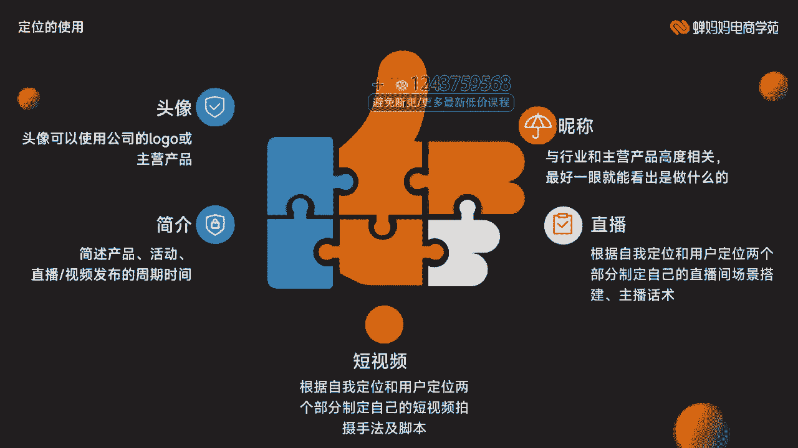
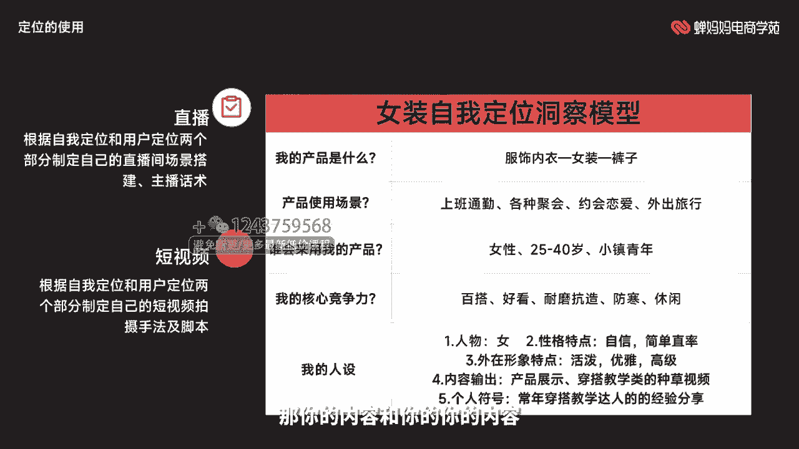
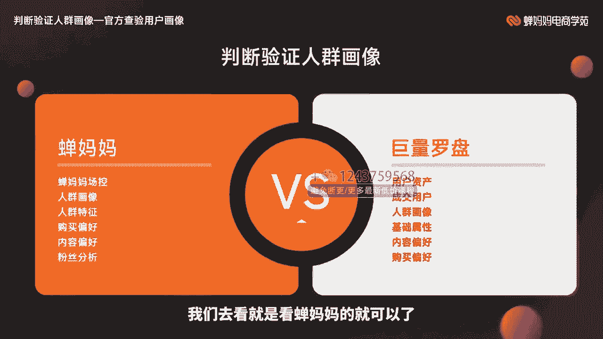
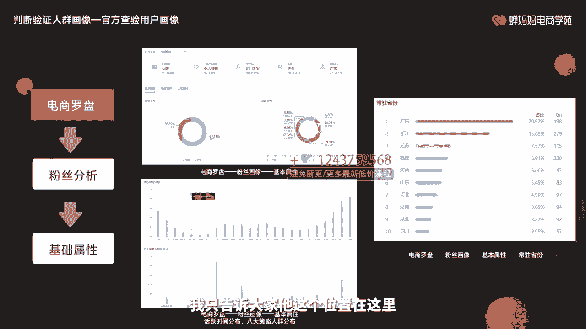
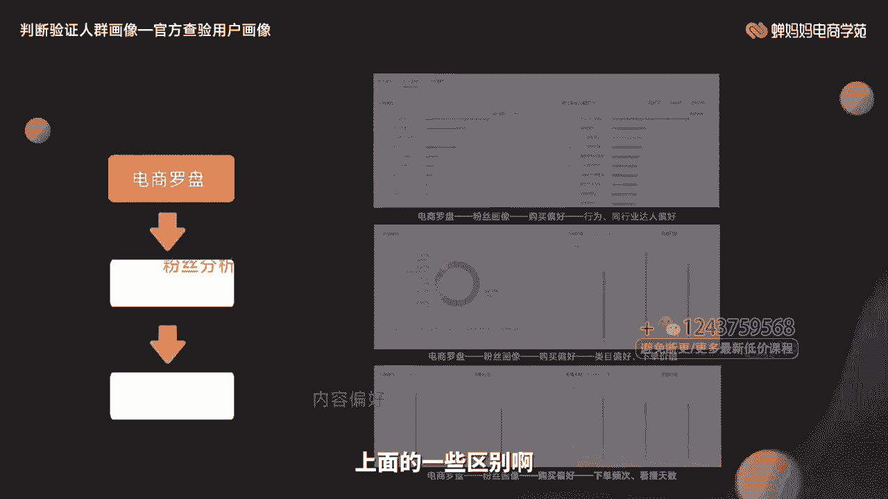
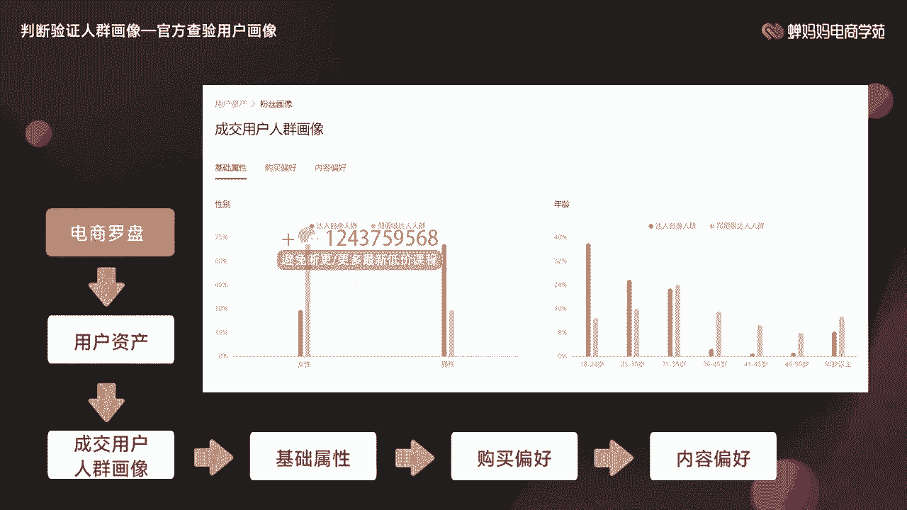
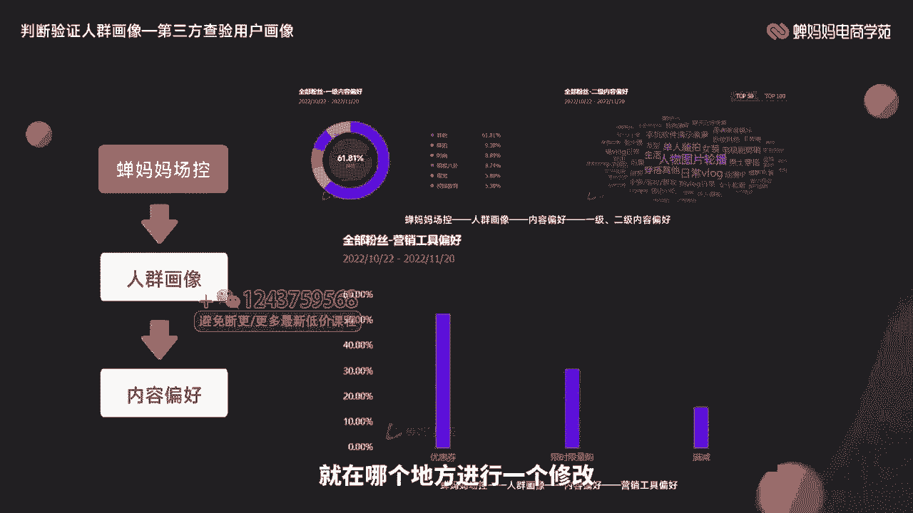
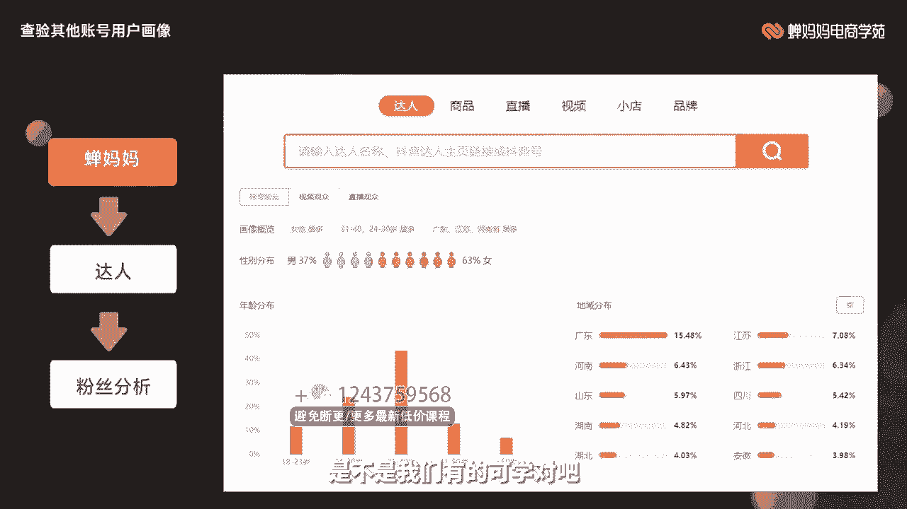
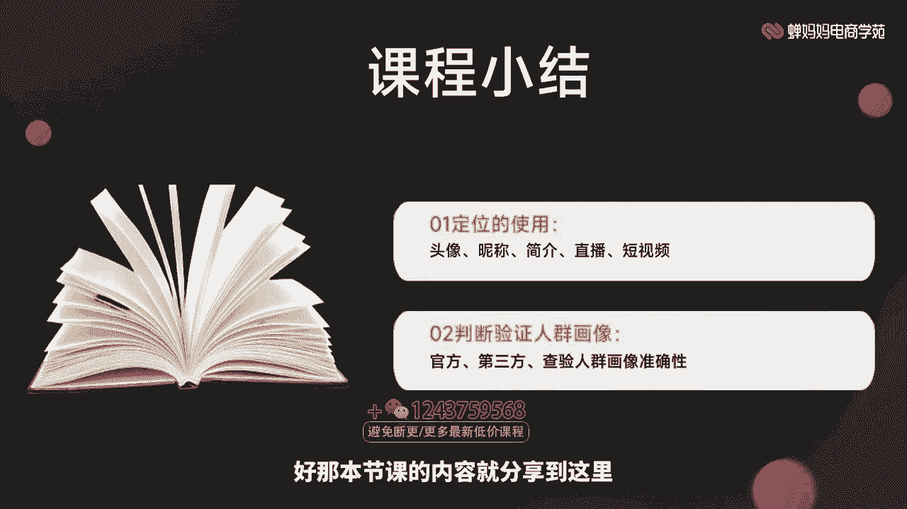
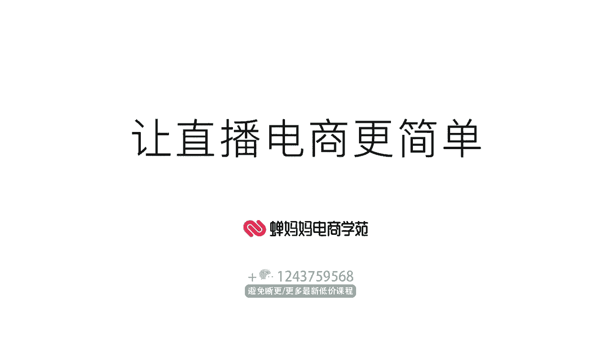

# 006 抖音电商-新手起号特训营，菜鸟变老手 快速入门 新手商家超全入门课程大全 - P5：5.【视频】账号定位实操检验指南- - 早安睿睿 - BV1Q7421d71A

Yeah。

让直播电商更简单。大家好，我是长巴巴电商学院的讲师雨浩。本次分享的课程是账号定位实操的检验指南。那本节呢主要去讲解定位的一个使用，以及我们使用这些定位之后，如何去检验人群画像是否相符。

我们这些定位有没有偏差啊，比较适合基础有些薄弱的同学进行学习，通过学习之后，能够熟练的去使用这些定位啊，并根据这些定位去判断我们人群画像有没有歪啊，就可以了。掌握这项技能就可以。

那我们接下来开始正式的学习，进入本章的第一个环节，定位的使用。首先啊我们刚才给大家去去给刚才这些课程给大家去介绍的全部都是一些。比如说人设定位啊、自我定位啊等等。

这些全部都是规划类的那我们如何把这些定位可以实际应用到咱们的账号上呢？这里边有5个点啊可以使用。第一头像。第二昵称。第三简介第四直播。第五，短视频。这5个地方都可以去体现出你的规划，你的人设定位。

你的自我定位是什么样子的？首先是头像。头像建议可以大家使用公司的logo啊，或者说是使用产品的这样的一个图片啊，加强用户对我们的这个认知度。昵称呢就是与行业或者主营产品高度相关。

最好能够一眼就能看出来你是做什么的，不要去起那些歪门邪道的这些昵称啊，或者说是起一些谐音梗。用户对你这个认知的成本是非常高的，他可能记不住就拜拜了。接下来就是简介。我们可以在这个简介过程之中啊。

大家我可以看到很多人在简介的地方就瞎写乱写啊，比如说什么欢迎大家来到哪哪哪哪啊，谢谢大家的关注啊等等这一系列的，全部都是客套话，通过你的简介。

我什么都不知道用户这个简介就是可以快速让用户知道你是做什么的啊啊，然后我们这边的简介都可以去使一些简述你的产品啊，或者说你现在有什么样的活动啊，直播视频发布的周期和时间啊，我通过你的简介。

我知道你是干什么的，你卖什么东西，你什么时候去做直播或者发布短视频，我可以看新的这些东西啊那用户对你这个表入指掌了之后，那自然而然就是你发布短视频，他就会去看你做直播他就会来你的直播间是吧？

那接下来短视频和直播这两个部分啊，详细去说一些短视频可以根据你的自我定位和用户定位两个部分制定你的短视频拍摄脚本及手法，明白了吧？你定位好了之后，你不知道拍你就知道去拍什么样的内容去吸引用户嘛，对吧？

😊，直播也一样，根据这两个地方去置办你的直播间场景搭建，以及你的主播话术啊，简而言之就是说我们可以通过这两个部分的定位啊，让你更加的了解自己，更加的了解用户知己知彼，知道他们喜欢什么东西。

知道你的产品可以满足用户什么样的痛点，你把它这个结合去打造你的短视频和直播。那你说用户能不喜欢吗？那喜欢吗？那你这些各项的数据是不是都上什么流量也增多了，他也会对你提前购买，对吧？

那我们这边的话就给大家去举这样的一个例子啊，大家可以看这三个三个图片啊，看你看我们首先小沃宝藏士多，我们可以你说说我们通过他这个短拆这个名字，我们能知道什么内容，什么也不知道这什么东西。

但是哎我们去看一下这个旗舰店或者是办房生活啊等等。虽然说他们这个认知成本也比较高。但是说我们一看这个旗舰店，我们知道他肯定是卖什么东西的，对吧？或者办房生活，我们先第一印象，哎。

是不是想要去做一些家具啊，对吧？那我们来看一下，他去这个他这个简介这个部分又是怎么写的那第一张图片，他去解释一下士多是什么？就是store啊，他就是分享自用的一些好物礼物。他这个这个简介他写的不错。

他突出了自己的一个产品啊，我就平常就是去分享一些礼物的啊那你可以比如说你要去做一些什么样的啊想要去给别人朋友买一些什么样的礼物，那你可以去关注这个个人审美求同存异，这个就我不建议去说了。

因为没有什么太大意义，都看到这了，还不点个关注，引导用户进行一个关注啊，他这个简介做的也还可以，我们来看下第二个他是从什么他是做纸质品的那我们现在我们已经知道从工厂到您家他是工厂直销。

没有二手货源可能会便宜，用户的印象，没有逐间上去赚差价啊，最后一个认在维达梦享全家是他的一个logo加强用户对他的一个认知程度以及最后一个办房生活我是亲子很开心遇到你遇到我遇到办房巴拉巴这些哎没什么用。

我们就不要去写这样东西作为十年美食家居品牌的主。很好，他把这资质背书他拿出来了，他有着一定的说服力，希望把美好妈妈的生活方式分享给大家。叉叉没必要说你的短视频已经去说替你去说了。那除了办公资源的。

他是这些具体的家居用品，还有更多的一些什么品牌监货啊等等，一经列他有两行的数字啊，但告诉大家，我还有别的内容可以给大家展示具体什么内容还没说。也不止买买买，关注还可以啊。那大家知道了。

最后一个他是一个关注，但是他的简介写的不是很好啊，接下来就是他的意啊头像啊，头像这个部分大家去看一下。第一个它是一个人物的一个头像，第二个是品牌logo，第三个也是一个很皮牌品牌的logo。

通分的三个对比，我们对第一个印象，我们这什么一个男人，一个男生还是什么，具体的还是一个女生根本都看不清啊。那我们面对这样的话就没有什么太大的印象第二个哎，维答啊是吧？第三个办房我一看就看出来了。

那我们这个的话，他这两个头像设计的还是不错的。接下来就是直播短视频啊，那我们来看一下啊，首先啊你装自我定位洞察模型，这个之前也给过大家我的产品是什么？我的产品使用场景，谁来使用我的使用产品啊。

我的核心竞争力，我的人设是不是灯画这些定位你全都拿到手了之后，哎，这些用户什么样的形象，他们喜欢什么样的产品，你都不了如指掌啊。那你的内容和你的你的内容，你的短视频，你的直播间是不是都知道该怎么去做了。

对吧接下来教大家去判断验证人群画像的精准性。我们这些定位啊、昵称啊，或者说这些东西我都规划好啊，我也都设置好啊。那这个用户到底有没有按照我的期预期去发展呢？他有没有是成为这样的，我这个标签有没有偏啊？

我这里面定位的人群到底精不精准呢？这节课告诉大家。

首先我们给大家两个方式啊，就是首先咱们的官方就是巨量罗盘可以去看。第二个就是第三方人群的画像啊，我们去看就是看茶吧吧的就可以了。首先给大家去看电商罗盘啊，它是哪一个地方，它有一个粉丝分析。

它有一个基础属性的一个分析。大家可以先看一下，我们可以从它的基础分析基础属性里面可以得到什么。一个咱们的一个性别的一个占比啊，年龄层次的一个分布啊。

是不是以及它这个八大策略人群到底是哪一部分的一个人群啊，是不是这部分人群的活跃时间又是什么？长处的一些地域省份又是哪些，哎，这是一些基础的一些定位的画像。那你在做的这个过程之中，你就可以检验你的画像啊。

看看有没有按照你的预期进行发展。我只告大家的这个位置在这里，你可以去检验一下你的基础插项，基础画向有没有发生偏啊。那接下来电商罗盘还可以看什么还可以去看你的内容的偏好，我们可以看一下的行业偏好。

同行业人群偏好是不是类幕偏好，下单价值等等这一系列下单频次等等这一些全部都是。

属性里边的延展啊，看看你的画像究竟是什么样子的啊，那这里边还有它的一些购买偏好和内容上面的一个偏好上面的一些区别啊，比如说我们的这边可以去看一下成交用户的人群画像是什么样的。

他的基础属性、年龄是不是等等一系列的啊，通过这些去判断啊你的人群画像有没有按照你的预习进行发展。

哦，我们接下来去讲一下茶妈妈场控这个功能啊，它也一样判断的是人群画像和人群上面的一个特征，一样可以看性别的一个构成年龄的分布以及常驻的省份。用户活跃的时间，以及最后八大人群策略的一个分布啊。

他可能比官方好，就是他这些所有的数据都在一页上展示，不用去每页再去翻啊啊，官方的就是比较复杂一点，但是就在各个不同的一个频道上，你要每个去翻。那第三方的话就会把所有的数据啊，尽可能给你在一页上去展示。

那这个时候呢不光有这些购买偏好，是不是啊还有一些行业的偏好啊，同行业达人偏好啊，跟刚才我们看到的官方的数据是一样的啊，那我们接下来大家可以去看一下这相类幕的偏好啊，看播天数啊。

你的粉丝看你直播看了多长时间啊，下单的频次啊，下单价值啊等等，这些就跟官方一致了。只是说他第三方好在哪里呢，好的就是这些所有的数据呈现都在一页里边，让你能够轻松的找得到啊。

那我们这边的话也可以看一下我们上面的一些内容上面的一些偏号。比如说这部分人群啊，喜欢时尚啊、明星啊还是萌宠啊，校园教育啊，是不是还有一些，比如说他们这个关于文字上能够给到大家的一些啊日常的Vlog呀。

图片的文播呀，随拍呀女装啊，看看他们内容到底是喜欢哪一个部分的。以及最后的营销工具偏好啊，这个就是官网上可能就会查查的会比较严一点啊，可能就是你找的话，找半天，你不知道在哪个自三方好处。

就是都可以清晰的呈现给大家啊，那这部分人群哎他就是喜欢优惠券，你也别给我搞那个满减啊，满100减50啊，我还得凑你这个100啊，你是不如直接给我去发放的优惠券啊，你就直接告诉我便宜多少啊。

满足多少的条件可以使啊，用户对于他这个营销工具的偏号，他我们这边的话有时候给大家进行一个纰漏优惠券大于限时现象购大于满减啊，大家也可以去看一下，检验你的人群画像是否按照。预期进行一个这样的一个发展。

如果说你的人群画像啊，根据跟你自己的预期发生了偏值，哎，发现了偏啊不一样了，那你就要进行一个及时的调整。当然我们去做调整的前提是。这么没有，虽然没有按照你的预期，但是啊它能够给你带来收益。

而且这个收益你是比较满意的。它能够满足你日常的一个开销，或者说是咱们能够有一定的盈盈利，那也是可以的。但是如果说他既不满足我们的人群画像，不按照我们的预期发展，也不会给我的直播间带来这么多的收益。

那就抓紧时间进行调整啊。哪个地方偏了，就不在哪个地方进行一个修改。

那第三方呢还有一个好处就是不光可以看自己，我们也可以看一下其他达人，可以简单的看一下他的账号粉丝的一些基础画像啊。我们也以看看我们比如说我们现在想要学习竞队了。

那我们可以看看竞队的这些他的这个账号下面的一些基础的画像，男女比例是一个什么样的分布，是不是我们有的可学，对吧？

那这边的话给大家进行一个课程的小结。那我们一起回顾一下本节课的重点内容，两个部分，定位的使用，以及判断验证人群画像是否精准。首先，定位的使用呢就是头像昵称简介直播短视频等等这一系列啊，给大家讲过啊。

通过这些地方可以去使用你定位。那判断验证人群画像呢那官方第三方查验人群画像的一个准确性啊，看看你的人群画像和你自己心目中的预期是否发生啊，这个偏差如果有偏差就抓紧改。当然偏改的前提是啊。

它并不能为你创造收益，并不并不能为你的直播间买单啊。好，那本节课的内容就分享到这里，感谢大家。

🎼。