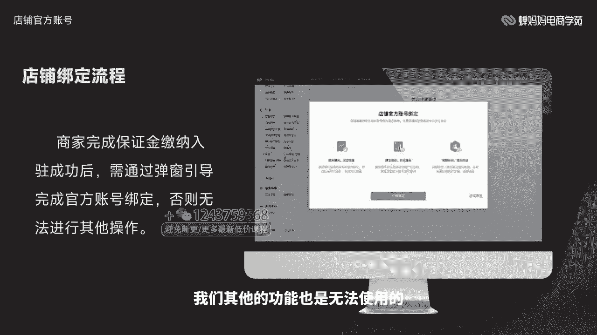
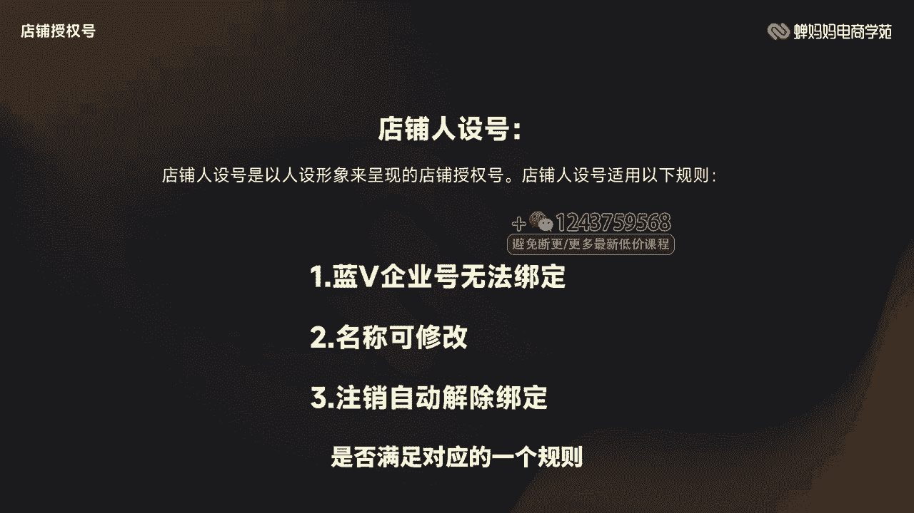
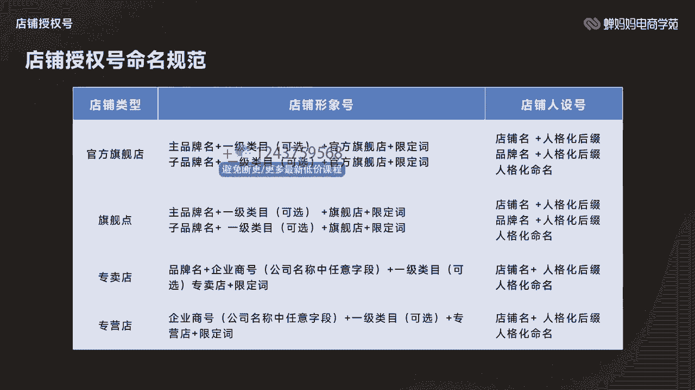
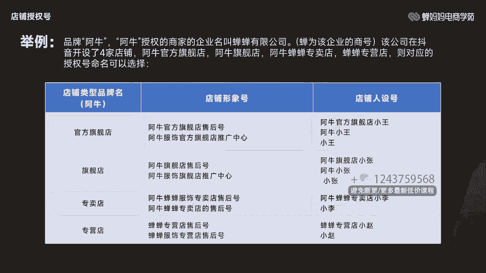
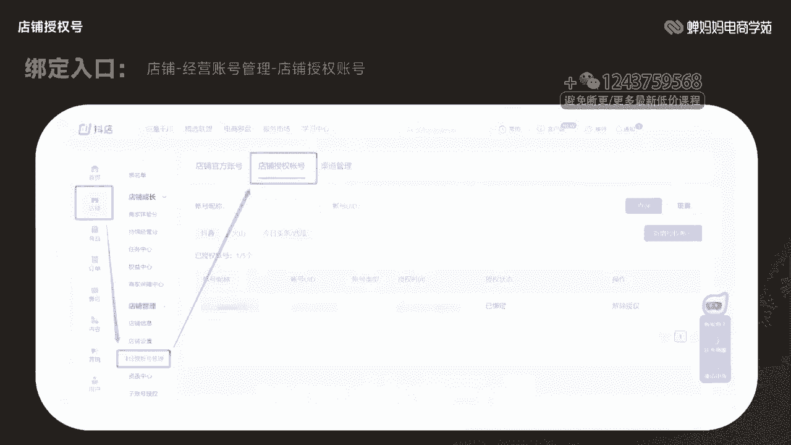
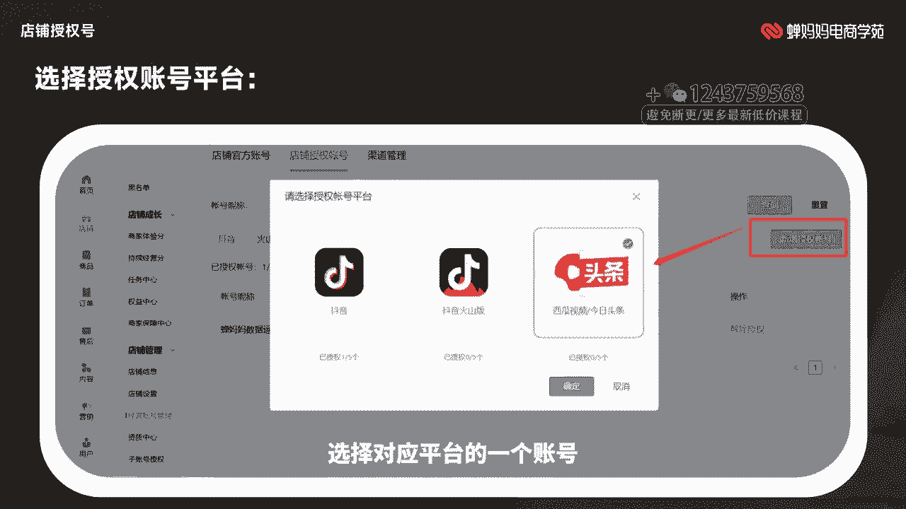
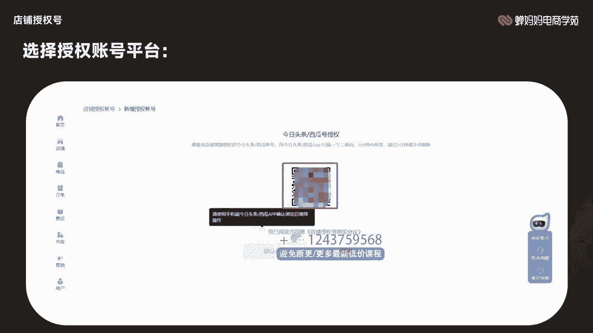
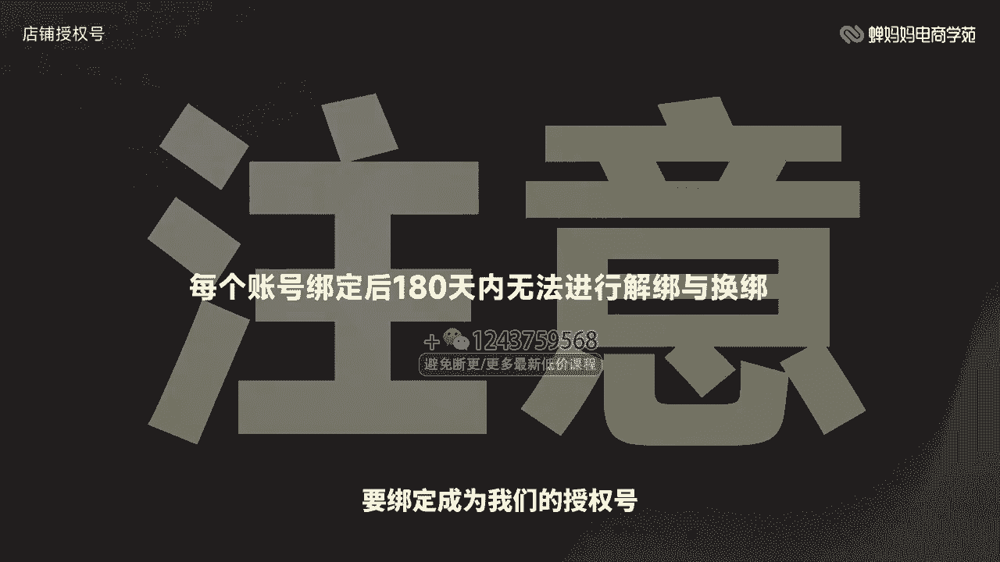
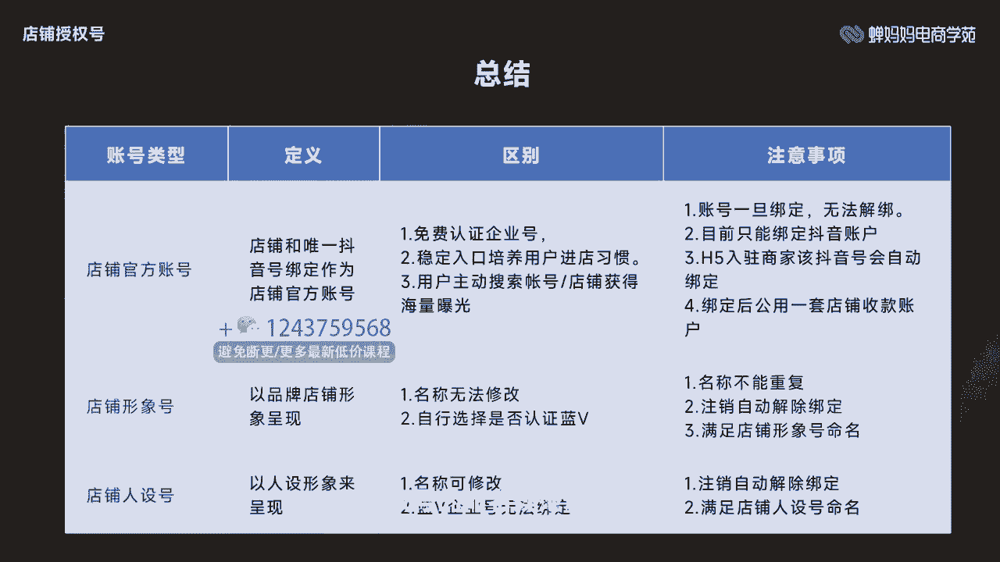

# 006 抖音电商-新手起号特训营，菜鸟变老手 快速入门 新手商家超全入门课程大全 - P6：8.【视频】官方账号和授权号的区别- - 早安睿睿 - BV1Q7421d71A

让直播电商更简单。大家好，我是常妈妈电商学院的讲师一凡，擅长抖音店铺运营策略，主研抖音商城玩法，拥有丰富的抖音店铺运营管理经验，同时也获得抖音电商fact的经营认证。

那本次分享的课程是官方账号和授权号的区别。本节主要讲解抖音官方账号和授权号的区别，比较适合抖音商家以及达人同学学习。那通过本次的学习，能够了解我们官方账号以及我们授权号的注意事项和账户类型。

那接下来我们正式开始学习。

那第一节我们来讲解我们的店铺官方账号。

那什么是店铺官方账号呢？那店铺官方账号，就是我们店铺选定唯一的抖音号与店铺进行绑定。那作为我们的店铺官方账号，我们可以从图中很清晰的看到我们的常妈妈的官方账号底下是有一个进入店铺的一个字样。

那绑定完我们的官方账号完以后，通过我们抖音账号进入店铺就可以直接进入到我们的经营的店铺里面。那这个的主要功能去实现我们抖音账号和店铺实现一体化的关联。

那同时在我们的消费者用户这边也可以去增强我们一个店铺的概念。那我们如果想要买东西的话，我们搜索常妈妈的店铺，以及我们的抖音账号都可以去实现一个购买的一个链路。所以我们店铺账号的主要功能。

就是实现我们店铺和我们的抖音号进行一体化。店铺绑定的流程相对来说也比较简单。我们通过我们的平台的保证金缴纳入驻成功完以后，我们通过弹窗的一个引导，我们就可以完成店铺官方账号的一个绑定。

那如果我们不进行绑定。我们其他的功能也是无法使用的。

作为我们的店铺官方账号，官方也给到了我们账号的相对权益。比如说我们可以认证我们的企业号，然后它是自动免费我们每年600元的一个企业栏为认证的一个费用。那同时它也是可以去培养我们用户册进店的一个习惯。

那同时用户在搜索我们账号，还是我们店铺都可以获得相对应的一个曝光。那这个就是对于我们店铺以及我们账号的权益。那我们需要注意的是，我们的店铺官方账号，它如果一旦和我们的店铺进行绑定了，它是无法进行解绑的。

所以我们在绑定店铺前一定要三思，以及我们需要去选择好我们的一个店铺抖音号才能进行一个绑定。那我们在绑定官方账号的时候，目前是只支持我们的抖音账号绑定为我们店铺的一个官方账号。

那比如说我们的什么头条西瓜呀，它是暂时不支持绑定的那如果我们是通过抖音H5入驻的商家，我们在入驻成功以后会直接把我们的抖音账号绑定为我们的店铺官方账号，这个就需要大家在入驻的时候。

明确一下我们入住的一个路径在哪里，再去选择我们对应的一个流程。那官方账号绑定完以后，我们的该抖音号就会和店铺共享一套店内的一个资质以及收款资质。因此。

我们的抖音账号带来的收获的收入都会结算到我们店铺的里面。所以我们不用担心说我们的抖音账号的钱会在我们自己的抖音账号上，它会直接结算到我们的一个店铺里面。那第二节我们来讲解一下我们的店铺授权号。

那什么是授权号呢？那其实很简单，授权号就是可以实现我们零粉开播。那什么是店铺授权号呢？它是能够实现我们的商品在不同平台上面进行一个售卖。那我们可以直接看到图中，我们的馋妈妈旗舰店。

它是可以在我们的今日头条抖音火山版，以及我们的西瓜视频和抖音进行一个分发售卖的。所以我们可以直接去选择对应的一个账号来进行设置，成为我们店铺的授权号。那我们授权号也是有相对应的一个开通资质的。

比如说我们的官方旗舰店，我们的旗舰店专卖店和专营店，它是对于我们授权号开通资质是没有要求的。等于说我们在抖音、西瓜头条以及抖音火山版分别可以绑定为4个呃账号。那同一个账号。

它不能同时绑定为我们的店铺授权号，又绑定为我们店铺的人店一体的官方账号。所以这个是不可以的那还有一个就是我们的一个抖音号只能仅支持被一家店绑定为我们的店铺授权号，就等于说一个抖音号。

它只能绑定为一家店的一个授权号，不能绑定为两家店。所以这个也是需要我们商家在设置授权号的时候，需要注意的一个点。那以及我们针对于企业号和个体号，目前也是新增了我们授权号的一个类型。

那我们需要的门槛是我们的体验分需要大于4。0，以及我们的店铺官方账号的粉丝必须要大于等于1000粉。那同时我们被绑定账号的一个粉丝数量也必须要满足在1000粉以上。就等于说我们如果是企业店和个体店的。

我们官方账号必须要满足在1000粉。那作为我们企业店个体店的授权号。那我们也需要去满足在1000粉以上。那同时我们每个渠道是开设了三个授权号。那店铺授权号主要分为两种类型，一种是店铺形象号。

一种是店铺人设号。那一个店铺它其实是可以同时拥有我们的店铺形象号和店铺人设号，你可以自行选择，也可以单独开通。我们如何选择店铺形象号还是店铺人设号呢？我们可以根据账户的定位来选择。

如果你想要账号命名带有店铺类型的昵称，或者是表达店铺形象，那我们就可以选择店铺形象号。那其他的其实就可以选择店铺人设号。那店铺形象号的话，它是以品牌形象来表达的。所以我们需要遵循以下规则。

就是我们的名称是不能重复的，以及我们的名称是无法修改。那以及我们如果在账号注销完以后，是会自动解除绑定的。那我们的店铺人设号就是以人设的形象来呈现我们店铺授权号。我们也需要满足以下规则。

就是我们的蓝威企业号是无法进行绑定的，我们只能绑定我们的普通抖音号，那以及我们的名称，它是可以随意修改的那同时也是注销完以后，它是会自动解除绑定的那这个就是和我们店铺形象号非常大的一个区别在这边。

所以我们在设置账号的时候，是否满足对应的一个规则来进行一个分配。

那店铺授权号的命名规范，我们分为官方旗舰店、旗舰店、专卖店和专营店，那也是有相对应的一个公式的。我们可以去针对于我们的账号类型来选择相对应的一个公式。比如说我们的店铺形象号和店铺人设号。

那我在这边可以直接举一个案例，比如说我们的品牌是某阿牛，那阿牛在授权我们商家的一个企业，叫厂常有限公司。那常作为我们该企业的一个商号。该公司在抖音开设了4家店铺，阿牛官方旗舰店，阿牛旗舰店。

阿牛厂常专卖店厂常专营店。那则对应的授权号命名，我们可以选择为以下类型。比如说我们官方旗舰店，我们可以叫阿牛官方旗舰店售后号。那我们店铺人设号就可以叫做阿牛官方旗舰店小王，它是突出以人为命名。

比如说小王阿牛小王小王，这些都是人设号的一个名字，所以人设号的重点是在于人身上店铺形象号，重点是在于我们的店铺上。所以我们商家可以去根据自己的旗舰店，以及我们店铺类型的不同。

去选择我们的店铺形象号和店铺人设号。那这个公式完全是可以直接套用的。

那需要注意的是，我们的店铺形象号必须要符合我们开通的店铺类型。我们的官方旗舰店旗舰店专卖店，那需要上传对应的一些品牌授权书。那我们的专营店可以使用我们企业的商号，就是我们公司名字中任意的一个字段就行了。

那么不需要去上传对应的一个品牌证书。那我们也可以去选择是否去认证蓝威。那也要满足我们店铺形象号的一个命名规范，那我们店铺人设号，它是不允许我们开通蓝威的那如果已经开通蓝威的一个账号。

想要绑定成为我们的店铺人设号，需要先去关掉我们的蓝威，那同时也需要满足我们店铺人设号的一个命名规范。那我们如何绑定店铺授权号呢？其实这个步骤非常简单，我们只要在抖店后台选择经营账号管理。

选择我们的店铺授权账号。那我们可以看到右边有一个新增授权账号，我们可以点击选择对应平台的一个账号，然后根据自己所在平台的账号来选择扫码绑定成为我们的店铺授权号。

那需要注意的是，我们每个账号绑定成为我们的授权号完以后的180天内，它是无法进行解绑和换版。所以我们在绑定账号前一定要先认清，以及我们要确定一下我们是否是该账号要绑定成为我们的授权号。

是。那我们来总结一下我们的账号主要分为3个。第一个是我们的店铺官方账号。那它呢是我们店铺和唯一抖音号绑定作为我们的店铺官方账号，那它的区别是可以免费认证企业号，那可以提供稳定的一个入口。

那同时也是可以通过搜索去搜索到我们的店铺以及我们的账号。那需要注意的是，我们的账号一旦绑定了，就无法进行解绑。而且我们的官方账号目前仅限绑定的是抖音账号。那如果通过抖音广告H5入驻的商家。

它会自动把当前登录的抖音账号绑定成为该店铺的一个官方账号。那我们绑定后会共用一套店内的一个收款资质。那我们的店铺形象号，它的定义是以品牌店铺形象来呈现。那我们的名称是无法修改的。

而且我们必须要自行选择是否认证蓝V。那需要注意的是它的名称不能重复，而且注销的时候会自动解绑，那也要满足我们店铺形象号的一个命名，那店铺人设号就是以人设的形象来呈现。名称是可以修改的。

而且它是要求不能认证蓝V的它这个就和我们店铺形象号来区分开了，这个需要注意，那以及我们的注意事项是我们注销的时候会自动解除绑定。那同时我们也要满足我们店铺人设号的一个命名。

那我们回顾一下本节课的重点内容，主要讲解的是我们官方账号的定义以及注意事项。那授权号的命名规范以及规则。那建议我们在学习后，如果想要去设置的话，可以尝试去后台操作看看。那本节课的内容就分享到这里。

感谢大家。

