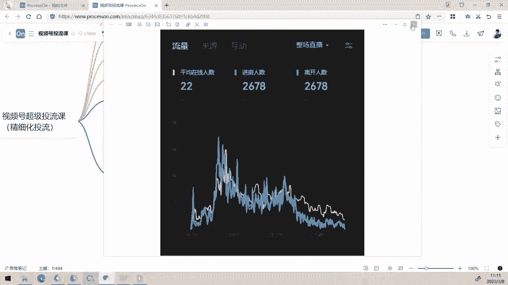
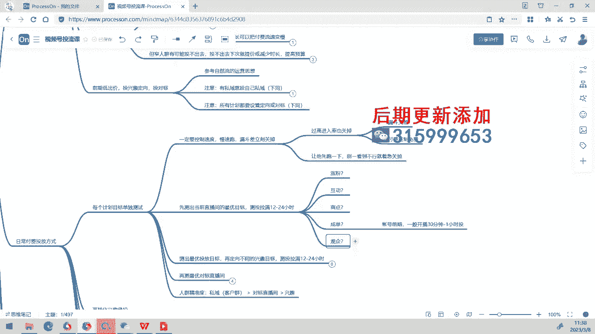
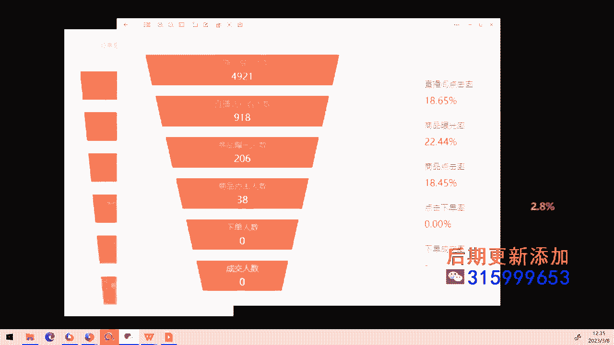

# 008 2023视频号直播·投流起号+破流速，深度拆解视频号投流模型与玩法 - P1：1-付费破层级抢流量核心逻辑+投放方式 - 早安睿睿 - BV1cD421g76t

早上的课程呢我们就现在正式开始了。呃，然后呢今天的话这个内容是比较多的，但是呢我在前面还是要先增加个内容。呃，因为这两天的话大家都有在起号啊，我看到有两位是在起号的，包括我们自己呢昨天晚上也起了一个号。

然后呢，在起号过程中呢，我发现这个这两天可能那个流量特别卷。然后新号的抢料的话是比较难抢。所以的话这个昨天的课程呢，我们内容稍微做一点调整。我们把内容稍微做一点调整。

在这里的话是开开播后20到30分钟补2小时互动，补2小时互动的这个地方哈。呃，我建议大家在这里做一个调整。第一个的话，前面预约投商点和涨粉2小时的，这个还是让他跑，这个是一样的。

然后呢从这个地方开始的话，补2小时互动的这个动作的话，我们可以把它先拉那个智能猪架还是可以去去拉。然后同时。同时在这个地方这个地方我们做一个调整，什么调整呢？在开播后30到40分钟左右不。

补这个长时间的长时间的这个订单成交计划啊，这个地方呢我们调整一下，在这里的话，我们除了补订单成交计划之之外的话哈。我们从这个地方来做一个调整。就是哎这个还是30分钟，330分钟。半分钟，然后呢。

在这里的话，我们开播后。那个是30到40分钟，然后补偿时间。高漏斗计划。长时间高漏斗计划，这个地方呢控成本。共成本投放。成本出价。工成本出价之外的话，我们再有一个呢是做长时间。长时间。

比如说12小时计划。啊，或者是24小时计划。但是这两天的话，可能那个你们要稍微出价出高一点，然后呢，时间呢不要放到24小时，可能会跑不动。这个地方呢用来干嘛呢？是在。所所前边的短计划啊，用于在。

本计划结束后。嗯。反计划结束后，补留数。因为你们可能这两天会发现说这个整个前面的流速拉完了之后的话，它会开始跑不动。所以的话我建议说你们在这个地方呢是这么处理。

是在这里的开播后30到40分钟去补长时间的那个高漏斗计划，就是看哪个目标比较好，然后你去补哪个目标，然后呢，在里边呢是做控成本的一个出价，长时间12小时的一个计划啊，就控成本的话。

你可能这个出价不用放太高，但是呢也不要太低。然后呢，用于在短时间计划的结束后呢，它可能会它可能会开始突然间断流，自然流会断掉啊，这种整个整个流速呢会迅速的断掉。因为有些直播间的话。

如果你整个人火场的承接能力啊，各方面来讲啊，它那个停留率不够的情况下的话，我们可能是需要用补流速的方式来补上它，要不然它后面的自然流会变得很慢。这两天的话，包括我们自己昨天的直播间做了一个测试。我后。

的话是在后边的话我采取的一个方式呢，是在呃前面两条短计划，打完之后呢，我就直接打那个互动和成交的。后边的一个长时间计划，用这个方式去补补完之后呢，它的流速也是这很低，但是呢它基本上能播啊。

就处于一个还是能正常播的状态。但是因为我们的那个人货场呢是经过验证的。所以的话我们是跑出了一个跑出了一个一个数据。哎，哎，对我这个应该切一个。切一个给你们看一下，稍等一下。稍等一下，我也把。

那个账号的大屏。切出来，然后刚好你们可以看一下。我们昨天昨天打的。嗯。好。稍等一下啊，我切换出来。刚好这个呢可以让你们看一下那个第一天计划打出来的最后大概会是什么样子啊。

好，来给你们看一下。嗯。

哦。

这个大家能看到了。呃，这个呢是在前面的话是这两条两条那个商点和呃涨粉计划呢，它打开之后，它迅速冲上来。冲上来之后的话，我们我们这里面呢大概有11位预约预约量不是特别多。因为我们只是稍微发了一下。

然后我们是准备直接投了起号。然后呢，之前没有这在这个账号要测试阶段嘛，我们就没有去做过多的宣传，所以我们打了那个11个预约，然后进场进场之后的话，它里面会有一点老客户啊。

是有有一个有一点其他账号的一个老粉来做一个支撑。然后呢，我们在这里面呢，它就冲上来，这是两条那个呃涨粉和和商点计划冲出来的之后的话，在这个流速，冲出来之后再到这个这个地方啊，你看这是大概在7点我们是7。

7点多吧，7点多开播，然后呢打到这里的话，刚好的话就是那个两条计划结束了，结束后之后的话，剩下的这个拉。整个黄线被拉开呢，是因为因为互动互动计划互动计划。

因为我前面的话是打了那个互动和成交计划来打打底嘛，长时间计划来进行打了个底。但这个打底呢就是在我们刚才在这里说的。

那个界面哪去啊？这个是。前面的这两条计划的话，我是直接在这个地方，我就直接投了长时间的互动和成交哦，我没有去按照这个方法投。但是呢我觉得可能还是要还是得这样子去叠叠放。要不然他那个计划呢。

可能对于你们来讲，因为你的人货场的承接能力不强的情况下呢，可能会导致说突然间完全断流的一个情况。呃，所以的话可能你还是要按照我这个方式来投的话更稳妥一点。但如果说你的人货场很有信心的话。

你可以按照类似于我这个这个这样的一个投法，就是投完之后呢，我剩下的是长时间的互动和成交计划再打底，然后呢，他就会慢慢的一个留入。但这个时候的话留入的情况下的话，我在投的过程中，我其实我还叠投了。

就是我现在的我在投完之后发现互动的那个呃漏斗很好，入动漏斗相对来讲会比其他都好。那么我在这个地方开始的话，我连续叠投了三条互动计划。然后呢，让他把整个你看整条黄线是拉开的，拉开状态下的话就表示。

人是很准的，他来在看他在在直播间里面互动，在看啊这个地方啊，他在这个地方后面他没有拉出多少互动。但是呢他们一直待在直播间里看整个停留时长都话还是可以的，还是可以的。所以的话就是这个你们很多人都投完之后。

他发现后边完全没留速了，所以这两天呢我建议大家哈，如果说你们再打起号的话，你们去后边补长时间计划，让他缓慢留住也可以。因为这个缓为什么缓慢流住呢？因为你要把自然流做充分的学习。

我们付费在这个阶段是让自然流去交集进行一个一个充分学习的一个阶段。所以的话在这个地方呢就是一个一个呃再补两条比较慢的计划，你记记得啊不要不要去过高的出价，空成本长时间，然后呢让它缓慢的留住。

这样的话他会给你重新撬动那个自然流出来，并且让你有一个很好的交集学习。结果，然后呢你就那个在线就会被拉开啊，那拉那能不能拉开的话还是取决于你的人货场哈，这个肯定的。OK这个地方呢作为一个重要的补充。

大家听明白的那个发个一好不好？大家听明白发个一，这个是这两天起号比较重要的一个一个地方。然后呢我们再看一下。😊。

这个。补一下。补油素。哎，你们有没有在看的？你们这是看呢这个听明白的，你们可以扣个一出来，这这个蛮重要的哈，这个蛮重要的。😊，然后的话我们再看看呃。好，前两个通过付费也行，这个没问题啊。OKOK然后呢。

第二场的投放的话也是一样哈。第二场的投放第二场的投放的话是开播20到30分钟之后再补。就开播这阶段呢，你可以不预约投。这个不不然不要预约投，让那个自然流续进行学习。然后在这个阶段之后的话。

你再投3到4个小时之后，3到4个小时之后的话去关掉。然后这个地方有一个问题啊，这个地方有一个问题，可能如果你们今天来跑的话，你会发现那个最低出价可能跑不动。然后如果说你控成本的情况下跑不动，你把。

你把那个。诶好嗯。投了之后跑不动的计划。那个。提高出价。你好。提高出价别投。因为这里边如果说你投了之后，发现最低出价在这个阶段你跑不动。呃，实在是跑不出去。那这个时候的话，你跑不动的计划呢。

你就再建一条出价比较高的，然后去进行叠头上去，这样呢去补一下那个流速。然后等到后边的话到3到4个小时的时候的话，3个小3到4个小时的计划。然后2个小时左右呢，你可以把它关掉。当然这个地方的话。

这个这个地方的话也是可选的哈。如果你投放的时候一直滴流速，那你可以不关这个地方呢可以用来补流速。用来补留树。呃，因为如果它低流速的情况下的话，它基本上不会对自然流形成太多的干扰。这个那。不干扰。自然6。

啊，这是在前期比较重要的一个点。然后呢，在这个30分钟后补这个成交计划，补成交计划最低出价3到4个小时啊，这个也是看情况哈，这个也看情况。如果。跑不动。就提高出价节头。也是也是一样的也是一样的。

然后后边的话1小时啊，不是一小时，40分钟40分钟。然后呢，你可以。投放这个漏斗最好的计划打底。然后这种打底计划的话，长时间呃空成本。工程本。长时间。全场不关。好，这个再补充一下，就是第二天的话。

你还再增加一个这样的一个环节，再增加一个这样环节。因为这样的话，这个这两天那个信号可能会跑不动。所以的话你。补上这个计划之后的话，他就相对来讲会安全很多。要不然你后面流速太低了，你没法播。

我给你们看刚才我给你们看的那个这个这个截图啊，我们昨天晚上跑这场的时候的话，我们是在后边拉了差不多一个小时左右，拉了一个小时左右之后，我发现那个呃他后边后边的后边的在线的波动率比较强。

然后我让他拉的一个多小时吧，一个多小时左右呢，我们让他们下播了啊，然后重新的今天第二场，再重新重新给拉。但是你看他如果说一个这样的一个账号哈，他已经拉出黄线的情况下呢，证明什么呢？

证明人已经逐步开始精准的。😊，只是因为你这个账号是一个新号，再加上我们的产品的话，它那个价格也不算特别低啊，不是不算特别低客单。所以的话这个整个整个他们的客户呢，新客户来了之后，他有一个决策周期。

他还处于一个收集信息和选择评估的阶段。所以他们不会立刻下单。因此的话，他这个后边后边的整个数据呢就开始变得稀稀拉拉起来啊，也是这样的一个情况。然后如果说他能够保持这个状态，保持上几场。

你会发现他的成交的密度就会越来越高。因为客户信政的嘛，还有很多是老粉回流啊，不是好老粉回流，就是那个看过几场的人慢慢回流回来购买了。看了一次不买，长时间再看一次，再看一次，越看越喜欢就越就就会买下来啊。

所以的话这个像这种这种数据的话，就是一个比较好的起号阶段要必须要能够拉开的一个数据啊，这是我们昨天晚上起的一个号好，这个地方大家听听清楚的话，给我再再扣个2哈，就是第二场第二场的。第二场刚刚我说。

第二场第二场的话去补也是补一个流速。然后呢，给刚刚刚刚给大家就补充了一个比较比较重要的，就这两天的一个情况。

哎，那个界面呢。给大家补充的这么一个一个非常重要的一个环节。因为这两天可能。这两天的话，我们接有一两个账号吧，有一两位一两位这次我们在参与的同学呢，也是遇到了这样的问题。

所以的话我们就给大家重点做一个这样的一个调整。

好。好，那我们这个部分呢我们就先。给大家做了一个补充。第三场开播，第三场因为全场微付费的，这个没什么就没什么好讲了。因为全场的都是微付费的一个状态了。

所以这个也不存在呃不存在说那个会跑跑的没流速的一个情况。然后这里面哈这里面你们要注意哈，第三场微付费的话时长24小时。哎，不行，我还是要得补充一下。要不然你们这两天的话，那个流速太低了。呃。

时时长24小时的过程中的话，如果跑不动。到优。Xuan。高老豆。计划别头。啊太高。出价别头，这个还是还是得强调一下啊，这个要不然大家我怕大家这两天那个流速太低了。好， ok。😊，行。

就给大家做了几个几个这样的一个铺垫。然后这个这个地方呢，我们也是讲完了，我们今天的重点来说这个付费怎么样去去破成机抢流量啊。因为刚刚今天的话我们是在前面给大家补充的这个环节。

所以的话就是时间的话拉过了大概13分钟左右。我们今现在到可能要到12点多才能结束。所以我们就先我们仔细来看一看。稍等一下，拿杯水。倒了水之后没拿过来。好，我们继续。呃，怎么样利用付费来破腾级抢流量呢？

破腾级抢流量的话，首先要和大家重点说一个地方呢，就是破产流速层级是核心思想啊，破产关呢是没有没有什么意义的。就是我们的核心呢其实破的是那个每分钟的流速，破的是每分钟的流速。

因为每分钟流速它真实体体现出你这个账号的一个层级的一个很重要阶段，就是我们真真你看这个新号，这个新号的话，它每分钟呃在叠加了少量的付费进入之后的话，它其实也就每分钟的话，才才几个人。

你看就是有付费的情况下啊，有有付费叠加情况下，然后自然流和付费在一起的话，它后面的付费它开始跑不太动啊。

然后呢，它叠加在一起之后，它的流速很低，这个阶段流速很高，因为付费的流量很大，所以它一直在往上叠加上去，就是这样的一个过程。所以呢我们一般情况下呢，我们说所谓的破层级呢。

我们的核心是放在破流速这个层这个事情上。

然后呢，这个。透流速的核心呢一定是你要具有高流速的承接能力，就是它给了你在更高的流速的情况下，来的人呢，你接得住，你接得住的话，你才能够放大流速。然后要不然的话。

头流本身呢是无法放大你的那个自然流速的啊，就是要本身你的成级要。也好，要需要这个过程。然后同时的话如果无法放大那个层级的，就是你的整场的RI他如果可以的话，也没问题，那你就直接投嘛。

现在呢我有很多那个直播间其实都是直接靠纯纯打那个付费的。然后呢，反正他RI能够过得去，他就直接打。呃，如果RY不够多的话，这个不够高的话，我们能够放大自然流。就是说我们在投了之后。

它整个自然流呢被放大了，这个也是一个可以接受的啊。但是呢你下次不投，它会变变回一个正常的流速，这很正常。呃，层级上不去的核心原因在哪里呢？层级上不去的原因性核心原因呢肯定是在人货场这方面啊。

人的话主播的承接年力不够，话术不行货的话那个货品啊，你的货品是不是吸引人。然后呢，货品本身它有一个生命周期，生命周期到了之后的话，它也是投着出来的效果肯定也不好。因为这个是付费跟自然流之间的。

它是一个交集行为学习结果。然后同时付费它是模拟的那个自然流的学习过程。所以在这过程中的话，只要你的人货场本身出了问题，你的投流肯定也是投入不好的。然后厂的话就是那个场景留不住人啊，咱们在线拉不上去。呃。

然后呢，这里边为什么会成级上不去呢？核心原因在于自然流被承接率更高的直播间抢走了这个流被承接率更高的直播间指的。不一定指同行。不一定指同行，有可能因为你看用户是有限的，用户的注意力有限的。

当他今天喜欢上一个直播间的时候，他就不一定会来你的直播间，对不对？所以这个过程中呢，客户他会看来看去。那么但然可能这段时间的话，你的客户被同样一个人被更好的直播间，跟你那个不一定是同行。

但是呢他跟你要的是同一个人群，他的时间被占据到另外一个直播间里面去了。那么这种情况下的话，你的那个自然你的流量肯定就被抢走了嘛，对不对？所以这个过程中呢。

那个影响的是你的广场排序影响的那那个非得流的推荐。还有呢就我们所以我要从他们手里面去抢料，就是这样的一个这样一个过程。好，那我们再看看什么情况下呢，可以采用付费破产及抢流量呢？呃。

什么时候可以可以那个采用付费破产机抢流量呢？第一个的话，我们的这个。我们的这个流量被抢走了，那我们这种情况下去抢一点回来啊，然后同时或者是你的人货场已经到位，然后呢，只是它的流速还没有破上去啊。

这种情况下呢，我每次就要说那个累尾他那个提成，那个提成的话，那前段子那时间呢学提成还是很爆的，对不对？但但是他每天只能卖500块钱啊，他这个但是呢他通过投流数一下子把这个投流投阵的时候。

他每天一下子这销量是爆发到2万块钱，就是这样的一个一个爆发过程，这种是人货场到位，但是你的流速没破，你的那个账号没学习出来。这然后他学习出来就立刻就爆了啊，破流速呢就需要去拉在线拉场次，然后呢去付费。

我们去加速破流速的一个学习。所以付费呢不一定能够帮你破成级啊，这个你们也要也要清楚的这个点付费的话，他是只他是只能给你做放大放大的过程中，如果说你承接得住，那么大你会逐步的破成。

所以流速瓶颈的核心呢是人货场对自然流的一个承接能力。这一点呢是大家一定要一定要很清楚的。你流速瓶颈的核心是你的那个自人货场被自然流承接能力啊，然后我们之前的话我们在用自然流的时候的话。

我们是一般情况下呢，需要拉很多场去进行拉场次嘛，拉时长拉场次，然后去拉出来。但是呢付费，它破流速的话，它可以破的很快啊，就是只要是你的人货场很给力。你的付费拉出来的那个人的话，他可能我今天我没有下单。

没关系，我明天我后天我大后天我还回来。所以这种被打出来的一个一个客户啊，他被换出的一个回流呢，他会持续的有一个有一个被换回的过程啊，所以的话在过程中呢，你你会发现你的老粉回流之后，它也会叠加上来。

变成你的流速。这个时候呢，你的流速会越来越高。所以账号呢。越播越老流速越大，它跟你的账粉丝回流率也有很大的关系，好不好？啊，这个地方大家就要清楚了。所以呢付费用呢，我们是在破他那个加速成绩。

那破不上去了怎么办呢？哼那个RY到位，我们就直接抢嘛，没有什么守谓啊，反正这个这个。投产比可以的话，我们就直接抢。因为有些时候的话，有些账号它真的是纯付费账号，你又看他那个他只要OY可以。

我们基本上呢就是纯打，直接打，没有什么太大的所谓。因为这种情况下的话，既然可以花钱的事情，为什么要花时间呢，对不对啊？所以这种是只要OY到位就直接打。但他那个不花钱的时候，他的一个流速立刻掉下来。

那怎么样呢？没怎么样嘛，掉一掉嘛，反正的话付费又上去了，他LY都可以，然后接下来呢流速但是他有破不上去的情况下呢，但如果说你的自然流，它能够在持续的投放过程中呢，可以被有效放大啊，那你也可以抢。

我们建议呢这个账号你你要尽量去做那个日播，就是每天都播，每天都播的话，你可以培养出你的那个客户群呢，他的那个看播的一个习惯。为什么这么说啊，我现在的话我可能我今天的话。

这个人本身他是一个有看直播习惯的一个人，对不对他。是一个有看播习惯的一个人，看播习惯的人的话，他可能是今天他那个时间泡在你的直播间。然后呢，你今天不播，后天不播，大后天不播，好几天不播。

那这几天你大家看嘛？看看别的直播间吧，是不是啊？所以这个过程中呢，我们是建议说你能够能够日播，我们尽量尽量是日播啊，这个地方哎，说在这里我补充一句啊。Z意i。账号日播。可以稳定老粉回流。培养看播习惯。

也助于这个。投疗后。回流效率。因为你们看到那个一个账号呢，我们叫做有一个叫做长周期长周期换回的一个过程嘛，把PPT切出来。

有一个长周期换回的一个过程。长周期换回的话，这里面呢有一个7天间接下单。就是如果说你长时间不播的话，它其实换回次数会很少。它这里面呢它是它会被它会在它会在那个你投流之后。

这个人呢他会后面呢会用自然流等各种方式帮你换回回来。所以帮你换回回来之后的话，你是需要能够日播才能够持续的触造他，他今天不看他这里看但是他你看到今天不买，但他看了很久，然后呢，他过两天的话。

这个又是又是过两天又在又在又在又又回来。然后再过两天再再回来这种持续换回过程呢，他是有助于你整个直播间良性的一个成长的，也有助于你良性的破流速成绩。

啊，所以这个地方呢我们是呃建议大家呢是账号去日播，这个也点个重点。建议大家去账号呢去日播啊，这这这样的一个一个事情呃，也是可以帮助你破流速成绩的。好，那高复购产品的持续付费啊，就都能够放大流速。

这是肯定的。因为那个高复购产品的话，它你累积的粉丝看播的人越来越多啊，你的那个回流的人群呢就会越来越大。流速呢自然你就会被叠加上去了。所以这个是高复购产品呢，我们都是建议说你是持续付费。

持续付费的一个状态。那么怎么投呢？啊，重点来了哈，这个重点来了，怎么投呢？怎么投。呃，我们首先呢要拿出好的场次的数据和坏的场次的数据来进行一个分析。不同的直播间重点的行为模式不太一样。这个我们前面说了。

和主播他的话术引导风格也有很大的一个关系。有的直播间客户在下单前呢，他喜欢那个咨询啊，这个情况下互动的人群很准有些直播间客户会表现持续关注需求，所以涨粉的人群呢在前期会很准。有些直播间喜欢静默下单。

那么商点和成单的人群呢会更精准。这就看你这个具体的情况。呃，越是高客单直播间的话，在前期我们一般的你主投商点，主投商点后的话，就后面转向了做那个承单，转向的做成交成交计划啊。

这个就看你直播间的一个具体状态。这个没有固定的投发啊，这个我们要后边一起测出来。然后呢，你要去对比好的场次的数据和坏的场次的那个数据。你看一下你哪个数据呢是更容易学习出来的。然后呢。

后面我们就主投这种目标。啊，那个你要评估的是你的互动率，涨粉率成交率这些数据。这个互动率就是评论人数除以场关，涨粉率和关注除以场关。那个观看呃那个成交率的话，主要看观看成交率，观看成交率。

因为点击转化率啊，点击转化率这个数据的话，有时候它看不太准。他跟你的品的各方面有关系哎。按含转化率。当呢两种直播间呢有两种头发。两种直播间有两种头发。

两种典型的这个直播间的头发呢是一个是那个窄人群的一个直播间。在人群的低流速的直播间呢开播后15到20分钟开头。如果在这个账号的前期，一般你可以在1开播后的15到20分钟开头。然后呢。

你整把这个整个账号投精准了之后，开播呢就会有一个比较稳定的流速的阶段的。你这个时候可以去进就可以可以开始预约投啊，然后然后呢投低穿透率高漏斗的目标。因为窄人群呢它决定了它曝光之后。

它不会有它的人群很窄的情况下呢，你的那个。

你看你看这个。

这些直播间我们的这个穿透率其实不是特别高。因为都是载人群直播间，载人群呢，它那个直播间它投放的成本会比较高一点，为什么呢？因为它的点击传头率会比较低啊，所以它都会比较。

出现的那个点击率相对来讲会比较低的一个计划。所以呢我们要投低穿透率高漏斗的目标。高漏斗指的是后边的高。

嗯。嗯。在这个地方啊，后边高。

这个地方高。所以这如果你是载人群低流速的话，我们就在开播后的15到20分钟去开头。这个是属于新号。老号可以直接预约投。但是新号呢一般呢我们都是建议让自精准的自然流先保出在线，然后呢再开头。

这样的话防止泛流量去冲击它啊，就避免付费的犯人群呢直接冲击的自然流量。然后呢，如果你是大人群高流速的这个直播间哈，这种情况下你开播前你直接预约到。因为你一开播的话，流速就不错。然后同时你要观察几会啊。

不要跑飞，就犯人群那会迅速的进行冲击。呃，我那天的我我昨天啊昨天。

昨应该应该啊是是昨天前天我给大家展示了这个计划嘛。然后我昨天的话，我这个直播间的话，我去尝试了一个特殊的头法。因为我发现说这个直播间的话，他的他的。投出来的流速很慢，高出价之后呢也是很慢。然后呢。

我就昨天做了一个尝试。去尝试着投观众，因为他的人群的停留时间很长，停留时间很长。然后停留时间很长的情况下的话，呃，他观众计划他不会特别差。你看我观众计划投出来是多少呢？商品曝光率20呃23%。

那个商品点击率的话是百分之大概有百分之。也是20%20多吧。我的观众计划能够投出这样的一个数据。但是的话等到我投的一段时间之后，我发现哎有点不对劲，为什么呢？

虽然说观众计划确实是帮我这个直播间迅速的放量，而且它还逃出了一个O逃出投出的RI也不太差。但是呢我就发现整个直播间他被这个观众计划的低漏斗计划被拉歪了。而且的话因为因为我就做了一个尝试嘛。

我尝试了一个高流速打入。看能不能直接直接让这个账号变成一个付费账号。因为如果说他这个账号能够付费，而且RY又很高的情况下，那我们既然能够能够拿飞机干嘛，还要什么自行车呢，是不是？所以我就做了一个尝试。

尝试了之后的话，我就把这个直播间的这个人群给打歪了，打歪了之后的话，干什么？打歪我之后的话，我准备重新这个这个在这一场呃，应该是呃今天没播，今天没播，明天明天的话，我准备就是重新用这个头发。

开播后15到20分钟让他人群重新学习学习之后的话，拉金准之后呢，我就开始重新去投。

那个精准技划观众不投了，因为观众的话就把整个直播间给出现了一个拉歪的一个情况了。好，这是这样的一个一个。一个情况。那这里边呢特别注意哈特别注意一般情况下呢，如果说你还想要自然流。

那我们的付费流速要小于等于自然流速的40%。

在这个地方的话。我们要大家要注意一下，控制付费流速不高于40%。当付费流速不高于40%的时候的话，会给你矫矫还能够矫正你整的那个精准的自然流。比如说你看这个这里边的话就是上面上面的话其实是一个多条计划。

迅速的打入的一个状态，迅速打入之后的话，你看你你可以注意到哈，导了这地方的话，那个黄线其实跟跟那个进防线呢是叠加在一起的。但是等到这个地方呢，把计划关掉之后，它那个掉下来。但是呢黄线就重新被拉开了。

这种情况下呢是精准的在线。是精准人群在线的。而且的话这个是自然流也会被矫正回来了。所以我们一般情况下控制的时候呢，我们控制付费流速不高于40%，它会处于一个非常好的一个状态。而且这种状态下呢。

你的投流成本低。

头留的成本低，然后呢那个。哎呀。头留的成本。会低。同时你跑出的ROI呢也不熟。在这种状态下，就是这样子。一旦你高于这个流速的时候，你要证明什么？证明你目前的自然流一定不行。在这个时候呢。

你要去降低你的那个计划，减少计划，然后重新把自然把压制的那个部分减掉。这种情况下它会重新调整回来。而且在这种情一般情况下自然流不好的时候呢，你去硬拉RI它拉硬拉那个硬拉付费的话，你的RY都不会太好。

好，这个地方是蛮重要的啊蛮重要的。然后呢出价呢，我们就从最低开始去进行跑时长呢我们尽量拉长，让计划呢去慢慢的跑啊，然后一定要记得一定要控制流速。我那个付费呢会压制免费啊。

就这个地方就属于说付费压制的免费的。

就在这个地方。所以我们在投那个起号阶段啊，投起号阶段的这个课程呢啊投起号阶段的话，其实也是有这种表现的。这种的话就是付费在压制免费的过程。但是因为信号嘛没有什么太多所谓，所以我们就随便投。

等到那个计划一结束，你看哎这个。

人群就被学习出来了，看到没有？人群立刻就被学习出来。我这个账号的话，昨天我们在几号的话，我们只有11个预约。也就是说呢，实际上11个预约也就那么四五个人。四四五个老粉回来吧，的一个这样状态。

但是呢他整个被学习出来之后的话，他就整个环线被拉开了。也是这样的一个效果。

好，那我们继续。呃，投放时长投放时长的话，低流速直播间我们控制投放的时长可以把流付费的流速变慢，就控制出价啊，还有控制那个控制投放时长，这两者呢都可以。然后载人群有可能会会投不出去，投不出去呢。

你就提价或者是减少时长，提高预算啊，但是提高预算的有可能会导致人群变比较泛，所以优先考虑提价，然后呢提其次呢是提高那个预算。呃，时长呢会影响流速，提价呢影响那个抢量的能力。Yeah。

然后前期呢我们一般情况下呢是低出价投兴趣定向投对标。这个地这个地方呢，你参考一下我们那个自然流的运营思想啊，就是我们尽量的还是圈选比较精准人群加速系统的这么一个学习过程。呃，有思域的话就投资思域。

有预约的话，尽量做预约。定量。每场到达。预约。这样呢你每一场打完预约之后，你下一场呢都会相对比较安全一点。拉个重点。嗯。那我们再看看。前面这个地方铺垫完了之后的话，我们再看这个非常重要的这个环节啊。

非常非常重要的这个环节。很多呢不投不好，就忽略了这些这些关键的因素。第一个，每个计划的目标呢，你要去先做一轮单独测试。就是比如说你的那个。呃，就是比如说到底是互动还是涨粉还是商点，还是观众。

还是那个呃成交，哪一个方向对你来讲呢是最核心最有效的这个目标方向，这个东西呢是测出来的。不是说你听别人说这个哪一个方向好，我们就投哪个方向就简单的这么样看每个直播间的结果和效率都不太一样。

所以呢我们要根据实际情况来进行安排。一般情况下呢，漏斗差的控制流速，漏斗差呢，我们就一般是立刻把它关掉啊，漏斗差，所谓的立刻关掉的话，也是也是那个也是要跑个4分钟左右哈。

也跑个一般我们跑了30到4分钟左右啊，因为他有他有些计划它会慢慢越学越准的这个过程，所以不要担心说一看哎呀，这个数据不好，你数据样本就那么小。你看到他现在不好，不代表待会不好嘛，对不对？

所以这里边呢我们。大家注意这一点。第二个的话，过高的进驻率呢一般也要关掉，就进驻率高，漏斗差。这种呢它会直接导致付费压制免费，它影响你的整体流速。啊，那个付务费压制。所以一般情况下的话。

高进度率的计划呢，我们一般是建议把它关掉的。但是如果说高进度率，然后同时漏斗又非常好，那这种情况下怎么样呢？这种情况下恭喜你啊，你要赚翻了。然后同时我们前期的话。

如果测出了一个当前的那个直播间的最优目标的情况下呢啊这个这个不是我们要先测出一个当前直播间的最优目标，一定要先测出一个当前直播间的最优目标。这里边呢大家很多人在在测的时候啊。

就搞不清楚具体的应该到底怎么跑的一个过程。很多人的话就是盲目的去去跑计划。你跑了之后今天试了这个不行，那个试的不行，然后呢就不断的在做这些各种计划的一个胡乱的一个调整。你一定要记得哈，每个目标呢。

我们在前期单独测试的时候，全部测头拉满12到24个小时去拉。到底是涨粉还是互动，还是商品还是是还是承担还是观众。每一个的话你都要去测一遍，你测一下，看到底哪一个目标呢？对你来讲，它是属于说高漏斗计划。

对你来讲呢是属于高漏斗计划。你把高最优的那个高漏斗计划呢，你要把它提取出来记录下来。比如说你现在在前几场，你弄1个excel表格啊，或者弄一个什么word文档都可以。你把每一个计划的目标。

你把它把它那个截屏截截下来，放在一起去对比。然后呢去计算计算它实际的这个这个穿透率，特别找到这两个。高商品曝光率和高商品点击率的这个这种计划，这种计划对你来讲是最优计划最优计划。啊，双高计划。

所以你不能够说那个他有时候是呃你实际上话它会很高的。比如说有些有些漏斗，它是比如说20%的穿透率，但它这里点击率60%。然后呢，他在这个地方的话，可能是30%的穿透率。但是他那个点击率的话20%。啊。

这里边的话就是他可能实际上你看到这个地方哎，这个可能不太好，实际上两个跑起来可能差不多啊。是那所以的话我们要看它最后的什么呢？呃，最后的停留停留率。停留率的话，一般情况下呢，我们在投的过程中呢。

我们会有一个。

会有一个重要的一个评估点，什么评估点呢？我给大家截个图看一下。一般呢我建议在自选指标里边的话，把这一项给拉出来。

哎，有有了啊，打开了。呃，把这一项给拉出来，这一项呢叫做什么呢？叫做叫做叫做呃超过一分钟。超过一分钟的观看人数。这个就是我们昨天晚上测投的时候，我们起号阶段的话，我专门测投那个那个计划啊。

就跑了839块钱。然后呢，成交5单。因为在起号期不看RY起号期不看RY起号期，只要他能够帮我跑出数据就可以了。就是你看前面的话就是主要钱花在这个地方，到后边的话，它就是在在这个地方就就能够把黄线拉开了。

那就很好了啊，然后呢我们会看这组计划。这组计划的话，在这个地方呢是一个比如说149人停留。149人停留的话，我们只停留超过1分钟，超过一分钟的人基本上呢它是相对来讲会比较精准的人。

这个地方很多没有去把它调取出来。看你这个添加添加目标里面你去添加，把它拉出来看这个是我一不平时经常看的一个经常看的一个一个一个数据啊。你看这149。

这个。好。我给大家算一下，大家明白了。一般情况下呢，你像这种我们839呃元除以149。你会发现。你获得一个超过一分钟停留的人，真实的这个这种有兴趣倾向的人呢，大概是5。61个人的成本。那这种情况下。

比我们去看那个千载啊，看什么这些啊，它实际上有意义的多。我们一般呢用这种方式来评估，它这个效率会非常的高啊。所以我们我们都是包括你一个商商品点击次数。这个商品点击次数呢。

我们都看出来那个效果也是不是特别好。因为他那一个人有时候有抓着一个有兴趣的人，那全场一直在点点点点，把整个点击次数点出来了这种东西，这个数据看起来一开始我还蛮重视这个数据。

后来我发现这个数据他的参考意义太差了。所以后面的话我发现看这个数据是最好的。后面我们实际在测试过程中看这个数据，他能够看到你真实的那个意向客户成本。一个人在直播间能够停留个一分钟以上。

那大概率他肯能是被你人货场吸引的，是不是呃，就算他没做出什么行为，他可能但是他可能会会关注啊，会做什么动作。而且你会发现了这种超过一分钟停留的人呢，很多都是什么人呢？

很多都是点击的商品的人。你们可以去观察一下，到时候你们去观察一下，当你那个一分钟停留的人数在涨的时候，你这个商品点击一直也是跟着涨的。所以所以为什么我们会很重视那个那个一分钟停留的人呢？

就是因为他这个人表达出来的一个生成意向很明显非常明显，要不然的话谁在咱们这里会待那么久呢？就是老色别看美女嘛啊，那这个也能看很久，对不对？所以这个是一个真实意向客户的一个表达。好。呃。

这个也也是给大家一个重要的一个补充啊，给大家一个重要的一个补充。然后呢，我们再看看下一个内容啊，我刚才讲的这一段的话，我应该下次把它补充到这里面来才对。

嗯，下次给他补充到这个地方来。呃，然后呢我们在测出了一个最优投放目标之后呢，我们去定向不同的兴趣目标。然后这个阶段呢定向了不同兴趣目标时，我们侧头呢要拉满12到24小时。我们可以去侧头。

这个测头是什么意思呢？因为一开始的话，你不知道你到底哪一个目标是你的最优目标。因此呢在为了不浪费钱，也不要让那个大量的泛计划冲击直播间的情况下的话，我们在撤头阶段会尽量拉满12到24小时。

如果说你是星号期，那没什么所谓。星号期的话，你前面打完打完这些计划，打完前面这些计划之后的话，你都已经心中有数了，知道说哪个计划最好了。但是呢如果你现在这个账号已经跑了一段时间了。

那我们就不需要用星号期那个打法去打了。那这种情况下，你要怎么测呢？为了避免打歪你的直播间的人群，就是我们在前面这里说的，一般情况下，我们要尽量控制付费流速不高于40%。

控制这个比例的情况下呢，你去做长时间的低价计划。

微付费计划，这样的话，你会很快的就测出来你的那个目标到底是什么样。哎，哦这个地方我们就已经家测测出来哈，所以是我这里说水瓢了，这个地方是测训训目标了，测训目标了啊，这个大跟大家说清楚啊。

这个是测训去目标了。这个也是很多人都不知道怎么投的一个一个一个方法啊，每一个计划呢。我们就一类兴趣目标。或者是1到2个兴趣目标，用这种方法去拉满长时间计划，测高漏斗兴趣。

所以要不然你看你看你现在的话上面一大堆这些这些兴趣。然后呢，我们在前面的课程里边，大家也知道说客户的行为它是具有什么行为呢？它是在它具有一个需求生态链，它会有前后置关系，它有相关关系。

所以这种情况下，你很难清楚的主观判断出客户到到底喜欢什么东西。但是没关系啊，我们可以干嘛，我们用长时间微付费计划，不断的去测，不断的去测漏斗。然后呢，在这过程中，我们测出了高漏斗兴趣之后的话。

我们就可以干嘛，我们就可以把它合并在一起投，或者是分开头，那个时候就都可以了，对不对？所以你要记得一定要测出高漏斗计划啊，同时给大家提一个建议，说那个卖羽绒服，投羽绒服不一定是最好。

只是给大家一个一个一个这样倾向。比如说比如说那个我今年都已经已经是看了在我已经买了那个羽绒服了。然后呢，视频号给我打标成我是喜欢羽绒服标签的。于是呢，我又给看到另外一个卖羽绒服的直播间了。

这个时候的话怎么样呢？这个时候的话我可能就不会买了，是不是啊？所以呢我们只是一个这样的说法啊。然后呢，但。同时也可能。冷。他出来没在同行。他的人群。啊，这个这个是。的前客。啊，这个的话就是。

补充在这个地方吧。所以这个地方的话就大家要根据自己的实际情况去判断啊，然后呢有一些这里的话也是有一些稍操作的，有一些招操作呃这个。呃，行吧，那我就讲吧，这个稍稍做的话。

就是比如说你看到你的同行正在卖一个什么爆款，卖一个什么爆款的情况下的话，你为了拿他的客户过来，然后呢，你把低用低价，把这个产品呢用亏屏的方式，或者是用其他的什么方式，你可以迅速的把他的人拉过来。

然后其他的这个情况会出现什么问题啊，你们就自己想了哈，你们就你们就自己自己考虑这个事情啊，反正的话我就跟你们说，可以用这种方法直接去直接抢多量。😊，呃，然后这个地方呢。测出高漏斗兴趣之后的话。

测出高漏兴趣以后，你可以重复一头。然后你直播是怎么样的？直播的话就是。按正常时长去播，下播呢会反斗。下播会反斗。这种下播会反斗的这个这个地方就避免了大家去在测兴趣过程中，你浪费钱的动作。

很多呢为了测个兴趣的话，都是也是短时间4小时、3小时计划，2个小时计划啪啪就往上打，打完之后一看哎E呀，不行，这个整个打歪了，打的整个直播间乱七八糟。我告诉大家，那个你要把直播间投好的话，你一定要耐心。

一定要有耐心。就是我们用这种方式呢尽量降低成本。然后呢，一个计划，一个目标，一个目标的去测测出来最优质目标之后的话，你可以进行相同目标的进行叠投啊，这个地方呢防止相同目标计划，叠投后相互压制。

因为你如果说你如果说你同一个兴趣，不断的再打相同的目标计划。比如说我现在这个兴趣，然后同时又投扑动。然后呢，我拉了三四条互动，你会发现这个兴趣的这个互动计划呢。

它就会开始相互的抢量计划跟计划之间会强量和压制。所以这种情况下的话，它会导致这个计划它的学习效率会下降。所以如果说你有多个不同的兴趣目标在进行。抢的情况下的话，你会发现哎你的计划。

每个计划它都能跑的相对来讲比较良性和健康啊，这个就是我们在测头过程中呢，大家一定要很重要做一点，这个点呢是非常重要的一个环节。这个点是非常重要的环节。大家要知道说我们为什么不建议大家随便去进行通头拉满。

因为通投拉满的情况下的话，他的兴趣会乱学。然后如果说你想要在打出来一个精准流量，对整个直播间进行有效的付费撬动免费，并且让整个直播间变得精准的话，测计划的兴趣是非常非常重要的一个板块。

当你测出一个优质兴趣之后，你的直播间会迅速的就被拉精准，成交率大幅度就上涨啊。所以这个点呢大家是非常重要，一定要一定要跟大家不断强调的哈，无论如何这个地方呢要多测。

然后同时呢我们还要测出那个最优的对标直播间啊，这个不一定同行也可以是跟你同人群的直播间。这个我们前面也说了，对标直播间呢一般是最容易找到人群的啊，如果实在找不出兴趣，我们可以。就按对标直播间去打啊。

也是可以。但是呢我们一般情况下的话，我们尽量还是把兴趣圈起来。因为对标直播间这个事情呢，它有时候那个人群会特别宽，会特别宽。这句话是什么意思呢？

OK我就拿这个吧，相关生产商家。江江湾生态商家嗯，我们就说这个前后置。我们这个前后置的关系。结后这有关系的话，我可能这个地方呢我在。我在卖卫浴。那我前面的话可能是看瓷砖。看地板。看瓷砖。

看地板的这个人群。啊，设至是找设计师。设计设计公司设计的这个阶段。但是你要知道他们的客户群呢，他其实不完全都是你的客户，他们也有其他的一些各种类型的客户。他们可能只是要来。修补的。我那个地板坏了。

然后的话我刚好要现在现在要那个地方重新处理一下，我只是想修补一下地板，买一点来修修补补一下。这种情况下，他会买卫浴吗？他不会买卫浴。所以他这种头的过程中呢，你会你会把这类人一起拉过来。

它会导致呢你的那个人群的精度下降。所以一般情况下呢，我们会把两者进行一个相互相互呃相互包含的关系。因为是这样子的哈，这里边的话是有一个呃这是你的直播间的，他对方的客户群。

客户群里边呢它会有分为几个不同的客户群。它一般对方的商家里面只有一部分是你的客户群。所以我们要通过兴趣的一个收缩呢，我们就可以把这个类人重新再把它拉出来啊，就是这样的一个过程。

所以所以的话呃如果实在找不出兴趣，我们才按照对标直播间打。如果你知道兴趣，尽量去圈选兴趣。在这里补充一下啊，那个对标。直播间会包含。一些不是杂他们客户。人群。因此，能圈进去。还是要圈进去。

然后在起号期的话，你还是打一下对标，那个速度还蛮快的。同时的话打对标还就也有一些各种各样的招操作吧。啊，比如说他同行卖的好的爆款，送到我们同他那边的话，直接把他的人拉过来啊，这个这样状态下的话。

他也会让我们的这个款迅速的去拉爆。然后呢，这个爆款的话，就是我们比他家卖的价格还要低，他在那边已经被验证过了爆款了。然后在你这边一看，哎，这么便宜啊，于是呢又在你那边买了，是不是啊啊。

这个地方的话就是也会迅迅速起号的一个动作，也是有这个这样的一个一个效果。呃。呃，我刚才想了这个地方，我刚才想了这个地方要不要说，然后的话我觉得这个地方还是说一下啊，这个地方还是说一下。

因为这个地方呢可能会造成一些不太好的一个效果。就是如果说你低低于对方的爆款。比如说今天出了这个爆款，明天立刻上上这个爆款，可能会导致对方爆款的退货率快速上涨啊，但这个地方我就给你们提醒一下，呃。

不建议不建议大家过度的去去这么操作。但我们一般的是大家还要公平良性的这个竞争。所以的话所以你们在做这个动作之后的话，你要记得。呃，在起号期的时候做就可以。起号期过去之后呢，就尽量尽量的话。

我们可以调整回跟别人一样。我们只在起号期借一下他的势，起一个自己的号。因为如果说啊我们的行业呢大量的内卷起来的话，大家都没有利润是没有意思啊。做出这个东西的话，如果我抢你的，你抢我的，大家都玩低价。

那你后面的话你会发现其实对于整个行业是一个伤害，看起来好像是我这段时间整个量上的很爽。但实际上的话就是对整个行业来讲，对你自己来讲都不是什么好事。所以我们可能是在起号期借一个势。

然后呢把对方的那个人群呢抢过来起个号，起完起完号了之后的话，我们就赶紧恢复原价啊，大家的话都有利润，这样才才能玩嘛，对不对？O这个就是给大家做一个补充。当然我一直想这个地方要不说，后来仔细想一想。

这个地方为了大家良性竞争，说一下，然后跟大家提醒一下就好了。呃，另外呢这个人群的精度呢就是私欲大于对标直播间。于兴趣，这是肯定的。因为你的私欲或者就是有群的情况下，有群才能投啊，有群你可以投群。

然后这种投放的话，这种投放的话，你会发现私域它其实会比较难以学习。因为人群的体量比较小啊，对标直播间的话，它人群体量会相对比较大。然后呢，这个它被圈选下来嘛。然后兴趣的话就是相对来讲还还是比较泛的。

对标直播间有时候还挺精准的，也对标直播间有时候挺精准的。因为你可以主观的去判断，一眼你就能看出来。但至于兴趣呢，它其实也是一个小部分啊，在这里的话，我们就给大家再用这个病级图啊。

并不是病级图交集图看一下，这里面呢这个这是兴趣。

这里边呢这个是对标对标的一个对标的直播间。这么多兴趣人群，其实他跟这个对标直播间也是只有一部分交集。所以这种情况下的话，对标直播间其实还是蛮准的，蛮准的情况下的话。

我们去在他蛮准的这个直播间里面去把它拉出你们更精准的这个交集人群。这种情况下呢就会相对来讲会会更加准。所以呢你想要准。你就圈的更更细一点，圈的越细就越准啊，就是就是这样的一个一个过程。

呃，然后同时再给大家补充一点哈，说到这个病急和交急的问题，给大家再提醒一下。还有一个地方，唉，这个怎么。超登录超时了。登录一下。嗯。好。给大家说一下啊呃，这些。这些选项呢都是都是一个交集结果。

这些选项都是交集的结果啊，比如说我圈选了这个之后呢，就越圈交集越小，越圈交集越小啊，然后呢交集的人群就越来越小。然后呢在在这个选项内部呢是并级结果，就是我现在圈的北京，然后我再选了一个选了一个天津。

这样子它都是被并级下来的，它不是交集结果啊，这个就跟大家跟大家说一下，虽然这个点呢，其实大家都其实很多人都知道，但是呢也要再和大家强调一下。呃，然后呢我们再看哈高转化的兴趣呢，我们要进行叠头。

你如果说撤出了高转化兴趣了。来看一下，哎，中间的话你们有问题，你们要赶紧提问哈。因为这个环节的话是蛮重要的一个环节，里面中间有问题，要可赶紧提问啊，不能一直我在说。

虽然虽然这里边我们是今天可能会过一下时间，但是的话但是的话这个还是要大家要多互动。啊，聚金会审择庭。呃，就大家跟大家说哈，你们这这个兴趣你要去多测，兴趣，平时没事要多测的。

然后那个交你要考虑到直播间的那个病级呃，直播间和兴趣之间的交集人群是最精准的人群。然后高转化兴趣呢，我们去进行叠头。如果说你测出了一个漏斗特别好的一个一个兴趣之后的话。

你可以把这个计兴趣计划呢去高价跌投，不断往上往上跌低漏斗的这个兴趣呢，如果他投出来他那个呃投你看它投产就不错。那那漏斗又比较比较不好。那这种情况下呢，我们是可以看一下，把它进行低价投。

就当你投出去的时候，有时候我们会投多一点这样的人进来。因为你说它不准吧，它其实也不是特别不准。但是的话它的漏斗呢确实没有别人别的那个计划那么好啊。但是呢我们为了做一个流量补充，那么肯定是放流量啊。

会放一点进去，所以呢低价投呢，它也不会大量的进人，他会不会打歪你的直播间人群。所以这个地方的话，低漏斗呢，我们是那个低价投时常呢我们一般情况下在测的时候的话，我们就前面说的哈拉满12到24小时慢速测试。

啊，不要一下子啪啦啪啪不让把人放进去几小时计划，然后就乱投一通。投了之后，你会发现你会很伤心的。你投完之后的话，你经常这么测的话，你会发现你这个钱会乱花的。呃，圈太精准了，跑不动怎么办？哎，步画进来了。

呃，圈太精准的跑不动怎么办？圈太精准的跑不动的情况下的话，你把那个时长拉短，把预算提高。还有呢把出价拉高之前一个。一个计划圈过三个三级类目兴趣就投不出去。这个很正常的，你在前期特别在这两天的话。

更加是这样子。这种情况下的话，你去让它叠头叠头，然后的话不断的叠。叠多几条让他去去去跑。然后真的这个不要去投的时候，不要去乱花钱啊。这里边呢我们在测进去的时候的话，你去尽量的把把钱你让他烧不出去。

因为你的目标是什么呢？你的目标是测漏斗。所以你让它烧的太快就没意思啊。而且你会发现你烧太快了，这种犯计划，泛计划的话直接冲进来。冲进来或，他把你整个自然流都打的乱七八糟，自然流的话，它被完全被压制掉了。

你这种情况下的话，你就根本没法没法没法去那个啥了。

你的直播间基本上不可能学习准的，就是这个这样的一个过程。包括我们给大家看的我们昨天起号的那个，我们起我们在起一个星号。你看前面的话就是这样这样子啊，我们大量的这个人流入之后的话，我们是交集学习。

后面为什么告诉大家起号之后一定要用自然流来拉，这样流速。然后呢直接让自然流拉出精准的那个人群。

既然你一学他就转了，对不对？

来再看看大家再说呃。服装投出1比5可以吗？服装投出1比5，这个看你自己啊，你自己的话，你的这个觉得能平衡就行。然后实际上呢，只要你RY能够打平，打平是一个标准，RY打到平是一个标准。

平的话不是说不是说那个一比1啊，是平的话是你的投产比刚好的话能够就你的成本能够覆盖过去。那这种情况下被撬动的自然流，你就够你吃的了。这段时间虽然都是低价长时间。

但是那个中医在问这段时间虽然都是低价长时间，但是高进住率，然后漏斗很差，也不知道为什么。均时这段这段时间呢我可能那个流量比较泛。呃，如果说低价长时间计划，在高进住率痘痘很差的情况下呢。

你开播阶段呢先别投，你让自然流先矫正，然后呢，15到20分钟之后再开头，让在线呢保留出一个比较精准的在线之后，你再再放人进去，这样的会比较安全一点。测兴趣一个计划，一个最小兴趣的三级类目吗？

一般呢2到3级都可以看你的看你的那个看你的方向。其实的话我们经常会做一个最最准的那个人群。比如说三级类目我们是会圈选的。然后我们会专门去测一个3级A的，然后呢让他去测。因为你这样的情况下的话。

你要保证你的低流速啊。对，就是布化的话，这次的话刚好刚好来了。我就我要说呃，布化的话，你看你。你每天的话花现在现在花1000，你看你看你那个我在给你做这个项目审核的时候，我就在看的那个地方，我是很头疼。

我说你每天花1900元的头流，然后呢，就跑一个跑1个1900块钱。这种情况下的话，你跑出来是很累的。而且的话实际上你根本你的你的头流，不需要花这么多钱的，就是你要通过掌握的那个底层逻辑。

因为你你前面的话你要去把它仔细看的哈，你掌握了那个底层逻辑之后，我它这一个交集结果，它这个交集结果是非常非常重要的一个学习思想啊，这个你前面前面一定要去看。

我们前面两节有重点说了这个地方，在这今天这里的话，那个说起来很复杂，我就不再不再重复了。但是呢你定要清楚说啊这个核心的底层逻辑到底是怎么样的。然后在这过程中呢，我们慢速放人进去之后的话。

我们会有一个有一个对于直播间的一个交集，不会被破坏的一个结果。

哎，嗯，说到我还就把它切出来看。就是我们慢速进驻之后的话，我们保证的我们在线停留的这些人群，它都是大部分都是精准的自然流学习出来的精准交集人群的一个结果。它会保持精准度。然后呢。

如果你放了大量的那个泛流量进来，付费的泛流量进来之后的话，它会把整个交集直接去全部打歪了。我用大的泛人群直接把整个直播间给打歪掉了。这种情况下呢，就会导致你的直播间越来越偏越来越偏越来偏啊。

所以这个就是我们要放那个控制流速的一个很关键的一个原因。

呃，然后呢我们在这里面说懒人投法的话，就是测出几个高漏斗的兴趣。然后呢，在后面我们可以丢在一个计划里面跑。这样呢挺省钱的，这个也挺省钱的啊，但就是就是你不用在里面的话是放放每次的话。

因为打一条计划500块钱。打一条计划500块钱。所以的话如果说你要为为了为了省钱。然后的话为了降低你在里面的流动资金的成本，你可以通过这个投法去投。但这个投法呢就没有没有这个积极投发好，积极投法好呢。

就撤出几个高漏斗兴趣，然后分开投，这样可以防止相同目标计划相互压制。呃，这个前不发问前期在线控制多少合适，在线没有控制多少合适，在线您能够控制1000的那更好了，这个没有控制多少合适啊。在线的话。

我们要尽量让黄线在在那个净防线之上。这样的话它会有效的帮你撬动自然流量。然后我们看叠头的一个基本思想。叠头的基本思想呢，前期计划我们要进行全场的辅助去进行矫正人群。

高漏斗计划呢交集自然流去矫正矫正学习之后的话，就会让那个自然流迅速的进行进行矫正和放大。叠头如何投才不会相互压制。叠头如何投。第一个的话，现在呢我们注意到每个目标啊，这个我待会再说。

这个是叠头叠头的要要讲这个叠头待会要讲的。呃，中后期中后期计划呢，我们就加速拿量。交集在线学习，提升流速。前面的计划的话，我们是用来用精准计划来辅助它去矫正人群，让你的直播间里边的这个人群呢。

他通过交集学习之后学出来越来越准，用了很准的人群保住在线之后的话，就你其他在跑的计划都很准。这个时候你的自然流的流速的流速和付费的流速都是精准流速的这个呃精准的流量啊流速。

精准的流流量在不断补充的进来情况下呢，这个时候你的饭计划进来，它是可以被你被你的直播间人群直接给矫正的。范计划是进来之后，他可以被你的直播间人群重新学习，反哺反哺这个计划去进行矫正。

它会让你的饭计划学的很好啊。这个情况下呢，你发现通投计划也不会跑的很差。

所以昨天呢昨天呢有人来问我啊，就杨森林杨森林来问我，杨森林的话，他这大大家都大家很多人都知道杨森林就他在问我说他们这个有一个他们有个几个账号思欲很强大啊，然后基本零头流，然后呢。

他们他们准备要准备要进行头流来进行一个一个矫正，然后呢，跟我探讨了一下。然后呢，我就跟他说，你这个直播间你直接通投。不用管他直接通投，为什么？因为他的老粉私域的老粉的稳定性实在太强了。所以这种情况下。

然后我然我我他他问我说，他跟我说，他1比2的那个ROY就能够能够平啊，利润率也够我说我说那你直接通投吧，他说能能打平吗？我说我说应该可以，结果呢他今天早上的话，10点的时候跟我说，他昨天通投投出来的。

结果呢是1比5的投产啊，这种情况下就很好了嘛，对不对？他通投的情况下，他流量成本就低。然后的话他流量又大啊，这个而且还还有1比1比5的那个那个投产比，这个数据就会比较好啊，所以所以这种情况下的话。

我们要看呃，一定要是精准计划先进行矫正把整个直播间的在线人群学的非常的精准之后跑出来的一个效果呢就是非常的好。好，那中期计划呢我们就加速拿量啊，焦集学习啊，提升流速。因为前面的话，你前前面的高流速啊。

高流速和高进出率的都是精准人群了。这这个时候呢就不会怕后边的饭计划被打歪，它被打歪整个直播间了。那么新号期呢有4种基本的那个叠头组合方式。第一个微付费，持续矫正人群。

微付费只是持续矫正人群呢就是低价长长时间计划、中价长时间计划、高价长时间计划。这种计划呢就是时间都是长时间。但是你计划的出价呢不断的提高。比如说那个呃是出。出价的话。

出200210220230往上叠上去啊，那个互动4050607089100往上叠上去。这种呢就是通过抢量。因为你会发现呢后面的那个计划呢，他可能会被开始压制到。而且呢计划跟计划之间相隔的时间。哎呦。

我这个重点。没有跟你们说。每组计划相隔时相隔时间。20分钟。这个每组壁话相隔时间20分钟，原因是什么呢？这个大于。2约20分钟。嗯。平谨一点，大于等于。嗯。😊，呃，为什么呢？因为你的计划投出去之后。

你要让计划有一个学习期。然后呢，如果你几个计划离得太近的话，它在学习期的计划就已经开始相互压制了。这个会影响你的那个计划的这个呃计划的这个学习进度。呃，我们所说的这个每组计划哈。哎，我这个草没组计划。

我这应该是这么强调才对啊，稍等一下。一组计划待会你们肯定会有疑问。呃，相同目标计划相隔时间大于等于20分钟。因为相隔就是相同目标，比如说投互动，你待会又投一条互动，又投一条互动，不断的往上跌。

你会发现呢那个离得很近的这些计划，它其实是会被相互压制的。很容易出现这个情况。所以呢我们在后面要补计划的时候，我们一般呢是20分钟左右，我们补一条啊，实际上哎呦我这个地方还是。15到20分钟吧。

因为那个计划它还有一个启动的一个审核期。就一般有如时候5分钟的审核期的话，我们要留出5分钟的时间让他去审核。刚好的话，等到他上一条计划学差不多，就刚好是15到2分20分钟。

测那个中医位测计划的时候是都要互动涨粉点击一起测吗？还是说可以单向测测计划，你要测目标的时候，你就测互动涨粉。点击我们测兴趣的时候，我们用高漏斗计划去测测兴趣。那我这个地方。这个这个这个地方的话。

可能你们都会有这个疑问。嗯。呃，这个地方哈，我们在这里要跟大家说一下，测出最优投放目标之后，再定向不同的兴趣目标。最优目标指是什么呢？就是到底是涨粉好还是互动好，还是商店好还是承担好，还是观众好。

测出来之后。就是用这个高漏斗的的目标去测兴去啊，就是这个意思。好。然后我们继续来看哈呃相同目标兴趣相隔时间15到20分钟呢，就给他计划一个学习启动期。你看那个计划它会慢慢跑起来嘛。那刚好这个时间呢。

我们跑完之后的话，他就会有一个有一个给他们一个缓冲，这样的话让计划有一个充分学习的过程，不会这样相同目标离得很近。然后呢，一下子把大量都进跌头了。

所以你会发现有些很多人的话是一次性一场下来打了几百条计划。然后呢，实际上在跑跑不了多少钱，就是这个原因。因为他计划都打的密度太高了。打完之后，你才发现全场下来的话。

也就实际上呃100条计划花了5000块钱。消耗不动，就就会出现这个情况啊，所以大家要注意下这个点。然后有一些目标呢，他可能是特别容易学习的。像商点计划，商点计划就基本上没有存在被压制的一个一个一个情况。

呃，这种情况下呢，你就可以可以不要去相隔时间没那么那么长。但是商点计划很多时候的话都是一开始好。然后后面的话跑着跑就不好不好了。就是在前期3号前期会跑的比较好。然后后边的话一般我们就很少跑那个商点。

除非说干什么，除非说计划实在带不动了。然后呢，我们跑一点流量进去，让他把其他计划带动起来。因为你整个直播间没人没流数的时候啊，你会发现你的头流它会跟着跑不动的。好，我们继续看哈。

然后呢还有一个呢是低价低预算长时间，低价中预算长时间，低价高预算长时间就通过调整预算，也可以调整那个流速，也可以调整流速。然后呢，第二个持续增量的放大头发就是低价长时间、中价中时间、高价短时间。

这个这个头发的话，我经常用。这个头发我经常用的。就是。当一个漏斗目标，它测出来很好，整个漏斗非常好。比如说。

比如说我测出来我这个账号，我这个账号呢。

8。比如说我测出来我这个账号哇，我的漏斗这么好，那这种情况下呢，像这种目标呢，我就会干嘛？我会不断的叠头。叠头的情况下呢，我就是采用的这个方法，低价长时间中价中时间、高价短时间。

用这个方式呢去迅速的进行放大。然后呢它跑不动，我就不断的在提高价缩短时间不断的去去优化这个动作。但是呢我会尽量让同一时间内呢还是有计划可以去进行覆盖，这样呢会相对比较比较好一点。

啊，这种就是持续增量来放大流速的一个一个过程的。然后呢，这个还有一个持续稳定全场流速的这个这个头发啊就是。高价长时间、中价、中时间、低价、短时间。啊，这种这种的话，其实跟这上面就反过来反过来，为什么呢？

高价长时间是保证了全场的那个计划，它一直在跑它跑得动。然后呢，这个中价的中时间呢，就是作为一个流量补充，低价的短时间呢其实是让一些计计划进来之后，它因为短时间计划，它相对来讲会会快速的帮你跑起来。

但是呢这个情况下呢，我们又不想它来太多人啊，这个时候的话我们就是用来稳定流速。因此呢我们通过低价短时间的组合就可以组合出一个比较好的一个组要方式啊，你们看这些组合。

你会发现投流真的是很细致的一个一个动作啊，比如说我们投了之后丢在那哪就不不管它了，就是你要根据你直播间的状态去进行判断和调整，就是这样的一个一个过程。比如说呃我举个呃我才讲完讲完这个东西来销售吧。

低价全场的辅助矫正呢，就是低价长时间，低价中时间，低价短时间啊，这个就是另外另外和这个。呃，和这个上面的话有点相似，但它全场都是低价，就反正我全场全都是用来辅助矫正用的。然后呢，就辅助矫正之后。

它会把我们的自然流有一个持续的放大的效果，还有持续矫正那个自然流，不要乱让让它让它那个泛化啊，就低价低预算，低价中预算、低价高预算啊，这个也是。然后呢，我们再给大家为什么我刚刚和大家说啊。

不同的直播间里的组合方式是不同的。比如说我们我们马总很喜欢用那个预约头发啊，包括我自己的话，我也很喜欢打预约预约的那个预约打打每场的，跟就我这一场要打下一场的这个预约。那那么在这种情况下啊。

今天马总好像没有没有进进来直播间。他早上要起个号，对，他早上10点多起个号啊，他没有进来直播间。然后呢呃像马总他们那个头发，他们就适合干什么，他们是非常适合这种这种形式的一个头发。为什么呢？

因为他早期计划的时候呢，它就可以可以在投放的时候，低通过低价长时间计划去覆盖全场。因为你预约进驻之后的话，你的流速会很高，你的那个在线的人群本身就很高。这个时候低价长时间计划它是跑得动的。

你会发现低价长时间计划照样跑得动，因为你的自然流太好了，所以只要你自然流越好，你投流成本就越低。然后你在中间的话，你会发现跑着跑着，你的在线的人群会降，因为预约的人，他办完他该办的事情。

他就开始慢慢离开你的在线会慢慢掉下来。那在线掉下来的时候的话，我们通过中价中时间的计划，补流数，把在线重新拉上去。然后呢再通过高价短时间计划又在补流数。因为后边越越掉越没人，越掉没人。这个时候呢。

我们就需要用这种这种补流速的方式不断的把它往上补上补上补补到它全场处于一个非常稳定的一个一个状态下啊，那这种情况下就是一个很好的状态。呃，我看一下啊。我看一下那个。给你们一个账号。稍等一下，登录一下。

刚才刚才在那个账号上，我现在重新登录到另外一个账号上给你们看。这个。嗯。😊，哎，你们有问题及时提问哈，有问题的话及时提问。我现在打开另外一个账号的数据给你们敲一瞧。这一场的话是预约了多少人呢？好。

看到了。

这个账号的话。嗯。我们看这个账号，这个账号是哪一天播的？呃，3月3月5号3月5号的场次，你看后面的为什么断呢？因为那个后边的话，它是有一个商品发货不及时，然后的话被投诉啊，投诉了之后的话。

他把把那个橱窗给下了。这个是这个号的话，哎，对哦，这个号的话应该是今天今天解封，可以开始播了。这个账号应该中中午12点解封，可以开始播了。你看到这个账号呢，它前期的话其实就是一个预约进入量。哎。

我把那个预预约。把预约打开。

开播通知。

好，你看哈这个账号的话，前期呢他去开播通知的话，就打了大概呃两。应该是3。三四百个吧，三四百个预约。然后呢，开播通知的时候啪啪啪来了一帮人。这个时候你会发现你会发现它的流速是很稳的。

它的整体流速是很稳的一个状态。那在这种这种状态的情况下呢，你看它一下子整个被拉出来。然后同时的话我就开始做做投流啊，直接开始投流。我投的就是那个前期是低价长时间计划，直接补补完之后，中间又在补。

又在又在补那个中价短时间再补那个呃高价高高价，等一下，等会我要说乱了这。稍等一下啊，呃低价长时间，中价中时间，然后呢高价短时间啊，通过这个三个方式的一个叠头。叠头之后的话，你看它这个流速有多稳。

就是一个打预约的哦，打预约之后的话，他的在线非常非常稳，到后面这个地方为什么会掉下来的。因为那个地方那个橱窗被被下掉了。这个橱窗突然间被被封掉了。就然后呢，就主播在那个地方也没有下播，我们就重新哎呀。

没办法，就看了一下他那大概是3月他就是封3天嘛，5号到5号到到今天，然后呢，我们就重新在在这里一直在拉拉预约，重新打后面这一场次，等他解封之后的预约，直接拉着，不管他啊，然后呢没有下播，一直打了。

打了打了多少个来？好像也打了有200个预约。对打200个月预约进来都老粉有成交吗？我们的品是有复购性的，我们我们是多品直播间，不是单品直播间。这个所以的话他一直会往上叠加。呃。

所以他那个这一场的话跑了一半啊跑了播了播多久了，播了两个小时吧，两个小时。其实的话在一个小时的时候被下了啊，所以本来这一场呢应该还是还是能够打的比较正常的，但后面的话就因为这个原因所以下掉。

而且还有一个点呢，就是你发现啊其实在这个地方呢，为什么会掉下来。还有一个原因呢，就是当你的橱窗被封掉之后，你会发现你所有的头流计划会全部自动被结束。所以投离计划之中结束之后呢，那个流速就降下来，降下来。

持续的慢慢降下来。你看这个这个是一个呃下降的一个状态。但这里面呢，你看我这个打，实际上我这个打完之后的话，我是用付费撬动免费的一个玩法。所以，低价长时间计划，中价中时间计划。那个高价短时间计划。

这些呢其实都是为了做流速补充。然后呢，目标呢就是用精准的头流来撬动免费流量啊，这个你们就看了这个图，你们就对于打计划的这个组合方式啊，这次呢就应该会深有体会了。不行，我要把它补充到这个地方来。

那么每次的话没有那个图形来解释介绍和解释的话。嗯。呃，我把我后边的话，我把我把这个图形都补一下，因为不同的直播间的头发不太一样。5。流速效果。I波预约进入。可以保证。奥流素。而人群稳定。

这个。嗯，后面补充进来，这样你们会比较方便看。

玉，然后的话。

啊，这个这张这张图这张图的话，我待会再补到前面去。

呃，所以你们现在看到的这个就是不同的直播间会有不同的组合头法。然后组合头法这这是四种四种新号期常见的那个组合头法。然后等到你到了一个账号的成熟期呢，其实也是一样。也是一样，账号的成熟期之后的话。

主基调呢还是以上面的那个。还是以上面的这种投放方式为主旋律，就是这些呢依然是四种基本的主旋律。但是你要记得哈，主旋律归主旋律呃，投放的过程和投放的结果呢，每次我们会都会进行不断的进行一个调整。然后呢。

如果说在特殊的情况下，我们会用特殊的投发。所以这四种是常用的基本投法而已，不是说一成不变，大家可以拓展就用通过这四种基本投法作为主旋律区律的情况下呢，你去拓展更多的这个投放的可能性。

甚至呢这四种它都能够交叉用。然后开播的打预约投放，开播的话，我们就直接预约投成熟期，我们基本上都是开播，直接预约投。除了什么，除非除了说这个账号，他可能最近被打歪了，这种情况下，你就不要预约投。

重新去拉自然流。然后开播第一个小时呢，直接打。一条那个2到3小时的短时间高漏斗的在那个高转化漏斗计划。为什么要这么做呢？因为成熟账号的话，你会有很多老粉回来给你稳在线。这种情况下呢。

我们通过老粉之间的待互动，打爆第一个小时的流速。然后你记得哈这个低漏斗计划，你要把它关掉。因为成熟期的账号，它有一个最大的特点是什么？很多就是你在你的品是没问题的情况下。包括我们自己的直播间。

我们的直播间呢对于品的选择是非常重要的啊，因为我们都是做长想做长期的这个直播间，想做长期客户。所以的话我们对品的选择非常重要。然后呢，我们一旦开播的情况下。

我们在开播第一个小时直接把那个2到3小时短时间高价计划直接砸进去之后，它会出现一个什么事情呢？它会出现很高的在线。然后呢，这些高在线的里边的话又有很多老粉在那一起互动。哇，这个上次买回来太好了。

什么什么什么什么这些这些话它会相互调动直播间人群。它就相当于说我们真实的水军的这一个效果。所以为什么我们我们我们所有的直播间我们都不用不用那个呃不用水军。

就是因为我们是充分调动的老粉和让主播去制造出非常强的水军效果。所以所以。为为什么说那个水军呢，它不是没用，它确实有很强的带动效果，但是呢他真的会麻木你的那个主播啊，我们更多的时候通过运营。

通过那个通过我们的通过我们的主播的能力去把这个东西打出来，它的效果才是你真真正正你的直播间的强内核，对不对？呃，然后呢我们在这个过程中呢，就是利用老粉的在线，将大流量新人呢用氛围直接做出承接。

把第一个小时的销售额就直接可以打爆啊。你像你像我们我们。我们这种效果你看就是来了之后的话，它的互动是非常强的。里面是没有水军的。哎呦。我这里应该给你们。就切这一个吧。嗯。

好嗯。😔。

把分把这个关掉，这样两条线比较容易看一点。好，你们看哈这里边的话就是。

这个图形呢你们就看到了，这个图形的话是在前期你看这个这个前边一开始的这个互动。这个互动是不是非常的这个有炸裂的这个效果？然后呢，这这样的互动的话，把整个场呢调动到了一个极其极其兴奋的一个高度。

然后中间呢主播运用啊一些憋单的话术。然后呢不麻扁，但是憋单，然后呢，同时的话我们就不断往前面拉。然后客户他里面炸了然同时的话啊这个又控库存啊什么各种各样的这个玩法把整个直播间拉的非常的火热啊。

后边的话后边的话后边的话在这个地方呢就是就是因为下掉橱窗之后，然后老粉那里面闹翻了橱窗被吓调。然后老粉闹翻了，在这里边的话在一直吵啊，这个太过分的，是谁谁去举报，不是说好了那个那个5天发货嘛，啊。

然后怎么还有人在做这样的事情跑去举报举报。因为那天的话，我们刚好那个东西断货啊，我们那批货来了之后有问题就退掉了。然后呢重新去弄一批，然后跟老就在锤到直播间跟他们说，你们拍的话，你们注意啊。

是5天内发货，结果呢就被。被人点掉了，点掉之后呢就炸掉了，炸掉之后的话，我们就只能干嘛呢？我们就在里面拉预约。拉预约的时候，很多人就在那里说话互动啊什么的，你看整个就拉整个被拉爆了。

所以你看到就算他被下掉橱窗之后怎么样呢？下到橱窗之后，它其实其实整体的流速它都不会太差。因为你们看过那个自然流的课程，就是要死嘴互动呢，它是很好的效果啊。死嘴互动有非常好的效果啊。

就是你们同通过这个有更更清晰的能够看到那个那个结果了啊，所以就是你看到为什么他那个我们这样子一个小时的时间啊，打出1个10一的一个销售额。其实核心呢就是在于说前面制造出这个效果。

制造出这种效果。好吧。那我们再来看那个大流量的自大自然流的一个头发，每2到3个小时计划即将结束前的15到20分钟，你补一条2到3小时计划叠加保证流速啊，这个就是呃如你的自然流很大。

我们一般呢就是每2到3个小时计划即将结束前。呃，每个2到3小时计划啊，说错了哈，每个2个到3小时计划结束前的15到20分钟，补一条2到3个小时的计划叠加保证流速。

因为计划需要有15到20分钟的一个启动期。所以的话你在它结束之前去去启动。而不是等它结束后启动，结束后启动之后，你会发现你计划会越来越跑不动。因为你的直播间没流速了，没留速的情况下呢，没有留速给直播。

给计划去做学习。没有流量去给计划做学习，它会导致你后边的流量，后边的流速越来越难难以保证。然后呢，可以如果你是大自然流的话，你可以测试长时间通头计划，只卡性别年龄，观察漏斗头产系统会帮你学习出人群。

而且呢这种长时间通头计划。一般情况下，ROI不会太差。所以你们这个可以去这样测试啊，你知道为什么我们特别喜欢自然流，就是这样的原因。因为自然流投出来之后的话，你到后面全部拉筋准之后，我就算我通头拉满。

我照样可以跑的很好，我照样可以跑的很好。所以这里边呢我们就来到一个小自然流头发，很多直播间都是小自然流啊，小自然这种呢就是那个通过长拉那个长拉长时间微付费计划。在人群本身呢就很难放大的，一放大就放了啊。

钱花了，销售额也不见得放大多少。所以呢我们尽量呢就是去拉那个长时间的微付费计划，不断去叠加。因为长时间微付费计划，它学习也比较慢，这样的话持续的一个给你的直播间做一个人群的一个矫正动作。

它会会比比较好一点。什么其他这个打的什么字，这些打的我自己都不知道写什么。😊，打错字了。好，最后我们看一下特别注意哈。如果你发现人群的精准度很高，我们可以尝试在叠头完成之后呢，按照观众来进行放大。

然后呢，观众呢你可以记得哈，这个一定要智能出价。人群精准度很高。停留很久。然后呢，我们就可以按照把观众用观众来进行投啊，然后记得一定要智能出价，时间长短，看你自己的需要。投观众呢。

你要具有一定的承接能力，就你的人物场合到位。然后同时的话。这个。长时间停留的人很多。因为我们说了哈，就是就是如果说你是憋单类型的直播间，你会发现那个观众计划，他投出来的一般都不会太差。还有还有一个呢。

就是像比如说我们我知我说我们昨天呃昨天昨天我们在自己侧头这个直播间嘛，我平时呢我们投出来漏斗是非常高的。然后那天的话我为但是他的计划很难跑动。很难很难跑动，虽然他每场跑出来的那个成交额也不错。

但是呢我就希望说他更进一步放大啊，他每场也能够跑个几万，但是呢就在那个人群很窄，非常的窄。然后然后我要希望他把整个直播间进行放大，所以呢我昨天我就观察到什么呢？观察到他这个直这个直播间里面的。

在线停留的人在线停留的人，他停留了很久很准。于是呢我就做了一个实验，我去投观众。我就要用出去投观众，结果我发现这观众投出来呢，这个人群呢他基本上也是有20%多，20%多，分之也是2020多。

这个投出来这个效果还好，还挺好的。然后呢我就开始不断的放大投，结果投着投着呢就。很多大流量吧，整个直播间投的有点歪。后所以后面的话，我在明天后天我要重新调整这个头发，我看一下这里能不能看到那组计划。啊。

我们今天讲了好久啊，今天的话那个因为前面补充的那个环节，所以今天说了好久。嗯。稍等一下，我看那个。能不能给你们看到？呃，应该是可以。应该是可以，我查一下，查一下是在哪一。

因为因为我这个账号里面投了很多个直播间，所以有时候要要翻的话，没那么容易。嗯。看一下是在。观众计划。哦，这观众还不是昨天投的。好像前几天投，因为前几天投的。哦，找到了。是在4号投的。嗯。

这个截图我要把它截图，然后放进来。

下次我们地位9版本的那个头流课的时候，还能还能一起拿来说。

好，这是观众计划。这个组观众计划的话，把整个直播间打的有点打的有点飘了。

，能看到这一句话。

这组的话就是打进来的流速的话，它看起来其实也不会太差。

嗯。你们看哈这个的话打出来的话，你看它实际上这观众计划打出来那个漏斗也还是不错的，但他的下单率这个不太好。因为这是一个高客单直播间嘛，那这个东西动不动都是几百上千的。

所以的话很多人的就是要有大也不断犹豫，但他就看的很久，所以你看这个观众计划投出来的漏斗啊，可能这个漏斗比你们自己平时投那个直播间里投兔动投成椒漏斗还好，对不对？但是这种其实它比起我们平时投的那个计划。

它就差很多了。就是你看这个这个组这个。高克丹。我停留直播间。你看他这个他这个主体啊，这条是成交计划，这是同一个直播间投出来的一个结果，这是成交计划。

成交计划的话打出来，你看这个成交计划打出来多精准。所以差别还是很大的。但是呢我为了把这个直播间看能不能变成全付费直播间，就硬把它应应用观众。因为观众进度很快嘛，而且他那个漏斗还不差。

所以呢直接就砸了一遍，砸了一遍之后呢，就发现发现那个数据不是特别好。但是我觉得还是有做实验的一个必要性，为什么呢？因为因为这个计划投完之后，他的关注率很高。他关注关注的人还蛮多的，一场下关注了很多人。

所以的话我觉得可能可能还是有调整的机会。或者说长期投的话，可能那个通过长周期来看，可能也能够把它投好的啊，只但是我这个还没去测试。因为我想要重新矫正一下这个直播间被加这个计划打的有点歪了。

他那个付费率率很高的，打那个付费率很高的。

付费的定租率很高，因为那一场的话，基本上绝大部分流量都是付费了，所以整个直播间被打歪了一个状态。

呃，如果后期的那个计划的话，流速很高，在线人群非常精准的情况下呢，我们可以这个呃卡年龄卡性别其他通投，然后长时间通投计划。通头计划不一定是观众哈不一定观众。招了长时间。空头计划。OI不会。

ID因为你给他计划足够的学习时间。如果RY那个能够赚钱的，或者能够持平呢，我们也能够直接通投啊。然后同时付费会撬动免费。呃，日常呢一定要监控计划，任何计划呢都有跑费的可能性。

每一场的大盘的流量呢都是不稳定的。所以呢这种情况下，只要自然流飞头流也就跟着一起飞掉了啊，你们要注意。所以要多监控计划。最后的话我们看一下头流的要点啊，付费流量呢不一定有自然流量精准。

自然流的自然流的话，它是那个呃付费流量是围绕在线人群来做学习的。如果自然流今天不好，你的头流也跟着不好啊。如果发现今天自然流不好，你就变成微付费来持续矫正人群。然后呢去拉把自然流拉拉拉好它。

就是付费它不是一成不变的啊，所以在这个地方大家就看着这个课程我们就很清楚了。就是说在这个过程中呢，我们是交集行行为学习结果。如果说你今天的话跑不正，你就通过微付费的形式可以把它持续的把它交集结果给拉正。

啊，所以这个地方呢就是大家要记要是清楚的一个点。呃，然后会他会这个付费的流量呢，它会围绕着这个人群画像去帮你不断的找人。然后呢，这个付费计划本身呢，它也会持续的或自我优化和学习啊。

然后同时它并不是一个交集行为结学习结果。然后互动呢，你就是学习，你要投互动，他会学习有互动的人啊，然后呢，但是计划本身它会与直播间的那个在线的人群持续做交集学习。所以它有一个学习矫正。只要你的人群。

只要你的那个只要你的你的在线是稳定的，人是准的。那么这种情况下，你的付费计划，他会学的很快啊，而且也会学得很好，也能够跑动。如果跑得好的话，也是可以跑出非常精准的流量。比如像我这个。

你像。那我们刚才给大家演示的我们这个直播间这个直播间是。那个人投出来啊，可以说是。啊，这种。哎，我好像。

啊。哦，这个刚刚给你演示，这个不是高付，这个不是高客单直播间啊，是这个是高客单直播间。是刚才跟观众计划同一组的，是这个啊，你看他那个那个承担率很低嘛，就是这这个高客单直播间。

你像像这种投出来的话，是精准的令人发指。100个人进来，有63个人能够停留下来。然后呢，就63个人的话，然后呢，同同时的话又有40%又会去点击商品，这是精准令令发值。然后这个情况下的。

我的自然流的部分我才这样子，你看我自然流的部分啊，整个直播间的均值才这样子。所以就是如果你投的好，也会投出精准的令人发指的这个这个这个数据的。啊，所以付费他虽然说是很泛，但是因为呢我们能够圈选。啊。

然后就我们就能够投出这种效果。

啊。付费流量的进入比例呢，我们要控制在直播间进行整体进入量的40%左右。纯付费的直播间可以不考虑40%标准啊。利润利润不够的直播间呢，如果高于这个值就到了投流瓶颈，这个阶段你应该调整人货场。

调整客单价和利润利润不够的直播间哈，利润足够高，ROIE也非常好，那这种情况下，40%就还是那句话哈，如果能够有飞机，我们要什么自行车呢，就直接投流了，不要那个什么付费流量了，对不对？

付费流量永远都不精准的，这个直播间一直谈低价链接吸引人群嘛？没有我们不怕再问哈，这个说问说我们这个直播间是不是一直在谈低价链接，加精准人群，没有的，这个没有的，我们这个直播间的是什么的？

我们这个直播间的话是呃，你说商品点击很高，说这个啊，说这个我们这个直播间呢不是我们这个直播间是品非常好，品一看的话就会就精。

准的人他会被吸引下来。然后同时呢我这个投投的过程中的话，主播的话术也在拉人。谈讲解吗？我们有时候还经常不谈讲解，经常不谈讲解。我们讲完品，我们我们我们会让他们去点击购物袋，我们让他们去点击购物袋啊。

让让进来的那个姐姐们啊，喜欢哪个款式去点开下面的购物袋，自己去看一下。那大家在逛购物袋的时候，其实很花时间的，很拉停流了。😊，但是那我们只有在什么时候谈讲解呢？我们在放库存的时候。放库存的时候。

我们才才才去才去那个才去谈讲解。然后其他时间的话，这个直播间就是不断去你去点点购物袋去看啊。然后呢，他一旦点开购物袋去看的时候的话，它就它的停留就被拉出来了。这个是我们这个直播间的一个一个做法。

当然这里面呢也有很多因素，比如说避免话术违规啊什么什么。因为你讲的那个东西，而且还有一个点呢，就是很多人会点菜，他会点产品去看，要看什么产品。所以呢我们要就呃不要去主动弹出来，也是这个原因。呃。

要引导啊，购物袋肯定要引导，这个肯定要引导。

好，然后我们再说哈，如果付费流呢，你如果高于30%到40%的时候，就会有打乱在线人群模型的这个风险啊，流量会变饭冲击人群。然后呢，你会发现在线拉不开，在线一直要掉计划一旦跑费呢就立刻关掉，不要留。呃。

绝对不要用直播手机投流，因为无法实时调控计划，直播手机可以投哪种呢？投那种预约计划，投预约计划，预约计划的话，你就用直播手机投是可以的。因为你要用那个流量券嘛，所以你就。投完之后这种计划你可以不去看它。

不去管它，就所以你可以可以不用去用去搞它呃，但是你最好的是用网页版要登录啊。因为有时候它跑费，我们也要把它关掉。所以一般的把网页版登，如果你一定要用直播手机投，你要用一个padipad去登录去管理广告。

因为它可以同时ipad和那个手机在线，然后你管理广告也不干扰。呃，网页版，然后另外的话用网页版去弄。因为网页版登录的话，它的广告啊会有更精确的这个人群标签。然后另外就是手机版现在只能智能出价。

所以呢尽量用网页版去投流。然后最后最后再给大家提醒一下。呃，中医问，如果漏斗计划漏斗如果很差，关掉了，要保证直播间流速，同一类型计划能投吗？Yeah。可以的。可以的。如果这个计划跑的很差，关掉之后的话。

你重新再投是可以，但是你会发现那条计划还是差。就那个漏斗很差的情况下，他可能今天这一今天你这一整场这个目标都比较差。有时候会这样子的，就是你投着投着发现这个这个互动怎么慢慢的这个转化率掉下来呢。

再掉下来之后的话，怎么投，它都会跑饭。这种情况下呢，我们会考虑考虑减少这个互动的投放。然后呢，我们主要补成交计划。然后呢，我们跑着跑跑跑了几天之后发现哎这个怎么怎么那个成交计划掉下来，互动计划起来了。

那这个情况下，我们就重新减少减少成交计划，补那个互动计划，经常会变来变去，他没有一成不变呢，所以经常我们要不断去做调整，就这个原因。呃，然后你在投放之前呢，你要记得一定要给我看计划。

你投放之前要给我看计划，把你的计划呢先建给我，这个是一个一个一个表格模板，不是让你按这个去投啊，不是让你按这个投是表格模板，你先截一下屏幕，截一下屏幕。然后呢，你在投放之前。

把你的计划先按照这样的一个形式先建给我看。然后呢我们可以探讨，商量着你怎么样去做你的投放调整啊。这个这个这个模板你截一下屏。然后呢，你在我们在在你自己的小群里面探讨的时候。

我们就可以按照这个东西比较方便直观的，大家一起来看。呃，然后下播之后呢，你要记得把你的计划的结果给我复盘，大屏呢也一起来一起来看。这样的话能够清晰的知道你这个计划到底投的好还不好啊，然后怎么去做调整。

一开始你如果投流投的不好，没有关系，我们有一个持续调整过程，投流就是烧都烧钱烧出来的。然后最终我们来跑出自己的那个头流模型。好不好。呃，啊，我今天讲了那个两个小时啊。太久了，真的辛苦你们了，听得很累。

那我们今天的这个。第三节课呢就正式完结，然后我给大家看一下有什么问题要提问。再到这节课呢，我们的头流课的课程环节呢就基本结束了。然后接下来呢就是我们来到实战阶段了。这个阶段呢大家那个要投的。

赶紧我们就开始建立计划来干了啊，然后能不能争取在这个这几天能够迅速的把你的那个投流模型给建出来。🤧好嗯。看大家那个。还有什么疑问要提问的？如果没有的话，我们就过两天呢再给大家重新安排一个答疑的一个专场。

好，那要不这样子吧，我们这个也很久了，估计大家挺累的。然后呢，我们今天的这个课程内容呢就到这里正式结束。呃，后面有什么问题的话，在你自己的小群里面可以提问。

同时的话也可以呃也可以在那个我们接下来安排一个时间做一个专场的答疑会。对，那个时候也可以提问，因为我们一边投会一边产生问题嘛，到时候的话就这个专场答疑会会更好的一个效率。好不好？好。

那我们今天的内容呢我们就到这里正式结束。接下来进入我们的实操阶段了。OK点击结束直播。大家前面的没有看的，下赶紧去补一下，因为前面的内容跟后面的内容是有很强的相关性的。

