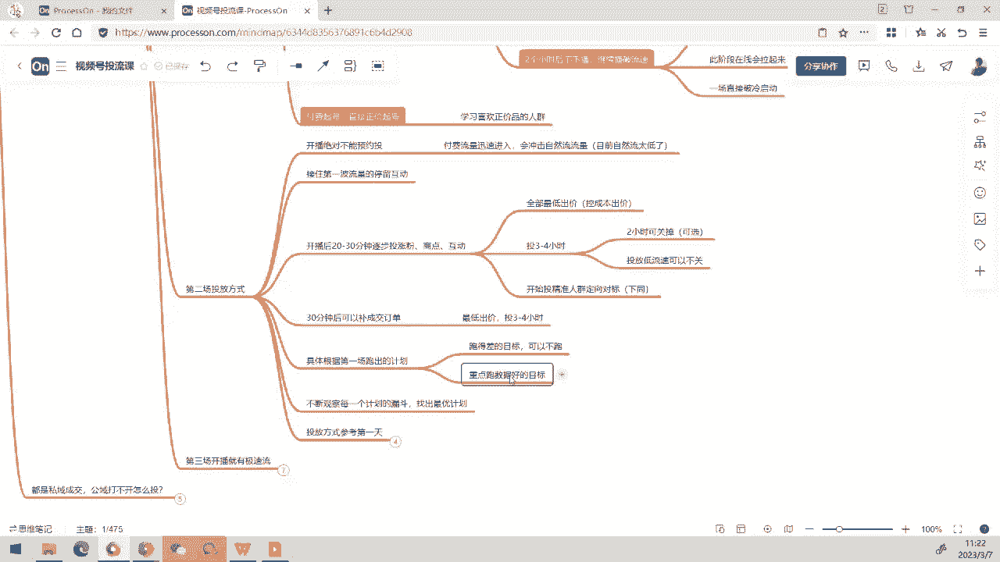
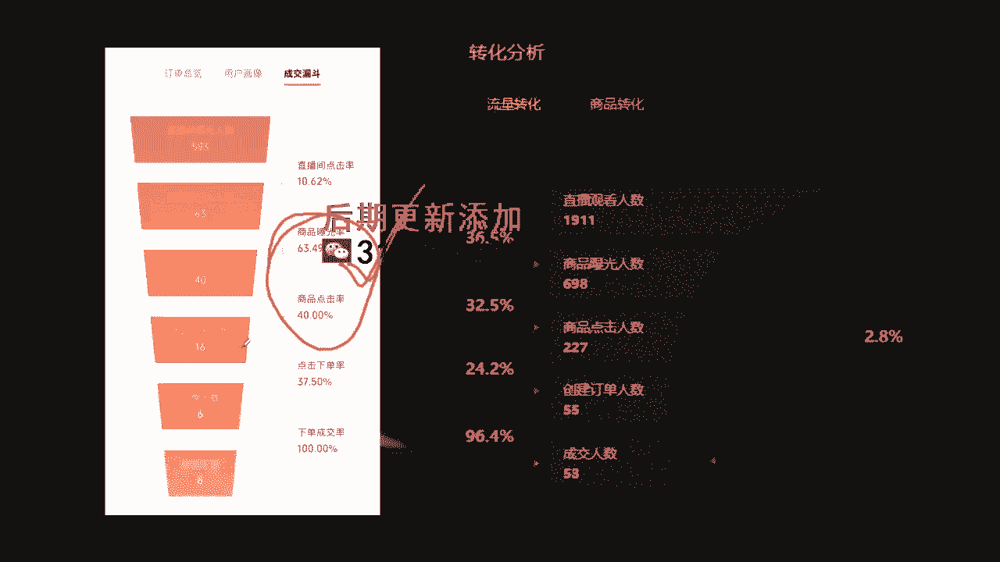
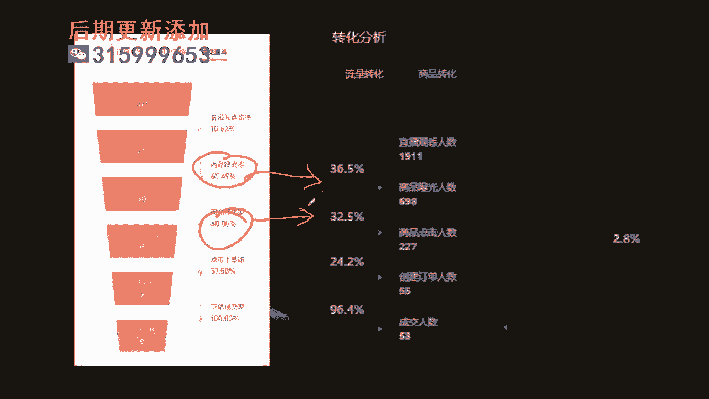
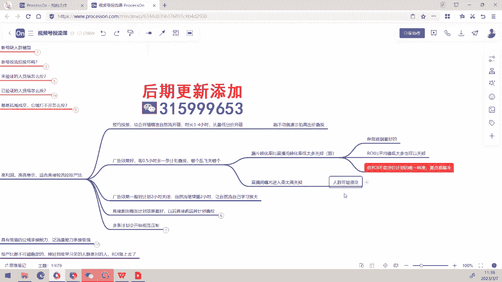

# 008 2023视频号直播·投流起号+破流速，深度拆解视频号投流模型与玩法 - P2：2-如何付费暴力起号+暴力投流赚钱 - 早安睿睿 - BV1cD421g76t

大家早上好，我们今天的课程呢现在就正式来开始了，咳咳呃，首先呢和大家说一下，这个你们现在对整个整个投流，在第一节课程之后的话，很有些的话也不止经历一第一节课程的。

你们现在对整个投流的底层逻辑呢，现在基本上都已经理解了，朋友的话可扣个扣个什么，扣个六好不好，扣个六，首先我们要先看一下，大家对这两天的课程内容了，对昨天的课程内容，是不是。

基本上已经有了一个对底层逻辑的理解了，然后呢这个理解很重要哈，这个底层逻辑的理解呢非常重要，为什么呢，这是我们在整个投流框架的一，个重要的一种理解，这种理解他对于你后边投流，不断的做自己的一个优化啊。

还有很多没进来这些啊，这个然后的话我们是对于后边的整个底层，逻辑的优化啊，是有一个非常重要的基础的，因为你后边你在投的过程中，你会发现有很多不断变化的东西，投流呢不是一成不变的。

投流是需要不断调整变化的，你看我们这个投流课的话，它已经到了第八版本了，每一期呢我们都在不断的优化，为什么不断优化，甚至连那个暴力起号这个我们都还一直优化，暴力起号，它本身已经是算是整个投流里边的。

相对标准的一个模型了，但是呢我们还是一直在处于一个，不断动态调整和动态优化的过程，其重要的核心呢就在于说这种投流的方式，他是要根据你直播间的状态，直播间的进度呢不断去进行优化调整的。

特别是呃我们很多可能是平拨平拨号，那如果说你是有节奏性的这种账号的话，那你更加需要根据大的这个这个环节，来进行一个重要的流量补充和调整，并且你要知道说在不同的阶段，你在不同的那个呃流量节奏下。

你还是需要去，比如说你该补在线或者是要补精准流啊之类的，这个动作呢，我们都需要持续的去进行迭代，所以你们要知道说你呢，前面我们给大家说的底层逻辑呢，是无论你在做旗号啊。

还是说你在做破层级抢流量的这个过程中呢，它是一个最重要的底层基础啊，是这样的一个原因好，那我们今天来看看怎么样去付费暴力起号了，这个呢其实是大家，如果你已经掌握了这套付费暴利喜好的，这个打法之后啊。

你会发现说投流其实是起号最快的一个方法，它有时候呢比其他的自然流和私域呢都要快呃，思域的话它其实也蛮快，但是思域的话你要知道思域它的这个呃，他很多人的思域体量不够大。

他在前期呢能够给你累积出来的数据量的话，它是它是还是有限的，但是他那个私域结合投流的情况下呢，你会发现旗号非常的猛啊，这些如果说你有私欲的情况下的话，会打出这样的一个效果好，那我们来看看这个付费包里。

跳动旗号的这个打法，首先第一个的话我们的星号呢一般情况下啊，这个是缺乏缺乏一个什么呢，缺乏一个人群模型的，就你没有人群标签，当你没有人群标签的情况下的话，我们通过付费的话是加速流量的进入，一开始的话。

我们作为一个新号哈，我们作为一个新号，如果我们去拉自然流的话，你会发现自然流很小啊，自然流的话很慢，这个时候呢播着播着一不小心就陷入死亡曲线，因为你很难确保说主播刚好在前面接流量，那个状态好还是不好。

这种东西呢它会存在一定的不确定性，那当我们有了付费，去持续不断的给到流量的情况下呢，就给到了主播比较轻的一个压力啊，主播的话他的容错率又变高了，再优秀的主播有时候的话也会有，比如说啊嘴瓢的时候。

状态不好的时候，或者是某一瞬间他干嘛的，这个时候，这个时候呢，它都会影响你自然流的一个拉流的效果，所以我们一开始的这个付费的目的呢，就是打人群模型，我们要破掉这个账号的一个初始流速。

这个就是我们在付费起号阶段，很重要的一个一个一个因素，那第二个的话我们想到告诉大家，付费呢一定在如果投的不好的情况下，他会压制你的自然流咳，当付费压制暂留的时候呢，他会他就会把账号给投坏。

那么这种情况下的话，为什么我们说那但是新号他怕不怕那个投坏呢，首先很明确的一点啊，新号本身它本身就全都是泛流量，那付费的泛流量进入的话，它没有一个头坏的概念，因为一开始公寓的流量它更加泛非常的泛。

而且那个新号来的泛流量呢是低流速，会让你难以学习，我们投流的目的呢就是做出一个快速试错，并且呢给到更多的那个呃，相对我们圈选的比较精准的流量，去给到这个账号，加速他的账号的一个学习，是这样的一个原因。

那么我们看看人货场，为什么我们每次开播，每次开那个头留客呢，我们都要先审核人货场，为什么每次开播呢，我们都要先审核人货场，这个前面大家都已经知道了，比如说我们这一周的话，我们其实拒绝了很多人来参加。

因为他的人货场一看，我就知道说这个账号不能投，一投的话肯定投不起来，然后呢我们就给到审核完了之后的话，就给到他一定的那个建议，说怎么样去做一下人货场上面的一个调整，去优化啊，去解决自己的基础问题。

然后再来投，刚刚还有一位也是在问我说那个啊，他这个要要投流，他说他投了呃，投了多少条计划，就是我们昨天晚上就查酒过夜话吧，还有一位新的朋友，然后呢他问我说他已经投了好多天了，然后一直没投起来。

然后我说像你这个情况的话，大概率你的人货场可能有问题啊，这个情况你要去先拉一下那个自然流吧，让主播学会怎么去拉出那个自然流线，所以这个就是我们说的啊，没有验证的人货场的情况下，你去拉头牛。

直接直接打起来，这个会打死你自己啊，就你你相当于说我们还是那句话啊，先把产品变得好卖，再把产品卖好，就是这个核心思想，那没有验证的人货场合怎么投呢，呃为什么，为什么我告诉大家这个我们这个动作很奇怪哈。

我们既给大家交投那个投流，同时的话我们又会拒绝，我们教教大家说未验证的人货场怎么投，然后的话又拒绝很多人货场不行的这个直播间，因为这种情况下是一个基本能力，我们当我们验证过你们的人货场是没有问题。

你们有拨起外号的话，就验证了你们团队的能力，这种情况下的话，未验证的人货场里面，自自身的具有自我优化调整能力，可能我现在我现在看的是这个号啊，但是我过两天我真的要跑的是另外一个号，重新起一个号。

这很正常啊，这在大家那个呃这个成熟的团队的话，会经常起号，这很正常了，那么一个没有验证的人货场，我们要怎么去做投放呢，很简单，直接去投500块钱的商店做长时间低价计划，然后呢你下播之后就他的关掉。

它就自动退抖了，所以咳咳咳，不好意思啊，就一般情况下的话，我们这个作为一个一个新号来讲，我们都会直接投个500块钱的商店，然后的话看主播能不能拉出在线或者成交，然后呢如果能够拉出来的话啊。

我们会在下播20分钟左右，哎我这个说现在的话，我给大家一个一个点哈，再修改一下，下播20分钟内，二开头67号直播呢四个小时以上的时长，这个能够拉出在线，什么意思呢，就是你的黄线能够稍高于近防线。

就是那条在线比近防线要高，这种情况下，表示说这个主播呢他是能够让人停留的，他能够接甚至能够要求互动的，这种就是被验证过的人货场，那如果不能够拉出在线的话，你就调整你的人货场和调整你的牌品啊。

这个就是一个一个重要的框架，那如果说你已经在前期通过这个方式，验证了你的人货场，它具有一定的承接能力，这个时候呢我们就开始来做投流喜好好，怎么样做投流起号呢，一般情况下。

投流起号我们会分为三场来进行叠加，如果你的这个人货场比较给力的话，正常来讲三场你这个号就能够被打开，三场的话甚至可以在一天之内直接完成啊，所以投入起号的速度非常快，原因就在这里。

那么我们看第一场是怎么投呢，第一场怎么投呢，第一场的话我们开播直接预约商点和涨粉，两个小时投定向投对标性别年龄卡住，其他的那个可以智能出价啊，然后呢那个对标兴趣你可以卡上，如果你实在圈不上。

你可以直接的那个通透，让他去进行大量的做这个学习，如果有私欲的话，你就投自己的私欲啊，同时同时让思域进场，open保留在线嗯，这个思域不是鱼塘啊，啊当然如果说你有自己的那个精准鱼塘，这是可以的。

就是你自己养的鱼塘，自己养的鱼塘，什么意思啊，就自己养的鱼塘也可以，然后呢你这个自己养的鱼塘什么意思呢，就是你这个这个水军号去竞品直播间啊，集美停留互动嗯，甚至呢拍单这个呢。

都是可以可以给你养出一个比较好的号的啊，所以这种情况下的话，这种情况下的话，我们但你不要用互动软件，或者用那个用那个去弄什么宝妈粉啊，那个意义不是特别大啊，但是互动软件的话可能还能帮你带带节奏。

但是的话我们其实不太建议用，为什么呢，因为它会让主播失去节奏感啊，这个所以在一般前期的话，我们其实还是老老实实让主播拉我们自己，所有的直播间，我们都不用水军，也不用那个额，不用那个不用那个中控软件的。

不用这个水军软件的，然后呢，所有计划呢你尽量都要设置定向和这个对标啊，这个定如果你知道你的客户是谁，那你就把定向和对标你最好都圈上，如果你实在不知道，那你可以通头让他去放出去学习。

这个过程中呢我们是加速流量进入，让系统有进行一个学习的对象，然后开播到20到30分钟之后呢，你去补那个互动不互动，性别年龄卡住其他自然书架啊，跟这个前面前面一样，然后呢性别那个对标的直播间还有兴趣呢。

你可以去圈选啊，尽量圈一下，因为一开始这样的话，你会发现你那个人群的的精度会比较高一点，行为这个过程中，其实就是我们通过商点涨粉和互动，去做直播间的行为交集加速学习。

就是在我们这个地方给大家所说的，在这个地方呢，我们本质上呢就是还是去，比如说我们先很先把停留拉进来啊，不是拉平流拉井啊，停留的人学习出来。

然后的话把那个转粉的人学一出来，然后呢把互动的人学一出来，我们再加速他这里边的一个交集，结果好，我们把它这个圈出来，加速他的这个交集，学习这个部分的这一句，就浅层做浅层这个地方怎么呃，对这个待会再说。

做出成交打人群模型的这个地方呢，我们你们可以去参考一下自然流的那个玩法，因为自然流是的，是我们的整个整个投流的基础啊，如果你没有看过自然流课程的话，你可以去找一下汪老师去问一下呃，这里面呢有一个逻辑。

什么逻辑呢，人啊系统是怎么学习的，系统是怎么学习的，首先呢你要明白说，我们一开始一下子一个直播间，要学出很精准的人，是没那么容易的，正常来讲，一个人进入直播间之后呢，他如果对你的人货场有兴趣啊。

如果他对你的人货场有兴趣，会发生停留，那这个一第一阶段的话，在你的直播间愿意停留下来看的人，他就是相对来讲比较精准的人，当你发生了停留之后的话，当你发生停留之后呢，他等到能够看到商品。

他看到商品曝光之后，他如果有兴趣，看到你对你的东西有兴趣的情况下的话，他会去点击商品，对不对，所以第二阶段的话，我们学习点击的商品的人，他会变得更精准，到了第三阶段的话，他如果对这个商品有充足的兴趣。

他是有下单的意向，那么他会可能会跟你互动，他会对他那个呃参与直播间，最后的话才是下单成交，对不对，所以到最后下单就是系统，他这个他这个行为学习呢，我们要知道一个人进入直播间之后，他是有这样的逻辑顺序的。

我进入直播间，我先对你直播间货场有兴趣，我就发生停留，停留之后呢，我停留了20秒，商品曝光出来，自动曝光出来，不是我指的，这个是一般我们如果你是主动弹出的话，可能不需要20秒。

但是呢一个人在直播间里面呢，他如果商品要自动曝光，它就需要20秒的一个时间，所以商品曝光之后呢，他如果有兴趣，它会发生商品点击，这个时候你会发现他如果停留的人，他可能还不是特别准点的，商品的人就更准了。

互动的人就更准了，成交的人就更准了，还有一个呢是还有很多人的话，他是来到直播间之后会怎么样啊，他不一定会第一次会互动，他可能的话是第一次来到直播间，他会保持观望，保持观望，保持观望的时候呢，他会干嘛。

他会先关注，对不对，第一次来的人很多，也是不是立刻立刻成交的啊，所以他会先关注，所以我们按照这个逻辑，你看为什么我们先投商点，为什么先投商点再投入，同时投涨粉，因为这两个数据学可以加速这两种行为的人。

他在直播间进入学习，接着呢我们去投互动嗯，我们投互动啊，因为有些人的话跟那个如果他有兴趣的人，他会产生互动，后来会提问，对不对，所以最后才成交，所以我们在看到这个地方之后的话。

你们就明白这里边呢我们在这个阶段，如果你能够打出成交的情况下的话，我们尽量是打成交，我们尽量有成交的话，我们做出成交，没有成交的话，全部只有浅层的也没关系，成交呢可以迅速的帮你打那个人群模型啊。

这个地方还是参考自然流那个地方，然后呢你要记录下来，商点涨粉互动这些计划，哪一个漏斗会相对比较好，把漏斗数据最好的计划你要记录下来，因为这个的话可能是你目前这个阶段，你的直播间。

大家的表现出来更为明确的这个行为方向，从同时开播一个小时后呢，我们就会去补个两个小时的订单成交，还是智能出价，投一个小时后关机网，一个小时后可以关计划，这个时候的话你会发现啊。

我们前面的播了这两个小时之后，播过这两个小时之后的话，然后我们再开始干嘛呢，一个小时后，D前面的前面的这些计划已经逐渐的停掉了，这个计划呢也是逐渐一个小时后，准备要停掉了啊，所以他已经会结束掉了。

但是呢你有可能说，前面你这两个小时学习的不好，它会导致你后边停了广告之后，它会有自然流没流速的这个情况，他会出现这个情况啊，这种很窄很窄的人群的直播间，他会出现这个情况，这个时候呢你可以不管他。

让他一直继续投同样的性别年龄，卡住其他其他智能投放啊，因为智能投放的话是放量跑，让他随便跑，前两个小时呢我们其实就是通的直播呢，就是我们通过通过付费，学习之后的话，你会发现这个过程中。

你的在线会发生剧烈的波动，为什么呢，因为付费流量很泛，他会在大量的胡乱学习，两个小时后，你的广告逐渐结束之后呢，如果你的直播间具有一定的承接能力了，那么你会发现你的在线会被拉起来，自然流。

它是你整对所前面所有的那个在线的人群，他的行为的交集，行为交集学习的结果，付费流量呢它是单独这个目标作为学习的结果，所以你要记得哈，两个小时后不要下播，就是你广告投了前面两个小时后呢，你不要下播。

你去干啥呢，你继续播，继续播，用自然流直接去拉，让它破流速，再播个一到两个小时，这个阶段呢，如果说你的那个，如果说你的这个直播间具有承接能力的话，你会发现你的在线在这个时候就会被拉开啊。

第一场呢你就会破掉了，这个冷启动直接就可以破人启动了，诶，我们的left ft也来了哈，他是以刚刚他最近的话，才用这个方法投了一个号哈，他那个这个投出来的效率呢，他就是已经很清楚了，对不对。

这样的话刚搞刚好过来。

啊raft的话你可以跟大家说一下哈，因为咱们那个今天这次呢又有一些新朋友，就你会发现前面的话，我们在在那个播的过程中啊，你会发现你的付费流和你的那条在线呢，它是完全差不多叠在一起的。

然后等到你后边的话付把付费停掉之后，你会发现那条在线呢它逐渐被拉开，人被学习出来，但是载人群的直播间哈啊三天就起成功了，对对对对，就是Deft的话，他就是给给到大家很多新的朋友一个信心哈。

就是这套方法呢去打的话是很快的，但是如果你的人群很窄，或者你前面学的不好的话，你会发现他后面的话，可能他们可能没有拉的特别开，没有拉的特别开，但是没关系。

这个是没关系的哈，就是你还是要扎扎实实的，你要去依赖自然流学拉，你要知道自然流失我们起号的关键所在。

自然流是起号的关键所在，如果说你完全的靠付费去硬打的话，你会发现他打着打着，他一直没有机会去让自然流好好的学习，他没有办法去学习那个精准人群，所以你会发现呢就是一直盲目的去去打，他是呃不好的啊。

一不好的就是那个一直用泛流量在冲击它，所以在这个过程中的话，一般情况下呢两个小时候你不要去下播，你一定要相信自然流的能力，相信算法的能力，你去继续播个一一到两个小时，这个阶段的话。

起号阶段会比较辛苦一点，因为你会发现的，就好像哇那个在线一直拉不开，就几个人在线，十个人在线啊，但那没关系，你要你要知道，说这个账号在这个阶段就是这样子，然后如果说你主播能力很强啊，这是另外一码事。

主播能力很强，本身它自然流的一拉就拉起来，更何况可配合付费呢，是不是那大部分的主播他还没有那么强啊，那这种情况下呢，我们通过这个方式，你一定要相信自然流，让他去拉，然后呢那个付费起号的话。

我们一般的就是直接正价起号就可以了，学习喜欢正价品的人群，当然付费起号同样也可以通过排评起号，付费起号也可以通过排评旗号，这一点呢啊和大家要要说清楚哈，如果你主播能力相对来讲比较强。

你的团队擅长于做排评旗号，那这种情况下的话，你直接用这个方式也可以，但是你要记得，我们在自然流的课程里面，有提到你的所有的那个，如果你按照福利品放福利品来起号的情况下，你一定要当场一定要转正价。

要不然呢他会打歪人群，而且的话我们正进程正常来讲哈，付费喜好呢你是直接正价起号的，原因在于说我们要让正价直接付费学习，正价停留人群，就是这样子好，那我们再来看第二场的这个投放方式，应该是怎么样的。

这是第一天哈，这是第一天，第一天的话我们通过硬砸，第二天呢我们开始减少一定的付费量，但是你要记得开播不要预约头开播不要预约投，为什么呢，因为在这个阶段你的付费流量他其实很泛的，你的自然流呢前边前边的话。

在第第一场，第一场是刚刚让自然流学出来，学出来之后的话，你现在的话又又直接用付费流量换流量，直接用冲击它，它会导致什么呢，导致他那个泛的付费流量，会迅速的压制你目前的很低的那个自然流。

所以在这个地方我们建议大家说，你尽量一开始开播，第二场不要预约投放，你要让付费流量再拉一拉，你去你去接住第一波流量的那个停留互动，你去把他接住，接住之后，开播之后的20到30分钟之后。

逐步开始投涨粉商点和互动，这里边呢全部出最低价，控成本出价全部跑最低价，投3~4个小时，然后呢两个小时可以关掉，这个时候的话，如果你还是流速很低，那你可以考虑不关，但是在这个阶段的话。

我们还是通过短时间的计划，3~4个小时的短时间计划，让他重新去呃，配合你的自然流去拉动，这个阶段的话，你要记得哈，尽量投精准人群，就是核心目标客户圈进来30分钟后呢，你就再补那个订单成交啊。

最低出价投3~4个小时，后边可以关哈，后边可以关掉呃，然后呢根据第一场跑出来的计划，如果说跑的很差的这个目标，你可以把它关掉，可以不跑，我们重点开始跑。

数据好的目标，什么叫数据好的目标呢，什么叫数据好的目标呢，数据好的目标就是这个这种看你的漏斗，前面的穿透率，你可以不看它穿透率的话，它有时候穿透率很高，它流量反而会特别泛，然后呢你低穿透率没有问题。

低穿透率没有问题，你重点看的是后边这个后边这个的话，商品曝光率，商品点击率，下单率啊，下单率有时候还不看啊，为什么呢，有些那个高客单直播间的话，它本身那个下单率就不会特别高，重点看前两个这个数据。

前两个数据一定得好啊，好的这个前两个数据好的情况下。

基本上就是属于说这个计划还不错，我看一下哈，刚好现在的话呃，今天早上他就在他在那个启浩今天早上的喜好，我看一下啊，他这个是，刚刚的他有一条互动呃，我看一下。

把他那个账号名字屏蔽一下，他刚好今天早上呢正在正在那个互好。

我把他那个直播间的那个名字去掉，你看啊，这是他现在的话正在跑的一条计划啊，刚刚他发了给我看啊，你看他这个计划的话，就我刚才说诶这个互动跑的还不错哦，啊，就是他这个互动呢已经跑出来两个订单成交了。

这是他起号第一天他第一场，但但然后呢，他因为他的人货场本身呢还是可以的，但昨天的话他去监测了测了人货场，然后测完之后的话，我跟他说那个唉他说的没问题，那没问题的，我们说那今就按照课程内容直接来起吧。

你看他这个跑这个漏斗，那就还不错，他直接就逆行成交了，那这种情况下他这个起号速度就很快了，因为他跑出来一个比较好的目标，你看这种就是看起来那个商品曝光率不高，商品点击率还可以，但这种起号期的话。

这种计划已经算是一个相对精准的计划了啊，他这个是跑额女装啊，女装的账号嗯，好，所以重点跑好的那个目标啊，重点跑好的目标，然后呢不断观察每一个计划漏斗，我们要找出你的最优计划，投放方式呢。

就依然是参考第一天两个小时后不下播，你要继续播去破流速，继续播去破流速啊，这个再播再播个那个一到两个小时，这个阶段呢你在线会慢慢被拉起来，还是那样子哈，就是一开始他可能答出来会比较泛。

但是呢你随因为这种的话，你全部用了控成本之后，你会发现你的流速会迅速降低下去，它不会跑的特别快，当流速降低下去之后的话，他就给了自然有一定的那个学习空间，到后面的话，你就两个小时后又是关计划之后呢。

你又是让自然流去拉。

就我们不断的通过这个方式呢，在前期直接去让让什么呢。

让你的诶直接去让你的那个呃，我们放一些流量进来，我们放流量进去。

让系统实现不断的交集性去学习，于是呢他就学的很精准，出来学得非常精准，对不对好，所以在这个地方之后呢，我们来看哈，这个是第三场，第三场来播了，第二场你继续播啊，你要这样说，起号要有耐心的。

他这个方式的话，已经是比你拉自然流要快很多了，快很多很多了，就是刚才这样做三天起成功了，有时候的话我们我们会在一天之内就识别了，把这个号三场直接给拉掉了，也会这样子做，因为那个自然流的话，你付费嘛。

付费你就没有太大所谓了，就是这样子呃，第三场呢我们开播就有技术流了啊，很有可能会有哈，可能有可能会有，也不一定，有时候会没有，这个时候的话我们开始快节奏的，你要放福利品啊，放什么的，这个都可以去做承接。

因为这个时候人群会相对比较准，但你要记得哈，福利品不等于低价品，这个地方千万不要弄错了，福利品千不是低价品啊，你不能说一来的话，我就硬拉那个低价品，低价品的话，他福利品它也可以是很贵的东西。

这个是跟客户的认知有关系的，这个地方你可以参考那个牌品课呃，可以用ABC或者BC的一个打法，极速流，接不住的话怎么办呢，放掉他，你别管他能接就接，不能接就不管他，第三场呢我们开始进入微付费阶段。

这个阶段你可以优化一下自己的牌品，微付费什么意思呢，你挑选前两场最好的目标和兴趣，最低出价时长24个小时，直接开始把时长全部拉满，让它慢慢的给流量，然后呢你用自然流去拉这个微付费呢。

它第一个它会保证它的流速会很低，然后呢这种情况下，它可以不断的给你自然流做流速的补充，用自然流来跑出你这个账号的结果，当你第三场进入微付费阶段之后，你会发现这个阶段就是你的账号。

即将要开始起量的这个阶段了，如果你的人货场没问题，第三场你这个账号其实就已经被起号起来了，这种起号呢它会进入一个什么阶段呢，它会进入一个什么阶段呢，喜号成功的标志，好人群准流速稳，刘树稳。

然后呢打化文几号成功的标志，就是这个标志，就是所谓的起号成功，不是说你一下子打出一个上万的一个场关，不是这个逻辑，而是我们起号成功标是只要你定住一个人群，推给你的人已经开始变得比较准了。

同时的话你的流速呢又比较稳了，然后你的转换呢相对来讲会比较稳定了，这个阶段呢其实就是你已经进入起号成功了，然后呢只是没有破流速而已，所以在这个阶段呢，你要让自然流去拉一拉。

让他去拉出一个相对比较好的一个数据，这种情况下你拉着拉着在不断地配合，接下来就是我们后面会给大家讲哈，付费你要破流量层级，我们明天说付费破流量层级的事情，这个的话也就是我们把这个账号拉起来的。

一个状态了，把账号拉起来之后的话，你整个整个直播间呢，它会进入一个相对来讲非常稳定的一个状态，然后呢，你在当你在不断的去进行，这个微付费投流的时候啊，你会发现账号他就会越播越好，越播越好，人货场好的话。

这个可能就上的很快，人货场相对来讲承接能力没有那么强的情况下，你就会他会上的比较慢，这个很正常，所以核心一定是在人货场，那后边的话，这个还有一个点啊，就是如果说在这个地方三场之内呢。

一般情况下这个账号就可以打起来，就像我们rap他说的哈，三天就起要成功了，就是这样的一个逻辑啊，起号但是起号成功，它不意味着说就打几万的厂关啊，不一定哈，这里面的跟还是跟人货场有关系额，然后呢。

如果你都是思域成交功率打不开的情况下，你怎么投呢，呃如果你等货场对新的电门定没问题，那我们就直接参考上面投放啊，拆杂学习，然后如果说你一直打不开公寓流量，可能你本身的公寓，那这个人物场呢。

你根本就没有对于你的公寓去做出一定的承接，这个时候呢都是老粉，你只是在招待老粉，新人的话又不知道你在干嘛，这个也不可能投号，所以如果投放最后效果不好呢，你要调整通过排品去承接公寓流量啊。

牌品和人货场呢要围绕新人去做承接，这是一定的啊，呃你不要只是老是接接那个老粉，这种情况下的话会影响你承接新人的流量的啊，这个地方不清楚的话，你去看一下牌品客好，来到这个地方之后的话，我们把投流。

起号的这个重要的模型就给大家说了，而且大家知道啊，这次的这个模型呢，我们给大家讲了一个底层逻辑，为什么要这么投的一个底层逻辑，刚才呢在这里我们做了一个很重点的一个补充，在这里呃圈个红。

啊我们一定要先理解底层逻辑，然后呢，也是为什么，我们现在调整到这个版本的那个旗号，基本上都花不了多少钱，这个三场下来的话，可能就花个花个一两千块钱吧，基本上你这个号就打起来了，很快的啊。

这个我们为什么现在都是用这个方法来打，你仔细想一看，你就明白，如果说我现在，如果说我现在啊这个我用自然流来拉，确实我不需要会付费，但是你想想我自然你要拉个一周的时间，你的主播的成本，场地的成本。

人工成本，还有各种各样的福利品的成本，这些加起来的话还不一定能够起，但是你用这个几号的这个方法的话，一般情况下几天之内就直接打起来的那个效率，甚至一天之内都能打起来，那个效率啊。

那个那个那个给到团队的信心啊，真的是真的是非常强的呃，有预约的号合适，不，预约的号非常非常非常合适，预约的号打这个方法的话非常非常非常合适，为什么呢，因为预约的号在哪里看一下啊，预约的号的话。

你会发现他会给你很强的保留在线，而且一开始直接给你做出那个成交，所以一般情况下的话，打预约的号是非常非常好打的啊，但是没有对标，没有对标和兴趣分类呃，建议在在投的时候圈选圈，选一下性对标和兴趣分类。

起号阶段的话，我们要把尽量把那个目标给缩窄一点，这样的会方便我们去，让我们的那个，让让公寓推来一些更精准的人群啊，加速公寓的学习，他会降低他的学习成本，所以一般情况下的话，如果你有打预约啊。

那我们去用这个方式来打呢，他的速度会更加快，就是我们刚才讲的用私域，用私域配合那个配合付费的话，打出来的效率是非常高的，这个预约的话就相当于说预约的话，其实就相当于说我们去配合了老粉吧啊。

类似这样的动作，因为一般情况下如果能够打预约，那这些打出来的预约呢，他可能都会有一定人群模型标签，特别是用短视频打出来那个预约啊，他可能多多少少都有人群模型的，那么我们如何利用那个付费来直接赚钱呢。

啊这个地方我们就看了那个怎么样去付费，暴利喜好的这个打法，那么我们看怎么样去用付费来直接赚钱呢，这种的话比较适合高利润高客单的这个直播间，那这种直播间呢我们直接就是投流拉投产比。

前面这个头发我们一般呢就是大部分的直播间，如果你不是高利润高客单的这种直播间的话，你看投产比没有意义，因为看投产比的话，你会发现很多直播间投出来都是亏的，那我们其实很多时候我们直播间呐。

这个就是只求平衡，不求他赚钱，但是呢有些高利润，高客单的这个直播间的情况下的话，我们可以直接通过投产拉投产，直接把他把他打到直接赚钱，这种呢就是我们先预约投放，然后呢结合开播的精准自然流啊。

直接去砸时长3~4个小时，从最低开出价或者砸跑不动，我们就抬高出价跌头啊，但是那个一开始的话，我们建议啊这些计划呢先不要跑的太出价，不要跑太太高，太高的时候你会发现有时候太高的出价。

他跑出来的其实他人也不是特别精准啊，这个是他跑不动，本身就是因为难以学习，男女学习的话，我们通过硬台去去去投的话，你会发现他投出来人也不是特别准啊，这个是第二个的话，广告效果好的话。

我们是每半个小时我们可以多一条计划贴头，然后哪个跑分就跑哪个，漏斗穿透率我们比直播间穿透率低太多了，我们一般都是把它关掉，漏斗穿货率哎，这个地方这个地方漏斗转化率，不要穿透率，穿透率会误导啊。

可能大家以为以为说就是那个点击穿透率呃，漏这个漏斗转化率呢比直播间转化率低太多的，要关掉保留数据，最好的RIP平均值低太多也关掉啊，但是呢这个RI8不是评价计划的唯一标准，我们重点看漏斗。

重点看漏斗什么意思呢。

看这个地方，看着你看漏斗哈，一般情况下的话，我们尽量保持那个漏斗跟那个直播间的漏斗呢，它会有一定的近似性，但是呢高客单高高客单高利润，高客单高利润的这个直播间的话，我们只需要保持漏斗跟计划呃。

跟跟你的直播间的整体漏斗之间的它近似，就可以近似就可以，不一定要说比较高，不一定比较高啊，如果你比它高的情况下，他会撬动自然流，但是呢有些时候呢我们需要放量，放量的时候，我们不一定能够比它高。

这个数据不一定会比他高，这种情况下的话，我们就那个呃我们也可以没问题嗯。

所以RI不是评价的唯一标准哈。

所以这这个我们如果都低太多，比如说这个数据30，我这边是四三十六，我这边跑出来只有10%，那你要知道你这个计划一定是跑废了呵呵，但是你不要太着急，可能会先跑个跑个几10分钟吧，跑个那个40分钟左右。

你才能判断这条计划到底跑的好还不好，这样说，很多时候开场有跑的不错的，想提高流速，开始提高价格，缩短时间跌投，但很多时候跌头跑不动，跌头跑不动很正常，一个目标呢同时叠投多个计划的时候。

他就会他就会给那个开始跑不动，跑不动的时候，你可以抬高出价啊，缩短时长时长，然后呢他那个能够跑动就跑动，跑不动的话就没办法，每毫动没办法，只能是让他这么去拉着拉拉着拉着他，有些就会被拉动。

还有一个呢就是你要知道，如果你的直播间的计划要跑得动，其他们有其中有个很重要的前提，是你尽量在要保持在一个高在线率，高在线率呢它是跑动计划的一个重要前提，在线越高，你计划能动的就越多。

计划那边那个战线越低的话。

你的计划呢能够跑得动的就越少，他是有相关关系的啊，呃直播间的曝光进入率太高的，我们就把这页报关掉，就人群可能会特别泛。

就这个地方啊，这个地方他如果一直保持在特别高的位置的话，他很有可能的话就会跑不动呃，JEFF你可以试一下，就是你打那种预约啊，打完预约之后呢，就很高的这个预预约量拉出很高，在线的情况下的话。

你会发现那一场你所有的计划碟头也照样能动，但是你要记得第一个小时一定要把在线保住，一定一定要把在线保住，只有你把在线保住了，才有可能把那个在线把那个计划全部拉动起来。

嗯这个地方嗯算了，这个这个是我们是讲讲这个课程，就先不看，我明天的话给你们看看一个一个一个投流结果，明天给你们看一个投流结果，就是在高预约量的情况下，打出很高的那个在线率。

然后这种情况下很多计划他都会在跑动，明天我把那个截图截出来，放在明天的课程里面，因为明天的话我们要讲用付费破流量层级，那个地方广告项目，一般的计划呢就是跑个两个小时，你可以把它直接关掉。

然后自然流继续拉啊，让自然流继续去学习放大啊，这种是高利润高客单的，照样也可以关掉计划，就已经跑出来之后的，后面的话它爬跑准了，跑出出水流速的，后面你要关就把它关掉，然后慢慢去拉。

然后呢你要直接测出哪个计划的话，是去那个效果最好，以后呢你就跑这种计划不断的去叠投，你要记得哈，跑的时候一个计划呢你就尽量一类兴趣标签，一到两个最多，然后不要弄太多一个计划，一类兴趣标签。

它能够非常清晰的让你知道，说这个兴趣标签投出来的一个效果，不一定要卡在自己的行业上，你做服装啊，你可以投珠宝去做，尝试做高档服装的哈，高档服装可以投出宝，尝试可以这样举投，测出哪个兴趣标签最精准。

然后呢我们就重点投，然后可以预约投放，可以预约投放，记得哈好好计划都可以预约投放的，多条计划呢会开始相互压制，就刚才GF说的这个问题，跑完精准计划后呢，那个呃你可以如果说你的投产比可以，你可以通投拉满。

在ROI好的情况下，风投拉满有时候的话，有时候的话是是可行的，有时候不可行，你在测试之后呢，你要看一下跑出来的一个结果，一般通头呢我们都看RI，如果RY不行的话，通头就不行。

因为RI本身就不是用来撬动自然流的，RR那个通透的目标呢基本上都是直接放大了，但是他如果跑的好，也会放大自然流哈，呃但是呢就是RY是非常重要的，非常非常重要，通投计划要能赚钱。

不能赚钱的通投计划就没有意义，呃，如果你具有极强的那个公益承接能力，泛流量的能力呢，成绩很强，这种情况下呢，一旦自然流能跑出非常高的这个数据，高在线高流速啊，砸广告直接叠投计划。

叠投计划大家都知道什么意思啊，就是我们投完之后呢，过一会又再投，就再投，不断往计划和叠计划抢流量呢，就拉高在线开播呢我们不预约投放，开播20分钟，你要硬砸硬砸那个优质目标，哎等一下。

这是极强工会承接能力，呃哦这个地方我后面的话，这是我改掉哈，开播可以预约投放，这个我们经过测试之后，预约投放没问题，就这种直播间预约投放没问题啊，可以直接预约好，把这个修正一下，开播20分钟开播。

预约投放，直接硬砸优质目标好，哦哦对对对，我这里是有补充的，忘记了对，是的呃，呃如果非优质目标的话，你就不要去投，但是如果说你是计划是很精准的，你可以直接预约投放，这个没问题，精准计划。

优质计划可以直接预，直接去预约投的，然后呢每隔半个小时呢就补互动，补涨粉，补成商店，补成交，承担计划三个小时呃，这个地方的话我还有一点哈，就是尽量还是优选太泛的计，太泛的计划的话，你可以不投的。

如果泛流量的沉淀能力很强呢，我们可以直接补观众，可以直接补观众，其他目标呢都不准的时候的话，可以补观众啊，然后还有一个强憋单类的直播间的话，你也可以直接补观众，建议这里边呢我们都是定向跑哈。

只要不要不要去通投拉满，通投拉满的话其实不太好，这是两种直播间哈，两种什么，第一个是高利润高客单直播间，第二个的话是具有极强承接公益承接能力的，泛流量承接能力很强的直播间，这是两种投法，两种头发。

这个的话是当你的人公寓承建能力很强，特别是有一些强别单的直播间的话，你会发现投过投观众，他那个数据还可以的，因为他的在线停留人群，他停留的挺久的，这种情况下的，那那个整个计划学习还是可以学习的比较好啊。

甚至有时候跑出来比其他都好，空投的话也是要卡年龄的，然后呢这个还是注意到这这么一点，哪条计划跑分呢，你就要关掉哪条计划，再强调一下，不要用直播手机去做投放啊，我们如果你要用直播。

手机里面有热量券啊什么的，你要用pad去调广告呃，网页版的话它比较方便去调广告，然后呢要用另外一台手机投，因为中间的话我们经常要调广告，补广告，你说跑一半的话，你突然间又拿那个直播手机来扫个码，多麻烦。

对不对啊，然后送的流量券怎么办呢，送流量券你可以那个凑够，凑够券之后的话去去去把它抵用啊，直接那个比如说预约投放啊什么的都可以，送的流量券的话就只能攒攒够了，就能够能够投吧啊。

另外一台手机投放才能跳广告，投产比呢基本上不太可能稳定，就刚好那批学起来的人群是精准的，然后RY就上去了，还有一个呢是刚好你今天的话那个整个自然流，整个自然流的那个效率会比较高的。

情况下的话就会直接的话直接就直接投出来了，然后把整个数据做好了，最后的话立刻单的行业呢不要去看投产比，你要看什么呢，要看对自然流量的一个撬动能力，很多低客单的直播间的话，你去看那个投产比是没有用的。

你去很多很多低客单的直播间，你看投产比没用，为什么呢，因为我们是付费，我们要撬动免费，像这种直播间高利润，高客单的直播间呢，我们是直接去投流，把它砸，我们的那个直接砸我们的这个投产，这种直播间的话。

它具有很强的公益承接能力，但他利润率没那么高，这种情况下呢，我们的核心目标呢是跑什么呢，去跑我们的付费撬动免费啊，这个就是我们的核心思想上的一个区别好，然后最后的话再给大家强调一下啊。

今天的这个内容再给大家做一下强调，强调什么呢，第一个我们的付费暴利撬动起号的这个打法，你们要知道，如果说你们有私欲的话，你们结合私欲去打，效率会非常非常的高，如果说你有预约的话。

你打预约这个效率也会非常非常的高啊，我在这个地方给你们补充一下呃，我给你们补充一下这个地方，有私欲投资的私欲啊，同时的话，那个再给你们再补充一下，有预约的话，这个起号效率会更高，预约来的人群他很精准。

而且给你保留在线，而且他后面的话他前面已经做好心理准备了，他那个要成交的，成交的话，成交的那个人群他会一下子帮你打出来，所以这种情况下呢，你起号效率其实很高的，所以尽量呢我们通过这个方式。

私域结合那个结合，结合我们的我们的旗号打法，其实可以迅速的帮你学习出一个，相对比较精准的人群，这对于你起号的话，它是一个非常非常重要的一个环节啊，一个一个加速作用啊，好那今天的这个内容的话。

我们就是几个关键内容呢，就到这里，我们看一下大家有什么样的问题，我们看一下大家有什么样的一个问题，是不是心情刚刚才来啊，呵呵我看到心情的话，在他自己的群里面说，他他那个怎么今天的课程跟昨天一样呢。

他点错去看看了昨天的回放课，呵呵应该是现在才刚进来，对不对对，来看一下那个我们今天今天的内容，大家有什么不清楚的，有没有，我刚好看到那个孟老师在群里的，你说你那个看错课程了，新品选兴趣有点麻瓜了。

新品选兴趣这一块啊，如果实在圈不出来的话，通头其实也可以的，我们在前面的话，这里有说，嗯在这里有说啊，就是这是一个可选项，如果实在学不出来的情况下的话，我们还是可以去帮他去进行大量学习。

因为你如果说卡对标卡兴趣啊，他会相对来讲让你直播间学的更快一点，那你卡不出兴趣的时候的话，我们就让他放着学习吧，然后然后的话尽量在前期忍住，其实卡对标会比较容易判断，因为对标直播间你一看就知道唉。

这个直播间是我的对标直播间，你其实还是比较容易识别兴趣，有时候还不好识别，对标反而比较好识别，所以在前期的话尽量还是卡一卡啊，这样的会比更好一点，新品有时候确实不好判断他这个东西要测的。

我们在我们在明天的那个课程里面呢，会告诉大家说怎么样去怎么样去测那个兴趣，兴趣的话就一个一个测头牛，它是一个精细活，很多人都会觉得那个头流很简单，其实投流的话真的是一个很精细的，一个一个一个头流呃。

呃呃需要一个很精细化的一个投流过程吧，因为因为本身呢就是因为它头流，它看起来太简单了，我你们看这个视频号，我得给他拉一个界面出来嗯，拉一个界面出来，你看这视频号的话，他这个投流就这么几个选项。

就这么几个选项，这个选项会让很多人误以为这个东西很简单，有时候的话往往是看起来很简单的东西，它用起来最难，因为你要去理解它的组合思想，之后的话，不断的去进行各种方式的一个叠头层啊，不断方式的去测试。

测试出它最优的一个组合方法呃，玫瑰花茶短视频报了预约，三点8号的600多预约，这几天用新号测了进去，木有测出来，也没用直播间啊，这个600多个预约的话，这种短视频，他整个人群模型给你的那个那个那个人啊。

整个短视频给你的人群标签他已经很准了，600多个预约情况下，一打开一开播几百人在线，然后呢直接在这个阶段的话，在这个阶段可以这么投了，换了个方式投这种这种就很特别了，这种很特别的。

这种的话是直接直接在这个这里面的话，我们性别年龄卡住，然后呢智能出价让他去跑第一场，直接智能出价让他去快速拉流，然后呢去卡对标，卡兴趣，去让他哎不是不卡，对标不卡兴趣，我们直接通头让他学习。

甚至你如果说有这么多的预约量的话，其实都已经可以用第二天的这个打法了，第二天的这个打法都可以了，第二天打法了，就直接那个，在哪里直接是控成本租掉了，可以用这个方式来打了，因为这么这么大的在线。

基本上呢都可以直接拉出拉出那个学习的，直接拉出计划学习的嗯，就放开学，让他放开学啊，然后也可以直接不要智能出价，智能出价呢他会帮你主动学习穿透率，直播间的点击率更高的那个人群，有时候他会偏泛一点。

说像像像你们那个打了600多个预约的情况下，开一开播20分钟左右，已经能够拉到300多再见，那这种情况下的话，就直接直接去那个直接用配合去学习就好了，对测兴趣，测兴趣的话。

测兴趣的话还是放那个低流速去测试吧，明天明天我们那个课程呢，会有一个重点的一个说法，明天早上哈，明天早上大家如果33月8号有在起号的话，你们那个把明天早上的课程呢先看一遍，因为明天早上课程呢。

我们会讲到一个测进去的方法，测性去的话，我们要用长时间的低流速计划去进行测试，然后放着跑，然后可以多个目标测试，然后中间哪个跑飞的或者跑坏了，我们就把它关掉，然后呢就记录下来，要做文档记录的。

要做文档记录，然后哪一个计划目标好，哪个计划目标不好，我们再重新合并啊，这个是持续要持续做调整，咳好我们再看大家那个有没有其他的这个问题，目前我们这个投流起号的方式的话，速度非常非常的快。

就是在你没有公没有私欲，也没有预约的情况下，你用这个方法啊去硬拉就能够正常，就都能够把它拉拉破了，前面几个版本呢投入起好的成本会相对比较高，然后调整到现在第八版的话，我们整个投入喜好的成本呢。

已经控制在一个就是相对比较低的一个范围，然后我们再看一下后面还能不能再往下控制，能够再控制的话，可以再控制低一点，然后呢这个如果有预约起号的话，这个可能打起来还还更快一点。

好再看一下我们还有没有其他的问题，心情你待会的话重新看一下回放哈，重新开始回放，你怎么点到那个第一天的课程里面去了，你看的那个课程内容啊，这重复的话，你要这样不对的才对啊，你怎么还硬要把它看了。

看到看到45分钟，你才去群里面问，怎么今天的内容跟昨天一样，笑死我了，思域用什么方法加比较好，用那个体微用协微信去加，用企业微信去加，一开始用企业微信去加，然后呢你就那个话术很简单。

你就用我这个话术就行了啊，呃拍了拍了的那个姐姐们，你待会的话你们直接拍了，拍了之后发给你拍，然后同时的话我给你们弹一个企业微信，这个企业微信加添加了之后的话，如果你收货有什么问题。

或者你发货的订单号都可以跟客服拿，让客服帮你查单子啊，这样就是售后的话比较容易处理一点，这样子的话这个大家就一弹出来，人家很多人都会点那个企业微信了，速度很快的，拍了之后让他去加一下子就加上了。

拍了之前的话可以加也可以，就是说啊刚才我们这个练这个这个直播时候，谈起微信，对直播谈谈起微信，然后呢你在那个成交之前也可以谈，谈的时候呢，你可以说啊里面的话有一些细节不清楚的。

在直播间里面主播来不及回答的，你们去添加一下企业微信，直接问客服也可以啊，这个时候他也会直接去添加这两个动作，说加起位特别重要哈，你们有你各位各位都有看的，看的我那本书对不对，思域爆破那本书。

你们去看了那本书之后，你会明白说，思域其实是一个具有极强的能量的，一个一个一个打法，特别是你们看的这本书，我们思域爆破啊，这种爆破思想之后，会更加对这个事情有很深刻的一个理解，所以很多人看了这本书之后。

基本上立刻就开始启动做思域了啊，原因就在这里，好我们再看看大家还有什么问题，心情你那个今天错过那课堂，有些东西的话，你不理解的话，你要你要那个看完之后，你可以在群里面问一下我，你下次你要注意下。

不要不要明天又搞错课程了，你看着重复的话，你要立刻就嗯看一下是不是点错链接了，行如果大家没有什么问题的话，那我们今天的内容呢就先到这里，然后然后明我们如果具体什么问题。

可以在各自的小群里边呢去做这个提问，可以在这个字的小群里面提问啊，这里面呢我都会给大家做对应的解答，好那我们这样子今天的那个内容呢就先到这里，明天的课程就非常重要啊，明天的内容非常非常重要。

要拉到一个群里吗，没有我们现在还是没有建大群，我们现在呢还是一对一的小群，我们现在那还是那个因素哈，我们现在每一个人呢直播间他都不太一样，甚至呢有些时候的话可能会出现重复的情况。

为了方便大家发自己的计划，发自己的漏斗，还有做统一的那个呃，整理我们呢都是只只让大家一个人一个小群，这样子大家发数据的时候不会在群里面乱发，倒回的话很乱，我们翻也不好翻，特别是同时同时很多个人的时候啊。

我有时候我会记不太住提了什么建议，做了什么优化，然后投了有什么效果，我会记不住，这个时候我会翻聊天记录，去看你们小群里面的聊天记录，我会知道说你整个优化过程啊，然后呢就比较好的给到大家。

一个比较准准确的建议，所以现在我们都没有拉大群，就是这个原因，好吧，那我们今天的内容呃，做我做做私域是吧，思域的话，你没运你的群没有运营主题，你千万不要去拉，特别你做那个女装啊，嗯女装这块的话。

我们现在建议是不要去拉拉那个拉思域的，知道不不要不要去拉群，不要去拉群呃，如果说你现在有一些新品做爆破的时候，你可以用我书里面的方法去做快闪群，但是这种群做完之后你就解散掉，拉一个群还是一对一。

好像这种情况下的，我们建议啊是一对一是可以的，你你知道为什么，我们现在呢会重点用企业微信，同时呢，我们也会把客户添加到那个那个个人微信上，第一个个人微信的朋友圈，他很容易地进行透出表达和那个做广告宣传。

然后呢起微它有一个极其具有吸引力，有具有致命吸引力的功能在于什么地方呢，起微他的群发，他是你的你的那个私域几千个人，你开播阶段一键全部一对一发通知，你们那天有看到有有在那个有在那个那个啥，我看一下啊。

咱们给你们看一下呃，你们那天的话，我们这次做这个新书的爆破活动的时候，新书的爆破活动的时候的话，你看到我们用了一个功能，那个功能这个功能的话它是在批量群发的功能，可以在短时间内的话。

一次性啪啦啪啦一一天在那个呃几分钟内啊，可能几分钟内把几千人全部一次性全部发掉，这个功能的话，你如果说几千人，你在你在那个你在个人微信上发死你啦，因为每次的话你可能就只能选个选个几百人。

然后呢发着发着一天的话又有限额，你还一个人给一个人点，然后才能用群发，就非常非常的麻烦，但是用起微来发的话，啪啦一瞬间全部给你发完了，这样子的话，它对于你做活动的时候的一个导入啊。

那个导入量是极其迅猛的，只要你前面的铺垫铺的好，它的效果比你拉群的效果还要好，所以我们现在的话那个做活动啊，我们那个都会用配合起位去做啊，如果你们没有用企微的话，你到企微信啊。

很多人都觉得企业微信它没有那个什么嗯，没有没有生活化，没有什么的，你生活化你用个人微信一加嘛，就是你这边的话你可以添加添加两个啊，比如说这边客户他添加了启威之后的话，你跟他说哎这边的话同时添加一下客服。

这边的话那个比较方便一点，然后客户他又添加过去了，就尽量你要两边一起加，起微也加，各位也加，一般要这么去运营那个私语才行，呃然后如果说你没有运营主题啊，或者说这个还没有信心的情况下呢。

你可以不要用那个群，或者你的货是外面的那个大陆货通品货，你在外面一看啊，拼多多，你这个货卖卖那个什么59块钱，然后你卖卖那个350块钱，那待会你知道人家人家在群里面一发，你看拼拼多多这个款才卖多少钱。

你这个群一下就废掉了，全炸了，是不是嗯，然后然后的话还有一个呢，就是买了货回来之后呢，有些人呢会投诉啊，这个货的话这个材质太差了，一上手了怎么样或者掉色啊，什么这个这个乱七八糟的问题哇。

一下子在你群整个群里边的话又炸了，你根本就控制不来这个负面舆论的，所以的话你要慎重啊，这个地方一定要慎重快，闪群的话，我们可能要做特殊特殊的这个活动，比如说你要做钱还活动，钱还活动。

他们用的是那个你的福利品去做啊，今天的话我今天的话，今天我要卖那个丝巾，我你卖服装啊，我是前面做丝巾，丝巾的话，今天要给大家爆破丝巾啊，于是的话啪啦啪啦把人拉进去拉进去成交，群里面不聊起服装的事情。

因为我的丝巾的话，我比拼多多还便宜，我怕什么，你们希望说话是不是我材质比他们好，我价格比他们便宜，他们拿的就群里面一片好评，那你随便拉群，对不对，拉完群之后，那个活动建完，做完群解散。

你后面其他问题的话就可以避免啊，大概这么意思啊，这个就扯远了，这个讲思域的这个就扯远了好吧，那我们今天的内容呢就差不多到这里了，今天的内容就差不多到这里了，那那个剩下的问题呢。

我们家就在大家那个一对一的时候，我们就可以提问啊，同时明天课程非常重要哈，明天是我们的，很多人是要在明天这一场之后开始投流的，今今天别开始投啊，你如果要起号的话，你可以去按照今天的内容去投。

但是的话你如果说不是打起号的话，你们就呃只等明天这一节结束之后再去投，刚好明天3月8号，你们如果说要去去打那个三八的那个，这个节假日啊，大促的话，你们就明天可以按照这个去投了。

投流之前记得一定要先把计划发给我看，然后呢我们一起探讨，一起优化好，那我们的内容呢就先到这里了，今天到这里。

