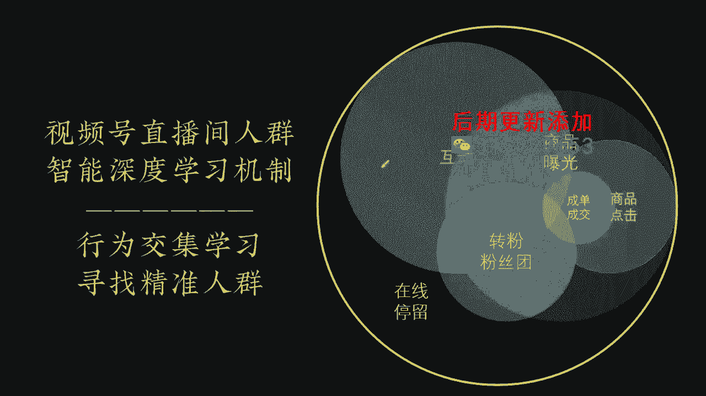
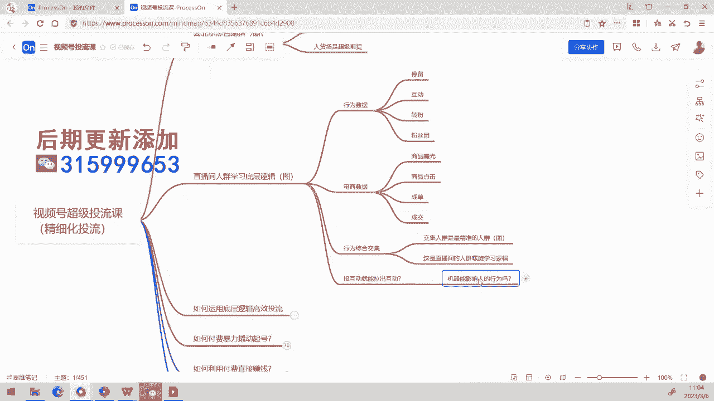

# 008 2023视频号直播·投流起号+破流速，深度拆解视频号投流模型与玩法 - P3：3-投流底层逻辑与要点 - 早安睿睿 - BV1cD421g76t

的这个课程呢现在就正式开始了，这是我们第八版本的这个投六课，那么我们在今天呢把这个头留客的名字呢，我们把它稍微改一下啊，这个我们叫精细化投六课，这个我们来把它改一个名字，精细化洪流。

因为这里边呢我们的整个头发呢，可能大家就都已经跟其他其他的这个，可能你看过的各种各样的投入模型的，都有点不太一样，因为我们整个投流的过程呢是非常的精细化的，所以我们的课程内容呢也是比较丰满的。

有这个也这样的一个原因，那么首先呢我们在这一周呢，这一周的课程呢我们还是按照节奏来进行，中间的话我们会有一些各种各样内容的一个，持续的修改，因为每个版本都在持续的进行迭代，那首先呢有一个跟大家啊。

我们说从哪个开始的，我们还是从我们正常的这个内容来开始。

这套课程呢，我们是一套精细化的投流过程，精细化投流过程呢意味着说我们很多内容啊，可能是你看到整个系统它很简单，但实际上呢我们在真正投起来的话，它是有很多很巧妙的组合方式的。

也要根据直播间的不同的阶段来进行一个组合，那么现在我看到大家那个你们的直播间，大部分的直播间呢都是属于这种平播类型的，他没有那个剧本性和节奏感，剧本性和节奏感的话，那意味着你的头流模型。

它需要更巧妙的进行一个调整和结合，所以的话这个我们的所有课程内容呢，我们都是还是那句话，不是面向纯小白的课程，我们在上一周的话有20多位报名，然后实际上的话应该是只接收了，只接收了三四位吧。

然后其他的呢都被pass掉了，就是因为说啊很多的话，他直播间自己的那个自然流都没有处理好，然后这种情况下，是我们是拒绝去让他们去投流的，然后呢也会给到一定的方向，让大家去做对应的一个调整之后呢。

再来参与投流，就是这样的一个原因啊，所以呢，我们这个还是本着一个交付作为一个核心的，一个目标，那么这套体系呢是由目前视频号领域内，各路的顶尖高手，我们共同经过这么久的时间来进行实践啊。

经过了扎实的系统性实验，数据来分析论证而成的，呃我们也是专注于带货类型的直播间，然后的话这个余波类的话，就不是我们擅长的领域了，同时我们还有一个很重要的点呢，是叫做用商业的底层逻辑来理解直播啊。

而不是简单的说我们就是就用做个头牛啊，做个什么的，就这么简单的一个动作啊，这个是我的大概的一个介绍，大家都已经比较清楚了，那同时呢大家要清楚，我们整套系体系呢在设计的过程中，我们有一个很独特的地方。

在于说我们本身是做数据挖掘，推荐算法的推进化，算法，意味着说我们可能在在整个对于投流的理解上，会跟其他很多人都不太一样，因为本身做算法的人，最能够理解做算法的这个底层思想啊。

所以这是我们的一个比较大的一个独特之处，那么我们看到说，在整个从商业的底层逻辑上来讲呢，我们任何项目我们都要进行外部的引流拓客，我们都要去跟客户建立基础的信任，来培育和刺激销售啊，然后呢来达成成交。

最后呢留到你自己的客户池里边，大家知道在这个地方呢，我们已经出了一本新的书，就是关于思域爆破的书，然后呢还有一个就是流传到后边进行复购，好到裂变裂变，形成新的引流，那么本质上呢在那个啊直播间里面。

也是这样的逻辑，就是我们需要去外部达公寓流量，拿公益流量之后呢，我们让他去在直播间进行互动和保留停留在线，接着呢，我们它会促成他的进一步的这个成交的动作啊，成交之后呢他会关注转粉丝团啊。

留存在你的那个呃直播间，同时后边的话它可能会被系统换回进行复购复，然后在这个过程中，它会形成你整个人群的达标，就形成了一个人群模型的一个稳定，形成了一个持续的稳定推流啊，所以所以这个就是我们直播间。

也存在着这样的一个闭环啊，其实这个闭环呢他还可以结合思域来，同时也来深入来做，那会做的更稳健，但是这一切的基础呢，都是围绕着我们的核心目标，客户去打造爆品方案，这个是我们的这个核心的思想。

所有的事情呢都是围绕人货场作为一个核心，来打造你的高效的闭环盈利模型，那么在这个基础上的话，我们就看如果我们说从头流的层面上来讲呢，其实也是一样的道理，就是当你的人货场解决没问题之后。

我们再来把产品卖好，先把产品变得好卖，再把产品卖好，所以这个呢就是我们在，为什么大家那个看到，我们不都要进行对人货场的一个技术审核啊，这个事情的话就是为了确保说，只有你的人货场没问题的情况下。

我们才有可能做出交付，然后呢你投了之后的话才也才投出效果，所以这是我们在做这个事情的时候。

大家看到为什么要有这些呃，非常关键的一个一个动作，那么在这过程中呢，我们再看看对于直播间的一个人群，学习的一个底层逻辑。

我们先看看这个地方，直播间的人群学习的底层逻辑。

在于这样这样的一个框架，这个事情呢，在我们理解整个视频号的这个推流上呢，它有着非常关键的底层因素，因为比如说我们一个直播间里边呢。

一个直播间里面的话，他是怎么学习的呢，它是由几个关键数据行为，数据停留互动转粉粉丝团，电商数据，商品曝光，商品点击商品承担成交的一系列的这个动作，去完成了整个行为的交集，那么在这里边呢就是互动啊。

这个停留啊，停停留是大大圈子，然后呢这里面的互动互动呢，里面呢会有一个商品报，在还包括商品曝光，商品曝光之后呢，内嵌的那个商品点击商品的承担成交啊，然后呢还有这个转粉，这些呢都是一个交集的结果。

交集的结果，所以在这里面呢我们叫行为较综合交集，交集人群呢，是你直播间最精准的经营人群的的这个人群，这是你直播间进行人群螺旋学习的一个底层。

底层框架，这个词我再深入再说一下啊，什么人进入你的直播间，他会产生互动啊，它首先它会产生停留，停留了之后的话，不停留到足够长的时间呢，它会产生商品的曝光，对不对，商品曝光的同时的话，你可能他这个人。

同时他不一定可能不一定曝光商品，也有可能只是参与了这个互动，参与互动同时呢他还点了关注，然后同时呢他又点击了商品，然后同时他又那个点击点成交的地方，订单中间的这个地方，这个交集结果呢。

就是你的直播间的最精准的那个人群，这是一个交集行为的一个结果，这就是我们在直播间的行为学习逻辑，所以交集学习之后的话，我们去寻找寻找你直播间真正精准人群视频号。

他的整整个那个人群学习机制呢，就是这样的一个机制机制。

所以在这个过程中，请大家一定要注意哈，呃投流的本质呢就是我现在的话我投互动，我是学习在直播间发生的互动行为的人，而不是帮你拉互动，你要清楚啊。

所以在这个地方我们就看你这个问题，头互动是不是就能帮你拉出互动呢，这个绝对是一个悖论，为什么呢，机器不可能影响人的行为。

一个人要不要参与一个直播间的互动，不是你把他拉了互动，他就能来互动，不可能只是你的直播间发生了互动的人，我去学习互动，所以我叫投互动，我在直播间发生的转转粉行为的人，我去学习转粉。

学习转粉这种情况下的话，就能够学习出更精准的这个人群，所以投流呢为什么会有目标，目标的本质是什么呢，目标本质是我通过我通过指定了某个行为的人，去进行学习，这个是我们在投流过程中，我们所投放的那个目标啊。

他是这样的一个底层框架，所以你很多人会误以为，投互动就是就是那个我互动不够，我投互动不是这个逻辑哈，千万不要搞错了，因为机器不可能影响人的行为，一个人要不要来你这个直播间互动，不在于你投他。

他就来来互动，而是说这个人他是互动的人。

他的行为标签我们去学习这个人，这种情况下的话，他可他会不会产生互动，完全取决于你直播间的人货场，那前面呢有了这个非常重要的底层框架，有了这个非常重要的底层框架之后的话，我们就来看看。

那我们是怎么样运用这个底层逻辑，来进行投放呢，好OK呃，和大家说一下，我们的这个我们的这个思维导图呢，是没有发给大家了，为什么没有发给大家呢，因为我们都是鼓励大家重新听完课之后，自己去画一次思维导图。

然后你光看这个思维导图没用了，你自己画一次的话不更清晰，然后我们看怎么样运用这个底层逻辑，进行高效投流，OK这个是我们的重点内容了，呃，直投直播间，直投直播间付费的底层逻辑呢是加速系统。

帮你找到更多的交际人群，所以大家看到说，我们刚才说有了一个行为学习的一个关键，底层逻辑之后，那么头互动我们就是拉出来学这个学他的，有互动行为的人，他们作为学习目标，我们投商品点击。

我们投的是有发生商品点击人的行为，作为一个一个那个拉过来做学习，然后呢我们投观众，我们学习了在直播间发生了长时间停留的人，来来进行学习，那还有一个呢就是我们有些时候的话，我们会来投那个转粉啊。

转粉的话就是我们学习在你的直播间发声的，这个啊涨粉就是粉丝啊，涨粉的这个涨粉的一个学习行为啊，当时我们投成交的情况下呢，他就是学这个人群，然后可能你会认为说，那我们是不是投成交不就好了吗，成交他最准嘛。

是不是呃，理论上来讲是的，但是呢有一个问题，成交的话，成交的他那个人群他的学习体量太小，很难学习，除非你的直播间，他的那个成交特别好，那这种情况你投都投成交，就或者你直播间呢已经相对比较成熟了。

他会持续的去学习成交人群，这个时候呢我们后到后端，可能经常是投以成交为主，这是正常，但是你在前期的话，你投成交，你的学习体量，学习的那个数据量，数据规模太小了，他这会学不出来，就这种情况。

那么还有一个呢，你说那投观众的话，那个我学习的是在线停留的人群，那这种情况下呢，你你们会觉得说呃这个人群的话，这个人群的话，这个是适用于什么时候呢，我举个简单例子，憋单类的直播间去投观众。

你会发现它的数据是不错的，或者是有些直播间呢，他那个人的停留时间特别久，然后呢他就一直看又不买。

但他第一集一直一直停留很久，这种情况下，你的观众你发现投观众出来的数据也不错，就是你看他每一个直播间，他学习出来的人群都不一样的，就是他的这个就你知道它的底层逻辑之后。

你再去投流，你会有完全不一样的，对这个事情的一个底层理解。

就这样的原因好，那么我们再看看短视频的一个短，视频的一个投放思想，短视频的一个投放思想，在投流过程中的话。

短视频它其实是蛮重要的一个一个补充，短视频其实蛮重要的，补充，我们刚才所说的是直投的这个人群学习机制，那么同时的话我们也不能放掉，短视频的这个板块，短视频的这个板块来讲的话。

我们在于说，我们一定要先理解一个叫客户的消费决策链的，这个问题，客户的消费决策链呢是一个经典的，我们在营销上常用的一种一种方式，当我们在难以判断一个客户，他的决策的一个过程和成本的时候呢。

我们会一般把这个客户，他的这个消费决策链拆分出来，来，分析这个客户为什么在咱们这个地方不下单，在我们店里为什么不下单，在实体店里，在线上或者在任何其他的这个渠道上，我们都会进行一个客户决策链上的一个。

关键分析，来判断说，我们对这个客户的销售过程是否是否那个正确，所以呢我们在这个上面的经典的销售决策链呢，它分为五个基本链，叫做诱发需求，或者这个诱发需求呢可能是主动诱发，有也可能是被动诱发。

然后呢收集信息，选择评估下单，成交和评价售后，这这个怎么理解呢，我来举一个简单的例子啊，比如说你现在的话，到了中午的时候，你要肚子饿了，就是现在这个时间点，然后你现在肚子饿了之后呢。

你可能就会主动的被诱发需求，这是主动需求，然后你可能本来不饿，大半夜的看人家深夜灯放毒，于是呢你看到之后的话，你突然间觉得好饿了，想想要去吃点东西，吃个宵夜，那个动作那就叫做被动诱发，被动诱发需求。

那么我们来到了这个洞，无论你什么样诱发需求，你可能会产生这个动作，我现在肚子饿了，饿了之后的话，我去干嘛呢，我去收集信息，我打开了美团，打开了美团之后的话，我在上面呢这个就是选了一个商家进行。

最后的话在选择这个各个商家之间进行对比，最后做了一个选择评估的一个动作，选择了一家，看他的综合的一个情况怎么样，比如看他的评价啊，看一下这东西好不好吃啊，这些东西啊，看一下他那个有没有喜欢的菜式啊。

都你挑挑完之后你下单成交，下单下单之后呢，等到后送过来，你一吃哎呀，这个东西吃的跟什么一样，然后呢你就是你的评价，无论你有没有主动回去平台做评价，但你个人一定会对这个消费的结果做出评价。

你只有你消费了就满不满意，就是你这个事情的一个评价，那么在这个事情上面的话，我们看到为什么短视频投放之后，他的这个他的这个成交率会特别的高，因为短视频它我们有时候我们直接直投，进入直播间的时候。

我们需要在直播间里完成诱发需求，收集信息，选择评估的动作，然后才能够趋向于下单成交和评价售后，但是如果说短视频就不一样，短视频进入的时候，有短视频已经帮你完成了，前三个或者是前两个动作，我看到视频之后。

我又发了需求，同学的话，我看完这个视频，我收集信息，最后的话我觉得还不错，我点击进来直播间看一看，再在直播间进行一个选择评估，最后就下单了，或者是我在里面短视频看完，看完之后的话，我在直接收集信息。

直接看完了那条视频，然后呢我在短视频里面我就已经下定决心，我进来直播间直接就是要下单的，所以你看到为什么短视频进入之后，他的这个成交率会非常非常的高，就是因为在消费决策链上。

前面三个问题已经全部给你解决了，所以这种情况下的话，你的那个你的决策决策成本是非常低的，这就是短视频的这个，为什么视频效果特别好的一个意义，所以我现在鼓励呢，大家如果说有条件有能力做短视频的。

你们呢还是要从短视频的角度去多做啊。

常做多做，尽量的做好视频，好那我们来看看，那有了这个动作之后呢，你要怎么看呢，短视频的投放思想的话，就是几个关键的一个动作啊，这个直观性动作，这里呢我们是给大家做一个基本的一个阐述。

首先第一个短视频投放呢，你不要想着一定要去原创啊，不要想着原创所有是好的视频呢都是抄出来的，模仿好的同行的视频进行一个抄袭，然后呢，你一定要与商品的内容，进行一个相互的一个垂直。

你的音频呢可以直接抄袭他的音频，然后呢你的画面可以重新拍，这些的话都是在拍拍短视频中的，比较重要的一个方法，而且你要注意哈，你的短视频内容呢，最好是那个跟商品内容一定要进行垂直。

这样的话你才能实现前三者的动作。

这就是为什么鸡汤类的这个这个短视频呢，基本上跑出来的一个效果都不好，因为不垂直没有完成这三个动作，所以这个短视频的引流效果是非常差的啊，同时的话你记得进入之后的话，你一定要多拉互动，短视频进入之后。

你一定要多拉互动，互动之后呢，能够让短视频和那个直播间之间，形成一个双屏共振，它会放大相互放大的一个一个这样的效果。

那么在拍视频的过程中呢，我们其实就是用数量去对抗概率，能找到好的视频，好的视频就反复拍，找到好的视频，那就直接投，怎么投呢，完播率在25%到30以上，时长不低于十秒的视频都是好视频。

好这个就是短视频的部分，那短视频部分呢在这里呢我再给大家强强调哈，我们是强烈建议大家去拍视频，配合着视频去拍，拍完之后呢，你在投放之前呢，呃补充一下这个那个上传时间，发布时间在在这个呃开播前一到两小时。

开播期间多拉互动啊，这个呢给大家做一个重点的一个强调啊，这个地方，但是我们讲解的是核心呢，还是以直投进入直播间为主，所以短视频这块呢因为它本身也比较简单，所以你们就按照我们刚说的这个地方。

几个地方去投放就可以了，那么我们再看回过来看下，直投进入直播间的这个部分，付费流量的这个学习目标是什么呢，我们是投什么目标呢，我们就是我们就是那个去按目标扣费啊。

不是啊，不是按目标扣费啊，是按展现扣费，这个地方可以大家一定要清楚。

我们现在看到的所有的付费流量的投放目标呢，它都是按展现扣费，你只要它它在公寓有给你实现的一个曝光，那么这种情况下的话，他就会他就会有一个扣费的结果，它不是按照我说我现在预估呃，投投了之后呢。

给你投一笔成交500块钱，然后呢给你带来三笔三笔订单，你去看他那个东西是没有意义的，唉因为为什么呢，因为你这个东西你去这样算，你就你就可以给他算偏了，所以所以你看它的核心在于什么，在于你的人货场。

你人货场呢如果很好的情况下，你穿透率比较高，或者你整体的这个数据比较好，你的那个啊你的实际效果就好，所以他这个不是按照你的目标扣费，他是按展现扣费的，你一定要清楚啊，呃第二个的话。

投流学习学习的目标呢不怎么考虑交集，而是学习目标行为人群画像去进行跑人群呃，这句话怎么理解哈，就是我在初始阶段，我在初始阶段一个计划的初始阶段的话，他更多的时候跑的是对于你这个计划学习的。

这个呃目标就是他我重点学习是互动行为的人，这是他重点学习对象，重点学习对象，但是呢一个计划你会发现它跑一段时间，就会慢慢跑准，这个过程中呢计划本身他跑过来的人群，他也会与直播间的人群发生交集学习。

所以呢你会发现一开始计划不一定会准，但是呢你学着越学习这个计划会越来越准，就是这样的原因，所以呢就是投放的时候，他重点考虑互动人群，但是呢他最终呢还是以什么为作为方向呢，以成交作为核心的学习方向。

所以你有时候会发现一个地方什么问题呢，一个计划它跑不动好，我这个地方我重点给大家补充一下，如果一个计划跑着跑着就不动了，那么是因为学习不出来了，另外的话还有一个重点要跟大家强调的啊。

除了这个学习不出来之外，还有一个呢就是投放没成交转化，它也会导致这样的一个问题啊，投放之后我没有成交转化，就学习不出来，学习不出来，就是投放之后呢没成交转化，就是你无论投放什么目标。

然后呢它这里边的话它没有一个一个转化，它没有一个实际的转化呢，他都会影响这个计划的学习，他两个影响啊，他会有两个方面的一个影响啊，如果持续没转化，没转化的话，他那个计划会跑飞，或者是计划会不动。

它会出现这个问题，这是什么意思呢，呃如果说你一个一个目标，它持续持续，它跑不出转化的情况下，那个计划呢它是很容易跑着跑着，他会给你推大量的人，大量人来学习，所以他会表现为什么呢，计划的穿透率突然变高。

直播间穿透率突然变高，那计划跑不动的情况下，哪些是小什么消耗不动，然后你会发现你一直要持续的抬高出价，因为你在那个人，他发现他就是你指定的确定的那个人群，你就是你圈定的那个人群，他是精准人群。

但是呢你出价的话，就是按照你直播间的那个竞争度的话，但你竞争不过来，所以这种情况就导致你整个那个呃直播间的话，他就是只能在一个小人群里面，一直在跟你跑，他消耗不动，但有些时候的话就是一直没转化。

这个是因为他一直都学习不出来，然后最后呢，他他放弃掉所有的这个这个这种高精度的，这个人群，他直接给你一个一个批量的的高穿透率人群，直接塞给你，看你能不能从在里面重新学习啊，所以有些时候你会发现那个计划。

跑飞的特别厉害啊，然后呢一下子穿透率很高，然后呢这就是不断的不断的给你塞那个犯人群，其实就是一个你的直播间，他学不出来哎，也是一个这样的一个一个问题，所以就是缺了大量的人来进行，一个学习的一个行为啊。

这两种情况都很常见哈，都很常见，但你们可能后边的话跑一段时间，你会比较常见的是这一种，然后计划跑飞是哪一种呢，计划跑飞的话，你一开始在起号阶段才会更容易出现计划跑飞，或者是你的人群池窄到已经是很窄的。

那个那个情况，比如像呃，比如像我们平时晚晚上，我在开茶话会的那个沙门天书的那个直播间，我有时候我如果说有头溜的情况下，就投着投投一段时间，他很长一段时间了，他跑啊跑啊，一直也学不出来。

他又觉得好像偶尔能学出来，偶尔又学不出来，那种状态之下的话，他时不时他有时候跑一段时间，他会突然间给我爆发一次大流量啊，去就会出现这个奇奇怪怪的这种情况，就是这种那个学不出来了。

他推很多人来进行学习尝试一下，然后呢就穿透力哗啦一下给拉上去了，然后一下子来了很多急速流，这些这些计划有时候就会出现这个情况，那么实际上我们在这投流过程中呢，你要清楚啊，我们其实投流呢本质的是饲养数据。

饲养饲养那个系统去学习更多精准人群，而不是去抢那个某一类人群，所以你看到我们在投流过程中呢，我们所谓的圈选兴趣呢，那确实是一个人群池人群包，但实际上呢我们它更多的，目前微信斗是整个视整个那个视频号上。

最精准的投流方法，因为微信豆它是跟自然流的学习机制是一致的，它是同一个学习机制，他都是在对直播间的交集行为结果，所以呢我们在投流过程中，你要知道在数据大屏上，微信豆豆的头流叫做视直播加热。

而ADQ的投放在视频号的数据大屏上，它体现出来叫做广告进入就不一样，为什么，因为加热的话，意味着他会跟你的直播间发生交集行为，学习结果，而广告投放呢他不跟你的直播间发生交集行为，学习结果。

这就是最大的一个区别，好那我们来看看哈，我们来看看这个目标学习的一个机制，首先第一个的话，当我们学习不出来的时候呢，我们基本上就会向上一个目标进行学习，就是我们学习顺序啊，就是啊我停留互动转粉。

这些呢就是我们学不出来，后面两个呢我就从停留的人群进行学习，然后另外呢我们再看看这个电商学习顺序呢，就是我是这个商城必教，我学不出来，我学那个承担承担学不出来，我学那个点击请点，你学不学学曝光，对不对。

商报就是这样的一个向上学习的过程啊，因此呢那个付费流量呢你会前期比较泛，前期会比较慢，我们其实不太建议说只靠付费流量来赚钱啊，这个我们不太建议，除非什么呢，除非说你的那个直播间你的投产很好。

跑出来的RY确实很好，那我们就可以直接跑，要不然大部分行业的话，其实是不能够直接只靠那个付费流量来赚钱的，那么首先第一个呢那个有一个点哈，高转化的付费流量，和你的自然流量的本身承接好。

有非常非常密切的关系，这句话再和大家强调一下，为什么你会发现，当你的你的有时候跑着跑着会消耗不动，跑不动跑不动的时候的话，意味着说那个意味着说你的直播间的哈，它是它的自然流，本身现在就不好跑偏了。

然后呢自然流他来的人的话，他跟你的付费流之间形成的交集结果，然后呢它影响了你的付费流，所以当你的自然自然流不好的时候，你的付费流会跟着不好啊，所以这种情况下的话，这种情况下怎么办呢。

这种情况下没有什么特别好的这个方法，我有时候我们只能通过拉时长啊，什么这些动作会慢慢的把它拉正，或者说我们在这种情况下，我们会叠头的时候，我们会把它跌投，可能会更出高价吧。

这样能不能争取把更精准的人群拉回来，然后呢来影响自然流，就是我们只能够通过这个两个方向来走，所以一般情况下，如果我们发现说某一场他的数据特别好，自然流很好，很精准的时候，我的投放是很猛的。

我会就是就是还是那句话马太效应，然后呢就是好的时候让它更好，差的时候的话，我们就把它原有也要剥夺走，但是在这个地方呢，我不会把它完全剥夺走，我会还是会给它进行一个高价矫正，但是我会尽量减少计划。

我会保留能够跑得动的计划，因为这种情况下，他这个计划本身学的比较好了啊，就是这样的，然后呢高RI的那个付费流量呢，他跟你的那个客单价有密切的关系，这种情况下，比如说你消耗1000块钱。

消耗费1000块钱成交一单，但是你和他价1万利润5000块钱，这种情况下，你投投1000块钱需要成交一单的话，你会发现你这个转化是很差的，非常差的，但是你的课RI的话就是非常好的，那这种情况下怎么样呢。

这种关系的话，管他呢，是不是啊，我能赚钱就行了，我只投啊，我还要什么自然流量啊，这个这个情况下还要什么资金，还要找什么自行车啊，是不是我直接投就好了，所以你的那个投流的话，我们是根据实际情况来跑的。

就是这样子，所以在我这种情况下呢。

给你们看一下我们那高科能RI，他那个跑出来的一个结果，我们这个作为一个高客单RI的情况下的话。

你看这样的一个这是一个呃，这是一个高客单的LII高客单的这个直播间，你看我这个计划跑出来95块钱哎，换一支笔，你看我这个跑出来95块钱，那95块钱的情况下怎么样啊，90块五块钱的话。

他那个他给我跑出来一个这样的一个漏斗，漏斗是我们后面的投流核心要看的一个数据，一切只看漏斗，其他啥也不看啊，就是你出如果说你客单价很高啊，这个这一码事，然后呢一般情况下看投流的精准度，就看漏斗就行了。

然后你在看这个过程中的话，你会发现诶我这个计划跑得非常的准，这个计划很准的情况下的话，他这个95块钱就给我带来了那个呃，一个5000块钱的一个收入，那这个时候呢是贼高的这个RI啊。

那这种情况下你怎么样呢，这种情况下呢，像这种这个直播间，我是放两头，这个直播间的话，我也基本上我基本上我是可以放弃掉，那个放弃掉放弃放弃掉自然流的啊，但是我实际上我想放弃他一直没那么容易放弃。

因为这个直播间的我有点难投，就他难投动，但是投出来又特别准，非常非常精准，然后我要一直要把他的那个那个投流量往上提，它有点有点提不上去，他无论怎么提，他还是给我撬动了很多的那个免费出来。

实际上我都希望他那个把付费吧，免费完全压制掉，他没问题，但他那个压制不过去，所以我现在还在这个直播间，我还在尝试持续的进行放大，但是呢这个直播间，他确实跑出来的效果是很好的啊。

就是这种是属于说高客单直播间，这个直播间的话就是每场的话播个几个小时，那你能跑几万块钱。

那个这个跑这也是一个瓶颈，也是一个瓶颈啊，那我们还在还在研究，怎么样进一步去放大它的一个一个过程呃，那我们再看看那个当自然流越来越好之后呢，付费流量学习能力他一定也是会越来越好啊。

这个就是这个就是非常明确的一点，当你的一开始的付自然流很差，你的自然流很差，然后呢，你的付费的话也会一定是一定是跟的会很差的，特别在喜好阶段，到后面成熟账号阶段，有时候人群跑着跑，跑偏的时候呢。

他那个付费流量也是非常难跑，额这种情况下呢，你可以尝试一下做一些通头的动作，但是这个地方的话你要去注意哈，通头就直接放大，通投的话，我们这就需要看投产的啊，他通投的话，如果你投的好，也会放大自然流。

通投呢就是要用来赚钱的啊，请大家一定要注意到这一点，这个地方请大家一定要注意通头，我们就是看RY空头，就是看RI，请大家一定要注意，如果说你通头的情况下的话，他的那个整个漏斗一定会变差。

通头的漏斗它不会这么好的，这种是属于说精准投，通投的过程中，我们只看RI，因为通投是最后的选择。

通投一般情况下呢都是最后的一个选择。

然后我们只要如果，如果你要配合这个通投的情况下，你可以尝试几种方向，其中有个很重要的方向是长时间通投计划啊，这个后面我们还为大家补充，长时间通投计划，一般呢都不会特别差。

一般的都不会特别差，只要你的直播间已经非常好的情况下的话，通头是可以直接看投产的，只要你的那个投产过得去，那你就完全没有问题呃，再和大家强调一点，付费流量和自然流量呢，它本身就是一个交集行为学习结果啊。

所以如果说自然流成绩不好，你不可能跑好付费流量，这个就是为什么，我们在我们每一期有很多人来报名投留客，但是呢我们审核之后，我们通过率很低，就是因为其实很多人来了之后，他都没有明确一个点。

他都没有明确一个点，头牛一定是锦上添花，他不是雪中送炭，很多想着雪中送炭的人人来啊，这个我们都直接拒绝掉了，就是这样的一个一个一个一个原因啊，我们要保证这个课程的一个交付结果。

如果大家肯定没有办法交付的话，没有必要来来就来，现在来学这个头流呃，因此呢我们建议呢是先用自然流量，先用自然流量去练习承接，一旦你的自然流能够拉出在线，你就可以直接付费起号啊。

如果大家没有看过那个自然流课程的话，你们自己去呃，找文老师去补一下那个课，自然流课程，自然流课程呢是对整个整个投流的，一个前置的理，更更深度的一个理解，他会辅助你去理解更好呃。

人货场呢一定是你的这个直播间的超级基础，我们先把产品变得好卖，再把产品卖好啊，这个就是我们的核心思想，每一个直播间重点的行为模式不一样，和主播的话术引导风格有非常非常密切的关系，这种情况下。

有些直播间呢在核心客户在下单前，他希望这个详细的去进行咨询，于是呢他互动的人群是最精准的，有些直播间的核心客户，会表现出持续关注的一个需求，那涨粉的人群最精准，那有些直播间核心客户喜欢静默下单。

商点承担的人群可能会更精准一点啊，这个这个特别是这个呃高客单的这个直播间哈，他会表现为这样子，我们有些有些高客单的直播间，就会呈现出这样一个表现，在前期的话我们主投的都是商点，投到一定阶段之后。

商点就开始变得没那么准了，这个时候的我们就开始投承担，为什么会这么投呢，因为很多时候的话，你会发现像这样的一个直播间。

像我们这个直播间，我的商点率是很低的，这种呃，说错了，我的承担率是很低的，但是呢我的商点率是很高的。

这种数据的话，表现为，可以去以商商点作为前期的重点投放对象，投入目标呢，它不是绝对的哈，他本计划本身会进行动态。

所以这个过程中呢我们会在不同阶段表现不同，比如说这个像我给你们看，展现这个直播间前期的话是什么呢，前期的话我们其实就是投商点为主，投商点这个目标投到一定程度之后的话，我就开始结合成交计划去投。

成交计划投的一段时间之后，我发现商点就跑不准了，成交很准，这个是一笔成交计划投，所以投到后面的话，你会发现我的我的几乎每笔计划投出来，都是这样的一个结果，都是非常非常非常高的一个结果。

刚好的话我看一下现在那个11：30，11：30，我们现在有，刚好现在这个直播间应该在准备开播了，我来看看他开播没有，啊还没有还没有的话，那个待会给你们看，我刚刚是给他们建好几打，建好计划等着他们开播。

他们那个原他们今天早上11点开播，我跟他们说推迟半个小时，因为今天晚上有课，所以今天早上有课，所以当他们那个推迟推迟到11：30开播，然后待会的话我们可以看一下他们跑出来的，大概的一个情况啊。

不知道今天跑也成交，计划打出来怎么样，待会我们一起看一看。

好，那我们再来看一下，我们再看一下啊，这个所以在这里边的话，每一个直播间都不太一样。

像我们刚才讲的，还有一类呢是什么憋单类的直播间，憋单憋的很重啊，重憋单直播间就一憋的话，你要憋一憋憋20分钟的那种，一个一个成交周期20分钟的那种那种，一一波别单，这种的话。

你会发现我们发现实际这种投了之后呢，投目投互动的投投成投投成交也好，投这个各种各样的一个数据就好啊，这种我们投出来之后发现观众计划，他的他的这个他的这个数据会很好，观众的计划的这个转化率很好。

长时间观众计划就是就是很好玩的一个事情，直播间五律有标准吗。

你说的是哪儿哪五个绿啊，你说的是哪五个绿啊，就是那个漏斗那个五个绿嘛，那个标准的话是有标准的哈，这个嗯不能说有标准啊，只有前两个有一定的标准，然后呢后面的话没有绝对的标准，这个跟你的直播间的数据。

它有不同的一个影响因素啊。

这个不要去盲目的看那个标准，比如说我们在那个就看这个吧。

如果你说一定要看互动率，或者看那个什么什么商点率啊，看那个转粉率，看这些率的话，我告诉大家那个地方呢实际上没有，实际上没没有绝对的标准，不同的直播间它呈现出来的数据是不一样的，特别是B站类的直播间。

高客单直播间，低客单直播间，它每一组数据都会完全不一样，你像我们这这种的话，直播间的话，一般情况下，我们建议在那个百分之百分之30左右，是一个比较好的一个数据啊，二十二十五%到30左右呢。

是一个比较好的数据，那么这是一个商品曝光率，那么商点率的话，我们建议呢都是在30%左右，也是30%左右，然后至于说下面这个的话就完全不一样了，这个不同直播间不一样。

你看这两个直播间，我们这两个直播间，这个直播间是一个高客单直播间，高客单直播间情况下的话。

他这个成单率就很差，我第一颗单直播间的话，成单率就高很多。

所以这个差别很大的，非常大的好，那我们继续多场数据大屏，多场数据大屏的话，你看一开始的话，你投放不知道往哪个方向投，这个时候的话哪个数据最容易学习，我们就优先测试投放这个目标。

来获得正确自然流量，所以刚才你会发现说我们说啊不同的直播间。

他投出来的效果不太一样，变大类的直播间他可能投观众最好啊，这个我们说靠客单直播间的话，可能是投投我们的那个商店，一开始投商点最好啊，这个数据都不太一样，看一下他那开播没，不让他们11：30开播。

应该开了没，还没开哎，这怎么还没开呢，11：30开播，怎么5分钟还没开，来我们继续来看，那投放过程中呢，我们要根据根据那个实际情况进行调整，效果好的投放计划呢是投放目标呢，是我们接下来重点投放对象。

所有好的投流模型，投放模型呢都是烧出来的好，这一点大家一定要注意，而且呢实际上我们在测试投放过程中呢，的成本并不是特特别高的，我们在设置的时候，我们时常先拉长出价，先拉低，这个时候我们就投放测试一下。

看哪个目标最好，你会发现实际上每场测下来的话，特别在测试期期啊，每个计划你可能就跑个几十块钱，很便宜很便宜的，所以你要懂得投的话，你的成本是很低的，我们一般在测投阶段的话，我们是一成本都几百块钱。

把所有东西都已经测完了，所以大家可能会一开始在没有投过的时候，会有一个误区，觉得说哇投牛一看一笔的话500块钱很贵，是不是，实际上的话，我们我们我们这个在真正做测试的时候，你会发现一场下来的话。

你可能都花不到，有几百块钱，一开始测试的阶段很便宜的，非常便宜的嗯，投流的话，我们每场呢你要记得去动态观察啊，比如说我们刚才我们说那个他们不知道，我今天早上就我们这个这个这个直播间，要开的时候呢。

他们不知道我今天早上11点要开课啊，所以的话，所以他们就想着说11点直接安排了11点开，然后我今天早上还知道说啊，他们11点开，那我就跟他们说不行，你们那个逃离过程中我要动态观察。

所以的话我就让他们说11：30开，因为刚好的话我一个小时的课讲完，我前面已经打了预约计划，中间的话20分钟再给他们补一次计划，然后呢再给他们观察计划的动态变化，所以投六呢一定是要动态观察的一个结果。

你不要说投完之后你丢在那里，不管它了，还是要去看啊，我们这两天呢有在有再次的话有审核一个项目，这个项目它其实投了投放的话，它每天投放量很大，然后呢也投的不算算不差，但他们那种是一个属于说粗犷型的投放。

出网型投放，然后呢，他他那个现在每场的话就是能够跑，投出来5万到10万的一个一个厂关，他们想问我说能不能通过投六客，投一个几10万的一个一个厂商出来，然后呢，我就我就没有让。

我就没有让他们来参加这次投流课，为什么呢，因为大家的目标不一样，他们是属于说极度粗犷型的投放，反正我开播砸完计划，中间的话可能再补一下计划，然后呢就大计划拖在那里，也没有人人去管它。

然后就用用那个后台去监控，这种投放的话是我们不支持不建议的投放方式，我们自己的，而不是喜欢精细化的投放方式，为什么他他们这种的话，投出来好像看起来场馆很大啊，也成交也很稳定。

但是的话他这种只适应于他们自己的，那个投放方式，而且他的他说他想要投出一个大很大的这个产，那个成交额，实际上这种成交额的那个投放啊，对于他们来讲的话，他们的这个投放方式的话，是其实很难去投诉那种效果的。

而且的话也是一个单方面，他们一直想要这么做，那我们就拒绝了，他这次来参加这个投六课，也是这样的一个原因，那在初期的投放目标里面呢，我们要尽量做什么，还需要死磕核心人群，死磕进人群的时候卡死年龄。

性别卡死，兴趣开始对标，我们尽量收缩小范围，让系统更好地进行学习啊，这个就是我们在前期投放的时候呢，给大家啊我一个重要建议，这是我们在自然流课程里面呢，大家要看到，我们叫围绕着一个核心目标人群去做优化。

就是在这个地方，在自然流课，大家没有看过，你们自己去补一下那些录播课啊，也很便宜，你们自己去看一下就行了，在这个核心目标客户呢，是我们做任何项目的起点，我们在做任何一门生意，做任何一个项目优化的时候。

我们都是围绕核心目标客户去打造爆品方案。

所以在这个过程中的话，我们在投放初期呢尽量把人群圈准一点，可以加速系统的一个学习，这样的投放效果会这个投放成本很低，然后呢投放的学习效率又很高，在出价思想，出价的一个思想呢。

就是我们再看一下我们的一个打开一个头流。

打开一个头聊的页面，唉他们怎么这半天还没有开播呢，好我们现在打开一个投流的页面嗯，首先呢出价呢它是一个竞价原理，它表示的是在同一时刻内的一个抢人啊，就是出价表示的是一个抢人的意愿，超过这个出价的客户呢。

我们就不抢啊，竞争激烈的时候，我们就要调价，哎我刚才那个，我看一下刚才在这里哈，在这里呃，出价这个地方的话，我们看不同的目标呢，它有不同的一个出价，一个一个建议价，你们的都是按照一开始的阶段的话。

特别在长计划在撤投的时候，你们可能都是按照最低进行出价，中间的话你要出出价调整的时候的话，我们就根据实际情况去进行一个，一个变化和调整，再有一个呢，就是当你的直播间竞争能力很强的时候。

你的你的低出价照样也能够跑出一个很好的，很好的一个一个数据啊，所以这个是跟你的直播间的竞争能力，是有很大的关系的，当你的直播间人群模型极度稳定的时候，你可以去跑那个智能出价啊，这个时候去放量投。

就是在那个画，在这画面上呢就是放量投放，放量加热，就这个呃智能观众计划请注意，观众计划一定要选择智能出出价，就是放量投放，你投观众的时候一定一定要记得只投放量加热，好观众一定要只投放量加的。

不要去投那个控成本去投放量加的这个要点啊，呃他会因为这个智能出价呢，他会主动给你学习曝光点击率最高的这个人群，但是呢，我们大部分时候，建议大家不要去跑那个智能主驾啊，大部分时候都不要去跑。

只有投观众的时候，必定投投那个放量数，放量投放啊，放量加热呃，然后还有一个呢，就是我们需要硬拉某个人群的时候，我们就会高出价啊，然后我们需要低速跑的时候呢，我们就就那个最低建议价。

就直接的话你去最低多少就多少，我们比如说一个商品点击，商品点击的话，你该出30就出30，还有一个点呢就是商品点击呢，我们基本上从来没有出过高价，为什么呢，因为商品点击真的很容易学习。

然后他那个商品点击每次我跑跑这种低出价，他都很容易被跑出去，所以后边的话我们基本上没有尝试过，那个商品点击能够需要抬价的时候，就是那个成交，成交的话经常要抬，还有那个互动也是经常往上抬。

涨粉也也不用抬价，涨粉了，100的话也跑得出去，很多直播间都跑了出去，就是这两个很容易跑，可能这个跟竞争方向也有一定的关系啊，然后互动的话也是，互动的话就是需要经常需要抬价的。

投不动呢就网上接力的进行抬价呃，还有一个点呢就是那个你投放的过程中啊，投放过程中的话，如果你直播间人货场的承接能力很好，成成本能力很好啊，这个我在里边表现一下，头不动就讲上JDJ7书架，头不动是因为。

计划转化问题，你会发现呢，有些计划他这个如果说你的转化很好，它的整体转化，整个漏斗的转化率很好的情况下，这个地方是能够跑得动的，然后一个计划的它越跑不动的话，他这这个这转化越差，它越跑不动。

这个情况下呢，你会发现它那个你就越需要抬高出价，越需要跑一抬高出价。

呃我来给大家更深入的讲解一下这个地方。

比如说像我这个直播间，这个直播间呢，我先是一个我的所有投入计划都需要高出价，都需要高出价去投，那这种情况下的话，我一般情况下我会为什么会出现高速下投呢。

因为它的它的成交率很差，那我这个直播间的话，基本上不怎么需要去抬高出价去抬高，我是低出价，我的互动才出多少，我互动才出60，他最低40，现在别人都已经投那个互动都已经抬到抬到头。

抬到很多是投到一两百了啊，两三百了，但是呢我这个互动的话，投到60，我投到投到100的时候拼命跑，就这个直播间就是一个，因为他的那个转化率很好。

所以你要知道跑跑跑不动的时候呢，跟你的那个第一个计划跟计划之间呢，它会相互压制，多条相同计划它会相互压制，第二个的话就是他那个计划的话一直转化不好，就会长，也是导致他需要不断的提高抬高出价。

那头不动的表现是什么，投不动的话，在预期单位时间内呢消耗不超过50%，超过50%，那基本上算是正常健康的计划啊，不是一定要超过50%啊，只是我们判断当前这个出价，有没有在抬高的可能性，就是判断出价高低。

好那我们来看看这个投放时长，稍等一下，看他们开播没有，现在的话好哎呀，他们终于开播了，他们终于开播了，刚刚开播，才看一分钟，一分钟的话也看不到写什么东西，那就先不管他们了，现在看看计划也看不到。

计划的话，审核都要35分钟嗯，然后呢我们再看或投放时长，投放时长的话是获取流量速率的一个意愿啊，就是日常呢流速的话，我们主调的是投放时长，这句话怎么理解呢，一般情况下那个投放的加热时长呢。

是我们重点要调的一个对象，调的话是你看从一个小时，一个半小时到六小时时，12小时，24小时，这个都可以调，我们在一般情况下，很多时候呢，我们就要调他的那个流速的速率的时候呢。

我们基本上呢都是调调这个投放时长啊，投放时长的话，它会让你的计划跑的相对比较慢一点，特别在前期我们测计划的时候，我们经常会跑那个12小时的，一个一个一个计划目标，或者24小时目标都有。

就是因为让它慢慢跑一点一点跑，不要跑太快啊，因为我们的目标只是用用来测试它，不然后还有一个呢就是让他放一点慢的人进来，有时候我们投一个目标的时候，也不知道这个目标准还是不准，或者投一个圈。

选一个人群的时候，你不知道那个人群准还不准，我们不能够让它逃走，短计划，短计划的话很容易产生一个什么问题呢，就是会有大量的泛流量，错误的流量冲进来，冲进来之后呢，会导致你整个直播间呢被被打歪了啊。

所以我们一般呢不会像测计划的时候，我们就不会去放短时间，不会去放短时间，日常呢我们流速主调就是投放水长，再有一个呢是这个我们时常呢是配合单笔投放，来调整这个预算啊，这外面的话是有那个什么什么什么东来着。

呃时长呢我们配合单笔投放预算来进行调整，也可以，这个也可以来控制控制流速啊，但是调预算的时候你要注意啊，有时候调预算呢他会计划人群，有时候会变泛，就你跑不动的时候呢，你通过调整那个预算，调预算的时候呢。

他会给你塞一点那个更泛的点流进来，因为他要为了完成你的目标嘛，啊比如说我现在投5000，投那个，比如说投三个小时，投三个小时，这个时候呢你为了让他他在这个时候，它的它是一个流速，我现在的话为了达成目标。

我投个1万豆，在这一个三个小时内硬塞进来，那我意味着什么，意味着我学不出来是不是硬塞人群给你啊，所以这个也是也会导致人群变泛的一个问题，就是他所以逃预算也可以通知流速，但是也计划的人群有时候边泛一点点。

那么投对标直播间的逻辑呢，我们就是抢客户抢人群啊，抢客户抢人群，抢客户抢人群呢，第一个投自己的时候，我们拉老粉回流，来强化直播间的一个人群稳定性，就是你的在直播间呢有一定的复购率的时候。

你可以去拉老粉回流，我们通过投自己直接直投，还有一个呢是那个投同行啊，你要记得哈，无论你投什么呢，你都要记得你要投这种有开过直播的账号，你不能投那种说我一看他这个是我们的同行。

然后实际上他是连开播都没开过，他一直都投那个都是短视频吸粉，你哪里知道他那个粉丝从哪怎么怎么吸过来的，他前面你都不知道他发了多少鸡汤段子是吧，所以这个时候呢我你要你要注意说投的话。

我们要投那种开过直播的，这个这个这个账号会比较好呃，这个核心思想你比对方强，你就去抢对方的人，然后呢你比对方弱的话，你就不要去进行对标啊，所以我们就相当于说投同行了，就去人家门口门口抢客户。

你比别人厉害，你就直接抢和别人差不多，你错开时间抢，比不上别人呢，你就不要抢啊，就是这样子，那所以投人群的话，我们还有一个点呢，就是哎我们还有一个点呢，就是在这个呃除了抢客户之外呢，还有一个点是投人群。

同样的也是开投那个有开过直播的这个账号，这个投人群呢有一个核心思想是什么呢。

这里边呢就涉及到一个商门天书，很重要的一个体系性的内容，叫做客户需求的生态链，客户需求生态链这个地方呢，我们在很多个不同的行业上，我们都做过深度的充分应用，是不是一般情况下客户他的一个需求生态。

它不是一个单独的行为过程，客户的消费行为它不是孤立的，它可能会有前后的因果关系，也可能会有相关关系，也可能会有相关关系，比如我现在作为一个卖卫浴的一个店客户，来买卫浴之前，他可能他正在装修。

他已经装修到差不多要装修，他的卫生间在这个阶段了，那么这个阶段他前面一定是先去找了，比如说他找了设计公司，找了施工队，他可能去找了那个什么呢，他找了找了那个看了瓷砖，看了看了那个地板。

他看了一系列这个东西，他刚好来到这个阶段之后的话，去要买卫浴了，于是这个阶段的话，你把他们前边的这个这种不同的业态的人群，拉到你这里来去成交，它的成交率是极其的精准，精准到令人发指，那么在卫浴之后的话。

他会买什么，他会买家具，对不对，他会去买电器，他会买什么，买窗帘，所以不同的值不同的那个不同的业态，不同的项目之间呢，客户他有时候消费呢它不是一种孤立性的结果，它是一个具有前后置生态关系的一个结果。

那同时呢它还有一些是没有绝对的生态关系的，但是呢它也会有形成一个相关联的，这个这个这个这个阶段啊，他也会有形成各种关联的行为，这种关联行为表达为他，比如说客户他的那个他他的生活规律上啊。

他的里边呢会他会他他上下班的路上，他的生活区域里面都会经过这些轨迹，这些都是叫生相关生态商家，或者他本身呢他是厨房里边，他每天决定每天晚上吃什么那个人，那这种情况下的话，那这种情况下，比如说菜市场。

菜市场等等的这些地方呢，它都是有相关人的关系啊，菜市场还有那个跟超市这些啊，你会发现它其实都是相关关系，就是这样的一个一个一个一个那个因果，一个这样的相关关系的哈，这种是有因果关系。

前后置关系，所以这里边呢我们投人群的时候，你会发现人群他的这个学习规模和体量，它会超乎你的想象，它其实是一个很大的一个一个认知，你卖内裤里头，内衣卖件展投手表头呃，呃然后呢。

这个地方就跟他整个消费生态链，它有非常非常密切的这个关系了，所以一般情况下我们去看，我们去看一个投放的时候，你不一定一定要圈选在你自身的那个人群上面，你卖水果，你不一定要圈水果，就是这个逻辑啊。

当然这个里边的话我们只是一个举例啊，但是很多时候卖水果还是圈水果挺精准的，因为喜欢买，在网上买水果人，他会尝试各种各样的水果，所以我们只是在提一个，提出一个这样的一个方向，让你去进行深入的思考。

当你实在投不出来你人群的时候，你可以通过这个方式去进行进行拓展，你的人群呃，然后有些时候的话，他这个人群呢尽量圈选的时候，你圈子窄一点，你不要把不同的太过泛的人群圈在一起。

这个后面的话会影响你这个学习好这个地方，我们就先过了，人群的精准度呢，第一个就是思域肯定是大于对标，对标肯定大于兴趣，为什么呢，思域是你曾交过的客户，那他他的那个人群最精准。

对标的话是人在别人的直播间成交过，客户也更精准，兴趣的话往往是比较泛的，为什么呢，因为兴趣人的兴趣都是动态性的，我今天点可能在我的那个家族群里面，点开了一个直播间，看了一会，看了一个一分钟。

但是呢我不一定会买，结果呢，他接下来这段时间都给我推这一类直播间，就他他兴趣他是动态变化，他学的有时候学的不太准啊，就是这样的一个一个一个这样的一个情况好，所以我们在这整个我们在这整个过程中的话。

我们再最后看一下赔付机制，赔付机制的话是实际消耗的微信豆除以总消耗，预期消耗的微信豆大于120%时，目标满足最低数量会返还这个啊，优那个优惠券额，这个地方怎么理解呢。

这个地方不有点有点有点看起来有点麻烦，你自己去点开这个地方去看啊，就在你出价这个地方有个保字的，你去点击，然后呢它这里就会出现，然后你自己去看一下就行了，这个没什么好讲的呃，这地方要不要卡赔付呢。

第一个投什么呢，不拉什么，是不是这样子，很多人说这个卡赔付长投什么，你不拉什么，然后呢，我告诉大家，基本上呢我们实际上在跑的时候，我们基本上是忽略赔付问题，我们不去看卡不卡赔付的这个事情。

往往卡赔付出越是粗犷型的投放，他越需要卡赔付，为什么，因为他投放的精度不高，所以呢他需要通过卡赔付去降低它的成本，但实际上没有什么太大意义，投什么你就要拉什么，你投互动你就拉互动，你投关注，你就拉关注。

因为你互动和关注的人群，他会加速你直播间的交集行为，结果它会让你的直播间学的更好，它会让你直播间投挂的人，他更容易达成交，所以互动和关注这些关键行为的话，你不去拉他，你为了卡那点赔付有什么意义呢。

没有意义，对不对，所以呢投什么不拉什么，这卡赔付的基本上我们不卡赔付，我们不会去刻意卡赔付啊，除非除非说本身就是粗犷型的投放，那这个是另外一码事，我需要用卡赔付来降低成本，但是我觉得卡赔付这个事情的话。

它不符合我们的那个预期的逻辑，我们的逻辑希望它跑得越多越好，所以呢就卡不卡赔付没有什么所谓的核心的话，最后一个点这个大部分的直播间呢，我们基本上只看RI啊，啊不用不用只看RI。

只看对那个自然流量的一个跳动效果，因为一般情况下你的漏斗数据比较好的情况下，它会对你的直播间有很好的一个撬动效果，低利润的直播间微付费，高利润的直播间加大付费，然后呢你要结合退款率，退货率去思考。

有些时候的你看着哈好像是投出来效果还不错，但实际上呢你要知道说你的你的这个头流啊，你的头流的话，你的成本很高的情况下嗯，你的退货率本身也很高，那这种的话你的成本其实是覆盖不了的，所以一般呢我们建议说。

你们在真正在跑的过程中，你要去结合一下自己的退货率，你现在投流占比10%到20，然后的话你的退货率又去到20%，你加起来的话已经去到40%成本了，那你的那个利润率你得多少，你才覆盖得了这个数。

这个这个这个费用啊，是不是啊，所以你的投入的成本你要控制住啊，我们比方说那个我们只放大看那个销售额，看见哇这个特别棒，一投下来10万块钱一场，结果你一算诶，我去掉40%的这个成本。

然后的话我的我的那个利润剩下10%，我利润分完，剩下10%，我再去掉那个主播的这个成本，中控成本，各各种人员成本，打包成本再去掉，去掉那个提成，你会发现一场下来跑个10万块钱，实际上净利润500块钱。

那你还跑来干嘛，哈哈是不是这个浪费时间了，所以这个情况下的话，我们要要结合这个退款率，退货率思考，你要放大的效果，你要挤在一个平衡点上，呃，最后的话那个ROYN呢，你也不能只看那个单场效果。

很多人是看了几场直播才下单的，你要理解那个消费决策链哈。

这消费决策链呢就是我们刚刚在这个地方看的，很多人的话，他是在真正消费的时候呢，他他他选择评估的周期很长的，他拉到这个地方之后，他反复回来，反复看多几次，他才会下单，这种情况下的话，这种情况下的话。

它是需要你要用长中期的方式去思考，所以一般情况下，你看我们这个这个投放，这个投放是跑多了7000豆，然后呢直接成交金额呢是3万块钱啊，然后然后然后的话你如果看这个的话，他这个投投流的占比啊。

投流的那个投放成本是还蛮高的，但实际上我们看到他七天的下单金额的话，你会发现诶，这里面的话好像还可以间接下单的话，有有那个5万多哎，就五那个5万6，对不对，5万6的话啊不对，看这个看这个看这个有4万6。

4万6的话，这两个直接和间接加起来的话，你会发现诶这个投产比就还过得去了，是不是啊，所以像这种直播间的话，像这个直播间啊，我们基本上呢我们的投放呢我们只求ROI平，RI平衡甚啊。

甚至的我们有时候都不看平衡，因为他的这个其实自然留给我们放大的很好，我们实际上你看到我这个成本啊，好像是呃，好像七比30的一个一个这样的情况呃，实际上我们真正在跑下来一个数据啊。

我们的我们一般呢投如果投这笔费用，我们的自然流呢，自然流呢是会在整个直播间成交，大概在7万左右，大概在7万左右，就一比十的一个比例，然后这种情况下的话，我们付费付费，只是看他那个呃这里边付费占了3万啊。

付费的付费的成交占了3万，然后大自然流呢，成交会总共在这整个直播间的成交呢会在7万，自然流占了4万，就实际上是一个付费的一个结果啊。

这个就是我们在投放过程中的，一个一个一个比较，所以第一个呢看那个长周期的间接转化，第二个呢看自然流的当场转化啊，自然流的回流放大，就第一个是当场的放大还是第二个是回流放大，回流放大的话就是这些人的话。

但他后边会持续第一个自然流，它本身在单场它就会放大，当场会放大自然流，第二个的话它是后边呢，你会发现越投你的自然流越好，因为他其实是回流回来的，他之前触达过的那个人群，他会重新给你回回流到直播间的。

就是你看那个七天成交哈，你去你去看看他那个呃，看他这个点点开看点开那个点就出现这句话，提示观众通过加热订单进入直播间，但未直接发生订单转化就退出，然后在七天内，观众通过包含直播间的场景在内。

所有渠道再次触达商品，并且成交的这个这个订单，这个地方呢就是会它会持续给你打回流。

它会给你回流的，哎会给你回流，所以这种情况下的话，这个是我们其实在投放过程中哈，嗯你查真正要看的那个数据，就这个数据有些时候的话RI不平没关系，你会发现在长周期上面它是平的，那也没关系。

因为那我们那个整个整个体量被放大了嘛，对不对，好，那今天的内容呢我们就第一节的内容，先把整个底层逻辑和大家讲了一遍，现在的话看一下大家有没有什么问题，第一节今天第一节的话讲了一个小时。

就给大家讲这个内容，大家现在的话，如果有什么问题的话，我们就直接提出来，留一点点时间给大家去做一个做一个探讨嗯。

我们稍后片刻，然后呢，如果大家没有现在这个阶段没有什么问题的话，我们待会就下载啊，怎么做到微付费，长时间低出价加油画教学位哈，呃卡年龄卡，对兴趣全部卡了，还有消耗快，怎么办呢，计划跑都跑不起来。

如果让计划跑慢一点，你那个你的自然流本身应该不错吧，你的自然流应该本身还不错，如果自然油本身还不错的话，你要微付费其实还还挺难的，因为他会怎么跑呢，他都会给你给你跑的很快，你的自然留学学的太好了。

就你稍微出一点点出价，然后他就爬来爬去，所以这个东西它也是一个好的，更好的一个马太效应，长时间低出价卡，年龄性别卡，对标兴趣全部都卡，还是消耗快，这种情况下你不用管他，你反正就是按照最低去卡就行了。

没办法的，你这个没办法的，这个只能是只能是这样这样子硬卡嗯，因为这是你的直播间的特性所决定的，好哦，我们现在这个计划已经开始跑了。

给大家看一下，现在的话刚刚这个计划已经在启动。

我们刚才。

这个计划的话现在已经逐步启动了，现在还没跑动，你们看到这个就是我们说的哈，这是我们现在刚才说现在这这两两个计划的话，应该是两两个预约投的两个两个计划，现在还没跑动，现在直播加热进入的话才四个人。

嗯下播之后我就来调一下计划。

我来猛打计划，好再看一下大家那个其他的这个问题，你自然有很好的情况下呀，你要真正的像我平在那种超级微的那个付费啊，慢慢跑那种，其实不太可能的，你这一定是一定会跑的还挺快的。

但这种呢也它会缩短你的观察周期吧，他会把观察周期缩短，你要测试什么的话，挺好测的，好现在呢我再来一边跟你们看，你们其他有没有什么其他问题，我一边打另外一组计划，现在呢我要给这个直播间跑不动。

这边补一个三小时的短时间计划，好如果大家没有什么其他问题的话，那我们的内容，今天的内第一节的内容呢就先到这里，大家注意哈，我们这两天的这个我们前三天呢是第一天，就是我们把底层逻辑先给大家过一遍。

第二天的话，我们是给大家一套暴力起号的一套打法，这套暴力起号打法啊，是目前我们经过了八个版本的迭代，目前呢呃速度和效率最快的，速度和效率，效率最快的一个一个一个头起号方式了，然后呢，第三天呢。

就是我们适用于大部分的成熟直播间的一个，一个投放方式，这种适用于成熟直播间的投放方式呢，呃大家那个在实际上在跑的过程中，你们还是可以根据自己的一些变化，做一点这个调整，另外的话就是我们所说的。

你第三天的这个过程中之后，其实是我们很多直播间真正要开始落地，构建自己模型的阶阶段，每一个直播间，最后跑出来的一个模型都会不一样，有时候区别还挺大的啊，所以大家呢实际上在跑的过程中。

你们要记得所有的投流模型，最终一定是通过什么，通过烧钱烧出来的啊，只是只是你的直播间，他烧的钱的需要多还是要少，它会有一个比较大的一个差别，然后呢，就根据咱们自己的实际情况来进行一个调整，好不好。

嗯好行，那我们接下来的话就是我们这周前三天的课程，前三天课程请大家一定要跟上，不要落下，然后后面的到了三天之后呢，就是我们真正真正那个给大家，帮大家建立自己的投流模型的阶段了。

好那我们今天的内容就先到这里吧。

