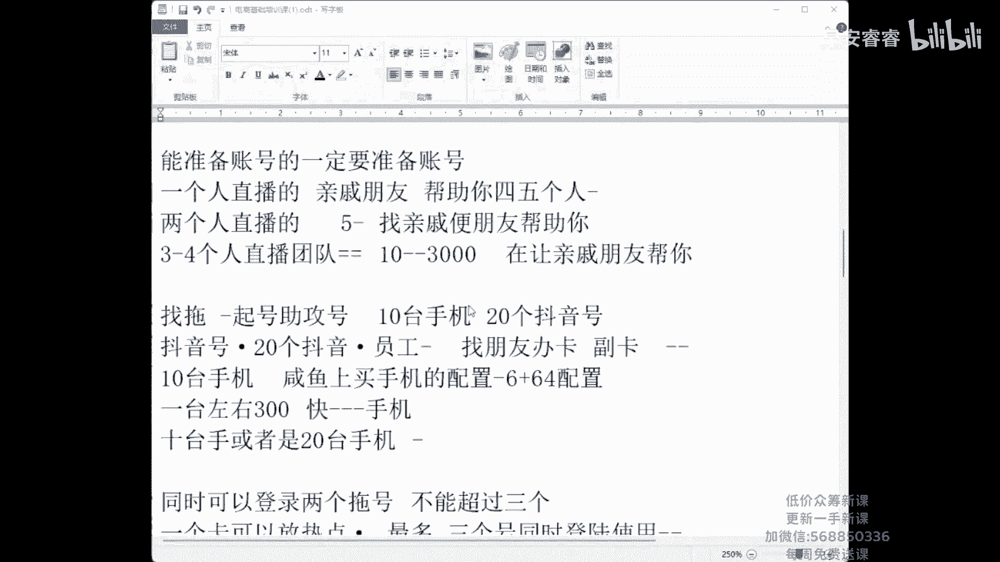
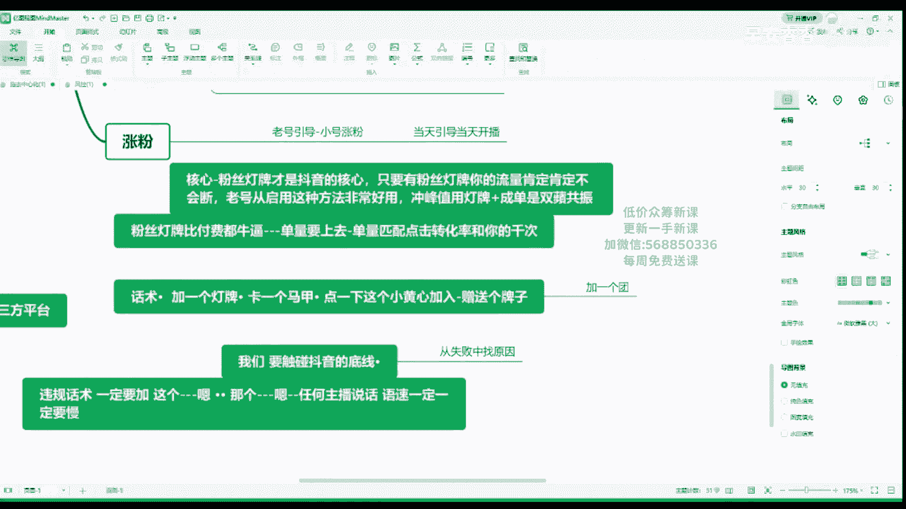

# 024 4月最新线上课，抖音电商0粉起号实战教学，自然流量的天花板 - P1：1.猴帝底层逻辑4月2号 - 早安睿睿 - BV1qJ4m1G7Pa

稍等片刻啊，稍等啊，8。15上课，各位兄弟们，稍等片刻啊，我开了我开了，单号晚上八点大一开始玩音乐的，等一下啊，稍等片刻啊，8。15上课，找一个有本子的地方，有笔的地方去记笔记啊，不记笔记。

你觉得走不起来。

我们如果能岁月蹉跎，我们如果能碰朵花花，嗯哼哼哼哼哼哼哼哼。

还有这个，上到几点，上到10：30，上到10：30，我在我在我上课呢，我在上课，明天找我玩吧，今天这事儿，如果曾经的岁月蹉跎，如果能，他看不到后台，稍等片刻啊，我11点了，很有趣。

才华横什么我字都不认识，你如果有才华，你这不是真的是，我的视频都基本上全部给我下架了，都，嗯这个叫，九九，老阳你去这，嗯一定要记笔记，找一个那个找一个那个什么那个有笔的，有本子的地方记笔记。

找一个单独的微信记笔记好不好，各位啊，然后呢我会让你改变你的电商，我绝对会改变你的电商，我一定会改变你的电商，听清楚，我不管你是小白，你还是卖100万的，你相信我，我是从逻辑出发的，不割韭菜。

我是从逻辑出发的，然后呢，你们找一个有本子的地方，有笔的地方，你们记好笔记，第一我绝对不割你们的韭菜，我的态度非常明确，我不割你们的韭菜，第二我绝对绝对的有交付，为什么我没有交付。

我直播间不可能有那么多的铁粉，知道吗，然后第三你我你能不能做好，听清楚，绝对取决于你是否认真对待我的课程，我虽然收你1600，但是绝对会让你有天如果你做的很好了，我都会让你有天翻地覆的一个差距，好吧。

所以说你们一定要记笔记，哪怕你是一个小白，没关系，我找人给你啊，给你慢慢服务，我说一下，有人拉了人进来，一个人只能用一台手机听课，如果你我等一下，如果你不出去，我会全把他踢出去，包括你也拉黑钱。

我也不退给你，为什么，因为你违背了我说的原则，我为什么用这个软件去讲，我的后台能看到，我说了，一个人只能用一台手机听课，你可以十个人一起听，因为也有回放，对不对，我再说一遍啊，拉别人进来的，等一下退群。

等不能等一下退群退出，我这个现在听课的地方去啊，退出去等，等一下，我悄悄的我把你踢了以后呢，你你别怪我好吧，先说到前面，我再说一遍啊，一个人只能一台手机登录，如果你喊多人来听课，几台手机。

那么我会把所有的非不是交钱的那个人，全部都踢出去，你确定吗，就发一句是不是，好后台等一下拉黑，全部拉黑出去，你的微信也删了，我说了啊，我说了，如果你，谁发出去的，有病吗，谁让你传这个链接的吗。

不是你发他怎么能看到呢，给谁了，谁谁谁谁发出去的啊，团长是吧，来现在开始上课啊，各位兄弟们，现在开始上课，现在开始呃，我看15上课了吗，13了好，来我先说一下1600，你应你应该得到的是什么。

1600你应该得到的是两天上一次课，说一下。

我开始了，已经准备开始了，先跟这两天上一次课程，一个月的微信上的执行问，解答你执行的问题，没两天你听说我双号上课，单号也有答疑课，你其实两天都有课，只是两种课不同而已，然后呢，我下播会有单独人跟你对接。

然后我让你慢慢成长，超过一个月的，又是我六级灯牌的，我会让你反复听课啊，再加一个月再加一个月啊，然后啊，我昨天直播间说我要涨价了，涨成4500了，这是马扁，话说我不会涨价。

有没有迷迷糊糊的就把钱交了的嗯，黑屏了，嗯嗯看到吗。

看不到是吧等等，稍等啊，哎我的共享已经暂停，是什么意思啊，嗯看到吗，兄弟们好了是吧，OK我说一下啊，我每天每天8。20，你现在定上闹钟，你定上闹钟，8。20上课，两天一次，你定个闹钟定个87。50。

对不对，提前准备好好两天上一次课程，一个月的微信解答，然后呢，每天下午其实每两天的下午的单号也有课程啊，然后呢是我直播间六级灯牌的，可以再加一个月我讲的课程啊，然后嗯嗯我直播间说过，我直播间说过啊。

涨成4500了，涨成4500了，我不涨价啊，有没有今天报名的，昨天晚上报名的，迷迷糊糊的让我逼呆逼出来的啊，卧槽快报个名吧，嗯有的话我不涨价哈，可以选择退钱，可以选择时，我考虑好了再做好吧。

然后呢嗯从你十套的那一天开始计算时间，从你实操的时间开始计算时间，2分钟的时间让你们考虑是否啊冷静冷静。

冷静期啊，我不是B站出来的，我还有老师介绍的，好的好，来准备上课了啊，稍等片刻啊，兄弟们再等个2分钟拉人，有没有这样逼单成功的给你2分钟的考虑时间，2分钟之后没有任何理由啊，如果曾经都岁月蹉跎，微信。

稍等片刻，会有回放吗，会有回放啊，不这不是我的微信，这是客服微信啊，这是客服微信啊，你们不要加我打个水印，因为有人录屏，有人拿给朋友看什么的，喂我顺便给我做个宣传好了，开始了，我们开始上课好不好。

兄弟们，我们现在开始上课，等一下等一下啊，后到后到等个2分钟，等2分钟啊，再等2分钟，我再说一遍，你们一定要记笔记，为什么我要让你们记笔记呢，因为嗯你只有把笔记记好，你你才能真正的学好，知道吗。

记笔记啊，兄弟们，是投射作品的，对不对，怎么样才能让这种账号他妈让他永久封，不用封啊，你投诉下架就行了，我找老杨也去投诉，你也去投诉就行了，他的作品他就发不了我们的脸了，知道吗，开始吧，帅哥美女。

你稍等片刻，你不要着急啊，你不要着急，马上开始上课，马上开始，兄弟们啊，正式开始，哼哼不是我那个来开始上课了啊，兄弟们来，现在正式开始上课，听清楚我再说一遍，如果有人要直播的，我建议你停播换脸。

这节课我会改变你电商的未来的路线，我会改变你运营的路线啊，欢迎云发给我了，我还没处理吗啊，然后不割韭菜，1600输出1万6的价值，做一个运营型的主播，好老板，任何一个人都要运营，跑到前面。

每一节课记笔记，小白，你一定要完完整整的听够我的24天的课程，完完整整的听完24天啊，成熟的团队一定要听4~6次，重要的事情说三遍，记笔记下播有回放，我关了之后再打开这个链接，就是回放。

当你做的很好的时候，我希望你们一定也要回来听课，因为对你的帮助非常大，有没有做的很好的呃，六级灯牌的又回来听课的，有没有有吗，对你的帮助一定会很大啊，来我现在正式开始上课，各位兄弟们，抖音分为三个板块。

抖音分为三个板块，一个是人群包，一个是流量来源，流量从哪里来的，一个是你现在开播的直播间，人心包抖音开始上课了啊，抖音有1。2亿的人，8。210210开始上课的各位迟到的同学，抖音分为三个板块。

直播间所有人不要说话好不好，我讲课的时候任何人不准说话，如果有卡不卡的，你打一个不卡，然后我就不理他们了啊，兄弟们好，不要不，各种节奏各种问题，那我就现在开始上课了，不要问我任何问题，因为有人有上课。

任何人不准问问题，因为我给你配了一对，等一下下来有一对一的运营啊，有运营，OK1。2亿的人群包里面就是抖音，所有的看直播的人，看作品的人不算，然后呢抖音分为两种人，对你的直播间而言，有两种人。

一种是我们不要的人，一种是我们要的人，兄弟们卡吗，卡不卡，咋那么多卡的节奏呢，不卡是吧，好有热心人听清楚啊，有热心人的话，有人说卡，你就打一个不卡好不好，只要有人不卡，你卡一定是你的问题啊。

好来现在正式开始上课啊，正式开始上课，人群包有1。2亿人在看抖音，在看抖音，然后呢我们有两种人，第一种是我们不要的人，第二种是我们要的人，前期我说一下起号，我先把所起号讲了，然后呢没有不需要学旗号的。

你也要听，把逻辑听完，然后后面我给你们讲其他的啊，有两种人，一种是我们不要的人，一种是我们要的人，要的人正在浏览此类目直播间的人，就是我前期起号期间，我只要比如说你是卖包包的。

那你就进来的人就要是买包包的，那么就是建模进来的人都是要买的人，前期我们一定只有一种人，那么这些人通过什么样的渠道，进入你的直播间呢，通过推荐关注搜索搜索付费同城，同城其他作品商城链接头条啊。

通过各种渠道进入你们的直播间搜索，前期你开播的前几天听说啊，前两天到三天，我建议你们就把头条95152打电话关掉，我建议你们开始就把它关掉，如果你现在已经很高了，就不要关掉了。

因为关掉会影响你的在线权重啊，就没办法了，只有片在线了，商城流量，听说解决商城流量的方法就是换链接，就是换新链接，如果你的商城流量过高，一定是你的链接的问题，那么我们在体型号你可以准备两个链接。

一个老链接，一个新链接，老链接卖两天开始做用心链接，因为老链接我们前期只做推荐的权重啊，作品前期我就是你的账号卖20万了啊，你只要不走人设，你都不要去拍作品，听清楚人设这个能不能做人设，取决于你的产品。

而不是因为你的作品作品能不更新的，一定不要去更新它，我们不拍作品，因为作品靠天吃饭啊，其他就是分享进来的路段，直播间的这个不管它同城关掉，付费清楚付费，前期不付费，后期一百两百三百无所谓啊。

付费前期不要去做搜索，不管它关注你，左右不了他什么时候来你直播间，那么我们前期只做推荐的流量，听说推荐的权重是不一样的，有些人90%的推荐能推100人进来，有些人90%的推荐。

一个小时能推1000人进来，有些人90%的推荐，一个小时能推1万人进来，他的权重是不一样的，所以说我们在起新号期间，我们从小就培养他把权重做高，然后这是你的直播间，比如说你是家访的直播间。

我现在准备做家纺的直播间啊，不管什么类目啊，举个例子好抖音给你推什么样的人呢，一个新号给你推，包括老号冷启动啊，给你推新注册用户，如果你是一个新号，他给你推新注册用户，开播是不是有一波极速流量。

然后没有人了，对不对，那么这一波流量呢全部都是垃圾流量，不要新注册用户，或者是喜欢看美女的，喜欢看帅哥的，看女装的，看男装的，看童装的，看珠宝的，看首饰啊，文玩的啊，女鞋包包。

家访等等等等等等等等等等等等等等等，抖音会通过直播推荐，通过人群包，他只给你推人，然后他通过推荐进入你的直播间，给你推什么样的人呢，给你推各种各样的人人，这些人呢最近正在浏览，长期看女装的，看童装的。

最近在看这些人，他在干嘛呢，他在探索和学习，他在探索和学习你的直播间，他在听清楚啊，有没有听过两遍课的，一定要反复听，反复听反复听，你们相信我好不好，反复听，六天一个轮回，一定要反复听啊。

抖音在通过人群包，然后再通过流量推荐里面进入直播间，他在探索你的直播间，他在探索和学习的时间，你能留住什么样的人，他比如说给你推一个喜欢看男装的到你直播间，然后呢你他没有留住，没有留住之后。

这个人就慢慢的这种类型的人，慢慢的越推越少了，推一个看文玩的，最近在看文玩的人，然后你在卖家纺个人会慢慢的越推越少，然后推一个卖家纺的人到直播间，比如说这个人呢叫侯记，这个人如果让你留住了。

这个人会越推越多，这种类型的人，猴弟会返回抖音的人群包，人群包，也就是抖音的什么大脑，抖音的大脑，这是抖音的中枢神经，抖音的大脑，然后通过昨天大脑这个人群包有1。2亿人，不管是付费流量和视频流量。

只要看直播的人全在这个人群包里面啊，然后呢猴弟会返回刺激你这个直播间，返回人群包去要人，要一个或者多个和猴弟看客标签类似的人，通过原始渠道再次的进入你的直播间，好你的直播间，如果猴弟是通过推荐进来的。

这个时候你的推荐就会往上涨，嗯如果你侯帝是通过头条进来的，那么他你的头条他会返回人群包，然后呢要一个和猴弟看客标签人，然后通过头条进直播间，头条就会往上涨，所以说前期能关掉的，打电话给他关掉好不好。

能关掉的都关掉，但是你老号关掉会影响你的流量啊，然后这然后返回人气包，要人又进入你直播间，如果又被你停留了，互动了或者成交了，他又会返回这个人群包去要人又要人，然后又推荐这样呢，这就是流量怎么来的。

这样你的账号慢慢的就出现了什么流速，这就是你的人气如何进入你的直播间的，你的人气如何进入直播间的，各位兄弟们，我再说一遍，每一节课，不管你是听了多少遍，都要记笔记，我会反复的刷新你的认知好吧。

一定要记笔记啊，一定要记笔记好，然后我们在哦，我们在做号期间，我们在起号期间，各位兄弟们起号期间前面的这一波流量，前面的这一波流量，我正在做一个家访，举个例子，哥们儿你能做起来我都吃屎了，我在讲课呢。

你打了噼里啪啦这么多内容，哥们儿，你能做起来我都吃屎，你听懂我前面讲的了吗，嗯你像你看你哎撤回了吗，撤回了是吧，你吃不上四个菜那个样吧，是不是撤回了，我眼花了，刚才爬出来一个那种来继续讲啊。

继续啊继续我们在起号期间，前期一开播一个星号清爽，一开播一个星号，前面这一波的人不要，你不要去麻烦别人，也不要骗他，也不要忽悠他，这波流量直接放掉就行了啊，如果有能力的可以要啊，小白就不要这波流量。

这波流量全是垃圾的，探索流量，探索流量，然后呢，我们在起号期间，你的推荐一个正常的账号，你的推荐都是百分之多少，兄弟们，你的推荐都是百分之多少啊，第一次听我课的人回答，我正常的一个新号。

一个推荐占比是多少，是不是大部分的正常的账号，都是百分之多少来，头一次听课的，头一次听我课的，打在公屏上好不好，80多，30多，30多就要等明天再开，大部分的账号都是90以上，大部分的账号都是90以上。

如果不是90以上的，你拉拉时长能把他拉起来啊，如果90以上的账号清楚你的账号，播40分钟以后，你是上涨还是下降，你的推荐占比是上涨还是下降，如果如果你是三十四十，五十六十六十七十八十，你会上涨。

如果你是90以上的账号，你播着播着40分钟会越播越什么下降，越播越下降，那么特别是过品的过品的直播间啊，过敏的过敏的直播间和老粉多的直播间听清楚，如果你要从头开始的时候，就要去优化它。

开始的时候就优化它，然后百分之，比如说他给你推了98%的推荐，他给你推了600人三小时，说明他的推荐的权重是独立的，说明他的权重98%只能退600人，百分之百的话，就算你给你百分之百，也就是700人。

800人，对不对，他没有权重的，那么抖音要给你降下来，抖音要给你一次重生的机会，他会给你降下来，下降下降一定会降降降降降，你不用担心90，但是你掉到从90掉到89，掉到88，好调到87。

这个时候你就要开始注意你的账号了，注意你账号了，那么为什么呢，88的推荐，同样的账号，同样的权重，同样的主播，同样的产品什么都没变的话，88的推荐能给你一分钟推200人，如果88~89，89的推荐。

一分钟能给你推500人，那么如果从89~90，这是一个门槛门槛，这个门槛一过91过，可能给你推2000人进来，知道吧，他就像你同时同时在线260以上的一样，比如说你的账号过了260，你把镜头给他捂住。

也不说话，它都会自动的往上跳，很多人上去的，对不对，跳500人跳一线人上去，是不是每个账号不一样，这个也是一样的，89的这个和这个同样的，这是一个推荐，所以说你不能老去让他调推荐，你不管他。

如果你长期不管他，你的账号的流量会慢慢的会萎缩，老粉成交占比会过高，所以说我们从小就要把你的账号培养好啊，这是我们的运营支持，OK那么我们在起号期间，听说我们在起号期间是标签。

金属标签是如果我不考虑标签的情况下，我不考虑标签，我做直接做人气，我好不好做，直接做人替我好不好做，兄弟们，我不考虑我的账号的标签，正在浏览此类目直播间的人，我不考虑标签的情况下，我直接做人气。

兄弟们好不好做好不好做，第一次听课的人回答我一下好不好，直接不考虑标签，直接做人气好不好，做好做对不对，好非常好做，但是做起来之后你的账号必死，对不对，做起来之后你的账号是必死，把人气就掉了，一定会死。

那么既然这是个思维性的问题，既然他会死，那么为什么我做人气呢，所以说我前期前期一定要先建模，先做标签，建模就是做标签啊，小白团队禁止越晚触碰260人在线越好，就如果你是小白，你越晚到260人在线。

同时在线越好，它是一个生死线，你过了260人容易让你账号凉，你不过你会播的很舒服好吧，也就你账号平时带180，190的时候，你就不要套路了啊，要回去降下去，听清楚啊，各位兄弟们一句话，记住。

任何人都不要提前拿到不属于你的流量，如果你提前拿到了不属于你的流量，也就是去套路啊，不该套路的时候你去套路，就会导致你的账号必点，我跟你讲，任何人都不要提前拿到不属于的流量，如果你是做团队的。

把它放在你的办公室的桌子上，这几个字啊啊所以说我们一定要先跑标签，你的账号只要有标签清楚，只要有标签，百分之百的有流量，你如果没有流量，就是因为你没有标签了啊，标签分为用户标签和直播间标签。

用户标签就是你的看就是你的看客思维，看客思维就是你的认知，你作为一个抖音的用户，对不对啊，我去怎么去如何看待抖音的电商，如何去模仿别人，抖音是一个公开课啊，我的任务，我这节课的任务就是让你打开你的认知。

一个人永远赚不到你认知以外的钱，一个人永远赚不到你认知以外的钱，那么我一个个人的用户，看播用户我又分为三个标签，第一标签，第二标签和猜你喜欢，如果你刷十次直播推荐，大部分的账号都是唉美女都是看美女的。

那么美女就是我的第一标签，还有一点呢给我推的是帅哥，那么帅哥就是给我第二标签，还有乱七八糟的给你推，就是猜你喜欢，那么我们的直播间和我们的用户，你们两个是相辅相成的，比如说我一个账号啊，做直播。

这个直播它也有第一标签，第二标签猜你喜欢，这个从哪看，看不到看不到，纯是你流量的感知，第一标签呢就是进来的大部分的人都是看，比如说你卖女包的，他都是看女包的，就这个用户用户进来进你直播间都是看女包的。

你是卖女包的，第二标签呢就是进来十个有三个看女包的，有五个看衣服的，就第二标签，所以说他看衣服的不就流失了，猜你喜欢呢就是啊进来十个乱七八糟的，但在探索你对不对，你第一标签每一次成交。

比如说三单五单五单七单，两单四单诶，第一标签每次成交都很稳，第二标签呢三单两单，然后很久不出单，五单很久不出单，三单两单就这样开始断流了，开始断断成交了，猜你喜欢的就是啊不出单，偶尔出一单不出单。

偶尔出一单，就等人来用话术，慢慢的用你的玩法和认知，把你的账号做成第一标签啊，做成第一标签，然后你违规了之后，如果你违规了掉分了，哎你就变成第二标签了，你通过你的尾部流量要把它拉起来。

如果你不管它就会掉成这样子啊，慢慢调，兄弟们啊，好继续，我们继续下一个话题，然后呢我们现在准备开播，我们现在呢准备开播，比如说你是一个家访的直播间，你现在是在卖家纺啊，卖家访，你一开播总有人会进来。

总有人会为你停留和互动，比如说这里猴弟啊，猴弟我被你停留互动了，我被你停留互动了猴弟，然后我呢会返回抖音的人群包，会返回抖音的人群包去要人，要一个什么样的人呢，要一个和猴弟看客标签类似的人。

通过推荐给你推一个人进来，给你带两个人进来，或者带三个人进来，不一定啊，不一定，那么比如说侯弟呢把小海啸带进来了，小海啸带进来了，然后呢侯弟还把琪琪带进来了，侯帝带了三个人进来，把大秦也带进来了。

把大猩带进来，然后呢其中琪琪又被你停留互动了，他又开始裂变了，对不对，就开始裂变了啊，然后呢小海啸我就不举那么多例子了，我就举上面那条例子啊，如果小海啸又被你停留互动了，小海啸还会给你带一个或者带两个。

比如说把刘振雷带进来了，把刘震雷带进来了，刘震雷又被你听到，你直播间又被你套路了也好啊，产品留住了也好呢，刘振雷又把另外一个人带进来，或者两个人先带进来，那么刘振雷呢又把时光轮回带进来了。

时光轮回又被你停留互动了，他又把比如说又把梦想家带进来了，梦想家又被你停留后涂，他又带人进来了，就是一带一一带一一带一把人这样带进来啊，然后皇帝为什么只能把这三个人带进来，听说这里标签我现在讲标签。

侯弟为什么只能把三个人带进来，侯弟为什么不能把梦想家直接带入你直播间呢，是因为猴弟和小海啸，猴弟和小海啸满足了两个条件，一个条件是近期，第二个条件是在同一个直播间同时呆过。

他们两个近期在同一个直播间同时待过，在哪个直播间同时待过呢，在猴帝的看客第一标签，猴帝刷十次推荐五次，六次是什么，比如说侯帝刷十次推荐侯弟是家访，那俩他俩就在家纺的直播间同时待过，如果诶带进来了。

小海啸又把刘振雷带进来了啊，小海啸进直播间，又把刘震雷带进来了，那么我问刘刘，刘震雷和小海啸在哪个直播间同时带过，兄弟们，最有可能的是家访，但是不一定不一定啊，不一定还有很有可能的就是女包。

如果是女包的话，我们猜一个啊，猜测一个，那么他俩就在女包的直播间待过，但是也有可能家访，家访的话，唉他俩又是在家访直播间待过，对不对，但是不一定好，刘振雷啊，最有可能的是家访，刘震雷又被你停留互动了。

刘震雷又把时光轮回带进来了，刘震雷啊的看客低标签清楚，跟家访就不沾边了，就觉就最有可能的是女包，有可能的是童装或者首饰或者珠宝，我们猜一个，那么如果是童装的话，童装，那么他俩就在童装在直播间待过。

然后时光轮回又被你停留糊弄了，又把梦想家带进来了，你看，然后时光轮回最有可能的是不可能是甲方了，对不对，那也不可能是女包了，那有可能是什么，最有可能的是童装，童装还很有可能是玩具啊，不一定猜一个。

那么就是玩具玩具，那么就是这样就分成两类人啊，两类人一种一类呢是精准的啊，一类是不精准的，这种人是不是到你直播间，比如说你来极速流量来的那一天，第四天第五天高流量一来的时候清楚。

如果你前期成交的都是这种人，极速流量来的也是这种人，你建模期间都是成交的证人，急速流量来的，这也是这种人，如果都是这种人，神仙都接不住这一波流量，所以说我们要从小培养好他啊，从小培养好他。

那么我们就这样了，一带一一带一一带一，慢慢的你的账号慢慢的慢慢的就会建模，就会越来越精准，对不对，越来越精准，那么你的后台呢抖音的数据呢，算法呢也会出现数据，什么数据呢，就是我们的男性和女性的占比。

比如说女性90%啊，25岁到45岁的女性，对不对，10%的男性啊，10%男性啊，就这样，慢慢他后台就出现人群画像，人群画像，这个25岁到45岁的女性，刷到我们家访的直播间，她是不是我们要的用户。

兄弟们回答我一下，第一次听课的人就25岁到45岁的女性，刷到我们是不是我们要的用户，比如说啊是不是是对不对，好我说了，我们要用看客思维去考虑问题，如果如果你三十五四倍，如果你是35岁，打是的，听清楚啊。

打是的清楚，如果你35岁，你的名字叫时光轮回，这是你本人，你平时在看玩具，你平时在看玩具啊，你的第一标签是玩具，说明你正在看玩具，才会形成玩具的第一标签，你35岁的女性刷到家访的直播间。

你会为这个直播间停留或者互动吗，会不会这个人群太广了，就像你投付费一样，它太广了，它不是我们要的，用户要多了，你账号就凉了，懂不懂。

要多了你账号就凉了，所以说这里截一个图啊，兄弟们截一个图，也就是说你的直播间的人不能多，刚开始越多越没有留存，账号越泛，就是其他人比较多嘛，所以我们一定要把标签打透，人群打透人群并不是男的，也不是女的。

人群，是正在浏览此类目直播间的喜好行为，用户的标签才是我们最精准的用户，也就是这个人啊，他最近在浏览，他需要这种用户才是我们最精准的用户，那么等账号大约播个4~7天，或者到十天，成长速度越慢啊。

成长速度越稳，账号越不容易死掉，因为第一批的人精准，第二批的人不一定精准，第三批的人开始犯，注意看第一批的人精准，第一批的人侯弟精准。

第二批的人小海啸可能开始犯，第三不一定精准，第三批的人啊开始犯，对不对，你所以说你要按照层级从30人啊打精准了，打60人的精准，打80人的精准，对不对啊，然后但是你要是用低价，你搞低价对不对。

就会导致可买可不买的人买，比如说你这个衣服原来是79的，你亏钱卖，为了取流量，让这些人买了，而或者用低价链接去骗他的停留码，扁他的数据就会导致可停留或不可停留的人，多余的人去停留给你做数据。

而这些人给你带来的人就更泛，慢慢翻，慢慢就没有留存，账号慢慢就凉了，听清楚正价卖起号，不要低价，起号要慢，小白千万千万不要套路，绝对禁止套路，兄弟们，我说的是小白啊，我说的是千万不要套路。

绝对的禁止套路，我没有说不要套路，你说它的重要性大不大，好不好，小白你先把模建好，慢慢来慢慢来，这个截个图好不好，截个图，然后呢，然后啊，这个人不一定是我们要的人，对不对，前期不一定精准的时候。

我们一定要先要正在浏览此类目中间，因为刚开始呢抖音在探索，你不是刚开始抖音在探索你，当你的账号违规也好，凉了的时候变成猜你喜欢的时候，抖音就是要重新探索你的直播间，因为抖音不知道给你推什么样的人。

知道吗，同心探索，那么我们在起号期间，我们能不能遇见像侯帝这样的人，侯弟这样的人，带着家访的第一标签，又刷到你一个卖家纺的直播间呢，能不能碰到他在探索，你能不能碰到再见，老师，什么意思啊，不听了吗。

讲的不好，瞬间翻脸吗，哼啥意思啊，再见老师，啥意思啊，嗯你是不是觉得我在讲套路呢，我要直播哦，哼好听清楚，你们一定要，如果你们要，你们一定要完完整整听完我讲的课，一定一定一定把烟给我拿过来。

如果你要直播的，能换点的，一定要换点啊，一定要换点啊，来把烟给我打过，我清静，稍等片刻啊，稍等片刻，马上啊，这个是课件吗，这不是课件，我没有课件，课件讲不清楚，来继续继续，兄弟们啊，继续，不好意思。

耽误你们一分钟好吧，兄弟们，你们不要看录屏，一定要看，我现场给你们讲，慢慢的领着你们去做好不好，来继续啊继续，所以说我们前期要慢，那么我们能不能碰到我们一个新号啊，我们一个新号开播啊。

我们能不能碰到像猴弟这样的人，带着家访的第一标签刷到我们直播间呢，是不是几率很小，几率很小，对不对，能但是很小，那么大部分都是这种人，所以说呢你起号的几率也很小，那么如果这种人也有可能有喜欢的。

有可能会要的这种人买多了，你账号保留就死了，爆了流量就死了，所以说我们刚开始预测不到嗯，遇见不到，遇不到呢，我们怎么办呢，找一些能找一些，我建议你们找好不好，我建议你们找，因为它是最省时间的方式。

这是我测了所有的方法，最省时间的方式，省时间找一些而且几率最大的方式啊，找一些呃账号模拟城看家访的账号，然后通过直播推荐刷到自己的直播间，比如说侯弟是自己的账号，先看家访，然后我刷到这，然后做数据。

这第一种方法，第二种方法就是付费投投极度对标，但是我是讲自然流量的啊，极度标慢慢的慢慢的起号打标签，但是这样会让你的推荐下降，让你的推荐下降，第三第三点对点，仔细的点对点，就不是什么人都卖啊。

正价慢慢的来，当然了，是别人也可以卖吗，可以卖，等一下我讲啊，泛流量可以卖吗，可以卖，等下我讲怎么卖给他啊，但是用这种方法的人，你本来就有，你的思维能力非常强，OK好吧，这个点对点的实操一定要听。

4月4号的实操课好吧，然后开始用任何方法在做数据，做数据清楚，不能低价啊，不能低价，第一做什么数据，首先要准点开播，一天一个账号，一天一个账号只能开一场直播啊，一天一个账号只能开一场直播，前期啊。

然后第二个GMV一场一场大于一场，第三个场关一场直播间讲过啊，场关一场大于一场，这是必须要做的，第四我希望你们不要问问题啊，就像你问这个问题，白瞎子老师什么价不算低，你这个问题问的就有问题，知道吗。

怎么你卖白菜，你卖一块钱低不低，不是你卖个牙签，你卖九块九低不低啊，你们我我讲到哪里，你们听到哪里，不要去打字，不要去打字，先理解当下，理解当下啊，然后开播时长一场大于一场。

然后你的那个叫单量一场大于一场，单量一场大于一场，这四个数据必须要做，这五个数据，必须要这四个数据必须要做前期啊螺旋，因为抖音和淘宝只有这一点点是极度相像的嗯，极度享受的，然后说一下品品分为单品和过品。

过品包括尾货啊，包括孤品，包括尾货，包括孤品品，听清楚前期我给你规定的条件，你就按照我条件去做啊，前期能打单品的一定绝对要打单品，绝对要打他，除非你是尾货，你孤品的建盏文玩都有单品，因为要拉小白。

知道吗，要拉小白拉对这个产品的小白，也就是猜你喜欢啊，要要拉猜你喜欢的那个切，后期要拉新拉新，没有流量的时候，第一标签的时候要拉第二标签，第二标签拉他猜你喜欢，等一下我教你对，先做深度再做宽度。

先打单品，后面打宽度，如果你是这是除了孤平以外，清清楚，除了孤平，意外不是孤品，尾货意外除了尾货以外，所有的先用单品起量，只有用单品才能起大量，然后如果你是做尾货的，我先说一下品。

尾货的或者是全品类的这两个产品啊，可以过品过品，那么如果你是尾货，听清楚，如果你是纯尾货，在抖音上，纯尾货，现实中你就是一个捡破烂的，你是你做的就是捡破烂的一个生意啊，纯尾货没有深度，四五件，五六件。

七八件，20件，六七十件，断码又断这个的啊，听清楚你，你永远解决不了，你的流量和老粉成交占比过高啊，你需要干嘛吗，在精选联盟上或者是自己的渠道，找到有深稍微有深度的产品，价格和他们和你卖的品差不多的。

不赚钱的这个品啊，然后全品类的可以过品，但是这个呢第一场开播时间是1。5小时起步，能播两个小时，播两个小时，然后这个过敏的直播间三个小时起步，我上来就坐三个小时的第一场直播，然后再开始螺旋。

要用成交单量慢慢的成交，通过成交炸上去听清楚啊，能做单品的一定要做单品，一定要做单品啊，这是你如果你在抖音上没赚到钱，有有选择的余地，你百分之百的选这个，你选底下这个你是傻子啊，如果你有选择的余地。

你一定要选选这个，因为这个才是百分之百赚钱的一个赛道，这个呢能赚到大钱有可能，但是他，开头好开，结尾不好结，就是后面容易死死的更快啊，好吧，哎你打个单品，然后要过敏的，打稳了以后四五天五六天啊。

然后呢你用比如说你开播五四小时，你用钱至少要用一，先用2/3的时间去打单品，然后再用1/3的时间打单品，然后慢慢的变成555杠五的时间去过敏，就说我打两个小时，开播四个小时，后面变成啊呃两个小时的单品。

然后量一下，后面再慢慢的往前挤啊，这号成熟了，就是打半个小时的单品，慢慢的往前挤挤单品，然后后面慢慢的过敏，听清楚啊，过敏的风险太高太高了，只有人设才能过品，普通号过品风险太高了啊。

太容易老粉成交占比过高了啊，好然后这是产品好价格价格，价格啊，别人卖99的赚30块钱，你卖99的，你成本70，比如说你卖89好不好，或者是79或者79，能有选择余地的啊，如果你是源头工厂的。

就评价出我也不挣，我也不亏，我目的是干什么，兄弟们，我让你去，这是这个我让你的产品极致性价比去评估，先去为什么要这样去做，我让你去嗯，先做数据养号，把号养起来之后再去赚钱，听着先不要考虑赚多少钱。

先考虑如何把账号给他拉上去，流量慢慢的一场开播，先把这个数据给他拉上去，明白吗，一个是价格什么时候涨价呢，当你的账号当你慢慢的成熟以后，你自己会有一个脑子啊，当然了，UV值跑正了啊，一比一的时候，0。

8也可以涨价了，1万1万的1万的流量，个十百千万，1万的流量，你能卖个8000啊，卖个7000你也可以涨价了，对不对，差不多了，已经追平了就可以涨价了，也可以涨了啊，可以掌握这个东西。

你到时候会有个脑子的，你这个不用问啊，不用问，不要提前打提前章好不好，不用打提前章来继续继续下一个问题，下一个环节注意听好，每一个环节全部记住好吧，哎呦卧槽每个环节全部记住，然后并并且截图。

反复看录屏啊，反复看录屏，我把每一个细节都给你讲透啊，每个细节讲透，然后其实讲细节的时候呢，很多人也会啊知道为什么自己账号没有流量了，都会能自己慢慢分析啊，还很有运营的好，第二个叫别单别单抖音上清楚。

B站自然流量没有评估，自然流量，自然广场流量没有停播这一说，只有付费和视频才可以停播，纯付费的，而且是啊没有没有平波这一说啊，好然后，首先接单要不要接，肯定要接单，然后要按照层级别单，首先问你个事儿。

这个叫时光轮回的35岁，这种人刷到了我们卖家纺的直播间，我们要还是不要这种人，时光轮回35岁刷到了咱家纺的直播间，我是骗住他还是不骗他，兄弟们，我是骗他的停留，还是不骗他的停留，兄弟们要还是不要。

如果要他带来的是梦想家，是玩具的标签，如果要带来的梦想家是玩具，到我们直播间他会买吗，流失的几率就比较大，嗯然后如果不要，那连流速都没了，流进来的速度，一分钟的人的速度都没了，所以说还是肯定要要饭流量。

对不对，要分流量怎么要呢，要按照层级别单，要按照层级去要第一个层级，0~10个人是纯小白的层级，你是纯小白，你不要麻痹到二三十个人，你带什么，先玩到十个人啊，然后第二个层级是0~30人。

如果你还可以直接拉30人，然后30~60到80，80~130到160，160~180到230，230以上到260，260，260~500人到1000人，听清楚这是每一个层级好，什么意思呢。

比如说0~10个人，我能卖一单或者两单诶，你最起码8%到10%，对不对，那么我到30个人的时候能卖个三单和五单，如果到了30人，我还是卖一单到两单，没有意思没有意思，30人，那么你就不要去破30人。

再在十个人里面玩一下，然后再上30个人，如果能卖的比十个人多，那我就上少和十个人差不多，那我就下听见没有一个注意看这句话，我之前没讲过的，好的主播技术，既能拉流量，拉流量，又能控制流量。

听清楚注意听老虎，注意听我拉十个人的速度，我我憋单十个人的速度快，还是憋单30人的速度快，兄弟们告诉我，我同样的账号，我憋单十个人的累计在线快，还是憋单30人的累计在线快，兄弟们。

那一定是别单十个人的在线快，对不对，那么十个人，如果你30人，你用了15分钟，十个人你只需要用10分钟，那么我就是这样出，我一个小时之后，我这个综合数据一定比这个综合数据好，那如果到了30人诶。

我能卖3~5单，那我就继续在这三三十个人嘛，好，然后慢慢的一点一点的上，一定要一点一点的往上上，不可能绝对禁止从零个人，直接十个人直接跌到多少人，80人，对不对，除非你很牛逼。

不绝对不可以从零个人直接拨到160人，这样啊，当然了，除非你一边憋一边鱼塘补，一边憋一边鱼塘，很多鱼塘在补是可以的啊，绝对不可能跳两个层级，如果你是偏偏倒倒的，你真的不要通十个人，直接给他。

憋到60个人去，没有意义，没有任何意义，有人卖不出去获取没有任何意义，所以说憋单一定要什么控留憋单控制流量，憋了放掉了上憋了放掉了，上一会儿很好，憋30反复在0~30人的时候放单成交，放单成交放单。

然后你在他会自然会给你推到六十八十的，你只要耐心一点啊，控制毕业单流量，这种泛流量要不要要，为什么要呢，因为，洗他的标签不是洗他的脑，是洗他的标签，我举一个例子，兄弟们，你是如何进入我的直播间的。

比如说猴弟，我现在在开播侯帝，我现在开播1000人在线，1000人在线，兄弟们1000人在线，你就刷到了我，你叫张三，你是怎么进来的呢，是因为我的直播间是因为我的直播间啊，李四在。

然后李四呢最近他他的第一标签是讲电商的，就是我他就是刷十次推荐啊，都是我这样的类型的讲电商的人，李四呢我不开播，或者平时的时候他还要看什么，他比如说他还要看童装，他的第二标签呢，比如说是童装。

一个人不可能只看一个东西，对不对，童装，那么你张三，你平时也在看童装，那么他和你近期在一个直播间，在一个直播间童装的直播间同时待过，你俩就产生了粘性，同时呆过，然后你就被他带进了我的直播间，能懂吗。

就刚才说的这个逻辑，你是如何进入我直播间的，我平时不看这种讲电商的，怎么今天说刷到我这种的，对不对，那为什么侯帝我要憋你呢，进来我在套路你呢，嗯开始了开始了，兄弟们啊，不套路不套路了，使劲套路你们。

第一你接单也是一样，兄弟们你接单也是一样，滴滴等待精准流量的更精准，第二，这个就是筛，也就是说筛筛选人群，第二，改变你的看客行为好第一筛选人群，筛选筛选人群，我为什么要去从里面去筛呢，因为。

因为侯弟李四在我李四看童装的时候，这个童装比如说有500人，这500人大部分都是什么消费用户，他不是看做电商的，但是这500人可能有50人是诶，研究这个主播的好，你就是其中一个，那么你就进我直播间了。

那么你进我直播间，哎，我应该开始放大，开始讲内容了，对不对，不就不就把你留下了，为什么我要开始，我一直在套路你呢，是因为我慢慢的他不光把你带进来，他还把其他的垃圾用户带进来，还要把什么带进来。

我让你也给我带人进来，我等人筛人群，第二我让你从我直播间之后，我要第二，第四哟，吼哦吼我操哎哟，差点全删了，然后呢，我想拿到抖音的最高权重，我是想干嘛呢，抖音是随时改锁定你的看客行为的，抖音是抖音。

是随时改变你的看客行为的好，当你在憋单，当我在憋你的时候，你看我我在套路，你兄弟们有没有第一次刷到我让我带套路的，扣个一，就是这两天报名的啊，就这两天报名的，有没有因为套路把你套路下来的，有没有有吗。

好套路下来以后，你从我直播间出去出去了，你刷到的是像我这样的越来越多，你原来不看没关系，你不看，你到我直播间，我先把你锁住，用停留把你锁在我直播间，我锁定你了以后，然后那等你出去以后，我再改变你。

我让你看童装越来越少，把这个知识分享，知识分享看的越来越多，把你的第二标签变成第一标签，好诶这个哥们儿你会想诶这个哥们讲的好，这哥们不套路，这个人实在哎正在讲内容，这个人的直播间呢有这个人的直播间呢。

有1000人，也有有800人，比如说啊有800人诶，他在讲内容，在连麦，我听一下吧，我让你知道这个产品对不对，就像你别单你卖家访，他原来不买家纺，你让他知道这个家访出去滑倒是家访的啊，然后诶停停停。

这个店800人，但是这800人，他和你在同一个直播间待过，近期在同一个直播间待过这800人，他从他直播间出来的时候，它会滑到我的直播间，它会滑到我的直播间，也就是说抖音你一进来，我先锁定你。

我锁定你之后，我改变你，我在为抖音洗标签，我让你这个赛道，你卖家纺，你也就给付费流量虚标签，这句话能懂吗，兄弟们啊，那你比如说你卖家纺的这个人，比如说你有30个人，有五个人正在卖家纺的。

还有五个人呢是这种人，这种啊这种看童装的，但是呢他对家访还是感兴趣，留下了，对不对，他肯定感兴趣，不感兴趣，瞬间离开，留下之后呢，你开始憋他，他爱买不买，操他不买，他出去。

你要让他划到的也是甲方的直播间，他滑到了以后，兄弟第二个直播间的人啊，他毕业好什么好，那个直播间会反推到你的直播间，你的账号就会慢慢的换血，换血越来越精准，越来越精准，但是如果你如果憋高人气的话。

就容易把账号憋爆，别抱着就死了，能听清楚吗，你能承载五八十人，你80人，80人里面有啊，20个人有20个人是什么呢，是正在看家访的精准标签，有60个人听清楚，虽然不是。

但是呢这60个人呢他拧不起一股绳子来，如果你憋到200人或者1000人，那么他们的匹配度啊，就你会去一股绳子一下，把你把这20个人给你带带翻了，懂不懂，兄弟们能懂吗，能懂我的意思吗。

而且这个20个人通过你的B站时间，慢慢的也去离开了，那你就开始别开翻，别开第二标签了，慢慢的就猜你喜欢了，能听懂吗，兄弟们能听懂吗，听不懂没关系，第一有回放，第二下节课我还会讲啊，我还会讲。

然后一定要听4月4号的实操课啊，兄弟们，这里截一张图，等一下也要看回放，也要记笔记啊，我们进有点绕，没关系，多听几遍就不绕了，就不绕了，我把逻辑给你讲透，为什么我要让你憋呆。

为什么你是如何进入我直播间的，然后数据，然后产品，然后定价，对不对，这是抖音的最高权重，嗯好吧，来我们进行下一下一下一部分好吧，所以说我们要精准，我们要精准找一些这样的账号啊，就是你自己的人，对不对。

自己的人，然后进入直播间，然后给我们拖着，比如直播间有十个人诶，你有一个或者两个自己的人，对不对，你憋十个人，他不他是翻不了的，他是翻不了的，懂吗，好来继续，我们进行下一节课，下一节课啊。

哎呀多听几遍就理解了啊，我先把逻辑捋清楚，我把你培养成一个运营型的主播和老板，你懂运营了，你就懂一切了啊，你不懂运营说啥，老师我直播间没有人怎么办，没有人找个班上没有人，你去死吧。

你肯定是逻辑没理明白啊，来就像这个人一样，过了七场人气一直上不来，什么情况，你推荐啊，来继续听，兄弟们注意听啊，所有的东西都慢慢的来啊，慢慢的来，好不好，好，我们说一下，0~1精准流量。

正价起号自然流量正价起号抖音就是难，他没有那么轻松，因为它是一个零成本创业的一个平台，对不对，好自然流量一定能什么稳住账号，千万不要被付费所误导，有人说付费才能稳住账号，他放屁放屁啊。

然后随时手上有备用直播账号，因为抖音不给你犯错误的机会，要有备用账号，因为抖音不给你犯错误的机会，一天能播两个号的，你尽量拨两个号，因为呢你的目的是锻炼团队，让你的自身价值值这个钱，兄弟你到哪里都一样。

你能不能赚到钱，取决于你值不值这个钱，对不对，你原来是个服务员，你去应聘经理，你觉得哪个老板傻，你原来就是个经理，你到哪里都是一个主管以上的级别，因为你之前有经验，你值这个钱，对不对，先锻炼对不对。

好团队才是王者，播十个小时的主播，和播100个小时直播是完全不一样的，为什么我的直播能力非常强啊，兄弟们，因为我播了几千个小时了，我播了3年了，电商对不对啊，播了3年了一天我全年不休息，是不是啊。

主播和团队一定是练出来的，不是你想出来的嗯，然后但是有一个误区，有一个矛盾点就是一定要捋顺了再去直播，兄弟们，你一定要捋顺了再去直播，你千万不要没顺呢，你就忙播好吧，小白我说的是好吧。

我的逻辑捋透了再去播，没透就不要去播，不要去播嗯，不要直播，然后继续啊，等一下啊，哦啊不要禁止盲目直播，盲目直播，慢慢来好不好，慢慢来，听说我没有任何一个人教你一个方法，就让你扬帆起航。

只有在我的正确的方法里面，让你慢慢成长啊，所以说我们能准备账号的，听清楚，能准备账号的就准备账号，能准备账号的，你截个图，这里截个图一定要怎么样，一个人直播的清楚，一个人直播的这个叫桃花岛的。

说你一个人好难，你有没有找你亲戚朋友帮你的忙，找个四五个人，因为一个人直播的肯定是创业粉，你创业嘛，让人家帮帮你，对不对，找几个手机，然后让他的账号刷成这个标签去帮帮你啊，找四五个朋友怎么帮我。

等下教你们两个人直播的啊，夫妻档的啊，找一下亲戚朋友，找四五个帮帮你，然后自己呢买个四五台手机，然后进去对不对，一台手机300块钱，三四个人的团队，你自己买个十台手机，然后呢也要让人帮你们啊。

也要让你们帮你们一下就起来了，一台手机对不对，一台手机300块钱，3000块钱再找你亲戚朋友，一定要找你亲戚朋友帮你，前两场很快真的很快啊，好托起号的助攻号，十台手机20个抖音号，如果是团队的啊。

20个等于号，自己想办法找员工亲戚朋友，这办张卡就行了，是不是十台手机哪里买，闲鱼上买抖音闲鱼300块钱一台，对不对啊，只要不卡就可以了，但是有一个问题，同时可以登录两个托，一台手机同时只能登录两个托。

不能超过三个，一个卡可以放热点，一个WIFI啊，可以连三个网，一个网可以连三个账号同时使用，一拖三，然后这个呢一个手机拖二，对不对，一个手机拖二，你买五台手机就拖十，找几个朋友帮帮你，对不对。

或者你不买手机，一个人麻烦没有决心啊，你就找朋友帮你也能做起来，嗯好吧，来继续，这里截个图啊，截个图啊，截个图好吧，截个图。

来我们进入我们的下一节准备期间的事情，等一下。

图呢你慌什么慌，来大鹏说一级一号不可能是直播直播号，他也建议你尽量，等一下等一下，稍等片刻，养号养号很简单，没有画面吗，没有画面吗，哎呀我觉得有些人啊，你哥们儿遇到问题先自己解决问题。

就你这种如果没有画面，先找自己的问题，先找自己的问题，退出去再进，是不是啊，上来先找别人的问题来，先说一下养号，养号其实很简单好吧，开播前那养号很简单，就是把自己的账号去各个对标账号的直播间，加灯牌。

点关注就可以了，扣一就可以了，点橱窗养个两三天，一天两个两三个小时，托和直播账号都要养，都要养嗯，起号期间听说养号就是养号的目的是什么，一个新号，你现在注册一个新号，你发作品养号的目的是什么。

我现在注册一个新号，我发作品连播放量都没有，对不对，你肯定要拍拍随手拍，对不对，不是那么商业化，或者是让你的账号多诞生几天，是不是啊，这就是他的目的啊，养成第一标签嗯，养成第一标签，你卖包包的。

把它养成看包包就行了啊，好口碑分清楚，口碑分，我说了，它在你起号期间，他占60%的作用，占60%的作用，等一下啊，兄弟们，我过几天免费给你们加一节小电课啊，就这几天就给你们讲啊，免费的啊。

好起号期间或者是掉分期间，所有的发货全部电话追踪好评，有小店呢，我说的是起号期间一掉分，因为你账号就像一个小孩一样，对不对，他还没有成长，好的时候不能损伤他，一定要电话追的好评。

所有的发货买一个生活号去打哈，帕金不接，有小店的啊，高客单价的产品一定要做私域，直播间期间都要打电话，如果你是卖家具的，有没有家具的，四五千的，两三天的，一两天的茶叶的，卖两三千，客单价的有吗。

很难成交，直播间，那么怎么办呢，听清楚记住啊，高客单价的，我说的是高客单价，而且这个产品又比如说孤品，对不对，首饰呃，那个那个珠宝对不对，好怎么办呢，直播间你们本来人都少，这个呢在直播期间诶。

自己的小店对不对，哎那个第一你的管理号说你艾特他，你说我关注你了，底下啊，管理号说管理号打字给他看看咱俩的信息，你不要说出来啊，然后呢或者是你让他，你说张哥你代付款吧，你拍了你别付款啊。

我等下给你说给你搞个福利，先骗他就代付款进去，然后能拿到他的电话，后台电话打过去，我告诉你，如果你的账号已经不行了，他是一个陌生人，你这样子，最后打电话的时候，一个女的说，大哥不行，你先拍了，你刷个单。

下播就退，帮我刷个单，绝对精准的高反，能听清楚吗，绝对精准高反，这是，绝对能成交，一定要做私域流量，但是不能用你的直播账号打啊，好来第一打电话的好处保证一定比不打强，第二最起码尽量不会给你差评。

因为你是第一时间打过去的，兄弟们，我再说一遍，高客单价，你卖一个卖一个顶别人卖十个的价格利润，你这个事情一定要做，你相信我，你把这个事情做明白了，你在抖音上就能发财，好吧，理解吗，好吧。

可以看电话号码呀，怎么不可以看，谁说不可以看的店铺可以看啊，来继续，第二最起码不会给你差评，因为是第一时间打过去的，第一时间打过去的，长期下来会给你增加平均停留经常，第三当你过款的时候回购。

我告诉你们有没有刷到边私企，直播，有私密的，没办法啊，有没有看刷到过我的边思琪直播，有没有刷到过扣一，有没有刷到过我做的那个人设号，他一天一天他能卖多少单，我告诉你啊，宾资企业一天，现在他第四天了。

一共卖了60万了，他一天能他新号啊，第四天卖了60万了，他一天卖个400多单出去，他三个人把所有的电话全部打完，你们可以看一下他现在的口碑，分马上5。0了，马上快5。0，马上快，好像是4。9了吧。

等一下，稍等片刻啊，兄弟们啊，稍等片刻变，嘶什么号都说了，我忘了他了，他马上4。9了，好像是他的稳得很，稳得要死啊，好一定要打电话，我告诉你啊，你们有没有做过淘宝的，我特别说一下这里好不好。

有没有做一下算了，反正懂得都懂啊，好我不耽误小白的时间了，长期下来增加你的平均停留，他特别重要一点啊，3分钟回复率，听清楚客服回复的最后一句话，一定是我们自己的人，有人说呃，呃谢谢你说。

不客气或者发个表情啊，如果如果有人已经买过你的产品了，兄弟们，他已经买过你的产品了，他又咨询你的话，他又打电话，他又在那个客服那里咨询你，你要立即打电话过去，禁止让他在那里问，你的衣服质量很好。

但是小了一点，他只要有负面的情绪，他虽然说了你的质量好，或者是做成尺码不对，都会有负反馈，知道吗，所以说这个人只我跟你讲电商电商两种行业，所以说能不自己开小店的，你就不要自己开小店啊，然后先。

你说等一下啊，你那个时候就说稍等一下，然后我给你稍等一下，然后夸电话就过去，好不好，把所有东西抹杀在源头，能外包的一定要外包出去，怎么外包呢，飞抖音飞哥啊，3分钟回复率或者跟巨量合作。

但是呢你要找好一点的，好不好，找贵一点的，然后呢也可以找我合作，我也可以代运营小店，海纳聚创0088是微信1200一个月，兄弟我不是打广告好不好，早上八点到11点，包括调整你的小店链接的咨询。

我不是打广告，我说了，你也可以找他做啊，这只是我的一个项目，好吧，你这个你需要的就截个图，但是一定要咨询你的问题，一定要打电话过去啊，因为这个量少啊，好没有小店的，在精选联盟上的个人用户听清楚。

一定要选品，先选店，4。8的，4。9的，选完了两个店或者三个店啊，看哪个掉分慢，不要按照哪个佣金高去选品，要按照同样的价格，价格不一样没关系，听说你们有没有发现在选选联盟的时候，选精选联盟的时候。

他同样的产品他卖60，他的佣金给30%，他给25%，有没有有没有这种人，兄弟们有的比20才兄弟，你把他的货啊，你观察一下他的店兄弟们，有些他把资金放在维护小店上了，知道不知道啊，还有质量都不一样啊。

好每天开播之前检查你的你挂了多少链接，检查你你挂十个链接，挂了十个店铺，你要检查店铺的链接是否掉分，开播之前达人分要做一个记录，要有一个计分表，掉了分，你今天必拉时长，当你的账号做起来后。

听说你的账号是不是起号很好，起了起来之后，你的话术就开始收敛一点好吗，你的话术就开始收敛收敛一点啊，你们关于小店的，我会给你们上课，可以加这个微信去咨询，咨询各种关于小店的链接怎么做，都是免费的啊。

好吧，过几天我可以给你们上课的，免费的，听说当你的账号做起来了，你的话术品不要那么逼格那么狠了，比如说你是卖羽绒服的啊，兄弟们，你们都是穿多少钱的羽绒服的，你打出来好不好，兄弟们，你平时穿穿鞋子的。

我们穿运动鞋，穿运动鞋，大家都穿，你穿多少钱的运动鞋，兄弟们，你打出来好不好，打出来说实话不要乱打好吗，说实话不要乱打，200的运动鞋打一下好不好，兄弟们，300左右的，1000的，300的。

K700的兄弟们，你平时买你平时比如说我不管你买什么，买化妆品吧，对买化妆品吧，或者买什么的，兄弟们听清楚啊，这个款式羽绒服也好，什么好，皮衣也好，这款式再好再好再好，但是你又穿2000的。

1000的羽绒服，你说多少钱，99你还买吗，你是不是就不买了，兄弟们，所以说抖音的人群，它的客单模型它有时候让你洗过来，洗过去，隔着屏幕，你把价格飞上天了，买到了以后不是他想要的懂吗，不是他想要的。

你直播间说的，所以说你的话术不要有人说要学素品，话术多么逼格，多么逼格错，当你账号好了之后，要符合实际，要么你一大堆负反馈好不好，你的分就是难保啊，还有涨粉，涨粉清楚，这个头像不用了啊，涨粉不做了。

不做招聘行为了啊，这个不做了，容易被风控啊，容易被风控好，老号引导小号涨粉，兄弟们，老号引导小号涨粉，听清楚老号引导小号涨粉，如果你是做尾货的，茶叶的，珠宝的，建盏的，文玩的，然后嗯老粉啊。

服装的老粉成交占比过高的，已经久病不能医的，但是直播间又有那么三五十个人的铁粉，每天都有的老粉老号开播，今天我要开播，我的任务就是给直播间老号放福利，我这个号不赚钱了，我今天就让你们去关注我的小号。

我一个小时之后就开播，一个小时之后开播之后呢，我开播以后呢，你开始放福利，因为老粉听你忽悠，听你白活，当天开播当天转过来是精准的，当天开播当天引导当天开播，12点开播一点下播一点就开小号，这样的话。

你老号上所有的粉丝，慢慢的都会导到你的小号上来，就是刚才我讲的去中心化，近期在同一个直播间待过的，每天开每天倒24小时以内的算新粉成交，你这个号开三个小时，一场新号两天就给它起来，如果又有鱼的话。

两天就给他起来，听到没有有没有证号的账号，有老号的账号，有没有有的扣，一不怕搜索搜索个DER搜索，有的扣一，有这种账号的，一倒拉三个角就成了啊，好吧，好继续抖音的核心，听说如果不成交，就是粉丝灯牌。

灯牌才是抖音的核心，只要有灯牌，你的流量肯定不会断，现在抖音调整的新规，他的灯牌的流量没有那么大的，但是一定要要老粉冷启动，用这种方法非常好用，老号能启动充充值加灯牌，新号也要灯牌。

比付费的流量来的都快，都牛，批单量要上去，现在单量上去了，灯牌自然会上去啊，单量匹配点击转化率和你的签字，也就是说现在灯牌没有那么力量没有那么大了，是因为你的单量就是OPM嘛，对不对，抖音的嗯。

它有关系，有时候他在弱化了千次的能力，弱化了灯牌的能力，但是你的点击上去签字推来太猛啊，话术话说加个灯牌，卡个马甲，点一下小红心，赠送个牌子，听说你一直要灯牌，要灯牌，他是不是让你的账号会违规。

卡个牌子加个团嗯，卡个牌子加个团，我们要触碰抖音的底线，从失败中找原因，违规话术要说吗，要说但是不能违规，要加上N啊，这个那个这个话术呢，说话一定要慢，你前期，任何主播说话语速一定一定要慢。

要经过你的脑子啊，要加这个那个嗯啊什么意思呢。

就是我跟你讲你的账号能不能做起来，就看你在期间有没有违规，那么，比如说，比如说，昨天弹框影响，今天以后就不影响了，比如说你是功效类的，你是功效类型的，对不对，或者是嗯，纯棉的，但是你没有质检报告。

你又想说是纯棉的，或者你想误导用户，说是纯棉的，对不对，对不对，好这个纯棉的，这个有点误导你们啊，不是纯棉的，不要说了啊，这个一般都有质检报告，比如说这样吧啊嗯功效类型的，功效类型的。

他肚子疼或者是手脚冰凉，或者是，高血压之类的，比如说啊好，你肚子比较平时那个啊啊疼的，听说你肚子疼可以吃清楚了没有，你肚子平时比较那个啊疼的，它隔开了肚子疼，隔开了手脚冰凉的。

你的手和你的那个角啊都比较那个凉的，手和那个呃啊脚和那个啊角比较那个凉的，听着我连起点啊，你的手和那个脚啊比较那个凉的，对不对，嗯就这种话术避开清楚，新来的扣一报名才有我的福利，这句话人少的时候不违规。

人多的时候违规人多的是违规，这个话术一定是你避开违规的最有效的话术，我拉互动拉的有点累了，我拉的太多了，新来的扣一报名啊啊扣了一的怎么着怎么着，一一怎么着怎么着怎么着好，他又在福利，我要说吗。

我可以说新来的扣一报名，呃新来的扣一报名才有啊，我们啊我们这个呃品牌方的呃，这个呃福利啊懂吗，采用浮力隔开，懂吗，要NR慢一点，你去诱导他的时候，一定要卖，你看啊，你们是做什么的。

把你们的泪目打到公屏上，呃，你你给我加个灯牌，进个粉丝群，你加个加个灯牌，加个灯牌进粉丝群，我给你一份做号的流程，我的话术那个你加个团好不好，那个我没有说粉丝牌啊，对不对，加个团啊，然后呢。

然后呢呃你进一下咱的那个粉丝群，它识别的是你进一下咱的那个粉丝群，我给你一份啊，我给你一份那个那个那个什么啊，那个做号的一个那个流程，对不对，一定要隔开触碰抖音的底线，隔开隔开，非常非常管用。

非常非常管用，好吧嗯啊嗯啊，这个那个隔开，我们要触碰抖音底线，从失败中转移，因为只有利益，他才会给你做指令，它才会诱利诱导你，一定要诱导他，我说了，没有任何人会为你无缘无故的做出据。

只有你用不同的话术去触达不一样的人群，去触达不一样的人群啊，好继续。

这哥们儿打泪目了，你们为什么打，铃木兄弟好，我说你们把泪目打到公屏上，说我直播间的时候，我说你们把泪目打到那个那个那个公屏上，我那个挑那个几个那个什么，我给你们讲一下啊，它是诱导的好。

我说一下，为了更好的1600的服务质量，所有的1600的用户全部转移到这个微信，这个微信呢是投诉用的，这个微信，你们不要问我问题，你问我问题我都不理，你，清楚了吗，你不要问我问题啊，然后呢。

这个干嘛用的呢，我不是给你配了个运营吗，这个运营他对你不负责任，他对你不负责任的话，我耽误你们5分钟的时间啊，他如果对你不负责任，或者你觉得他配的运营没有用，你就告诉我，你说你给我配的运营不懂不匹配啊。

跟我说东，他说西好吧，你说的配的运营，我说个事儿，他不认真不耐心啊，问两句，问烦了，没关系，我可以啊，对你们在直播间也好，在哪里好发脾气，他们不可以，他们不可以，他们不可以，那么你就所有人等一下啊。

等一下我会在微信群里面发给你们的，所有的啊，我们的对接方式好不好，会发给你们的，如果有任何任何的问题，你就加这个投诉他这个微信直接收投诉啊，你乱七八糟想象的问题，晚上有答疑，你尽量自己去理解。

因为抖音自己悟到的才是悟，才是自己的啊，有答疑课，单号实操的问题，我一会给你安排运营，猴帝778899，猴帝电商202023，这些是用来交钱用的，报名的啊，你不要你分开好不好啊，然后呢，暂时不实操的。

你告诉运营，我暂时不实操，实操的期间给你计算时间，听清楚啊，我也不割你韭菜啊，你也没实操，有些人就是魔界魔界，没关系，我等你，我让运营催你直播啊，催你直播没事，我就看他们的手机这个直播。

然后呢不给你算时间，准备期间的问题不算问题好不好，但是啊你准备啊，我准备这个准备那个只要你不开播，都不给你计算时间，但是当你问的问题是和你直播间有关系的啊，你说我今天怎么着怎么着，违规了怎么办啊。

或者什么把罗盘发过来，你看我的话术怎么着，怎么只要翻牵扯到直播，我就给你算时间，因为有些人也不要脸，你知道吧啊，你一个月问十个问题，你一天问十个问题，问100个问题，他要认真回答你，你一个月问一个问题。

那是你的事，你只要一个月问了，说这个罗盘你给我看一下，我的怎么着怎么着怎么着啊，只要是直播的，就给你计算时间，你问一个问题，是你的事情，运营没回，我跟你说了，你没回我，我今天没有看，我今天在上课。

我没有看，没关系，我等下处理好不好，你给我扣个一过来，我等下处理，你什么时候发的，我每天会拿出两个小时来看这个手机啊，哪个运营不回你来，现在我给你们3分钟的时间，我给你们3分钟的时间，清楚啊，兄弟们。

我认真的服务好你的一个月的期间，但这一个月你问一个问题，那是你自己的问题，跟我没有关系，好不好，你别闹了，一个月了，再问人家不回你了，你翻脸凭啥跟我翻脸，谁欠你的，对不对，好兄弟们。

在这里你可以直接反映你运营的问题好吧，谁不负责任啊，谁不负责任，沉默沉默应该到期了，沉默好像已经不在我这了，我看沉默在不在玩，到期了没有，你没关系，我找他就行了啊，来你们的运营负责任吗。

不负责任的运营一定要告诉我好，不负责任的运营，你也可以向我反馈，已经就是没有已经用运营的负责任吗，负责任，海洋老师很好好，的责任，如果他回复慢了，有可能他在打号，知道吗，对每个月需1600。

一直赔保持的慢慢成长，你们有运营的，就其实不可可以把你们的用户去掉了，就这两个人说话吗，兄弟们嗯，赖的也不错，还给你打电话，我耽误你们2分钟啊，好兄弟们啊，如果啊如果兄弟们他不负责任。

你们呢一定是有误会，你知道吗，还有一个哥们儿，还有一个人他妈的，他问他让大鹏，他让大鹏干嘛来，大鹏没干，他也不是大棚底下的运营，他把人家大棚就把骂了，给大鹏拉黑了，兄弟你像个狗一样，我真的你真讨厌，你。

凭什么骂人，我的运营，有问题不会解决吗，把骂了拉黑了，他本来就不是你的运营，只是你俩有微信而已，臭要点脸嘛，对不对，然后又跑到我的运营，那又在说人家大棚的坏话，大鹏那个朋友圈是不是恶不恶心吗。

你来继续啊，继续继续耽误你们5分钟，不好意思，兄弟们，你不能不要拿着你的1600当爷爷用好不好，当爷爷用来继续啊，继续下一个问题好不，对不对，我也不是收你1万6，互相理解一下，能理解就理解一下。

我不跟你们韭菜就行了，对不对呀，来继续继续啊，兄弟们嗯，好我说一下托，我说一下，托之后再说一些话术啊，说托之后再说一些话术啊，不播的话多久有效，两个月，说有空了给我打电话，一天没打我，我我不要我不准我。

我是哎呀，我的原则上是不给你们打电话的，因为嗯我说你们能解决，快点就打字解决是吧，好继续继续啊，兄弟们，我在调查个问题，答疑课，大棚的答疑课怎么样，认真吗，答疑答疑你能解答吗，你不解答不解答，不解答。

大门们听到了没有，不解答，认真是吧，排不上队，那没办法，排不上队，没办法啊，对对对对，那个人排不上队，把大鹏骂了一顿，真不是人，你，认真OK好的好的，那个人没排上队，跟大鹏说插队，大鹏不答应。

把人骂了一顿，真不是人操，来继续继续啊继续啊继续讲啊，好了过了这个过了啊，过了过了啊，过了好继续，你去报报别人的课试试就知道了啊，你去报个别人的课试试就知道了，他拉个群，他理你才怪很多很多啊。

嗯也有可能会有好的啊，我没有我不知道啊，好首先说一下这个托的问题啊，这个托我一笔带过，运营会单独给你们讲的好不好，我一笔带过，具体情况运营会给单独给你们讲的，因为有细节啊，会单独给你们讲的。

一个网络只能有三个托，然后直播账号的网络必须独立，你的行为就是官方的大脑，你的屏幕就是官方的眼睛，所以说托不能直接搜索关注你的直播账号，拉个群扔课件，结束了，好继续啊，继续啊。

托不能直接搜索你的对标账号好吧，然后我们怎么办呢，我们准备了新号啊，或者让你的朋友兄弟们，你们相信我一定要做这个行，这个动作他真的让你百分之百的起来的，前期先搜索对标账号，比如说你准备了哦。

五个朋友帮你或者十台手机先搜索对标账号，在登对标账号加灯牌点关注做停留，搜索个四五个，搜索了四五个账号，然后呢嗯搜索了之后，卖包包的，你就搜索包包对不对，直播账号和托去各个对标账号的啊。

当粉丝的形式加灯牌加关注啊，就行了啊，Q1在广场里面刷到价格类似啊，款式类似，我要我只要一个结果，我不管你怎么刷，怎么养，我只要一个结果，我刷你直播账号的时候清楚，我只要一个结果。

就是你在刷直播推荐的时候，我拿过你的手机来，我一刷你的推荐，比如说你是卖包包的，卖199的，我刷到的大部分都是150，19到299之间的啊，款式也差不多的啊，刷十次大约有六次都是每个账号都是哎。

养号就没有毛病啊，就拉上对标了，然后呢明天我要开播了啊，明天我要开播了啊，喊你的朋友啊，同时你的直播账号同时进入一个直播间，其实这个时候呢大同讲过啊，唉不用去养粘性，他是害怕你们被封控啊。

害怕你们被封控，没关系没关系，托和直播账号同时进入一个账号的直播间，比如说进入张三的直播间，进去了之后呢，这个人是卖包包的，那么你也是你也是卖包包的，进去进去之后，所有人给他加上灯牌，点上关注啊。

进去之后呢，进去之后进入直播间之后停留20分钟，20分钟期间扣一点出窗点关注，加灯牌，进去以后，嗯猴子老师回复问题，我回复你个DER回复不回复，你们不送灯牌，能不能养成鱼，那么用停留样吗。

养不出年年性不粘，加灯牌点关注啊，20分钟，20分钟之后啊，你会发现你的亲密值已经到了我们的直播账号，发一个5分钟领取的红包，然后托给我们的直播账号点上关注，点上一个两个，如果他设置了。

那你在其他直播间没设置的啊，在其他直播间发红包啊，去你的托给他点上一个或者两个，十个手机以下的，点一个，十个手机以上的点两个关注，因为呢你要听后天的模拟实操好不好，后天的模拟实操，害怕你刷刷不进去。

推荐害怕推荐刷不进去，刷不进去，然后直接关注进去就行了啊，直接关注进去，把标签打上就行了，要看后天的模拟实操，好吧嗯好继续继续啊继续，然后呢，明天准备开播，明天再做这个行为啊，明天准备开播了，兄弟们。

我讲的我讲的与你运营老师讲的有出入，为什么有出入啊，因为有录我屏的，有些王八蛋知道了，不好意思啊，就是说录屏的有出入，我可能会有点不一样啊，没关系，以运营为主，他让你干嘛就干嘛就是了啊，好托。

明天我要开播了，然后托同时搜索进入对标账号的直播间，一个直播间呆个20分钟，待个5~8个直播间出去，认识更多的人，然后呢我们自己的托儿和这些直播间的人，我们这些托儿和直播间，比如说1000人。

对这些托儿，你们所有的人都会产生粘性，所有人都会产生关系，当我们自己的账号开播的时候，我们的托儿进入我们直播间的时候，托儿和曾经带过直播间的人，就会第一首选推送到你的直播间，能懂吗。

今天给幺六拉了1600，谢谢能懂吗啊好这就是他的逻辑啊，好来来继续继续，我讲一下话术啊，托不是托，不是本意，不是我们的本意。

他只是我们的辅助，不要把它神化了好不好，关键还靠你的思维清楚，玩抖音，真的是靠思维，兄弟们，我再说一下我的1600的课程啊，我再说一下哈，我的运营反正就是1600啊，我的运营呢怎么看录屏。

等下我关了这个直播就有录屏了，呃我希望呢大家都互相理解，你觉得我割你韭菜了，你就出去，你就去买一下别人的课，然后在别人那里骂我就行了，嗯好吧，然后呢我们希望互相理解。

然后呢你不信你去买一下别人的课看一下啊，他们怎么服务就行了，好不好，有没有我们这样的后端，那么有一种人呢，你别别拿刀，别把你自己当，别把你自己当个爷爷啊，把我们的运营当孙子骂大鹏的那个人。

你结巴啥都不是，听到了没有，我说你呢，人家大鹏不给你连麦插队又怎么了，你凭什么骂人家嗯，凭什么骂人家，对不对，你花1600当爷爷用，你就做不起来，听清楚，我希望互相尊重，你互相尊重，人家也会好好的。

对不对，做朋友嘛也也也什么嘛，是不是这个道理啊，好吧，我啥时候骂了，我懵了嗯，来继续继续啊，继续我讲一下话术啊，我讲一下话术，来讲一下话术啊，讲话术，米字，来继续啊，讲讲话术，讲下话术啊。

兄弟们讲个话术，话术玩抖音，一定运营先跑在前面，先把你的思维打开，话术极其重要，但是你没有运营思维的人，你理解的话术再牛逼的话术都是垃圾话术，永远记住我的话，懂吗懂吗，你愿意记住我这句话好。

有没有要话说的，有没有要话说的，兄弟们，老粉别说话，你们啊，我就看要话术的多不多，有没有要话术的，我看有多少打出来要画出打个一，要画出打个一，兄弟们，别别别别打其他的，打个二打个二，队形整齐，队形整齐。

好分析，我好看，谁好看，多少人打个打话术吧，打话术吧，兄弟们打个话术啊，打个话术，打个话术啊，队形整齐，不要乱打字，不要说，兄弟们，你像个傻子一样，我让你打一，你就打一，让你打二，你打让你打话说。

你就打话术，你像个傻子一样，这，阿康也来听课，阿康，你像个傻子一样，为什么我说你傻子一样的，好我我我把道理讲清楚，兄弟们，我们把道理讲清楚啊，我把道理讲清楚，就是说关于话术啊，比如说比如你是卖包包的。

比如说你卖包包的，然后呢我给你一份话术，这个话术这个话术呢是我从带货榜单上榜上，带货榜上呢自己啊抄袭了别人的话术，但是呢我告诉你啊，这是我给你写了一份话术给你了，给你了以后呢，你没有做起来。

你说老师那个我没做起来，用你的话术，我说兄弟，你看看八点的带货榜，那个威尔红，你现在做得好吗，现在在哪里啊，现在做怎么样，八点的带货宝每天卖30万，用的我们的话术你可以去看一下，兄弟啊，你可以去看一下。

哎你一听我操是对，别人做起来你都做不起来，你怪我吗，你还能怪我吗，对不对啊，哎呀你学厉害牛逼啊，30万卖50万，牛逼，是不是啊，话术那就是隔离韭菜还搁着，你很舒服，兄弟们，话术画抖音是一个抖音。

是一个公开课啊，知道你懂了逻辑，你才会用套用话术那么好，你们一定要听课，4月4号的课程模拟实操方案，嗯然后呢，首先，打号的视频，过段时间我更新新视频啊，过段时间我偷偷的打个号给你们做话术视频啊。

啊我昨天我给你给我给你个视频，我打号的视频，我打号的视频，这个我打开视频呢，我们先把架构给它分出来，怎么分呢，注意听，首先有拉新话术，有福利，话术有保障，话术有哦，福利话术拉新话术痛点话术价格对比。

价格拆分，然后还有嗯逼单话术，还有什么话术，兄弟们，嗯卖服装的，卖服装的有穿搭话术和场景话术，对不对，人性话术好清楚这所有的话术，所有的话术啊，保障痛点福利啊，比价价格对比嘛，好听清楚啊。

素品就不用说了啊，塑造作品，话术作品画图，所以说听清楚啊，这些所有的话术你先列出来，现在你就列出来写出来，然后从我打号的视频里面，我的打号视频除了没有这个，这两个话术因为服装和包包用的啊，什么留人话术。

留个DER的人，留人话术是个什么东西，他妈他妈都是屁，他们懂个屁，他妈留人话术咋留人，有人花数不就是福利华数吗，对不对啊，好，我给你个视频，然后呢，你从我视频里面拆出来，你先把这个话术你先写出来。

先把框架框架列出来，好不好，列出来，列出来之后，我给你个视频，你帮我打号的视频，第一，这话术听清楚，特别你卖十多万的，你卖100万的也好，卖十多万的好，先把这话术给我拆分出来，好把我的话术给它填进去。

这第一写出来，第二把我的话术一比一的写出来啊，第二改掉适用你自己产品的话术，第三，第三卖多肉话术，你卖个DER的话术，第三按照你按照你自己的情况，第三按照你自己的产品情况去反复修改，去对标直播间拔出来。

塑造产品的话术都是一模一样的，主要是节奏啊，第四第四，第四观看，我注意我的封单节奏，第五，没有好的对标吗，抖音搜索你的产品去看看别人拍视频怎么说的，行了吗，这是直播吗，不是录播。

啊然后第六通过你的直播间的公平的问答疑问，放大这个疑问的话术，唉，他问的就是痛点，掉毛吗，不掉毛，对不对，他问的加进去，公屏上所有的疑问全部都要变成你的话术，懂吗，我刚进来有回放吗，等下有回放。

就你这交了钱，中途不认真学习的，为什么不认真学习，对不对，好把这些所有的话术用好用好背过，第七真的要背过，前期一定要背过这个框架，背过这个框架才不掉话术，不调话术就最有可能的去成交。

然后第八我打号的视频，你一周至少看两次，一次不低于20分钟，两轮，兄弟们听得听清楚了吗，你们现在每次反复看我打号的视频，你们得到的理解是一样的吗，兄弟们，每次看我打号的视频，你得到的理解是不一样的。

是一样的吗，你每次看我的上课，你得到的理解是一样的吗，不同的时间听到同样的话术，今天听和一个月以后听，你得到的理解是不一样的，因为你自己在成长，知道吗，打号视频，等一下，一会儿会发到微信群里面。

不懂别单怎么办，没关系，我会教别单，这套话术里面就是憋单，这套话术说完边说边边边说，班边憋能懂吗，清楚啊，别呆，憋单不是骗兄弟们，憋单一定不是骗兄弟们，不要误解好吧，是一样的吗，是是，别的不是骗。

一会儿发到微信群里面去好吧，兄弟们别呆的逻辑，让粉丝在你没有成交之前，你不可能一直评估成交，对不对啊，没有了之后的话说啊，让他做够该做的啊，浅层数据，然后呢等待流量的到来，累计在线人数，做密集成交。

做一次性的成交单量，但前期一定是先停播，慢慢的好吧，兄弟们，然后你们一定要看4月4号的实操课程，一定要去听，然后今天来晚了的，从8。20开始上的课，等一下我关了这个直播，有回放，今天的课程我讲完了。

兄弟们，你们截个图，我就打一下我公司的广告好不好，线下课憋单话术就是福利话术吗，不是憋单话术，是拉新话术，福利话术什么就是憋单，就是等待等等待流量，再用这些去前面在消耗时间等等流量，巨人啊。

上钩子对上钩子啊，等流量就是11分钟，2分钟，3分钟，他推不完的，他流量推不完的，你等等10分钟之后，或者8分钟之后，流量才完完整整的推完这一次流量，知道吗啊等这个时间耗时间，兄弟们，这节课讲完了。

我打一下我的广告，不愿意听广告的就离开了，小店的微信是多少，小店的微信是海纳聚创0088，海纳聚创0088，我不回答你任何问题，兄弟们，你们不要问我问题好吧，我会给你们配上运营的运营来。

不愿意听广告的就可以撤了，一分钟的时间，撤出去之后，我又打我公司的广告了，我的课讲完了，我中途没有加广告啊，我后面打的广告，你们我先让你们走，不愿意听广告的好不好，回放怎么看，等一下我关了5分钟之后。

我打广告关了之后就可以看回放好吗，现在是广告时间，课程已讲完，课程讲完了一会儿，5分钟之后重新点击链接，就是回放，就是回放啊，现在，广告时间现在广告时间，现在广告时间，广告我有什么业务。

第一个业务就是我的你们的小店代运营，小店代运营是1200和6980的，1200是3分钟回复率，保证你的分数啊，这一块的分数，3分钟回复率6980是给你的客户打电话的，这小店，是你们请就是节约你的人工啊。

海纳聚创，你们请一个人请两个人上班，肯定是一两万的啊，海纳聚创，海纳聚创零零大妈，这是小店的微信，这个你们请自己的人，你用我的人，我的人绝对比你的人拉分拉得快，他教你什么时候刷单，什么时候拉分。

怎么回复他，我们怎么去回复，我们怎么去打电话，绝对比你们的人专业的人做专业的事，你请两个人一个月的工资至少1万多，加上社保，对不对，我们就是一个人管两到三个店，两个店，一个人管两个店对吧。

两个半电的样子，应该是三个人，应该是管八个点左右的样子啊，节约成本啊，六级灯牌没有，你是六级灯牌没有打号的视频，在群里就有啊，没在群，你找你的运营拉群啊，这是第一个，第二个，第二个你是一个人的。

或者是你的团队已经解散了的，可以选择4月18号的个人运营，这次完了之后，我下个月5月份有可能不收，因为5月份我有可能办线下课，个人运营和主播一个人来的，长期下45天的45天，如果你有时间45天啊。

45天以内给你，你会看到很多人打号，有打的好的，有打的烂的，有打的垃圾的啊，有小白，有打的好的，有打垃圾的，然后然后由老师带着你们打号，45天以后，你还没有学会特别笨的，就拉长时间或者长期留在基地。

你打得好的，经过我的考试以后，你可以做线上1600的陪跑，或者做我们的线下的交付老师，PAYPAL老师，但是线下的陪跑老师，线上的啊是不需要你，你你去给人家拉号的，对不对，给人家给人家，他在外地嘛。

先上嘛，不需要你给人家播的，对不对，那你直播能力可能要求不是那么强，你所有的把运营给他懂明白就行了，但是你做线下交付老师的话，需要你直播强运营强好，可以做我的长期的海纳剧场的员工，这第二个。

第三个就是4月28号对你是商家的，你你自己有团队的，我觉得你在现实中你赚不到什么钱，或者是你什么的，你应该去选择我的这个啊，你现实中你的项目或者什么的，要转行的，转什么的啊，或者是一直什么的。

我建议你选择第二个45天的，在这里搭建团队，第二个呢是商家是3万9800，3万9800是十天，十天，我们的老师给你手把手的拉一个账号出来，而且培养让你们短期快速成为，快速能回去裂变自己的团队。

团队和主播，团队和操和主播的，能让你自己从自己能成自己能独立的旗号拿号，4月28号，3万9080天，3+75，53+75加七吧，应该是五天理论七天实操，理论的第五天就开始实操，45天是3万。

这个是3万一个人，这个适合什么，这个适合一个人的转型的，能长期离开的夫妻，必须有结婚证，要不都是3万，有结婚证的，4万5，必须给我结婚证，男女朋友不算，男女朋友都是呃，十天回本了怎么办。

你我不保证你回本，我不保证你学到任何东西，你觉得我有东西，你就来觉得我没有东西就算好吧，我不给任何人下保证，我不给任何人保证，但是听说但是全网的自然流量的人，你们可以了解我。

80%的全部都是从我这里出去的，全网的所有的，就是有主播课，对不对，运营课呃，这个运营课是运营课，课是常年常年单号上课，晚上单号常年都在上课，单号在教室，现在啊全45天拉开上课，然后主播实操啊。

就是45天，但这45天呢嗯45天之后呢，如果你是负债的，做好45天不赚钱的准备好吧，负债的不要来，心态放好，年龄太大太笨的也不要来了，太大了，年龄太笨了，就说太慢了，反应就是你来可以，但是你不要焦虑。

不要焦虑，好不好啊，3万5800的是4月28号，3万9800到4月2号十天十天，这个呢你来了，你反正3万都是自己人了啊，都是自己人了，你觉得按按确定嗯，谢谢，不知道打什么品呢，就打我的品，打我们的品。

我们来了之后，来了之后，我们给你找平，嗯如果你是夫妻，你也可以选择报3万9800，对不对，十天回去你俩夫妻也可以，如果你是个人，还有一个是第45月9号，5月9号线下课程，三天两夜，夜晚三天两夜。

三天两夜，那么晚上睡觉三天两夜也表示清楚嘛两夜，然后是6980，管吃住在杭州旁边的乌镇，乌镇乌镇是什么地方呢，就是呃马云和刘华强呃，和刘刘强东每年都来开会的一个地方，就亚运会的一个运动员已经来了。

亚运会的运动员已经来了，然后管吃住，四星级酒店，酒店的标准标准，管吃住，你就当旅游了，然后呢来一个人3万6980，来两个人6980，两个，第二个人减20%，第三个人减30%，第四个人减50%。

如果一个团队来，对不对，就是交三个人的钱就行了啊，当然你也可以帮我帮我介绍人啊，能帮我介绍的，帮我介绍个人好吧啊，不来的可以帮我介绍一下，好兄弟们，帮我发一下朋友圈，谢谢你，3万9800已经开始了啊。

要等下个月了嗯，要一个月一个月的交付啊，好吧，我结婚了没办结婚证，当单身人好吧，这个，管吃住，管吃住啊，管吃住，留下怎么开工资，工资看你自己能力，没有底薪，我给你分人，没有能力，我就给你分人就行了。

基地打号你提成多少啊，对基地打号商家提成50%，为了让我们的50%，就是在我们基地的七天七天以后就不抽了，纯利润的50%啊，纯利润啊，因为有些商家的确他的品也好，我们主播啊就有些代号老师心态不好。

哎呀他都赚回去了，学费我们不给他打了吧，我说放屁，那就抽出50%的利润来，对不对，能荣华富贵就能打多少，打多少，对的，就像那个卖袜子的，他来了就打了70万，对不对，那我那我们我也不让你走了。

就跟你商量啊，能不能长期长期再待一段时间，然后赚钱为主嘛是吧，然后个人呢是30%，有老师带的，30%，后期自己你要长期留在基地，对不对，那你要用我的位置和电，我就抽成10%，你赚1万块钱。

我就抽你1000纯利润，你到手1万我就抽你1000块钱，我抽你1000块钱，纯利润啊，50%也是纯利润啊，好吧，因为你长期留在这，你用我的电的嘛，对3万都可以学什么3万，什么课都可以学啊。

这些课都可以学3万，这些所有的都包完了啊，因为3万的3万的啊都是我的，我觉得这些人是我的海纳，海纳剧创的人啊，我这里没有退钱，这么一说，听清楚我没有退钱，这么一说好不好啊，我要学一段时间。

学一段时间之后说你太笨了，嗯没有不可以太笨了，活该不要来就行了好吧，但是你要知道所有的抖音上的自然流量的，我是最大的，我是培训了所有所有的你可以去问，可以去了解，我去问啊，包括一些博主可以去问啊。

玩自然流的是不是我这出去的嗯，哎1600运营没开始的，可以减掉1600啊，哈哥可以退，我不退，我所有的都是完整的，都是完整的啊，我是有交付的，我是绝对有交付的啊，我的交付是绝对有交付的。

不可能做不起来的，如果真正做不起来，绝对是你自己的问题，我绝对清晰知道吗，个人5月份的要交钱吗，如果你是我的个人经清楚，你就给个吃住的费用就行了，我说了个人个人，你指个人，你不管你离开我多久。

只要你不是个逆徒，我以后开的所有的课程，你只需要把成本分给了，因为管吃住嘛，对不对，你可能嗯嗯可能给个1000多块钱，1000块钱啊，1000多块钱，你算一下成本就行了，这6680啊。

我希望你们能来的都来，我把所有的包括付费啊，所有的玩法问号都会交给你们啊，华哥是骗子，不要说别人啊，好吧，我跟你讲，所有的自然流全部从我这出去的，所有的话术全部从我这出去的啊，笨的负债的不要来来了。

不要说你负债，不要说你笨，有些人聪明的来我这看十天交了3万块钱，看十天不实操，直接走了，自己租房子，房租大约1800左右吧，嗯一个人的，两个人住的话，可能就是八九百块钱吧，嗯临平比较便宜。

我这个地方你知道吧，临平比较便宜，因为它属于杭州的一个比较落后的地方，为啥不收负债，大哥负债的，他来了，他跟我说负债，我听着很不舒服，你知道吗，是我不想收负债的啊，负债他找我借钱，老找我借钱。

不借又不什么，有的时候他说老师傅交学费，没钱吃饭了，才来十天，你问我借钱，我借还是不借吗，哦零平一千七零套二的这么好吗，我都不知道呃，6980~3天两夜，它的内容就是我们3万的内容，3万的内容知道吗。

就是我们3万线下内容只是没有实操，仅此而已，比3万多的就是加了一个付费啊，加了一个付费，和一些新的内容和一些新的内容啊，5月9号五月九号啊，5月9号，9号啊，管吃住管吃住啊，兄弟们。

就是6980给你包干了，机票五六百块钱，机票自己出，吃住，四星级的标准，前300个名，前300个名额吧，好像是前300个人，我要做1000人的会场，有现场打号啊，现场拉号啊，现场拉号，当天拉号哈。

当天拉号有可能我会我会藏起来拉啊，我会偷偷的拿号，不让你们看到，拉完了之后，全场的录屏，全场的外景录屏，内景录屏，罗盘录屏全部给拿出来，分析了这个号怎么起来的啊，什么时候说什么话，包括怎么把号稳住啊。

怎么去付费流量和自然流量的完美结合，1600跟你线下一样吗，1600跟线下肯定不一样，哥们线下，但1600群号没问题啊，其二没问题啊，兄弟，女孩子自己来3万的，4月8号的，你到了这里会有人自己跟你组的。

也有女孩子啊，课程表有吗，有过两天就发出来了啊，问客服啊，过两天就发出来了，我通知一下，我做一个1000人的会场啊，政府给我补助10万，政府给我补助，代品可以来啊，呃1600可以取号，没问题的啊。

拉号框架，刚才拉号框架，3万9800的团队是这不是4月28号，不是说了吗，啊不是一个人补10万，一共给我补10万啊，1600不是钩子哈，1600卖的好的多得很，1600多的很。

买100万的至少有20个主播能卖到100万的，冬天的时候，3万9800是商家清楚，商家你们成本很贵，对不对，那4月28号啊，4月28号，4月28号什么时候开始，4月28号，3万是4月18号，3~4个人。

团队3~4人啊，2~4人都可以啊，2~4人都可以啊，团队不要聘来这个团队，千万不要拼着来啊，兄弟们，我只负责，我只负责负责给你培训一个主播和一个运营啊，这个我这个人才值钱，运营运营型的主播啊。

来多了也没用，运营的主播，其他的都是看都是看和打杂的啊，我只负责培养一个人，这个人培养出来价值太高，3万有什么区别，3万是45天啊，他没有团队，自己找不到团队，因为打团队打什么的是需要成本的。

在这里发团队对不对，创业还拿去创，海纳剧创的意义是什么，海纳百川，海纳百川，海纳百川，什么人都有来这里，然后一起创业，有些老板一个人的老板过来，他也不缺席，就把品长期留在这，留在这让打。

然后没事就过来看一下啊，嗯呃你们知道私董会吗，私董会是不是几万几千八，对不对，几万几56万78万的诶，我和私董会其实差不多的，但是呢多了一个什么让你学习的一个技能，然后你们有那个什么的哈。

有有有有孩子的年龄大了，毕业了的可以送过来，我这有很多送过来的孩子啊，知道吧，那些嗯自动会不是就是进去拉个群吗，就是让你认识人吗，我这里是让你去干嘛，就多了一个技能，长期在那呆着啊。

随时回来在哪打号都可以啊，学不会呢，回来再看看对不对，看看模拟就看现场打号对不对，现场我就带着有人带着你拉号，刚开始肯定是让你有些纯小白呢，就先先开口对，先练开口，然后呢嗯嗯练完开口之后再过一下单。

开始组队，然后开始拉号，从0~1，对不对，然后慢慢的啊，如果你不会开口，本来就可以的，然后直接上去拉号了，就带平过来，可以啊，没问题啊，带平过来可以啊，但带平过来要是跟你的团队商量好。

你这个品人家愿意愿意不愿意打，不愿意打人，也不愿意，孩子过去也是3万呀，3万啊，孩子过来比你们听清楚，孩子过来逼他学厨，学个厨师，学个什么，绝对比他们牛逼啊，1600的课，谁上1600的课，我上得两嗯。

一次三小时吧，好像呃我嗯大婷琪琪老二嗯，呃我们呃我上的最多啊，我上的对，我把主要的课上完，其他的人把主播的课上完，然后我把主要的课上完，然后我应该是上嗯，我的课程标准怎么安排的，上八个小时。

上路小时还是六个小时，忘了忘，访问可以对接，不可以不可以，我不是培训学校，我是陪跑机构，我是陪跑的啊，校企合作的，我不我不会为房东潍坊太太太太太少了，能明白吗，这是我的项目，你们看一下。

这是我的收费项目啊，可以找你的运营报名，也可以找报名的地方去报名，好不好哦，也可以，6980听清楚，如果你是做事情的人，我如果你是做事情的人，包括1600，每一个都会让你YYDS，哎这个叫小小什么的。

你你真讨厌，你是眼眼眼眼瘸吗，你是4月28号，我跟你说了80，你是眼圈二点聋，我说八遍了，你4月28号，你听懂了吗，你别来了，你真烦人，你是故意的吗，兄弟们，我跟他说了八遍了，有没有吗，你问了八遍了。

4月28号，个人是4月10号，18号，你说了八遍了，都我操，你烦死个人了，你，你别去了，你来了，你也学不会那个沉默，那个沉默，离职了，好像是重新安排一个，你找，那你来了也学不会，演不明白，眼不一。

目不明，耳耳又聋的，你是，明哥我饿了，给我来一碗面，明哥大大份的，个人个人呃减1600吗，不减1600啊，哦对了对了，1600还嗯，如果你你如果你愿意给我发个视频的话。

我还嗯给你给你一个呃一本话术课的书，和一个呃1600内容，6980内容的延长，一个月的陪跑啊，1600没网，没开始，可以改改，不可以不可以不可以不可以不可以不可以，会延长啊，我1600不赚钱啊，你看啊。

兄弟们，我6980，我给你算一下账，6980减去减去那个嗯老师的提成，20%，然后就是1400就是五千五千六，然后再减去2000块呃，一千一千左右的那个住宿和那个嗯吃饭的，就是4600，再减去场地费用。

一天是你们可以问一天，好像是嗯8万还是6万，我忘了三天就20多万，20多万，然后还有就嗯还有一个我们自己搭建大屏，还有一个东西，我们所有人老师啊，服务人员，服务人员100个，知道吧，服务人员100个。

现场服务人员肯定100个啊，因为每个桌都要两个桌，要服务一个人，对不对，一个桌十个人还是20个人，100个我定的是100个人，然后还有挺多的挺挺挺多的，这都是损失，我算过账。

我一个成本大约是2500块钱左右，1000个，哎呀呃你们报1600的啊，你也不报其他课的，清楚啊，你把它按照你的一个事业去做，你一定能做好啊，一定能做好，明白吗，明白吗，一定能做好啊，一定能做好。

这个我们会现场拉号，他是跟我们的3万的内容是一样的，为什么我做这个我从来不做线下课的，我一年只做一次，对不对，上一次做的三三千九百八，3980，上一次做的比较便宜，然后这一次为什么比较贵呢。

第一是因为上一次3AK宝宝，我是你可能不信啊，我是亏了的啊，因为我用了十天的时间去准备这个东西，我十天的时间停播，提前去的广州，然后呢嗯我们过去了60人，乱七八糟的东西。

然后嗯一共是嗯开支开支了是60万，然后我停播十天，我停播十天，蚂蚱停播十天，知道吗，所有团都停播十天，然后所有的代号都全部停播十天，那一个月没收其他人，所以说这次我能没算明白哈，然后这一次也加了付费。

加了付费与自然流完全打法啊，是我们3万的内容嗯，咱们老家这么近啊，我山东潍坊的，山东潍坊的，跟你聊10分钟，我下播了，我就下了啊，你们下了之后就那个什么聊，10分钟我下了又回放啊，有回放。

美妆眼适合都适合啊，我会教你们拉节点拉流量，这个啊你一个人的啊，不缺3万块钱的，能离开家的啊，其实当换个圈子嘛，对吧，嗯这个我最后我会给你们复盘复盘一个星期，最后我会给你们复盘一个星期。

我会给你把话数扣到极致，思维拉到极致啊，还有，如果你是人才，如果你是人才，算了这个不说了，我身边要有人才啊，我身边要有人才啊，老师不要太多好的，谢谢，没有品，两口子paper诶，可以给你选品啊。

冯冯冯冯宝宝，他两口子运营，你说你帮我选个品吧，他可以啊，你说说人才，不说人才，不说人才，这个是现在已经4月份了吗，还有18天啊，还有18天，这个个人个人还有18天，然后二商家是要等等一段时间啊。

怎么不能看回放，我关了之后马上就回放，马上最后3分钟好不好，3分钟好像6980，兄弟们能帮我介绍学员的，介绍学员可以吗，兄弟们可以吗，可以的，帮我介绍学员可以吗，兄弟们，感谢啊，感谢你们，谢谢好吧。

谢谢你帮我介绍学员啊，好吧，然后你们等一下呢，搜索一个关键词，猴弟，侯帝自然不是侯弟，靠谱吗，搜索一个关键词好不好，打开这五个字，然后搜索抖音猴弟靠谱吗，因为最近有人整我啊，整我什么侯弟那个焦点访谈。

什么整我这些东西啊，他把把这些话术全部给我那个什么上去了，侯弟，做对猴弟靠谱吗，做下排名抖音搜索啊，3万能待多久，3万可以待45天，在这里你们截个图好不好，45天，45天之后，你觉得你不行。

但你又可以留在基地继续看，就没有人带你了，你可以一直看好不好，一直看还是在你的阻挡组长底下，也可以长期留下啊，如果你经过我的考试，可以上1600，一边上1600边自己打号也可以，就是说嗯慢慢的之后。

可能你经过我的考核之后，代理的大号很厉害了，我就可以让你去带新的个人啊，有成熟的方案，我不懂，我是小什么能做吗，小麦胚胎能做吗，有同行能做，我们都能做啊，吹风机能做完，有同学能做，我们都能做，好不好。

有对标就能做，下拉关键词排名，没对标就让我选个其他的屏啊，我没找到啊，小老公你自卑，这个下拉关键词排名，没有啊，怎么找啊，虽然留了天花板，你还喷了你一顿，你还在守护好呢，学会了可以卖我的课吗。

就像阿南一样吗，就像阿南一样吗，你想当你想当知识分享的，我这里要求比较严啊，至少半年以后啊，至少半年以后来了之后，你什么都不学，先去跑运营课，先去跑运营，至少半年以上，要不你直播会瞎掰啪。

我还以为你直播间瞎逼逼，你知道吧，嗯嗯但是你还必须要会自己打号，你自己打不起号来，也不能去当运营，你嗯好了，我下了我关了就有我关了就有那个呃，这里截个图，你们考虑一下，可以把孩子送过来。

自己也可以来一个人的啊，夫妻也可以来长期待在这里的，待45天啊，就交付了，或者是商家报名，商家4月28号，个人是4月10108号啊，线下课呢是三天两夜来不了的，这这两个来不了的，就报线下课好不好啊。

好小有小店有小店来，我下不下了啊，我关了，我关了之后再点击链接有回放，再点链接有回放，今天播啊。

