# 024 4月最新线上课，抖音电商0粉起号实战教学，自然流量的天花板 - P2：齐齐模拟实操4月4号 - 早安睿睿 - BV1qJ4m1G7Pa

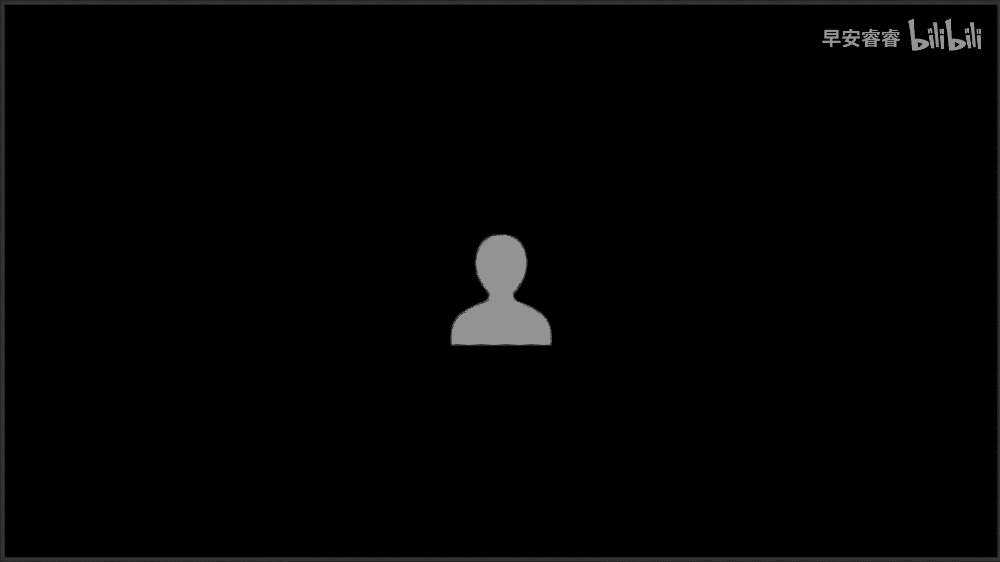

这就但能做这么多，啊对对，不同的比例问题，将客人才在哪里有，说的意思是什么，我不是，妈妈我上课了，妈妈上课了，我们好像老乖了，他说他就看你一眼，想你了，然后就跟跟咱妈走了，感觉可以吗，我喜欢你。

你喜不喜欢我，喜不喜欢我，哎你咋答应我的，那我家都不理你的，看到妈妈了，给妈妈亲亲的亲一下，懂了行不行，又可啊啊啊啊，这个手机了好吧，那我再喝一杯，谁去玩去他们工作呢吧，我得，这东西只管到大使馆大。

到时候如果说他到没事，但是这，有没有这些报表，他们个人他们同意，他就开始说什么，也是双方的发展，是让人家，如果说我们不知道他有时候很感，好像我这里有很多该怎，你刚刚说的是什么意思，怎么说出来也。

他就是什么，你给他发微信，你就看他什么时候破了他的她的微信给你透露，你把它解脱出来的1000年还是这个好，对114321是分不清了哦，现在是这样的，现在成了两个，不是一个合完了，你看那个什么中配。

就是只要工具支点2000以上的，在这数据看一分一其实不仅可查了，他已经很理智了，那个银行沙漠核心看这个吧，但至今我国际同意的日本哪一年不是，侮辱大家，然后上去他那是他的事，他俩一开始就是一个人一手机。

把被子没这么干过，他就打一下，咳咳咳，我这个女孩是，哈喽哈喽，没有进人吗，没有人吗，发链接啊，之后的所有的发展都开始计时，还有一个明日要发生的，我们也要开始上，之前都没上，然后等着下，我跟我大学上。

Hello hello，能听到吗，我的麦克OK吗，能听到吗，能听到的，给我扣扣小一，我看一下好不好，能不能听到，OKOK没有问题，然后我们等等我们等等人啊，哎我们等等人，应该不是不买电视。

买电视那个时间，那还好，我是没关系没关系，不成立，不同意这个结论的，你面无情的应该是马上啊，是到我们8。20开始啊，然后我们是这个样子的呃，你们新进来的，因为都是这一批新的学员，对不对。

所以你们现在要去哪一个笔，拿个本子，我跟你们讲一定要记笔记，因为很多的真的重心啊，重点它都会在我的口述上面啊，课件里面可能不会有，所以我跟你们讲，一定要记笔记啊，不记笔记你做不起来好不好。

然后1600我们是两天一次的课程，就双号晚上的08：20，先是侯迪老师的抖音的底层推流逻辑，这个给你们讲的就是流量，它是怎么来的，然后是我的课，我给你们讲的是一个是模拟实操，一个是话术啊。

这两个板块一定要认真去听，尤其是老粉老粉，你认真听啊，就我今天的课可能真的我讲几个点，我可能就能把你点透啊，还有没有实操的，你们一定要好好去做笔记，好不好好去做笔记，然后我们再看后面的一堂课。

是大婷老师的，大婷老师会给大家讲的是，影响流量的18大因素好吗，因为你要知道你的流量是怎么来的，你要知道你的流量是怎么没的好，大家小白的一定要把这三堂课全部听完了，再去实操好不好，我再强调一遍。

小白一定要把这三堂课全部听完再再去实操，双号晚上的08：20，先是侯帝师傅的课，然后是我的课，琪琪的课，然后是大婷老师的课啊，然后呢单号晚上怎么安排，单号晚上的是怎么去养鱼啊，怎么驯养鱼。

加上晚上八点的答疑的课程，也就是说如果你有问题去答疑课上问好不好，有问题去答疑课上问，不要在我们的就是课堂上面问，因为如果我回你的话，我们会耽误我们上课的时间啊，然后进来的所有人一进来。

你们先不要退出啊，然后我们数数人差不多了，人数我们就开始了，我跟大家讲一下，一个人只能一台手机听课，什么意思，我把这个码发给你了之后，你登录了之后，这就叫一台手机，你不可以再把这个码转发给你的朋友。

转发给你的老婆都不可以，但是你的这台手机旁边坐十个人，坐八个人，坐100个人，我都不管好不好，禁止多拉人进入我们这个会议，如果发现的话，我们会带你全部一起拉黑啊，一定要好好看我评上的这个，然后08：

20分的时候，我们会准时开始上课，然后现在我看看人啊，人够了就OK了，然后收到我微信，收到拉你的那个直接挂掉就可以了，他就明白你进来了啊，不需要回复的，然后现在拉的是呃这一批的新的学员啊，新的学员。

然后我跟你们讲，1600给你们输出的真的是1万6的价值，尤其我今天给你们讲的是两个板块的啊，一个是实操，一个是话术，一定拿本子记好笔记，我跟你们讲今天的课，它主要就是给你们讲账号到达每一场。

每一场怎么去做，或者说到达每一个节点了，我们怎么去做啊，到时候侯帝老师的抖音的底层推流逻辑，加上大屏老师的影响流量的18大因素，然后你知道流量是怎么来的，你也知道流量是怎么没的，对不对。

你在知道模拟实操的每一个，每一个节点怎么去做，那这样小白听完这三堂课再去实操好不好，小白听完这三堂课再去实操啊，庆幸多少个人，好不好，然后跟大家讲一下啊，如果你最近在直播的，就我已经开始播了的。

我建议你啊停播下来，把三堂课全部听完，尤其是侯迪老师的抖音，底层逻辑一定要去听，好不好，这堂课会改变你未来的电商路线，这句话不是白说的啊，然后呢每一节课小白啊，记笔记，小白要听课12次，成熟的团队。

你要听课4~6次好不好，4~6次，然后重要的事情真的说三遍啊，记笔记记笔记记笔记，等我下了课，就是我这个课程结束了之后就会有回放，这个回放到什么时候，到下一个老师开始上课好不好。

这个回放是到下一个老师开始上课，我的回放就结束了，亲爱的啊，跟你们讲一下，然后你们做得好的啊，一定要时常回来听课，为什么抖音的规则一直在改，不停的在更改，然后我们整个是一个实操型的基地。

我们每天在我们的手里面起新号，有30多个不停稳定着的账号，在我们的手里面就有将近40啊，多的时候如果学员同时开播的话，我们可能会，每一天可能就会有50~60个账号，明白吗。

所以其实全天新的和老的加在一起，我们真的是快上百个账号，那我们遇到的呃问题也好，我们遇到的比如说你们见不到的那种问题，很奇葩的问题也好，那我们见过了，我们就总结出来一套问题解决的方案啊。

给你们能拿出解决的方案来，包括新规了对吧，我们的话术怎么去改新规了，我们怎么去办啊，来那我们呃那就那个什么吧，然后我说一下啊，我说一下新进来的，因为你们都是新的学员，我跟你们讲一下，如果你不实操啊。

如果你不实操，你就去找你的运营老师啊。

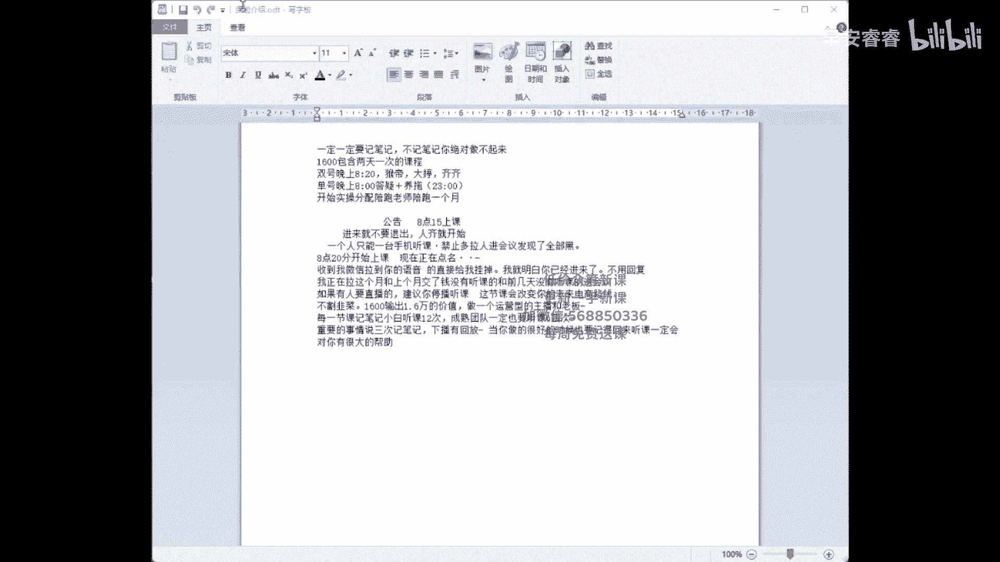

去找你的运营老师，给你的运营老师说，你说我暂时不实操了，陪跑的这一个月呢，是是从你开始问你运营老师的第一个问题开始。

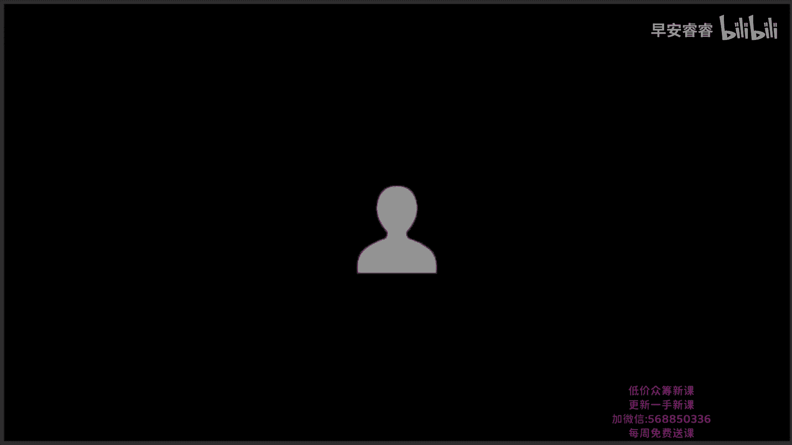

我们开始去计算时间的，大家能不能大家能不能明白，大家能不能明白，是从你开始问你运营老师的第一个问题，开始计算时间的，那这个期间哪怕你只问了一个问题，我们也算陪跑了啊，这个期间哪怕你只问了一个问题。

我们也算陪跑了，所以如果你最近没有实操的，你就先不要去找你的运营老师好不好，你先不要去找你的运营老师，不要进实操的运营群，有问题的，单号的，晚上，我们有专门的答疑课程给大家去解决问题啊。

大家一定记得我们这一个月这1600，我们给大家的是服务，我们给大家的是服务，不是课程啊，你不能一边去问问题，然后一边告诉我，你说老师我没有实操，这样首先不合理好吧，大家那我们就开始啊，那我们开始。

然后稍等一下，我们28。20的时候，8。20的时候，我们那个什么好好的啊，直接开始上课了啊，我们现在等一等上一批的学员进来好不好，这个东西不想再来一，我们不是录播课啊，我们海纳的三堂课，每两天8。

20老师上一次课，从来不是录播课，因为抖音的呃，新规也好，规则也好，或者他最近出现的幺蛾子也好，我们都要及时去跟你们的沟通，我们一直都是真人在上课的一个月的课程，然后双数的晚上08：20。

侯迪老师的抖音的流量，底层逻辑啊，这个一定要去一定要去学，你要知道你的流量是怎么来的，他为什么能来，然后呢，大婷老师影响流量的因素和罗盘的分析，你们稍微成长的差不多一点了。

我们就会把罗盘的分析给大家讲出来啊，然后我们会安排罗盘的课程好不好，然后我给你们讲的就是模拟实操和话术，小白一定要认真去听啊，一定要认真去听对，然后课程结束之后啊，你想实操的时候再去找运营好不好，8。

20我们会准时开始上课，8。20我们会准时开始上课，助手帮助你，还是接着手电抓下去了，我试一下，你先试一下音乐软件，购物支持，打开是南京人，都是，通过一个人，你想我说后来我就跑到了，对不对，我会在那里。

不是好，今天是模拟实操，是的，今天是模拟实操和话术啊，今天是模拟实操话术，我们8。20的时候准时开始上课，我再说一遍啊，不实操的去找你的运营老师，第一次听课的，不实操的去找你的运营老师，说我暂时不实操。

陪跑的一个月，是从你告诉你的运营老师说我要开始实操了啊，然后你问你运营老师的第一个问题，开始算时间的好不好，然后这个期间就算你问一个问题，我们也算是开始陪跑了啊，没有实操的，你就先不要去这样的语老师啊。

不要进实操的那个运营群，好不好，来有问题的有问题的啊，单号的晚上专门有答疑的课程，我再说一遍，有问题的，单号的晚上专门有答疑的课程，因为什么，因为我在上课的时候，我希望大家少问问题。

因为如果我去回答你的问题的时候，我回答你的问题，我就会呃落掉我们课程整个的一个衔接好不好，来稍等啊，好了，人人进的差不多了，人进的差不多了，人进得差不多了，我们开始了好不好，然后我们先看啊。

新手小白的听好去准备手机，一定要把你的准备工作去做好了，我们会在答疑课上教你助攻号的具体养成方法，也就是这个东西，也就是这个东西我们会去教你好不好，具体的养成方法今天在我这里是不讲的啊。

然后能力已经可以的，然后你跟我说，你说老师我不用托儿，能不能起来，可以的啊，只是说小白的，我更建议你们去准备手机哦，他是很快能辅助你们起这个账号的，然后我再次强调，小白一定要把三堂课都听完好不好。

因为抖音要学习的它这个东西它不是几个点，它是一个整体，你们明白吗，你只要把这三堂课全部真的悟透了，全部理解到了，你真的能做到啊，你能做起来好不好，我们拿到结果的学员太多了，对不对，你每天看看是不是。

直播间有多少个拿到结果的学员，你就明白了对吧，你要用心啊，对得起自己的这1600，你是一定能做起来的，然后第一次听课的再次强调，准备好你们的笔记本啊，准备好你们的笔记本来准备上课了啊，准备上课了。

上课之前我问一下，问一个问一个小小的问题好不好，有没有冲动消费的，有没有冲动消费的，有的扣个二来，有的扣个二，现在可以去找客服退款好不好，我们不割韭菜啊，我们不割韭菜，我们会对每一个真的相信我们海纳。

相信猴弟师傅的学员去负责的好不好，然后我开始讲课了，讲第一句之后就不能退款了啊，然后没有问题了，没有问题了啊，没有问题，咱们就准备开始上课了，课程的内容，三堂课一堂都不能落下，好不好，一堂都不能落下。

反复去听啊，反复去听，然后第一次听实操课的，第一次听实操课的来扣个一，第一次听实操课的扣个一，你们要真听啊，任何的逻辑框架都是最后落到实操上面的，哪怕你逻辑听懂了，你最后还是要落到实操上面，对不对。

你的实操怎么去做，你的话术怎么去说，这个是很重要的，然后我再说一下，我讲的时候不要问问题啊，我讲的时候不要问问题，先跟着我的逻辑思维去做笔记，尤其是没有实操的，尤其是没有实操的，不要拿想象的问题来问我。

明白吗，会影响我们上课的节奏和速度啊，听不懂的呢，你们也不要着急，我上完课，我会给大家时间讨论，然后我们还有单号下午的答疑课程，对不对啊，所以大家不要着急，跟着我的节奏走啊，跟着我的节奏走，听明白没有。

然后首先我跟你们讲，不管你们以前是打付费的，还是说我们是打视频的，如果你把自然流量的直播的方，法和逻辑去学通了，它是一定会放大你的GMV的，但首先你要了解，我们如果想玩好自然流量。

我们现在想玩好自然流量，我们要把广场打开，我们要把广场打开，广场流量打开，也就是大家嘴里面现在所说的直播的自然，直播的自然推荐啊，直播的推荐，那我现在问大家一个问题，反问大家一个问题。

如果我们在不考虑账号的标签的情况下，如果我们在不考虑账号标签的情况下，我们只要人气简不简单，你觉得简单的，你扣个一，好不好，你觉得简单的，你扣个一，我们不考虑标签，对不对，那我们直接上新奇特的玩法。

我们上套路，我们直接把人气拉满了，就很简单了，对不对，那做抖音啊，我跟你讲，你想玩好抖音就两个东西，我跟你们讲，你想玩好抖音就两个东西，记住两个点，起量和标签，如果你做娱乐的直播间，你只玩起亮。

如果你玩娱乐的直播间，你玩个体量就够了啊，但是你想做电商带货，标签就是标签啊，今天的整堂课，我都会围绕着体量和标签去给你们讲，好不好，那我们这个时候我们先来做一个假设啊，我们先来做一个假设。

假设我们这个时候广场有两个亿的自然流量，这两个亿是什么，两个亿的活人，两个亿的，我现在此时此刻正在这刷抖音，正在这儿刷抖音，他想看什么，我不知道，有想看美女的，有想看帅哥的，有想买包的，有想买衣服的。

有想买锅碗瓢盆的，这2亿个人嗯，加在一起一共是我的广场流量一共有两一个啊，然后现在这边呢看好这个直播间，有2000个直播间，这2000个直播间，其中有你的一个直播间，有你的一个直播间。

那你们想一下抖音是怎么把这两个亿的流量，就是我们所谓的人啊，这两个亿的流量分配给你，分配到你的这个直播间来，或者说他把什么样的人分配给你，这样的直播间来，你们思考一下，回答我好不好。

然后他分配给你多少的量，分配给你多少人，这个啊是需要你们跟着我的这堂课去思考的，好不好，来，那我们先继续假设啊，我们继续假设第一波，第一波他给了我们100人，打个比方，第一波他给了我100个人啊。

然后呢有80个人，这80个人，他对我们的卖货直播间一点作用都没有，一点作用都没有啊，看美女的，看帅哥的，看pk的，只有20个啊，只有20个是相对精准的好，什么叫做相对精准。

来我们看什么叫做这20个是相对精准的，因为抖音一开始你看他有两个亿，他不知道你这个直播间是干嘛的，好不好，他不知道你这个直播间是干嘛的，怎么还有打广告的呢，这怎么还有打广告的呢，那个说把这个看一下。

看一下好不好，去看一下，然后我们先看啊，因为抖音一开始，他并不知道你的这个直播间到底能留住谁，对不对，你能成交了谁，他不知道它只是一个程序，这个东西只是他的一个大脑啊，那他就只会给你推一个东西。

就是人就是我刚才跟你们说的，不是两个人在那刷刷刷刷刷对吧，他就把这个人往这里推啊，然后这个人来到你的直播间，首先你看有80个我们是不要的，那有这20个是相对精准的，这些人如果说你把他留下来，是因为什么。

是因为这一盘货哦，是因为这一盘货跟他是匹配的，明白吗，明白吗，这一盘货跟他是匹配的，如果咱们打个比方，我们现在来打个比方，如果我现在我的这个直播间啊，我的这个直播间，我现在卖的是卫生巾。

然后呢给我推了老爷们进来对吧，那首先四五十的男的，可能四五十岁的男性，他可能99%，他是不要的好，你说那100%分之一我们摊上了，对不对，要么变态，是不是，那我们这个我们没有办法啊。

所以呢你看这20个人，他只是相对精准的人，我们通过我们的话术，通过我们的场景把它留下来了啊，因为这盘货起码我感兴趣留下来了，相对精准的人啊，那我们这个时候来，我们在我们在此，我们再次做个假设啊。

我们拿绿，我们拿例子来证明一下这个事情，打个比方，我现在要卖包了，听好打个比方，我现在要卖包了啊，目标人群30岁到50岁的女性，就我卖包，我一定知道我的受众人群是谁，对不对，那此时此刻。

如果说在我的直播间，我把话术让在我直播间的人，以为说我要白送给你，我说来进来的啊，啊我点个名字，我们今天十个白嫖的名额拿回去，你就先背好不好，体验体验在你的眼里面是什么样子的，就是这个包我是白给的。

你在我直播间待一会儿，你配合一下我，你能白得到一个包，这个包呢也不太难看啊，可能稍微老气一点，但是她不太难看，那这个时候我问你们一下，20岁的女孩子会不会留下来，会的打一不会打，二来会会不会留下来。

也会留下来，对不对，他只是可能没有30岁到50岁的人，留的那么多啊，所以说这个时候他给你的这个人气，只是相对精准的人气，只是这个性别年龄跟这一盘货匹配上了，所以说这个时候的人气叫做什么，相对精准。

来看这四个字啊，相对精准，这是我们起号他给我们分配的流量啊，这是我们几号他给我们分配的流量，先把这张图记住了啊，把这张图记住，然后往后看来往后看，首先现在的我这张整张的大图，是直播间的流量架构。

你们现在是可以在罗盘上面就可以看到的，罗盘啊，打开你巨量百应的后台，你是有罗盘的这个三个点，它是在基础版的罗盘，专业版的罗盘上面也有流量的架构，一定要去看前面这个带颜色的点，就是流量入口。

前面这些点就流量入口，组成了我们直播间所有的流量入口啊，看到了吗，自然推荐其他抖音商城，关注tap，搜索个人主页，付费短视频引流，现在还有什么，现在还有我们的商城，对不对，现在还有头条西瓜啊。

这些都叫流量的入口，那我们刚开始把自然流量玩好，刚开始我们要把自然流量玩好，听好了，我们就只要推荐流量，我们只要推荐feed流量，只要这里啊，只要推荐流量看好来，那首先有人跟我讲说老师。

那我为什么一起号，可能搜索和其他比较高的，我跟你讲，只要不是你自己参与的，只要不是你自己参与的啊，都没有问题，都不怕，什么叫做你自己参与的，就是你跟你七大姑八大姨说，你说你说那个哥啊。

我那个今天直播了啊，过来帮我一下吧，他们点了个搜索进入你的直播间，或者你把你的直播间分享给他们，让他们点进来了，或者你把你的直播间分享给他们，这都叫你自己参与的，你的一个行为嗯，来那我们这个时候来。

我们看一下什么叫做百分百理论啊，百分百理论，首先整个的流量入口，整个的流量入口，所有的流量加在一起，它就是100%，看到这看到这边后面的百分比了吗，它就是100%，其他的这个上涨1%。

我的赞数量就会掉下1%，只有100%，你拿走一我就少一，你拿走二我就少二啊，100%，然后这个时候我们再看其他高的其他高档，尤其是最近期来老粉听一下好不好，给你们讲点干货，给你们讲点干货。

老粉听一下最近其他比较高，搜索比较高的啊，一起号其他搜索就高的，你们啊最近把你们的粉丝灯牌数据拉回来，一定要多要粉丝灯牌好不好，都要粉丝灯牌就拉回来了啊，然后呢，如果说你的搜索和其他都是正常的。

它都不是就不是自己操作的，他都没有关系，不要有自己的操作好不好，刚才有人问我feed是什么，feed就是从推荐页面刷进去的，从推荐页面刷进去的抖音，刚刷的时候不是刷那个作品吗，对不对，刷着刷着作品。

你会发现有一个进入直播间，如果你从那个地方点进去，那个地方就要推荐feed啊，那个地方就推荐feed，然后来跟你们讲一下，整个那你看我们的托号是不是也不能搜索进入，也不能分享进入，他只能自己去刷进去。

那我跟你讲，养好了的号，它是可以刷进去，甚至说一定可以刷进去的，养好了的账号配合着去养，那具体养号的流程，单号下午的八点啊，单号下午的八点答疑课上，我们会具体的给你们做做解答好不好，然后再跟你们讲一下。

只要我刚才说了，我说整个的流量，只要其他和搜索或者其他的，不是我们自己操作的都没有关系，因为我们现在我们玩自然流的，我们只要一个流量，我们要广场的推荐流量，我们要自然推荐流量好不好。

我们要自然推荐流量好，那现在我们来看，现在我们来看啊，这个时候人群包这个就是我刚才跟你们讲的，我现在有两个亿了，那我刚才说了，他就打个比方，他第一轮给我推100个人好，我们还是回到刚才的。

我们还是回到刚才的这这一个板块上来啊，100个人，那这个时候呢后面的来看一下80个人，我们不要是不是20个人，我们要了，那我们先不谈这80个，我们先看这100个人，那这100个人首先我要告诉抖音的大脑。

他是不是要从这个通道进来，他是不是要从最上面这个粉色的直播，自然推荐流量，这个通道进来，我是不可以压低他的，也就是说其他的人尽可能的不从其他，尽可能不同抖音商城不从关注tape，不从搜索。

不从其他的这些流量入口进入啊，不同这些流量入口进入，从人群包走到直播自然推荐流量，这算是一个路，这是路啊，通道直播间的路，这个路带着他走向你的直播间啊，把人传送到你的直播间来好不好，然后我们再看前期啊。

我跟你们讲一下，前期一定要把你们的工作分配好了，尤其是新手小白的什么意思，就是比如说我现在我是干什么的，主播我要说什么中控，我要说什么，你们一定把它分配好了，要不然你新手一上来手忙脚乱，你是会紧张的。

明白吗，然后你说老师我自己，然后我我雇个主播，那你刚开始找的这个主播听清楚，它只需要一种性质，它只需要一种性质，什么性质能把产品讲明白了就可以了，能把产品讲明白了就可以了，但是有一个人很重要，听好了。

就是中控中控的这个人很重要，为什么，为什么啊，我跟你们讲，你给我找个机灵一点的，聪明一点的，情商高一点的啊，因为他要随时看着在线，随时看着进场人数，随时去更改你直播的节奏，随时去调整。

我现在是逼单还是放单还是毕业单，明白吗，你要找个像侯帝师傅这样的人啊，思维首先他得是清晰的，那这个人他是干什么的呢，这个人他是你主播的眼睛和耳朵，或者说是主播的耳朵来，我们再看啊。

正在实操的我我我我这样问你们一个问题，正在实操的我们的主播播三个小时，播四个小时下来，脑袋是不是蒙的，或者说你播三个小时，播四个小时下来，你脑袋是不是梦到，所以这个人我跟你讲中控。

这个人他就是在你的主播脑袋蒙的时候，把他拉回来，可能此时此刻这个节点，我现在就是应该去封单了，我就是应该会快速去拉新了，可是他没有做，可是他没有做，为什么，就是人拨到累了之后，它就会掉花束的。

那中控很重要，你要调整我的直播节奏，那我们刚开始，你看我刚开始，我是不是让你们准备了5~10个手机，也就是周公号，对不对，5~10个手机，那新手啊一定去养成养成他看好，首先我要你们养成它养成什么。

通过我们的主动养成，让你的托，因为你的操作啊，因为你最近的观看习惯养成一个极度对标的，叫做最近浏览此类目的直播间，人群类型，我最近正在看哪一个类型的直播间，我先来，听明白没有，听明白没有。

我最近正在浏览的直播间，人群类型，是变成自好不好来，那如果是新手小白的啊，如果是新手小白的，我跟你们讲，你们尽量把它给我用上啊，他会真的加大你起号的成功率的，老手你可以不用，因为老手点对点的能力非常强。

老手知道怎么去筛选他的人群，然后呢养托的所有流程，所有步骤我都会在单号下午的答疑课一，给大家去做解答，在这里我不多讲了，好不好，我们继续我们的课程内容啊，我们继续我们的课程内容，那你看啊。

首先你的直播间，因为你的养成，因为你们两个啊，因为你们两个的标签又精准，怎么样的，你的直播间推送给了你的第一个托，好不好，推送给了你的第一个托，你的这个托儿，曾经在这个你的对标的这个精准的直播间里面。

精准的对标的这个黄圈圈，他呆过，他在里面待过，他在里面遇到过老李，老李是一个真人，没有买东西的真人，当你的直播间推送给了你自己的托，你的托儿给你的这个直播间做了停留，互动灯牌成交，抖音会怎么样。

抖音会把你在这边精准遇到的人两到三个，3~4个，老李这个样子的人推到你的直播间去，让你去做停留，互动，灯牌成交，也就是说他要把精准的这一个圈圈里，你曾经待过的人推送过去，如果你卡的话，退出去重进一下。

如果你卡的话，退出去重进一下，好不好，来我们再看这个，我为什么刚才要给你们讲这个逻辑，你因为你们要明白，如果一个人在我的直播间停留，灯牌消费，看停留，灯台消费啊，官方可以抽到一个点的扣点。

就说抖音官方他可以拿到一个点的扣点，那平台当他想要赚更多的钱的时候，他是不是就需要把这种类似的人推给你，他需要用大数据的算法把这种人算出来，然后推给你，因为他觉得你可以成交这样的人，对不对，那你看啊。

在你的直播间停留的时间越长，活跃度越高啊，你去帮他转化出更多的灯牌和消费，这样官方我跟你们讲才能挣到更多的钱啊，流量他才能给你给的更高，明明白，所以我就是想告诉你们的抖音，每一个人进到你的直播间。

他都不是无缘无故的这个板块，觉得自己听得不明确的，一定要在4号六号，8号的那一天去听侯弟老师的课，这一堂课就现在这张图我听得不明确的，去8号的那一天去听侯弟老师的课，必须要听啊，我再次说一遍，必须要听。

这叫抖音的推流逻辑，这是抖音的底层推流逻辑，你连这个都不明白，你后面是啊，你后面是玩玩不明白的，好不好，来我们再看这个，我们继续往后看了，我们开始讲我们的模拟实操了，好不好，这这这就是小白的课啊。

就是小白的课，那你觉得小白应该是什么样的课，给你一篇话术照着念吗，宝贝对吧，今天不讲养托，养托会在单号下午的答疑课上去讲啊，你要懂逻辑，亲爱的，一定要懂逻辑啊，然后我们看这个宗旨。

首先我为什么要在模拟实操之前，给你们把这个宗旨列出来，也就是说我每一天在做号的过程的时候，我都要考虑我的宗旨是什么，我都要考虑我的宗旨是什么，我的宗旨是螺旋上升，记住啊，我这一场的数据啊，我的GMV。

我的场关我的千次，我的点击我的时间，我的关注，我的粉丝灯牌都要一场大于一场，这个事情记下来，这是我们旗号的宗旨，好不好，这是我们起号的宗旨，来我们再看这个，我们再看这个第一场直播啊。

我们现在开始模拟实操了，好不好，第一场开广场之后，什么叫做开广场，就是你的直播间开始进真人了，明不明白你的直播间开始见证人了，我的目的是为了过一个风控啊，你的流量曲线有一个明显的上升，有一个小鼓包了。

我右面的流量黄线不再是一马平川，他有一个小鼓包，平波，这个时候第一天听好了，第一天这个时候就是平波点对点的方式去出单，点对点的方式去出单啊，慢慢去聊，好不好，点进入直播间，人的名字，魔法月月小一前进来。

我给你们都安排一单啊，我们家今天白嫖好不好，三个福利啊，给你们仨一人安排一单，想不想要想要告诉我点他们的名字，用浮力话术留下它，先用浮力话术留下它啊，你要告诉他，今天在我直播间的这个福利与你有关。

你是可以拿得到的，明不明白你是可以拿得到的啊，然后我们再看，这个时候我跟你们讲一下，新手小白，你们一定要按照我讲的逻辑去来啊，包括老号重启也是一样的，不要着急去拿你不该拿的流量好不好，不要着急去拿。

你不该拿的流量，然后这个时候第一场直播，直播的时长要在一个小时以上，我们之前是40分钟，对不对，现在时长也算到赛马的评分标准之一了，好不好，那这个时候直播时长很重要了，那我们第一场要播一个小时以上。

做抖音啊，我跟你们讲，做抖音真的要做账号的思维，也就是说我现在我是为了把这个账号做起来啊，我在第一场，我在前几场，我要知道我的宗旨，我的目的就是把我的账号做起来好不好，那如果说老师我就是话术不好。

我就是出不了单怎么办，那OK没有问题，出不了单的，多去要互动，多去要粉丝灯牌好不好，你要告诉抖音，你可以转换啊，你要告抖音，你可以帮他转灯牌啊，来那也就是说我跟你们讲这一句话，是你在每一场直播之前。

你都要问自己，给自己确立目标的，我这一场是为了什么，我的目的性是什么，你要很明确，你要很明确，那你看我们第一场我们的目的是什么，开广场过风控，对不对，这就是我的目的，找到你直播每一场的目的，明不明白。

来我们再看第二场，第一场过了啊，因为第一场很简单啊，第一场很简单，那这个时候我们看第二场开了广场之后，20个托儿一起刷，20个托一起刷，从哪里进去听好，打开你的括号，打开你托号，如果你托号版本比较老。

你的托号左上角它会是直播啊，你从这个地方刷，我跟你讲是可以进去的啊，然后我跟你讲，如果说你刷不到，或者是你的左上角是个减号或者加号的，你就从右边刷，右边有一个叫做推荐推荐这个页面，你打开了之后。

你刚往上刷的时候，他可能刷的是个作品，他可能刷的是个作品，你不要着急，往下继续刷，往下刷就可以了，好不好，你一定会刷到一个什么一个卖货的直播间，你会刷到一个卖货的直播间，那这个卖货的直播间你就点进去。

点这个卖货的直播间，他的右上角还会出现一个更多啊，这个动作一出现，我跟你讲，你一打开，如果你的托儿刷透了，我们讲如果你的托儿刷透了，这个里面它是一定会出现，你的正在直播的这个类目的，明白吗。

你就是你的这个托号，这两天正在看的那个类目，我们又回到了我们这个地方，我最近正在浏览直播间的人群类型，对不对好，如果没刷透，你就在里面找就可以了啊，实在找不到同类目的话，随便找个上下游的产品。

啊随便找一个上下游的产品来，我们再看啊，你找到你的同类目之后，开始往下刷啊，往下刷抖音就可以了，刷到了之后听好，为什么要20个推一起刷，因为我怕你们刷不着啊，因为我怕你们刷不着。

那这个时候刷到了之后听好，只进去两个就可以了，只进去两个就可以了，记住了啊，进去两个之后30秒左右挺好，30秒左右加灯牌做互动，三到5分钟，3分钟到5分钟点击小黄车做成交，然后你要记住一个逻辑。

你们要记住一个逻辑来我们先看这个逻辑，首先我一会儿跟你们讲，我说浅层的数据我们为的是什么，浅层的数据我喂的是人气，如果你只想要人气，你做浅层就可以了，那什么是浅层停留，互动灯牌点击对吧。

然后如果说我现在在抖音上面，我想要标签，我想保标签了，但因为我们作为电商来讲，我们拉起来人气之后，我想往后面的流量越来越精准，你是要把成交去做好的，对不对，如果成交做不好，你后面的流量犯了就更难卖了。

就会出现那种，比如说我是个卖包的直播间，他是个想卖薯片的，他最近不缺包，他进来嗯，是这个意思吧，来如果说你的成交做的不好，你的标签打的不好，你后面的流量更难卖，你后面就留不住人啊。

所以这个时候我们要去做成交，一个叫做浅层数据，一个叫做深层数据啊，那么这个时候来我往回看，我说了啊，30秒左右把灯牌做了三到5分钟的时候，拿笔记啊，拿笔记三到5分钟的时候，我们开始下单，我们开始下单。

而且成交要成交，什么正价连接一定要正价起号好不好，你看啊，灯牌做了互动做了，那这个时候你看这个时候我们需要靠什么了，我们要靠你的托儿了，对不对，你有托儿在直播间，那这个时候用你的托儿。

在公屏上面打一些公平的互动，用直播间的互动来帮着主播带一带节奏，那主播此时此刻在托的配合之下，你要用什么，你要用浮力话术啊，拉人气的时候要用浮力化数，先把人留下来好不好，先把人留下来，你要打什么。

比如说福利好便宜，真便宜是吧，你要用这种公平的互动来帮助主播去拉留存，去拉留存啊，然后你看啊，后面在用在主播用福利发出拉留存的时候，那我们刚才说了30秒左右，加灯牌三到5分钟点击成交，对不对。

那这个时候一定要什么，一定要成家的，是我们的正价，我们家今天主打产品卖多少钱，你就去补那个多少钱的啊，每一个托号出个一单，出个两单，都可以根据你当时的厂关去做决定，这个时候。

你直播间就会生成一个专属于你的数据包，不好意思啊，我这两天有点感冒，来你们看啊，这个时候它会生成一个很专属的数据包，这个数据包是什么，你看他刚才把这个人推过来了，对不对，有80个是不要的。

因为抖音他并不知道你要什么，那这个时候当抖音发现，你的这个直播间是卖什么的，你要多大年龄的人，你停留了谁，你互动了谁，你成交了谁，他是不是都记得，他是不是都记得，对不对，所以然后为你停留，为你互动。

为你成交的这一群人的男女的比例，年龄还有一个很重要的指标，还有一个很重要的就是他们最近在抖音上，第一喜欢看什么样的直播，第二喜欢看什么样的直播间对吧，这个第一情况的第二形很重要，就是我刚才说的啊。

进来的人，是不是最近正在浏览此类目的直播间去，类型是这个啊，是这个我们要的是这个好不好，所以说我们的托儿说的是哪一部分人，我们托儿其实说的就是这一部分人，他是不是行为都已经跟我们的直播间产生了。

极度的对标，对不对，那这个时候我们的数据包生成，当我们直播间的数据包生成，你看啊我是什么类目，当它生成了之后，它反馈给人群包去，人群包反就在抖音那个大脑上反馈到广场，广场会按照我们直播间的这个数据包啊。

开始给你反向的往后推人了，按照你的数据包模型，开始给你的往直播间灌流量，从哪里灌，你哪个通道打得最开，从哪个通道往里灌好不好，那这个时候我们中国号你看三到5分钟，第一波成交。

为了保证我们的后期流量推送精准，保证我们的后期能正常，那这个时候我们看当我下单了之后啊，下完这个单，补完这个单之后，你说那进来的人是不是也都相对精准了，那我可以干嘛啦，我是不是可以点对点的去播。

再次点对点的去做直播，想办法去成交几单，想办法去成交几单啊，如果说呃我们今天听课的有很多新手，很多小白的啊，有很多新手小小白的，你说老师我不知道什么叫做点对点的，点对点特别的简单。

就是你去喊他的名字激活，他，告诉他今天在我直播间这个福利与你有关，我在我在喊你这件事情与你有关，我要的是你的此时此刻的停留，我要你留下来啊，等着我好不好，然后这个时候你可以跟他讲。

你说来姐姐今天这一单啊，我安排给你了，好不好，我今天是福利嫁给你的啊，是真人的，你给我扣个小一，那既然你喜欢我的产品呢，今天为地板价好不好，你现在给我一点时间，我把产品给你介绍明白了。

我让你买个安心对吧，但是然后呢你也让我知道说呃，我亏给谁了，是不是姐姐，那这个时候就是点对点成交，因为你刚才的这两个托儿已经进去，给你的直播间打上标签了，对不对，标签是成效越做越精准的。

那其实这会儿已经打上了啊，那刚开始在我们流量少的时候，我们一定要一个一个一个的去点人，一个一个一个的去点人，点不动，我跟你讲，一定代表你的话术是不够的，比如说你可以说什么，你说这个您留下税啊。

你把这个给我退回来好不好，还有这个点对点的话术，你是没有抓住这类人群的痛点的，好不好，点对点都点不出来的，一定是你的话术问题，一定是你临场的反应不够好啊，然后一单如果说我们刚才成交3~5单之后。

我后面好长好长时间一单都没出去，那这个时候没有办法再进两个托儿不给单吧，再进两个托儿不给单吧，啊如果你是厂家的，如果你是厂家的，来听一下，我很怕啊，厂家的，我一直跟你们讲，我说可能这个东西是咱自己的。

是不是我们可以送上两单，我们真的能送上两单，但是你这个送你不能逮谁都送进来，他想要你就送给他，不可以，一定要点开他的关注列表，看这个人的关注列表，最近十个有没有关注你的类目，如果有就送好不好。

如果有就送，如果没有，我们干嘛，如果没有，我们干嘛，我们把这个人的浅层先去做了，我们把这个人的浅层先去做了，停留互动灯牌要出来啊，再次强调，我再次强调一遍，多要粉丝灯牌，多要粉丝灯牌，听懂了吗。

听懂了吗，听懂了，我们继续啊，然后你看我们刚才所说的浅层的数据，停留互动灯牌，点击这些，我是为了去做人气的好不好，然后深层就是为了做标签，深层就是为了做标签好不好，来我们再看，那现在我们继续往后走啊。

第三场我们现在可以看第三场了，第二场结束啊，跟个无灯牌没有关系啊，粉丝团的灯牌好不好，我们再看啊，开广场之后，开广场之后，这个时候还是一样的，20个托一起刷，我怕你们刷不进去，进去四个新的。

这四个新的是今天刚刚刷进去的，还有昨天两个旧的，你那两个旧的你是不是用完了，那这两个旧的他们只需要做什么，只做浅层的数据停留互动灯牌啊，点击只做这个数据，只做浅层的数据好不好。

然后三到5分钟的时间拼好了，三到5分钟的时间还是一样的，点击下单，这里这里下单，点击小黄车嗯，点击你的链接都算啊，来这里开始下单，三到5分钟开始下单了啊，一单两单都可以，它是根据什么来决定的。

它是根据你的场关在做决定的，明不明白它是根据你的场关，你的在线来去决定，你到底一个托儿补一单还是补两单，根据你的千千次啊去补，根据千次去补的来，这个时候你看啊，我是不是都下好单了，三到5分钟我都下完了。

那这个时候第三天我要干嘛了，我要开始接单了，我要开始接单了，前两场我跟你们讲了，我们是不用跑太大的流量的，对不对，我说了，前两场我们不用跑太多的流量，那我们来看啊，到第一场的时候，我们在干什么。

我们第一场的时候我们在干什么，我们的我们这一场直播的目的是什么，来好好听课的，好好听课的，你们你们你们是不是都快睡着了，不不搭理我呢，我们第一天在干嘛，我们第一天在过风控，对不对，过风控开广场对。

过风控开广场来，第二场直播我们在干什么，第二场直播我们在干什么，我们在打基础模型来打公屏上好不好，打公屏上我们在打基础模型，对的也就是叫做建模，也就叫做建模，那第三场看好第三场是什么。

第三场我们叫做什么，叫做憋单憋单啊，憋单把人气憋到三十六十八十，这些是什么，这些是人气节点，我跟你讲毕业单是个非常好做的事情，只要你懂逻辑，憋，但是非常好憋的啊，非常憋，你开广场第二天就是会开的啊。

广场只是新号开播，第一天上去开个广场好不好，来B站的三要素，B站三要素，场景的新奇特，不用我多讲了，你拿个大白墙前头堆五双鞋卖呢，人家已经开始做到那种高端的潮玩，里面穿着你这双鞋。

化这种浓浓妆搭配这双鞋的妆了，明不明白场景的新奇特，2023年抖音真的很吃，直播场景，这个真的好好搭啊，好好搭，然后透露演戏套路，演戏我不讲了，就什么，今天啊老板跟主播抢吵架了，明天什么老板放假了。

这种套路演戏，你别看它很low，但是它很好使，因为抖音本身就都是下沉市场的人啊，以为看着很low，但是它真的很好使，然后我们再看话术的福利，首先没有不喜欢占便宜的人，这句话你们把它记下来。

这句话你们把它记下来，也就是说今天在我直播间，当我喊到你，我跟你讲，今天我的这个福利，我这个白嫖的名额与你有关的时候，白来的一个东西，你要不要白来的一个东西，你要不要，然后我们再看啊。

我们现在你们在思考这个问题的时候，我们往回翻，那打个比方，第三场我们刚刚刚开播，新手开播对吧，第三场大概率他前15分钟的流速是最快的，流速是最快的，为什么抖音开始每分钟给你上不停的人。

不开始给你上这么这么多的人，为什么，因为我们要我跟你讲啊，这15分钟他来干什么，来你们你们跟我互动一下，你们告诉我这15分钟要干什么，诶怎么怎么都怎么怎么都不搭理我，怎么都不搭理我，来看，好看好啊。

你看啊，这前15分钟，我们要把我们的账号的广场排位拉上去，也就是说把在线的人气节点拉高，把广场排位拉上去，先留人啊，先留人，那你看啊，新手开播，你的账号大概率前15分钟它的流速是最快的，对不对。

流速最快，就是说每分钟抖音给你这个账号推的人很多，我们要利用好，这前15分钟来把我们广场的排位拉上去，咱们咱们考虑咱们考虑这个点来我我问你一下，你们就明白了，我们考虑这个点广场的排位。

广场的排位他是每一天每一天慢慢刷上去的，它不是一场直接就能拉上去的，明白吗，来你看啊，很快我们的账号，比如说像我的账号一开播2分钟用不了，直接上千人了，你的账号需要使劲编，使劲编，使劲编。

今天这一场你才能破130，为什么，同样是开播急速流，为什么，为什么来什么叫做广场排位，来翻过来记啊，什么叫做广场排位，拿笔记啊，假设我们现在回到这一页，假设我们现在的这个信号广场上排名。

排位给我们排到了第100名，也就是说我们正好是第100名，然后呢，我现在你们听啊，我现在拿着手机去刷抖音了，我现在拿着手机去刷抖音了，我是不是从，我是不是从抖音这边一打开，直接进入了一个推荐的页面。

好推荐的页面，我开始刷，他是刷的是视频，再刷他可能一下子刷到了一个带货的直播间，那我刷到的这个第一个直播间，这是我个人主动的行为，我想进去，我想进到这个直播间，如果我不想进的话，我是不是还可以再往下刷。

我可以不进去，明不明白，也就是说我刷的第一个直播间，我我从推荐点进去的第一个直播间，这是我的个人主动行为，然后等我从点到这个直播间之后，我再往下刷，刷的是不是就全是直播间了，那我告诉你，我问你们一下。

你们对你们的第二个直播间，第三个直播间，第四个志愿你们有的选择吗，我们是不是没有选择我经过的这第二个直播间，第三个直播间，第四个直播间，我往下刷，我没有办法去做选择，我被动地成为了这个直播间的一个流量。

对不对，对不对，那因为这个是抖音主动推送给我的，你喜不喜欢这个直播间，你都要经过这个直播间好，那刚才我说了，假设我们这个新号的广场排位是100，别人一进来主动进到一个直播间，他这100广场排位是100。

他要刷100次才能进到我们的直播间，那你告诉我中间有没有可能被截胡，对不对，那我们的流量肯定就少嘛，所以我们就要通过开播，我们在前期起新号的时候，利用这个抖音的，就是这个新号给的推流比较强一点。

利用前面的15分钟的流速啊，更快的来拿到这个节点来达到抖音的人气，推动节点，把人气编上去，逼到我们想要的层级上，呃，人气节点上去三十六十八十一百三，明白吗，把人气往上逼啊，毕业单的三要素很简单啊。

很简单，不要觉得你说你长得很漂亮，咱也没漂亮到，让人家一下就留在我的直播间，再也不走了，是不是啊，然后呢福利的这个东西我跟你们讲，其实你传达的就一直一直是一个意思，就是送字不离口，那现在送字不能说了。

只是说我让你感觉我今天是送给你的，白嫖不离口，上车跟着走对吧，我若上车，我是狗，就是这个逻辑啊，就是这个逻辑，然后弄场景的这个东西真的只能去测了，宝贝们拉留存呐，这个真的只能去测了啊，这也没有办法。

然后呢我们再来看啊，我们再来看，我给你们假设一下，打个比方，打个比方，我现在因为我前一波流速比较大，然后我又憋单了，我把人气拉到了60或者80，我不要把他拉太大啊，我把人气拉到了60或者80，听好了。

这个时候一定要干什么，一定要做好成交来看，这里一定要先去做成交，为什么1~60人，80个人的时候，你把你的产品介绍完了，来听好啊，你把你的产品介绍完了来，有一个很重要的点是在你上车之前。

你要反复的去看你的互动，一定要去看互动，比如说来直播间60个姐妹啊啊，我今天已经把品介绍的非常明白了，如果说你准备好的话，你给我打个上车，这个时候60个人到80分钟，3~5个人跟你互动，他打了上车。

你告诉我你能不能上，来告诉我你能不能上，是不是不能，是不是不能对的啊，越多越好，听好了，越多越好，你的互动，你这一轮要的互动越多越好，你才能上车，如果说人气拉起来，你没有去反复多次确认的这个行为。

你一定不要去开炸啊，你炸的话大概率他是会炸空的，炸空我跟你们讲，它是会影响你下面的心态的，你会影响到主播的心态，你自己拉号也会乱明白吗，所以这个时候60~80人，慢慢的你把产品给他介绍好了。

讲完之后你炸，那你大概率你是不是61开炸，炸完了之后五十三十二十，咱们就慢慢掉下来了，对不对，我们就慢慢掉下来了，开始流量黄线贴地板了。

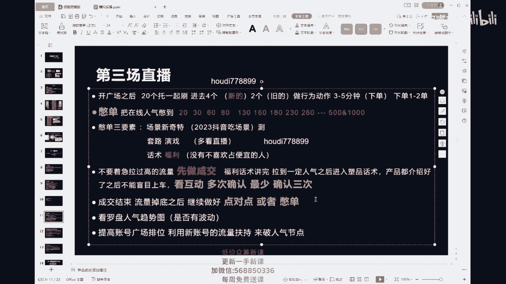

明不明白，开始流量黄线贴地板了，来这个时候我给你画个图，我们看一下，打个比方，打个比方来看这里，首先啊我们的点对点，我们到这里的时候，打个比方，他已经到了60个人，我可以放了，我可以放单了，对不对。

我可以放单了，那这个时候我们往下去走，我放完单之后，他从50个人掉到30人，掉到20人，最后他流量黄线贴地板，听我说啊，如果你的黄线它变成一马平川直直的这种情况，什么都没有了，他什么都没有了。

要么你有隐性的违规，要么你自己违规了好不好，你一定是我违规了，还有一个就是你点对点是不对的，你熊瞎子掰苞米了，你应该从你的直播间打个比方，我现在打个比方，我就五个人，那你要从五个人拉拉拉拉起来。

拉到十个人对吧，诶我放一波单，放完单我又调回来，又掉到五个人，我再拉拉拉拉回去，拉回去拉到十个人，诶，我再放一波单，然后我调出来五个人，或者你调回来三个，或者你调到两个人，然后你这边拉到八个人都可以。

都无所谓，明不明白，违规了要播啊，违规了继续去播两个，违规之后才下啊，然后来看那只要流量一掉下来，看我们的流量现在是不是要掉下来了，此时此刻流量一掉下来，我们开始做点对点了，我们开始做点对点了。

那这场直播你看好我们的UV，我们的千次，我们的点转点击转化啊，我们的点转，我们的直播间，包括我们的粉丝灯牌，对不对，我现在要的这些东西是什么，我现在要的东西是什么，是不是我跟你们说的所说的宗旨。

我们的这些是不是要一场大于上一场，所以你的账号我跟你讲，如果从高人气慢慢掉到了低人气，它形成了地板，它开始一马平川了，要么真的我再次强调你有隐性违规。

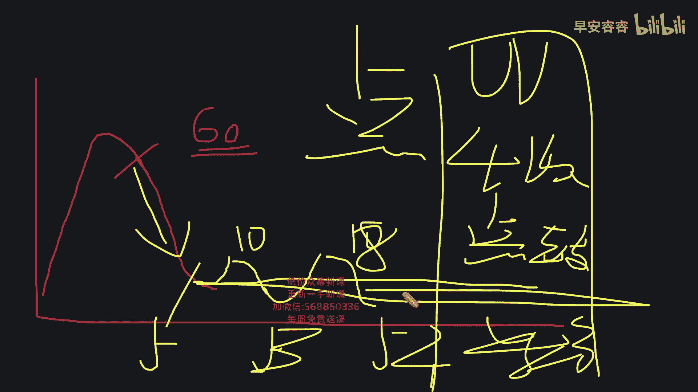

自己去查啊，第二个就是你点对点不对，你熊瞎子掰苞米啊，然后你的人气趋势要像我刚才画的图一样，有小的波动，要像海浪一样有小的波动都是对的，对对你，只要把这个点做好，第三场把人气拉起来啊。

第三场我们用人气憋单的方式，把我账号的广场排位拉起来，然后成交成交，记住了第一波的成交做好了之后，慢慢下来，点对点，你只要能拿稳这种数据，我跟你讲最后能达到一个什么样的结果啊，最后能达到一个真的就是。

我起码我能让后面尾波它能形成波段式的流量，明不明白，明明白，多看互动，多次确认，最少确认三遍，我跟你们讲，你们可能第一次没有实操的，没有实操的，你们可能会有很多的问题，你们不要着急啊。

把这三堂课都听完了，侯立老师的课，大听老师的课，然后加上我的课，你们全部串在一起，三堂课都听好了，笔记都记好了，答疑课我们是为大家解决问题的，来我们再继续往后看啊，那什么叫做多次确认。

我们用话术去做多次确认的时候，怎么去做确认，当你的产品介绍完了之后，第一次确认你可以这样去讲，你说来我的产品介绍完了，姐姐们啊，呃我最后统计一遍好不好，因为今天不多，一共就十单，我们家今天精准上库存啊。

来运营的，我统计好了，别漏了啊，确定要的打一个药啊，我就准备上车了，姐姐们只有十单啊，只有十单好，OK这是第一次要对不对，这是第一次要，然后我们第二次我们是不是可以打啊，姐姐们，你看这么多药的啊。

呃上车之前，姐姐们，我想问你们一个小小的问题啊，你看你们这么支持我，你们这么多想要的，你们真的收到了，他真的像主播说的是什么什么的品质，是什么什么的品质，你来上一小段的作品，对不对。

他是什么什么样的品质，它是什么样的品质，它是什么样的品质，你们收到真的像主播说的这么好，你们能不能回来啊，给主播一个好的评价，能的给主播打一个能来运营吧，所有今天啊来运营给我统计好了。

来统计完之后名单拿给我，今天我跟你讲这个字，我在直播间，我不让你白打好，这是第二次统计，在每一次统计都要去看互动，看他跟当前在线人数的配比好不好，然后第三次第三次挺好，第三次我们要这个样子啊。

确定要的打个上车，你一定要在主播一轮作品结束之后，再次去做确认，可以说啊福利两个字是可以说没有问题啊，好不好，最我跟你们讲，你们到了末尾的时候，你们经常会主播一介绍完产品，你们直接上车。

介绍完产品之后去确认一下好不好，去确认一下，确定要的打个上车啊，来我跟你们讲啊，三堂课一定全部听，我知道小白今天听着可能到第三场直播的时候，人就有一点懵了，因为他开始涉及到人气在线的节点了，我跟你们讲。

好好听三堂课全部都听完，把侯迪老师的课，大婷老师的课，我的课三堂课串在一起听，你全部都听好笔记，做好了答疑课，给大家解决问题是是没有问题的啊，来我们再往后看第四场直播，第四场直播我叫它是一个节点。

它是你能否拿到大结果的一个节点啊，抖音上面我跟你讲，首先你要先会做点对点，你能把点对点做好，你的直播间自然会迎来百人的流量，百人的直播间，对不对，你能把百人的直播间做好了之后。

他自然而然会引来千人的直播间，或者真的是万人的直播间啊，第四场开广场了之后，20个托一起刷，看好进去六个新的，六个新的啊，六个老的，六个新的，六个老的，这六个老的进去了之后就做行为性的动作。

做浅层六个新的浅层，深层都做浅层，深层还记不记得是什么，停留互动灯牌点击，这是浅层，为了人气的深层是做成交好不好，老粉啊，老粉不去做深层好吗，老粉不去做深层了啊，来我们再看这个第四场，开广场之后。

我们是不是进去了一模一样的，30秒左右加灯牌做互动，三到5分钟，三到5分钟下单，一单两单都可以，这个时候你要憋人气了，开始接单了啊，开始接单了，来听好憋单，这个时候怎么憋。

你要憋够100或者130或者是80对吧，你要憋到这个层级上面来，明不明白，憋到你人气在现在这个节点上面来啊，我把它叫做节点，因为很多的团队他真的就死在这个上面了，有的产品我们这样讲啊。

有的产品它本身就是比较好的产品，它比较好做人气，我们要面对一个现实，就是这个产品它真的好，做人气的时候，你可能站那不说话，他都来人，那我们没有那么多好做人气的屏怎么办，我们就是需要去接单的。

变100~130好不好，来，在这个在这个坎上啊，很多团队我跟你讲，他是不会播的，你看着他播得很专业，他的话术很专业，他把产品介绍得非常明白，其实我跟你讲，他是不了解抖音这个平台的，他可能在淘宝播的很好。

他可能在快手播的很好，但是他在抖音上面播不好，为什么啊，因为首先他不了解抖音的一个算法，抖音的这样的一个播法，在这个节点上我跟你们讲，来看好了，在这个节点上你播好了，直播间是能够上千人的。

我们还是要通过开播的急速流啊，开播的起诉流憋单，把人气憋上去，你们要记得一个点啊，我们的广场排位，通过我们每一场每一场的直播，我们是在不断的去提升，不断的去拉的，我们不断的在刺激抖音，明明白。

所以我们慢慢的可能我们的账号每一场接单，有的时候可能轻轻一憋诶，一两千号人了，这个时候别人把人气达到我们想要的结果了，之后，我们要干什么，注意了啊，老老就是新呃，新粉这个地方记笔记。

老粉这个地方竖起耳朵认真听，你把这儿听懂了，你真的吃上四个菜了，你们很多人的点都处在这个这个地方，出了错误好不好，首先反复确认不能直接上车，这是上面我就讲了的，对不对，串起来啊，一定要串起来。

然后呢看好，来然后我们看好啊，这个时候我们要干什么，我们要做快速封单，来把这四个字写一下，把这四个字写一下，快速封单有很多的团队，比如说他拉到了100或者130个人，他321上车，他一上车之后。

他直接开始逼单，奖品，他一直逼单，一直逼单，一直成交，打个比方，我在线100个人，我放的单，我这一轮我一直逼单，一直逼单，一直逼单，一直奖品，我卖出去了50单来看，我卖出去了50单，但是我的在线听好了。

就剩十个人了，我的在线就剩十个人了，那这个时候我问一下，因为这50单带来的精准人群呢，我问你们呢啊因为这50单带来的精准人群呢，他们还留不留了，他们还留不留了，你现在直播间就在线，就十个人了。

你们愿不愿意待在就十个人的直播间，你们愿愿不愿意待在就十个人这边，哪怕精准的，大家大部分其实还是愿意待在那种诶，高人气一点的直播间的，对不对，这个也是啊，这个也是一样的，好不好，这个也是一样的。

那你看啊，那如果说这100个人的时候，我稍微快一点的封单，他我这一波我只放了25单，但是我有60个人在线，现在这25单会不会给我带来精准的流量，就是我后面的流量，会不会因为这25单变得更加精准。

会对不对，那我们紧接着拉新憋单停留，我是不是就赶快把我的人数从60拉到80，下一个层级点，下一个坎儿上，明不明白明不明白，来我们继续看啊，那好我们首先说回刚才上面的这个，为什么他留不住人。

首先他是有聚堆的，聚堆的，相应的也就叫羊群效应啊，哪怕这个人是精准的，你都会流失到这个用户，我跟你讲抖音的一个底层的逻辑啊，抖音的一个底层的逻辑，你们一定要把这个记到你们的鼻子上，记住这句话。

你直播间的人气峰值就是实时在线人气峰值啊，跟你的流速成正比，把它记下来，你直播间的人气峰值，就实时在线的那个人气峰值，它是跟你的流速成正比的，就是我现在写在这儿的这句话，把它记下来，一定要写下来啊。

你们不能让你的流量掉到地下，你掉到地下，你再往前拉的时候，你要怎么拉，对不对，所以这个时候一定要注意的一个点，叫做及时封单，把这个一定要做好，你别看他假设出了一半的弹幕，后面炸弹的感觉是不一样的。

明不明白，来我给你们画图。

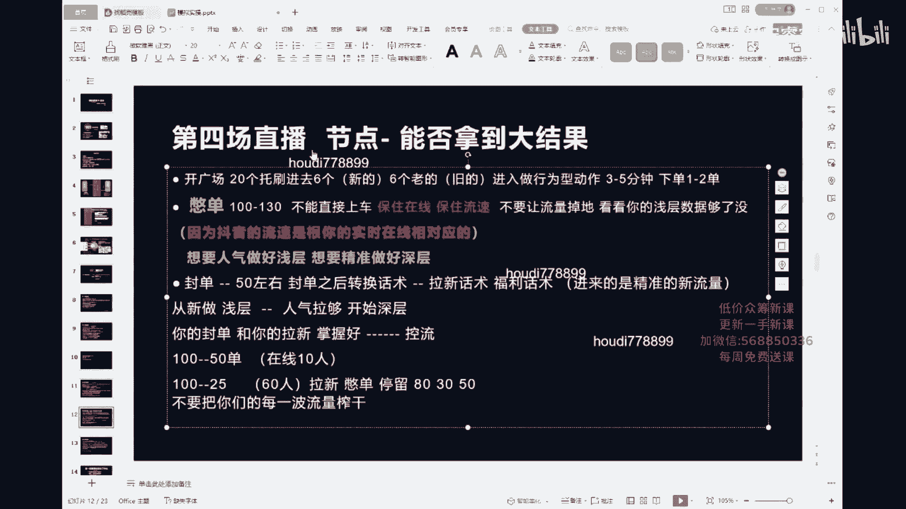

来我给你们画图好不好，好我们现在来看啊，两个罗盘，来100个人，100个人，同样的我拉到100个人，我拉到100个人，我现在放单了，放单了，这边一放单，逼单逼单逼单逼单逼单逼单逼到底。

我现在在线还有十个人，但是呢看好整个这个区间段，整个这个区间段，我陆陆续续陆陆续续我出了50单，那你们再看你们在看啊，这个时候这我到这个地方诶，我封单了，风干了就什么意思，就是我不卖了。

我把链接弄没了啊，你买不了了，我跟你说没有了没有了，到这了，流量到这了，那这个时候在线的节点，人气节点可能是60个人，在线的人气可能是60个人，那你们看啊，可能这一小段只卖了25单。

那你们告诉我后面的这个流量他怎么去播，十个人，后面的这个流量他怎么去播，是不是点对点直播，那我这个地方我怎么去播，我是不是可以拉进来二波，我就算拉不到100，我拉到80掉下来，掉到30。

我再拉到50再掉下来，是不是都可以，我这个是不是就已经叫做波段式流量了，他叫什么一波流，明不明白明不明白。

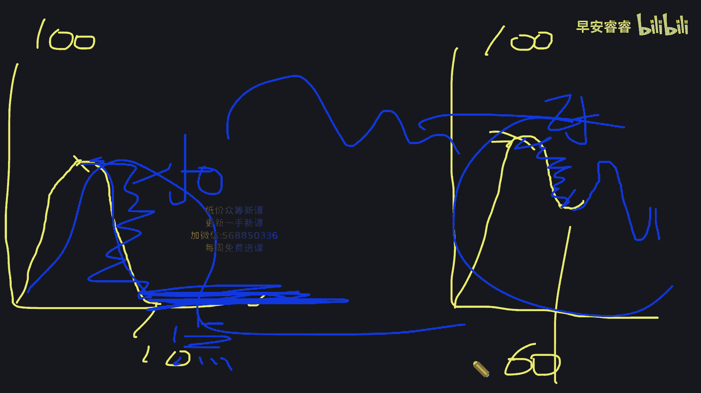

来我们继续往后看啊，所以封单之后听好了，封单之后马上去做拉新憋单的一个行为，你成交之后，你本身成交了，是不是我们后面的这个用户他本身更精准了，你成交之后的新用户的停留啊，因为成交之后进来的人他很精准。

那这个新用户的停留灯牌它比较好做，你就很快又可以从40个人，50个人，哪怕咱们真的拉不到100或者130，我都可以拉到80个人，这样的话我321上车，我把空单再次控好，我知道30个人。

我是不是我都可以再拉到50个人，我至少多了两到三炸，明白了是不是明白了，明白了就OK啊，然后你们再看，那我们再通过这30个人的流速，打个比方，我拉到了50个人，慢慢的你直播间的波段式的这个人气趋势图。

当他一出来，你想不想你的百人的直播间，你的流量趋势图也是波段式的，很舒服，一波一波给你这千人直播间，他一样也是一波一波，他不是那种一下子爆好大上去到后面凉，对不对，后面三个小时。

后面三个小时我都在那点对点，谁能点得了啊，来我们再看啊，我们再看，那这个时候我就说了，我说你们真的要按照我们的这种逻辑，按照我们的这个节奏去播，开播先去做浅层，先去做浅层，刚才我告诉大家了，对不对。

停留互动灯牌啊，然后你们再去做深层，再去做成交，明不明白，然后再去做深层，再去做你们的成交啊，这个就是整个的抖音的直播节奏，浅层深层浅层深层好不好，然后我跟你们讲一下，封单之后转换话术，转换到拉新话术。

快速插入浮力话术，这个你们转化的有多好，转化的有多快，亲爱的，我跟你们讲，这个就叫做控流，这个就叫做控流，抖音上，如果你能吃透百人的直播间，亲人的直播间马上就会来啊，立刻真的马上三场直播就来了，好不好。

所以我告诉你们，一定要在大流量来之前练好你们的能力，不要把每一波流量都榨干，知道吗，你要把犹犹豫豫的人封在直播间里面，不要让他走，然后再利用它带来的流量啊，再带来流速，这叫空留，老粉。

一定一定把这里吃透了好不好，比如说我现在已经呃卡单了，那我就紧接着快速来，已经没有了没有了，还有没有新来的，没准到这一波福利的，赶快扣个小一，报名运营统计，今天只有十单，我再看完这十单，我准备下播了。

我刚才都放了五单了，好不好，那我不懂了，其实此时此刻我的单没有封，我的单藏在了最下面，我不告诉你而已，为什么我要让刚才的那一拨人把款付完了，后台就要看着待支付订单去解决一下啊，我到底什么时候封单。

这是后台的事情，好不好，可以删掉链接啊，可以放到2号链接，看你们是什么账号，你们是千川的账号，你们是达人的账号，你们是小店主账号操作方法各不相同，去答疑课上问好不好，我说了，有问题去答疑课上问。

那来我们现在第五场了啊，第五场开广场之后，来一起刷进去八个进去八个，这个时候你们发现了吗，我我给你们讲信托是2468进的，发现了吗，啊我给你们养托讲养托是2468进的，是不是。

那如果说你是不是准备了十个怎么办，1234进一定要螺旋啊，1234进，然后我再强调一遍，如果你是新手团队的话，尽量托啊，可以弥补来弥补主播话术上的不足，知道吗，然后尤其是话术不好的时候。

它是能够保证我们的流量尽量精准的，如果你是真的，我跟你讲，你慢慢熟悉了，你慢慢的你懂得你慢慢的你懂得直播了，你是个老手了，但是我跟你讲，你那个时候你可以不用这个逻辑，因为你能点到明白人了，好不好好。

我们还是第五场开播，开广场了之后八个30秒左右加灯牌做互动，三到5分钟点击下单，一单两单都可以呃，呃新托去做浅层加深层，老托只做浅层，好不好，来一单两单啊，这个时候补单一单两单都可以看什么剧。

不一定要看你的在线，要看你的闯关，有没有可以补到我想要的那个签字上面去啊，来然后今天啊我再次强调一个事情，到第五场直播的时候，也就是说它是一个节点，它是一个节点，你们的账号一定会碰到这个节点。

200到230，这个时候新手不要着急，破260，会有很多的新手太着急做流量了，给他一波流量，真的把账号冲凉了，都我不知道你们在实操的人有没有遇到过啊，你们直播间拉起来1500个人。

你这一波成交跟你直播间200个人，这一波成交成交的单数是差不多的，来有没有有的，哪个有补完单，我不建议退啊，我不建议退，打过来在抖音上，我跟你们讲，有一个挺奇葩的状态的。

就说我直播间突然间一下来了1500号人，我这一波的成交，我这波的互动都跟我直播间200来号人，差不多对吧，那你拉那个流量有什么用啊，没有用啊，你新手你又控不住这个流量，对不对，你还把这个流量浪费了。

你还把数据整体都给我拉低了，对不对，所以新手不要着急去破260啊，我们在200到230，150，180，130，180这个节点上多炸上几天，一定要在这几个层级上反复去炸，多炸几天，慢慢的去螺旋。

我跟你讲，你记住了，你只你只要把200号人的直播间做好了，你的中单，你的空单都做好了，有一天你不想要流量，你开播直接上到1000，懂不懂，所以说新手不能着急破260啊，这个时候我跟你们讲。

别单B站200到230的时候，你们要注意什么点啊，我跟你们讲一下，你们要注意什么点，这个时候我们要注意的是叫做我们的成交密度，我们的密集成交，或者说你要注意你这个账号的啊密成交，你要在乎他什么。

我为什么一直要密集成交，我开始在乎他的什么东西了，我开始在乎他的什么东西了，宝们打出来了，然后我再问你们一下，如因为我刚才前面我一直在拉人，我一直在拉人，我人都已经拉到200，拉到230了，我光拉流量。

光拉流量，我是不是这个流量会让我的直播间越拉越烦，是不是这个时候你要用什么来修正，这个时候你要用什么来去做修正，上半期来记住这句话啊，记住这句话，你光拉流量，你前期起号的时候。

光拉你的流量是不是越拉越泛越泛，我们是不是越没有标签，我没有标签，我的成交是不是就不好，我的成交不好，我是不是标签更没有了，所以说这个时候我们要去做什么成交密度，我为的是我的标签。

我的成交为的是我的标签嗯，明白了没有，明白了没有，然后我们要慢慢去搭建我们这个账号的模型，不是说一场就能搭起来的啊，因为它需要注意的维度很多，尤其是当他上了两百两百三，上了260的时候，同样的直播间。

这个直播间100号人说话不违规诶，诶你拿过来200，200号人就违规了，200号人不违规，500号人违规了，明不明白明不明白，就是你们要真的想吃上四个菜啊，一定要找到一个就是1000人，2000人。

3000人都不违规的这么一套话术，去把话术做个整理，只有这套话术能让你吃上四个菜，好不好来，那我们继续啊，到了两百两百三这个节点的时候，我们注意什么，321上车了，上车之后我们一定要注意好好封单。

好好去做，反复确认能不能上车，能上车了之后，我们要注意封单控单控好了，假设我们100啊，我们在100~150，就是130~150，这个时候我们给他封了，首先我们是为了保证在线对吧，如果你成交的很好。

我又有在线，我有130~150的流速，又给了我一波成交的权重，我的真的流速加在一起，再加上我们的能力，我们是会迎来流量的下一波拐头的，而且下一波今天的这个人是很精准的，人明白，然后我们再看啊。

我们再看再去看成交密度，7分钟，15分钟把话术整理好，什么意思，7分钟一波上车，一波或者15分钟上车一波，这个东西要看你的客单价，你要自己去测，我跟你们讲没有固定，抖音上面没有任何一项是固定。

因为大家的品不一样，客单价不一样，受众人群年龄段不一样，明不明白，七到15分钟给大家上一波，那大概大概率的我们说7分钟，什么是7分钟呢，就我们第一个产品，我们的第一个就是我们的客单价比较低。

我们的性价比很好，那我们七到8分钟，我们999分钟来啊，我们大概上车一波，就是说我们的产品很好，然后呢如果说我的价值很高，我需要高人气的去做塑造的时候，我要塑造价值，放大价值的时候。

那这个时候我是不是就要用一些呃，比如说我卖1000块钱，卖2000块钱，但是我要洗，我要洗你20分钟，我要洗你18分钟，对不对，那你们看怎么去测来，现在拿笔记拿笔记后面的话很重要啊，同样的人气。

我是7分钟上好还是8分钟上好，同样的人气，我是7分钟上好还是8分钟上好，打个比方，我这一轮姐我姐妹儿，我洗到100号人，我放单了，掉下来五个嗯，好，然后呢，下一轮呢大家都差不多，我又去洗去了。

还是的还是的，但是我剩的人啊，呃我就成了五个，我下一轮可能到班上，我能成九个，就是说你此时此刻这个在这个分钟上，我在7分钟成交的比较好，还是在8分钟比较好，这个是要你们自己去测的，它需要你去测出来。

明白你要自己去测，你在某某一个时间段，比如说我180个人，我们88分钟上特别好，我们1000个人我们就14分钟上的比较好，我们3000个人我们就15分钟上比较好，你们就测这个测这个就叫成交密度。

明白来我们继续往后了啊，我们现在回归到我们讲课的时候，我一开始讲课的时候，跟你们说的一个逻辑好不好，哎呀我说了啊，我们在做账号的时候，我我们要做账号的思维，我们要清晰地知道每一场直播，我们是做的什么啊。

我们要知道每一场直播不是做了什么前五场啊，整个的前五场你都要记得，我们是为了不断的搭建，不断提升账号的广场排位的，这是第一个点，对不对，我要一直不断提升我账号的广场排位的，然后呢。

我要给我一个正价的客单模型，抖音上有没有正价的客单模型，记住起号不能低价起号啊，哪怕你是正在起号的，那低价产品都不能出单太多，因为出单太多，他是会把你的客单模型打乱的，明不明白他你出单太多，打个比。

我就这么跟你们讲，你天天薅九块九，薅19块九羊毛的人，你连49块九的东西你都犹豫的，你不买，你是从来没有买过100来块钱的东西，你觉得抖音会不会把一个卖两三百衣服的，直播间推给你，是不是不会。

或者说极少可能，对不对，这就是人群就人群包大数据的魅力啊，然后再加上我们人群画像的精准，再加上我们人群包你直播间的人群画像，男女地狱年龄，这些人在抖音上面第一喜欢看什么类目，第二喜欢看什么类目。

我们只要把这些搭建好了啊，某一天你想从260破到千人的时候，他会很稳很稳的泼上去，明白吗，他的第一波会很稳很稳的破上去，而且第一波他给你推的这种，第一喜欢和第二喜欢，就是我们所谓的这个正在浏览此类目。

直播间的人群类型的这种账号，会很多啊，会很多，然后呢权重我是不是在拉我的账号广场排位，把权重打上去，增加的客单模型，渣标签扎模型，渣标签扎模型，到最后我只有最重要的一个点，要提示你们叫做不违规。

叫做不违规，你搭建好的一切，你一场违规，一切白费，明不明白，所以要把违规划术剔出来啊，所以你们要把违规的话是剔出来来，我们继续往后看，我们来看第六场直播，第六场直播是我们的生死局，为什么叫生死局。

如果你的前五场直播做得很好，你到了第六场，一开广场，你可能轻轻一别单，直接1000人，3000人，有的时候甚至5000人，8000个人都有可能，因为这个时候我们的直播间会迎来什么东西啊，会迎来泛流量。

如果已经违规了，重新去螺旋，好好慢慢播啊，重新选起来，这个时候他考验你的，是你主播的话术的团队配合，然后不怕我跟你们讲，不怕，如果你的账号模型搭建好了，记住啊，你只要前五场按照我说的来。

你理解错我的意思，你按照我说的一步一步的来，你只要把这个搭建好了，直播间的泛流，其实在你直播间这个的泛流量它其实并不犯，为什么，因为你前五场搭建好了，他这个流量，它是按照你之前就是你推给抖音人群。

包大脑的一个第一波的种子流量，除了第一喜欢，第二喜欢之外，他会给你推你直播间的人群画像，他是按照猜你喜欢给你推的，对不对，男女地域年龄，他是按照这三个板块给你推的，他感觉这些用户啊，这都叫猜用户喜欢。

他觉得你能更好地成交，他，你能更好的把它的浅层数据做出来啊，他是按照这三种，这些人是按照猜你喜欢推进来的，那这些人听好了，因为它不是正在浏览此类目，他们不是刚虚岁，这个时候你的话术很重要。

你要让它产生冲动消费，这个时候要靠什么，要靠团队配合，懂吗，那这个时候我们到了这个流量，1000个人，3000个人，这个流量我们开播一下，上来了啊，上来的时候要干什么，一定要注意一个点，叫做洗流量。

反复的去洗流量，明不明白，然后用什么样的话术结构去洗，一会儿我给你们去讲用什么样的画结构去洗，我讲啊，然后这个时候你看我的流量乒乒乓乓的上来了，对不对，我们用话术去洗，我们在作品的时候。

假设来假设我们的直播间现在800个人，600个人，我开播一千一千人到3000人啊，我第一波来回的问，反复的确认，然后他到了800人和600人，这是第一波，然后呢我说了，我们不能靠感觉来上车。

我一直在反复的问他们互动确不确定，要能不能给好的评价，最后统计一轮颜色和尺码好不好，确定要的打一个上车，我一直在用这样的话术去做统计，我一直在用这样的话去做统计，都统计好了之后。

我发现我的互动给不够八百六百个人，我在直播间只能拉出30个，40个，50个互动，这样的时候能不能上，不能上，对不对，如果你八百六百个人，你能拉出150个互动，你能拿出来160个互动。

180个互动你随便上，你放心大胆去炸啊，那如果说我只能拉出来三十四十个，50个互动呢，那我们再稳一稳来，我们继续回到画图上。

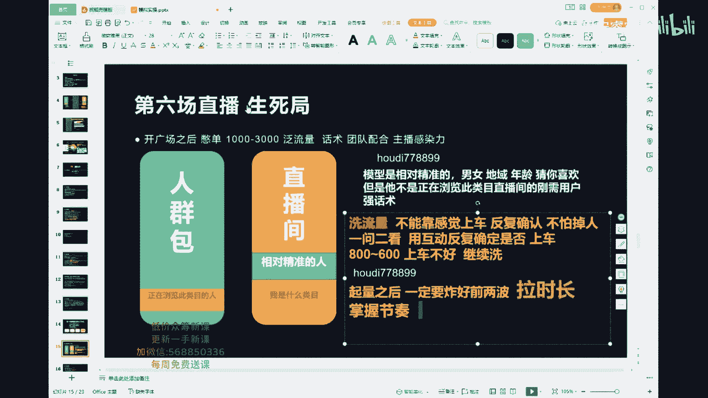

我接着给你们画图啊，我们继续来画这个流量曲线的图，看流量的线，打个比方，今天一下子到了3000人，我拉上去的啊，我拉了我的急速流到了3000人，我到这个地方，我洗到了800，我现在我在合计我能不能上。

但是你要去看去看什么，去看你的互动强度，如果他此时此刻互动的并不好，他只有30个人，40个人，50个人，那我们就不上这块，就证明他不能上，不要贪人气，继续往下洗，好好的洗，打个比方，我就算洗到了400。

洗到了400或者500，那这个时候你看如果，再穿互动，如果我的互动有了80个，有了90个，我翻了一倍，来看一倍，一倍呀，看到吗，那你们告诉我这个时候能不能上，这个时候我们能不能上了，可以了，对不对。

好这个就是你上车的节奏，明白吗，这个就是你上车的节奏，互动在公屏看星星互动，在公屏看，然后你们听好了，你直播间一起亮起了人气之后，给我炸好前两波啊，老粉听好这句话，老粉给我听好，这句话很重要。

一旦你的直播间起亮了之后，今天前两波炸好了啊，今天这前两波一定炸好了，然后如果说你今天我在后面，我炸好了之后，到后面他突然给我报了一波大的流量，那这个时候我告诉你们要干嘛，三个字记下来，拉时长。

好不好拉时长，前两波炸好了之后，哪怕你开播峰值8000都好，你拉了你后面拉了五个小时的时长是五个小时，这五个小时我们一直从波段式的互动开始炸的，打个比方，我从8000个人啊，不到3000炸。

你们宁可就是给我炸成这个样子的流量，最后掉到底，我拉了五个小时，我最后再到40个人了，我的峰值最后到了40个人了，他都不会影响你明天开播，明不明白，互动可以看，互动就在公屏，互动就在公屏上看。

然后你的后台你让他们打什么字的时候，你的公屏在你的后台上的时候会有显示，比如说上车，乘以256×80，明白吗，可以看啊，可以看这个要这个要你们实操了之后，实操了之后好不好，所以我跟你讲。

你哪怕今天给我播成这个样子的流量曲线，黄线都没有任何的问题，先去实操啊，先去实操好不好，你们现在问的问题就是那种想象中的问题了，我知道大家可能小白一点。

所以大家先去实操啊，不怕的，来，我们继续，我们继续了啊，第七场了，我们继续了第七场了，嗯我没看天下好，第七场直播开播，首先我们前面的五场，首先我们前面的五场都播的很好了，对不对，都播的很好了。

什么时候拉时长，如果你今天直播间起亮了，你直播间的流量特别大，你要拉时长，你要拉时长好不好，不是说什么时候都拉时长的，啊明不明白来，然后我再给你们讲一下啊，我再给你们讲一下，我们继续往后走，玩单品啊。

先玩单品，直播间全起来了之后再说啊，单品都打不明白的，先不要去过款啊，这些问题，你们到时候答疑课的时候去问大鹏老师好吗，答疑课的时候去问大鹏或者阿南老师啊，第七场直播来我们看一下，只要你开播极速流给你。

你只要每天你不违规，你把前面的那那点儿都给我做好了，只要你不违规，小店不掉分，听好了，你一天只播一场，你定时定点播，我今天03：01分开播，明天必须03：01分开播，保持好状态，保持好状态。

把急速流接好了，到后面一天就播一场，一天就播一场就很稳了，明不明白，到第七场之后，他真的就很稳了啊，来我们有问题去答疑课上去问啊，有问题去答疑课上去问，来我们现在下面我们先讲话数，我们先来讲话术。

因为呃我要赶快把话术给你们过了啊，来我给你们过话术了啊，嗯现在这个样子，我问你们一下，有没有第一次听实操的，就是我刚才讲的整个的模拟实操，你听着有点懵的，有没有，我跟你们讲，如果说你听的有点懵。

你一定要多听，16003堂课，三个老师的课，我们都是真人，老师在这上课，反反复复的给你们上课，你们会发现我这一堂课讲的就更偏小白一点，老粉们是不是是不是老粉们，我这一堂课讲的就更偏小白一点。

我的上一堂课就更深一点，来老粉告诉告诉新来的是不是，我的上一堂课讲的就更深一点，所以我一定是我一定是更换着去给你们讲课的，明白吗，这就是为什么我们一定要真人老师来上课，三堂课。

4月6号的时候是大婷老师的课啊，影响流量的因素，然后还有侯毅老师的课啊，侯毅老师的课一定要去听，然后我们现在来听话术，我们现在来听话术啊，首先我们先说一下话术怎么去找，去带货榜找，去带货榜找能上带货榜。

他的话术一定是OK的，明白吗，那只是说只是说什么，在此时此刻这句话你没有用到节点上，你不应该在此时此刻，此阶段说这段话，明不明白，好来宝贝们，先把我现在的整个的话术框架我们先拿下来，首先第一个啊。

首先第一个我们的憋单话术，我们的憋单话术，每一个话术你都要知道我的目的是什么，好不好，你每一天写了话术，测出来一套适合这个直播间的话术，因为你来抖音啊，你不是来天天改话术的，你是来卖货的。

带货榜上的花束，觉得好的，留下来，觉得这句话我在什么样的时间节点上能用上，你把它留下来，如果说不好的，你觉得他不适合我的，咱们就不要了，多去摘，明不明白，多去摘啊，然后我跟你们讲话术。

主播一定要自己去写，一定要自己去写，你只有自己写，你才能知道这句话我想表达的意思是什么，那这句话我能不能在现在这个时间点去说，不要让别人去给你写话术啊，好那我们来看我问你我我我这么问你们一下吧。

你们觉得其实主播啊，抖音的主播我们在做的是不是其实就是销售，我们在直播间，我们通过直播间这种媒介来销售，我们把产品售给客户，他是有一套底层的框架的，对不对，你们之前有没有干过销售的，干过销售的。

它是一定有化石框架的，比如说电话销售对吧，比如说是干会销的，它都是有话术框架的，所以我们也一样啊，包括之前做淘系的主播，是不是我跟你讲，播播淘系的主播，现在播那个抖音都播的迷迷糊糊的，为什么。

因为抖音它还有自己的一套算法的逻辑，你说的这句话要符合抖音的推流逻辑，而且抖音上面真的从有了抖音之后，才有了这样的一个名词，叫做运营型主播，在其他的平台运营就是运营主播，就是主播在抖音上面才出来了。

这个叫做运营型主播，为什么它叫做运营型主播，懂数据对吧，本身就是抖音上的一个难点，然后主播要说符合平台推流逻辑的话术，还要说符合抖音体量之后，人群犯了之后的话术，对不对，我前期我要说浅层的话术。

我后期我要去说洗人的话术，就是这个样子的，所以我告诉你们，抖音上面啊是不能有一句废话的，我再次告诉你一遍，抖音上面是不能有一句废话的，当这个用户刷到你的直播间三秒钟，基本上他就能决定。

他到底要不要留在你的直播间，当你的话里面有废话，这句话你不清晰你的目的是什么的时候，这句话就叫做废话，每一句话都要带着目的，清晰的知道我这一句话的目的是什么，然后达到我的目的才能做得好。

清晰的知道自己的目的好不好，达到你的目的啊，那我们来看第一个板块的憋单话术，我们为什么别的话说我们为的是人气，对不对，假设我们通过前面的十套把广场排位拉起来了，我们通过别单话术啊。

我们刚才讲的那个三要素，还记不记得第一个场景，第二个套路演戏，第三个话术的福利，对不对，那场景其他两个我讲不了，我们就讲话术的福利好不好，那我们来看啊，那我们来看什么叫做憋单话术，好来看这里接单。

怎么样才能把这个人留在你的直播间，第一个一定是不确定性，也就是说他不知道你什么时间放单，他不知道你今天放多少钱，他只知道你今天是一个福利，他总觉得诶我好像今天我捡了一个大便宜，不确定性和期待感。

我跟你讲这两个点很重要，如果说你现在就像我今天讲课一样，我给我给你们举个例子，就像我今天讲课一样，如果我今天上课啊，我跟我跟大家说，我说嗯这样的吧，我十点钟的时候给大家开始讲话术啊，老粉你们想听话术的。

你们十点钟是不是老粉十点才会过来，是不是十点老粉才会过来，就老粉已经很确定了，我十点会讲话术，所以如果在直播间我跟他讲，我说姐姐们，我说我十点给你们上一波新好吧，我现在呢过一过之前的款式。

十点我给你们上一波新，他是不是这个老粉，如果他真的想要你们家的新款，他真的想买你的衣服，那OK他十点才回来，或那他是不是就没有留在你的直播间，他在你直播间就没有停留，他就没有办法给你互动。

他也没有办法给你后续的一切，比如说灯牌，比如说点击，那好我们继续在，我们再往再往我们倒回来推，如果说我跟着老粉说，我是老粉，今天一定蹲好我的直播间啊，我告诉你们，我今天不定时的给你们刷新款。

而且今天新款全都是宝贝出厂价，直接让你们带回家的，今天仅此一天，因为新款刚刚上新，我真的我分钱不赚，你们赚回去，但是呃因为那个什么啊，我也掌握不好时间，所以可能不知道什么时候我就上了。

随机上蹲好了好不好，那他会不会一直待在我的直播间，你们告诉我这两种花束不一样的感觉，这就是不确定性和期待感，明白，明不明白，当我知道什么时间可以得到的时候，我会到了那个时间再来拿，拿到了离开。

我是没有随机感的，然后给你们句歌词啊，得不到的永远在骚动，这个很有用啊，这个很有用，好好去听好不好，然后我们整个的毕业单的一个框架，它是需要什么，他需要什么啊，我的目的就是要互动给期待感，憋什么。

憋人气的节点，人气的节点，这就是我的憋单话术，整个的目的，你要找到你的目的，明不明白，然后我们再看这个我们的竖屏挖树，你如果说只是讲明白的话啊，素品花束，你如果只是想把这个屏讲明白。

姐姐我这个衣服是黑色的，上面带了一个啊金属的一个印花，然后拉链都是YKK的，那里是做了一个毛毛巾的，什么圈圈棉的，这个东西是让用户觉得没有价值的，什么叫做放大价值是你要让用户觉得很便宜。

那在直播间最直观的是什么东西，对比背书，你有没有实物和实物之间的对比，你的话术，是不是可以用东西跟东西之间的去做对比，对不对，质量我可以去做对比，这是我的作品话术，然后塑品话术上这个板块我跟你们讲。

放大价值一定是要去做的，那我们来看放大价值的点在哪里，来，我们从哪里可以放大放大价值，首先产品的细节怎么样去体现产品的细节，找到你真的我觉得我这个细节就是不错，我用镜头去放大，把它怼到镜头前面去。

然后来姐姐，你不用别的，你看一下我们家的这个细节啊，整个领口袖口全部给你们做的是320的包，包条的针织走线啊，这样的工艺穿出去就是高档啊，就那个什么呃，G家的驴家的都用的是这样子的啊，高端大牌才会用到。

而因为我们家是高端车床做出来的，用一个小的细节去博大的价值，明白没有好，那这个是不是可以，然后整个制作过程的对比，比如说我们家都是纯手工的啊，我们家都是手工工艺做出来的，姐姐我跟你们讲。

现在真的金不贵银不贵，手工最贵啊，或者到后面你可以讲，你说我们的我们的车床啊，我们的车床进口回来就要300万，现在你看到的这种凸起来，这种牙刷绣，它不是普通的那种小的，二三十万的车床能做出来的。

明不明白明不明白，就这个样子啊，然后呢话术素品话术，你要找到你的这个产品的两到三个细节去放大，两到三个细节去放大，这个细节一定是你觉得很牛的细节，能让用户产生画面感的细节，明白了吗。

这两到三个细节一定是你的绝对性的，卖点的细节，来我们再回来看啊，我再回来看，我们回来先看这个点，我们下回来再看这个点，什么叫做共同认知，那我刚才说了，放大价值的时候，价值是怎么来的。

宝贝们价值是对比来的，那只有对比才有价值，对不对，那对比你拿什么东西，跟现在我卖的这个东西去做对比，这个是有讲究的，你要找到和你卖的这个东西的群体，有共同认知的一个东西去做对比。

从而抬高你现在卖的这个产品的价格，打个比方，如果我现在要卖红酒，我问你们一下，如果我现在要卖红酒，我跟你们讲，我说姐姐们，我们家呢都是法国波尔多，哪一个哪一个什么酒庄都是精品的啊，都是很小众的。

包括你看啊呃那个那个哪哪一个什么牌子的酒，什么什么坨，什么鸟啊，什么那样子的啊，能不能呃这这个酒都是在我们家生产的啊，这个什么鸟都要700块钱一瓶，你们知道这是什么鸟吗，你们不知道。

那红酒你们觉得什么东西跟顾客有共同认知，什么东西跟顾客有共同认知，红酒回答我一下，200来号人都睡了，你们好不活跃，今天，你们好不活跃啊，对红酒去找共同认知，拉菲就是共同认知跟我卖的这个用户群体嗯。

全世界人都知道，对不对，全世界人都知道红酒拉菲，红酒就拉黑这个东西就叫做共同认知，明白了吧好，那我们继续往后看，你要找到两到三个产品的细节去放大这个细节，我告诉你再给你们举个例子。

叫做你有别人家没有的点，好好去找啊，好好去找，然后来我们看一下，我给你们小白啊，小白听一段话术好不好，小白听一段话术来直播间，3000个姐妹啊，你们可以看一下主播身上的这一款衣服。

是衣服上面一共四颗扣子，这个扣子大家可能没有听说过，这个扣子它叫做马来扣啊，这颗扣子是我们老师傅真的专门跑了一趟日本，每一颗他都是精挑细选回来的，我跟你们讲，可能直播间的你们不知道什么叫做马来扣。

但是你们知道钻石吗，一颗红就选那个啊，你们知道吗，对知道哪个三好不好，我跟你们讲，我的这个扣子它比钻石的那个硬度它只弱，那么0。01这个扣子造价，平时我跟你讲15块钱，一个四个扣子就要60块钱。

那今天我跟你讲，我开的价格，可能大家平时四颗扣子都买不到，为什么，因为今天我不为别的，我就是想给大家做个品宣啊，让大家真的穿过高货的姐妹来品鉴品鉴，我们家的高货好不好，而且高货我跟你讲。

就是把细节拉满的，不是嘴巴说的，来直播间看一下我们家的整个的这个品啊，首先我们的袖口给你们做的全部都是高脂高密，真的你上滑500个，下滑500个，你去翻一翻，大家都在说是高脂高密，什么叫做高脂高密啊。

我们首先我们整个的内里线全部用的是蚕丝线，而且蚕丝线的维度是0。01mm，普通线的维度是0。1mm，而且蚕丝线我跟你讲它更贵，它是蚕丝好不好，所以说我跟你讲，我们才能真正的做到高职高密。

而且才能线它是带有韧性的，它是普通线的100倍啊，14寸13针，高脂高高脂高密的走线宝贝，我告诉你这种走线YYDS啊，好不好，来再给你们看一下我们这里面的内衬啊，我们里面的内衬用的是一个什么样的内衬。

什么样的内衬，什么样的内衬，就是这个样子的啊，那你看我用了什么，我用了扣子，我用了我袖口，我用了我的内衬，这就是我三个我最想体体体现出来的卖点，这就是我三个我最想体现出来的卖点，明白了没有。

然后呢我们再来看啊，我们再来往后看到后面，到后面啊，场景画出了，这好好听啊，这好好听了，那我刚才是不是说素品，你要想办法把它找到一个点代入进去，找到一个点代入进去，那我我们把它带进去啊，打个比方。

还是我之前打的品行李箱场景话术，行李箱能在什么样的场景上去使用，机场对不对，能在机场去做使用场景和痛点是不能分开的，亲爱的们，场景和痛点不分开，在某一个固定的场景下，有这样的痛点好不好。

然后你看那这个痛点是什么，痛点一定是普通的箱子存在的问题啊，存在的问题，比如说它的质量不好，一摔就炸开了，好那我们来看我的卖点是我的我的PC啊，比如说我的这个PC，我的塑料是特别好的PC。

然后加上我的拉链都是很好的拉链，然后场景在机场痛点是它炸开了，我想宣传的卖点是什么，是质量，对不对，我想宣传的卖点是质量，那我们可以又可以开始了啊，又可以开始了，来那个我问一下有没有在机场见过啊。

就是行李箱因为暴力托运直接原地炸开的，有没有来，有的给我打个有，我跟你们讲真的啊，我在机场遇到过一回，咱不说别的，炸开了之后，那个内衣内裤袜子鞋子撒一地，你尴不尴尬，今年咱再要赶上个本命年，撒一地红。

我的天要我这个箱子我不要了啊，姐姐，但是你看好我们家的这一款，整个外壳做的是德国拜耳的进口PC这种PC啊，它不是咱们那里的那种，就是破塑料做的，就是塑料瓶子，破塑料做的啊，这叫德国进口的拜耳PC。

而且再看一下我们家那拉链，整个双齿轮内扣拉链，你就算从石头把它拽下来都不会裂，不会炸开，放心拍就可以了，好不好，诶，我是不是有卖点，有痛点，有场景话术，而且我有没有把你们带入进去。

我有没有把你们带入进去，我刚才在说我说那个本命年的时候，撒一地红的时候，你们有没有那个场景感，你们是不是脑袋里面瞬间就有了那个画面，你们就觉得很想笑，很好玩，对不对，这才叫场景的代入感，好。

那我们继续来找，我们继续来找，那你看啊，首先我们是不是要找到我想卖的这个品的人群，我们还是去找行李箱，我们还是去找行李箱，打个比方，打个比方，我们倒着去找，我们一样可以找得到我，行李箱的卖点是轮子。

我行李箱的卖点是轮子，那我的人群一定是大人群，听好了，一定是大人群，然后看好我，为什么要在这个地方放一个人性，拿捏人性话术，没事往里放一放，什么样的人可能会在乎行李箱的轮子，那我们如果要往人性上面走。

爱面子怕丢人的，对不对，好我们要把这个点给他打明白，我们继续往后走，我们继续往后走，这是人群场景，在哪里，场景可以在机场场景可以在机场对吧，就这一个场景或者是在火车站都无所谓，没有问题啊。

然后痛点它的轮子不好，要么箱子还在，轮子没了，是不是啊，箱子还在轮子没了，要不然就是嘎啦嘎啦响，咔咔响好，那我找到了，我现在是不是找到了，那我的卖点本身就是我的轮子，那我们在那我们再来一遍啊。

比如找到这个人群，我来啊，我说那个有请你们最近要出差的啊，最近要出差，最近要出去旅行的，真的，赶快把你们家里面，那个两三年前的大黑破行李箱扔掉，尤其是摔的，已经开始带着行李箱，嘎啦嘎啦满打响的啦。

装好东西拎在车站里面，人家走路静得像风一样，你盯上他，真的唉，这句话很好像开个拖拉机一样，对不对，迎面走来一个美女，你走在他对面，人家从你身边静静飘过，你在人身边咔啦咔啦响着过去，对不对。

显得就是个low，你再看好我们家的这个整个的轮子，全部采用的是德国进口的八轴承，内里八个钢珠全部内环旋转，就算我告诉你，你走在水泥地那种咯楞楞的路上，它都是很平滑很顺的，是不是我的卖点也有了我的痛点。

有了我的长点，也有了我的人性也有，什么都有了，所以一定是什么，一定是找到你的人群，然后呢我们也可以找人群啊，我们也可以从人群开始找来，你看我刚才是先找的什么，这个是先找的痛点，对不对，质量是一个痛点。

轮子我找的是卖点，那我们可以先找人群人群，我们可以这回先找一个，打个比方嗯，上学的，好这是人群，对不对，带着你们走了啊，人上学的，然后往后走，人群之后我们需要找什么了，上学的他需要什么卖点。

上学之后他需要什么卖点，好容量，那我的容量就是我的卖点，那痛点是什么，痛点是什么痛点，可能还是质量容量不够，对不对，那这个时候，容量不够是不是啊，然后场景话术一样的机场，对不对。

机场加或者是火车站都可以，对不对，都可以啊，来那我们再看，那就马有没有9月份马上就要上大学的学子啊，第一次入大学校门的，有没有有的来给我打个友，好不好，来运营，我统计一下。

今天呢呃这些未来的真的栋梁们好不好，在我直播间啊，我让你们拿一个大福利回去，这算是主播的一点小私心吧，好不充栋梁的啊，来看一下我，我这么跟你们说吧，就是我当年上学的时候啊。

真的我妈恨不得把半个家都给我装走，真的我那个我那个行李箱，在车站直接原地就炸开了，我就拎了一下，直接原地炸开，就他带的东西太多了，但是每一份都是妈妈的爱，所以今天啊我们很贴心的给大家准备了，34寸。

36寸，38寸大尺寸的行李箱啊，容积量绝对的够，包括质量，我刚才说过，我们家是德国拜耳PC的，你从十楼扔下去都没有任何的问题，放心去用这一个行李箱，跟你4年跟你5年没有任何问题。

4年大学一个行李箱直接搞定，又好看又帅气，而且咱还省钱了，你看其实我一直在跟你们说话的时候，我在说的是什么样的话术，我有在说主播的那种套圈的话术吗，我有在说那种姐姐，你看好我们家是德国拜耳PC。

我们家的这个行李箱怎么怎么样，我们家的这个轮子都是德国进口八轴承，走在路上他都是不想的啊，拎起来都是丝滑顺滑的感觉，其实我是聊天室的，我就是在跟你们，你们觉得这样子更亲切，对不对，是的。

所以我希望大家作为一个主播，你们能学会你们能学会这样的点啊，能学会这样的点，然后所以我跟你们讲，一定要在你的场景话术，在你的人性话术上面下功夫，好不好，好好的下功夫，然后去写去写啊，然后我们继续往后看。

来把这个把这个记一下，把这个记一下，逼单话术我们从头过一遍，福利留人一定是没有不爱占便宜的人，点对点是为了做浅层的数据，做停留，做互动，做关注，做灯牌，我告诉你点对点是因为我有什么目的。

但是我不能让你看出来我有目的说话的艺术，然后再用我刚才给你们讲的，憋单的不确定性和期待感，拉出3~4波的互动，让用户觉得与我有关，喊住他好不好，然后中间不要忘记告诉人家，你是谁，你在干嘛。

不要忘记人家告诉你，你是谁，你今天来这干什么，来了，我今天来做福利的，对不对，我拿什么东西做福利了，这都是你是谁，你在干嘛啊，然后塑品话术这个地方我不讲了，平台这个地方对比可以对比价格。

比如说你看我们家的销量啊，多少多少的销量，姐姐我跟你讲，这么多人都选择了我们家，你选择是没有错误的，然后再给他看看好评，姐妹来看一下我们家的好评，好自己去看一看啊，来看好我们家都是带有什么什么资质。

什么什么资质，什么什么资质的，你拿回去之后，你放心去用就可以了啊，因为我们都是有什么保证的，拿回去，包括你有没有什么官方的背书，外在的比较，就是比如说包装材料，看好姐妹，今天整个的这一件衣服。

都给你们配了一个精美的礼盒，那里都是带着衣服挂和一个防尘袋的，拿回去了之后，防尘袋一拆，直接带着衣服挂，可以挂到我们的衣柜里面，衣服挂都给你弄得好的，这样的礼盒很精致，哪有去算。

送人的话也都是很有面子的，我用这样的话术是不是更好，对不对，然后我们再往下看啊，我们再往下看，这个时候中间的人性，话说我给大家几个点啊，首先你要找什么找共鸣，你看我刚才一直在跟你们找什么找共鸣。

我说我说我说有没有马上要上大学的，我说哎我说真的，我说我上大学那年，哎，我说我妈真的恨不得把半个家都给我装装走，我在干什么，我在找共鸣，我在找我跟客户之间的共同话题，能不能懂这个点，能不能懂这个点。

大家能懂得给我扣个一，能懂得给我扣个一好，OK然后包括你看啊，如果她做了女人的，比如她现在已经有孩子，她是宝妈的，我们可以聊聊爱心，聊聊小孩子，对不对，你真的就像家里面用的一些东西啊。

你一定要站在妈妈的角度上面去考虑，然后包括你的爱心，包括可能做做人不容易的这7年之痒，这些这些都是这些都是人性化水的面，然后如果她是个女孩子的，听好，如果她是女孩子的，他在爱美的这个阶段，他还小。

你们可以从人性的阴暗面去挖他的人性话术，比如说爱美，比如说虚荣，比如说攀比，人性的这种阴暗面，明白吗，如果你把一个女孩子的攀比心勾起来，你告诉我她今天还会不买吗，如果你把一个女孩子的虚荣心勾起来。

你觉得她今天还会不买吗，你们要学会设计话术，姐妹，我跟你讲，真的马上快到年会了啊，荀子提前背起来啊，不要等到当天了，人家都穿得美美的，你穿着还跟平常没有任何的区别，明不明白，就是这个意思啊，还在直播呀。

我说了，我们都是老师真人上课的啊，然后最后我们的男人处在一个人生，什么样的阶段，什么样的情怀，比如说他是20多岁，他喜欢什么，他在30多岁，他是不是有家庭了，他是不是有压力了，他40多岁的时候。

他需要他可能需要理解，他需要安静，他需要自己的一方就是净土吧，可以这样讲，对不对，他很累，他承承受着家庭啊，四五十岁的姐姐们当然也要爱美，也要虚荣，也要攀比啊，女人到80岁都会攀比的，而且然后我们再看。

最后我告诉你们，一定是代入感和场景话术，一定是代入感和场景话术，如果是四五十岁的姐姐，这句话很好说啊，你说真的不用不用别的，我妈真的要跟姐妹们出去吃个饭，今天同事聚个餐，回家倒腾，洗澡就得洗俩小时对吧。

就是这个概念啊，就是这个概念，然后我们再看这个东西，打消过过滤，打消用户顾虑，就是保障话术，其实我们前面的话术已经几个话术框架，是不是都给你们了，该给的都给了，最后就差一点叫做保障话术。

保障话术是我们最后真的顾客走到最后，临门一脚的让他真的去购买的，打消他心里顾虑的那个话术了，这个话术一定要无限的去做放大，我再说一遍，保障话术无限去做放大啊，来今天我说了，我直播间3000个姐妹啊。

今天专柜四位数的价格，我一次开头小三位数直接给你们炸了，但是只有200单啊，可能今天做不到人手一单了，因为姐姐们，我也我也有厂家，我也有100多个工人要养活，对不对，而且我说了，我今天是亏钱的。

但是我不能亏得太狠，大家真的，我知道今年生意都难做，对不对，你们也不为难，我只有200单，你们一会儿呢拼手速，拼一下网速啊，来我看到一个姐妹，她刚才在公屏上说，我这款衣服一字开头三位数贵了。

这样的姐妹们，如果你们感觉我的这件衣服贵了，你们给我打个柜子，你们感觉不贵，你们给我打个不贵，因为我身上的这一款衣服，我跟你讲，你现在只能看到你根本体验不到，对不对，我现在在直播间。

我说的天花乱坠的没有用，我相信我真的我看到很多姐打不过，首先我感谢你们姐姐，我真的你们在直播间，你们相信我啊，我会让你们得到真金白银的反馈，来刚才的连接这个样子，我们再往下调30块钱。

这30块钱是因为这三个给我打了不贵的姐姐，我感谢你们的信任，好我看到有人打跪了姐妹，我你只可能是第一次来到我的直播间，因为你喜欢我直播间的气氛，我就是这种聊天的直播间主播，就是这个态度的啊。

或者说你本身就喜欢这款产品啊，你喜欢的你打个喜欢，我希望我一会开出的价格，你是因为喜欢而拍，不是因为我一会儿开的价格而拍的，真的大家都不傻，什么叫做有价值的东西啊，我们拿回去穿这件衣服，我能穿一个月。

我能穿两个月，我喜欢它，它就有价值，它值今天这100多块钱我买回去，我穿一回，它破了，它烂了，它不值这个价钱，他就像块抹布，所以我跟你讲，你今天穿一次，你穿100次，这才叫商品价值。

而且今天你喜欢我身上这件衣服，我跟你讲一会儿我开出的价格，你放心大胆去拍好不好，为什么为什么好，这个时候我要开始打消顾虑的话术了，所有人听好了啊，因为你拍回去，姐姐们，你现在这个样子，你先穿个七天。

这七天你先穿出去，你出去炸街去好不好，哪怕你给我哪儿刮花，或者是你挖个小洞了，没有关系，或者说你体验感不好了，哪怕你说哎我姐夫说了，这个衣服不好看，没有关系，你把它给我拿回来啊，你放心就行了。

姐姐有运费险的啊，我感谢你的信任，今天啊你给我一次服务，你的机会你让我来买一次单，好不好，来废话不多说，200单，真正拼你们的手速，拼你们的网速，就是这个样子，就是这个样子啊，不会的，打问号。

如果真退了呢，如果真退了呢，七天无理由运费险是你们一定要挂的，我刚才说了七天的时间，你拿出去先去炸街，你前期起号的阶段，前期在起号的阶段，这样子的话术是一定要去用的，保障话术，如果你不想用这样的话术。

完全可以，姐姐们今天听好了，这件衣服拿回去先去试一试，搭着你衣柜里面的衣服去试啊，穿好穿不好了，没有关系，如果你觉得不合适，不喜欢，颜色不好看，没有关系，一个字退，放心就行了，好不好。

我们家有运费险的啊，这样子画是不是也可以啊，没有人会那个那个火火之高兴，你可以就是我们我带了两年多的货了啊，这种话术一直都在用，但是会人人少啊，这种人特别的少，如果你衣服的质量真的好很少，你相信我。

但是这样的话术它会促进你很多的成交，宝贝明白了吗，好那你看其实我刚才说话的时候，我是不是慢慢悠悠的，我是不是一直都在跟大家很真诚的说，我说姐姐你拿过去你试试去，是不是你搭上你衣柜里的衣服。

搭搭你的裤子啊，能不能配不能配，没关系，你一个字退，你喜欢女人，喜欢她就买，是不是现在都啥社会了啊，给自己该花得花点了，真愁打消用户顾虑的话术，一定要真诚记，一定记住今天我的语气语态明不明白。

一定记住我的语气语态，打消顾虑，话术不允许上框架，再次说一遍，打消用户顾虑的话术不允许啊，有运费险，我今天说了，运费险系统弹窗了两次，好摩卡月月一定是你的运费险形成了前因后果，去找去找你的。

去找你的导师啊，去找你的导师来，我们来到B单的环节，那我们最后了啊，最后了好不好，今天知识点太多了啊，每一天都多，每一堂课的知识点都多，所以真的你们觉得这1600值不值，真的我想问问你们。

你们觉得这1600值不值，值得打个折，真的1600，三个老师真人在这上课，一上课就上将近两个半小时，将近三个小时，还有运营给你们去复盘好不好，所以大家真的好好学啊，好好学习，去年刷到就好了，没有关系的。

今年一样的啊，今年一样的，然后来我们最后来到B单的环节，好不好，感觉琪琪老师家底子都透出来了，琪琪老师才给你们透了30%吧，呵琪琪老师他给你们透露30%吧，来我们继续来看啊，占便宜，开价逼单的话。

术开价逼单，我们到最后就已经开价来，倒计时五秒钟，直接准备上车了，好不好，54321上车了，一上车之后，首先你要干什么，你要干什么，首先你还是要去强调你今天的福利是什么，我今天是不是有什么白给的赠品。

明不明白你还是要去强调福利，为什么，因为你放单的时候是不是同步，还是有进来的新人，你的流速是没有停的，你是我进来的新人的，那我说的话是不是说给新人听的，我的这句话是说给新人听的，而且我已经开单了。

对不对，然后这个时候我告诉你们，抓住那两到三个细节的点，再次去升华一下细节，来姐妹，我说了，今天价值1299的，不用别的袖口折，给你们做的是蚕丝的一个包边走线啊，17寸的包边走线，你们自己看扣子。

三颗扣子，每一颗扣子价值15的，你们今天好好去回去看一看，好塑造高价值，这个是一定一定的，在开价了之后塑造高价值，然后把细节升华上去，把细节升华升华上去，最重要的一个点叫做制造焦虑。

也就是我们所谓的稀缺话术，也就是所谓的稀缺话术，今天姐妹们，我说好了，只有十单，只有这200单，你们可能真的得拼手速了，明天没有了，明天你们买不着，你们不能回来骂我好不好，不买就没有了。

因为真的真的限时限量的啊，你要给他制造焦虑，不买就没有啊，然后最后听好了，我虽然已经上车了，上车之前我的最后一句话一定是保障话术，对不对，上车了之后，我告诉你们，保障话术不能停，再次走一遍保障话术。

为什么还有新人正在进入你的直播间，刚才犹犹豫豫的人，被你逼出单来的人，再次给他最后一击，姐姐你今天你信我的，你先去拍，拍了之后，你回家试衣服，这个东西一定是穿到谁身上，适不适合你的身形，适不适合你。

你穿到身上才知道对不对，你拿回去穿，不喜欢一个字退，放心就行了，有运费险，很真诚很决绝的告诉他拍啊，主播这个时候你要给理由，给什么理由，为什么买，为什么今天买，明不明白，明不明白好。

整场的话术就是这个样子的，你们做笔记的一定要看笔记，今天我的课讲的更多的偏小白，因为从开始你们讨论问题的时候，我就发现很多人问问我的问题，太偏小白了，太偏小白了，所以今天整场的课讲的偏小白。

没有上上一堂那么深，那我可能下一堂课，你看4号六号八号，6号六号八号十号又是我的课，10号的时候，我可能就把整个的流程再次给你们捋一遍，我们往深了再去讲一点，我们可以往深了再去讲一点啊。

大家一定好好去做吸收，然后我跟大家说说一件事情。

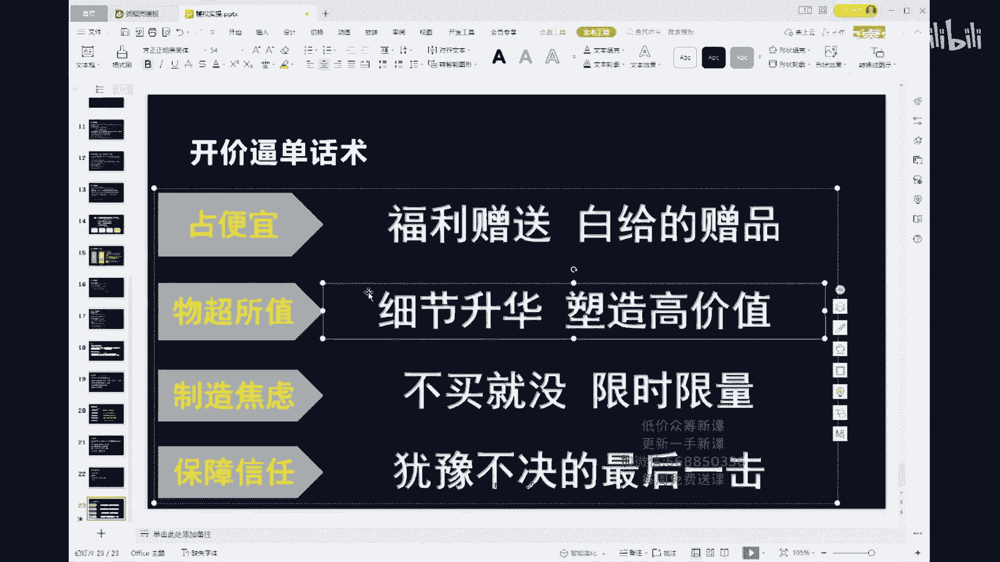

我跟大家说一件事情，所有人啊，所有人我跟你们说一件事情，我们啊我们真的许久许久没有我们的线下课了，去年的时候我们是在7月份的时候，我们在广州开了一场线下课，对不对，那个时候。

然后是呃现场分析了打号的视频，然后呢师傅上去讲了底层的逻辑，包括罗盘，底层逻辑，包括罗盘，包括我的话术课，对不对，包括我的话术课，我跟你们讲，这一次这一次啊，不好意思不好意思。

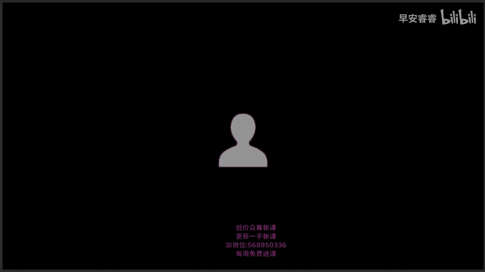

来这一次啊，这一次听好了，我们在5月份的，5月份的，啊9号十号11号在杭州，在杭州周边啊，在杭州周边的义乌，那不是在在在乌镇一乌个屁的了，在乌镇就是就是所有互联网巨头，就是马云。

刘强东他们开会的那个地方，我们开了一场线下课，1000人的会场，这次还会有我现场打号，我和季老师还会现场再拉一轮，然后这次呢有可能呢这些老师们都会去拉号，明白吗，都会去拉号，然后你们听好了啊。

有宏迪老师的底层逻辑的课，有我的罗盘课，然后呢关键的问题是，这一次我的话术课，我会把3万的学员，我只讲给3万学员的一圈半话术，然后一圈万花树怎么配合流量节点，怎么配合人气节点拉四波，每一波用哪一圈。

每一波用哪一圈，我直接就在6980上面讲了，就是3万的东西全在这个上面讲到了，包括大鹏老师的罗盘课，包括大婷老师的前期如何点对点，我跟你们讲，就是加上师傅，这一次我跟你们说讲付费了，宝贝儿们缴付费吧。

天天吵吵，问我说什么时候付费，什么时候付费的啊，这次可以真的报名了，然后呢季老师还会再给你们讲同城，最近同城是不是很火，我们的同城最近打的真的太好了，第一天起号罗盘全部34万，然后基本上两三天之后。

直接上到当地的带货榜去，是的，我们这一套自然流的打法怎么去配微服费，因为我们是已经摸过一遍的了，我和季老师当时是去打了必胜客的，我跟大家讲啊，我跟季老师当时去打了必胜客的，他们正常的主播。

平常是付3000~4000块钱卖10万，我们两个上去，用我们海纳的整个的一套话术的逻辑，包括话术框架，配合上微付费，我们才付了780块钱，卖了10万，这是我们真正自己测出来的，所以我告诉你们。

小白去一定听得懂，小白来一定听得懂，而且我们还有现场的打号，这个长号打完了之后，我们还会现场给你们分析这个大号，每一句话，每一句话为什么出现在这个节点，我跟你们讲仅此一天，然后呢，我跟你们说。

师傅这个人真的太好了，师傅这个人真的太好了，他觉得他的老粉很多，就是1000个人里面，怎么着也得有1/3是老粉，对不对，他说了，前300个人报名的，前300个人报名的包吃包住，我的妈呀，你们知道吗。

四星级的酒店，四星级的酒店，而且我们三天两晚的课，我跟你们讲一下，我们虽然是三天两晚的课，但是我们包的不是两天晚上的住宿，我们包的大家是三天晚上的住宿，明不明白前300个人包吃包住，你们谁抢上是谁的了。

抢不上不能哭，我我不麻扁你们啊，我不麻扁你们啊，前300个人好不好，一圈半的话术是什么，来了听吧，宝贝一圈半的话术YYDS，我跟你讲一圈半的话是真的YYDS，所以我跟你讲，而且你们听好了，你们听好了。

整场6980，整场6980包吃包住，你们能报上名的，一定要赶快报名，真的一定要开始报名，69801千六不是钩子，我们一年才开这一次，去年我们在广州一年我们只开了一次，我们本来350个人的会场。

最后被挤满，挤到550个人，大家都坐到门外去了，大家都坐到门外去了，团队三个人是可以去的，如果你团队三个人去的话，我们还会有折扣，团队三个人去的话，我们有折扣，前300个人包吃住，不是逼单话术，老大。

我四星级的酒店我都包了，我我亏死哥们儿，你别闹我好不好，我暴食暴住呢，哥们儿，真的是前300个人包吃包住，我们现在已经开始报名了，好不好，如果你们要报名的，你们要报名的，你们要报名的啊，都是1600。

对不对，都是1600，你们去找你们自己的运营导师报名，大家去找自己的运营导师报名，跟他讲，我要报6980，如果你是三个人的，如果你是三个人同行的，我们会给你折扣，我们还会给你折扣。

折扣大概能有个五折这个样子吧，四人同行一人免单啊，四人同行一人免单，你没有运营导师吗，你没有导师吗，有啊宝贝跟谁报的，你有你的运营导师去找你1600的分配了，运营之后，赶快去找你的运营导师报名好不好。

还没有报名，是不是去旅个游，对我跟你讲，师傅就是觉得说大家来大老远的来，这次直接连吃住都给你们包了，师傅的底层逻辑，高端的罗盘课，话术课，流量的来源，人群的分析，大婷老师这边。

快速的人叠人本人的核心的关键点，如何利用话术去拉停流，季老师这边会给你们去讲同城直播新趋势，包括如何从同城获取流量和变现，包括千人直播间的玩法，大鹏老师这边11项罗盘基础数据分析，赛马机制。

流量来源的精准分析与把控，内容输入与输出之间的关系，再加上我的一圈半话术，再加上我的一圈半挂树，亲爱的们，我跟你们讲我的一圈半花束，听过的都知道YYDS好不好，听过的都知道是YYDS。

然后我跟你们讲最后一天，最后一天，第三天全天候地老师的课，最后一天全天有侯弟老师的课，第一天的上午他会讲拉新话术，洗粉话术，素品话术，人性话术，开单话术，保障话术，逼单话术，封单话术。

他会把八大话术全部拆分开给你们讲，然后第三天的下午，侯D老师讲的是付费流量的底层逻辑，及配合自然流的打法，付费流量的话术应用，付费流量的作用，付费流量的投放与使用逻辑如何配，我们如何配我们。

但是我不骗你们，就300个人，就300个人包吃包住，五星级酒店6980，四人同行，一人免单，然后呢呃如果你两个人来，第二个人有折扣，然后第三个人来，然后我们都是有的，直接去问你的运营好不好。

直接去问你的运营，前300个，前300个人收买了，我们就不收了，我们的包吃住的活动直接结束掉，因为现在叫早鸟票，现在叫早鸟票啊，你们你们就算是要听一圈半的话术，你们就算是要听师傅的话术，你们都要来。

你们要看我们现场打号，而且这一次现场打号不像上一次了，上一次真的可能是我们准备的不充分，给大家道歉，5月份的9号十号11号，8号报到，8号报道，5月份的9号十号11号，明白没有。

三天两晚在杭州周边的乌镇，然后呢，我们1000人的会场，前300人包吃包住，有我一圈半的话术，有同城，有付费，有底层逻辑，有话术课，有罗盘课，付费是哪些内容，现在不能告诉你。

侯帝老师的付费课不是我们的啊，最后一天第三天全天是师傅的课，所以我跟你们讲，我们的6980，你们真的可以去看一看，哪有一个开线下课，给你们包吃包住，还这个价格的，你们自己去全网比价啊。

在这个平台上我真的敢跟你们说，全网比价自己去啊，卷死豆，哈哈好了，我要下课了，拜拜宝贝们，简单来说一下B单了，对B单了，兄弟们，300人包吃包住后，赶快赶快报名，300人报满分就没有了啊，好嘞拜拜。

宝贝们跟我打个拜拜吧，赶快报名啊，想找我报名的也可以啊，想找我报名的也可以，那你们都是1600了，去找你们的导师啊，去找你们的导师，好嘞拜拜。

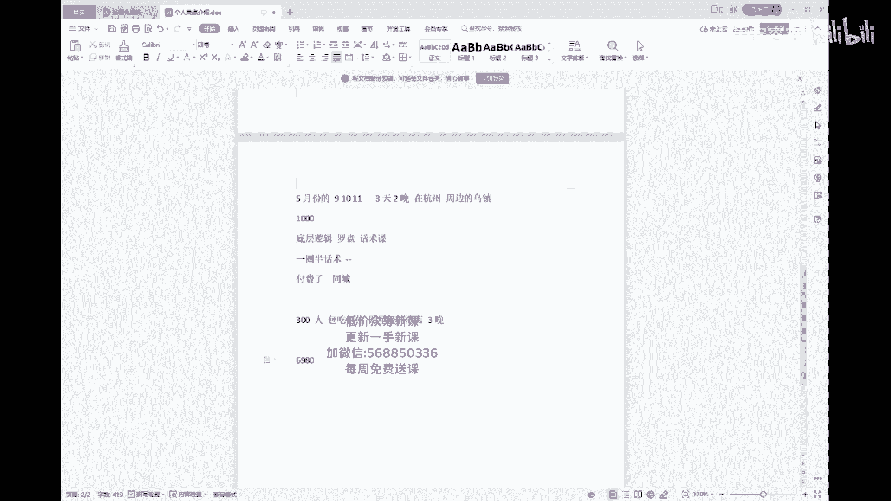