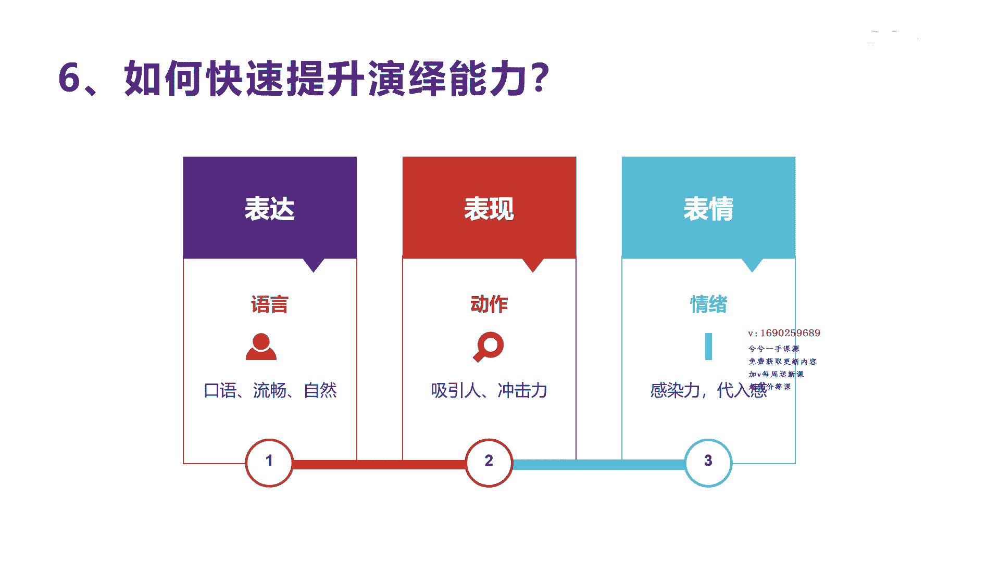

# 042 2023抖音快速起号必修课 - P10：第10节如何快速提升演绎能力-请收藏 - 早安睿睿 - BV1Gn4y1o7rC

好我们来看一下第六啊，就是如何快速的提升演绎能力，而我们前面讲的文案也好，沟通也好是吧，选题也好，这些你都完成了，你都知道怎么去做，最后我们还是要拍成视频，是不是。

所以呃他跟别的这个呃平台创业确实有不同啊，像我们公众号微信的这种内容，他实际上只要把文字写好，那就一个人搞定了是吧，那老板不需要参与，也不需要人物出镜，也不需要去什么表演上台，是不是，但抖音不行。

抖音它难就难，在这里它虽然容易啊，就是我随便拍拍就可以上去，但是你要做好，你得还学会怎么去演绎这个演绎。

我包括三个方面，这个我们讲三个方面的演绎，第一个就是我们讲的用三个词来表达演绎，怎么去提升，第一个是怎么提升你的表达能力，第二个怎么提升你的表现能力，第三个怎么提升你的表情能力，这里讲的表达能力。

我前面上一节课我们也讲过，表达就是要有沟通通嘛，你得要有口语感，你得流畅，你得自然是吧，这个话术讲出来让我觉得很听得下去，这表达能力，你的语言能力是吧，那么第二个就表现你的动作要吸引人，要有冲击力。

或者让我能觉得很很吸引人，不可以让我觉得很舒服，很吸引我，来留下来看，就比如很简单卖卖水果的，他在短视频里面把一个水果，那个那个苹果一削掉，然后剥开这个动作，让我觉得哎呦很有创意。

然后男孩子在削苹果对吧，动作第三个，我们讲表情，表情其实就是情绪，你得要有情绪，你的口语化很到位了，你的动作也很到位了，但是你的情语序不到位，你没办法去我们讲什么，没办法去感染别人，你没办法感染别人。

没办法让别人带到你的故事情节里面来，那么他肯定没办法持续看下去，也就是说你的普通话很好，你表达的这个也很口语化的内容，你的文案写的也很不错啊，但是你的动作也很好，但是你一讲出来。

你一不你一把它录成视频之后，别人会觉得你哎呀没有感觉啊，没有感觉啊，很枯燥，就像在这三个真正要做出来，不是一般的人能做到做成的，对于对很多人来讲，他面向镜头的这种恐惧感或者是无力无力感，他真的无力。

他很想练好，但就就是这种感染力和表情就悟不出来，他天生就没有表现欲，就很多演员一样的，他不可能天生下来，每个人都可以当演员的，每个人当演员，那就不会存在演员像你这么吃香，首先演员他就需要有这种状态。

这种叫我们叫什么感染力，替代感带入自己到那个环境，那个文案里面的角色可以映射出进去，然后把他自己的感受演出来是吧，这种情绪这种表情他确实是很难的，所以我建议呢是怎么做呢，就是当然像像我自己的短视频啊。

因为呃也是原来从来没有面对过的，但是你不停的去看别人的，不停的去拍，不停的去挑战，不停的去改变，去模仿啊，多拍多练，然后真实把自己放松啊，这种情绪还是可以慢慢提升的啊，不说专业的演员。

真的专业演员你很难达到，为什么有些人这个短视频可以涨几十，几百万的粉丝啊，或者是变成网红，真的他他很核心的是因为他的情绪，他的情绪很有代入感，很有感染力，那其他动作和他的文案都不怎么跌啊。

表达也不怎么低的时候，他也可以感染用户，所以我们怎么去提升我们的这个演绎能力啊，它是决定了你是否能当然做口播啊，啊是决定了你做口播或者做出境的啊，要表达的这种账号的核心啊，表达表现和表情。

那么对于其他的可能说诶我不讲话可以吗，我不出镜可以吗，也可以，你不出镜，要不就是啊只录音是吧啊，你或者是说你你拍美食用动作是吧，用用独白啊，不出境就好一些，就不会存在这种需要口播。

需要面对镜头的紧张感和感染，那你缺少了这种人物出境，那你别的地方就要更厉害，比如说你要有更好的这种拍摄或者是啊内容，比如说那个啊美食的这种内容去感染别人啊，这样你才可能让别人觉得诶。

你的短视频内容做的很好是吧，好今天我们就讲到这个，如何提升演绎能力的一个核心的方法，表达表现表情，去不断的锻炼自己啊。

不断的锻炼自己。