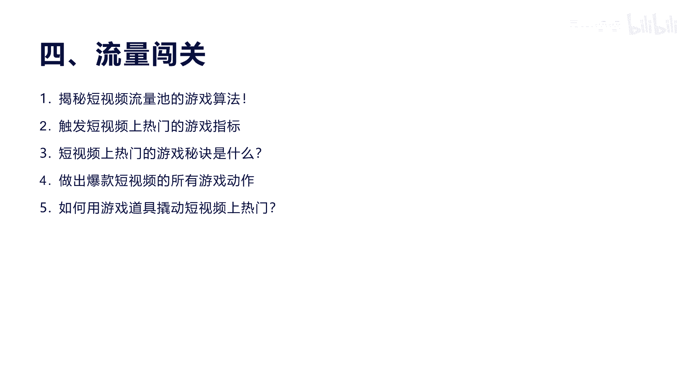
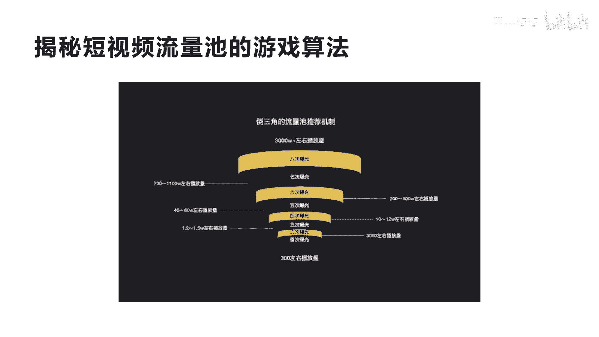
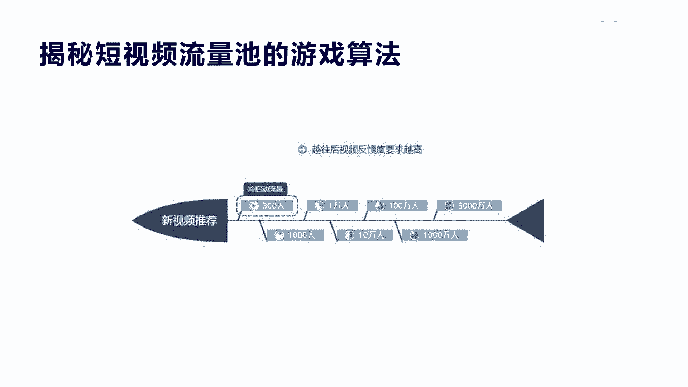

# 042 2023抖音快速起号必修课 - P11：第11节揭秘短视频流量池的游戏算法-请收藏 - 早安睿睿 - BV1Gn4y1o7rC

好上一节课我们讲的内容啊，如何做内容，如何快速的去啊上热门的内容方式啊，包括我们讲最后怎么去演绎，今天我们讲核心观点啊，就是如何获得流量，这个是所有的呃，做抖音创业和别的所有平台做创业来讲。

最注重的一点啊，因为不管是线下还是线上，所有的商业的本质其实就是流量，有流量的地方就真的会有生意，那我们怎么去在抖音通过流量的方式，产品能卖的更好啊，我们从五个方面来讲，第一个就是我们讲的呃。

先让你了解一下短视频流量的一个，游戏的算法啊，这里我第一节课我们会讲，揭秘短视频流量池的一个游戏算法，让你感触一下哦，抖音原来是这样做的，他的游戏会有一个这样的机制。

那么第二就是触发短视频上热门的游戏指标，有人说哎我发的视频为啥就是上不了热门呢，因为你没有达到他想继续给你推广的一个指标，那么第三个就是短视频上热门的游戏，秘诀是什么。

就是你想把每一个短视频去打这个boss，就是闯关的时候，他总会有一个啊一个诀窍，你怎么了解这个诀窍，这个诀窍是所有在视频行业里面都没有讲过的，今天我这个也是我们讲的用游戏化思维去啊。

去让你真正深刻的印在你的头脑里面，短视频到底应该怎么才可以上热门啊，他会有一些游戏诀窍，那么第四呢就是做出爆款短视频的，所有的游戏动作是什么啊，这个游戏动作能让你会感受到哦。

原来我只要做这些这些这些动作，就可以让自己的短视频能够上一些热啊，当然他肯定是跟内容相挂钩的啊，最后一个五呢，就是我们讲的任何游戏都可以复活，都可以让自己买一些装备是吧，可以啊，比别人跑得更快。

可以打的更远，那么抖音也是一样，它会有几个游戏道具哎，能让你去撬动你的短视频，或者你的产品能让它更好的跑得更远。

那么第一个我们先讲一下啊，今天我们讲第一个就是这个倒三角的这个图，它是流量式的推荐机制，也就是抖音的，他这里面会分为首次一次啊，首次二次，三次四次，一直到八次曝光，一直到最后啊，有很多这个呃初学者啊。

他发了一个短视频，有些就在我们整的初次的曝光，也就大概给你300左右的播放量，可能有些300都没有啊，但是有些这个一发一个作品呃，如果你的内容质量很高，那一般会到达第二个二次曝光的一个阶梯啊。

像很少有呃新手纯小白啊，我们说那个专业选手就不讲了，纯小白能很快突破首次播曝光的啊，因为首次曝光他说明你的各方面指标都不行，你还在入门的这个门槛之下，当你可以达到第二，也就是3000播放量。

一直到第三次，一到1。5万或者2万的播放量之后再搭，第四次曝光之后，10万到20万是吧，一直到第五次，40万到60万，或者到达到第六次给你200万到300万，一直到最后第八次。

可能给你3000万以及5000万的播放量，那么讲到前期来讲，我们的呃播放量卡在123是很正常，因为对初学者，我们刚才讲他有很多这个内容也好，还是你的表演情绪也好，你都很难得达到。

让观众持续的给你做很好的指标啊，这个指标我们后面也会讲一些什么样的指标，那么这个所以经历过123，一直到我们的第五次曝光，其实我现在的账号这个账号啊，就是涛哥聊创业，这个账号已经达到第六次曝光了。

我的播放量已经超过五次曝光了，60万播放已经达到了额，有一有两个视频已经上百万啊，有两个视频已经上百万，因为我总共才做了四五十个视频，其中有将近五个已经爆款了啊，有上啊，五次曝光就是50万以上的。

我现在有将近五六个短视频上了50万，真正大爆款的上了两个啊，上了第六次爆款，我还没有突破200万以上的啊，所以我讲的这个意思就是说，如果你的短视频越往上走，你的这个视频的这个内容啊，你越要有冲击力。

当然它并不是说你达到第六个阶段，第七个阶段之后，你所有的内容都会达到这个流量，他还是每一次根据你单个内容来，只是说你的权重，这里不会讲到权重的话，就是你的流量池分配的这个阶梯，如果触碰到第六次。

你的最高分可以达到第六次的这个部分啊，但是如果你从来没有碰过这个10万的流量，那你很难去触碰，懂我意思啊，就是说你的权重，你的最高值是你可以去，每次可以去啊，可以去触碰到的，但是如果你触碰过了。

并不代表你每一个短视频都会给你触碰到，说白了就是他的这个流量推荐机制，它不是跟你的阶梯，跟你的账号权重或者跟你触碰触，没触碰到这个某个等级的流量池来相关的，这个我知道听懂没有。

所以你每次的啊这个短视频的这个文案内容，包括他的流量啊，他都是根据你的每个视频来进行推荐的啊，当然你权重越高，你所可能碰撞到的流量池，可能会最可能比别人要高啊。

仅此而已，好那我们看一下他的这个，这是一个抖音的一个内部的，和这个整个视频的一个审核，包括我们讲的删除，包括人工检测，包括我们讲的怎么上热门的一个啊流程图，这个可能比较复杂，我们就不一一讲了。

它实际上意思就是说我们上传一个短视频，机器会审核，机器审了之后呢，啊他觉得你的画面关键词都没有违规，那么我们就人工审，人工省了之后，发现你确实也没有问题，我们就进入到下一个，那如果觉得你的人工有问题。

你出现了违规的一些图片或者文字，他直接就把你的视频给下架了，或者就把你的这个账号给禁止，那么你的视频是正常的情况下，他就会往下面给你推个两三百的用户，给你看一看，看看用户的反馈，你的点击数怎么样。

你的评论数怎么样，你的完播率怎么样等等这些指标来考核，你刚才我们说的流量阶段，这个时候你是到达第二个阶段，那我就给你多少1000的播放或者3000的播放，这里给大家提醒一下，就是1万的播放量之后。

它会有一定的人工干预啊，所以你当你的视频没有在1万以你上的时候，一般人工不会干预你，那么就是机器在给你跑，那么到1万以上，他有一个初审诶，觉得你这个视频不错，只要没违规，我再给你做二次推荐。

那么1万再往上面走，就会找到5万10万，然后又会有人审核人工审核啊，为什么他要这样层层人工审核呢，因为机器再怎么说，他也会有犯错的时候啊，别说人了是吧啊，所以他这样保证了它的每个内容的正规性。

这里讲的正规性，就是说实际上这个内容如果是违规的，或者违法的，或者是不好的，这个内容漏掉了，播放出去了，这个影响是非常恶劣，所以抖音在这个处理这个视频，这个呃审核机制的效率上面，和它的正确性上面。

他确实做的非常好，因为在5年前10年前其实就有直播了啊，那个时候直播其实就是因为这些都做的不好，人工成审核成本太高，导致了很多人发的视频要等很久才审核，我都反审的都没意思了，是吧啊。

所以就导致了那个时候发创作者，就很少都不愿意去创作，而抖音这个审核机制呢，它导致了这种啊检测视频的准确度，机器审核的效率，包括人工审核等等，这些环节，导致了他这个视的视频的发布速度和审核速度，非常快啊。

这也是讲的这个抖音的一个核心机制啊，这个地方我们就我们就了解完，我们就讲下一个啊，呃这个是讲到另外一个，就是我刚才也是我讲的，当一个视频发出去推荐完之后，先给你三百两百五百的播放或者1000的播放量。

这个叫冷启动流，就是刚开始的时候都会给你三百五百是吧，这是所有平台来讲没有的，他这个机制也是我原来讲过，对游戏设置平台的底层逻辑来讲啊，这又讲了我们的游戏化思维的，这游戏化思维在讲每个人玩这个游戏。

它必须要有一个零门槛的游戏规则，就比如说我们去玩一个魔兽世界啊，或者是吃鸡游戏，或者是超级玛丽的小游戏，你难道禁止只能只能年轻人玩吗，老年人不能玩吗，你只能说小孩子玩这个大人不能玩吗，没有玩。

他的门槛是最低的，谁都可以玩，这是第一个是吧，所以对于抖音的游戏规则来讲，他也是一样，所有的游戏的都可以发，而且呢我还给你给你流量大，因为你如果让我发了，没有一个人看，你说我还会发吗，不会的。

他这个游戏就是说我能发，我就能反馈反馈给你，什么数据反馈呢，给你300~500的基础播放量的数据反馈，这样你会感哇这还是有300~500人看呢，是不是及时反馈给你，反馈完了之后你会感觉到有兴奋感啊。

有有有有获得感，这个是我自求玩，我再发，又是给500再发再发发的，我全是500的时候，有些人就坚持不下去了，就像我们玩游戏一样的，我老打打打打，打个十天半个月，我就和第一关都过不去，你还会打吗。

你不会打了，这样的时候就会啪嗒啪嗒，就会把很多人给淘汰掉，所以有很多时候做抖音，为什么说坚持不了两个月，坚持不了两个月是对的，抖音就是要让一批人坚持不了两个月，因为你都可以坚持两个月，坚持一年。

两年都能做起来，这个生态也不对是吧，他一定是通过某种游戏机制啊，让部分人能很好的往上面走，能晋级，所以抖音它核心在于什么，门槛很低，入门很低，就是入门的门槛很低，但是难度在哪里，进阶真的就是进阶。

你进阶的这个阶梯是考验入门的基础，是所有人都可以做的，所以这个好处就在这里，游戏化设计的一个非常好的一个啊，一个底层逻辑，他没有这个底层的逻辑，他不会有产品逻辑，你知道我意思吗。

如果他没有游戏化的商业思维的这种逻辑，他就不可能让产品经理去做一个这样的应用，产品经理不设置这样的应用规则，这个抖音是跑不起来的，他是没有很多创作者去进入到这个里面去玩的，就是实际上它也是一种漏斗。

就是让100万人来做，但是100万都可以玩，但是我最后只塞1万人可以进到第二集，就是1万人播放，然后我再让多少1000人进入到10万播放，然后我再让多少100人进入到百万粉丝，千万粉丝的门槛就这么回事。

它跟人类一样的，跟人类社会分工等级是一样的，我必须让优等生，让非常成绩好的人干什么，能做研发是吧，能做一些制造业的做啊，或者是国家一些非常艰巨任务的，一些高精尖的一些产品，那也只能淘汰那些小学没毕业的。

或者是刚毕业初中毕业的，那只能去送盒饭了，你只能去送盒饭，是不是你只能去代驾，这就是这就是还原了用游戏化人生，游戏化短视频，去还原游戏化人生，的一个非常好的一个一个映射，所以说到这里啊，这又讲到了思维。

所以整个这这个课程啊，我觉得你用游戏化的这种思维去做短视频，你就会知道，做短视频创业真的就不是每个人都能成功，但是呢你要想成功，你得比你身边的人要努力100倍1000倍，你才可能漏到下面一个漏洞。

好吧好，今天我们讲这么多啊。

我们再想往下讲一些干货好。