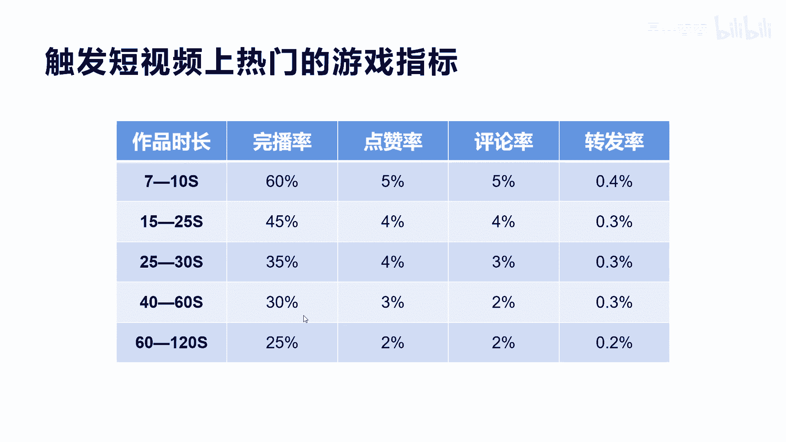
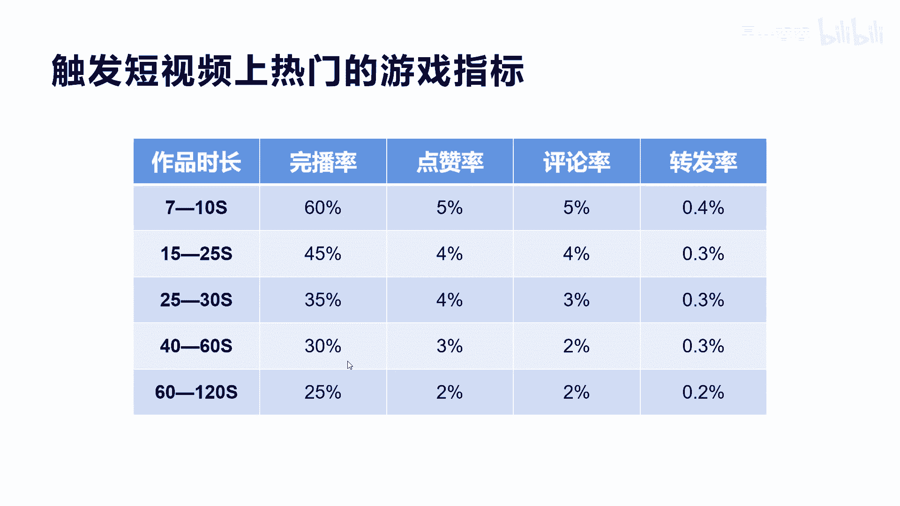
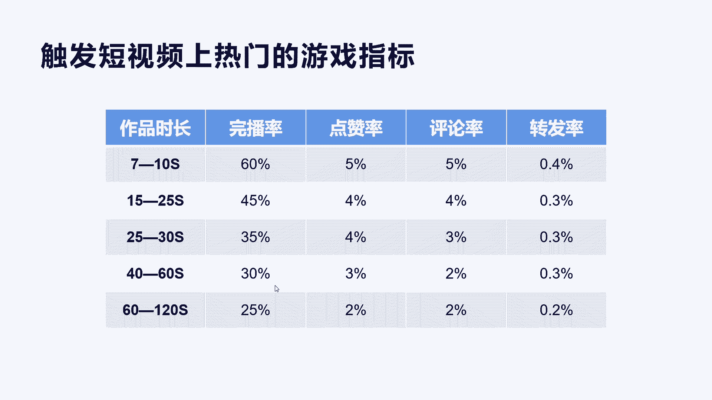
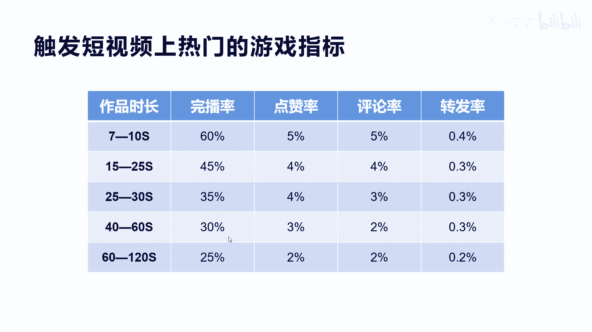

# 042 2023抖音快速起号必修课 - P12：第12节触发短视频上热门的游戏指标-请收藏 - 早安睿睿 - BV1Gn4y1o7rC

好，今天我们来再讲一个，触发短视频上热门的游戏指标。

这里面有很多不同维度的指标啊，我们先看它有哪些，比如说完播率，点赞率，评论率和转发率。

而且他会根据不同的时长，就是短视频的时长，他的要求是不一样的，你比如说啊7~10秒的这个短视频，大概完播率需要达到60%，点赞率呢需要达到5%，评论数率呢可以达到5%，那么转发率至少要达到0。4%。

这个时候他才可能你的短视频指标，才触发上热门的这个指标，游戏指标数量，我们再看第二个15秒到25秒的，它只要45%的完播率啊，点赞率4%，评论师，然后转盘0。3，已知道往下推，我们看60秒到120秒。

也就是2分钟。

一分钟到2分钟的视频，他的完播率实际上只需要25%，而点赞率呢2%，评论率2%，转化率0。2，他为什么会短视频越长。

他要求触发上热门的指标越少呢。

啊也也是这个原因啊，因为对于很多这个视频来讲，真正能把它看完，能把很长的视频看完，它是有难度的，但是七秒到十秒，说实话你刷一下他就两三秒了。

然后他才稍微看一下内容，你七八秒的这个视频就结束了，他完播率当然可以达到百分之百。

所以你越短的视频，他的完播率其实是比较高的，但是他这个视频的这个内容来讲，他并不见得是很好的，所以呢呃他在考虑你的综合的点，点赞数和点赞率和评评论率以及转发率的时候，相应的指标要综合上面要很高。

你的完播率是百分之百，但是你的点赞率是零，你的评论也没有人评，也没有人去转发，你的视频，就没有达到这种效果，也就是通过这个维度可以判断，你其实你的啊视频的内容质量是不行的啊，他其实这个通过机器的方式。

通过四个维度，其实最终是想把好视频内容给筛选出来，让更多的人喜欢和让更多的人看到啊，他的逻辑是这个底层逻辑，所以你到了后面的时间越长，你的短视频你想让更多的人把你看完，你的视频的内容要求就非常非常高了。

如果你的视频能让一个人把你2分钟的视频，完整的都看完，那说明你的内容和他的喜好度来讲非常吻合，也代表了你的这个视频的质量非常高。

所以他相应的呢能看完12分钟，人数就没那么多啊。

所以他的整个完播率的要求来讲，也没有那么高了，点赞率也是一样，所以通过这个逻辑啊，大家可以稍微从理解上面。

怎么去选择你的视频长度，我建议是因为越容易越短的视频。

拍的人越多，竞争越激烈，你可以拉长你的短视频，比如说我就要拍2分钟以上的，可能4分钟，也现在有很多人挑战了4分钟，他要求的完播率，可能只有10%或者15是吧。

那么这个时候你去你去做的话。

指标就很容易达到，当然这个我讲实话就是他的指标是在这里。

也就是说他的指标实际上是我们讲的平均数，当然你的内容质量本身不行，你做的10分钟都没人看，你明白我意思吗，也就是说你适当的去加长你的时间，但是你的内容创作度，创作难度来讲啊，不需要那么高，但是一定要有。

不然你是很难达到平均所有指标的，它不是某一个指标达到他就可以上热门，而且就算你所有的指标都达到了，四个指标都达到了，都比它的平均值还要高，你也不一定见得会让人会让抖音推上热门，这是很正常的。

有很多完播率点赞率指标非常好，2分钟视频他就是不给你流量，为什么，因为他它没有达到人工审核。

或者是系统喜欢的类型的视频是吧啊，所以它的内容啊。

方向也决定了你能否达到更高的上热门的梯度，所以我们在这里啊啊，了解一下每个指标应该怎么去做，希望对你做创作有一定的指导意义。

