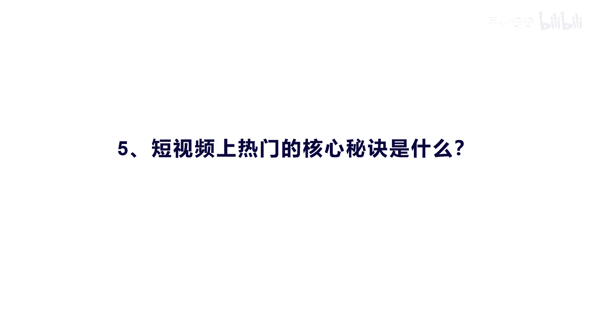
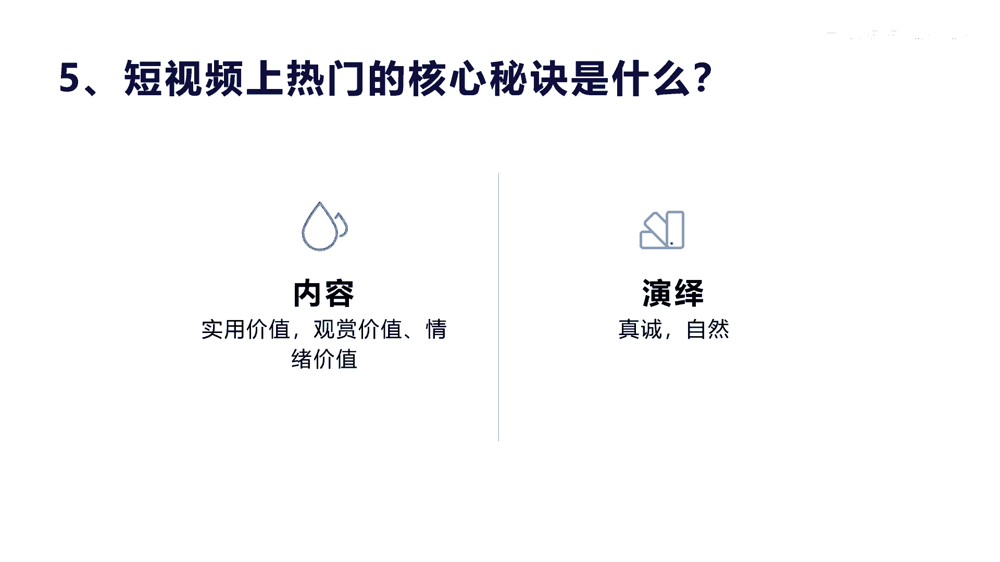
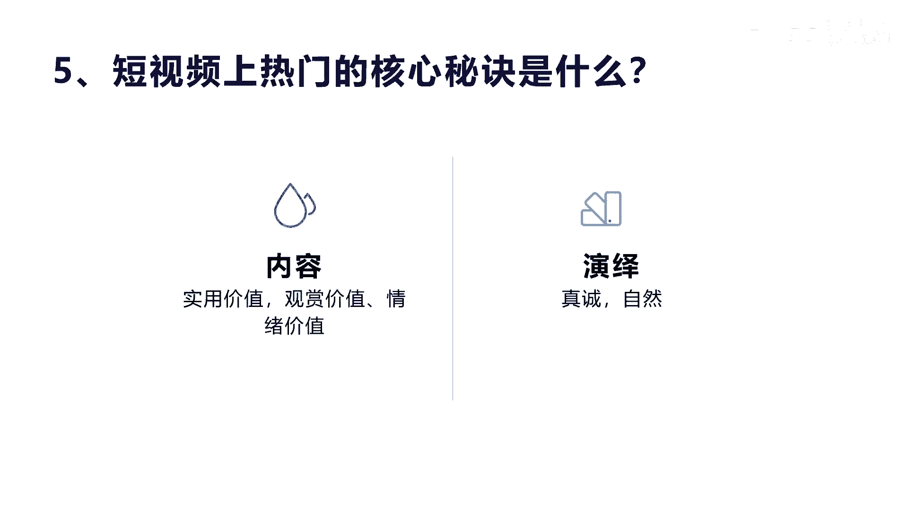

# 042 2023抖音快速起号必修课 - P13：第13节短视频上热门的核心秘诀-请收藏 - 早安睿睿 - BV1Gn4y1o7rC

好，今天我们再讲一下，短视频上热门的核心秘诀是什么，其实上一节课呢，我们也讲到他有很多这种游戏动作啊，呃这些环节游戏动作是必然，对于上热门来讲是非常有作用的，有好处的，你必须按照那个方式去思考。

用户的思维和用户每个状态所表现的这种心态。

那但是呢我们在做这种能上热门的，核心是在于你的内容和演绎两个方面，内容实际上就是你的使用价值和观赏价值，或者是情绪价值，内容有很多啊，就包括你的画面，音乐标题文案其实都是内容，包括你的主页的设计。

包括你的介绍，这都是属于内容，这些整体的内容都会引发观众的一个获得感，或者说是他的一个价值体现，那么这个价值，比如说我们讲的这个实用价值来讲，它一定对用户是什么有用或者是有趣啊，那么对于观赏价值来讲。

他一定是什么啊，新奇特有诱惑力，很美是吧，美到极致有观赏价值，那么情绪价值呢，其实就是我们前面讲的两个核心点，一个是你能让我干产生情绪的共鸣是吧啊，通过你的极致反差，通过你的反差让我代入感。

让我产生跟你一样的情绪，所以它的内容的核心在这里好，那么演绎其实前面也讲了很多方法，其实最终文案你得用你的语速，用你的语言，用你的真情，用你的真诚，自然的把它去表达出来，他是要进视频的啊。

不管你出镜不出镜，他都要是要经过用户的考验的啊，那么考验就在于你这些东西，所以我这里讲的不是教他一些技巧方法，其实核心秘诀就这两点，一个是内容，一个是演绎啊，内容你多考虑一些是有用的是吧，有趣的。

新奇特的，有诱惑力的，能产生共鸣，反差的这种内容结构，内容选题和内容写作，那么演绎呢就是一定要让自己自然口语化，用心用，真心很顺而不做作，你整个这个短视频才可能被推上热门。

因为短视频推上热门并不是抖音所为，他是用户所为，用户用他的行为投票和他的动作，决定了你是不是可以被推上热门。

好吧今天我们就讲到这里啊。

