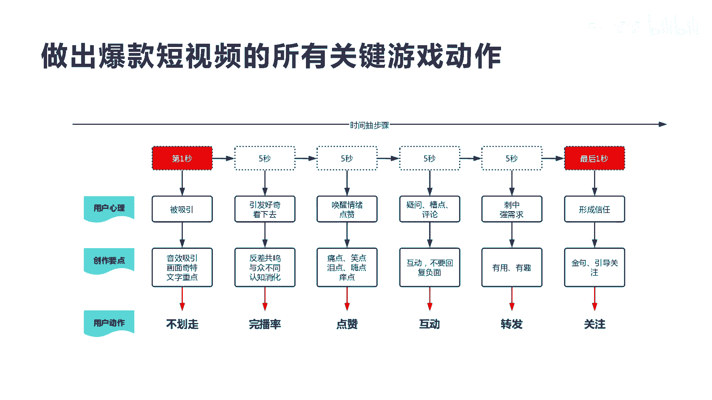

# 042 2023抖音快速起号必修课 - P14：第14节做出爆款短视频的游戏动作-请收藏 - 早安睿睿 - BV1Gn4y1o7rC

好那我们今天讲第四个流量内容，做出爆款短视频的游戏动作，我们为什么说他是这个游戏动作啊。

我们先来看一个图啊，你看这个图我们左边呢它叫用户视角，那么右边叫创作者视角，用户视角是什么意思呢，就是观众观众在整个你的短视频播放的时候，他都会有一些什么样的动作和感觉，而在短视频创作者的人的视角上面。

你应该怎么去设置你的短视频的整个啊，播放的环节，那我们看一下前三秒啊，也有很多人说，黄金三秒对，黄金三秒是否击中我的某个需求的好奇感，这就是前13秒，也就是我们前面，也就是我们在最开始讲的文案的时候。

他叫什么啊，钩子或者是说什么啊，黄金开头是不是黄金开头，那么这个三秒就是你作为创作者来讲，你得一句话说透你的用户需求的痛点，那他才会在前三秒停留下来，才愿意往下继续看，所以在第二个十秒的时候。

你应该给他设计什么，是否能让他有收获啊，也就是说你再让他看下去的时候，他会觉得我看下去是有价值的，他才会想哦，这个好，我要看下去，所以在前十秒的时候，他决定了要停留在你这里把它看下去。

但是他看完十秒之后或者15秒之后，他发现你说的这个东西没让我有收获，他就划走了，所以在第三个阶段，我们每刷一个五秒钟的时候，我们就必须得给他一个非常明确和确定性，或者很好的让他看下去的理由。

这就是我们讲的每五秒阶段，要给他一个持续看下去的理由，最后讲的这个三秒来讲，创作者来讲就是否会总结一个价值点，让我共鸣好，那么对于观众来讲哦，我看了你最后的视频，看完了是不是让我共鸣了呢啊他说是的。

那这个时候他也收获了这个价值点，所以整个对于我们的创作者来讲，你要站在用户视角去思考问题，这样你在做整个短视频创作的时候，你才可能不断的啊能触碰到上热门的，或者让观众留下来看完你视频的可能性。

那我们看一下这个图啊。

从上面的这个时间轴来讲，第一秒开始到最后一秒，整个对于用户心理和创作者心理来讲，创作者要点来讲，包括用户的动作来讲做了一个映射，那么对于第一秒来讲，我们看一下第一秒，他肯定是对用户来讲是被吸引的。

那么对于创作者来讲呢，你必须在音效上面，画面上面，文字上面让他不划走，他的动作是让用户不划走，第一秒是不是它是被你吸引了，所以第一秒到第三秒他一定是不划走，那不划走，对于创作者怎么去做呢。

音效画面文字钩子是吧，你的钩子越多，它越会被你吸引，那么第二个五秒的时候呢，其实用户的心里就会诶，我会有好奇，这个下面你会说什么呢是吧，所以这个时候对于创作者来讲，你一定要产生反差共鸣的内容。

这个时候一定要与众不同，让认知可以消化掉，这个时候他会考虑到五秒完播率，对于抖音的现在新改的规则，五秒完播率非常重要，你的五秒完播率直接决定了你后面的完播率，所以这个时候用户动作就是已经完成了。

五秒完播率，那他还会不会持续看下去呢，所以你在第二个五秒的时候，要唤醒什么用户的情绪，让他可以去点赞，所以这个时候对于创作者来讲，你要有痛点，笑点泪点是吧，价值点爽点high一点。

你把这些点都在前十秒给他暴露出来，他才会哇真好，我去点个赞，唤醒他的情绪，那么到后面他可能觉得你越讲越让我什么啊，越觉得有疑问或者有槽点，有评论，这个时候呢就需要不断的让用户去互动，而且呢去跟他去互动。

所以用户他就可能会去评论啊，是不是，那你要回复他，所以这个时候在这个视频的过程中，你要不断的去做设问句好，那么最后呢可能快结束的时候，你一定要有一个什么哎刺激他一个强需求，让他觉得你这个视频是有用的。

有趣的是吧，然后他诶我也把这个转发给别人，你一定是对他有用的，或者对他朋友有用的，对他家人有用的东西，这个视频内容他才会去引发他的转发，是不是或者他会收藏下来以后多看几遍。

如果你的只是让我情绪上面稍微啊撩拨了一下，但是对我实际上没有产生很大作用的话，我是不会转发，所以在转发到前面不划走完播点赞，互动转发他是越来越难的啊，真正能达到又转发又互动，又点赞又玩播啊。

这个视频就非常好了，最后你用一个京剧和引导关注的方式，让他产生信任，进行了最终的关注，那么最后我们讲，实际上你会发现用户动作在随着他心理的变化，和你给他提供的设计上面，内容的一些环节。

就产生了这种游戏互动的这种玩法，所以有可能你的视频就在第一秒和最后一秒，整个完成了刚才所说的用户说的动作，但是也有可能你的视频完成之后发出去之后，你在第一个动作就已经断掉了，或者对于大部分人来讲。

第二个动作就已经over了，那么这个游戏就结束下去了，就等于就等于结束了这个游戏，所以你要整个让你的游戏都跑完，对于每个人或者绝大多数人能跑完，这个游戏的话，你得按照这种方式去设计你的内容环节。

你得了解他在看你的视频的一个过程中，是什么样的反应，心里是什么样的心态，这样你才可能把每一个人都走完这个游戏，明白我的意思啊，所以对于我们来讲，了解这个图来讲，再加上我们前面的文案来讲。

你应该会非常醒目或者开窍了，这样你在做内容的时候，而不光光是为了写内容而写内容啊，其实实际上短视频它是一个心理上的一种啊，挑战就是不断的站在用户的角度去考虑，你看用户看到底会有什么样的反应。

你在写的时候就已经站在用户角度来来写了，所以这是有难度的，所以掌握这个图，基本上所有跟你讲短视频怎么做的博主啊，都可以轮廓到这张表，如果能把这张表搞清搞懂，并且还能设计出来。

基本上所有的呃上热门的这个概率就非常大，好吧，今天我们讲的非常干货好，今天我们就讲到这里，如果大家不明白的，也可以私信我。

