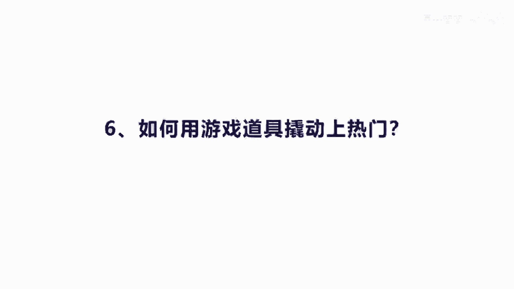
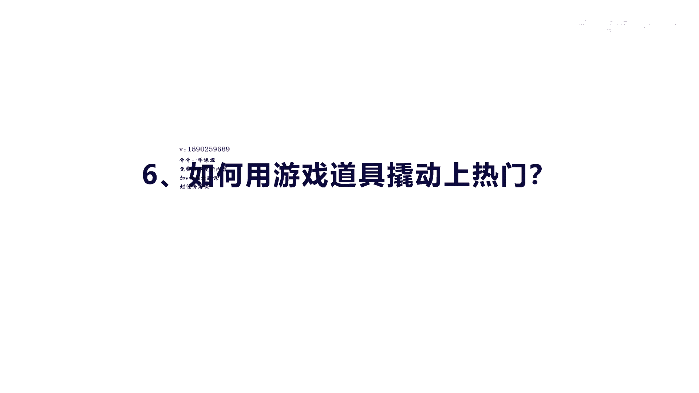
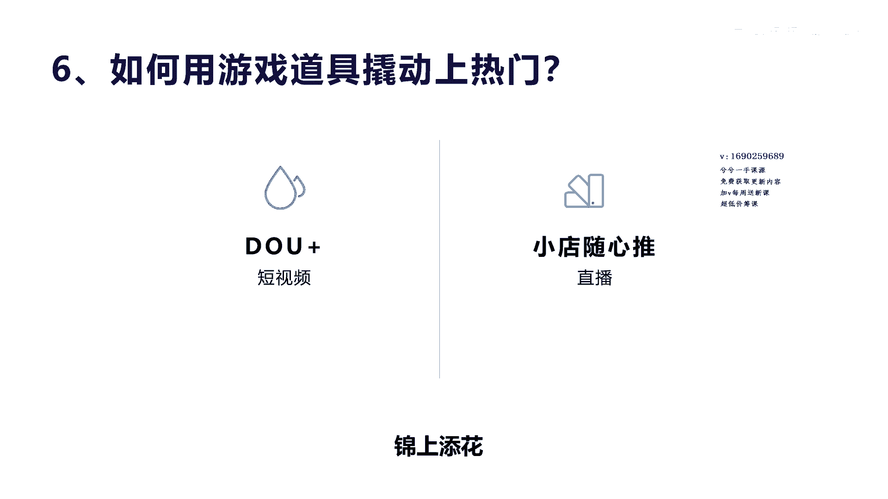
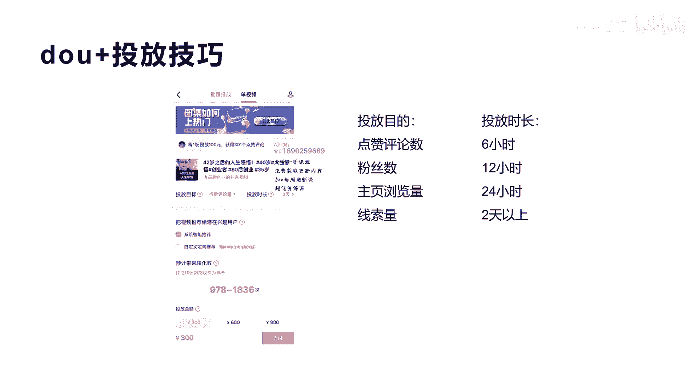
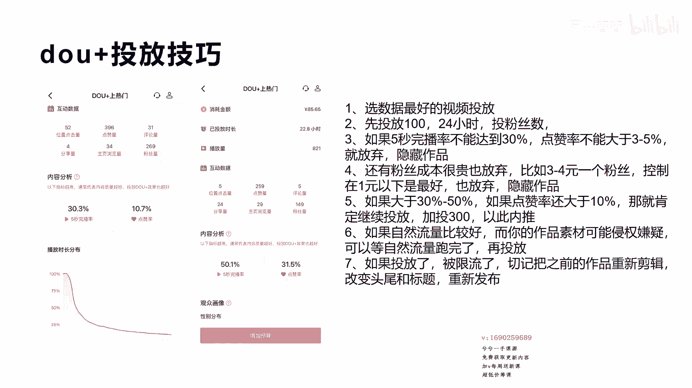
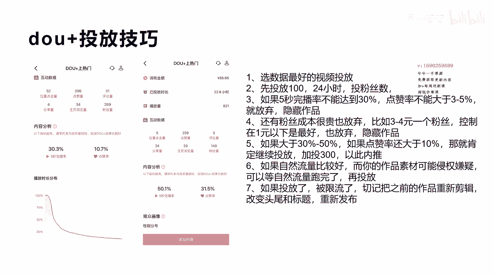
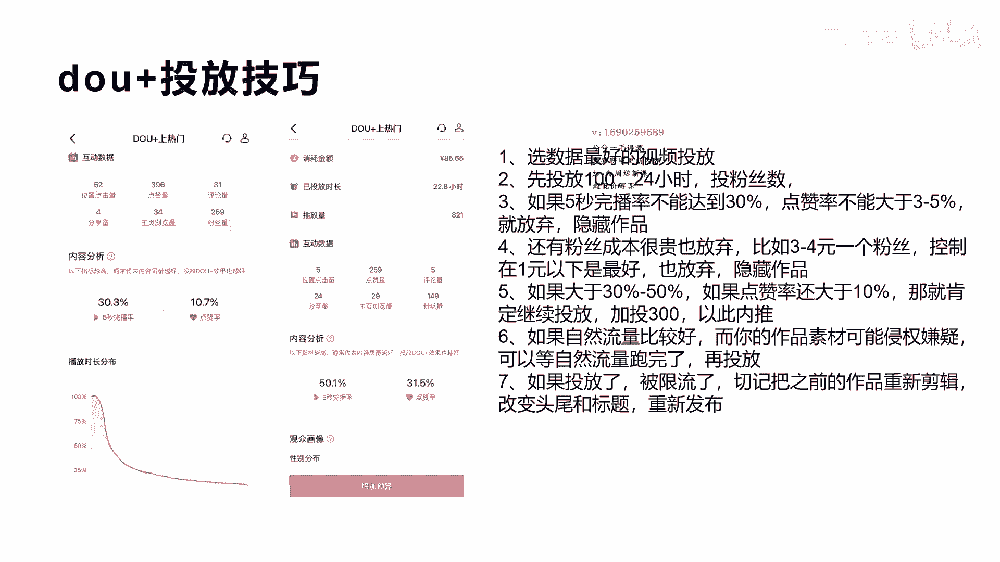

# 042 2023抖音快速起号必修课 - P15：第15节如何用游戏道具撬动上热门-请收藏 - 早安睿睿 - BV1Gn4y1o7rC

好，今天我们来讲这个，如何用游戏道具去撬动散热门，呃，其实你会发现我所有的内容来讲，都用到游戏二字，这也是我从初中在做这个课程的一个思维，因为你整体的用一个游戏来游戏思维，来做短视频有什么好处呢。

因为游戏会让人觉得很轻松，可以克制住你的懒惰，克制住你的失败所带来的负面影响，把它看成一次一次可以打怪升级的这种游戏，会让你无限放大你的能量，所以我们讲对于抖音来讲，他也是用这种方式在做他的产品。

所以我们用游戏道具去撬动上热门，是什么意思啊。

其实他我们前面也讲过游戏道具是什么，就是我们讲的斗加是吧，还有就是抖小店随心推，因为斗家他是做做短视频的嘛，啊包括小店随心推，他是做直播的嘛，做直播转化啊，当然还有一个是巨量千川，我们就没有讲了。

这两个东西其实也就是我们讲的游戏呃，就是我们最开始讲的这个飞机小游戏的，这个里面的复活，其实斗家来讲大家应该都用过啊，学习的应该都用过，它，实际上就是在你原来的这个视频上面去干什么，去增加你的播放量。

让更多的观众给你来做投票啊，那么这种方式呢，实际上我们讲了这下面我打了个字叫锦上添花，有很多人说做斗加，他可以把一个短视频给做成散热门，其实不太可能，因为斗家的作用，他只是锦上添花。

锦上添花是什么意思呢，就是说它本身抖家的功能是不能上热门的，是因为你这个短视频质量和什么，各方面指标都还不错，所以他用抖家去撬动更多的这个什么用户，来观看你的视频，给你更多的啊量一级的这种用户投票。

导致你的用的这个短视频可能可以上热门啊，是这个意思，但有时候我的视频真的质量就很一般啊，怎么上热门，那上不了热门啊，如果你的短视频本身就很一般，你用斗家去投放，就算你用很精准的啊，这个标签投放。

对标账号投放等等，投放各种手段都玩玩尽了是吧，你都不太可能上热门，因为真的就决定了你的啊，你的你的视频内容就决定了，你说怎么上热门呢啊，所以你更多的人来投，所以当你新号开始做的时候。

特别对于你的质量不高的视频的时候，千万还不要投，投的情况下，一定是这个短视频的完播率，点赞率，互动率还算及格，就前面我们说的那个指标，你基本上接近达到达到那个数啊，才可以去做小店，随心推也是一样啊。

他是直播上面的一种推流方式，好那我们来看一下，那么它投放的，当你的视频投放质量很好的情况下，我们去怎么去投放的技巧，这里我也讲一下我的一些经验总结，那么他这个投放其实分为点赞数，粉丝数啊，点赞评论数。

粉丝数，还有我们讲主页浏览数，还有线索数，但线索数对于很多人都不理解啊，啊他是另外一个投放，就是呃有很多实体店或者一些企业，他需要在这上面获客，他会做一个这样的页面，然后让你来投放，那是获取电话号码的。

那么对于一般的普通的抖音账号来讲，其实就前面三个，一个是点赞，一个是粉丝，一个是主页，其实对于大多数人来讲，都会去投什么，都会去投这个粉丝，粉丝数，点赞评论数，它是一个什么情况呢。

他是说你这个视频确实你感觉他已经跑起来了，视频数量还不错，或者是说你觉得他可能会爆，那么你先加持他的点赞数，因为有我们有个人性是什么，我们大家看视频的时候，总会去看他的这个点赞数是不是很高。

如果他的点赞数是上万，已经爆款了的话，我会停留长一点时间把它看完，如果你的点赞数是几个或者十几个，几十个，你会自然的划掉，就像我们到淘宝上面，或者是电商平台上面去购物一样的，如果潜意识你去看一个宝贝。

他是零销售额，你肯定不会买，是不是，如果你看到他是10万加的一个销售，你肯定想都不要想，问都不问，你就会直接下单购买了，也是这个道理，所以当你的产品啊，那个是因为产品本质确实不错啊。

所以当你的内容质量确实还是不错，嗯你觉得还不还可以往上面走更大的一个阶梯，一个流量池的阶梯，那么你去投点赞数，把它推上去一点是吧，我只在冷启动的时候，我就给他加到1000到2000还是可以的。

粉丝数其实对于很多初学者来讲，或者是入门来讲是非常重要的，因为粉丝数决定了你啊后续的账号的权重，包括你啊自己的自信心，包括你各方面的一个因素啊，你的视频是不是更多的人看到成为你的粉丝，进行变现。

他都是有好处的，这比现在都已经开始了这种铁粉和机制之后，粉丝的权重和重要性就越来越大了啊，所以投放粉丝来讲，对新思啊，新手来讲还是非常有必要的，那么主页浏览数呢实际上作用不大啊，作用不大。

所以他如果对你点赞了，或者对你评论了关注了，那实际上我告诉你，一般情况下很多人都会去看你的主页，而且一般成为你的粉丝，他也会基本上会去点赞，所以我们一般会去投放啊，粉丝数还有一个好处，就是我告诉你。

在对你进行点赞，并没有关注或者评论的这些粉，这些用户还没成为你的粉丝啊，他实际上系统已经认为他是喜欢你，所以他在下一次你放视频的时候，他还是会把这个你的视频推荐给这些，没有关注你的啊用户。

但是他点赞评论过啊，这样实际上对于对于我们来讲啊，并不是说只有你原来关注你的粉丝，他才会被启动配件，只要他接触过你，或者是他的标签里面曾经有过你的，他都可能会成为你的粉丝。

或者是说成为你的这个进入到你的主页浏览数。

好吧好，我们看一下具体的操作的方法。

我分享一下我的一些东西啊，左边这两个图呢，一个是啊，有一个视频是五秒完。

播率达到了30%啊，点赞率达到了10。7%，这个作品我推推过上热门，其实效果还可以，但是没有第二个图片的效果好，你看第二个效果，它是五秒完，播率达到了50%，而点赞率达到了31。5%啊。

这是通过抖家投了将近85块钱啊，来了259个点赞是吧，然后粉丝数达到了149，相当于呃做到了五毛钱，五毛五，六毛钱一个吧，算是比较便宜的啊，算是比较便宜的，播放量也只有800多，所以这个是这个视频呢。

我持续给他投了将近额1000多吧，1000多，所以他上了比较大的热门，后面通过因为他做，因为他本身的指标还不错，所以加持投放抖加的效果也还不错，所以大家这从这个图你可以看出来，实际上真正你要偷走家。

真的就是锦上添花，他一定是在原来的这个作品数量比较好的，指标比较好的情况下是加持的，这样子他最多是什么呢，让你有让你有唤醒的功能，就比如说有些这个作品确实很呃，系统误判了，只给你500播放量。

这个时候你可以尝试着让更多精准的用户哎，看到你的视频给你把指标修正过来哎，有这种可能，但一般情况下，这种抖音的分配机制和推荐机制，还不会出现这种情况，至少来讲推1万个人给你，或者推五五千个人给你。

一般都是可以达到很好的较量，这个指标确认性好，那我们回归到正题，这个地方我们分七步怎么去做，首先选你数据数据啊，最好的啊视频进行投放，这是前提啊，你批量投放，单个投放都可以，那么第二个呢。

就是先投124小时的投粉丝数，那么如果五秒完播率没有达到30%，点赞率也没有达到3%到五，那就放弃，直接下架你的这个视频啊，叫隐藏作品啊，隐藏作品我不知道大家知不知道，我就没有演示了啊。

你就点一下你的那个权限，点一下你的视频按住不动会有个权限设置，这个时候你可以作为私有私人可以观看，就别人就看不到就隐藏了，这个时候隐藏完了之后，你的斗家就自动的就啊自动的就停止了。

那么第四个就是还有粉丝的成本，很贵的时候就放弃你，比如说像刚才我讲的，我这个投放是做到五六毛算是比较便宜的了，如果你的粉丝是三四块一个粉丝，那你就放弃，因为太贵了，而且这个还不一定是你的真粉。

还有很多这个刷的粉，因为抖音在很多极速版抖音上面有很多任务，很多老太太老爷爷都在上面做任务，做任务就是来领取你的这个视频播放费用是吧，所以他关注你的这个成本来讲，你是不划算的是吧。

所以你只要上了三四块钱，你觉得就放弃，那么控制到一块钱左右是最好的啊，控制到一块钱是最好的，如果是三四块，你就直接也把它隐藏掉，那么第五啊，如果大于30%到50%啊，而且点赞率还大于10%。

你看我们这个10。7%和30%，1。5是吧，那就肯定继续加投，一般加投是加投300~500，你可以先投个300，然后呢等到啊这个跑个24小时，他看到这个效果自指标在整增加的时候。

或者是保值没有下降的时候，再继续加投，这样的话你就很快对于新手来讲啊，破1000这个粉丝来讲就非常容易了，你起码做到个500块钱，你就可以达到1000粉丝了是吧，或者是说当你这个呃一个视频的。

因为你粉丝在增加的话，你的其实播放量包括你的各方面的指标，包括点赞数都在增加，一般来讲你做粉丝投放的话，你的点赞数一般不低于啊，或者是高于粉丝量的两倍啊，或者是三倍，这才正常，就是点赞数也会在增加。

所以夹头对你进行上热门，是有一定的很大好处的，他会推到更高的这个呃流量池上去，而且这里还跟大家分享一个特点，就是你在给某一个作品进行加持的时候，反而你的另外一个没有做投放的短视频，还容易被推上热门。

因为当你的某一个视频被做啊抖加投放之后，你的整体的权重和用户，包括流量都会进到你其他的短视频带动，那么带动完了之后，其他短视频因为你的带动，带动了用户的这个啊数据，他的指标非常好。

那反而就触发了三热门的指标，所以这个是有这个好处的好，那么第六啊，如果你自然流量比较好，而你的作品数才可能侵权，那么一定要等自然播放跑完了再去投，为什么呢，因为有很多人在做，特别像我啊。

我的很多短视频里面有一些很多素材，我也不知道这些素材呢为什么会触动他的，这个侵权，其实又没有logo，又没有什么别的内容，他可能是认为呢，比如说我有一个视频里面放了一个飞机啊，这个他觉得这个波音737。

它就是一个品牌宣传，他不允许投放啊，所以尽量的不去用这些很敏感的作品去做素材，不然的话你抖家是通过不了的，而且一旦通过不了，他就会把你的这个作品给限流，因为一限流的话，你本来比较好的自然流量突然就没了。

我就有一个视频跑了15万的播放量，我去投个15万啊，我去投一个抖家，这个时候呢他直接判定你的视频素材有问题，直接给你限流，提醒你限流，这个时候呃，我告诉大家有一个方法，就是我的体验，如果你真的限流了。

你把这个视频给重新调整一下，把前面和后面的东西稍微剪一下啊，标题也换一下，这个时候你再去放，还是会被推上热门，这就是原来讲过的这个为什么上过热门的啊，视频还是会重新上热门呃，可能性，而且别人发的视频。

你照着发，只要差不多也有可能被触碰上热门的可能性，所以在去年很多博主或者抖音啊，也在惩罚这一块，就是抄袭同质化是吧，很严重，现在他改铁粉之后，同质化这种机制还算法做了很多调整，好吧啊，这是我分享的啊。

1~7个点，希望对你做抖加投放会起到很大的效果。

