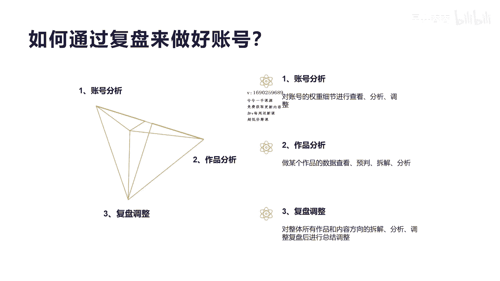
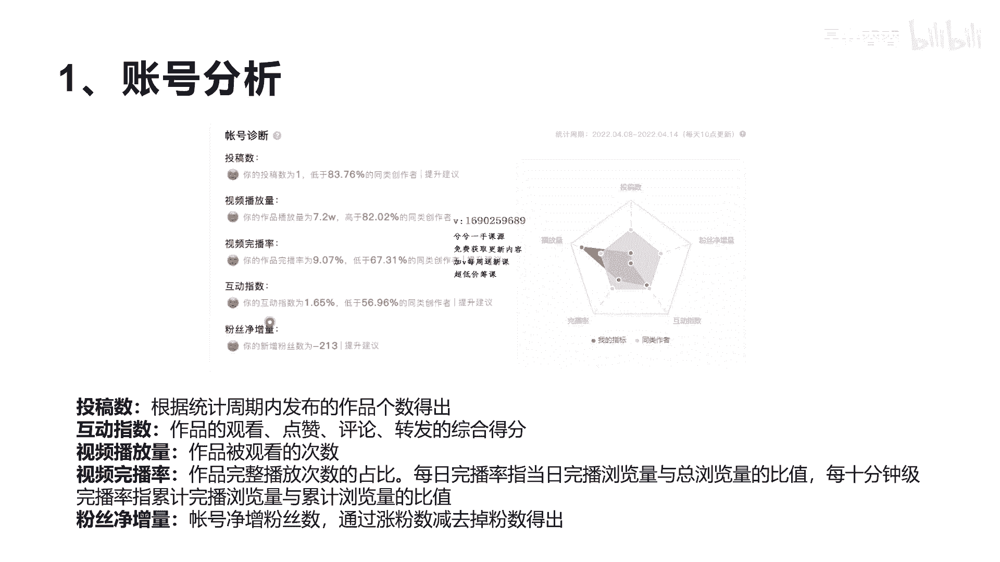
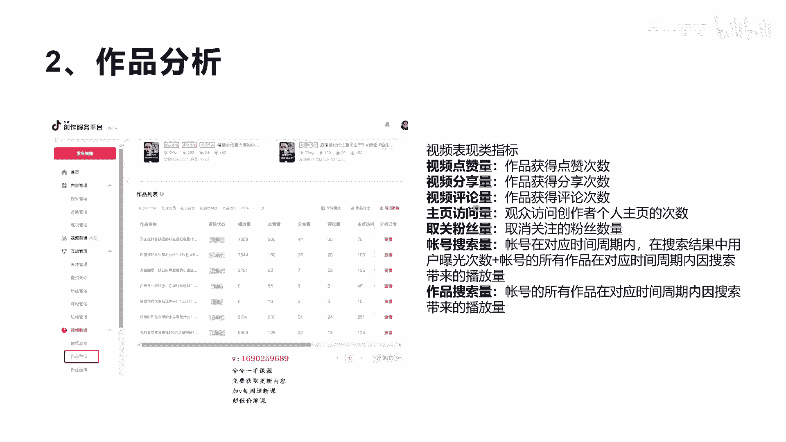
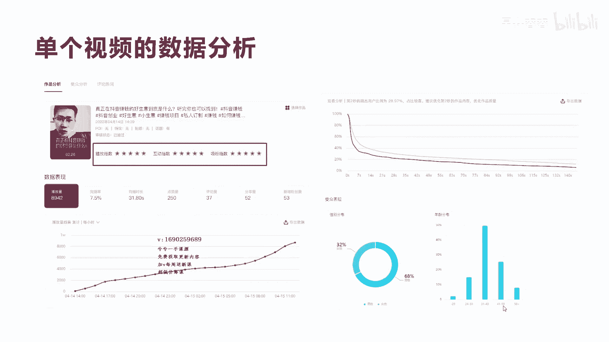
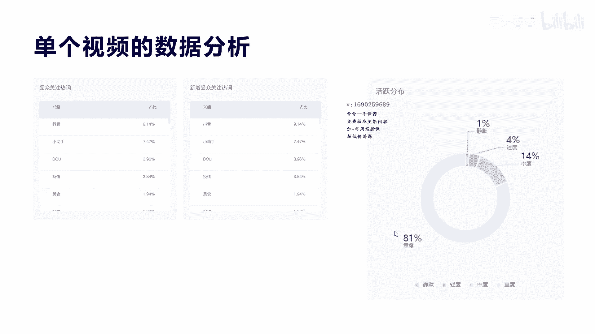
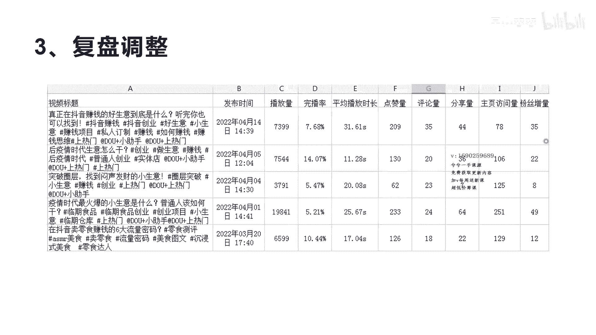
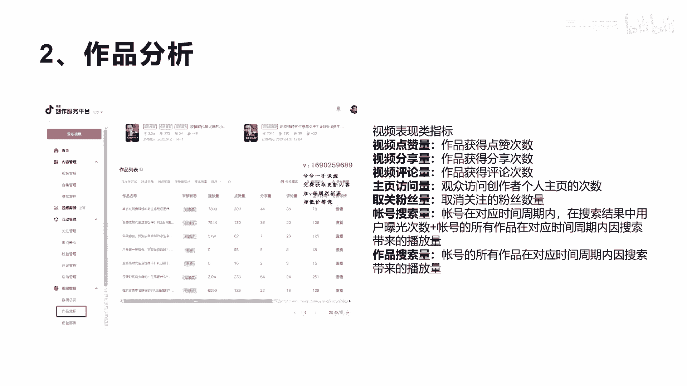
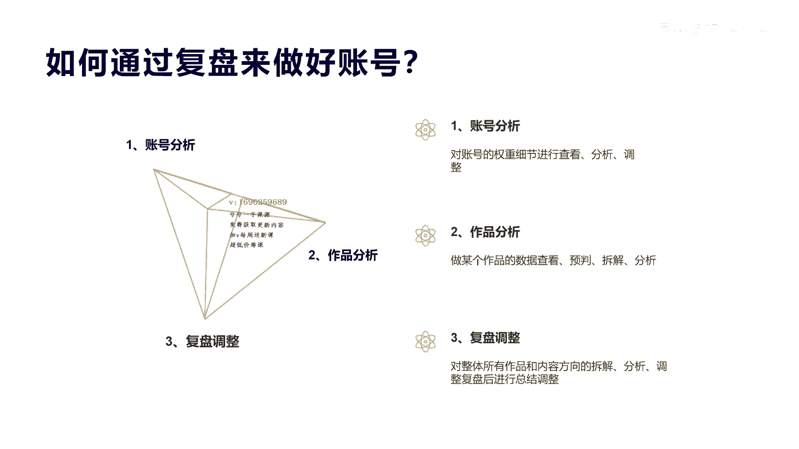

# 042 2023抖音快速起号必修课 - P17：第17节如何数据复盘-请收藏 - 早安睿睿 - BV1Gn4y1o7rC

好，今天我们来教一下如何通过复盘来做好账号啊，为什么要复盘啊，因为我们所有的这个运营来讲，复盘是最关键的，我不知道大家做过传统电商没有，复盘是非常数据复盘，运营复盘是非常重要的一个环节。

包括我们讲的平台的呃，运营也好，它也是需要大量的复盘的，呃对于这个抖音的这个账号来讲，我们复盘呢分三个方向啊。

就是我们讲的短视频账号的这个复盘，哪三个方向呢，第一个是账号的分析，第二个是作品的分析，第三个是整体的复盘调整，那么通过账号的这个分析呢，第一个主要是呃对账号的权重。

以及他们的相关的一些参数进行一些查看，然后分析以及调整，然后第二个呢是通过作品，某个具体的作品的一些查看，包括他的数据的一些拆解，包括对数据的一些分析，然后来判断你的后续的方向。

那么第三个就是复盘的调整，也就是对所有的内容短视频的一个拆解分析，然后我们进行复盘进行调整，这个实际上所有的这些数据来讲，都可以说是在抖音已经呈现给你了，所以并不需要我们再去做某一些相应的工具啊。

或者获取某一定的数据啊，比如说我们来看一下啊。

呃我们看一下这个啊，叫账号分析，其实大家看到这个上面这个图，账号诊断实际上是我们在这个创作者服务中心，用PC版啊，用电脑版去登录，完了之后，在这个呃数据分析里面，会有一个账号诊断的一个这样的内容。

左边呢这个账号诊断的五个大块，一个是包括投稿数，视频播放量，视频完播率以及互动指数，还有粉丝净增长，这个右边呢就是左边这个图的一个图形展示，这个图形展示有什么好处啊。

它实际上可以很直观的看到你在各大维度里面，哪一块是超过了同行创作者的，哪一块是弱于同行创作者的，那么你这可以做相应的很直观的调整，比如说我们讲这个播放量，我们在同类五个维度的这个额指标上面。

我们的播放量它是超过同行的啊，我们看一下这个播放量，超过同行82%的同类创作者，但是你的投稿数和粉丝净增长，还有互动指数以及完播率都是低于同行的，而且越靠中心啊越低，我们看到互动指数稍微高一点。

是不是接近于这个同行，而我们的粉丝增长数已经达到了负值是吧，那么通过这个图，你就可以很清晰的知道我要怎么去啊发力，实际上我们对于啊，整个这个抖音的账号的逻辑来讲，他这个顺序来讲，你也看得出他首先得投稿。

就是你得日更啊，你得日更，或者是说你得两天三天频繁的去更新作品，而且是优质作品，这就是它如果你每天都更新作品，那么你相应的你的投稿数就超过同行这个多少，然后你的投稿数的同时。

带来你的你的这个内容播放量就会相应增加，那么内容播放量的增加主要是靠什么，靠你的内容质量，你的内容很好，所以就有很多的播放量给你是吧，你的完播率才会相应的保持增长。

包括你的互动指数跟你评论的人也会很多是吧，这个时候相应的都达到指标之后，你最后的粉丝关注度也会很多，那么取就不像我们这个取关度达到了负数，那你的就会成正数，而且会高速增长，超过同行是吧。

那么从其实账号分析来讲，这个维度这个啊，数据就是最好的一个，账号分析判断的一个依据啊，我们这里再解释一下投稿数，它实际上就是刚才讲的在某一个周期，其实他这个维度就是七天啊，七天的一个周期。

七天的一个数据分析啊，比较准确一点，七天你发的作品数量是一，那么你低于如果七天发了七个作品，那你肯定是大于同行创作者的，因为能做到日更的还是毕竟很少，那么第二互动指数啊，这一块就是我们讲的观看啊。

点赞评论转发这种互动指数的综合分数是吧，我们这里也是低于1。6额，低于同行56。96%的，那么视频完播率大家都知道，视频观看的完整度啊，视频每个视频的这个流量和看完的人，和没有看完的人一个比值。

完播率越高，说明你的视频看完的人越多，那么你的视频质量越好，这个是大家都比较清楚的，一个叫完播率，那么最后讲的竞粉丝竞争者，他就竞争者啊，他因为有很多人每天都在取关，并不代表他关注你，他就不能取关了。

因为很多人他喜欢关注，也喜欢取关，所以你的粉丝要让他不取关，你必须要做到什么，你跟粉丝的互动，你让粉丝觉得诶你的这个账号就是很好，就是让他每天有惊奇的内容出现，他才会持续的关注你，不然他会取关的是吧。

好，那我们看完这个账号的分析呢，呃我们再看一下作品啊，这个账号的作品的登录界面，是我自己的这个创作者服务平台，那登录创作者服务平台之后呢，我们会有看到一个数据的一个菜单，那么这个数据菜单呢。

它就是在这个这个左边这里啊，然后下面分为数据总览和作品数据，粉丝画像等一些相关的维度的数据，我们看到这个呃数据总览，就是刚才我们第一个呃PPT的一个截图，那么我们现在看的是作品数量，作品的数据呢。

它是所有的你在一个月之内的，所有的短视频的相关的一个列表，这里它也会显示出详细的每个视频的播放量，点赞量，分享量和评论数，以及相应的减相应的数据，包括取关粉丝量，账号搜索量啊，包括作品的搜索量。

都会在整个这个体现，那么我们可以通过右边的这个导出数据，来把整个的这个相关的所有视频的数据，可以导出去，导出去之后呢，你就可以对于导出去的数据进行一个，详细的分析啊，至于这里面的视频点赞数。

分享数和评论数这些我就不做解释了啊。

这个大家可以看一下比较清楚啊，然后我们来看一下，我们这个单个视频的数据分析，单个视频数据分析呢它分为作品分析，受众分析和评论热词分析，当前我们看的是作品分析，这个作品分析呢就会有很多数据。

包括你的额数据表现，包括你的当前的这个播放指数，互动指数和细分指数呃，说明你的这个播放指数很优秀，互动指数也很优秀，吸粉指数也很优秀，我们看一下具体的数据表现，它的播放量接近9000啊，完播率是7。

5%，那么均播时间是31秒啊，我们总共这个视频的播放时长是二两分，26秒，点赞数是250，评论是37，分享是52，那么新增粉丝数是53，所以从这些参数可以看出来，你整体的这个视频的播放值额。

数量和指标还是不错的啊，我们看下面这个播放量的趋势，它也是呈不断的上升趋势啊，也是在一天20这个24小时之内，他一直在呈趋势向上啊，将要突破一，将要突破1万，它还在增长。

这个数据你也可以通过导出数据来获取来分析，光看的这个分析啊，观看分析，这里有一个这样的趋势图，这里有两根线，浅色的呢是代表的同行热门的视频的，他的这个完播率啊，每一秒看完了用户的数量的比值。

那么你的这个深色的红色呢就是你的比值，那所以如果你的比值是在同行之下，那就说明你的视频不如同类竞争这个热门食品，那么如果这个浅这个深色的红色的在之上，那就说明你每一秒动作，每一秒的内容都非常吸引观众。

都超出同类播放这个内容创作者啊，那么你的内容作品是视频质量就非常好，这样好的情况下呢，你被推上热门的可能性就非常大，如果低于这个线的话，你的被推上热门的可能性就会偏低，但是也不绝对化的。

就是你在之上比所有同行的播放，每一秒套出率高，就一定会让你推上热门，也不一定，它还是根据有一些相关的维度，比如说它人工审核啊，二次推荐，三次推荐是吧，或者你的相关的这个什么，你的评论数以及点赞数。

是不是也是同指标能达到那个值，他才可能最终触发上热门的那个机制，呃当然这个地方也可以看出来，你可以通过每一秒的动作，每一秒的内容来判断，你后续在内容创作的时候应该怎么去调整，比如说我们在前七秒的时候。

潜意识四秒的时候一定要抓眼球，那么抓住眼球他才可能持续看下去，那么你后面的数据就会好很多好吧，我们再看一下受众观，受众表现，这里啊受众表现这里分为两个，一个是性别的分析，一个是年龄的分析。

性别就是说你的短视频所带来的啊男女的比例，你看的很明显，我们这个男性占多，因为这个创业这个内容来讲，对于男性还是偏多一些，那女性创业的少一些，所以主要是偏男性，那么年龄分布呢，我们的主要你看到偏50%。

是在31~40岁之间，也有41~50岁的，因为这一群人的男性创业的想法是最多的，那么20岁左右的呢，其实他还是刚毕业，对创业的这个能力来讲，各方面经验来讲还是缺少，所以一般来讲。

三四十岁到50岁之间的这些人群，创业的内容比较多，所以你就可以不断的输出，关于他们30岁或者35岁以及40岁，我们应该怎么去创业的一些话题，来勾起他们的这个呃关注度，包括你的他们这个三四十岁。

50岁一些这种痛点和创业的痛点。

可以进行一些挖掘，制作你的这个选题，好吧啊，那我们再看一下这个受众关键关注热词，这里也很明显啊，包括新增的受众关词，这里面都会看到一些这种热门的一些词，比如说抖音啊，小助手啊，疫情啊是吧，美食这些内容。

都可以体现出你在内容创作的时候，去关注的一些词和抵触疫情，这个可能对于很多啊这个粉丝来讲，他关注这些疫情的情况呃，包括我们讲美食，那么美食可能是你的粉丝里面，或者你的用户群体里面比较关注的。

那你可以不断的去做一些美食相关的一些，话题和内容是吧，那么这个右边角的活跃分布啊，活跃分布，其实他就是说你这个观看你这个视频的一个，或者是整个账号的一个呃粉丝的一个呃活跃度，那么重度。

那就说明他非常活跃啊，81%的人都还是比较啊，比较比较喜欢看，或者是在抖音上面比较活跃，但是有1%的人呢，这里显示是静默静默，就是说他其实实际上是没有怎么去动的，也没有怎么看视频是吧，他很少看啊。

这种可能有些是机器粉，那轻度呢就是说它还可能会看，也会关注你，但是他可能对你的评论啊，互动少，也不会私信你，也不会加你的群，也不会点你的赞，也不会关注你，中度就是诶他可能呃对你的视频有一定的兴趣。

对你账号，但是他不是那么非常喜欢啊，那么我们这个还效果还不错，有81%的人对你的这个账号。

对你的内容还是活跃度很高，好我们再看一下，第三点就是复盘的调整，这个复盘的调整的目的呢，也就是我们通过系列的，就是刚才我们前面导出去的所有的这个内容，进行一个二维表的一个分析，这个二维表的分析。

他其实可以起到很多对比的作用，那你可以通过对比的方式，各维度指标对比的方式来判断，你应该怎么去调整你的内容，和怎么去吸取你的好作品的一些优点，和放弃一些缺点，我们看一下第第四个。

这个他的疫情时代最火爆的小生意，这个播放量快2万，但是他的完播率只有5。21%，他的这个点赞数233，评论数24，分享64，包括他的主页访问数达到251啊，粉丝增长只有49。

所以这个视频其实你会发现它播放量还可以，但是没有上热门啊，只是达到了一定量的这个呃播放量，但是它点赞率很低是吧，5%点多，连基本的这个7%都没有，是最低的是吧，最低的。

那就说明你这个内容实际上没有触发到胡子师，第一个是从完播率来讲，他五秒完播率很低，那么他看你这个视频的第一眼，他其实没有让他抓住很多人就走了啊，第二点来讲，疫情时代这个话题它是很热门的。

所以系统给你了2万流量，通过这个呃你可以了解到，那么第三个呢，他的吸粉，也说明你这个内容真正的没有让很多人觉得，想关注，你，还没有讲到点子上面，或者是说你的内容还缺少那么一点真正的干货。

或者是能吸引他到的那个刺激点，还不够有有共鸣的方式，所以这个地方你就可以去持续再输出一个，疫情的啊时代的一些作品啊，他肯定会有流量来，而且可能很大，因为对于现在这个疫情时代的话题来讲。

那么你可以再把这个话题，通过另外的方式把它进行一个输出啊，重新再做一个，那么我们看一下这个第四个，这里突破圈层啊，找到闷声发财的小声音，为什么它只有3000多的播放量，点赞率和那个完播率也很低是吧。

都很低，他吸粉啊，这些个维度的数据都很低，我后面我们分析啊，第一个就是突破圈层，这个东西门槛太高，就是很多人不理解什么叫圈层啊，理解上面太难，第二个内容讲的也比较绕，让这个整个的人呢没办法听下去。

前面就没有抓住他的这个痛点，所以他整个就是整体的播放量和完播率就很差，通过这个作品你可以分析到，就是这种认知比较高的，或者是说它需要人去思索的这种内容，最好不要在文案里面去过多的体现。

你会觉得很高级很专业，很深度，很好很很好的一个作品，但实际上这个文案对于用户的听觉和视觉来看，这个作品的时候，他觉得听不懂，不知道你在讲什么东西，对于普通人来讲，他可能他根本没办法理解。

那就说明你的用户粉丝和推送给你的用户，他没有达到这个层次，那么后面就不要再去做这种类似的门槛的，这种视频了是吧，那么整个对于我们来讲，你就知道了用户喜欢什么样的内容啊，所以呃通过这个数据分析。

你大概就清楚了，那我们看第二个这个作品，他的完播率是最高的啊，这个你看到没有，也是讲的疫情时代的声音怎么看啊，但是他为什么完播率高呢，我们也分析了啊，因为本身这个视频只有30秒，播放了这个14秒。

说明这个短视频来讲就是低于60秒，低于15秒，低于30秒的这种视频，他的内容只要很干抓住话题，他的这个完播率会普遍升高，所以你想把整个账号的完播率进行提升的话啊，你可以前期做一些短的啊，因为你越做的长。

他的完播率是肯定越低的，好在起号的时候尽量的做一些啊，短一点的，一分钟之内的，不要做太长的，30秒，40秒了是吧，那这样你的完播率只要内容好，你的完播率是比较高一点的。

会对你整个账号的这个完播率会有提升，再加上我们这也可以验证啊，你看他有7000多也算还是流量不错的，所以疫情时代你选话题，选热门话题的时候，一定是对你这个流量有帮助的，但是他的点赞率和粉丝增长都很低啊。

都很低，这也说明了你的内容创作上面，或者你的表演上，演艺能力上面欠缺，包括你的场景是吧，所以这个也需要你去打磨，我可以换一个场景啊，换一个方式去拍，可能更好一些，那么整个来讲呢。

通过这种数据维度的去分析，你大概就可以去判断我们到底应该怎么去做，那么后续怎么去调整，所以复盘是非常有用的，可以有很多这种信息出来，你把你分析的这些结果，通过你的内容在这个表格后面。

你可以加一个自己的一些内容观点，包括怎么去调整的一些内容去写写进去，这样也便于你后期不断的去啊去调整，不然的话你像我们刚才这样，你看完之后就忘记了是吧，忘记就不知道下一步我们怎么去做啊，怎么去调整。

整个来讲呢我们就分为这三步，也就算数据复盘，对于短视频来讲，我们分为这三步。

第一个是账号的分析，第二个是作品的分析，第三个是复盘的调整，一定要去调整，你只是看没用，要去做啊，罗列做分析，做总结，账号的分析是对于整个账号权重，作品呢，是对于某一个独立单独的视频作品，进行一个分析。

最后我们讲复盘，就是对所有的账号和你的内容方向一个复盘，然后总结出一个相应的调整的总额，然后每一周复盘一次，每一周复盘一次是吧。

这样你才会把账号越做越好好吧。