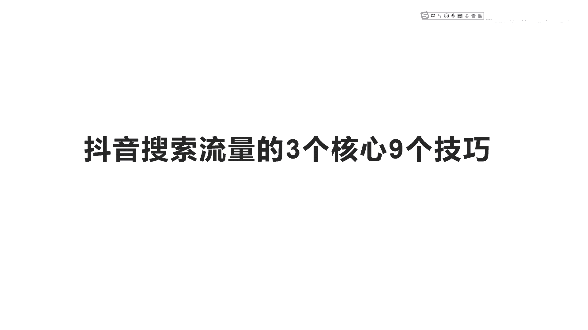
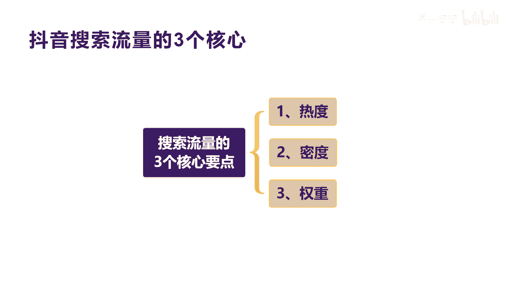
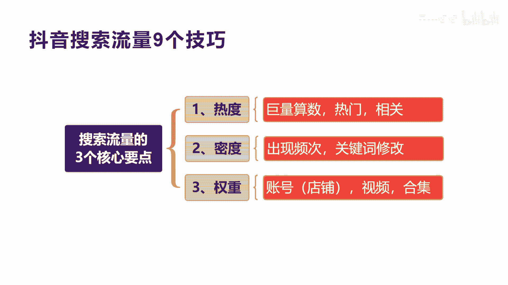
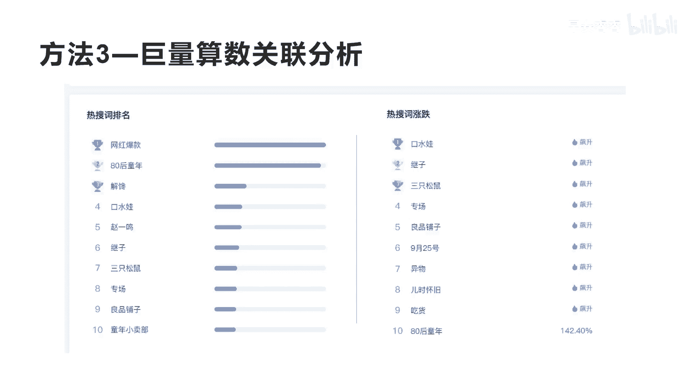
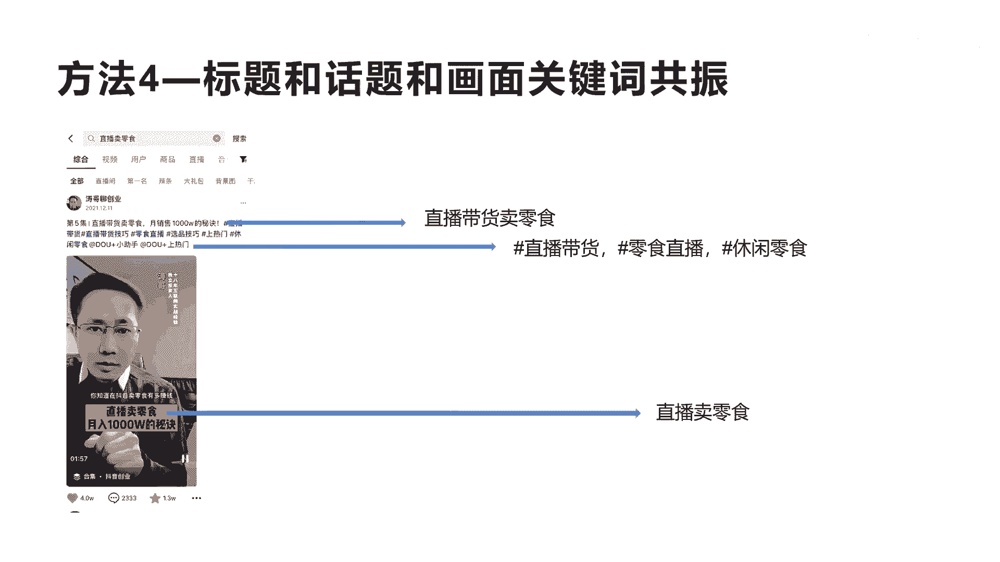
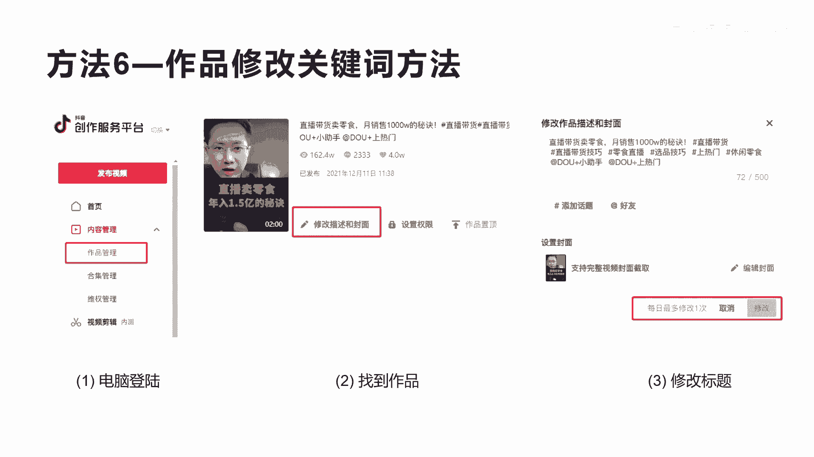
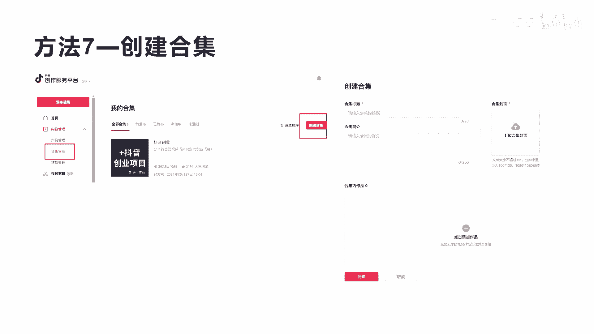
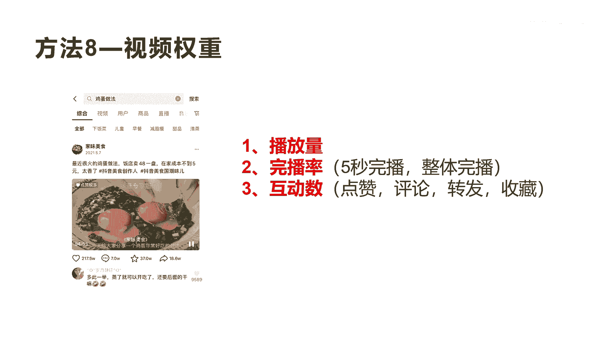
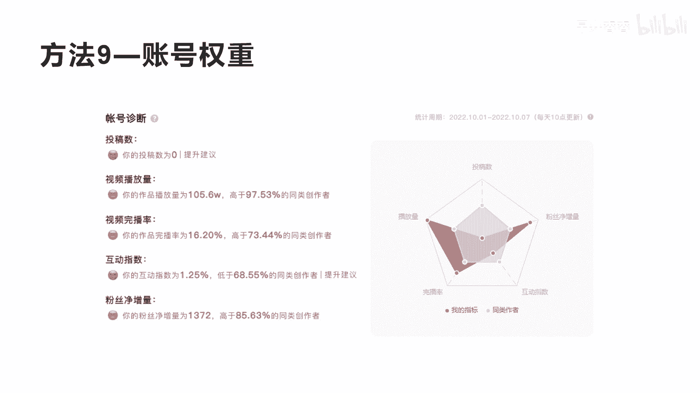
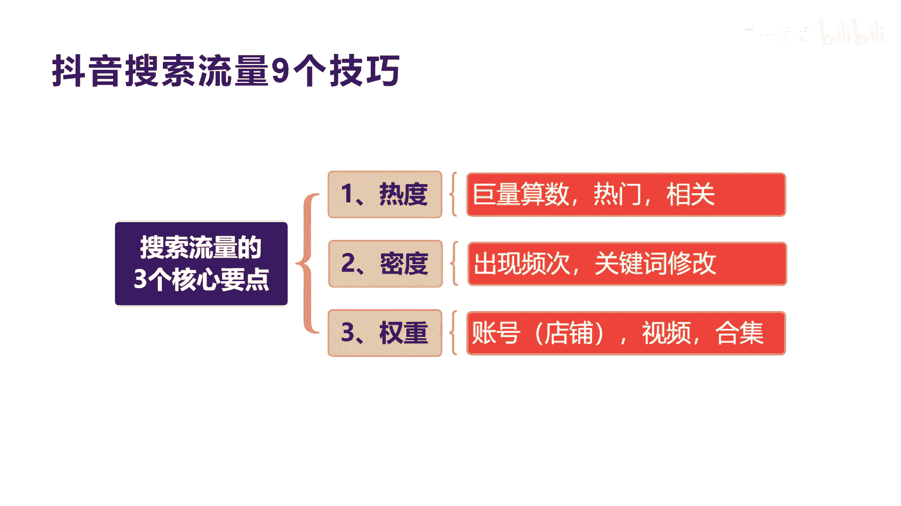

# 042 2023抖音快速起号必修课 - P18：第18节搜索流量的3个核心9大技巧-请收藏 - 早安睿睿 - BV1Gn4y1o7rC

今天我们来讲抖音，搜索流量的三个核心和九个技巧，那什么是三个核心和九个技巧啊，其实现在来讲抖音的呃搜索流量越来越注重了，因为抖音从今年开始我们说了，他推荐的这个全域电商。

全域电商其实里面包含了兴趣电商和搜索电商，搜索电商实际上是非常大的一块流量，那我们怎么去啊，在抖音做一些搜索流量。

先讲三个核心好吧，三个核心是什么，搜索流量的三个核心，第一个是热度，第二个是密度，第三个是权重，那什么是热度，什么是密度。

什么是权重，我们来看一下第一个热度呢，其实我们讲就是你的搜索关键词的热度，搜索关键词大家都知道，通过某一个关键词去匹配出相应的内容，那么这种热度在哪里找呢，其实他跟我们讲的啊。

百度的这个呃百度指数是一样的啊，抖音也会有一个叫巨量算数，这个巨量算数里面就会展现出和统计出，此时此刻抖音所有的关键词的一个搜索的情况，这里面包含了一些热度，也包含了一些词的相关词。

所以这个跟我们所说的原来的呃，做百度的这种方式实际上是一样的，搜索来讲，它一定是根据你的搜索热度，搜索的词来衡量你的啊，搜索的流量，那么第二个什么叫密度呢，密度其实就是说你的呃视频也好，商品也好。

你里面的那个标题，和你核心关键词出现的频次啊，这个频次越多，说明你的关键词的密度越高，你的关键词密度越高，你可能被搜索的可能性就越大啊，这是讲的第二个密度，第三个叫权重。

权重其实就是讲我们如果是开小店的话，他就有小店的权重，如果你是账号的话，抖音账号账号每个账号会有自己的权重，所以根据你不同的账号，你所排序所被搜索的可能性都是不一样的，好大家理解我讲的这个意思啊。

那么权重这里还我们讲过，还会有一个视频的权重，每一个视频的权重它都不会不一样，你的点赞率高，你的视频播放量大啊，你的收藏，你的等等的一些互动率比较高，你的视频的权重高，你被搜索到的可能性更大。

那么合集是什么意思呢，其实就是我们讲的大家在抖音上面去创建合集，可以把多个类型的视频放到一个合集里面，合集的权重是比视频的权重要高的啊，所以他的权重不同啊，他所得到的流量搜索流量是不一样的。

那么整个这九大技巧。

我们怎么一个个的跟大家来解释啊，一个个跟大家来讲，首先我讲一下这个热度，热度这个巨量算数，大家看到这个图片啊，他就是我们讲的巨量算数的，所有的啊一些热门的关键词的分析，还在电脑版打开啊，啊在手机版也有。

但是电脑版的内容它会多一些，在电脑版打开巨量算数之后，我们会看到一个叫创作指南，这个创作指南里面就会有很多这个垂直的领域，比如说美食时尚亲子汽车财经等等的，那么除了这个领域的选择，它下面就会出现。

你选的每一个领域的热门关键词，你看我们现在当前选的这个美食，下面的热门关键词就有好吃美食，火锅是吧，蛋糕烧烤鸡蛋等等，这些都是我们讲的热门的关键词，你可以根据这些核心的热门关键词。

去找到这些关键词的相关的长尾关键词，通过这些长尾关键词可以去做你的内容，可以把这些内容放在你的视频里面，也可以放在你的店铺的关键词宝贝里面，就是我们的商品的标题，通过这些关键词的分析。

你可以知道用户现在在抖音上面，怎么去搜索内容的，他喜欢搜索什么样的内容啊，所以通过分析之后，你才知道哦，原来我的产品应该怎么去设置设置标题，我的视频应该怎么去设置标题啊。

所以这就是我们第一个讲的就是方法，一通过额巨量算数的热门关键词进行分析，包括下面这里会有一个，我们看第三个选项叫创意洞察，这个创意洞察里面有热门关键词，有热点事件，还有热点话题，热门的视频等等。

都可以在这里面进行检索，所以这个平台是非常不错的，一个可以让你啊去分析这个平台的关键词，的一个很好的工具，好这是我们讲的第一个技巧，第二个技巧就是我们在巨量算数的这个上面的，第二个菜单会有一个算数指数。

这个指数是什么意思呢，就是你可以像百度指数一样的，搜索很多这种相关的关键词，然后你去匹配匹配，搜索出来之后，你会发现下面会有一个搜索指数，搜索指数不同，你看到没有，每一个。

比如说我们这里搜索的这个临时还有卖零食，还有直播零食，这三个内容里面，其实临时的搜索次数，你看下面有个数叫平均，有61。1万，他最高达到了150多万，在最近的这个时刻，这个是临时的这个关键词。

被搜索将近接近200万了啊，而卖零食呢它的平均值呢只有6600，而直播临时这个词的平均值只有455啊，就偏低，就是你可以通过算术指数这个频道这个工具来，不断的去找到你那个核心关键词，最热门的相关词。

把这个词给提炼出来啊，对比你相关的其他的词，这样你才可以更精准的能抓到和分析出，你的核心的那个词，好吧，这是讲的搜索流量，其实核心在于搜索的关键词，搜索关键词呢呃分析和寻找，以及搜索关键词的组合。

它才可以真正提高你的被搜索到的可能性，和你被搜索的流量啊，这是底层逻辑，这是讲的方法二，好吧，那我们看看方法三，方法三就是巨量算数的关联分析，在巨量算数你去打开之后，下面会有一个关联分析。

关联分析下面就会有，比如说我们输入一个临时，那么这里会有一个关联分析，关联分析下面我们看中间这个圆圈，越在中间的，他被关联搜索到的可能性越大，比如说我们现在搜索的临时，那么跟临时相关的还有网红爆款。

是不是八零后童年诶，也就是说如果收零食的话，你如果用八零后童年的零食或者网红爆款零食，你被搜索到的流量可能性更大，大家理不理解这个意思好，这就是我们讲的通过巨量算数这个关联分析。

你可以去得到更多的我们讲的啊，核心关键词或者长尾关键词知识点到第三点，那么通过这种方式，你还会发现在最下面，在巨量算数的最下面，会有你刚才搜的这个词的热搜词排行榜，就是临时的热搜词的排行榜。

这里会把网红爆款是第一位，八零后童年第二位，包括什么口水娃，包括等等，其他的一些相关的这个零食的品牌好，还有后面右边这个热搜词的涨跌，也是在分析出最近的被搜索，这个临时相关的词的飙升的词有哪些。

把你列出来，那么你可以通过这些词来组合你的内容，也可以组合你的产品标题，大家理解我讲的这个意思吧，好我们来这是讲到第三个方法。

我们看第四个方法，第四个方法其实就是跟着大家来讲一个视频，大家可以看一下我这个视频啊，叫直播卖零食的一个视频啊，我这个视频跑了160万了，跑了160多万，他的点赞数超过了4万的点赞。

他核心其实额有将近60万，有将近60万是来自于搜索流量，这个短视频你通过直播卖零食啊，这个词这个关键词去搜索，我是可以在抖音上面被把我的视频搜索出来的，所以他被打上了搜索，就临时的这个搜索关键词的标签。

那么这个时候我们怎么去把自己的视频，尽量的能让抖音打上标签，并且能让抖音可以识别出你的视频，有比较高的这种啊被搜索的可能性呢，啊这里给大家分享三个内容，第一个是标题，第二个是话题。

第三个是啊画面的关键词，那么标题是什么意思呢，就像我们这个啊直播卖零食，月销售1000万的秘诀，那么这个里面提到了直播带货，卖零食的核心关键词啊，当我们的话题是什么意思啊。

我们我们用井号去艾特你的话题里面，一定要带上你这个视频所对应的核心关键词，比如说直播带货，比如说临时直播，比如休闲零食是吧，这是我们在话题上面，尽量的围绕你的临时的核心关键词，去做你的肠胃关键词的话题。

那么第三个是画面的关键词，第三个画面的关键词，你会发现所有视频在这个最下方，我会有一个贴片，这个贴片你上面的内容叫直播卖零食，月入1000万的秘诀，这里面有一个核心关键词，就是直播卖零食。

所以你会发现整个从标题到话题，到所有视频内容里面的这个标题里面的画面，全部有临时的核心关键词，所以他被搜索的这个密度就非常高，这就是我今天跟大家分享的这个密度，它的密度前面讲的巨量算数。

我们去呃去搜索这个热度，那么这个时候我跟大家讲的其实就是密度，尽量的在你的标题，话题以及啊画面中间去多展示你的核心关键词，这样被抖音机器识别的啊，可能性就越大，这是我们讲的三瓶啊，三个都内容的共振。

这是第四个方法。

我们来看第五个方法啊，第五个方法其实就是视频的内容，视频的内容的中间的核心的要表达的话术啊，是非常重要的，在这个话术里面，你尽量的去重复和把你的关键词的频次加大，额话术和拍视频的过程中啊，喜欢去用它啊。

用你用等等这些词来替代掉你的核心词，其实你应该尽量的把你的核心词展现出来，就像我们这个啊，这是我整个这个视频一个文案的原稿啊，这个文案的原稿，大家可以看到这里面我标了临时123456。

将近有十几次的关于临时的这个词的出现，所以所以这个密度越大，这会导致你被抖音机器识别某一个真的时候，它提炼出你的核心关键词啊，而且这里面还有一点就是我们讲的这个直播。

在我的这个文案里面其实出现的也比较多，所以直播卖零食，就变成了我这个整个这个视频网站，被抖音提取的核心关键词，而临时这个赛道和这个词有比较大的流量，所以就导致了抖音不断的给我搜索流量，这就是核心。

大家理解我讲的这个意思啊，好我们再看第六个方法，第六个方法就是我们其实有很多人不知道，我们其实的作品啊的标题其实是可以被修改的，可以被修改了，就是你的这个作品其实发完之后，发出去之后。

你还可以进行修改啊，这里我们可以感讲到这个步骤啊，怎么去修改这个修改，其实用呃电脑版的创作者服务平台去登录，登录完之后呢，呃第二步就是找到你的这个呃作品视频作品，然后在视频作品的这个第一个按钮。

就有一个修改描述和封面，点击修改描述和封面之后呢，你就可以去对你原来发布的作品的标题和话题，以及封面进行一次修改啊，每一每天只能修改一次啊，每天只能修改一次，就是一个作品啊，每天只能修改一次。

所以这个方法其实可以，把你原来做的一些权重高的短视频，播放量比较大的短视频，可以去匹配一些核心关键词，让它可以给你带来一些这种我们讲的啊，搜索的可能性啊。

这是我们讲的第六个方法啊，六个方法，第七个方法就是讲到合集，合集非常重要，就是刚才我一直讲过合集它的权重大于视频，所以你们要想啊把自己的啊搜索流量提高，尽量每个人都去创建合集。

合集里面尽量放一些同类型的和视频，比如说这个我们看啊呃搜索零食，你会发现排在第一个默认的就是一个合集，就是一个合集，所以它会比一些不创建合集的视频的权重要高，就会排在前面，大家理解我讲的这个意思啊。

那么第二个就是我们讲的后面我们这个视频啊，就比如说鸡蛋怎么做，鸡蛋怎么做，他搜出来的结果也是这样，就是他你看这个视频下面会有个合集，是不是，所以他做合集的这种内容，他一定会高于高于其他的视频的排序。

你被搜索到的流量的可能性就越大啊，这就是我们讲的这个第七个方法。

第七个方法这里还给大家介绍一下，就是怎么去创建合集，合集其实也就刚才讲的叫呃用PC版的啊，创作者服务平台去登录，用电脑版去登录，登录完之后呢，就会进入到创作者服务平台，左边会有一个合集管理。

你点一下合集管理里面就可以去创建合集，这个创建合集，你点了这个按钮之后呢，它右边会出现合集的标题简介，包括合集的封面啊，包括合集里面的作品的添加啊，那么你自己去创建一下自己的合集，然后把自己的啊。

其他的视频放到这个合集里面来啊，这就是我们讲创建合集的一个方法。

好我们再看第八个技巧，第八个技巧其实就是刚才我也提到过，就是就是我们讲的第三点，第三点就是权重，权重，其实来讲就分为我们刚才讲过视频的权重啊，视频的权重，视频权重，其实如果你的播放量。

你的是某一个视频的播放量很大，你的完播率很好，你的互动数很好，这些相关的指标非常高，那么你被搜索到的可能性会更大，尽量的去提高我们讲的视频播放量和完播率，和互动指数比较高的视频，去提高它的啊权重。

可能被搜索到的可能性更大。

这是讲到第啊八个方法，第九个就是我们讲的，其实账号的权重，每个账号每个抖音都会有自己的权重，权重不一样，被搜索到的可能性就不一样，所以你会看见我们整个账号的权重，其实是跟投稿数，就是右边这个图啊。

右边这个图会有投稿数，播放量，完播率，互动指数以及粉丝净增长，这五大维度来决定你的账号权重，每一个账号权重不一样，你被搜索到的和你被推荐的流量，以及你相关搜索流量都会不一样啊，都会不一样，所以尽量大概。

大家去按照这五个指标去提高你的账号权重啊，比如说你的投稿数不行，那我这每天多发一些视频，一个礼拜发三个四个，是不是你的播放，你的播放量不行，你可以用一些什么啊，做一些优质的内容。

或者用一些抖家的方式去助推啊，完播率不行，你尽量要把每一个作品的完播率设计的好，不要做太长，对前期来不要做太长的视频，太长的视频，你如果表达能力不行，设计视频的人能力不行的话，你的完播率会非常低。

你看呃涛哥的金，刀哥的这个完播率是10%，就中间这个啊是16。2%，高于同行73。44%，我的播放量是105。6万，就七天啊，这是一个七天的一个维度的一个权重统计，我的播放量是高于90%，7。

53的同类型创作者啊，而而我的粉进进，粉丝净增长量呢达到了1372，也高于同行的85%，所以各大指标都高于同行啊，唯一的就是这个互动指数低一点，那互动指数其实就是讲点赞数和评论以及收藏。

那么互动数怎么去提高呢，其实也是在你的多输出一些干货啊，他可能就会提高，因为我最近讲了一个比较泛的一个内容，所以点赞率不是很高啊，点赞率不是很高，好，这就是讲的账号的权重。

那么刚才整个跟大家讲的就是我们讲的呃。

搜索流量的三大核心，第一个是热度，第二个是密度，第三个是权重，那九大技巧，刚才也跟大家讲了巨量算数热门相关，以及出现的频次密度，包括关键词的修改，包括我们讲的账号的权重怎么去设置啊。

包括视频的权重的提高，以及呃合集的创建，这就是我们讲的最基本的一些搜索流量的啊，一些这种技巧，所以整个课程就把这个内容分享给大家，希望你们在做短视频和做店铺账号的时候啊，能提高一些自己的搜索流量。

因为搜索流量是未来抖音可能会，重点发力的一个方式，所以希望大家一定要重视起来，一定要重视起来，搜索次数已经超过了百度，所以你们一定要想清楚抖音的一些搜索的玩法，其实会被以后百度的那些相关的一些玩法。

会重做一遍，好不好。

