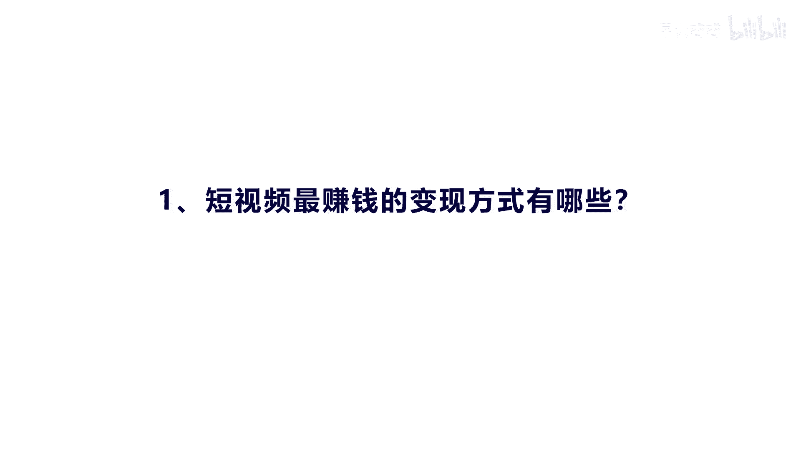
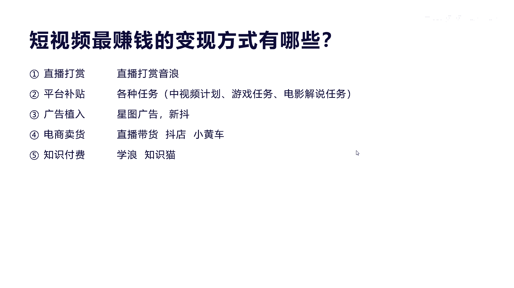
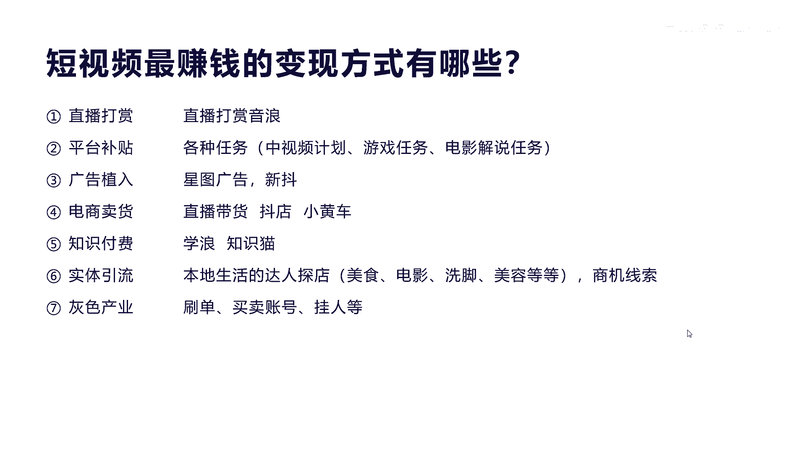
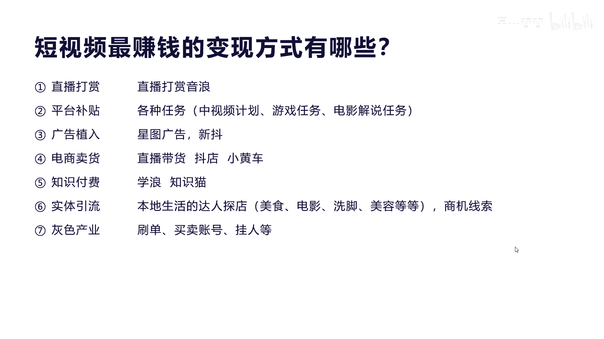

# 042 2023抖音快速起号必修课 - P19：第19节短视频最赚钱的变现方式有哪些-请收藏 - 早安睿睿 - BV1Gn4y1o7rC

好今天我们来讲第五大节怎么真正的华丽变现，我们前面不管讲到是内容也好，流量也好，定位也好，最终你的目的是什么，你到抖音，那不是娱乐的，你一定是来兑现的是吧，来赚钱的啊，如果你是来娱乐的。

我相信你也不会买这个课程是吧，那么我们怎么去变现呢，怎么去华丽的变现呢，就是最好的变现方式是什么呢，我们主要从四个方面来进行讲解啊。

那么第一个就是讲的短视频，最赚钱的这种变现方式有哪些，我们会罗列出来哎然后让大家来选择，或者是我告诉大家，有哪些核心适合你的变现方式，那么第二个就是如何设计，直播间最赚钱的一种印钞模式。

其实对于我们来讲，在做直播带货的时候，你是纯粹的进行产品销售，其实是很难在抖音进行啊转化的，因为抖音它是一个内容电商平台，所以这里我们会讲一个印钞模式啊，就他有哪些适合在抖音做，而且他会持续性的做。

我们会举一个例子，第三个我们讲的就是，做好直播带货的核心秘诀是什么，其实直播带货它是有一定的方法的，他不是说呃，大家把这直播一开启就可以卖，就可以卖的很好，他有一定的方法和秘诀。

但是我觉得核心是我们讲的的一个点，这个到时候我们也会讲啊，第四个就是如何选择适合你自己的赚钱方案项，因为每个人他的优缺点不一样，你的特长也不一样，或者说你的能力有差异是吧，有有些能力很强，运行能力很差。

还有就是你的投入不一样，比如说我愿意投更多的成本资金，进来做这个创业，有些我没有成，我没有钱，我不想投入是吧，那我就可以啊，低成本的去选择适合你的方向，所以这个地方第四点我们会讲你怎么去选。

有一样有一定的这种方法，让你去选择自己赚钱的方向，那么整个这个华丽变现呢。

额分成四大块，我们先来看第一个，第一个就是短视频最赚钱的变现方式。

到底有哪些，第一个呢就是我们讲的这个直播打赏，这个大家都比较了解啊，有很多这种呃直播间他也不卖货是吧，他就pk我们之间互相打架是吧，互相pk，然后那个有很多观众就看到就会去送礼物是吧，送礼物。

然后呢通过礼物打赏来赚钱，这赚的是音浪的钱，呃这种方式其实对于很多这种普通人来讲，其实是很难做到的，他这个形成了一个非常大的产业链啊，就是包括额怎么去做做大号，然后怎么去开这个直播。

然后怎么吸引观众的去这种氛围，然后让大家去打印呢，啊他是有一套完整的一个产业链的啊，这个一般来讲对于普通人呢，还是我建议不要去做，但是因为他是抖音主要核心，比较赚钱的一个方式，因为它音浪来讲。

它不像实体的这种产品，它是有成本的，对音浪来讲，它它是个虚拟产品，就像我们的手机，手机流量呀等虚拟产品，它成本很低是吧，或者是说他是真的零成本，所以我们讲呢比如说我们打个音浪啊，送个嘉年华几千块钱。

但实际上都收了一半的费用走，那么对普通的这个博主来讲，他可能只拿到多少，拿到一半的钱，但是拉到一半的钱也很不错啊，这个是纯利润的，所以他利润是非常高，能做到这个境界的博主很少好。

我们来看第二个就是平台的补贴，平台的补贴可能大家都接触过，包括我们讲的很多这种任务，像中视频计划，中视频计划任务是什么意思呢，就是呃可以在西瓜视频，因为抖音它有一个辅助的平台叫西瓜视频。

在西瓜视频上面去发布横屏视频，超过3分钟，2分钟的这个长视频，中长食品它就叫中视频计划，那么一定要有一定的播放量之后呢，他就可以就可以给你相应的补贴，比如说有10万的播放量，这个视频。

那我就给你100块钱或者1000块钱，那有一定的比例啊，那么这个视频呢，实际上对于普通者其实也不是很好做，因为什么呢，因为你的视频如果播放量很大额，那说明你的创作能力和你的各方面的内容，创作还是不错的。

那你这种去做这个中视频来讲，其实得要有很好的这个内容长期输出的团队啊，对内容创作的要求是非常高的，你如果是只有普通的三百五百的这个播放量，其实是很少的钱，或者是他根本还达不到他的门槛啊。

可能给一天就几块钱是吧，十几块钱一个月最多几百块钱啊，这种他付出的这种劳动，付出的时间，他其实跟收益他还是不成正比，所以他一般是属于大玩家来做这个东西，他收益比较高，比如说一个短视频中。

视频来到了100万的播放量，那100万的播放量，他可能给你的补贴大概就是啊五六千块钱是吧，第二个讲的游戏的任务和解说的这个任务，这个有很多人他比较擅长于哦玩游戏，做任务他就可以赚到游戏相应的供应商。

推广游戏的时候的一些这种补贴，电影也是一样，有很多这个宣传性的电影啊，他需要有一些主播来解说啊，他会发布一些任务，然后这些任务呢，额相应的这个博主就会去接这些任务之后，完成了视频的一些发布。

那就可以获得一些相应的奖励，这个等等啊，有很多这种平台的这个任务奖励呃，这是讲的第二种，我们看第三个就是广告词，广告营销就有很多这个呃博主啊，他有一定的粉丝量之后，比如说50万。

100万或者1000万的粉丝之后，他就可以到星图广告里面去开通接广告啊，这个广告的额报价呢你可以自己设定，比如说我有100万的粉丝，那我接一个广告，大概定个呃1万块钱啊，30秒之内或者60秒之内。

那么这个对于普通用户，普通人来创业来讲，你如果只有1000粉丝或者两三万粉丝呃，其实有很多博主他是接不到这种广告的啊，或者他接广告的这个单价就很低，比如说就一两千块钱或者几百块钱。

这样的话你你其实来做这个东西，成本也就划不来，因为你要做一个这样的，按照他的要求去做一个内容，首先来讲它是有一定难度的，他需要你对他的要求，做一些内容设计和拍摄是吧，如果没达到要求，他是不会给你钱的。

再加上呢他如果你是粉丝很低的话，呃你的播放量很低的话，他其实他不会找你，因为他划不来，他也要花时间，但是有一些平台呢，像我们后面写的这个新斗，它实际上就是对于很多这种他又出不起钱，又想推广的，他招一大。

他找了一大批这种中小博主，23万34万的或者10万粉丝的博主，批量每一个给2000，我找50个哎，也不要出多少钱啊，5万块钱，然后我可以让更多的人帮我去传播啊，这样它其实带来的效果可能还会好一些啊。

但是我建议普通人呢前期不要想这个广告植入，他一般是大V号来做比较收益比较高，比如说那我接一个广告，大概10万20万诶，这个我划得来，我就搞个团队，内容编辑团队或者是制作团队，我就养得起，是吧。

那我花个一两万的制作成本，我还能赚个8万10万的，是不是，当然对于广告主来讲，就是给钱的这个方案来讲，他也愿意给这些大网红，因为大网红的这个视频播放量，他毕竟基数在那里，他随便发一个短视频呢。

呃内容创作的能力也很强，他可以达到几10万几百万的播放量，所以他的这个性价比来讲也相应高一些，好吧，这个是讲的广告植入呃，电商的呃，卖货就是我们讲的直播带货或者是挂小黄车，还有就是开抖店这一块呢。

其实占到了抖音的一个大头，也可以说是它的一个核心发力点啊，因为我们在2020年和2021年来讲，抖音是对于直播带货来讲是发力的元年啊，发力元年，他原来还是卖这个淘宝和外链的一些这种平台。

比如说京东的一些这种商品，而到2021年，他把这个口子给砍掉了，他直接就只卖自己内部的抖店的商家的产品啊，但是也说明他的决心，就是我以后要发展自己的抖音电商平台，所以他这个红利期呢我估计还是会释放蛮久。

但是对于普通人来讲呢，实际上呃你没有很好的供应链，你没有很好的这个这个资源啊，你的产品没有优势啊，你是很难得去批量的去，或者大规模的去做那种导电的呃，小黄车这一块呢我们讲一下。

他其实实际上就是我们讲的这个呃视频带货，因为我们看到很多这个视频，它上面挂了小黄车嘛，呃那么有些人看了视频之后，直接引导他的小黄车就够了，这个它实际上的有些做得好的，我原来在短视频里面讲过。

就像这种美食，做这种呃卤料包，或者是做这种美食的，这些相关的一些配套的材料，它其实是转化率非常高的，九块九这种哎，这个产业链其实也有很多人在做啊，非常赚钱，那一般的像卖茶呀，或者是卖水果啊啊等等。

有供应链的，他直接开通抖音小店啊，就抖店啊，现在的这个门槛来讲还不算高，开个抖店大概就是两三千块钱的一个押金，然后他的收点大概也就是两个点三个点啊，不同啊，当然根据你的销量不同，它的保证金可能会有增加。

这个具体在我我的另外一个课程，美食教程里面其实有讲到啊，就是怎么去真正做这个呃美食赛道的入驻，好，这个抖音电商，实际上是我建议普通人可以去尝试，他还可以做无货源，无货源就是你卖的是抖店的呃。

商家的产品你自己没有产品啊，你可以开通你的商品橱窗，开通商品橱窗有个条件就是1000粉丝，然后呢呃你就可以开通了，开通完了之后，你就可以在你的商品橱窗里面，去选择你的这个商品啊。

有些人有些商家呢他为了推广这个自己的产品，他就把佣金设的很高，比如说25%到30，就是你卖出他一个产品呢，他就会给你相应的这个单价的20%，或者30%的这个佣金，那么你既不要囤货，也不要发货。

也不需要考虑到售货，那么到达一定的时间，他会把这个相应的比例的佣金返，返现给你的账号，所以这种对于普通创业者来讲，赚还是比较适合的，呃好我们看第第五个就是知识付费，知识付费来讲呢，呃为什么拿出来讲呢。

它是一个非常适合抖音形态的一个赛道，而且在这个上面赚钱的人越来越多啊，他有个平台叫雪浪啊，当然后面讲这个知识猫，那是另外一个第三方平台，他的知识猫呢其实它适合于什么，就是你入住不了学烂，成为不了学了。

因为学烂现在有一定的门槛，他需要有很多资质要求和一些项目证明，那么支持猫它是第三方平台，你只要有相应的这个账号能录入，就可以发布你的视频课程对吧，或者知识付费啊，抖音为什么要在这个上面发力呢。

也是我前面讲的，它实际上它是个内容电商平台，内容电商平台，它最好的方式是我不断的在上面讲内容，知识就是一个内容，讲完知识，讲完内容之后，他就可以开始什么测呃，想听更多内容开始付费，所以他这个路径很短。

他不像我们卖货啊，我们先要用内容去种草，种完草之后哎，我要告诉你这个产品很好哦，然后我们再去什么引导消费，他这个内容知识付费，它其实就很很短，而且他对于抖音来讲，他这形态就是这样的，我用哎视频我跟你讲。

那哎我就知道你很牛逼啊，或者你的知识对我很有用，然后你告诉我有什么课啊，有什么服务，我就买了，是不是它的路径，其实它展现这个内容的时候，就是就是一个产品内容付费的这种方式，他在抖音的转化率和市场。

坦白讲还是最好做的，呃我不知道大家还知不知道别的，像语音付费的一个知识平台，像叫什么喜马拉雅是吧，还有这个文字付费的这个呃平台叫知乎是吧，知乎是属于文字文文字类的啊，这种或者书籍类的知识付费。

那么这个喜马拉雅是属于什么语音啊，语音我们听故事啊，小孩子是吧，或者听听一些这个经验啊，或者是语音在车上听啊等等，还是有一定的用户群体，但是其实来讲，如果抖音出现了，你说你还愿意去喜马拉雅上面去听吗。

对吧，你也不会了，因为视频的呈现形式来讲是最立体的，最好的一种形式是吧啊，所以知识付费，抖音这个赛道一定会把知识付费给辞掉，知识付费在这个高速的这个增量增长中，我们去年看到一个数据，2021年的时候。

知识付已经达到将近几十个亿的这个市场份，它还在成为一个最高速发展的趋势，因为一后的年轻人也好，还是还是这种学习上面的人，对于这种知识的付费的意识越来越强，知识也会成为很多人创业。

少走捷径和少走坑的一种方式，就像你们买了我这个课程一样的是吧，也是想通过我的经验分享给你们，让你少走一些弯路，在认知和在各个方面的这个维度上面，缩短时间是吧，主要作用是，但是他绝对不是说你买了这个课程。

你就一定能成功，那是不可能的，所有的知识付费，就像我们说的，你要考清华北大，你要让你小孩子去学习，难道学了知识，他一学了这个老师的课程，就一定保证你考取清华北大吗，不可能的，他一定存在。

有些人他有这个天赋，他的目的其实实际上是缩短你学习的路径，让有能力有这个经验的人啊，传授这些方面的经验，让你少找坑，或者告诉你一些系统性的方法，他总结出来的是吧，所以知识付费有很多人说是啊割韭菜。

我是觉得不认同我，我买过很多这种知识的课程，原来我们说做创业的时候，做营销的时候，我就需要去了解别人一些方式方法，我付过很多这种知识付费的这个课程哦，对你提升自己的认知，对你提升你的能力是有很大好处的。

好吧，呃，那么还有一个就是我们讲的实体引流这一块啊，是所有的这个呃初学者，我觉得比较就是你啥都没有，你知识专业也没有，你货也没有，你也不想通过这个直播来赚钱，那么这个是比较好。

就是叫探店达人或者达人探店美食探店，这个有什么好处啊，就是说他对于你了解整体的视频，拍摄视频这个呃引流，包括这个剪辑，包括你后面怎么去通过这个方式去赚取佣金，他是非常适合于初学者去了解整个这个流程的。

而且他对于拍摄技巧也好，拍摄这个难度也好，其实要求不高啊，你只要到店里面去拍，然后按有一定的这个模板啊，先拍什么后拍什么，拍热闹的，他特色的拍些转换镜头，加一些音乐，他就实际上就可以开始发布视频了。

或者有些人他还干脆一点就发照片，他也可以引流，引完了之后，这个商家他只要有人买了他的团购券，他就可以把20%的佣金，比如说200块钱的消费券，团购券，你让人买了，那么这个200块钱你分20%。

你就分40块钱，然后第二个人买了就看着你的视频就买了，第二个人买了，你又赚40，这样如果你的视频一旦爆了之后，有那么几十几百个人付，你就躺赚就躺赚，当然这种方式我建议啊。

就是我在短视频里面讲过要做这种东西，如果你有能力先用一个号去练习，练完了之后我们怎么去复，去做什么做复制做复制，然后你去做什么做矩阵或生产，十个号，总有一个号会报，总有一个号会报是吧啊。

或者是呃我可以多招一些下属，我自己把传授经验给下面的这个探店达人，哎他们也属于你的分层范围之内，而这种方式做组织做裂变啊，这是很容易赚钱的，而且现在很多实体店都在抖音上面获得流量啊，因为抖音来讲。

现在已经成为了微信之外的第二大流量平台，而且他的活跃度远远还超过了微信，现在很多人不去看朋友圈了是吧，所以这一块对于实体行业来讲，非常大的一个机会啊，普通人可以去做，包括后面讲的这个另外一个实体引流。

就是三级线索，因为除了这个实体店之外，有很多这个企业它是需要去获客的，他有些是到百度是吧，原来我们说百度啊或者是今日头条啊，上面去获客啊，信息流搜索流是吧，那两个竞争都很激烈了啊，那么抖音的机制。

流量推送机制呢啊，适合这种它的成本稍微还偏低一点，我给企业做一个短视频，比如说招商加盟是吧，我需要招商加盟的时候呢做一个短视频，然后我推广广告，在这个抖音的这个生态不断的去推，然后有人留下线索。

比如说我想加盟你这个品牌，那么留下电话号码，这个电话号码之后呢，他就可以呃通过线下电话去联系沟通，然后进行成交是吧，嗯这种方式对于很多呃实体的和企业的来做，其实是有很大的商机的。

因为毕竟抖音的流量在这啊，我给你举个例子啊，大概就是有很多这种做线下这种脱发的，我不知道大家了解不就是呃男性掉发是吧，掉发之后呢，我可以做一个号，做一个广告，我不断的在抖音上面去洗的人。

那些想让自己植发，或者是想保护自己啊头皮的这个客户，然后获取这些客户之后呢，我实际上我自己不一定要去消费啊，不一定要去转化，我可以把这些线索用100块钱把它买来，就是获客的成本是100块钱。

然后我做三百五百，把它卖给实体的，那些有能力做植发的这些品牌商，这是有很大的这个市场的，有很多，去年有一家他每个月投50万这个广告费，获得将近几万的这种线索，他把这个几万的新手，他又不自己搞。

他就把他全部转化给这些什么啊，全部转化给这些品牌实体店，这样就让让他很稳的赚到这个钱啊，虽然有些人说哎这个这个线索不准确啊，但是我跟你讲，百分之可能确实有二三十%是假的，但是他真的会有六七十%。

他就是真实有意向的，只是靠你的转化能力对吧，但是实体店有很多人，他觉得这个里面还是可以挖出很多金子的，他所以还愿意去花个三五百去买这个线索的，好吧，这个我们就不讲多了啊，我们最后看一个就是灰色产联。

灰色产业电视没事，这个不提倡，就是说他刷单是吧，或者买卖账号或者挂人，他是可以赚钱的，有很多人为什么说是去去搞这个粉丝，而搞这个这个账号去做到1000粉丝，然后怎么去卖掉它呢。

因为很多大量的人需要有1000粉丝，才可以开通这个商品橱窗或者开通呃，答案探店是吧，他有个条件就是1000粉丝，所以这个条件你可能达不到，他也不想等啊，也不想花很长的时间，所以他就有这个需求。

那就买这种现成的，有1000账号的，大概几十块钱啊，原来就有原原来300现在越来越便宜了是吧，这种需求在这里，所以有很多人就花了很多这种做大量的这种，几百个几千个号在那里卖，那也还蛮赚钱。

但这种东西呢一般不懂的人啊，不要去做啊，不懂，包括刷单也是我们这刷单这种东西，对于电商都是非常正常的潜规则，有哪个做这个电商的没刷过单呢是吧，刷单他的这个利润率也很高啊，利润率很高，刷一单赚一单对吧。

但是他有个很大的庞大的刷单团队啊，这个你也不是一两天能做起来，包括挂人直播间挂挂人头是吧，这个有很多诶，我为了增加我的直播间人气，我要把人数增加到五百一千一万10万是吧，那你花钱就可以做到。

花钱可以做到啊，但是这个东西呢对你来讲呢，呃你做到你没意义啊，你卖不出产品，你没有利润，你承担不起这个损失啊，所以一般对于大玩家来讲，他可能有一定的这个啊效果，对普通人来讲，你挂两头没有任何含义。

没有任何含义，自欺欺人嘛是吧好呃，整个额我们讲的短视频，最赚钱的方式里面这么多，但实际上对于普通人来讲，如果你有一定的技能，我建议做知识付费，你有一定的货源啊，我建议你开通抖店，如果你没有货源。

你有内容输出的能力，我建议你什么啊，做无货源的啊，内容去带货，如果你对于什么都没有，我建议你什么去做实体探店达人，去尝试着去起步去找感觉，做完了之后，你可能可以再做一个IP账号。

就是我怎么给实体店引流的一个IP账号的运营，运营账号，唉这样以后可能有更多的人去找你去服务，帮我去做运营是吧，哎等等，所以广告也好，还是平台补贴也好，还是打赏也好，我不建议普通人去尝试嗯。

作为观众看一看就可以了啊，等你真正有能力做到百万粉丝，千万粉丝，你可以去考虑做星图广告接广告，因为那个赚钱确实是很香啊，对大V号来讲赚钱很香。

有些一个账号一年赚了几千万不成问题，好吧好。

