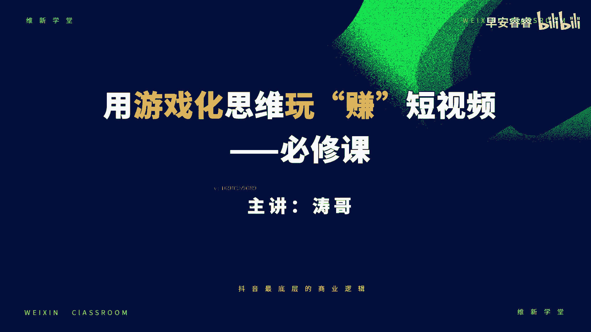
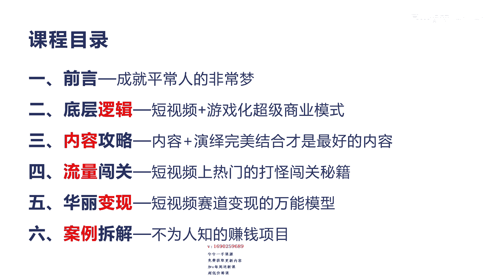

# 042 2023抖音快速起号必修课 - P1：第01节宣导课-请收藏 - 早安睿睿 - BV1Gn4y1o7rC

大家好，很高兴认识你，欢迎来到微信学堂，我是涛哥，整套课程都是由我来给你讲解，这个课程的名字叫用游戏化思维玩转短视频，它是一门必修课啊，因为抖音它平台的底层的核心逻辑，是游戏化加短视频的一个产品逻辑。

所以通过我的认知和一些经验，会总结一套游戏化思维的方法论，这套方法论呢可以快速的让你做短视频创业呢，迅速开窍，并且彻底解决了，那不知道怎么去选赛道，起步难，没流量变现难等一系列的核心问题呃。

我会通过解密抖音最底层的这个游戏规则，包括他的闯关密码变现方法等全流程，我会系统性给你来讲解，并会用大量的这种操作方法和经典案例，你来做演示，希望能通过这个必修课，帮你在抖音快速起号并实现创业成功好。

首先我们来讲一下，为什么我会用游戏化思维来做抖音这个课程啊，首先这个游戏化思维，其实在很多这种商业应用中呢，其实已经存在了啊，但是在短视频创业中，用这个思维去讲怎么去做抖音的确实还没有。

那它到底有什么好处呢，通俗来讲，游戏化思维实际上是采用了一种游戏化机制，和游戏化动作来激励人的一种行为方式，那么通过这种行为呢，可以对人性进行一种制衡，那么反而达到一个反人性的一个作用。

其实我们在很多其他应用中，比如我们说读书打卡，或者是21天这个健身打卡，包括我们讲的拼多多是吧，他的拼团购物的游戏，还有我们讲的盲盒，用这种游戏化的方式来这种礼品的购买啊。

它其实都是一种游戏化的商业这种应用，那么其实对于我们中间讲的这个啊，首先通过游戏化去反制人性，通过人性最后实际上是流到什么，其实反应最核心的是我们讲的心流，也就是一种状态，这个状态我们统称叫心流啊。

心流的意思是完全你可以集中投入的那种状态，那这种状态会让你更加的满足，熟练成功，而且上瘾，他会让你更注重于更专注于做某一个事情，从而快速提升自己，而且心流最大的特点它是让你会有幸福感觉啊。

他会很快乐的那种状态去做这个啊，创业啊，新牛的特点，它其实就是一个非常强大的吸引投入，满足和熟练，那么在这种状态下，你就不需要去苦哈哈的去做抖音了，那么你就会觉得做抖音，其实是非常快乐的一个事情。

特别对于普通人啊，我们对于普通人做抖音其实是非常苦的，因为你各方面都没有，那么第二个呢，还有一个特点，就是因为为什么我们要游戏化思维来做呢，因为本身抖音它就是一个游戏化的平台。

我在个人的一个短视频里面讲过，抖音最核心的底层逻辑是游戏化和商业模式，所以你会发现啊，他有呃点赞粉丝积分排行榜，勋章，荣誉任务是不是等等这些东西，实际上我告诉你，他这些元素都是所有游戏上瘾的一个元素。

所以这样的游戏元素呢，它本身就可以驱动人来干什么，来让你看下去，所以你会发现你在用的抖音的时候，你会不停的刷，不停的上演，然后一天刷两三个小时都不停是吧，他就是通过这种刺激游戏方的方式。

这种刺激啊让你有这种什么反馈乐趣，然后还还上瘾，所以如果说你在做抖音的时候啊，非常艰难的方式，你是很难坚持的啊，我们说做抖音就是三点嘛，第一就是你得有信心，第二个呢你有决心，第三有恒心。

我发现很多人前面两个都有，但是做到后面真的没有恒心，没有恒心是有原因是什么，他坚持不下去，他会觉得很枯燥，很难，没办法去持续下去，所以这也是很多，就是我们说做抖音，实际上对于很多普通人来讲。

他是入门是比较容易的，但是他升级呢闯关升级上是很难的，他一定会淘汰出很多坚持不下去的人，这样才是它本身的机制所在，他不会让所有人都可以把这个游戏给打完的，他一定是层层关卡筛选出最牛逼的主播。

最牛逼的导演，最牛逼的演员是吧，最后让这个内容更加吸引观众，他的目的就是这个，所以我们在学习抖音，运用这种啊游戏化思维，它真的可以让你啊，快速的度过这种前期的考核期，让你真正进入到抖音创业的这种。

入门级的门槛啊，这就是我讲的，为什么我会用游戏化思维来做抖音的原因，呃那么在此之前啊，我给大家介绍一下我的一个个人经验啊，我到底是谁，大家可以看一下这个照片啊，呃今年我42岁。

其实20年前呢我是一名教师啊，大学里面我是教程序员的啊，04年我开始创业，第一个品牌我们就叫维新，所以大家会看到这个课堂，我们叫维新课堂的原因呃，当时起维新的目的，也是希望自己在互联网创业这个路上呢。

不断的去推陈出新的这种创业理念哈，那么创业18年来啊，我带领过无数的这种创业团队，上传各种互联网的实战营销打法，像新媒体营销，电商平台的运营产业加互联网平台，包括我们讲的搜索引擎。

还有当时的社群裂变等等啊，都是我非常擅长的，那么创业至今，我服务过的创业者和企业老板呢数以千计了，07年到15年，我们做的是母婴和零食，还有珠宝电商，整体的销售额我们突破一个亿啊。

曾经我三个月做到猪八戒内幕的第一，成为了金牌讲师，也就是这个图的中间这个图，他叫八小时成长集训营，那么同时呢，我自己也操盘过十几个，不同领域的互联网平台啊，你像左下角。

就是我们在18年运营的一个平台项目，还有类似的项目，像车爱网，当时做的跟瓜子二手车类似的一个平台，还有应聘网，类似于现在的boss直聘的一个平台呃，像右上角，我们做了一个全民健身的一个这个互联网平台。

但是我们这个团队有将近四五超人啊，做的业绩也不错啊，最后我们还做过一些叫做产业大数据的，一些大数据平台啊等等，都取得了非常不错的成绩啊，所以我想通过这个课程，把我在毕生的这种电商经验，创业经验。

以及我们在抖音实战的一些经验传授给大家，呃，说实话在抖音这个平台里面，有很多主播在教怎么去做抖音，但是真正能在互联网平台和互联网这个领域，实战18年，而且有具有丰富的电商和实战的，这个平台经验的。

几乎寥寥无几，所以我期待啊与你一同进入短视频创业之路，帮你真正在抖音赚到钱，好那我们来看一下我们的课程目录呃，我们的课程目录分为六大板块啊，第一个是前沿，也就是告诉你成就普通人的非常梦。

为什么说到这一点，后续我们会讲抖音是在所有平台里面，作为普通人最好的一次创业机会啊，第二呢就是底层逻辑，底层逻辑我会讲，抖音它到底是一个什么样的平台，它其实是我们讲的，游戏化加短视频的一个超级商业模式。

这是它的底层核心逻辑，这个我们也会讲，那么第三点呢是内容攻略，这个内容攻略就是讲到内容和演绎完美结合，才是最好的内容，所以在抖音里真正的想创业成功，你必须围绕着两个方面啊，这个我们也会在后面具体讲。

第四点呢就是讲的流量闯关，所有的短视频上，热门的这种打怪闯关的这种秘籍，我们都会在这一章节里面进行讲解，第五呢就是华丽的变现，短视频赛道变现有很多这种公式啊，也有很多这种方式和赛道。

那么它有一个万能的模型啊，希望通过这个模型能帮助大家，能真正在抖音做最赚钱的项目，那么第六呢就是案例拆解啊，这里会讲解非常多的不为人知的赚钱项目，因为这些赚钱项目呢，呃通过我的这个一些案例的拆解。

拆完了之后，让你快速的了解别人为什么这样去做啊，别人做的这个理由是什么，你可以少走一些弯路，少踩一些坑。

