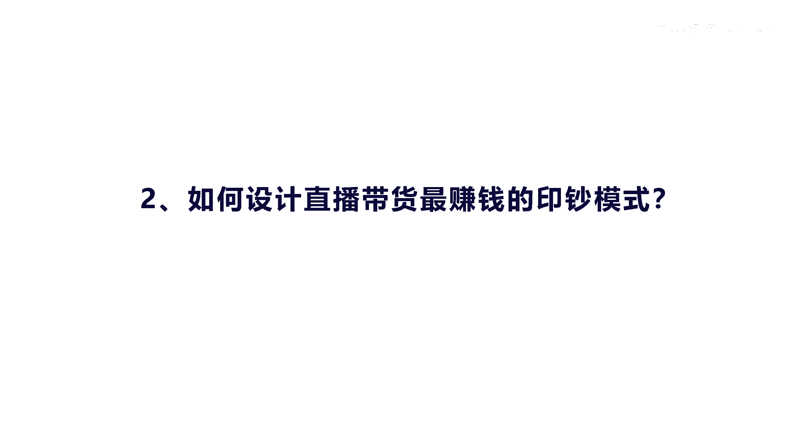
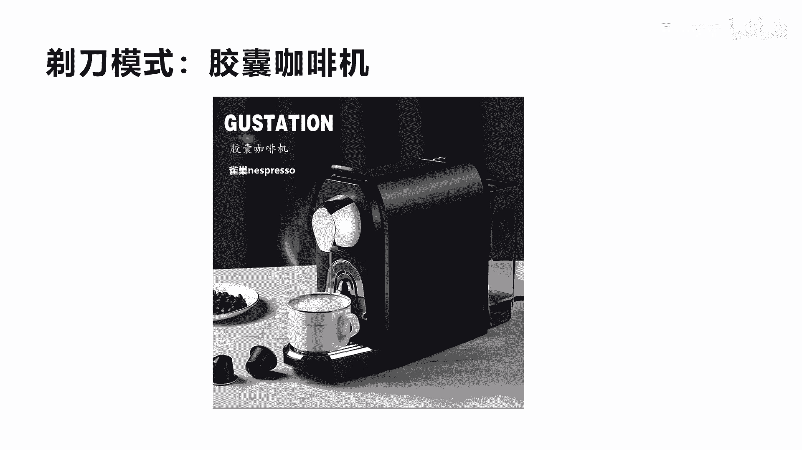
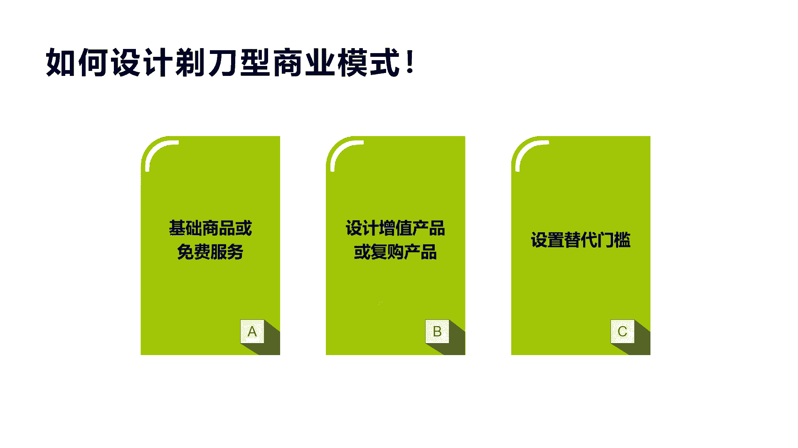
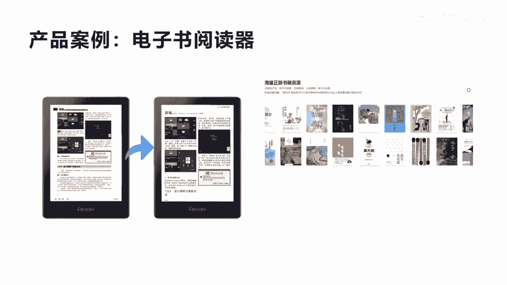
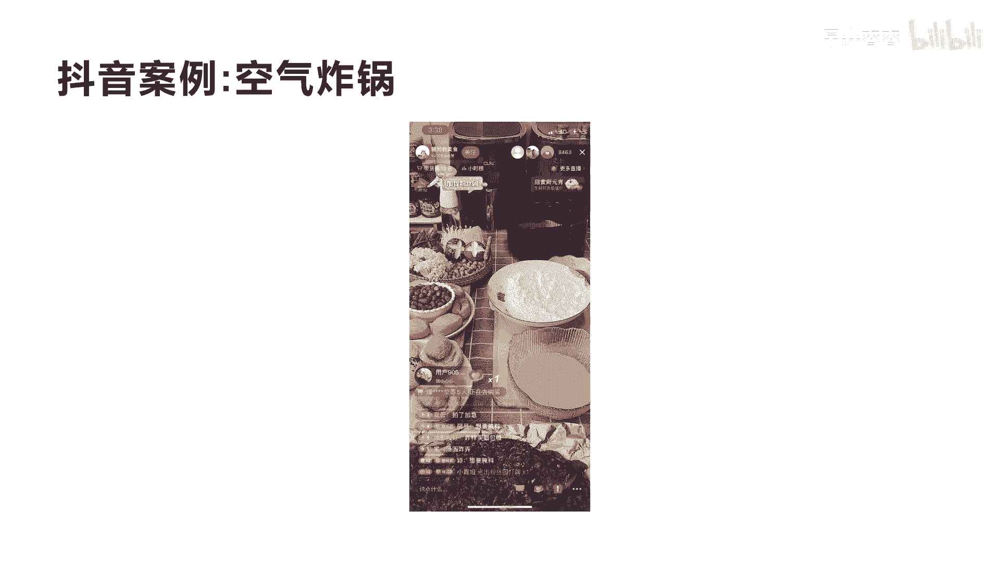
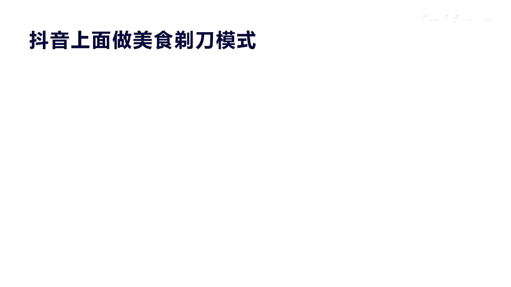
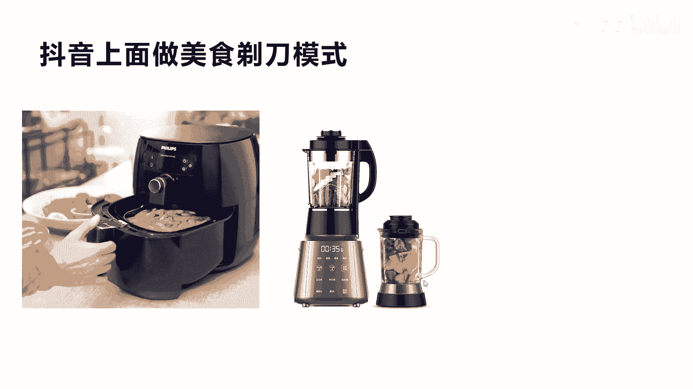
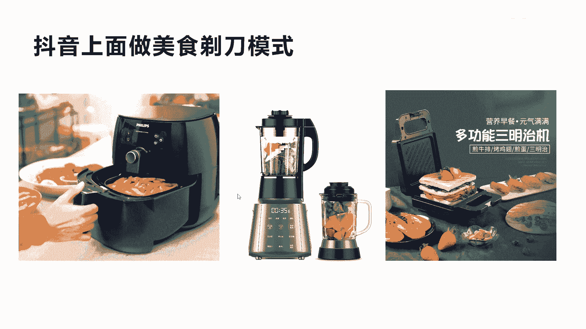
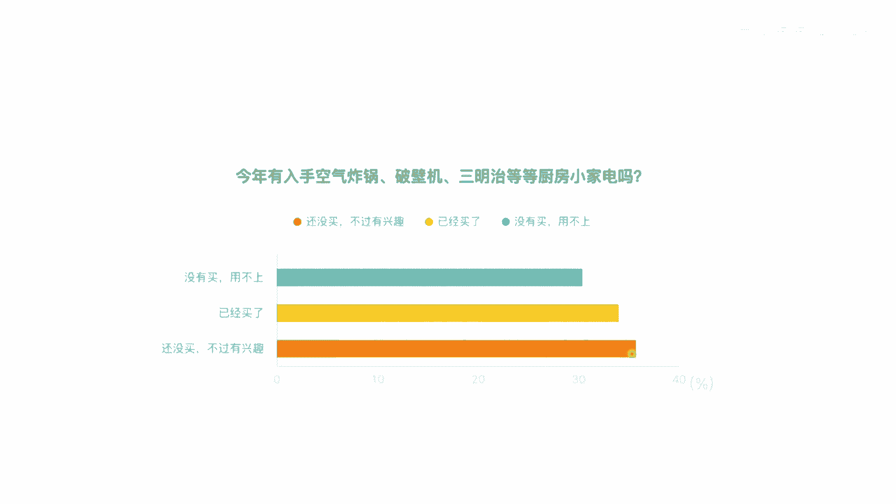
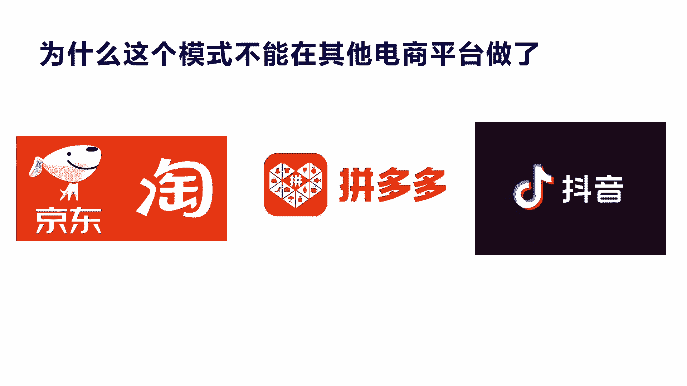

# 042 2023抖音快速起号必修课 - P20：第20节如何设计直播带货最赚钱的印钞模式-请收藏 - 早安睿睿 - BV1Gn4y1o7rC

你好，我们今天来讲，第二个，就是如何设计直播带货最赚钱的印钞模式。

好我们来看一个图啊，直播带货最赚钱的印钞模式，我们看一个图，一个是俄语沟，一个是剃刀与刀片，这个什么意思啊，剃刀刀片的模式实际上是基本的产品，价格很低啊，我都要把它卖出去，而且你必须到我这里买啊。

这样就可以带来丰厚的用户额利润，我们就成为这个剃刀和刀片模式，或者讲叫俄语沟的模式，这个模式其实除了这个刀片和呃剃刀之外的，还有我们想比如说手机和通话的话费啊，他也是俄语沟的关系。

你买这个手机是没有用的，他必须要有通话才可以打电话是吧，所以他的手机有些我们讲运营商他送给你，他为了什么要绑定他的消费的套餐，这就是俄与勾这种方式有好处，就是我可以通过后续的这个增值产品。

或者是增值的业务来进行长期的赚钱啊，还有比如说我们打印机啊，也是这种模式，打印机里面最重要的是什么墨盒，是不是啊，我买了打印机没墨盒不行，其实有很多打印机很便宜啊，但是墨盒很贵是吧，他就靠墨盒赚钱啊。

复购还有相机和胶卷，或通过卖胶片来赚钱，这些都是属于这种模式的啊，那么这种模式呢，额他是源于我们讲的原来的吉利公司，吉利公司刀片，比如说像这个刀片啊，买一个剃刀，他送十个刀片，等你十个刀片有用完了，哎。

他以后还要买，所以他是靠那个刀片赚钱，所以他也要吉利，就通过这种方式飞速的增长起来了，所以在这个剃刀模式这个商业模式里面，大家可以看到它其实有一个特点，就是如果你能找到一个这样的产品和商品。

这个商品呢呃它又比较容易呃，让用户去买比较便宜，然后呢买了你这个商品之后，那这种模式就非常适合这种东西呃，我们来看一个另外的模式啊，就是这个是一个案例刀片模式啊，剃刀和刀片模式它叫胶囊咖啡机。

这个是什么东西呢，这是但是雀巢在咖啡行业它是大公司了，他当时也是遇到瓶颈，所以他有一个非常经典的案例啊，他就是叫做啊加拿咖啡机，这个胶囊咖啡机呢，它是最早在上个世纪70年代啊，也就是1976年的时候。

他是一名工程师发明的啊，一直到有后面换了一个总经理啊，这个总经理就是做出了全面的改革，他就说我哎我变一个模式呃，咖啡机啊卖给这个用户啊，很低的价格卖给用户，然后呢这个用户买了这个咖啡机。

发现我放在家里也不行啊，或者是我总要买点咖啡胶囊吧，这个咖啡胶囊放到这个咖啡机里面，才可能才可以用嘛是吧，呃所以他这个大量的用户买了他的咖啡机之后，不断的去买这个咖啡胶囊啊。

咖啡胶囊呢在这个额公司的这个销量上面，就大大的收到了收益，而且不断的有呃用户来复购啊，所以他这个就是经典的一个案例啊，那么雀巢在这一块呢用了这个方式之后啊，就产生了很好的这种效果。

所以你会发现它有个特点就是什么呢，咖啡机很便宜，作为一个这个呃复购率比较高的一个东西，它实际上是盈利点，所以就是说咖啡机是钩子啊，这个咖啡胶囊才是余额，才是赚钱的核心啊，这就是他这个模式。

那为什么讲这个啊，因为我们在直播，在抖音的这个模式里面，其实也需要去用到这种模式，才会让你真正的好赚钱赚大钱，你仅仅只是卖个产品呢，说实话比的就是价格差，你的价格便宜我就买啊，同类型这种呢你要比比价格。

你得比你的供应链能力，你没有供应链能力的话，你很难拉到这个市场上面的最低价，你像很多这种大网红啊，他在这个呃直播间卖这种便宜的东西，它都是有大量的这个供应商给他进行供货的，不然他卖是亏本的。

九块九卖那么多包的纸巾，九块九买卖那么多的这个呃，这个茶叶便宜的或者是珠宝，你说他怎么赚钱啊，不可能赚钱，所以他这种供应链你没办法掌握的话，你很难通过直播带货来赚钱的对吧。

呃所以我们需要学习这种模式创新，才真正能有更好的这种赚钱机会。

我们看一下这种设计这个替代模式啊，我总觉得这种模式它有三大特点，第一个就是你至少要有一个基础的商品，或者免费服务，哎这个我会讲啊，就是说咖啡机也好，我们讲的这个呃刀片啊，剃刀也好。

它实际上是叫基础产品是吧，但是也有一种啊叫免费服务，就是我们讲的这个很多提供这种，比如说跟跳服务，锻炼身体，形体礼仪是吧，或者是讲我们这种知识付费，通过直播里面就可以给你讲免费的知识，这也就是钩子是吧。

通过免费的知识变免费的服务，免费的产品来勾住你，然后后面是什么，就设计增值产品，第二种，第二个就是我们讲设计增值产品或复购产品，比如说这个课程就是我们实的增值产品，我们在直播间里面讲的干货。

就属于免费产品是吧，复购产品就是刚才我们讲的，如果你卖一个啊咖啡机，那么实际上咖啡胶囊是作为复购产品，它会不断持续的复购，这种模式就属符合这种替代模式是吧，那么第三个就是讲到设置门槛呃。

你还是得要有一替代门槛，就是他买你的咖啡机之后，他到别的地方是买不到这种胶囊的，就排他性垄断地位是吧，或者是有自己的壁垒，那么你像我们这个知识付费也是啊，他到你来学你的干货，你的体系，你的知识体系。

他必须到你这里来跟你学习，那后续的跟你进行互互动也好，咨询也好，他就是符合你这种体系，下面这有一定的门槛，我换一个老师，换一个博主，可能他有他的体系就不一样了是吧，所以这是一定的门槛。

当然有些人说哎我不一定，我不一定要到你的学院，我到别人那里重新学到也可以，所以他的门槛不是很高啊，但是像像我们后面会举一个例子啊，他也会有一定的门槛，但是门槛也不会有绝对性的替代性啊。

但是总体来讲就这三大，如果你想学会在抖音做啊，这个呃直播带货或者是自己的赚钱的方式，设计制好自己的替代模式，剃刀刀片模式是非常有必要的。

我们举个例子啊，就是产品案例啊，这个电子书的阅读器大家应该都知道是吧，呃我买一个这样展阅的这个阅读器，完了之后呢，实际上这这个阅读器是没意义的，但如果你没有书，没有电子书，这上面你买这个设备是看不了的。

是不是啊，所以实际上它是呃给你一个这样的阅读器，但实际上它是要赚更多的什么增值的，什么书籍资源的费用，所以他是他必须是卖大量的这种书籍资源，来赚钱的设备，其实不赚钱，是不是我一辈子也就买一个是吧。

等于抓到一个用户之后，我就没有办法再增长了，我的我的利润增长就为零了，所以他必须卖一个设备给你，然后呢我们通过海量的这种书籍来做增值收入，这个才是它的增长利利润增长点是吧啊，所以你会发现，其实呃。

这个阅读器大概是900多块钱或者更便宜的，实际上他买了之后，他会是送你一些呃会员的权益，你们可以看一些书籍，但是实际上他很多好的数据他不会让你看，他必须要升级你的会员等级，比如说我198。

我要买一个啊金牌VIP，他先送你一个免费的，或者是呃比较普通的VIP，然后呢你要买更要看更好的书，才需要购买它更高级的服务，这就是复购增值增值复购，那实际上有有很多这种呃书来讲，比如说十块钱一本。

那你花个198，你看可以看500本，可以看一年，那你算下来你也会觉得很划算是吧，这样他买的动力就强了，所以他复购的这个率还是蛮高啊，所以他很赚钱，他其实他不是卖一个阅读器，他是真正的商业模式，是卖会员。

卖他的书籍，只是通过这个阅读器，它这个设备来看书，它会更体验更好，它只起到这个作用啊，不然的话你说买个设备，它里面没书，你会去买吗，没意义，是不是好，通过这个产品的案例呢。

大概你就可以感觉到我们到抖音怎么去做。

举个例子啊，这个可能大家都有接触过，我们看一个视频，您这里遇到用到的是什么，就是胡椒，生抽和奥尔良腌料，就这三样就能做出来，可以媲美外边的奥尔良鸡翅，来教大家怎么去调这个料汁啊。

我们首先一斤的肉放2克的胡椒粉来，烤箱和黄车一样一样的，来一斤的肉放2克的胡椒粉，2克的胡椒粉有多少呢，你就拿着手这样抖两下就行了，它的目的呢是去腥提鲜，然后放10ml的生抽，来10ml的生抽。

就是家里的勺子，两大勺好，我们暂停一下，我给你讲一下，他这个实际上是教你用空气炸锅来做美食，他下面挂了小黄车，大家看到没有，这个小黄车是卖的，他一个呃应该是一个配料，就是这个配料九块九啊，手套有的啊。

手套有的啊，之前放的是什么胡椒粉，你看他说手套有的，也就是说他在做菜的各个配件，零配件他都可以卖好，这里我们就跳过看了啊，我们不看了，我们大概跟你讲一下这个设备的，这个上面就是空气炸锅是吧。

这个大家很多做美食的，大家都清楚，这个里面卖的所有的配料和所有的材料，以及空气炸锅，包括他手上戴的手套，他都是可以在他的直播间，他在在他的这个小黄车里面可以买的啊，大家明白了吗。

也就是说我先买个锅子给你，然后呢你听我的服务，我教你怎么做菜的方法，你每天都会上来上来听是吧，然后你看到我的这个做菜的方法，我教你怎么做这些美食之后，你不但会买我的这个空气炸锅，你用完了之后你觉得好吃。

顺便买我的一些配件，比如说我买这些呃炸酱啊，配料啊，包括一些食品啊，只要可以配送的复购率就非常高，你看他这个在线人数达到8000多啊，非常非常大，他其实他的粉丝数大家可以去看一下，没有多大粉丝啊。

粉丝数不大，但是他通过这种直播形式的场景布置，然后销售转化，包括这种模式的设计，空气炸锅是非常好卖的一种模式啊，对于普通人做这个事情来讲，其实你发现没有，其实也不难，你不要出镜是吧。

然后你学一些这种空气炸锅的方式，其实实际上是可不难的是吧不难，然后你再销售带货的时候，你都可以不一定要开店，你可以带别人的货啊，拉别人的样品，然后来到直播间来卖啊，也不需要发货。

也不需要考虑到货源的问题，是不是，所以这种模式来讲符合我们做的啊。

剃刀刀片模式，那么像抖音这个上面还有哪些剃刀刀片模式呢。

我们看一下啊，其实就是刚才讲的这种叫空气炸锅啊，还有这种是吧榨饮料的啊。

还有包括我们讲的三明治的制作机，你会发现都是卖一个机器，然后这个机器是一个机器，但是它实际上还是需要什么，你才可以真正的去做菜，你这些做三明治也好，煎蛋也好，你需要在他这里去买一些配料。

买一些牛排的配件呃，是不是包括榨水果的，包括空气炸锅，现在大家应该都明白了，所以这种东西你他建好直播场景啊，再去啊输出一些做这种美食的服务内容，它是非常好的场景和转化方式，转化率是非常高的啊。

这比你单纯的去拉这个东西，巴拉巴拉去讲去卖这种东西要好很多啊，要好很多，因为他是个内容，它是可以自动不断的生产内容的，生产完了内容之后，他又可以不断的去产生消费，产生复购。

所以他的模式是非常好的，你像这种东西，我们说在这个统计上面啊，你看空气炸锅，破壁机，三明治等一些厨房的小家电有很多，你看到没有，这里显示还没有买，不过有兴趣的人占了很大的人数，不知道大家清不清楚。

这个这个值占的很大，就是这一批人还有很多没有买过的市场，还是有是吧，已经买过的也有这么多了啊，但是啊没有买，用不上也有，但是我是觉得这种模式对于很多想在家里啊，我不知道我因为我我们的我们家是有的。

我们家是有这个空气炸锅的，它炸鸡翅啊，或者做早餐啊，做一些什么面点给小孩子吃是很方便的啊，做出来的效果也很，味道也是非常好的。

是吧啊，这个这个市场还是很大啊，最后我们再讲一下啊，就是为什么这个模式，它不能在别的电商平台做呢，额首先我们讲抖音，它是一个内容电商平台，在前面我们也讲过，他是以视频内容为基础的。

它就是我们讲的观众到抖音上面来是看内容的，他不是来消费的，内容就相当于我们讲的水，那么产品是面，你硬是要把水和面合在一起，可以你得有和面的能力，或者是恰到其分的和面是吧，那不是很尴尬。

但是我本来看那种突然给老是给我推广，这种硬广告，我没兴趣，我划走是吧，我也不想买，我不知道到拼多多和淘宝他们去买嘛是吧啊，所以他真的适合于这种真的可以输出内容，然后产生啊购买兴趣的这种模式。

你像淘宝和京东啊，他第一诉求其实上来我肯定是要买东西的，我明确我要买什么产品是吧，所以他就是比价格把这个销量进行一排序，你就买那个最好的，你不会去买那个零销量的，是不是啊。

所以这种模式也导致了就是拼多多和淘宝这种，1。0的淘宝电商模式啊，他就是拼的这种啊，运营能力和拼的这种啊资金能力是吧，因为你好的这个产品会卖的更好，但实际上它本身来讲有很多很好的产品，它出不来。

你买不到，因为你看不到嘛，你也不敢买是吧，所以这就是讲的传统电商的区别啊，那么你看这个额内容电商来讲，他就不一样了，我刚才讲的，他是我们讲他是上来是看内容的，它对于用户来讲。

对你的内容的吸引能吸引度是非常强的啊，你你再告诉我怎么去做这个做这个美食，这是一个非常好的内容，然后你顺便告诉我，你做这么多美食可以啊，而且我推荐你买这个炸鸡非常便宜，而有很多人就买了买了。

然后不断的复购是吧，呃而你在店在淘宝上面你很有意思，你会去搞一个这样的内容，然后大家上来是看你这个内容的吗，他会实时看吗，不会买你的产品的时候，他可能会看你的这个视频的产品，仅此而已。

他不会说上来是为了看你的内容而去引导，去看买产品的是不是，所以它区别不一样，诉求不一样，那么抖音它绝对是一批在内容输出进行转化的，兴趣电商这一块，他是一个非常大的黑马，这个我相信在这个平台的额发展来讲。

他还有很大的机会，所以希望大家能理解这个东西好吧。

