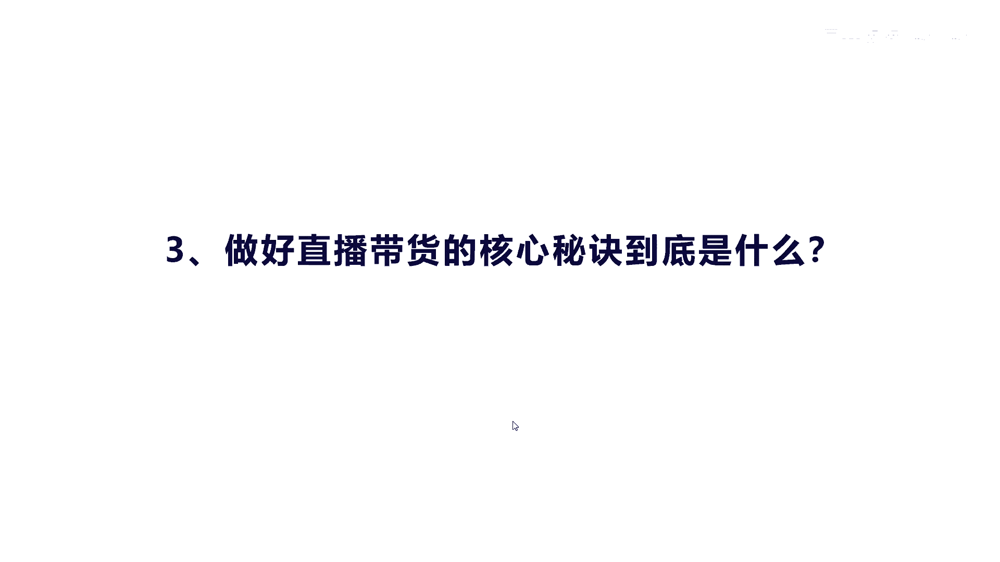
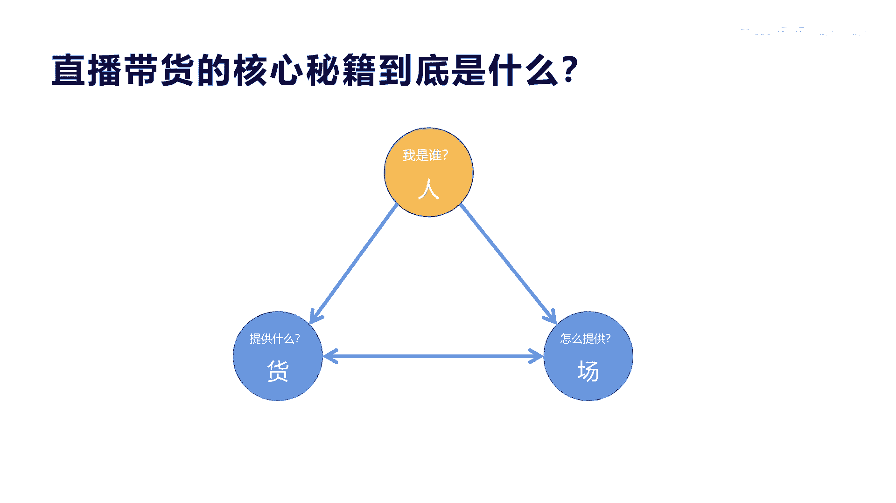

# 042 2023抖音快速起号必修课 - P21：第21节直播带货的核心秘诀到底是什么-请收藏 - 早安睿睿 - BV1Gn4y1o7rC

好我们今天讲第三方面，就是做好直播带货的核心秘诀到底是什么，说实话直播带货有很多这种方式要注意的，比如说哎呀话术啊是吧，要选品啊是吧，要要怎么样的这个呃主播能力啊，是不是。

但实际上我觉得啊就是呃围绕着系统性来讲，其实就是三个点，就三个点叫做什么人或差啊。

这个大家都可能听过啊，但是我觉得不管百变不离其宗，他就是人或场的优化，人呢是什么意思啊，就是直播间的这个很多人气啊，都取决于就是这个主播就是我们讲的人主播，他相当于是直播带货的灵魂。

那么一个有趣的灵魂在直播间他是非常关键的，如果主播的这种专业能力，能给直播间这个带来很大的这种啊，有趣或者氛围的话，它是非常加分的，那么直播间，所以你主播他要足充充分的准备一些准备工作。

比如他要对话术非常了解产品话术啊，是吧啊，这个销售话术啊，包括一些这种产品的细节，产品的卖点他都要非常了解，所以在直播的时候，人的这个因素他是可以达到七八十%，所以你必须要把这个主播的能力培养出来。

这是直播带货的秘诀，核心啊，货呢其实对于很多直播带货来讲，其实呃影响有，但是额不大，因为你如果能拿到一些好的货，实际上对于用户来讲，他也不会去比价格是吧，你只要你稍微提供的服务和提供的产品。

不是那么很差，他实际上通过这种直播带货的转化来讲，他还是非常高的，呃你像直播间，你如果能把这个货能做好是最好，比如说这个货的这个呃产品质量啊，然后你的这个发货速度啊，包括你的这个呃价格优势啊。

是不是或者你的优惠力度啊，这些东西能做好啊，你在直播的时候是非常有转化率非常高的，而且现在对于货品的这种营销促销手段也会有，比如说哎就先卖流量款，再卖什么啊，爆款，最后我们再来卖利润款。

然后反复反复这样直播间去去转换，所以直播间要购买的三大要素，第一个是就说你的这个呃产品性价比较高，第二个呢呃观众喜欢有品牌有保证的对吧，第三个呢就是快消品啊，就是它很容易产生这种呃消费的一种。

刚需的一种产品，那么通过这些维度来不断的提高这个货，货品的这个呃元素，那么惨呢，我们讲的就是直播间的搭搭建，直播间场景的搭建，这个英文有什么好处啊，就是因为很多直播呃。

大家会发现如果枯燥或者是搭建的不怎么好，其实别人一下就划走了，所以你要在呃直播场景上面做一些特色的话，你必须要对他进行装修是吧，或者是道具以及它的灯光，以及他的风格要跟你的内容和产品相匹配。

这个环境要搭建出来，让这种氛围体现出来，那么用户第一个看到你的时候，就这种观感的提，那么消费者对于你的这种专业的这种直播场景，才留得住人，不然的话你这个很干瘪瘪的一个场景啊。

大家是没有兴趣持续看下去的是吧，所以直播间的画质啊，高清要好看，直播间要要要能有有这种立体感，灯光效果要好，这样就可以把直播场景啊做得更好，能留住人，所以真正这三个人货场真正要把它做好的话啊。

是要有一定的难度的，但是说实话啊，就是说有些人说场景很单一，但是直播直播的这个主播能力非常强啊，或者是主播能力一般，但是他的货确实很好，所以这三个东西嘞我是觉得他是有个特点，就是要有一个。

比如说100分的话，你三个融合一起是100分，那么你如果在人这上面你不行的话，你就必须要用货和产来做替代啊，比如说人只占到50分，那你货要达到30分惨，要达到20分，凑起来100分是吧。

就说你总体来讲你要人货场的融合度很好啊，这样你的直播场景直播带货啊，效果就最好啊，说白了就是不断的去了解产品和，锻炼自己的口才，然后把自己的这个呃这个直播的话，术的能力训练好。

至于你的货需要你卖什么去找供应商，能有很好的货源场景，我觉得你可以多去模仿啊，多去模仿同行或者跨行去模仿，这样对你来讲会少走很多弯路，但总体来讲，直播带货要练好它是需要一个长期的训练过程。

那总的来讲就是能获成三个元素去发力，好吧。

