# 042 2023抖音快速起号必修课 - P22：第22节如何找到适合自己的变现模式-请收藏 - 早安睿睿 - BV1Gn4y1o7rC

点就是如何找到符合自己的编辑模式。

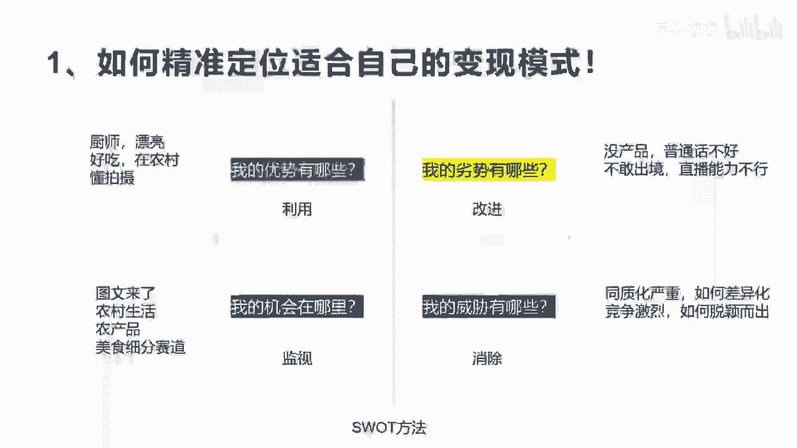

这个地方呢额怎么讲，因为每个人特点不一样。

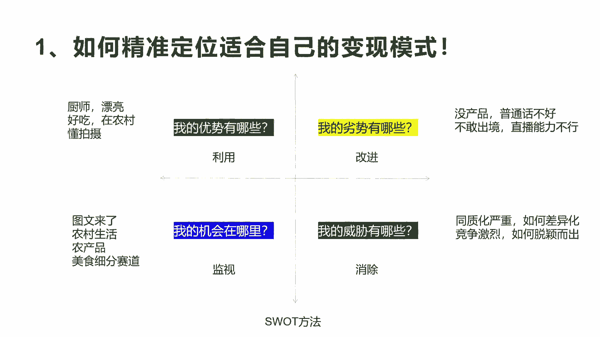

性格啊，包括你的资源啊，包括你投入的资金啊，包括你额各方面的这个呃决心啊不一样，所以呃每个人他有不同的适合自己的一个。

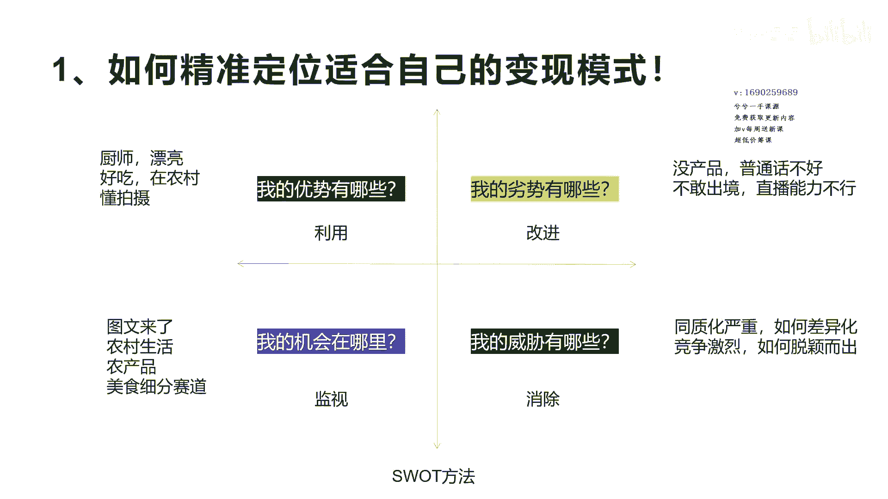

创业模式或者变现模式，我这里也给大家建议一个图形啊。

这个图形就是我们讲的SWOT方法，这个方法呢呃对于很多人做企业的人都在用，就是我的企业到底要通过什么样的方式。

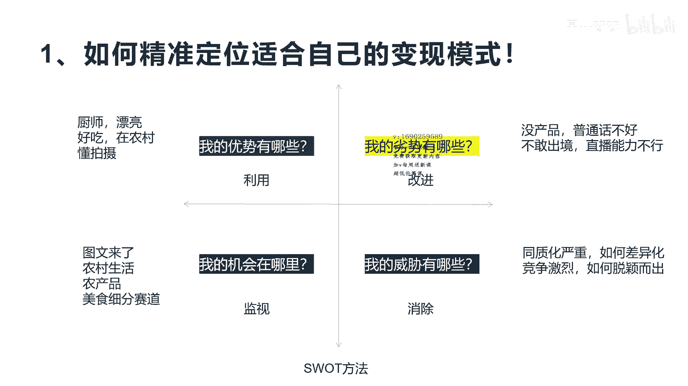

去在市场上面去做竞品啊，做市场的开拓，或者是我要做一些呃分析会用到这种方法，实际上对于创业者来讲。

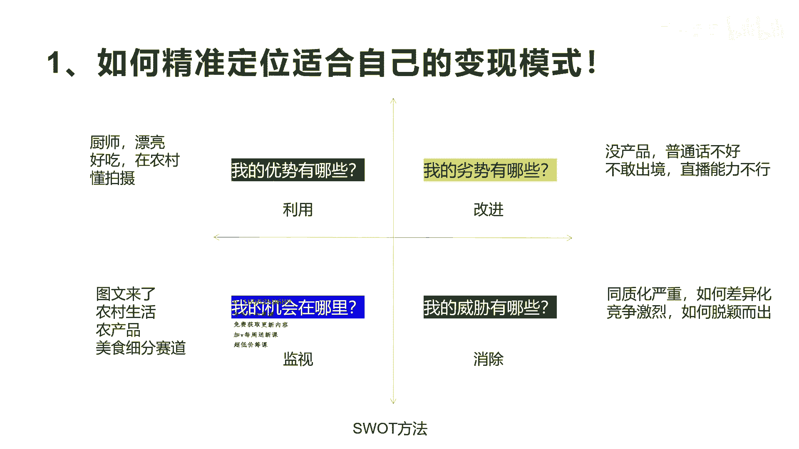

或者对你在抖音选赛道来讲，用这个方法一样有用，这四这个方法分为四大块。

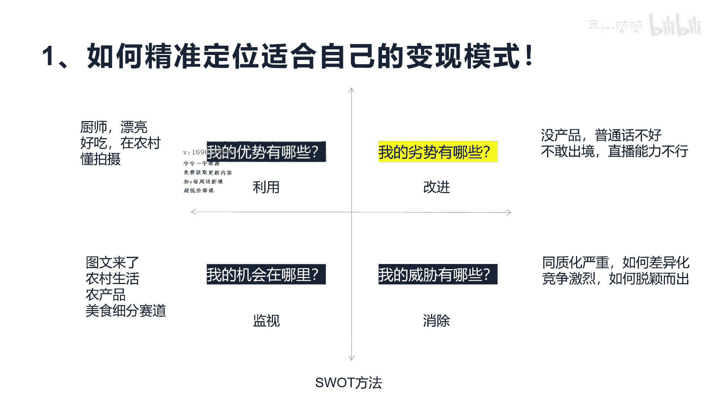

第一个就是呃，第一个叫利用，就是我的优势到底哪里在哪里啊，第二个讲的改进就是我的我的劣势在哪里啊，就是改进，然后下面就是监控我的机会在哪里。

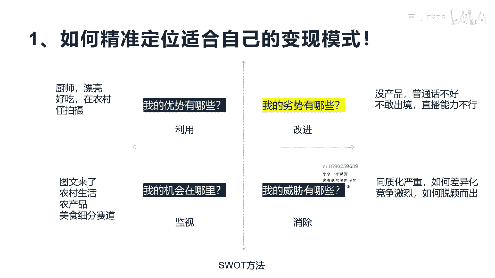

抖音有哪些机会，比如说这个抖音的这个现在这个情况，他对于三农赛道是有机会的是吧啊，或者对于团购达人实体店。

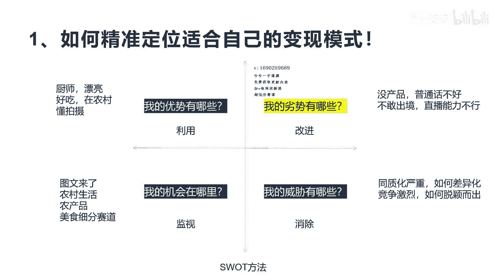

他是有趋势具有扶持的，这是机会是吧，那么我的威胁在哪里，就是我的弱。

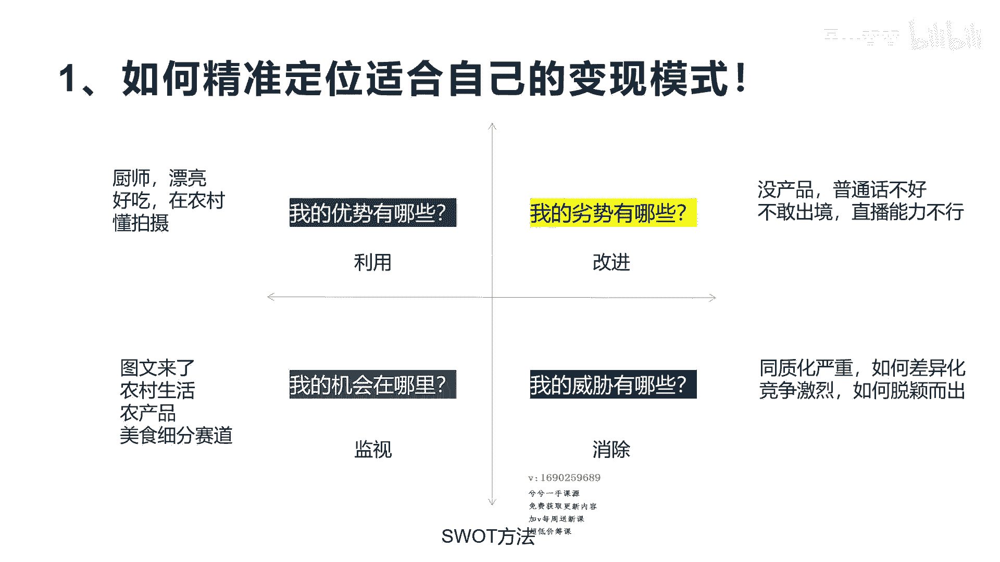

我的这个威胁是同行之间会怎么，就我的壁垒在哪里，我怎么去消除这些威胁啊，这样让你可以很稳当的持续的走下去，所以这个地方呢我们讲到就是呃利用这个东西。

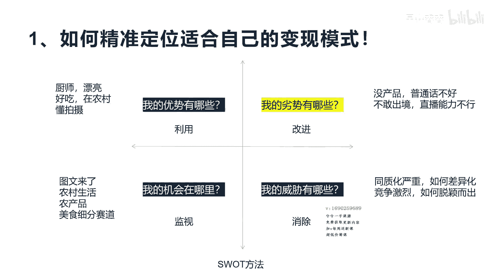

你一个表格把自己的相关的优势劣势，机会和威胁它罗列出来，罗列出来，完了之后，你就可以知道到底我应该选什么样的赛道，怎么去做了啊，比如说你有些优势说哎我的口才很好是吧，我的长相很漂亮是吧，呃我有货源。

是不是我有这个呃农农村的啊，这个这个呃资源可以在农村拍三农的这个场景，视频是吧，哎等等，这就是你的优势啊，那你的劣势是什么呢，比如说我我没团队，我一个人是吧，怎么办，我没有资金，我投入很少是吧。

或者是说我没有专业的摄像啊等等，我我剪辑也不行，这是你的劣势，那我机会在哪里，刚才我举例，比如说三农产品，它是你的机会啊，或者是抖音的这个知识付费，它是一个机会是吧，呃是很好的赛道。

那对于普通人来讲额团购达人，他其实对于呃实体店对于抖音的发展方向来讲，他是一个机会等等，你把抖音相关的机会都列出来，然后的威胁威胁有哪些呢，就是现在同行有已经有几个做的比较好的了。

他再做完我是不是就没有机会了，我怎么去做差异化是吧，我避免跟大家去去竞争，应推应对应的这个这个去比拼是吧，或者是说我在某一些方面做一些呃，让人可以记住我的一些优点定位，比如差一点反差点是吧。

我去怎么去做这些事情啊，找到自己擅长的一些事情，那么整个通过这个维度，你会发现啊自己豁然开朗是吧，哎我适合什么，我缺点是什么，最后我能做什么，我不能做什么，最后实际上通过这个能找到自己比较擅长和能。

做的一些事情不像有些人就是一头雾水，天天想哎我到底做什么呀，我很迷茫啊，我不知道做什么啊，最后别人告诉你做擅长的，我擅长什么也不知道我机会在哪里，也不知道啊，是不是啊，这个就很好的去梳理自己一些啊。

一些这个本来想不通的事情，梳理完之后豁然开朗啊好吧，今天我们就讲了，这个，怎么去找到适合自己变现的模式的一个方法，当然我们说的啊，他这个方法只能让你能去梳理，最终能不能做成你选择的这个方向。

还在于你去不断的去努力，或者是去去改变，因为在很多人选择某一个方向的时候，他做着做着就不坚持了啊，你一旦选了方向，我建议要扎根进去，别像蜻蜓点水一样的做一下就不做了啊，你至少努力个3~6个月吧。

是不是你才觉得放弃，当然有很多人在额选择这个方向之后，不断的优化，不断的迭代，它会发现原来所选的和判定的方向，确实跟最终和我们成功的是有些差距的，但是这种至少让你有目的，有方向，而且不会差到哪里去。

好吧好，今天我们就分享到这里，分享到这里，希望大家在整个这个赚钱这个如何华丽变现。

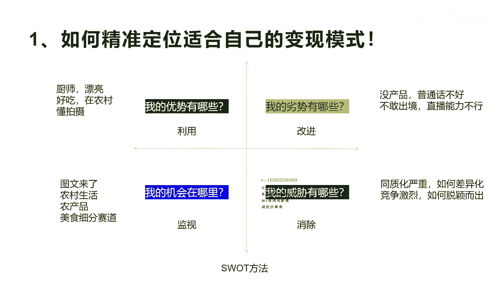