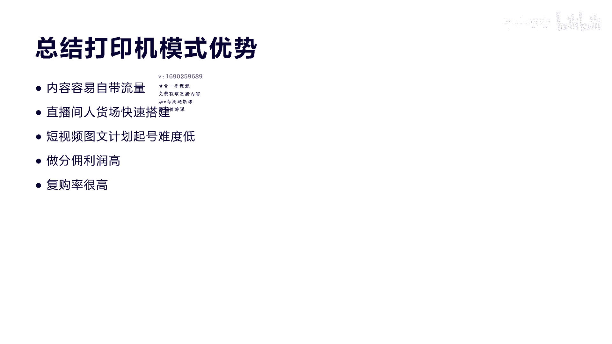

# 042 2023抖音快速起号必修课 - P23：第23节第一模式 打印机模式（上）-请收藏 - 早安睿睿 - BV1Gn4y1o7rC

好大家好，我是涛哥，今天我们来讲八大赚钱模式的，第一大模式叫打印机模式，其实在前面那个课程里面，我也跟大家分享了什么是打印机模式，今天我就不再重复讲了，实际上也很简单呃。

就是我们通过一个产品或者是一个设备，用这个产品和设备可以做出内容，并且卖相关内容的产品，那么就是打印机模式啊，比如前面我们讲过雀巢的咖啡机是吧，那买了雀巢咖啡机的人。

他必须用上这个啊咖啡豆去打磨这个咖啡，它才可以啊，对这个咖啡机才有作用，那么打印机模式一样啊，今天我们就来一一拆解一下真正的打印机模式，到底他们怎么做的好吧，听完这节课，你基本上啊可以啊，非常了解啊。

抖音一些做的比较好的，普通人怎么在抖音赚钱的啊，他们这种打印机模式可能他们自己都不知道，所以你可以通过这种模式不单单啊来做，我们今天讲的用空气炸锅来做打音器模式，你也可以用很多这种小家电。

或者是一些这种可以直接产生内容的啊，这种产品来做相关的账号啊，这种变现模式是非常好的，因为它的高复购率和高粘性，是所有这个抖音账号变现里面，我觉得是非常好的一种模式，好吧好，今天我们来看第一个账号。

这个账号的名字叫郭子爱美食啊，我为什么给大家来猜这种啊，他都是普通人可以马上可以做的啊，他就是用空气炸锅这个产品来做美食，然后生产出内容和直播场景，最后用生产内容的这个相关产品进行变现啊。

它是通过短视频变现，和直播带货来进行变现的啊，他是从2月份开始做的，五个月，他现在基本上可以做到啊，80几万一个季度非常不错了，因为他就是很普通的一种方式来生产，等下我会讲他有哪些玩法啊。

包括他是其实没有像我们传统的人物出镜是吧，或者是要进行口播，他都没有，它就是一个通过图文计划真正起号的一种账号，所以大家如果想不出镜又不口播，那么通过这种方式来做啊，非常适合于普通人啊。

他的这个直播是每天定照啊，05：20到晚上的09：50啊，一天稳播两场啊，2月份开始做的五个月啊，我们看他做了多少钱啊，这个账号大家也可以去关注一下，我们看一下他的变现数据。

这个账号他你看到没有17万粉丝，但是他的带货口碑是4。98，做到17万粉丝啊，短短的四五个月啊，他的你看到没有，90天的直播场次是182次啊，每天的场关在线人数是198人啊，直播销售额，直播销量是7。

2万，那么直播销售额是87万啊，也就是一个季度大概87万，一年大概可以做到啊，300多万没问题啊，平均利润率他还可以做到25%，所以一年他如果按这种方式去做，做个七八十万纯利润是没问题的。

对于普通人来讲非常不错了啊，不需要出镜，不需要打造什么人物IP，不需要通过很多写文案啊，这种表现力等等，所以对于普通人，我非常建议大家去做这种打印机模式，特别是这种空气炸锅，用产品做美食的这种方式啊。

我们等下会看一下他的客单价，它实际上它的客单价大概是在九块9~20，九块九之间，当然也有30块的，40块的很少啊，然后空气炸锅不是它的主打产品，有很多说我卖空气，我做空气炸锅都用做美食。

我就一定要卖空气炸锅，不一定啊，而且空气炸锅它这个价格是299，他卖的呢呃也不是非常多，但主要是很多人家里实际上已经有空气炸锅，当然空气炸锅卖销量也还不错，也在20%到40的利润啊，卖一台299的啊。

相当于也赚了大几十块，所以很不错啊，这种模式，他的平均的佣金大概控制在20%，到40%啊，所以你想一下87万，我们说平均利润率控制到25%吧啊，也是非常不错的，他的爆款的产品就是呃烧烤料。

就是我们用空气炸锅去做烧烤的时候，你最要用的最核心的就是我们讲烧烤料，所以他实际上做空气炸锅这种内容啊，卖烧烤料做爆款是非常直接的，我们就要直接转化，间接转化，就是说这个这个内容和这个产品还不怎么相关。

相关度很低啊，我们叫间接转化，它是它做相关度非常高的时候，这种转化率就非常高，明白我意思吗，好而且呢烧烤料它是个必需品，也就是说对于空气炸锅做美食的人群，要用空气炸锅做美食，那么烧烤料是一个非常必需品。

懂我意思吗，所以他的不管是复购率也好，它的转化率也好啊，还是它的利润率也好，都非常高，所以我们一般选品啊一定要选爆款是吧，叫引流款，还要选利润款，是不是还要选品牌款，一定要把产品分成好吧。

所以你看他这个数据变现，对于一般的普通人来讲非常不错了好吧，我们再看一下他的是怎么玩的，它的玩法一啊，其实跟大家讲的，就是刚才我们也分析过他的所有的空气炸锅，做美食都是这种教程，用直播和短视频来做啊。

教大家怎么用空气炸锅做美食啊的方法，配料包括一些技巧是吧，他的所以它的高度相关度，你看他销量最高的就是我们讲的烧烤量，这个烧烤量他总共卖了多少，总共卖了3。2万，3。2万的销售量，他的额总共的87万。

里面有31万是属于烧烤料卖出去的九块九，而九块九的这个产品，它的佣金还有25%，所以非常赚钱，你别看到他好像九块九啊，他是买一送一，后面我们会讲他怎么卖的啊，而且他还卖什么呢，卖这个空气炸锅。

做美食的相关厨具用品啊，所以不仅仅是烧烤料，你看他还有很多8万的，是不是，那都是相关的一些啊，包括铝箔锡纸，是不是包括一些其他的啊，喷油壶，那这都是做空气炸锅，美食烧烤的一些必需品啊。

这相关的销量你看占了它啊，整个销量的三四十%了是吧啊，所以非常好啊，这种转化率也非常好，第二我们讲它的玩法是什么，它是短视频，不人物出镜，不口播，等下我们来直接给大家看一个视频啊。

他的这个账号你自己也可以去搜一下，所以这种方式对于普通人来讲上手非常快啊，而且他做的很多这种选题都是非常大众的，那种美食的做法，他不是非常困难啊，普通人都可以上手去做，比如说呃炸鸡蛋。

比如说这个烧烤韭菜等等啊，非常简单，他把配料的方法方式全部分享给你啊，所以这里普通人照着做就可以了啊，第四个就是我们讲他是一个纯打印机模式，他的短视频也好，他的直播也好，它的转化率非常高啊。

大家买了之后，下次用完了我还会买，是不是啊，所以这种方式非常适合于，这种我们讲的这个复购率比较高的产品啊，第五就是我们家其实很多人发现啊，他这个账号的上面的简介里面竟然说他是工厂，实际上它不是工厂。

但是他在简介里面说自己是工厂，有没有问题呢，没问题啊，因为大家都不知道，工厂跟实际的账号有一个什么样的相关度，他是背后隐藏的，等下我们来看一下啊，他到底是个什么样的呃，工厂啊，会让很多人惊讶。

但是他是工厂的这个理由会让很多啊，普通的人会觉得他的第一个价格价格是最低的，第二个他是一手货源，信任度非常高，是不是啊，所以这样的话他就转化率高，很多人就会去买啊，而且对于他来讲，实际上他标的是工厂。

实际上他是答案带货，就是商品橱窗进行啊转化啊，拉佣金的这种佣金有什么好处，他拉佣金不要考虑产品售后，也不要考虑产品生产，更不要考虑囤货的问题，是不是他只要考虑到转化，做内容，做直播就可以了。

所以他这种模式就非常的非常利润非常高，非常稳啊，不像有很多人自己进货，自己做，然后呃最后钱没赚到，钱全部赚了货钱是不是好，这是他的打法。

第一我们看打法，第二啊，打法第二我们看一下这个视频好。

我只想爱爱爱爱你1万年，想喝一口星光酒，全世界拥抱好。

你看到没有，他的这个短视频，出示图文计划的方式就是上传六张图片，每张图片上面呢，呃显示出这个呃鸡蛋是怎么做的啊，他的方式加些什么样的配料啊，怎么做出这么漂亮的鸡蛋，是不是啊，他的点赞率达到了90。3万。

非常不错，他的转发和收藏也是非常高的，是不是，所以他实际上呢没有像很多博主做美食，那么复杂，高光拍摄或者是非常精美的文案口播啊，非常这个流畅的一些这种啊，灯光拍摄技巧没有很简单，因为对于抖音来讲啊。

他这种图文计划以后也会大力的扶持啊，所以对于普通人，你如果既不能出镜，又不能口播，那么用这种方式去起号去做短视频，获取流量，给账号定位是非常好的一种方式，明白我意思吧，虽然啊啊有很多人做。

他怎么做都不是起不了好啊，是因为你真正没有找到一些相关好的内容选题，包括内容的一些呃制作和剪辑方法，其实特对于他这种视频，我们可以再看一下。

其实他的这个档非常有特色是吧，拍摄从一个白气袋怎么通过切出来，像一个西瓜球一样的这种新奇特的做法，你一定要记住，对于抖音来讲，新奇特一定是第一流量密码，让人没有见过的鸡蛋，没有人见过的这种啊。

形态绝对是可以获取流量的，大家看到之后就马上就想做去转发，懂我意思吗啊，这是我们讲的第一个，所以这里呢它的优势二，我大概给大家总结四点，第一个用空气炸锅做美食做教程，然后卖内容相关产品相关度非常高。

九块九的这个烧烤料，类似于这种烧烤料的，还有调料，调料品以及相关的厨房用品，它都适合于在直播间和在短视频，带货小黄车上面进行转化，转化率非常高，第二短视频图文计划不出镜，不口播。

设计好文案直接拍摄上手发布是吧，这种对于普通人对于做短视频来讲速度很快，第三个他一定要做老百姓做得起的美食做法，你不要搞那些龙虾，搞些什么东西，你做不起来的啊，他有门槛的话，他学起来就很麻烦。

所以比如像做鸡蛋啊，做韭菜这种非常普通经常要做的，而且带一点特色的新奇特的玩法的，他就很容易让用户喜欢，第四个就是我们讲打印机模式，这种模式就是说我用一个产品来做内容，卖这个产品内容相关的啊。

一些这种产品，这种是非常符合抖音的模式，因为抖音我们说了，他是一个内容平台，那么内容平台一定是卖内容是最好的模式，所以卖内容是什么，一定是你做出内容，然后把这个内容的相关产品以及内容卖给用户。

内容才会转化高值钱。

大家明白我意思吧好吧，我们讲玩法三，你看刚才我们讲过，实际上他的简介里面写的他是工厂直销，实际上它所有的产品销量高的，都是第三方的小店，他走的就是佣金模式，他的佣金基本上是25%，看到没有，百分之佣金。

二十二百分之佣金35，非常不错了，你不需要考虑到这个什么售后和产品，生产的问题，你只要考虑到怎么把产品卖出去，对不对，所以呢对于普通人来讲，不要想着去直接去进货，你也不要想着真正什么。

他们都是什么工厂销售的，好吧，这是玩法，这可以提高用户的对你的信任度。

以及你的啊价格敏感度，明白吧好吧，第四个玩法非常关键，就是他这里在直播的时候，第一开场的前5分钟用一个福利品来炸福利，吸引流量，所以他一开播有个极速流，达到了2089人，看到没有，这里有个截图，最左边。

你看他下面用了一个黑色不粘锅三件套啊，来免费送啊，有总共就一份，那么就很多人来参与，很多人来这个评论，一评论一参与这个人气直播间就起来了，大家一看都会去点抽奖啊，这种方式非常适合于起号的5分钟承接。

懂我意思吧，这种流量极速承接非常重要，他就是用这种方式来承接，大家可以去学，你用一个三百三百到400块钱的一个产品，去吸引用户来承接的，开启的流量好吧，第二个就是我们讲的第一个炸流量，就是第一个福利。

我们看到第一个福利怎么拉的。

拉的转化，我们看看这个直播纸做出来之后呢，外表是金黄酥脆的的啊，这个面包糠是一个耐高温的面包糠，不容易焦掉，待会烤给您看好不好，您看一下新来的姐妹没看到的，告诉大家怎么去做啊，鲜果全蛋液300。

然后今天主播开播第一炸呢，就给大家炸这个面包糠，我这边用的是一个小熊驾到的，带R标的一个面包糠。

一袋的话呢是250克半斤的用量，您做个脆皮香蕉呢可以做50根。

做脆皮椒鸡排可以做30片，都是没有问题的啊，它这个里面的脂肪是零，看到没有，大人小孩减脂期的姐妹都可以吃，没有任何负担，不用整。

不用担心长胖啊，有这个商超条形码，在商超里面，这一袋的话呢就是19块九。

首饰两袋一个运费的价格，一共是一斤的，用量好，买一袋送一袋，先告诉你19块九，然后九块九一袋，买一袋送一袋啊，这个福利其实对于很多人来讲，可以拉动5分钟，10分钟的快速的前面的转化率。

把转化率拉上去之后，后面他就会有源源不断提速给你推第二波流，大家明白我意思吗，当然他这里面还讲过一个产品的功效，就是磷脂，不用担心长胖，所以你在通过第一个福利炸的时候，你一定要把产品功效。

对于用户人群的痛点也要进行相应的解释，这样他的转化率就会更高，所以实际上是对于产品价格以及产品功效，以及我们讲的流量转化进行非常好的一种融合，这就是我们讲直播间的玩法，大家明白我意思吗。

这就是我们讲他的第玩法四好吧。

那么最后我们来总结一下，今天拆解的这个案例啊，非常超值，我觉得大家如果听懂了，你照做的话，都非常的流量不错，他的其实打印机的模式有五大啊，优势，他这个账号其中有一个优势。

就是我们讲的第三点图文计划起号难度非常低，有很多人说哎我不会出镜，我不会拍摄，我不会口播，普通话不标准，这些都是阻挡了很多人，做直播和做短视频的一些门槛，实际上像他其实可以啊用这种图文计划啊。

快速进入这个领域啊，他的人货场就是讲第二点，人货场的搭建速度也非常快啊，就是一个平时我们做美食的一个桌子，加上一个啊空气炸锅产品，加上产品制作的相关流程，你前期准备好就可以了。

然后把每一个啊要在直播间里面分享的，相关的美食做法，牌品好做好，前期我建议大家先把排练做好，后面再考虑到真正直播，第一个就是我们讲的内容，它自带流量，就是打印机模式，它是用产品去做内容。

内容是抖音的核心，所以内容生产出流量，这是顺其自然的，所以不像有很多这种博主在巴拉巴拉去讲，这种产品销售，他实际上是没人看的，因为抖音来讲，它是内容，内容为王，内容平台才是吸引流量的核心，懂我意思吧。

第四点就是他的蜂拥利润高啊，他利润率很高，二十二三十%，最高可以达到50%，所以他这种产品利润高，他才可以维持这个呃，我们的这个账号运营的整个过程啊，复购率也很高，这也是打印机的模式好吧。

所以今天来讲呃跟大家分享的这个案例啊，希望大家都去看一看他的案例，包括我今天讲的这些他的玩法，你也可以跟着学，前期做号来讲，我建议一比一进行复制，一比一分子做一点稍微的区分啊，当然他的选题和内容。

你去看他有很多上万点赞的，都是图文计划做出来，他为什么能报，你为什么做不报，你一定要掌握它的核心啊，一定要我们讲产品选新奇特，拍摄前五秒抓留人，懂我意思吗，好吧。

