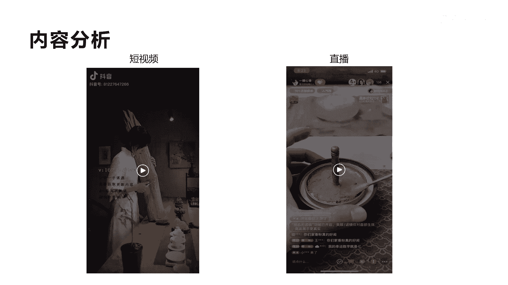

# 042 2023抖音快速起号必修课 - P24：第24节第一模式 打印机模式（下）-请收藏 - 早安睿睿 - BV1Gn4y1o7rC

那我们来分析另外一个账号啊，这个账号也属于打印机模式，他的账号名字叫一半新乡，大家可以去看一下，搜索一下，他是100，现在目前来讲是120万的粉丝数啊，120万粉丝数。

我查看他的数据是今年的3月份开始做的，也就是不到半年的时间，做到了120万的一个粉丝量，已经非常不错了，因为他是一个卖产品的账号，一个卖产品的账号，能做到迅速做到120万是非常不错的。

而他卖的是什么东西呢，他其实卖的是一个转香转箱，他是经常用的一种香法啊，转香他具体用的就是比如说用香炉，就像右边这个香炉上面铺上一些这种香灰啊，然后在香灰的上面呢，印各种篆文形的这种字和图形。

然后呢就可以把它一直点燃，点燃玩到末端，它一般情况下会在哪些地方会用呢，比如说我们在家里面啊，居家用香，它可以有一定的这种促眠的这种作用，还可以在办公使用是吧，消除一些异味，包括茶楼和会所等等。

都会用到这种我们讲的转箱，所以他这种模式，实际上它就属于我们讲的叫打印机模式，真正买了这种香炉之后，他的篆香用完了，他的香粉用完了，他会不停的去复购，所以他的复购率会非常的高。

这也是我们讲打印机的模式的核心啊，那我们来拆解一下他这个账号他是怎么做的，首先我们看一下啊。

第一个他的起号逻辑的分析，我给大家做个分析，第一个我们看他从第一个短视频开始，他用了一个就是一个木头上面，刮一些香灰上面啊，体现出它是原木的，第一个视频上271。3万啊。

用这种模式就是前三秒来抓住用户的眼球，带来了271。3万的这个点赞，基本上应该是5000万到8000万的一个啊播放量，那么用这种模式爆了之后呢，它在持续几个视频都在用这种方式去报，我们看一下左边这个图。

你会发现他第二个视频也贷了22。8万，就中间那个右边那个啊，第四中间那个是33。6万，最左边那个也有10。2万的一个点赞啊，包括最上面也是16。4万，所以整个这五六个视频。

基本上可以给他带来了将近二三十万的粉丝啊，所以他这种视频通过这种方式一旦爆了之后，他持续的用这种爆款去起号。

它起号的一个逻辑的分析，那么第二个呢我们来看一下，按他这种起号逻辑完了之后，实际上你发现他在用这种视频结构和视频形式，去拍摄，他的流量就很少了，你看后面只有100多个点赞，因为铁粉机制。

所以很多人看了这种视频之后，就没有对他有点赞的欲望啊，没有收藏的，有没有新鲜感了啊，没有新鲜感了，因为铁粉机制，所以每一个爆款都有它的一个生命周期，当这个生命周期没有枯竭的时候，你可以重复去使用。

但是一旦它枯竭，你就必须要迭代自己的爆款，所以你必须得换另外一种形式，或者找到另外的一种流量密码啊，这个就是讲的他的流量起号，短视频起号的一个一个逻辑。

我们再看一下他的其次的粉丝粉丝画像，我们可以看得出，基本上是三十三十一到40岁左右，而且很有意思，他这里面男性还偏多，男性占了52。42%，当24~30岁的这种啊。

年轻人对这种东西也还是有一定的需求，那我们再看到他的内容啊。

我们看一下它的内容，看第一个短视频的是这个视频结构。

好这个短视频我们看完了啊，你会发现他从一开始一个美女拿着这个香木啊，拿着这个香木在刮这个香灰的时候啊，其实就引起了很多人的好奇感啊，这就是这个它最大的爆款，271万点赞的这个视频。

整个视频他其实除了三秒做得很好之外，他后面的对于缠音频的拍摄，以及产品的这种演绎呃，非常精致的，包括这种视频的这种效果，高清度啊，整个过程让有新鲜感，新奇特的这种方式从而停留了下来。

而且整个视频有很治愈的效果，看起来非常舒服，让人啊有身临其境的感觉，有人在他的视频的内容的背景，音乐做的非常好，跟他的内容契合度非常强啊。

这就是他短视频的一些啊核心的底层，我们再看另外他的直播内容，我给你讲完，那个你们在舔香粉的时候呢，可以拿上我们的小勺子，以打圈的方式去给它进行一个贴膜，为什么要这样子呢。

这样子呢会将我们香粉里面的一个气挤压出来，它就不会出现断栏，断钻马蜂窝过大喽，好这个直播大家看明白没有直播，其实他就真正在用产品内容化啊，我们讲任何一个直播来讲，你如果没有内容，它是很难吸引用户的。

它的内容实际上是用香炉跟撞香的这种方式，演绎给大家看，我是怎么来做一个这样的啊，香炉里面的这个转香的，是不是让更多的人也会感到好奇，好停留在他直播间，而且他没有人物出镜，这也是他的核心啊。

因为有很多主播要人物出境，去做这种场景化的构建，你的观众的注意力会关注到这个人身上，而对于这种无人出境的啊，不露脸的直播间，他实际上关注点在他的产品上面，产品非常有内容感。

所以你看他的在线其实有150一个人，这还不是他最高峰啊，最高分要将近几百大几百个人好，所以整个这个直播他也做的非常好，用内容去吸引观众，变现的核心来讲，他还是我们讲的打印机模式啊，后面我们来拆解。

我们先来再看一下它变现数据啊。

啊一半新箱的，他的这个变现数据看起来也非常吓人啊，30天他的直播啊，销量总共是333。3万啊，这个数字很很有意思啊，被我截到了，也就是说一个月可以做333。3万，那么11年大概这样持续下去。

稳定的话可以做到三千三千万到4000万啊，三到4000万非常吓人啊，像这种香炉跟这种香灰，我告诉大家，他的利润率非常高的啊，最少可以达到20%以上啊，所以你看如果是一个月做300多万。

那么一个纯赚的可以达到60多万，特别是他的复购率非常高啊，你看他每一次的产关人数，实际上平均在111人，平均啊他的UV值在1。2，UV值在1。2已经算是比较高了，他几乎每一天一场直播啊。

但是他的直播时长会很长，他的带货口碑也非常高，你看达到了4。93啊，4。93，所以他这个账号很有意思，就是一起号之后就马上开始变现，而且他的变现的这个能力很强，他也不需要很强的主播。

他只要搭建好他的人货场的这种方式，再用人货场去构建内容，用内容去吸引观众停留，然后通过卖内容的相关产品，就进行了进行转化啊，而且他转化率在于我们刚才讲的，他是因为打印机模式，用香炉是吧。

用香炉去销售给用户，用户用的转香，每天去用，它可能不到一个月就要进行复购，好我们来再看另外一个就是他的每一场直播，你看每场直播他最高人数平均也在380人，就中间那个啊他的流量很大。

观看人数基本上会在18万到25万，最高突破了36。1万，但直播销量你看到没有，9月10号的36。1万的，这个观看人数的时候，他的直播销售额达到了50，3。4万的销售额啊，是所有直播间里面最高的。

包括还有34万24万，所以他你会发现呃，直播转化率是非常高的，而且他的直播这种场景，大家也知道不是那么难啊，只要构建好产品的人货场内容就转化，就跟我们前面那个账号讲的一样的，他的这种打印机模式。

一定重在产品跟产风景的搭配啊，所以可以很好的让普通人主播能力出镜不强，来做这种产品，我们再看一下它到底的玩法是什么啊，他有这么高销量的玩法，我给大家拆解一下，有六个点啊，六六个点你只有一瓶香粉。

图片上所见即所得，就是普通版的炉子，只有拍了三瓶香粉，198的，我给你安排升级版的炉子来，还有五个名额，拍到了回来灯牌亮起来好，我们看完了是吧，那这种玩法其实他在直播间里面，我给大家拆解一下。

大概就六个，第一个刚才也提到过叫产品内容化，他把这个产品跟香炉，这个整个构建一个人货场啊，人不出境，人不出镜，然后用这种打印机模式，那实际上对于转箱这种哎香灰来讲，你会不停的去复购啊。

所以这是叫我们纯正的叫打印机模式，而且他这种不缺内容，他只要在直播间里面不断的去演示，这个产品的使使用过程和使用方法，就会有很多人好奇进入到直播间里面，第二就是他用买一送八的这种整体套餐。

来作为一个整体产品，所以他这种促销方式引导引起了很多人来购买，因为安的你去买一个香炉啊，对于用户来讲其实没意义是吧，然后你把香炉跟这个呃跟这个香灰一起，包括我们讲的相关的一些用的工具，一起打包起来。

这样用户才会觉得诶，我不要再去买别的东西了啊，它的价格很优惠，买这么多一个香炉本身单独去买要200多，而他把所有的打包起来，你会觉得这个香炉就好像不要钱啊，免费送的一个香炉而已，这就是他的促销方式。

那么第三个就是产品升级，它这里面特别前期用了一个啊，用了一个啊不怎么好的项目，然后在转化的时候呢，用诶我如果现在买啊，如果现在买，我就给大家送一个啊升级版的项目啊，这样促使了更多的人在当下。

就在此时此刻的转化率啊，这就是它产品升级的一个好处，展示了这样的一个过程，第四个呢就是限时限量，他就是说在直播间他只限30个名额啊，当下只限30个名额来排，实际上呢对于很多主播大家都知道呃。

他有的是库存，他用这种限时限量的方式，可以促进用户在直播间的一个转化，那么第五呢就是我们讲的呃，爆款，刚才也讲过，就是他打包促销的目的就是要五打爆这个爆品。

我们看一下这个这个爆品，就是我们讲的第一个它的销量最高的这个产品，这个套餐啊就是拍一发九啊，拍一发九啊，一一套齐全，这个总共他是一场直播，可以带来330个销量，然后可以卖5。9万。

其他的你会发现唉也就是2000多啊。

2000多，3000多啊，1000多，所以打造爆款，一定是是所有人在做直播或者做电商里面，最关键的核心啊，他的性价比是最高的啊，对于他比如说二三十块钱的这种香炉来讲哦，香灰来讲。

他把他的香灰的这种客单价低的把他拉高了，第三个就是它的销量越高越有羊群效应诶，别人看到这个销量越高越会去买，因为被市场验证过这种产品是好买，用户来讲，他就不会考虑太多，所以爆款一定是性价比高。

然后销量高，客单价比较高的，那么第六呢就是讲复购率比较高啊，他的复购率是应该是说，我们讲这种打印机模式里面最核心的赚钱，有时候并不是赚的这个198，他这个套餐赚的就是你用完这个套餐。

你觉得好之后的一种复购的一个利润啊，所以他的复购的利润，这个纯这个转香的香灰和转向的复购，是他最大的一个利润啊，因为用过的人都会再到他店里面来进行，直接采购，而且那个价格不会像直播间这么这么优惠。

大家理解我讲这个意思啊，所以整体来讲他是六个这个方向，是他整个直播间的一个促销的一个玩法啊。

促销的玩法，这种打印机产品怎么去找呢，我给大家举个例子啊，其实你对于像我们讲的，其实打印机我我们之前也讲过，他就是叫剃刀与刀片模式，你进行复购，是不是，那么这种方式其实在我们日常生活中，有很多这种产品。

你像电动牙刷，他就是他这个产品就是实际上就是刀架啊，就是相当于我们讲打印机，而刀片呢就是讲的刷头啊，比如说呃溪谷是吧，或者是漠河，那么还有就是像快速成像的相机，这种相机实际上是刀架。

而刀片就是我快速成像相机匹配的专用胶卷，但现在没有人用胶卷啊，啊数码相机出来之前都是用的相机的胶卷，这也是标准的打印机模式，还有我们讲的叫游戏机，它实际上是刀架，而安装在游戏机上面的这个软件。

我们就称为刀片，还有就是我们讲的咖啡机啊，跟我们刚才讲的家电用品，这个空气炸锅也是一样啊，咖啡机它就是我们讲的刀架，而产生咖啡机的上面的这个啊K杯，其实就是刀片啊，整个来讲打印机模式。

这种产品它其实具备一个啊具备一个特点，它的核心特点模式就是我们讲第一个，它是通过一个低客单价，低价格的，甚至免费的或者是亏本的一个产品来锁住客户，这是一种核心，第二就是通过客户对于相关产品。

我们讲也叫消耗品多次重复的消费获得利润，这就是我们讲的今天讲的跟这个案例相如，香炉和这个转香和香灰这种模式，实际上对于香炉来讲，他就是我们讲的可能是不要钱的一个产品，锁定客户，当客户买了这个香炉之后。

他要进行使用的时候，这个时候转香和香灰就作为它的消耗品啊，不断的重复，用户不断的重复去获得这个利润，所以如果你们想做这种模式，就必须要找到相应的这种产品，把这种产品内容化，用这种内容化的方式呢。

然后在直播间去演绎，不一定要人物出镜，只要你能把人物货场构建好，遵循这种模式啊，中型这种模式去做啊，去选比你单独用直播间去卖产品，特别是普通人出镜，所以你如果能选好一个品，在直播间搭建一个这样的场景啊。

你去做直播间的转化，不断的去设计你的套餐和促销话术，直播间做起来的可能性就会非常大，而且我们讲的这种产品，它不是一个客单价非常低的，它属于享受型产品，消费享受性产品啊，当然他这种产品你要去选。

你要想办法去找啊。

这个具体怎么找，我就不在这里讲了。