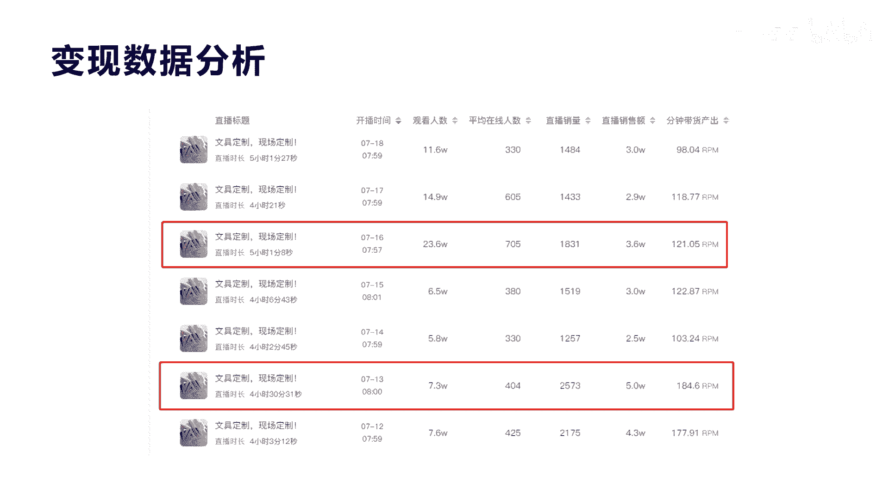
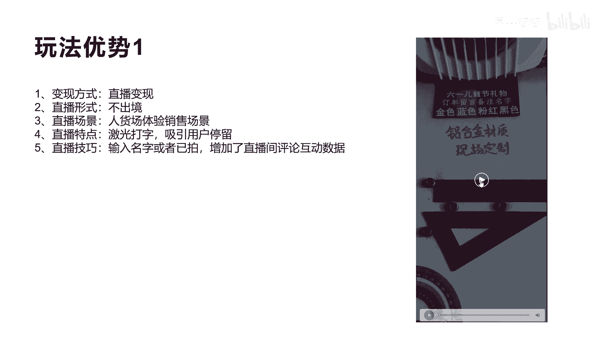
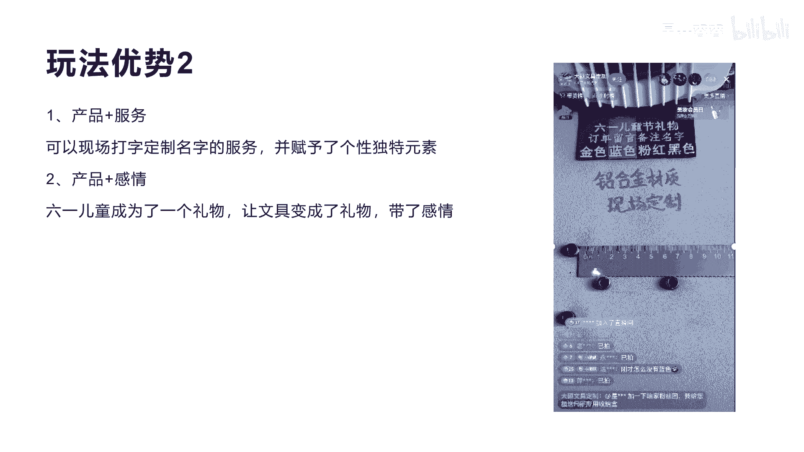
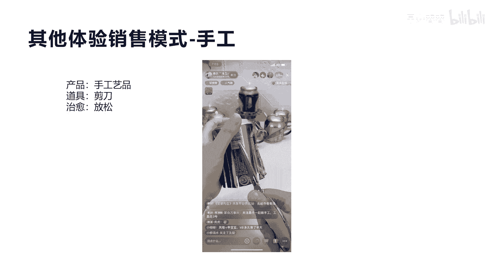
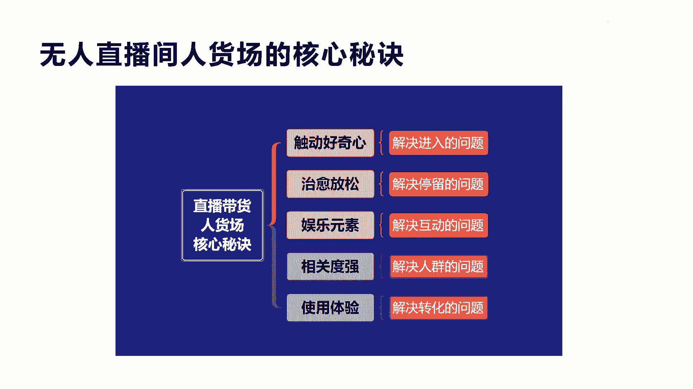
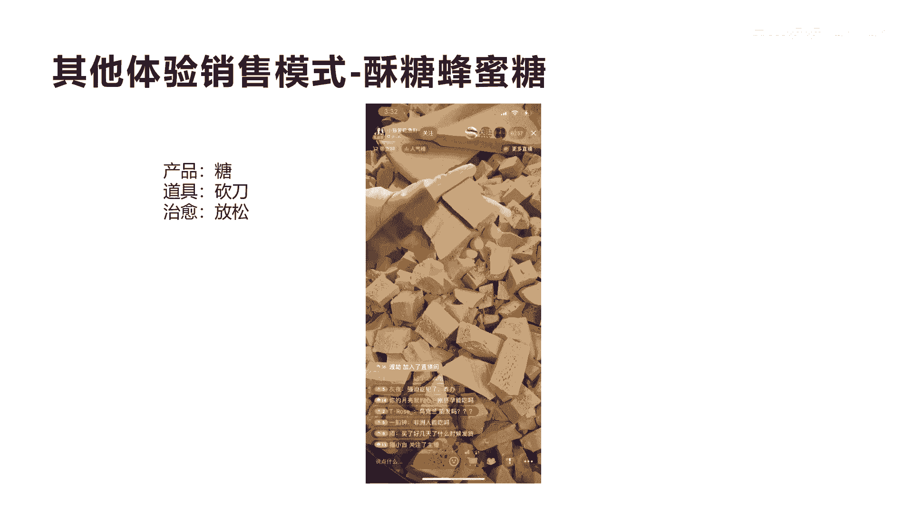
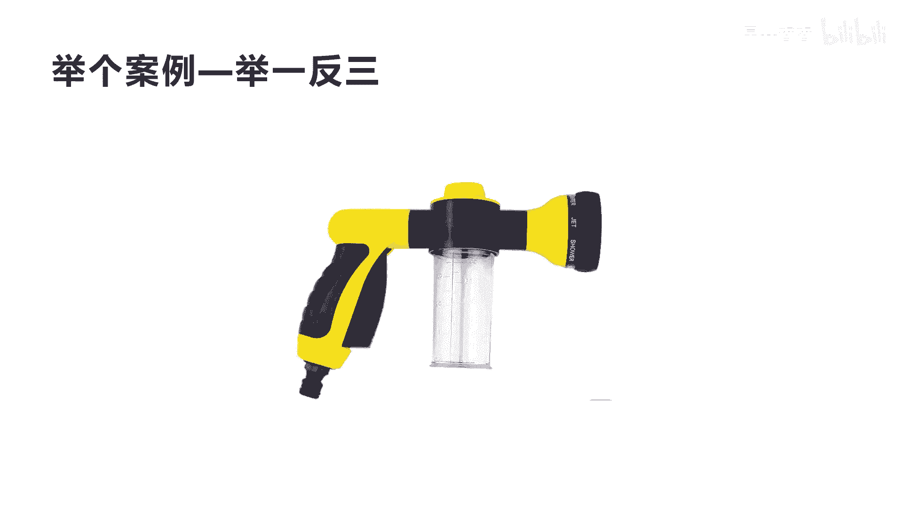
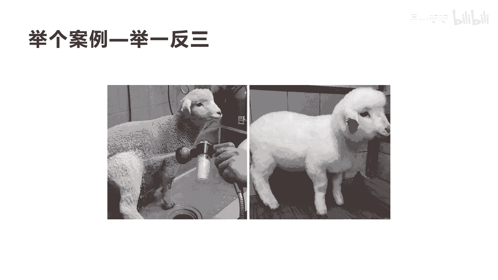
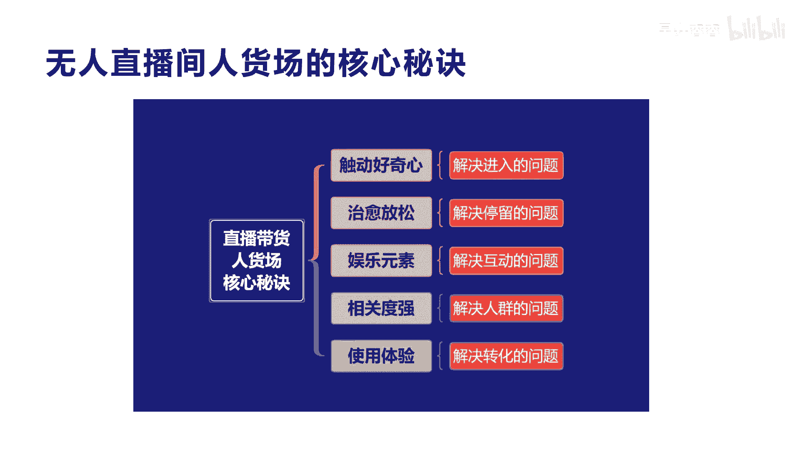

# 042 2023抖音快速起号必修课 - P25：第25节第二模式 体验销售模式-请收藏 - 早安睿睿 - BV1Gn4y1o7rC

好大家好，我们今天来讲这个呃八大模式中的第二大模式，体验销售模式，体验销售模式来讲呢，也是非常适合于普通人不处境的一种方式，第一场模式我们也讲了叫打印机模式，体验销售模式呢。

它也是适合于呃我们讲的人物不出镜的普通人，来干的一种抖音销售模式，那我们来看一个案例好吧，这个案例叫魏魏文具优品啊，魏魏文具优品呢大家可以去关注一下，你看他其实有个特点啊，他的这个呃粉丝数虽然是14。

6万，但是他的点赞数是5268个，大家不知道观察到这一点没有，实际上这一点告诉大家，实际上他所有的粉丝都来自于他的直播，而非他的短视频，所以对于普通人，我说了，如果我们说在抖音，你真正想快速变现卖产品。

那么你就做直播就可以了，至于短视频来讲，你可以做让他成为一个什么，给你打账号标签，给你做相关的一些人设定位啊，包括我们讲的这些额，整个这个账号的权重是可以用短视频去做的，当然也有很多就是零粉丝。

零作品开播，从来没有发过短视频，他的这个直播专门来进行变现，因为抖音现在我们说它有三大流量体系了，是三条不同的这个路径啊，短视频流量，搜索流量，还有直播流量，是不是，所以你想在抖音创业赚钱的话。

这个直播流量来讲，他就只要搭建人货场就可以了啊，那么你看一下魏巍优品个体户个体店的，它的销售额，看右边这个图，它其实实际上已经销售了10。4万了，好非常不错了，你看他就三个品。

而且最大的一个品销售了10。3万，就是第一个19块九的这个铝合金的尺子，你会想这个词只有卖这么多钱吗，是不是，那为什么能卖这么多钱，难道卖尺子有很多什么样的诀窍吗，啊难道买尺子的人有这么多吗。

我们看一下他的一些相关销售数据啊，这是一个它的30天的一个销售数据，这个销售数据里面讲了就是直播30次，而他的销售额销售额达到了110。8万，看到没有，第四个数据，那么他的在线场观人数平均是在664人。

而每一场直播的这个额，销售额在1875，也就是总共的销量达到5。6万，我们刚才看他就是额总共销量是10。4万啊，总销售额一个月达到118万，那么两个月就干200万，一年可以干1000多万，就卖一个尺子。

19。9元的一个尺子，他凭什么能卖这么多呢，难道就是我们刚才讲的体验销售，就可以卖这么多呢，它里面有核心的底层逻辑，好我们再来看一些数据好吧，这个数据你会发现这是他最近的一些直播数据。

宏观这个里面会有最高的，他的观看人数是23。6万的，7月16号的这个直播啊，他直播五个小时销售额还是3。6万啊，他的产关是705，他的直播销量是1830一个，而且也就是说。

平均的销量大概都是在1800到2000多左右，他的直播销售额也是平均在2万到5万之间，你看下面倒数第二个就是他的呃，直播销售额达到了5万，但是他的直播销售额5万，他的观看人数并没有达到最高分，而是7。

3万啊，大家明白我意思吧，所以你会发现他的每一场直播的这种人数，销量和他的流量都非常的啊，稳定是不是非常稳定。

我们看他到底怎么做的呢，我们来看一下他的视频，这是他直播的一个录屏啊，给大家分享一下。

服啊发你客服啊，下一个荣大宝贝的啊，像一个荣大宝贝的蓝色，要重新下单是吧，可以啊，半圆半圆刻字啊，半圆刻字的好吧，半圆也刻字，下一个荣战，还有这个宇硕啊，黑色什么样子是吧，好我们不看完了。

大概你清楚了是吧，我们这里总结了第一个，他的变现方式是直播变现，他并没有用短视频变现，是不是全部是直播变现，第二他的直播形式是人物不出镜是吧，不需要文物出境，也不需要你多牛逼的口才，你就在境外。

就是在直播场外进行口播就可以了，是不是，第三个他的直播场景就是人货场的体验，销售场景，这种人货场的体验销售场景就会形成什么，形成我们讲的啊很多因素啊，他这里的因素会，第一个会让很多人会产生好奇感。

因为他是用激光打字来刻名字，所以他直播的这个特点来讲，就会吸引很多人，哎呦没看过，用激光可以在文具三角板上面去刻名字，还可以打上一些激励的话，他这个其实最大的作用是他的这个激光打字，激光打字产生了什么。

产生让用户产生了好奇感，并且可以实时的现场的把名字打上去，这就是他为什么这么多人看他的原因，还有就是我们讲的直播技巧，在这里他有个互动数，因为大家需要把自己的名字敲在上面，然后什么。

然后他才可以根据名字下单，来进行什么现场体验，给你打上名字，所以就增加很多直播间的评论互动数据，所以我们讲直播数据的核心有三大，第一大就是我们讲的用户停留时长，第二个就是动数据是吧。

就评论互动数据和其他的相关互动数据，比如说点赞关注也是属于互动数据，那么评论互动数据非常核心，那么最后一个就是我们讲的转化数据，三大数据他都在直播间做的非常好，所以抖音认为它是一个非常牛逼的。

非常好的一个直播场景，那么就会持续每天不停的给他推荐啊，所以这就是我们讲的它的核心玩法意义，我们再看第二个，这个第二个你会发现，其实我这里总结就是这个产品，我们单独去某多和某宝。

就到淘宝和拼多多去买一样的，有有卖啊，很便宜九块九是吧，可能还不需要包邮，但是为什么有很多人在这里进行买呢，因为他加了服务，就是我们讲的定制名字的这个服务，让他具备了一种个性独特的元素进去了。

当然我们实际上在某宝和拼多多上面，也有做定制服务的，但是它缺少我们今天讲的这个模式，叫体验销售模式，因为那个他去购物的搜索，这种到拼多多和淘宝去购物搜索的这种情况下，他是不会去比较啊刻名字的这种场景的。

他直接搜索，然后把价格一排序是吧，销量一排序就购买了啊，而且他很难有产生这种让自己马上打名字，马上就可以给我克制的这种场景出来，体验场景出来，第二个呢就是我们讲的叫产品加感情。

你看他是6月儿童节的一个礼物啊，大家会觉得哎我平时买个文具，我给我的小孩子买一个，但是它就是个玩具，它就是老师需要的一个一个一个工具，但是如果我们把它打上自己的名字，然后并且我在六一儿童节送给他。

并且这上面还可以刻一些，对于小孩子的一些激励是吧，一些话术，一些这种一些一些鸡汤，这样会让这个哎呃家长会觉得诶很好，带了感情是吧，又变成了礼物，我当然19块九我就很容易下单了，大家明白我意思吗。

所以这个是它的底层逻辑啊，这就是我们讲的玩法二好吧，那么通过这个呃玩法的拆解，我给大家再看几个其他的案例，你就会瞬间顿悟了好吧。

我们来看一个案例，大师在家稍等一下，稍微等我一下，给你加下优惠券，优惠券没了，这么快的吗，额有多少个家人要优惠券，新来的家人扣一个一吧，我给你们，我看完了这个直播间，他也是一样的，大家看到没有。

也是机关克制，只是他是用的这种皮革的啊，它冒烟是吧，但是他也是什么也是在克制，那为什么他特字是这个东西呢，因为我讲我们讲他有一个核心的需求，被他抓住了，这个幼儿园的用品，这个人很聪明。

你有小孩在幼儿园没有，你有小孩，如果在幼儿园，你会知道有个这样的需求啊，就是当新生幼儿园到幼儿园去的时候，他必须给他的书包，给他的被子，给他的相关的用具，杯子碗什么打上名字，因为你不打上名字的话呢。

他有可能会拉错，而且老师也有刚开始不认识你的情况下，他也不知道怎么喊你的名字，明白我意思吗，这个其实这个痛点其实是所有幼儿园老师，包括新晋幼儿园的一个最基本的一个小痛点，而且他利用了刚才我们讲的。

用激光打字在线体验这种方式，让很多人就什么诶就被吸引进来了，被吸引进来之后呢，也会感觉到哇这个东西刚好适合我小孩子，那么在这个1000多个人里面就会有很多人是吧，真正是幼儿园的啊，家长就会购买了啊。

并且也跟我们刚才那个案例一样，他会打上自己的名字，增加他的评论互动数啊，并且已拍的或已拍还会选颜色是吧，最关键的是用这个东西，它还可以演变成其他的幼儿园相关用具，用品来进行转化销售，明白我意思吗。

所以这个案例是非常好的一个经典案例啊，好我们再看一个9。9米，你去看一下，你一杯奶茶现在都十几米的一个价格，是不是今天我们只有9。9米包邮到家啊，咱们福利现在没有了，是不是好这个东西我们也不看完了。

看到这里你大概也清楚了，他就是一个刮皮刀，是不是平时我们在厨房用具的时候，会用这个去刮黄瓜，刮丝瓜，是不是，他也是通过无人出境的方式搭建了一个人货场，但是他的人货场的搭建呢啊，是在一个呃小溪边啊。

非常好的，两看好看的两条鱼，看到没有啊，这个水流不停的在流，但是他要卖的并不是这个鱼，也不是丝瓜，而是卖的，明白我意思吗，这就搭建了人货场，但人第一感觉哇，人货场我很有想法，进去看一看他到底在干啥是吧。

你有500多人在线，他的销售额也很不错，大家可以去关注一下，好吧好，那么这个就是我们讲的体验，销售产品的一种非常好的模式，人货产品导致我们再来看一个行啊，咱们再去用这个泡沫去洗头型。

那一条条的我们有些皂皂呢，大家听到这里呢，呃看到这个画面，你可能第一感觉还不知道他是卖什么的，我当时第一感觉也不知道他是卖什么的啊，到后面我才知道他原来卖的是一个男士香皂啊，他卖男士香皂就男士香皂吗。

为什么要拉一把刀，这得刮香皂呢，很奇怪，是不是，这就是它的核心，我们讲人货场无无人出境的情况下，他口播这个里面的内容，如果只是放一个产品，你会不会觉得很单调，会很单调吧。

那么如果我要让它成为人货场的一个，融合的一个体，就让人有看内容的感觉，他必须配一个什么道具，这是核心啊，就是我在卖香皂的时候，如果他只出现在这个直播场景画面里面，没有人物出镜，也没有其他东西出镜。

就是个香皂，它就会讲什么我的香皂的功效，我香皂是怎么怎么好，那你讲完了，我也我也我也我我听的就是像广告，是不是，那这个用户当他遇到这种广告的形式，他马上就划走了，怎么可能还会停留在你的直播间呢。

所以他用一把刮刀不停的在那里刮自己的产品，让你产生放松治愈的效果，他有很多人刷抖音的时候，他并不是想来什么学习的，来买东西的，他就是来减压的，每一天，我的这个工作压力和思想包袱很大的时候。

我刷抖音是来放松自己的，让自己缓解自己一一天的压力的，是不是，所以他就会什么进入到你的直播间，然后不停的看你在这里刮，有些人可能不买，他就看你在这里刮自己的肥皂，让自己的心情。

让自己的一天的压力被放松下去，这就是他的底层逻辑，有很多人把这种模式进行了复制啊，啊有些人卖女士香皂也是在这卖啊，但这是不是核心，我们要搞清楚它的核心底层，后面我们会总结来看，我们继续来看啊，能吃吗。

有趣的眼神，可以的，饭前饭后都能吃，饭前吃顶饿打，饭后吃解腻好，我们也不看完了，这个你会发现也很奇怪，前面那个我们说的是一把刮刀，这里呢是把砍刀，他在砍什么，砍砖头嘛，但是第一眼你就觉得很好奇。

是不是想进入他直播间，看一看他到底在干什么，实际上他是在抗糖是吧，它是一种舒糖和蜂蜜糖啊，他的直播场景的平均在线人数都是好几千啊，现在是6100人，最高可以达到2万，他也是一样。

不停地用搭建人货场构建一个产品相关的道具，砍刀是吧，构建的内容，然后不停的用砍刀去是吧，去砍这个弹生产成内容，这个内容呢虽然说很无聊，但是呢它会让很多人产生治愈和放松的感觉，听明白我的意思吗。

所以你会发现他这个直播场景，跟我们前面的也很相似，我们再看最后一个，来做手工哈，箱子来剪哈，啊最后这个给他平均分为三条，三三条宽了，那我们减四条哈，好我们也不看完了，大概情况下他就是什么。

再用一个啤酒啤酒瓶是吧，啤酒这个易拉罐来用剪刀去剪做手工是吧，啊所以前面我们说用刮刀去刮香皂，用砍刀去砍这个糖，然后这里是用剪刀去剪啤酒罐，是不是，这个都是属于我刚才我们讲的构建的人货场，人物不出镜。

那人物不出镜又构建人货场怎么办呢，要有个道具，这个道具才构建这个人货场的整个内容体系，并且他不停的用道具去做同一个动作，产生了什么，让你放松治愈的这种相关的底层的逻辑在里面，这就是这些人做这个直播场景。

非常牛逼的一个地方，这个直播的他的人货场达整的好，他的最高人数达到2万，看到没有2万多啊，2万多，他按照2万多的在线人数，他起码的流量都会将近50万以上的，这种流量啊。

直播流量就是直播推荐流量会达到这么多啊，所以它是非常好赚钱的，而且他还不仅仅是卖手工，他连剪刀这个道具他都卖，所以只要你的内容的相关度，相关度非常强的产品，他都可以卖，明白我意思吗啊。

所以这个东西是非常好的一种啊，体验销售模式，这种体验销售模式更注重的是产品的体验，那么产品体验你必须配上一个道具，然后产生相关的内容，这种内容要有可观看性，要有好奇心，要有娱乐性。

要有要有让我停留的相关动力。

这就是核心，好吧，那么我们来总结一下真正的刚才讲的体验，销售型的这种都是无人出境的啊，无人出境的直播人货场的核心就是这五点，第一个触动好奇心，解决用户的进入问题，当一个画面，一个人货场构建的很好的时候。

你让用户有好奇心的时候，直播曝光进入率就非常强，那么你的人气就非常非常大，就是抖音对你的推荐人数就非常多，第二个治愈放松，也就是说你要有一个道具，不停的在那里进行什么相关的生产内容。

这种生产内容虽然很无聊是吧，虽然很这种这种重复，但是它会让用户观众产生放松，治愈的减压的效果，这样会让用户更多的停留在你的直播间，这样停播的可能3分钟，5分钟，可能是十分20分钟，他一定要把你这个看完。

看到自己觉得很舒服，他就算不买东西，他会停留在直播间。

第三个有娱乐元素，我们看一下这个直播场景啊，能吃吗，有趣的眼神，可以的，饭前饭后都能吃，饭前吃顶饿的，饭后吃解腻的，里面有牛奶吗，没有牛奶，没有奶牛啊，哥我老婆跟哥啊，我们再听一下啊，有没牛奶，有奶牛。

隔壁的跑了咋整啊，那你就跟你就买糖给隔壁的媳妇吃呗，他说我隔壁的，而我老婆跟隔壁的跑了，他他在回答这些人问的问题，但是很多都是调侃的问题啊，所以他就让人觉得哎呀，有些人到里面来还还不仅仅只是买东西的。

但反而是在里面来来享受娱乐，搞笑的一种调侃啊，就像唱二人转一样的。

是不是哎这就是我们讲的诶里面增加娱乐元素，解决互动的原因问题，这样互动数越高，你的评论数上去了，你的整个直播间的数据就做上去了，那么这个曝光静音率停留数，包括互动数这三个数据如果做好了。

直播场景就非常啊非常健康了，那么后面要解决的，就是我们讲的人群精准和转化销售的问题，人群精准一定跟你的卖的产品和内容的，相关度非常非常强，你不能说去我们刚才那个做手工的，你去卖零食，卖零食的。

你去卖卖手工，那这个就肯定是不相关的，人群不相关，你后面再怎么体验，他的转化也会很低，这就是我们真正讲的啊，无人直播间人货场的啊，核心秘诀就是五大秘诀，那么掌握这五大秘诀之后，前面的这些玩法的东西。

你都可以什么用这种方式去自己去创新，但是创新的难度很大，但是创新也是所有直播间，所有创业者里面的核心竞争力，好吧，所以我们再看一下案例啊。

我们举一反三一下看到底怎么去做，比如说我们来卖一个喷头啊，我们要卖一个喷头，这个喷头你会想，我要构建一个无人出境的人货场的方式，我应该怎么怎么做呢，有很多人说哎那我就拉这个喷头去喷汽车啊。

呃或者是去喷一些花呀，然后体现出产品的功效啊，是不是啊，这样不就构建了人货场吗，然后我人物不出镜，在边上讲就可以了，这个可以，但是他不是最好的，我们通过刚才这些案例，包括我们总结的方案。

你一定要有什么让用户有第一观感，好奇心是吧，第二个要有让他有放松治愈的效果，第三要有娱乐元素在里面是吧，那这三个东西你如果没有的话，你的直播场景就会很很平淡啊，没有竞争力，没有内容，没有搞笑的内容。

那我们怎么去做呢，做我们直接把答案展现出来，你就会啊瞬间顿悟啊。

你看到没有，如果我们拿这个喷头去喷一个阳，左边这个阳他全身都是灰尘，是不是，然后呢，我用这个喷头把它整个这个灰色的啊，身体全部把它喷干净，喷成全白的，很白，是不是，这个时候这种人货场的直播场景。

是不是符合我们三个内容要求了，第一个第一画面有好奇心，一个羊在直播场景里面干啥，是不是，然后呢，我用喷头一喷，会不会让你觉得哎我一定要看完，你把它喷完，喷干净为止，是不是第三个你可能会什么哎呀。

一个羊在里面，在这个池子里面啊，你会不会有调侃他的一些啊互动啊，肯定会有啊，你会觉得这羊好可怜啊，是不是这个羊啊，这个这个好幸福啊，怎么怎么，然后直播间的人就会跟他进行什么主播，跟跟他进行互动的话。

评论数也上去了，第一个曝光进入率也上去了，是不是，然后呢，最后我们看到这个产品的功效也确实牛逼，他可以用这么一个喷头，把他整个羊喷的这么白，这不直接就体验销售了，我们讲的什么产品功效嘛，是不是。

那么这个转化率也很高了啊，他的人群肯定也很精准了是吧，那么整个这个案例就告诉大家，实际上我们对于我们构建人货场的这种，无人出境的这种销售产品体验的方式的话，一定要去按照这个逻辑去设计。

你才可能真正做得好，明白我意思吗。

所以大家一定要把这个底层逻辑搞懂，就是我们今天讲的第一个解决好奇心，第二个有放松治愈的这种效果在里面啊，反复的对于产品功效进行什么进行重复动作，第三个就是娱乐元素在里面，你要不就是道具有搞笑娱乐的。

你要不就是什么哎主播有娱乐搞笑的，第三个你的相，第四个你的相关度要一定要强，你的内容的搭建就是蓬头厉害嘛，虽然是喷阳有娱乐性，但是你的目的是卖这个喷头，大家一看哎呀这个喷头很厉害，我要喷花喷汽车。

喷我自己家里的这个相关院子，我我愿意去买啊，那也不也不贵啊，九块九包邮或者19块九两个，我马上就进行转化，这就是我们讲的真正的人人货场，无人直播间的玩法，大家一定不要以为一定要靠人物出境。

然后去口播去卖产品，这种对于用户，对于主播，对于这种整货场的构建能力是非常难的，他对主播的控场能力，对你的牌品，对你整个对于产品的这种讲解能力啊，非常非常强，因为我们讲人货场的人一旦出境。

所有用户的目光全部会聚焦到人身上，而不是在产品和货身上，但他第一感觉你这个人不对或者不喜欢，他就划走了，明白我意思吗，而很少有人有演员，就是他有演员让观众一看就喜欢他这种表情。

这种啊这种人身上的一种特质，一旦你没有，你不管多牛逼的主播，你不管多牛逼的产品，你都不可能卖出去了，所以我们讲而且对于普通人来讲，出境没个三五个月，你很难的练出来你的啊主播能力和控场能力。

包括你的表达能力和口才能力，所以对于普通人要做这个直播带货，我建议是真正做无人直播间啊，就是不要人物出镜，对于你的表达，对于你前期的这种啊变现路径，缩短你的变现路径，这都是有非常好的作用啊。

因为我们普通人天生下来并不适合于所有人，90%的人不适合于出镜，一出镜就紧张，一出镜就不知道怎么讲，就算啊会讲的人他也讲得好，他要335个月才练习出来，有些人90%的人都练不好，所以对于普通人。

我建议用体验销售型模式去做啊。

直播带货非常好的一种模式，好吧，今天我们把这场课程如果大家都听明白了啊，都听懂了啊，你真正就可以去实操了，因为这个东西是非常好的一种啊，实操教学啊，举一反三要学会举一反三好吧。

