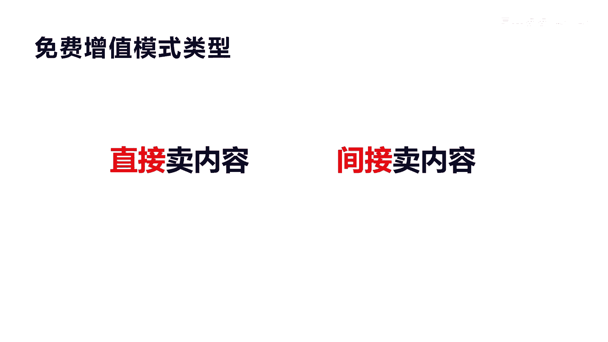
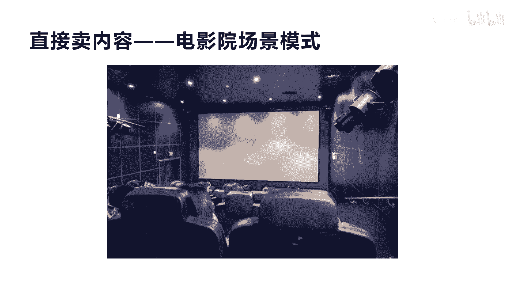
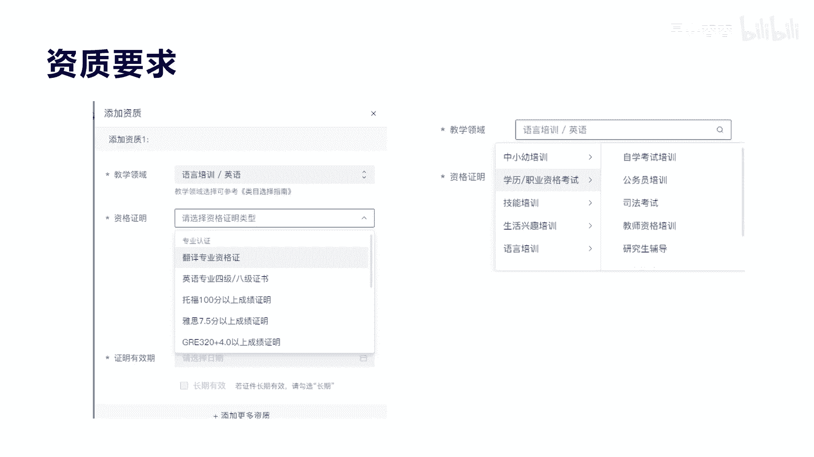

# 042 2023抖音快速起号必修课 - P26：第26节第三模式 免费增值模式（上）-请收藏 - 早安睿睿 - BV1Gn4y1o7rC

好大家好，我是涛哥，我们今天来讲第三大模式叫免费增值模式呃，免费增值模式顾名思义啊，他就是提供免费的内容，然后提供增值的产品及服务来赚钱，这种模式其实在现在的互联网平台里面，都非常常见。

比如说我们就举个例子吧，像微信，它其实就是一种非常好的叫免费增值服务的，一种平台模式，这种平台模式呢，它通过前期大量的提供这种免费，语音聊天的工具服务，然后让大量的人，包括全中国的人基本上都在用微信了。

那么在这种免费增值服务之后呢，他异性的用户达到一定体量之后，实际上他就可以设计一些很多，这种增值的服务及产品来进行收费，比如我们举个例子吧，就像公众号，其实它就是我们讲的对于企业收的一种费用。

一年300块钱啊，我不知道大家是不是知道啊，公众号它是有订阅号和服务号区别啊，订阅号，服务号每一年他收取一个300块钱的认证费，那么如果说有1亿个账号在申请这个公众号，那么他一年收的费用就是300亿啊。

这个300亿是纯赚的，它的利润率是非常高的啊，其实除了这个微信之外，其他还有很多这样的互联网平台，都在用这种模式，你比如说我们在说一个影视平台啊，影视平台，比如说爱奇艺，我不知道大家有没有看过。

你看它其实它上面有很多这种免费的电影啊，电视剧啊，包括一些其他的视频，你去看完之后，实际上你有很多增值的，就比如说这种啊有版权的，很好看的，最新的电影的这套电视剧的，你是没办法通过免费方式看的。

那么他就通过一种增值服务，我们叫做会员服务，那么如果购买了一个月和一年的会员服务，那么他就可以去什么看这些增值的电影，电视剧，包括它里面的一些广告去水印，包括广告的免广告的这些等等，这是增值服务。

它都是属于他会员的权益啊，这就是我们讲的免费增值服务，那么其实在抖音里面也有很多，其实跟这种类似啊，他也是提供这种免费的内容，然后免费的短视频以及免费的直播来讲干货啊，非常实操的一些干货啊。

非常实用的一些什么内容，比如说我们打个比方，就最近比较火的那个刘耕宏是吧，他的跳操服，他在直播间里面是不是让很多几百万的人，几千万的人在跟他一起跳操，他这种其实有没有收费，没有收费。

它是一种免费提供跟跳健身运动的一种服务，那么其实他如果要变现，他就是我们讲的免费增值服务模式，它提供这种免费增值，免费的这种直播模式，然后后面通过这种增值的会员服务也好，通过增值的服务及产品也好。

来进行变现收钱，大家明白我意思吗，好，我们来看一下，到底抖音里面到底有哪些人群适合做这种好，我们讲的免费增值服务，那么在抖音里面，其实符合抖音的免费增值服务的类型，其实很多大家都刷到过。

比如说我们讲的知识付费，其实大家购买我课程，听的这个就是叫做免费增值服务，我们大家可以去教别人教短视频的这个啊课程，这种内容服务也有很多，教英语，教语文，教数学，包括教小孩子的注意力，包括教运营。

教商业，教销售等等，这种所有的关于知识付费体系的这种博主，都在抖音上面做，因为抖音他是个天生的内容电商平台，它并不是纯电商平台，内容电商平台才是抖音的本质，所以如果你具备一定的知识体系的人。

你具备一定技能的人，你都可以在抖音用这种模式来进行什么变现，增值变现好，那么第二个呢就是讲的运动健身，运动健身其实也有，刚才我们讲过刘耕宏也好，包括我们讲的刘芳是吧，形体形体礼仪，包括很多教瑜伽的。

是不是这种等等，这种运动健身的这种博主，其实也是天生适合于在啊抖音里面进行增值，免费增值变现的啊，因为它天生是一种通过免费指导，免费学习，免费输出内容价值的一种类型，包括第三个我们讲的生活技能。

它也是教人钓鱼啊，教人叠衣服啊，教人扎头发，教人美妆，教人做美食等等这种生活技能的，都属于这种免费增值模式，我提供这种短视频的，教你怎么去钓鱼，教你怎么扎头发的这种内容，包括直播间怎么去教你扎头发。

然后通过扎头发的相关内容及产品及服务，进行变现盈利，这就是我们讲的免费增值模式，当然除了我们刚才讲的知识，付费健身运动，还有我们讲生活技能，还有很多其他的手艺人的相关的，都可以用这种模式来做。

这就是我们讲的，如果你具备一定行业或者某个领域，有一定技能的人，他都可以，就算我们在呃抖音里面，也发现有很多这种很小很小的技能啊，就包括比比如说我那次刷到一个教别人在啊，教别人怎么怎么破鳝鱼是吧。

教别人怎么做手工，教别人怎么去玩游戏，教别人怎么去啊，做豆腐等等等等，只要你有一个相关技能，你有专业的技能知识，都可以在抖音啊进行知识变现，进行免费增值的这种模式，那么后面我们来讲。

免费增值模式到底有哪两种类型，我们来看一下啊，免费增值模型其实它有两种类型，今天我们这节课只讲前面一种叫直接卖内容，还有一种我们叫间接卖内容，我们在下一节课会讲，那么直接卖内容，它就是我们刚才讲。

你本身就具备一种内容价值的能力，把这种内容价值通过什么，通过你的载体把它卖出去，这就是我们讲的直接卖内容啊，很简单，刚才我们讲的，比如说你教别人英语，那么英语这个东西你可以把它包装成一个课程。

你也可以把它变成一种什么书籍，当然你也可以把它变成一种线下的课，线下的培训课程，是不是等等，那么这就是我们讲的直接去把内容给变现好，那么直接卖内容的话，我们想，其实他是非常符合抖音的这种商业模式的。

因为抖音我们刚才讲过，它就是一个内容内容平台啊，大家来抖音就是来看内容的，他并不是来买东西的，所以我们看一下举个例子啊。

就是比如说我们啊经常去电影院去干什么，去看电影，其实大家去电影院看电影，其实就是我们讲的来消费和享受，电影的这个内容带给自己的一种情绪的释放，是不是啊是惊悚片，喜剧片还是等等这种啊，动作片。

是不是它是都是一种类型内容类型，这种内容类型可以带给你，释放掉你相应的这种情绪，它实际上就是一种啊卖内容的形式，那么如果这种卖内容的形式，你想一下，如果在这个过程中，他又把另外的电影在我们看电影的时候。

用广告的形式用这种方式传递给你，你会不会看，你当然会看，因为这就是我们讲的在卖内容的时候，他在还在传递增值的内容，这就是我们讲政治，就是你在看一个这个购买，自己购买一张电影票，看电影的时候。

他在开篇的几分钟或者十几分钟，他会把自己相关的，所有其他的好片子的内容的广告给你放出来，这种其实对于用户他是不排斥的，但是如果说你在前面10分钟，或者在电影过程中去穿插一些硬广告，比如说我卖杯子，卖。

卖服装或者卖等等，一些其他的跟你看电影没关系的，这种内容和广告，你会不会有反感，当然会有反感，所以我们讲真正直接卖内容，他一定是转化率非常高的，包括我们讲如果他在呃电影门口，他给你卖什么，卖爆米花。

卖饮料，卖零食等等，这是不是我们讲的跟内容非常相关的，跟这个内容长非常相关的一些产品，它是非常转化率非常高的，但是如果他来门口去给你推销服装啊，家电啊，或者是珠宝等等，实际上跟你看电影的这个内容和场景。

他根本不相关，对对于用户来讲，他实际上就是什么，就是一种非常排斥的，其实在抖音也是一样，抖音我们在看内容的时候，实际上是在享受内容带给你的啊，喜怒哀乐的这种情绪，那么这个时候如果你刷到一个硬广告的话。

你会感觉什么唉，很难受，就会刷过去，抖音也会考虑到用户的体验，如果他在看内容的时候，老是有这种不相关的内容推出来的话，对于用户它实际上是一种损失，懂我意思吗，这种体验上面的一种一种损失。

所以抖音它其实我跟我们看电影一样，他都是一个叫沉浸式的体验销售，这种沉浸式的体验销售来讲呢，实际上他购买产品的价值它是非常高的，一般的我们在消费者做过数据判断啊，消费者一般在成近视体验的这种消费里面。

一般可以达到150美元啊，通过这种沉浸式的啊，这种就是不像我们用拼多多，或者是我们讲的用淘宝他去购买的时候，他就是比价的这种方式，是不是，那么对于沉浸式的这种，或者叫或者其实抖音把它称为叫兴趣电商。

它实际上就是我们讲的，他在看某一个内容和某一个视频的时候，他沉浸到这个内容里面，沉浸在这个场景里面，他是很难去什么去思考，它是一种感性的去什么购买，所以它的价格呢反而偏高。

这也是很多人为什么在抖音里面说，哎我买的东西比拼多多和淘宝要贵的原因，因为他在这种场景下面，他没有让你有思考和对比的这种行为，所以导致了沉浸式去购买，他的这个啊利润空间就比较大一点。

当然这种最后来讲你的呃品质，包括你的等等东西要呼应的上，其实对于沉浸式的这种电影形式，它后面包括VR元宇宙，它其实可能会颠覆掉电影，和我们讲的直播这种形式，那这个是后话了啊，但是沉浸式的这个呃。

营销的核心其实在于场景和氛围，就是他为顾客营造了一种场景式体验式，沉浸式的这种体验销售，他让顾客感到了很快乐，只有像沉浸式这种电影院的这种模式，包括我们讲的抖音这种模式。

它才可以真正把用户的时间给留下来，这样就不愁去打开消费者的钱包了。

那么第二个我们来讲直接卖内容的核心是什么，其实很简单看啊，直接卖内容的核心就两个，一个是内容免费，然后就是消费内容好内内容免费是什么意思呢，其实就是我们讲的啊，刚才讲到很多这种知识付费啊。

提供很多这种知识干货技巧的，这些本身的这种内容，免费提供一些给大家去学习和看啊，大家在这种学习过程中，感受到这种内容的价值之后，再把这个内容进行深度的学习和全面，系统的去打造。

然后让用户去购买你的相关的，这种系统性学习的内容，这种内容我们说刚才也说过，他的载体有可能是什么，就是我们刚才讲的就是我们这种视频的课程，还有一种是什么，比如说书籍，还有一种是什么，可能是线下的一种啊。

这种培训课程是吧，三天两夜的集训啊等等，这些都属于消费内容，所以内容的消费到消费内容，它其实是一个递进的过程，由浅入深的过程，大家明白我意思吗，所以这就是我们讲的免费增值模式的核心。

你一定要有免费的内容提供给用户，感受到你很专业，你有干货，你很难帮助到我，他才可能去购买你更深度的相关的内容服务，这就是我们讲的内容消费和消费内容好，我们看一个案例啊，讲了这么久，我们来讲一个案例。

这个案例是英语雪梨老师，这个案例其实非常普遍，因为大家全网都在讲，因为他在英语这个赛道，他是number one啊，他是number one，他有815万的这个粉丝，而且他每一个月30天。

你看他的销售额，直播销售额达到了将近3000万，就是一个月做到3000万的一个这样的体量，那么一年是多少，将近3。6个亿啊，3。6个亿啊，他这种知识付费的核心在于它边际成本低，利润高，这是它的核心啊。

当然它有一个核心就是它没有复购率，它的复购率，唯一的是靠它的不同的产品的深度和广度，来进行啊，这种言，但是这种复购率也会很低啊，也会很低，但是他已经很不错了，你看他的带带货口碑达到4。99啊，4。99。

他每天啊都是定期来直播的，你看他每30天他直播了28场，只有两天没直播，每一场直播大概占场观人数达到2000，338人啊，就在线人数啊，我们不是说他流量，他的流量更大，每天大概在10万到10万的流量啊。

10万的厂这个厂关他是场馆在线人数，平均在2300人，而且他的直播销量你看到没，一场一个月的直播销量达到8。6万啊，8。6万，他的课程我们等下会讲一下啊，我们来看他的这个直播的数据。

你看他的这个直播数据，我们是从7月28号到8月2号，这个整个六场，你看他的整个六场的直播数据非常均匀啊，他的厂关人数都是在8。7万到一十，1。9万之间，那么他的平均场观人数都是1000多。

是不是它的销售额都是最低是45万，那最高达到了68万啊，一场直播能做到这么大的销售额，就是卖课程，你看我们来看一下他是卖什么课程啊，他的课程很简单，三套课程，第一个课程是叫零基础的英语三合一。

卖398元啊，他卖398元，一场直播他可以卖多少，803套啊，803套，也就是说他的一场直播，他竟然可以卖32万，就一个课程，另外一个课程呢就是298元的啊，298元的，他卖了910套啊。

910套是27。1万，还有一个最新概念英语二，它是328元啊，也卖了200多套，卖了7万多，整个一场直播这里算起来将近就有六七十万啊，这个这个的利润是非常大，几乎几乎是百分之百啊。

就算他的平均的一些这种，人耗成本和运营成本啊，90%的利润是是是有的，也就是六七十万可以赚个四五十万，没问题，大家明白我意思吗，啊赚四五十万1年就这样算的话啊，一场直播赚这么多。

一个月就是1000多万啊，一年就是3亿的这个利润啊，所以你要想知识付费这种体系，如果你真正具备一定的能力，他在抖音上面是非常赚钱的，真的非常赚钱啊，虽然产品它有复购啊，它可能会有更大的商业模式可以上市。

可以达到真正的一些高的体量，但是对于普通人来讲，你作为一门课程能达到这样的体量，这是没有哪个地方可以做到的，没有哪个互联网平台可以提供这种爆发式的，这种销量好不好，我们来看另外一个账号，北大花花啊。

这个也是一样的，也是个头部的啊，大家应该都刷到过啊，都刷到过，他的这个销量也很吓人，你看到没有，他的30天的销量是1308万啊，虽然没有做到3000万，但是做了1000多万也很不错。

一年将近也有一一个多亿啊，是不是他的粉丝数只有360万，360万，而且他们都很拼，他们每天都是非常定时的，六点钟就开始直播，直播到10。4个小时啊，几乎是没有停顿的啊，几乎没有停顿。

你看30天他直播了22场，就平均场观人数也有2000多啊，每场销量是4。9万啊，他的UV值还是2。1，非常不错，只要UV值其实只要大于一就很不了，很牛逼了，他的客单价你看到没是268元啊。

268人一个平均数，我们来看一下他直播的一些相关数据啊，你看他的这个销售数据，他就是卖的四场直播最近的啊，你看他的这个呃人数，他的场观人数，其实比刚才那个雪莉老师要大得多，他每一场直播有36万人在线。

47万人看62万人，看59万人看，但是他的销售额你看到没有，非常恐怖，他的销售额你看有60万的，有90万的，有95万的，是不是他的四天基本上就干了将近啊，将近200万，200多万是吧啊，非常牛逼。

那他就卖什么呢，就卖了一个课程啊，你看他的一个课程是什么，清北学霸推荐的学习能力专项提升课啊，花花专讲，他是359元，359元，他卖多少，卖了2560啊，单场直播就突破91万啊，非常吓人。

这种这种体量他我们看过他的直播，他在直播里面只要说上100单啪一秒钟就抢完，上100单一秒钟就抢完，所以他的直播里面你看卖2560套，全国这么多人，你现在这种头部啊，就像花花北大花花。

包括雪莉老师这种在头部上面的还有很多，但是他们俩体量确实比较大啊，确实比较大，他把全中国这种市场如果吃掉了就不得了了啊，所以对于这两个案例是非常典型的案例，当然我们说普通的。

你像我们这种啊博主你要卖这么大体量，那是不太可能的啊，不太可能的，很难啊，很难呃，现象级的人物，当然对于其他的普通人，你能在通过知识付费，通过你的专业领域，比如专业的某一个细分的技能。

你在抖音创业一个月能做到个10万，20万或者50万，已经非常了不起了，一个月是不是一年能做到个两三百万，四五百万啊，已经非常牛逼了啊，非常牛逼了是吧，所以对于很多普通人就用这种模式去做啊。

当然这种体系对于普通人有一定难度，做课程和在呃抖音去直播，教别人做这种知识体系，它是有一定的难度啊，它不像我们卖普通的产品，它必须自身要有内容体系，或者你要有什么演讲能力，要有口才能力。

传道授业解惑的能力，比如说我们还讲到最近的那个张琪，是不是啊，一场直播将近也卖了上千万是吧啊，一场直播卖了上千万，他就卖了一个365元的一个课程，还有一个这个直播课程啊，就两个课程啊，非常的呃牛逼。

他是博山的一个，现在今年比较牛的一个新的一个这样的讲师，所以对于知识体系来讲，在抖音一定是呃最好的没有之一啊，最好的一个平台没有之一，因为像我们其他的电商平台还是这种呃，像喜马拉雅。

喜马拉雅这种语音平台，还是知乎这种文字内容平台，他都没有像抖音这种产销学啊，一体化的这种平台没有，那么我们要做这种知识体系，今天我也会着重来讲，我们怎么去做这种知识付费平台呢。

有很多人去给大家推荐这种啊，卖这种做客的客的这种课程啊，今天我就免费讲一些，我是怎么来做这些课程的体系的，包括课程体系有些什么样的类型，我给大家讲一下，第一个就是我们讲的这种要做知识课程平台呢。

它只有现在目前来讲，我推荐三个这三个人，一个是学浪是官方的啊，学浪是官方，大家都应该知道是抖音自己的研发的一个平台，专门来辅助和扶持知识付费的这种赛道的，因为知识付费我们说白了就是非常符合抖音的。

抖音也看得到，所以他成立了一个学烂的平台啊，包括第二个就是小儿通，它是一个商业平台，他原来是做微信商业下面的一个平台啊，这种平台它其实实际上呢呃就是需要付费了啊，就要付费，一年大概4900多块钱。

4800多块钱，然后还有更高级的啊，所以他当然这每个都会有它的，不同的优点和缺点哦，等下我们来讲第三个就是海，海豚知道，其实海豚知道呢，它是依托于在抖音上面的一个小程序啊。

他是一个小程序的平台认证的一种平台，所以很多人啊在海豚知道上面去啊，入住他也是要收费的，他大概也是1900块钱到6000块钱不等，不同的版本啊，所以他是好处在于它不需要去挂小黄车。

也不需要通过抖音的学浪的这种审核啊，他比较自由一点，所以很多没有相关的资质的人，他都在海通知道上面去挂自己的课程，就比较容易去发送啊，但是他的成本来讲，稍微就啊比小儿童要啊便宜点，就比小儿童要便宜一点。

那么学烂平台还是我们讲的官方扶持的，好的平台，它好处在于它可以在我们的啊，我们讲的抖音的商城，商品橱窗里面去展现自己的产品，而且你购买完之后，用户可以通过客服，包括我们去查看你和去浏览你的课程的时候。

就像大家去看我这个课程，其实只要到学浪平台，包括抖音平台可以直接去看，这是非常好的一个方式啊，但是它难就咱难在，现在抖音对于学浪的资质的要求越来越严格了，不是所有的这个呃，这个赛道都可以去免费入住的。

包括他现在还没有个人入驻的门槛，他去必须要有企业入驻啊，包括机构入驻的条件，而且很多赛道他也不一定啊，免费入住的入口了，他都需要特邀很多行业啊，像律师啊，财经啊，包括我们前一阵子的这种运营平台。

就像我们讲交教别人做抖音的这种运营的赛道，他其实都是封闭的，都需要特邀啊，那么小额通我跟大家刚才也讲了，他是个第三方平台，它就是我要去第三方平台买小儿通这个平台，把自己录的课程挂到小儿通上面，然后呢。

再通过小儿通的这种啊链接和相关的东西，去什么发给用户，用户通过在微信平台或他，而且在抖音上面去购买的话，他需要发送一个这种额兑换码啊，这种兑换码，然后再到小儿童平台上面去什么去进行认证。

或者是啊兑换才可以去看他的课程比较麻烦啊，比较麻烦，但是它有好处，它的好处就是在呢他转到了思域啊，思域的互动，这是他的优势，海通知道呢我刚才也讲了，海通知道他其实来讲呢，当我们没有任何这种资质。

然后呢呃又想快速的去啊，挂上挂上自己的课程，然后也不想跳到思域上面去啊，那么海豚知道是比较好的一种方式，他就是需要有什么必须要有啊蓝威，然后要挂一个小环叫小雪花啊，这个小雪花呢它是有条件的。

原来是要求1万粉丝啊，现在好像有一种方式可以通过啊，关注问一问这种小程序的啊，抖音小程序有个叫问一问，你可以去搜一下，然后他关注之后，认证完之后，只需要111千粉丝就可以开通这个小雪花，开通小雪花之后。

你就可以挂海豚知道给你的相关的小程序链接，然后你把它课程入住到海豚知道，就可以开通你的课程售卖，当然海豚知道还有一个好处啊，就是呃抖音直播带货的时候，他考核两个维度的数据，一个是你直播的内容的数据。

还有一个就是电商的数据，如果挂海豚知道，实际上抖音就认为你没有挂小黄车，他就不会去考核你的电商数据了，那么对于直播带货来讲，包括他获取流量的容易度来讲就更高了，所以对于很多人。

他是为了避免他的销售数据不好，而采用这个海豚知道去挂小小雪花来进行销售，这个订单对于抖音来讲，他就没有看到你挂小黄车不会考核你的啊，电商数据啊，就这么简单，我不知道大家听懂没有，这三种方式。

但是对于目前来讲，我觉得如果你具备一定的资质能力，具备一定学难认可的一些资质，那最好还是入住学烂，你看我就入住学烂，但是入驻学烂呢，学烂现在要求对于啊教授这种K12的，他是明文禁止的，明文禁止的啊。

所以你如果要教K12课程，它是不允许的，而且他需要上传老师本人的最高学历证书，包括其他的教学能力的字数啊，具体他又要看你入住是哪一个类别啊，英语语文包括技能培训，包括运营，它都不一样啊。

大家可以去去学烂平台，去入驻的时候去查看一下啊，学烂平台他还需要有，如果你现在入驻，他还需要啊绑定一个抖电啊，抖店原来是个人可以注册5000块钱的保证金，现在都需要开通，至少要1万。

就是企业才可以进行绑定了，那就是你必须要有啊工商营业执照啊，才可以开通掉抖店，然后进行血量的绑定好，这是我们讲的这三个内容，那我们具体今天还跟大家来分享一下，我是跟大家讲学烂平台的具体操作细节啊。

其实学量平台大家可以看这个界面啊，它就是一个这样的应用软件，但是它有一个app，但是一般情况下，它需要在电脑上面去打开，这个学烂的一个应用软件，下载完安装之后，你进行入驻，完了之后。

他这边有很多一体化的这种东西，包括课程的管理，教学的管理，社群管理，包括我们讲的营销工具，交易交易管理，财务管理，包括啊还有去申请他的资质的相关通道啊，整个这个体系，他还会有app的啊。

大家有很多这种通过在学院上面开直播的，他就必须要把这个电脑版的应用软件给下载，安装好，并且你可以在这个上面进行教学啊，它有很强大的白板系统啊，教学系统，社群系统啊，非常完善啊，非常完善啊。

包括我们来看一下他的资质要求这一块啊，他在申请你比如说他在申请资质要求的时候，申请某一个板块的时候，你会去什么去去选择他的啊，教学领域，教学领域之后呢，比如说我们选的是英语。

那么他要求的资质证明就是有下面的，有翻译专业资质啊，四级啊啊托福啊，多少啊等等一些相关的成绩证明，包括你的一些呃更多的其他的辅助的资料，你都要上传给他，他认证通过之后才会把这个啊类目开放给你啊。

这个类目开放给你，你才有权利去上传你的什么啊相关的课程啊，包括后面的我们看到有一个他这里的教学领域，还有很多像中小学培训学历，职业资格考试，包括技能培训，生活兴趣培训，语言培训等等啊。

这些都属于啊他的细分的一些分类啊，只要你具备这些相关的一些领域，你就可以把自己的课程上传上去，这就是我们讲的整个对于啊学上来讲，一个非常好的一种啊，这个叫做内容卖内容的平台，它实际上我们讲知识付费平台。

他就是卖内容啊，所以抖音它开放了学呢，他就是来辅助抖音来卖内容的啊，抖音这种卖漏用的形式一定是长期的一个过程，因为在我们讲的抖音的核心，第一个是让大家来什么享受内容，享受内容其实就是啊开心是吧。

喜怒哀乐这这些内容，然后第二个就是学习呃，抖音的顶部频道里面你会发现有三大频道，现在四大频道了，第一大频道是什么，就是我们讲的这个电商，现在有一个叫商城出来了，第二个就是我们讲的什么，就是本地是吧。

本本地服务，第三个就是我们讲的知识，是不是这些其实对于抖音来的，他都知道这是核心用户的诉求，那么还有像我们讲的搜索啊，这些东西都是辅助于相关的这些频道的啊，所以抖音只要你认为你自己有一定的啊。

这个专业技能，或者是有一定的专业知识，你都可以把自己的专业知识包装成课程，然后在抖音去做创业，做销售去赚钱好，那么第二个我们要讲的就是我们讲的。

