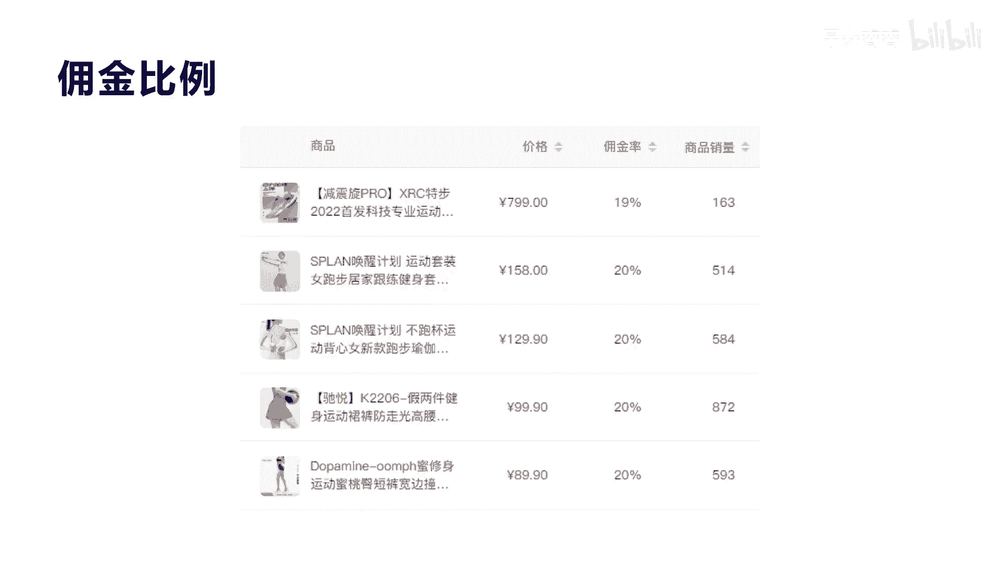

# 042 2023抖音快速起号必修课 - P27：第27节第三模式 免费增值模式（下）-请收藏 - 早安睿睿 - BV1Gn4y1o7rC

大家好，今天我们来讲免费增值服务的第二种类型，叫间接卖内容，那么间接卖内容的核心呢，其实跟直接卖内容的核心有一些不同，我们讲直接卖内容的核心是内容，免费的消费内容是不是，那实际上它围绕的都是我们讲的。

内容之间的传递，而我们讲的间接卖内容，其实它是叫做内容免费，而消费的是什么，是内容的辅助产品，也就是相关产品，那这个怎么理解啊，其实很简单，就比如说我们来教呃，大家去免费健身，这个实际上是一种内容。

是不是视频的内容也好，文字的内容也好，他是教你怎么去免费的去健身运动，那么实际上这种东西你怎么去变现呢，用户他肯定不会去买，你当然他也会去买，你更深入的怎么去运动的课程，但是这种东西实际上对于用户来讲。

他实际上很难感知，他需要的就是免费带他跳，带他练，然后我再通过练和消学习的这个过程，来什么去购买你相关的辅助内容，那我就去买你的什么，买你的相关的用这个设备是吧，健身运动的呃，跳绳的绳子是不是包括运动。

健身的一些相关器材，这就是我们讲的啊，内容免费，然后通过消费内容的辅助产品来进行转化，这种转化率也非常高，它比那个直接卖内容，其实转化率不不低，大家明白我意思吗，所以我们来看一下啊，这个案例有哪些。

其实对于很多刚才讲过运动健身，这个在我们讲抖音这个品赛道里面，平台里面是非常常见，你像刘芳形体这个礼仪这个账号啊，啊非常吓人啊，他也是个头部，你看他一场直播啊，一个一个月的直播，将近可以卖6456万啊。

他是1700万的粉丝，你像他这种销售来讲，他还算比较低的，在高峰期我看到他的账号，他一个月将近可以卖上亿，就是可以卖一个亿一个月，所以他一年干个十几个亿非常容易啊，而且你看他。

你基本上一个月直播会达到一天两场，你看到没有，但有除了两场之后还会死，就30天，他直播了73场啊，73场他每一场的场关将近有3。2万人，很吓人啊，刚才我们看啊，上一节课我们看到这个呃，这种直接卖内容的。

像知识付费的这种赛道，他最多也就场关大概两三千人，你已经很不错了，他这个场关是3。2万人啊，平均在线啊，所以他的流量更吓人，我们等下来看一下，它其实跟我们讲的，直接卖内容的这种利润率来讲，它还是小很多。

因为它毕竟这个产品来讲啊，他是啊需要有成本的，是不是，但是它也有很多其他的啊，一种好处就是它有复购啊，大家明白我意思吗，他买了这种产品之后，他可能会继续的复购，买继续买这个产品啊。

但是知识体系它不会有复购，它的复购率很低，是不是，所以你看他有他的特点，他的UV值也达到了2。2，他的口碑是4。98，非常牛逼的一种账号，这是头部的，我们来看一下它的相关的直播产品的数据啊。

他你看他卖产品相关产品是哪些产品啊，你看都是59块钱，100多块钱，200多块钱的一些产品，这些产品都是它什么形体礼仪的相关的，什么一些产品，吃的食品比较多，因为形体礼仪它三分靠练，七分靠吃。

所以诗其实对于形体礼仪，练习运动健身健美来讲，他是非常必要的，非常必要的，你看他一场这种呃，卖这种59块钱的这种东西，它可以一场直播，可以卖22万是吧，168，169元的这个美白丸啊。

一盒他可以一场直播卖21万啊，我们平均算他有20%的利润的话，他一场直播就这个东西它可以算4万，就一个产品啊，包括其他还有很多啊，我们这里只列出来这么多啊，当然我们讲呃这种产品的这种消费产品。

对于这种啊大博主来讲，其实还不算什么，但是他还有二次的转化，他其实有很多就转私域了啊，刘芳这个账号他有很多转私域，转私域之后他还可以转线下培训啊，所以他的这个呃用户的这种价值链，它是非常长的。

而且他又反复复购，比如说我吃完了这个美白丸，我下次还要买，是不是我一个月吃满了，我第二第二个月我又来啊，刘芳这里去买，就这就是让他形成了一个长期稳定的一种收入，他体量非常大，底的一家一家上市公司了。

是不是好，我们来看另外一个啊，这个叫清波形象美学，他是教教大家什么扎头发的，我跟大家讲，他这个也很牛逼啊，47万的粉丝啊，每一天大概一场直播，你看他的场观也在2000多人啊，平均在线2000人。

有时候高的时候可以达到五六千人，我看他最高的时候达到1万人在线，非常牛逼，他一场直播，你看一个月直播大概可以做到300多万啊，300多万也很不错，他就是在直播间里面教大家去扎头发啊，不停的去呃。

不同的这种扎法，不同的这种头发的发型的这种设计等等，他在直播间就免费教大家这些内容，然后通过大家来看这个免费的内容之后，去转化成增值的相关的辅助产品的销售，这就是它的核心，这种转化率就顺其自然啊。

他不会像我们说的哎你硬管的去卖一个产品，硬管的去在直播间里面去销售某一个服装，这是非常转化率非常低的，大家明白意思就是碰到了就碰到了，而且需要靠很强的这种啊排品啊，运营啊，包括我们讲的这种控场能力。

而对于这种来讲，其实啊这种内容的主博主来讲，他对你的信任度就非常高了，本来信任度它就是一种货币，是不是我们讲叫社交货币也好，或者叫信用货币也好，它本身就有溢价，所以他去转化推荐大家来买其他的产品呢。

顺其自然，我们看他的卖什么东西啊，你看清波研，他就搞了个清波研，选清末源选他有卷头发的，你看到没有卷头发的，包括优雅V领啊，碎花裙，她卖裙子跟衣服搭配嘛，你看到没有，他他可以卖很多，只要大家想想。

只要只要他的人群是吧，是爱美的啊，这种他都会去相关产品，包括他还有什么玉米须，玉米须垫发根是吧，159元，他也卖了将近6000多，一场直播里面他大概也可以卖个几万块钱啊，非常不错了啊，非常不错。

它的利润率如果能达到20%，一场直播也将近有啊，一两万利润一，一个月也将近几10万的销售额利润，是不是啊，非常的呃吓人了，所以这种只要你具备一定的技能，这就是我们讲的把这种技能包装成内容输出。

输出完之后卖内容相关的辅助性的产品，这种转化率非常高，这也其实就是很多人讲的，我们讲叫IP，就是你在某一个知识领域，某个某个服务领域有非常强的这种专业技能，你就会形成IP，IP就会形成信任。

这IP产生信任完之后，这种通过信任去销售你的产品，他比那些明星明星是靠什么，靠名气，是不是靠名气来产生信任，产生货币，然后他去直播带货，所以有些大网红为什么可以带货带那么多。

也是因为它其实商品大家都知道差别不大，我到你这里买，还到别的地方买都一样，但是为什么你这个讲要买什么东西，我就跟着你买了，因为你对我产生了信任，产生了信用货币是吧，这种信用货币可以产生一定的溢价。

和这种粘性啊，这就是我们讲的啊，卖内容转化成间接卖类，卖产品的一种呃类型，我们再看一个我们的一个学员的案例啊，这个叫罗小瓜啊，他在其实他做了有将近两年了，两年了，他一年之内呢他都没有考虑到变现。

原来最高就是没有变现，之前大概就是2。6万粉丝啊，他每天把自己的一些相关的啊跑步啊，他喜欢跑马拉松啊，跑马拉松的这个呃运动的这种内容，把它每天输出到自己的短视频啊，每天发每天发也就是涨了将近2万多粉丝。

最后他发现诶他还是需要想变现，那这种变现呢其实对于我们刚才来讲，其实很简单的意思，就是他通过我们讲的免费内容，然后通过增值服务来变现，它就属于我们讲的不是直接来卖内容，而是间接来卖内容，间接卖内容。

就是我们讲的通过我们去什么内容来吸引用户，产生IP，产生信任之后，我来卖这个运动跑步的相关的产品内容，那他的相关产品内容，他喜欢跑马拉松，所以他就会卖相关的跑马拉松所配套的产品，这就是它的销售。

你看他30天卖了将近100多万啊，非常不错啊，非常不错，他只坚其实坚持呃直播还不到一年，坚持直播还不到一年，前面也花了两三个月，直播都是在个位数，没有什么额销售额，其实最终有销售的是从今年的啊。

2月份开始啊，他现在平均一个月的销售额100多万，一个月的利润，纯利润大概在二三十万啊，纯利润在二三十万，所以他这种利润率虽然不呃，销售额虽然不高，它对于普通人来讲，他就是运动健身的一个爱好者。

也他也并非是一个非常职业专业的一种啊，呃教练啊，他就是自己爱好，把自己的这种爱好分享出来，然后在直播间里面不停的去传播自己，对于某一个品牌，某一个服装和某一个类型的自己的见解。

然后就会很多同频的女孩子也喜欢她，然后就购买了她相关推荐的这种产品，其实这些产品我们等下会看一下，其实他的这些产品对于很多啊，普通人去去拼多多啊，去淘宝去搜，其实价格都一样，因为它就是带货。

他没有自己去开他啊，开抖店他实际上就带的这些品牌给他啊，橱窗里面推荐的这种产品，所以他只赚佣金，他不开店，也不管产品销售，而不管产品生产，所以这种利润率就非常高，而且他持续不断的输出内容。

直播内直播内容就可以了，这就是我们后面会讲的一种模式，叫红人分销模式啊，红尘分销模式，所以这个时候你去看一下，他每一场直播的相关数据啊，其实也非常不错啊，非常不错，你看这个啊，呃我们看他的直播数据。

从这五场的直播数据，你可以看出他平均的销售额都是在5万左右，是不是5万左右，而且平均的观看人数都是在一到2万之间啊，已经很均匀了，很很不错了，而且他每一次直播，你看他的直播时长啊，非常吓人。

他都是七个小时，十个小时是不是九个小时去播啊，所以非常卖力非常卖力，他这种情况下能做到相应的这种业绩，也是非常不错了，四五十个人在线，他最出的时候也就是十几个人，20个人在线，你每天也可以卖一点。

可以卖几千块钱，卖112万块钱，然后现在大概平均的产量，控制到50~80人之后，他每一天的销售额竟然可以做到，也做到5万，我们我跟大家讲一下，它的利润率非常高的，我们看一下他每一个产品啊。

你看这些卖衣服，卖鞋子，卖这些啊，这个这个相关的服装的一些一些这种利润率，他达到了一二十%左右，是不是基本上都是20%，也就是说我们说他卖5万块钱一场直播，大概纯利润可以做到1万块钱啊，你想一下啊。

对于一个普通人，他又不是个专业教练，是不是啊，只是一个爱好者，通过自己4万多粉丝，从2万多粉丝开始做，一直做到4万粉丝啊，每一场直播大概啊能赚1万一个月，纯赚30万的这种情况下，对于普通人来讲。

你还要怎么样，是不是他还清了家里所有的债务，然后也买了买了这个豪车，也相应的把自己的生活质量改改善了很多啊，这种其实对于很多呃普通人来讲，都是一个非常标准的案例，在我们的学员里面是非常标准的案例啊。

这种案例其实就是告诉大家，其实普通人是完全有机会在抖音逆袭的，而并不是说那些大网红几千万粉丝是吧，几百万粉丝的才可以，这做到这样子，你就普普通通啊，把自己爱好，把自己喜欢的东西包装成内容输出。

形成一定的IP粉丝量之后，靠自己去直播，挑战直播的话还是有点难度，一般人坚持不下去，我们看一下他最初的直播啊，然后看现在的直播的一些变化，让大家体会一下别人是怎么走过来的。

好吧，我们来看一下我穿哪个颜色去了，我都忘记了哦，要我穿紫色，是不是今天新品的话，我还没找到，那个不知道放哪里哪里去了，我还没收拾好，然后身高嗯，那个还有98号是吧，98号也是新品，我还没找到好。

你看到没有，他这个是最初的时候也就19个人在线，懂我意思吗，就是刚开始的时候非常不熟练，有些产品在哪里呀，包括跟用户之间的这种互动啊，人都没有出镜啊，然后去找东西去了，这种情况下他可以卖货。

懂我意思吗啊，那么对于这后面来讲，他通过几个月的实训，不断的播，每天播，然后慢慢熟练之后，我们看一下他现在的状态是怎么样的。

大姐今天这款衣服呢是这么久新品，上新以来从来没有低于过这个价格的，从来没有低于过200以下，但这款衣服你们保底去穿个两年，3年都是可以的呃，前天拍了蓝色，今天收到质量很好是吧，对质量很好。

然后拍了衣服是吧，谢谢支持，这款衣服呢如果有你们的尺码，你们赶紧去撸，现在呢有这些尺码，我觉得放型乳好，你看到没有，这个直播，他的感觉是不是完全不一样，非常老练，非常熟练，所以他的在线人数你看到没有。

八十四人，原来20人是不是啊，而且他现在来讲，你看他的人或场的背景设计啊，包括这种人物的控场能力啊，表达能力啊，包括这种自然度啊，都达到了一定程度，他没有经过训练，就是通过每天不停的播，不停的播。

大家明白，不停的去改变，不停的去什么，去学会什么，学会坚持啊，这个很难啊，对于普通人来讲，其实我觉得没有啊，聪明与否的情况，只有说你真正有没有去下决心，有信心有恒心去做某一个事情，创业就是这样子。

我一直讲过，创业其实就是九死一生，就是看你怎么去坚持和怎么去选择。

所以对于间接卖内容的技巧，我给大家总结了几个点啊，这里就是讲间接卖内容的技巧，第一个是你免费分享自己的内容，然后持续的输出啊，一定是持续分享内容输出，你没有持续分享内容输出的这种能力。

和这种啊个人拍摄能力也好，内容总结能力也好，内容制作能力也好，你没有这种，你很难做，你很难做啊，他每天的视频大家可以去看一下罗罗小光，他的视视频其实也很简单，就一分钟之内的，有些可能就二三十秒是吧。

就拍自己每天跑步的相关的动作，相关的一些内容就可以了啊，有些还在室内，有些在室外啊，这就看你怎么去啊，不断的去输出，第二个就是形成IP之后就会产生信任，这种信任，我刚才一直讲到过。

他就是我们讲的IP的红利，当他形成这种IP，虽然只有4万多粉丝，但是他就产生一种信任，这种信任就会在直播间里面传递给这个用户，然后让他产产生购买的冲动，第三个就是销售内容相关的辅助产品。

这个就是我们讲的啊间接脉论的核心，间接脉内容的核心，一定是你本身是啊一个内容输出者，这个内容输出者之后要当你开始变现的时候，一定是这个内容的相关辅助产品来进行销售，这种就非常的啊非常的转化率非常高啊。

他的复购率也非常高，而且他这里有个好处，就是他们这种一定不要去自己去开小店去进货，一定是做分销产品，选最好的这个供应商，选最好的服务能力的强的这种供应商，这种这种开分销概念啊，把利润率也要选好。

大概在20%到30，而且又是知名的品牌，这种对你销售转化也会非常的好处，所以其实你当你进行直播变现的时候，只只进行这种额销售内容的，辅助产品的选择的时候，也是非常关键的，非常关键的。

那么第四个就是我们讲的坚持死磕，不断迭代啊，有为什么抖音能有很多人成功不了，大部分都是二八原则，可能是一九原则，也就是因为有90%的人，他是没办法去死磕坚持的，他还没有做个十天八天的，他就会就放弃了啊。

可能有些人坚持一个月两个月，他没有什么，没有去不断的去调整和不断的去迭代自己，他也很难走出去，他就在那个死循环里面不停的重复重复，懂我意思吗，就是不停的重复原来错误的思维和行动，和他错误的方法。

他一定不会有跳跃，这跳出这种啊成功的这种可能，所以坚持是一个核心，但是不断的去迭代和改变，去创新，去去去修正自己，才是我们讲的真正的核心，好今天我们的直播又讲了将近20分钟。

应该对大家来讲会有很大的呃一个触发，第一个，如果你具备了一个内容体系的人，你就直接做知识付费做变现就可以了，因为抖音是个非常好的内容变内容变现平台，第二个，如果你没有一个内容知识体系，你想带货。

但是你在某一个领域有爱好，有专长，你可以持续输出这个专长内容，然后来带相关的产品，这就是我们讲的，为什么讲达人带货的核心底层就在这里，它其实就是我们当它形成一个知识IP信任之后。

我在某一个领域有一定的专业输出，价值的能力之后，我们来开始卖相关的产品啊，那他卖相关的这种啊，产品的转化率就非常高，它的复购率非常高，用户对他的信任和粘性就非常高啊。

所以这这两个方式一定是属于免费增值服务，里面最好的两种类型。

好吧。