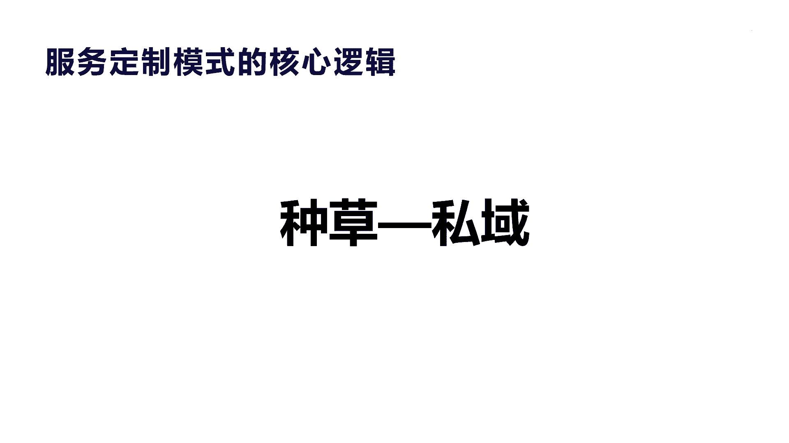
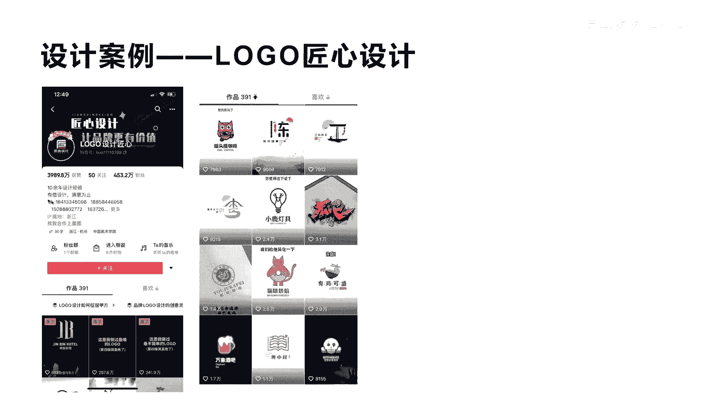
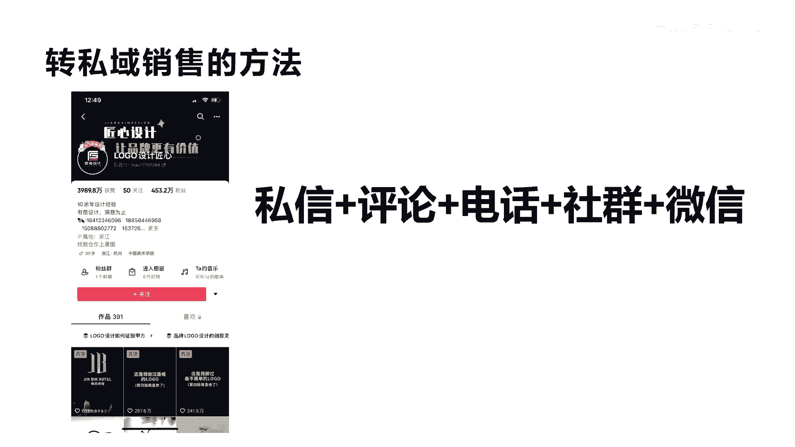
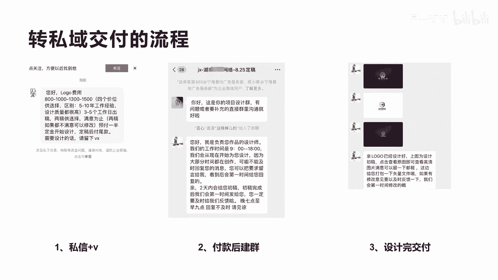
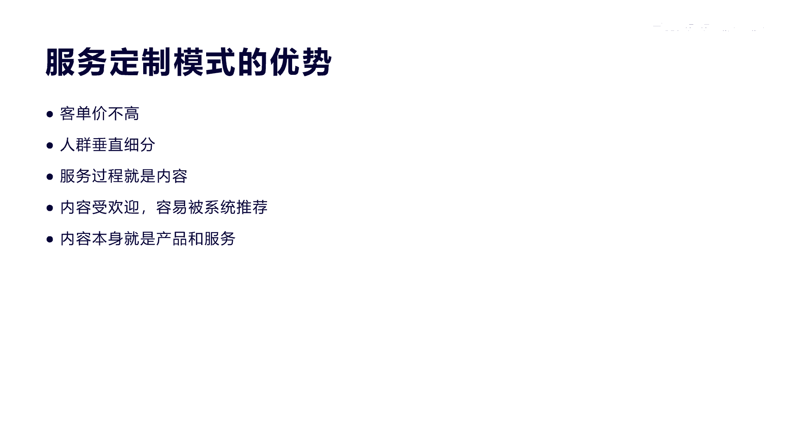

# 042 2023抖音快速起号必修课 - P28：第28节第四模式 服务定制模式-请收藏 - 早安睿睿 - BV1Gn4y1o7rC

好今天我们来讲第四个模式叫服务定制模式，这个名字其实顾名思义啊，其实就是我们通过服务来做定制的一种模式，其实很常见啊，这种模式其实对于我们讲的不在抖音里面，有很多实体和线下这种企业都在提供这种服务。

这种服务呢我们一般有这种类型啊，在抖音上面，你像你像发型设计，比如说男士发型和女士发型，在抖音上面有很多这种账号做的非常好，有很多人在本地做出名之后呢，在重庆有个号啊，她做女士的这种发型设计。

有很多人全国各地的跑到那里去，飞机飞到那里去去，让她把它做发型设计，所以这种模式，它是非常适合于在全网进行推广的，第二个就是宝宝起名字，宝宝起名字，大家也其实也啊，经常在其他的平台去有这种需要。

但是实际上对于抖音来讲，它是一个非常好的这种内容载体，他把这种内容载体复输出之后呢，有很多人就主动找他，然后进行服务定制，服务定制啊，给我的自己的宝宝起个名字啊，是不是多少钱啊。

然后第三个像设计logo，企业logo的设计，包括头像的设计，包括我们讲的油画，素描插画，还有很多细分的像别墅图纸设计，软件开发设计，还有装修项目的设计等等等等，只要牵涉到是服务的。

都可以在抖音上面做这种服务定制模式啊，其实跟我们上一节课讲的那个关于呃，这种免费增值模式，对于特定的有技能的人来讲也是一样的，只是这种东西呢，它是说它是提供服务去啊去变现，而不是提供我们讲的啊带货啊。

他不是带货，它是通过一种虚拟的服务来进行销售的，所以服务定制模式啊，它是非常适合于原来在实体里面去做这种服务，定制的企业和个人啊，非常适合，所以我们来看一下，其实对于服务定制模式的核心逻辑。

其实就是两个字啊，就是两个字，第一个是种草，第二个是私欲啊，其实很简单啊，就是比如说我们讲种草是什么意思呢，就是我们在呃抖音里面，不断的用短视频去输出自己，在服务定制某个领域里面的专业技能。

比如说我们做logo吧，这个做logo的话，我是非常牛逼的，是不是我做的logo，哎呀怎么怎么个有个设计理念，它的这个设，设计出来是个什么样的呈现效果等等这些东西，让用户感受到你很专业，你很牛逼。

这个时候突然有一天我我有一个这样的需求了，然后我就会什么直接来找到你，然后就跟你进行私域的进行交易啊，这种其实因为对于服务定制模式，在抖音上面他是没办法做这种啊，纯电商的这种服务的。

就是他没有办法下单购买，它是通过溢价啊来进行交易的，因为它不同的服务需求，它有不同的价格，就比如说我们来设计一个普普通通的这个logo，他可能三五百块钱，但有些人说我要是一个非常高档。

非常有有有气派的一个logo，他可能定价就是三五千了啊，就完全不一样了，像有些这个油画也是啊，有些人画一幅画啊，大概根据不同的人不同的这个名气，他的画画的这个呃价格报价都不一样。

所以他有不同的这种啊这种报价体系，他就没办法在抖音的商城啊，或者是这种交易体系里面去形成闭环，他就必须要转到私域里面去，所以对于服务定制模式的核心其实就是两个，第一个不断的去输出你的什么啊。

这个内容体系，然后去种草你非常牛逼的一些作品啊，你非常牛逼的一些案例啊，你非常牛逼的一些项目啊，啊让别人觉得你很牛逼啊，然后这个时候呢，如果当用户有一定这样的需求了，他就会私欲你啊。

这种私欲其实对于我们来讲，举个案例大家就明白了。

好吧，我全程来讲一个案例，那么第一个我们来看一下这个案例，它的名字叫logo匠心设计，这个案例呢他在呃抖音里面，他应该是算logo设计里面的牛逼的啊，最头部的了，他都最头部了，他这个有453万的啊。

粉丝453万的粉丝，他发的作品大概有390一个啊，300有90一个，他将近做了将近两三年了啊，已经是算在抖音里面，流量最大的一个logo设计的一个账号了啊，他的作品呢基本上都是把自己的某一些案例啊。

某一些作品啊啊怎么实现的，你一个过程拍成短视频啊，就很多人觉得很牛逼啊，这很牛逼，但实际上我跟大家讲实话，他有很多这种作品并不代表啊，每一个帮你设计logo的这种人，他都是这个水平，他是有不同的。

他是有一个设计团队的啊，这种设计团队有可能是全职，他也有可能是兼职，其实在我的短视频里面讲过这个案例啊，他绝对赚钱的核心，并不在于他接单之后去消化掉，而是在接单完了之后去转包来赚钱。

比如说我们收到一个1000块钱的这种logo，设计的订单，那么这1000块钱的设计订单，如果他自己要招人做的话，他会有一个招人成本，一个月，大概比如说这个5000块钱的固定人工成本是吧。

那么这个人工成本他必须做五个单，他才可以把这个人工成本给抵掉，是不是，然后多做的才赚钱，那如果没有这么多单呢，是不是，那如果我把这个订单给他分包出去，我只收500块钱的佣金，那么他实际上就纯赚了500。

那这样子他构建了一个人力体系之后，他不断的去什么去接单就可以了，不断接单，我接一个实际上接一个1000块钱，我就赚500，接一个1000块就赚500，至于包下去的这个任务，这个人他必须按照我的要求。

按照客户的要求来完成，所以对于他来讲，只要接了单，他就是稳赚的啊，这就是这个真正的服务体系在这里啊，所以你不要想着哎呀他好像是个啊人，靠人力去服务的，不这么赚钱吧，这种服务成本很高啊，人工成本很高啊。

其实真正他把他这个链条走通了，你就要想清楚，它实际上是做了一个封包体系啊，他是一个营销端做揽客做生意，然后分包体系，所以他这些作品都是非常牛逼的作品，但并不代表他设计啊100个这样的logo。

全部都是这么牛逼。

好我们来看一下他转私域销售的方法，它转私域销售的方法，其实我告诉大家，所有的这种服务定制模式，在抖音里面转思域都是这些方法，第一个是私信啊，有很多人看到你之后只私信你，是不是啊，第二个通过评论啊。

他有些发了作品在评论里面诶，这个怎么做，我也要做一个去评论一下，第三个通过电话，这个电话在哪里呢，其实就在我们的这个主页，他会把相关的自己的联系电话发在群，发，在这个呃简介里面。

是不是大家就可以去拨打第三个呢，第四个呢就是我们讲的社群，他这里面社群呢就是说有很多人加入他的社群，就是要什么，就是要做这个相关的设计服务啊，所以很多人会去加他的社群，第五个呢就是直接去加微信啊。

有很多在这个简介也好，在他的群里面也好，有直接加微信的这种相关的方式，那么其实最后来讲，它都是通过一揽子在微信里面进行直接转账，消化啊，交交付的一个过程啊，这就是我们讲的服务定制模式。

它一定在抖音里面都是这种模式啊，当然也有很多说哎现在抖音不是开了蓝威了吗，开了蓝V，然后我们有相关的这种服务啊，都可以去做，包括额有团购券啊，有留言啊，有什么东西，是的没错。

那个是属于本地服务的一些这种，他这个其实上他还不只是本地服务，它可以全国进行服务，所以他没办法，他是在所有的这个抖音体系里面，我们讲的服务定制模式里面，唯一可以走私域的啊，唯一必须要走私域的。

刚才我也讲了，他没有一个标准价格啊，没有一个标准价格好吧，他不能用一个标准产品，当然他可以用一个标准产品来吸引你去下单，然后通过这种方式来改价来进行订单，那这个太复杂了，他最终其实他巴不得转私域。

转私域之后他可以重复的进行啊，进行这个转私域销售好，我们来看一下它是怎么个转私域交付的流程啊。

其实很简单，比如说我们先私信他，私信他，完了之后，他就会给你一个这样的简介报价，比如说你好，logo费用在800~1500不等，四个价位啊，区别在于，每一个价位有配不同的设计经验的人，给你来设计。

然后他的工作日期是多久完成，然后他需要先付一半的佣定金，然后做完之后付尾款，他如果需要的话，你可以留下微信，这个就是我们讲的通过你跟他私信完了之后，他啊跟你来转微信的一个动作。

然后我们讲了其实很多这种动作之后，转私域转到微信之后，微信有两种方式，这个第一种方式叫企业微信啊，这个可能被不知道，大家理不理解，当然你不用企业微信，你用一般的微信也可以，就是用来付款啊，付款之后呢。

他就可以产生它就会建一个这样的啊，这个交付群，这个交付群里面就会就会把设计师啊，把一些相关的人拉到这个群里面，他销售端跟设计师他一定要区分开，这是核心，因为我们刚才讲过呃，对于这种服务定制模式。

它主要的目的是靠这种分包来赚钱，分包的这群人，这群设计师他一定要跟他的销售主体脱离开，隔离开，他不能让他们直接进行进行关联，不然的话他就很容易接私单，大家明白，我意思吗啊就很容易转转走他的客户。

所以他会建一个这样的群，这样群之后他会把设计师拉进来，拉进来之后他就会跟你讲，哎你好，我们这是一个设计群啊，有问题补充可以在群里面沟通，然后他说啊我们的工作时间是什么，然后因为大部分在制作可能不能啊。

怎么怎么样的备注一些信息，然后他说两天之内给你初稿，初稿完成之后啊，第一时间发你，然后怎么进行修改啊，如果什么什么，他把一些相关的事项，交付的和设计的流程的相关事项，全部在群里面给你预告，然后呢。

最后我们讲的就是第三，他把这个作品做完之后，他就会在群里面分享给你，然后呢会跟你讲亲logo已经设计好了，上图的设计初稿，你看看满不满意，或者觉得有些什么样的修改意见，你可以给我们第一时间提出来。

然后就在这个群里面不断的去交付啊，去沟通啊，最后就是我们说这个东西完成完之后，他整个这个群就结束了，结束完之后他要把这个群给什么解散，他一定会解散这个群啊，解散群之后又来了新的一个订单。

然后又开始建一个新的群，又拉到新的设计师进来进行设计，以此类推，当然这种方式呢它是非常标准的打法，对于其他的除了logo设计，其其他的之外的一种呃，这种服务定制类型，都可以用这种方式来直接去复制去做。

无非就是我们讲的销售，然后交付，是不是它无非就是销售和交付，所以服务定制模式无非就是在我们的抖音里面，不断的去种草，然后私域转销售啊，转销售之后，我们啊转私运之后，我们再来做相应的标准化的交付流程啊。

这就是它的核心好吧，所以我们讲服务定制模式的优势在于。

第一个它的客单价不会太高啊，你不能用太高的客单价，当然有些人说我设计一个logo，我需要三五千，需要223万，那属于下层服，当时的这种交易绝对不能太高，因为用户对你的信任成本他是偏低的，他不可能去跟你。

马上付个几万块钱的一种客单价啊，几千是有可能，几千是有可能的，所以他的客单价不会太高，这种模式，第二个来讲人群垂直细分，就这种东西非常垂直，非常细分，你有这个需求，你就会跟我联系，跟我进行服务是吧。

第三个就是服务过程，其实就是内容，刚才我们讲过他的服务的设计啊，作品那么多，几千几万个随便里面挑个百八个这种好的案例，然后把它做成内容啊，做成视频啊，这个内容视频它就不要需要去再去生产的。

它的它整个的服务案例其实就是内容，把这种案例内容包装一下，剪辑一下，设计一下就可以发出去了，就是一种营销，就是一种流量，第四个呢就是内容受欢迎，他这种内容它是比较有这种价值的。

有这种呃新奇特的看点的是吧，这种服务的东西它本身是一种产生价值的过程，所以它的内容是对抖音抖音来讲，它是非常扶持的，所以容易被系统推荐，如果做的好的一下一个作品就爆了。

爆了之后他就很容易带来很多这种私域订单，所以他在这个服务定制模式里面来讲，其实是比较好的一种，对于有专业服务能力的公司和个人来讲，在抖音上面做这种模式的创业，创这创业来讲是非常好的一种呃形态好吧。

呃今天我们就讲到这里，这就是我们今天要讲的服务定制模式啊。

服务定制模式。