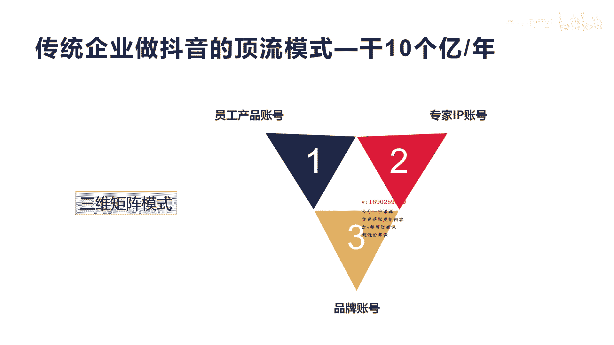
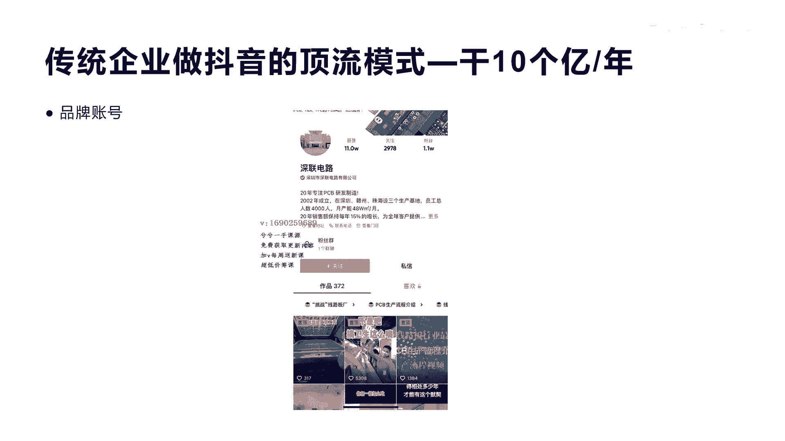
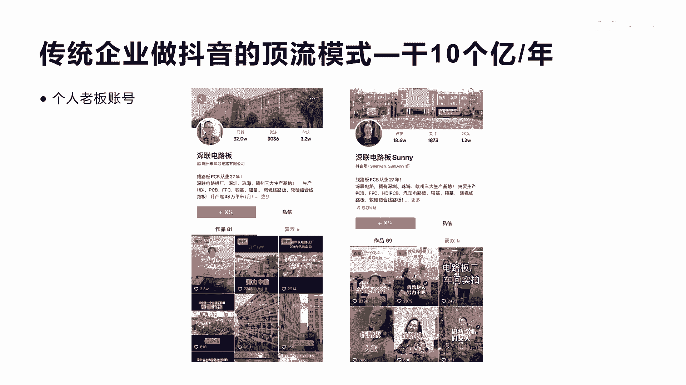
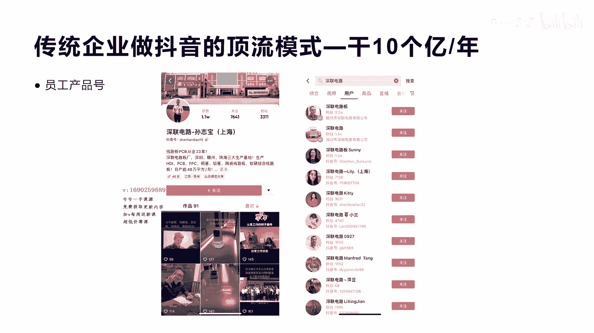
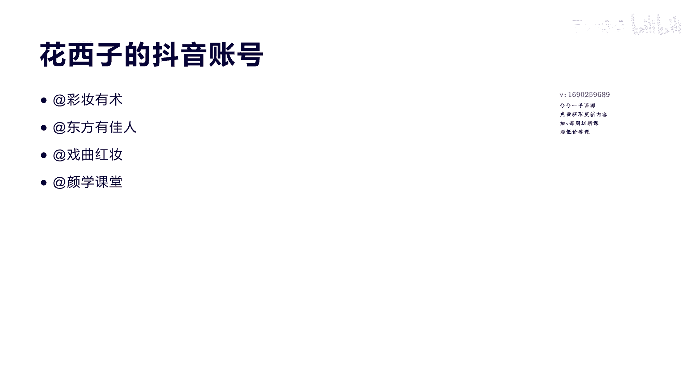
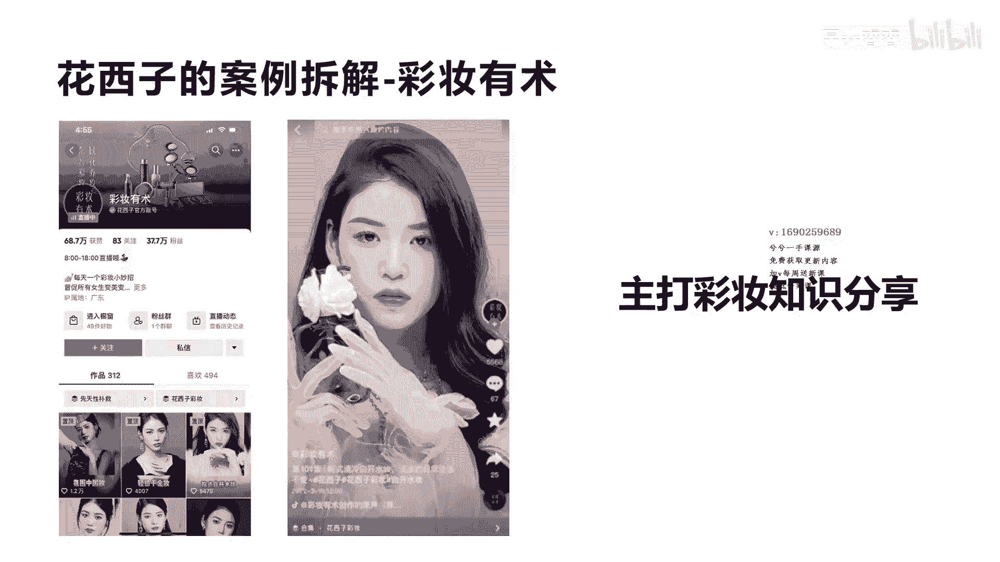
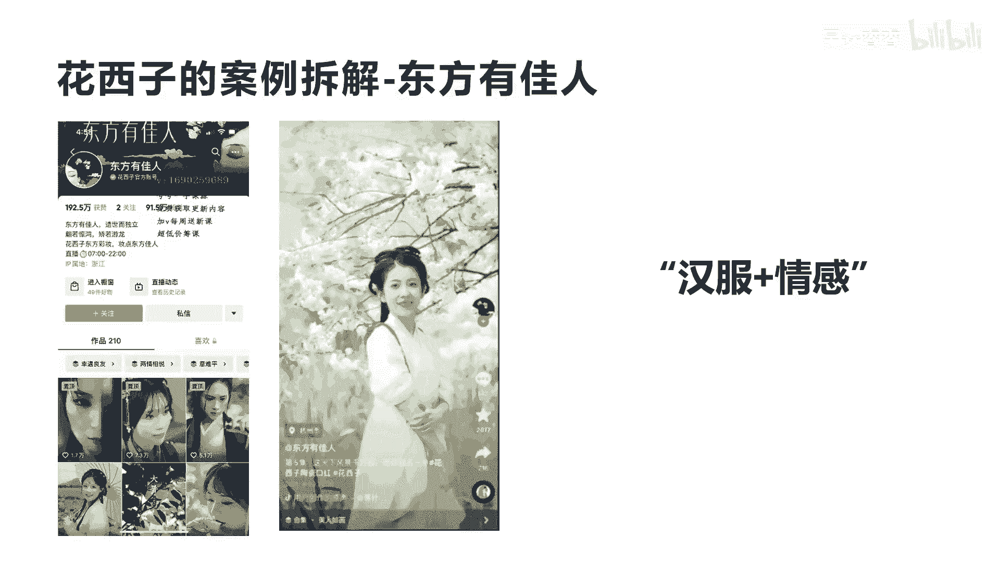
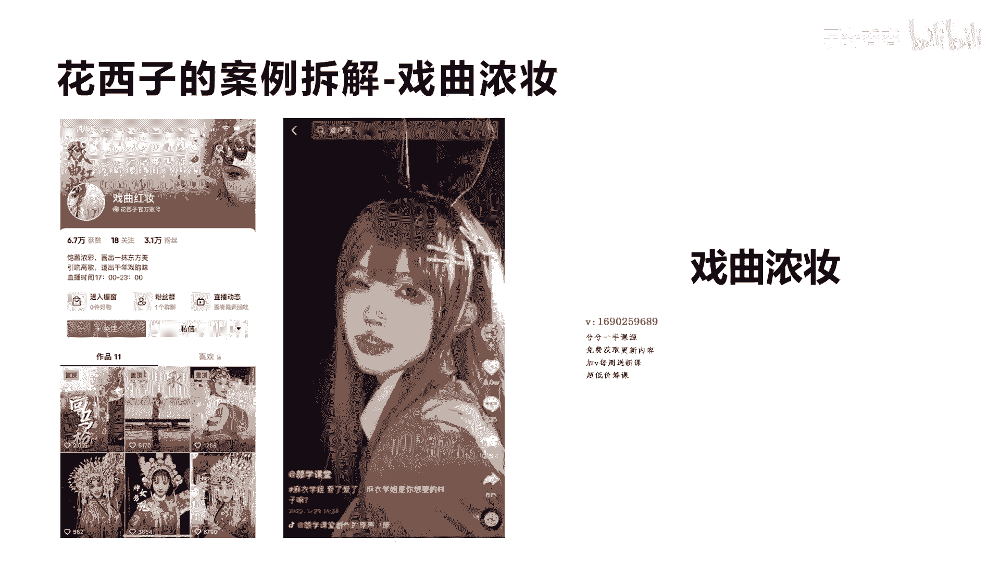
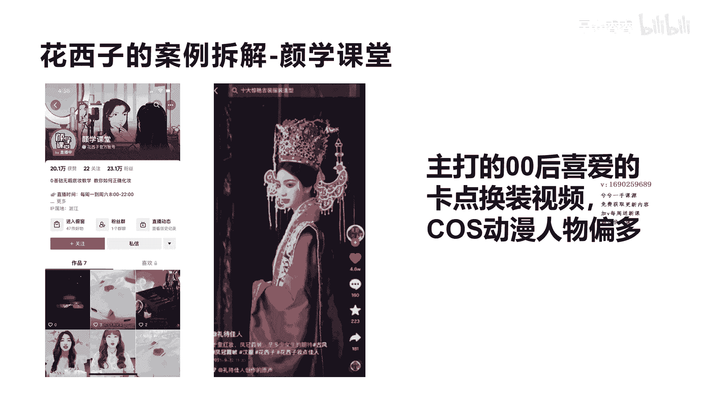
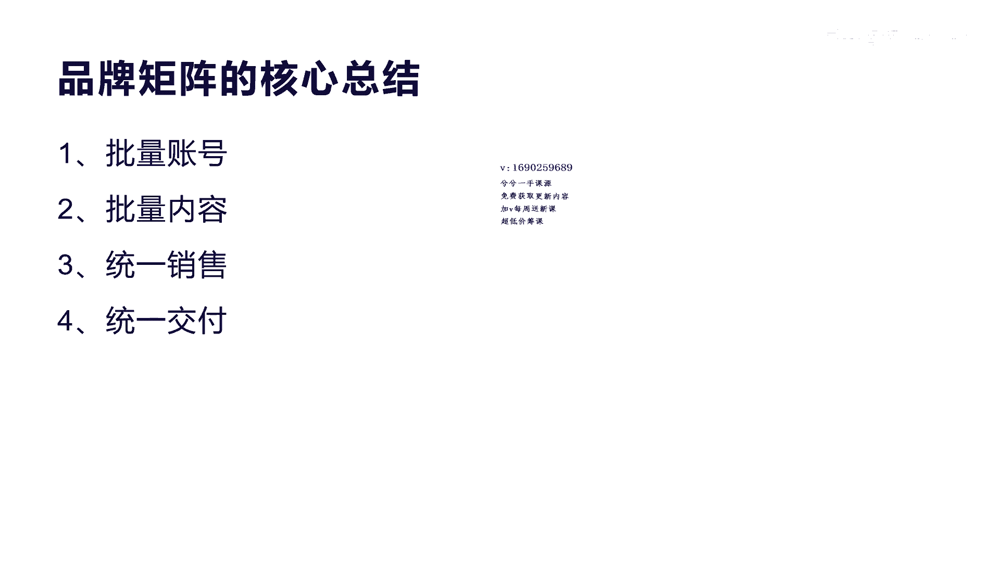

# 042 2023抖音快速起号必修课 - P29：第29节第五模式 品牌矩阵模式-请收藏 - 早安睿睿 - BV1Gn4y1o7rC

好今天我们来讲第五大模式叫品牌矩阵模式，这种模式呢实际上啊，就是实体的，你有实体或者你有品牌的这些企业来讲，最适合做的一种模式，当然对于个人来讲呢，说实话如果你能产生一定的这种呃销量。

或者产生一定的这种呃，前面的商业模式都跑通了，那么你来做相应的啊小矩阵是没问题的，就是多开几个号码，重复自己的相关的这种呃模式来复制，其实对于不光是在抖音上面，有很多人做品牌矩阵啊。

其实在呃在传统的电商平台，像淘宝拼多多，其他京东这种模式，其实也有很多人开的不止一家店，就是有很多企业，它实际上有很多很多店啊，而且他不仅天猫上面有七八个点啊，京东上面有三四个店，拼多多上面有三四个点。

它就形成了全联网的电商平台的品牌矩阵，而我们今天要讲，就在抖音上面形成一个啊品牌矩阵，它是怎么去做这种模式，其实有很多成功的案例，但是我们先来讲一下非常传统的这种制造业，它是一个什么样的玩法啊。

希望对于如果在观看的制造业的老板啊，或者你是传统企业的老板，你可以去看一下啧，第一个这种传统企业做抖音的顶流模式呢，他一年干到了将近十个亿啊，这种模式它其实是三位一体的这种矩阵模式啊。

有很多人说矩阵模式不就是搞多个号吗，啊啊一个品牌一个号，一个品牌一个号，但是对于传统企业来讲，你其实没有那么多品牌，是不是你更多的在乎于是打造一个品牌，然后把市值，把企业的各方面的销量和做起来是吧。

做大做大规模，所以对于这个模式来讲，其实是围绕着三个矩阵模式，第一个是员工产品账号，第二个是专家IP账号，第三个是叫品牌账号，就是你自己企业的品牌账号，三位一体形成了打造流量的闭环啊。

高产出的这种爆款啊。

所以这个深联电路，我给大家来看一个这个案例啊，好我们来看一个这个的案例，这个案例叫声联电路，它是深圳市的一个呃，一个做电路板的一个企业啊，非常传统的制造业，做这个PCB这个研发制造的这种制造业的老板。

都有很多在抖音开始发力了啊，所以他们怎么去做呢，首先他会做一个刚才我们说的三位一体，它首先有个叫品牌账号，这个品牌账号就是我们讲的官网啊，官方账号叫深联电路，那个这个官方账号，你看他只有1。1万的粉丝。

然后他的呃内容也有300多条，不断地输出公司的业绩啊，荣誉啊，团建啊，包括一些相关的招聘日常的内容啊，树立自己企业品牌的一种内容打造，这就形成了对用户，对于他的客户来讲的一种客户信任度。

它实际上是一种立品牌的作用，是不是，那我们看一下第二个他的账号是干什么的，第二个就是个人老板的账号，这个森林店图他有两个老板，一个一个老，一个男老板，一个一个他老婆，这是他们两个都做了一个这样的账号。

一个是3。2万粉丝，一个1。2万粉丝，他为什么要做个人IP呢，就是我们讲的企业有企业的品牌IP，那么你作为这个品牌IP的这个老板，那你一定要做一个个人IP，这样个人IP有什么作用呢，他其实老板和这个啊。

包括一些股东啊，每个人都可以做一个账号，他就专门来拍摄自己的生活，包括自己对行业的一些理解，所以他就会吸引的是上下游，上下游的这种产业的人群，这种产业的人群，其实更多的是关注他们的什么产品。

代理政策和招商政策，以及相关的合作上面的一些这种资源人群是吧，所以他做这两个账号是非常有必要的，这就是形成了我们讲的专家的个人IP，对于行业的这种上下游的一种，精准用户人群的一种啊一种影响。

好吧，这就是我们讲的第二种，第三个呢就是我们讲的员工产品号，你看他其实在他要求啊，深联电路的所有的员工，都必须在抖音上面有个抖音号，你看我们去搜索深深联电路，你会发现所有的员工都会有自己的账号。

虽然就是几十个粉丝，上百个粉丝啊，有些有上千个粉丝，没关系，他量大嘛，如果像他这个公司，如果有个啊1000个员工或者500个员工，那么在抖音上面就有500个，1000个这种流量入口。

这就形成了大量的这种什么举证啊，举证模式，这种举证模式要求每一个这种员工呢，他都要去发自己的产品啊，相关的内容，发自己的什么相关的一些产品优势，个人销售的一些相关，团建的一些相关的这个内容。

他就会让很多客户，他针对的就是客户了，不像老板，他针对的用户群是上下游产业链的人是吧，那对于员工来讲，他做这种账号，它面向的就是对于终端客户的销，售端的客户的一种营销，所以他一年通过这种方式。

通过三位一体的方式。

第一个是我们讲的品牌账号，第二个是专家个人IP是吧，第三个是员工产品账号，这三位一体对于很多传统这种呃企业来讲，都是非常好的一种模式，只是看这种模式你怎么去执行啊，去执行它会放大你的业务至少十倍以上啊。

至少十倍以上，非常好的一种一种传统制造业的一种啊，内容举证的一种账号模式，呃，这是讲到这种传统制造企业，我们来看一个消费企业这种消费品牌企业，花西子大家应该都知道是不是啊。

消费品牌它是一种化妆品的一种高端，中国来讲，国内来讲非常好的一种新兴品牌，新兴企业品牌，这种品牌它在各种包装上面是吧啊，花西子大家都知道它是美妆的榜首number one啊。

不只是他在抖音的这种整体的营销力度大，其实太呃他的红人分销推广，包括他做矩阵，用账号去打，用战群去打啊，都是非常呃精辟的案例，所以我们今天来看看一下，他是怎么去做他的相关的举证的啊。

也包括他怎么去从人设到内容定位，到直播直播场景的一种啊，包括短视频拍摄的一种相关的，怎么去定位制作内容的，花西子的这个在抖音上面其实有将近七八个号，但是真正啊有特点，然后呃有一定量的是这四个账号。

一个是我们讲的这个叫彩妆有素，第二个是叫东方有佳人，第三个叫戏剧红妆，第五第四个叫啊研学课堂啊，这四个账号他都会有不同的用户群体的定位。

包括它的内容风格和他的这个账号搭建，都会有不同的风格，我们来看第一个，第一个我们讲的花西子的案例，第一个就是彩妆有素，你看左边这个图啊，第一个图彩妆有数，他的粉丝数达到37。7万，他的点赞数是68万。

他的作品数是312个啊，他做的就是一个主打彩妆知识分享的，一个啊内容账号啊，这种内容账号呢他就更垂直的去做啊，主打这种彩妆的这种啊人群啊人群，所以他的其实你别看他的这个额粉丝量不大啊，37。7万。

但是他的啊这个账号的变现能力是非常强的，我们再来看另外一个这种风格又发生了变化，他的这个账号叫东方有佳人，他卖的是什么呢，他卖的就是以这种啊，汉服加情感的方式做定位啊，做人设定位和内容定位。

你看他的风格内容就是汉服，是不是，然后他输出的内容的这种啊，就不是像刚才我们讲的做彩妆了，他就是专门来啊用，当然他也是卖的是彩妆，但是他用另外一种这种人设和情感，和这这种包装这种内容来构建另外一种人群。

喜欢这种人群的人也会去买他的彩妆，懂我意思吗。

好我们来看第三个就是戏曲龙专，这个戏曲龙砖，你看他的就是又一种戏剧化的京剧的这种啊，内容定位和人设定位啊又不一样了，喜欢京剧，喜欢戏曲的这些人，其实他也需要化妆，所以你发现没有，它每一个账号类型。

它都是围绕着它的产品来打，它相对应的人群是不是，所以一定是产品内容化，内容人群化，所以他一定是人群，加上我们说的跟产品品的匹配，以及跟你的人设的相关度。

来构建你的整个的账号体系，好我们最后再看一个就是花西子的叫研学刻板，这个研学课堂其实就是主打零零后喜欢的那种，卡点换装视频，包括coo s动漫人物的偏多啊，这种就是年轻人零零后他在是喜欢这种卡通啊。

喜欢这种动漫的情况下，他也是需要去什么去买化妆品的，而且相应对应的这种产品给他去销售，所以你会发现它的整个这个账号的，这个装修设计，包括它的内容风格啊，又是另外一种风格啊。

这都是属于花西子下面的这种啊矩阵账号啊，所以矩阵账号并不代表你去重复复制自己的，这种这种账号类型，它并不是去重去复制他的账号，而是通过差异化的这种啊，精准的内容和人群的运营，扩大它的销售体量好。

那我们来看一下它通过这种差异化运营的目的，到底有什么三点，第一个呢他通过这种花西子的品牌形象，将花西子的这种品牌触达给不同圈层的用户，刚才我们看到四个不同的这种啊账号，它的人群，它的内容风格。

包括他这种东西，实际上圈层的用户群人群是完全不一样，那么第二呢就是通过这种差异化的运营，它可以扩大到了流量覆盖范围，是不是啊它扩大它的流量范围和它的流转效率，从而提进一步提升花西子的整体销售。

这就是我们讲的它通过矩阵的模式，实际上是提高一个单店是多少销售额，四个单店是多少，他的销售额肯定会整体提升，用人群来扩大它的面，第二个是通过账号来扩大它的流量体系，这样让他整体销售，第三个就是我们讲的。

通过吸引到不同圈层的用户，他不会把鸡蛋放在一个篮子里面竞争，就是说如果我们刚才讲的同一个类型的，同一个人群的同一个产品，做不做不同的这个矩阵账号，它实际上是会产生账号与账号之间的流量竞争。

所以在抖音的投流的时候，他也不至于在同一个流量池里面，去相互去竞争pk，去消耗自己的这种啊投放投放额这个资金是吧，最终他可能会赔了夫人又折兵是吧，我的投放其实把我自己的本身的另外一个呃。

品牌账号的这个流量自然流量给抢过来了是吧，自己花了钱去抢自己的账号，所以就这会产生自己对于，投放的这种人群的内耗啊，所以当下对于花西子这种啊这种做法非常符合，有一些这种产品垂直类比较强的。

但是他人群又比较广的这种品牌呃，他这个举证我是觉得大家非常的值得去学习呃，在当下举证自播来讲，已称已经成为很多企业呃，降低运营风险，并且实现一个销售最大化的一个，非常好的手段了。

所以呢切记千万不要进行这种暴力的举子打法，就是我做好了一个账号，我就重复复制很多这种账号啊，除非像我们后面会提到一种模式，它这种模式是因为它实体啊本身就具备了，这种啊店铺啊，他就他就是不断的去复制重复。

所以它其实是一种账号的定位，是一种内容风格的定位，是一种直播间场景，人货场的定位，包括也是一种这个主播风格和话术的定位啊，这种非常重要啊，所以这样做的好处，它可以吸引啊，刚才说的不同的圈层的用户群体啊。

零零后九零后是不是是喜欢戏剧，还是喜欢古装，是不是等等不同的圈层，他都是需要使用这个产品的时候，你用这种打法就会非常有利，我们来再看另外一个案例啊，他是叫雪中飞啊，这个雪中飞呢他呃在我的短视频里。

其实有一个也讲到过，你看他的这个雪中飞啊，这种账号你去搜索雪中飞，在抖音上面有很多很多很多个，因为雪中飞它本来就是一个卖羽绒服的一个呃，服装品牌，它本身有实体店，所以呢他每一个实体店有营业执照。

来开通一个这样的抖音号，那么开通完了之后呢，他又可以进行一个独立核算的直播，是不是人货场的搭建也非常有场景化，所以有实体都可以做人货场的这个直播带货啊，你看他每一天的。

每一天的这个销售量也还是很不错的啊，你看这个粉丝数都有将近一二十万三四十万，其实像这种雪中飞的这种啊，品牌在抖音上面有很多很多啊，这种大众品牌，你看像罗门啊，像啄木鸟啊，猫人啊等等啊。

他们其实这些就是我们讲的服装品牌也好，实只要你有实体的相关的这种产品销售的啊，都适合于这样去开直播间，因为原来他们就布局了很多这种商超嘛，商超里面他其实人人流量现在越来越少，他不通过直播来进行变现。

他的成本非常高的，它是不划算的啊，而且每一个店铺都会有相应的店店长啊，是不是相应的销售人员，他的人货场是完全本身就具备的，只是把抖音开起来，然后怎么培养主播的这个销售能力而已啊。

它的供应链包括服装的这种产品的这种，任何的这种后端的东西，他都不需要考虑是吧，所以这种非常符合于做矩阵啊，做矩阵，所以做服装矩阵最大的好处，就是它本身有实体多是吧，第二个他的这个搭建人货场直播的时候。

这种本身成本就偏低啊，所以他具备先天的这种优势是吧，具备先天的这种优势好啊，除了这个其实战的这个所有的抖音啊，这种服装品牌里面还只是排排在第八啊，就做做的最好的是罗门啊，做的最好是罗门。

我们来看另外一个案例啊，樊登读书，樊登读书对于很多人其实都不陌生了啊，他在全抖音来讲，应该这种举证啊的粉丝量应该会超过2000万啊，2000万，他一年的销售额度是几个亿啊，几个亿。

所以他其实除了他其实做做举证，更多的是转私域啊，转私域就是说他的产品其实不仅仅是卖书，他有一个核心产品就是卖一个会员，这个会员就是一年的服务费就365块钱，这个三百五十三百六十五块钱的会员费。

他可以在他独立的房登的app上面去免费看啊，他自己解读的相关的呃一些书籍啊，他他的这个APP我也买过一年啊，买过一年我听了确实还是非常有益，因为有时候我没有办法去看一本书，那么他通过对一本书。

在半个小时内对这个书的整个的解读，让你瞬间在短时间内吸收了这本书的，这个相关的精华的知识体系啊，这对于樊登来讲，它是非常有呃，有价值的一个一个非常好的一种模式，所以他在抖音上面做这种裂变也是非常好。

它最大的好处是它的边际成本非常低啊，它容易做分销啊，他因为在全国各地也有很多分分分支机构，这种分支机构都很容易注册蓝V，注册这种什么啊，抖音号，然后做矩阵来分销，这个365块钱和做这种账号的分销。

其实它300V65元是一个虚拟产品，这个虚拟产品它的利润率是百分之百的啊，虽然它会有一些运营成本和产品研发成本啊，但是实际上365元，他对于很多这种分销体系来讲，至少一半的利润它可以分出去啊。

一半的利润分出去，对于很多线下面做他分销的人，他也觉得划得来，我卖一个账号可以赚100多，为什么不做呢，是不是啊，所以他这种交付啊，包括它的产品标准化等等，这些东西构建了它做矩阵相应的基础。

因为樊登他在原来的这个销售体系里面，本身他就是一个呃非常完善的分销体系，分销体系，其实说白了就是一个自裂变的一种一种啊，矩阵打法啊，所以他只是把这种模式映射到抖音里面来了。

品牌矩阵的这种玩法确实它是有一定的难度，它属符，它更加符合于有一定规模的企业，和有一定能力的企业来玩，对于个人来讲啊，确实很难啊，他因为每打造一个账号，他都需要付出更多的人力物力和时间是吧啊。

所以你没有标准化的产品，没有标准化的团队，没有没有这种运营能力的话，你是很难打造出品牌矩阵，但是对于所有的老板来讲，特别是企业老板来讲，更加要考虑到你自己产品销售的一个规模化，和整体的一个销售量的突破。

好我们最后来总结一下品牌矩阵模式，它的核心呢实际上就是四点，第一呢我们讲就叫批量的账号，实际上举证无非就是我们讲的核心是规模，那要规模怎么做呢，实际上就是批量生产号，但这种批量生产号刚才有两种啊。

像我们举的案例有两种啊，因为他有实体店，不断的去开店和开线上店就可以了，那么第二个像花西子这种账号呢，他就没有那么多账号，他无非是做四个到七个人群，那这种人群定位好，一个人群做一个好，这也是批量做好。

第二个我们讲的批量内容，批量内容这个东西，它一定不能说是生产一条内容，在所有的这个账号里面去批量分发，这种批量分发，一定会带来搬运和被啊下架的可能性，而而且很很可能会限流，或者是把账号给封掉。

所以如果你做很多举证的话，一定要统一的内容风格和形式，让所有这个做账号的人，去按照这种形式去标准化去生产，而不是生产一条出来全部去复制啊，这个切记啊，第三个就是我们讲统一销售，统一销售。

其实就是我们讲的统一的标准化产品啊，统一的品牌是不是他的所有的这个产品来讲，一定是啊高度集中统一的，而不能说哎这个账号卖的是这个产品，那个账号卖的是另外一个产品是吧，这样就很难达到举证的效果。

那么第四个就是讲到统一交付，统一交付其实呃也容易理解，就是所有的这个销售端账号啊，矩阵账号都是销售端，就像实体店一样的，他每一个门店都是一个销售端，但是呃所有的这个呃发货也好，售后也好。

包括统一调配的供应链，这整个这一块其实都是由总不来统一处理，所以这个地方就是呃品牌矩阵的核心，所以一般来讲品牌矩阵对于呃企业来讲，他是呃可以去做的，因为他的呃门槛和它的成本，包括他的团队要求都比较高。

那么实际上对于我们讲的个人来讲啊，前期先跑通一两个号的模式，如果你觉得你有能力发展了，你再可以考虑批量做也是可以的，好今天的这节课品牌矩阵模式就讲完了啊。

