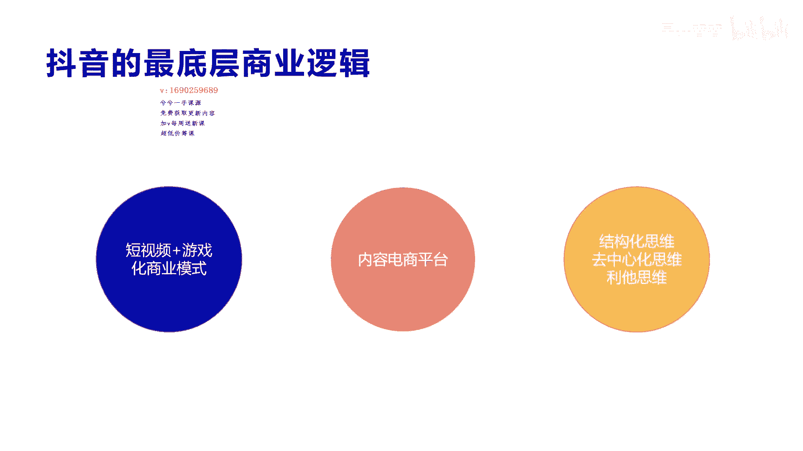
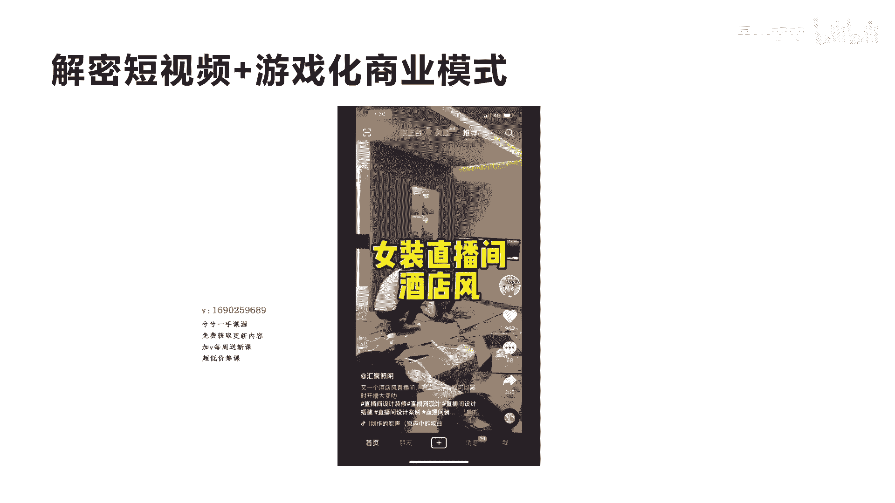
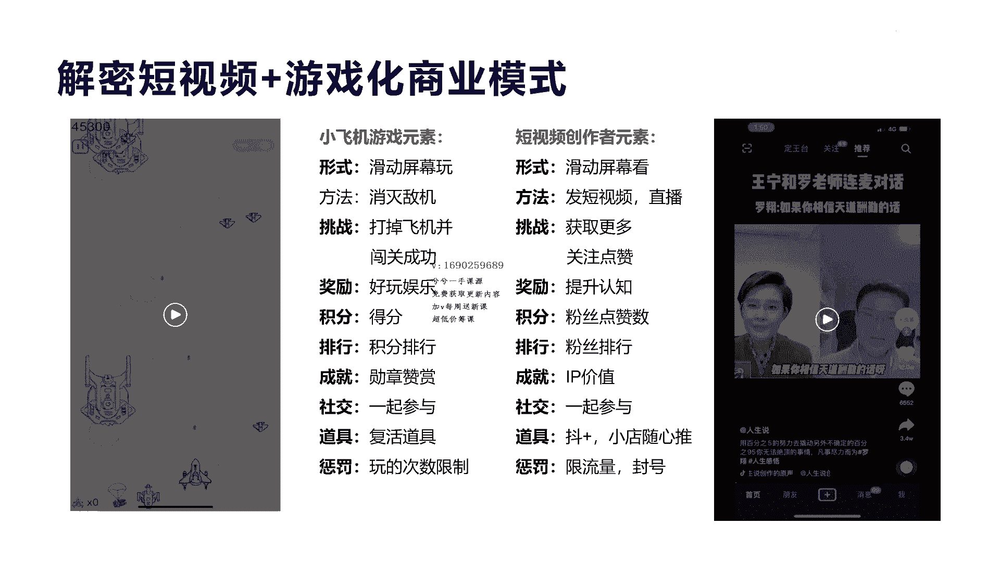
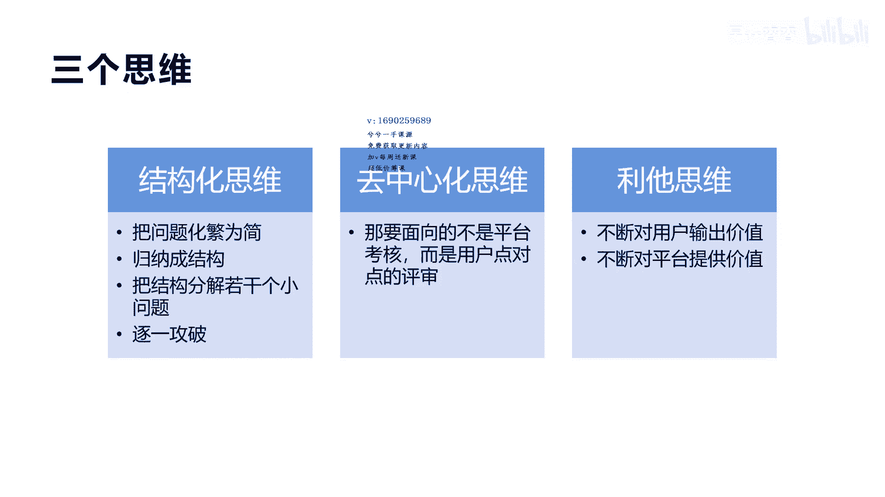
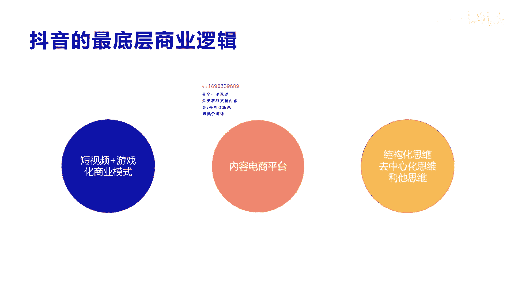

# 042 2023抖音快速起号必修课 - P2：第02节抖音的底层商业逻辑-请收藏 - 早安睿睿 - BV1Gn4y1o7rC

好今天我们来讲一下抖音的最底层商业逻辑，那么抖音的最底层商业逻辑呢，我们统称为一个模式，一个本质三个思维，短视频加游戏化商业模式，这是讲的我们讲的呃，它的一个核心的商业模式呃，我们讲很多平台啊。

它都会有自己的核心商业模式，不管是淘宝也好，拼多多也好，还是京东也好，还是美团也好，还是讲我们的百度也好，或者是说啊线下的很多实体店也好，他们都会有一些啊自己的独特的商业模式啊。

这是因为他们有了这种商业模式，才可能在某个领域和某个平台方向上面，做到了独角兽，做到了number one，所以在抖音来讲，其实啊，我认为它是一个短视频加游戏化的一个，商业模式啊。

这个我们具体在后面我会给一个案例啊，让大家来感知一下，那么他的第二点呢，就是我们讲的他是一个内容电商平台，那这是他的一个本质，因为他纯粹的做一个这样的视频，它是没有含义的，他是没办法进行商业变现的。

所以他最终要进行商业化的闭环，它必须是内容去加电商啊，也就是我们讲的内容电商平台，所以它的本质其实是内容电商，我们讲原来还有很多类型的传统电商，这个我们在后面会讲啊，那么他的三个思维是什么呢。

呃我们大家都听过。

第二个思维，就去中心化思维和利他思维啊，我们看一下这个视频，好啊，大家看了一下啊，这个视频其实在我的额，个人短视频的账号里面也有啊，他讲到这个呃，我认为的抖音的商业模式它是游戏化。

所以我拉了这个小飞机游戏来做一个演示啊，这个游戏大家应该是在啊很多年前我们都玩过，但是现在没有人玩了啊，因为它毕竟就只是一个游戏啊，所以我们讲那个时候去玩这个小游戏，大家都非常的兴奋啊。

而且有很多朋友之间呢都在互动的去比拼啊，去炫耀自己的成绩是吧，呃那个时候呢这个游戏你看上去其实很简单啊，很朴实的一个游戏，但是它让这么多人啊废寝忘食的去玩啊，为什么呢，这个我后面也会讲，但是我们说了。

刚才你感受到了一个就是什么呢，我们讲的这个小游戏，它的啊这种形式，你有没有发现是不是跟抖音很相似，它也是手在屏幕上进行滑动，我们看一下抖音他是怎么去使用的，直播间，第二这马卡好，我们不看完了啊。

大概的大概应该是有一些感触啊，就是它是随着手去滑动屏幕，而变换他的视频内容是吧，所以你会感觉它实际上跟我们刚才看的啊，那个飞机游戏一样，它也是通过手去滑动和触摸屏幕，所带来的一些什么结果是吧啊。

那么短视频抖音的这种沉浸式的这种滑动屏幕，看完滑动没看完也滑动，那个飞机打败了移开消失，没打败它流走啊，所以你会感觉到其实它会有很像的这种结构，当然它不止我们讲的滑动。

我们再看一下它的对比啊，呃从这个对比的图我们来解释一下啊，左边呢是小飞机游戏，那么右边是我们讲的抖音的这个呃，app的这种框架，那么它的在形式上面呢，实际上像小飞机，它是我们讲的就是滑动屏幕在玩。

而抖音它是滑动屏幕在看是吧，两个很相似，那么小飞机游戏它的方法是消灭敌机，那么对于我们讲的抖抖音来讲啊，他实际上是发布短视频和直播，他是他的方法啊，然后来带来更多的观众来观看。

那么他的小飞机挑战是打掉这些飞机，然后呢闯关成功啊，不管这个飞机是大是小，那么抖音的挑战是什么，获得更多的视频，然后获得更多的内容价值，然后我去什么不停的去关注它和点赞它，那么他的奖励是什么呢。

小飞机的我们说他们两个的奖励啊，小飞机是好玩娱乐，没有别的是吧，那么对于抖音来讲，它可能不仅仅是说啊可以看内容，他还可以提升自己的认知，让自己涨知识，那么小飞机的这个积分呢。

它是我们刚才看到最后一个题目，他会得了6万多分是吧，那么他会有积分，那么对于抖音的这个积分呢，实际上只有我们有很多啊，像点赞数，评论数，转发数，这些数都是我们讲的积分，包括排行啊。

我们刚才讲的每个好友之间玩小飞机游戏，它会有排行，那么对于抖音来讲，他也会有排行，粉丝排行，还有我们讲的视频热门排行啊，排行榜对于所有游戏来讲，它是必备的一个游戏元素，那么最后还有成就成就。

其实对于小飞机游戏来讲呢，它是一个什么，它会有勋章对吧，还有赞赏啊，还有社交之间大家可以哎呀，你真厉害，很牛逼是吧，那么对于抖音来讲，它实际上包括我们现在也知道有IP价值，为什么要做个人IP。

为什么要做抖音是吧，他可还有什么他可以直播带货，还可以赚钱是吧啊，所以他会有成就上面的一些相似，那么社交呢就是刚才讲的游戏，他都会有社交的功能啊，在朋友圈里面玩这种游戏呢，他会有一起参与的感觉。

炫耀的感觉是吧，那么对于抖音来讲也是一样，也是大家全民一起在互动社交啊，对你进行啊关注，然后我跟你私信，跟你互动，跟你连麦等等，这都属于一起在社交，那么他还有道具，那刚才我们讲的这个小游戏。

它会有复活的道具，是不是我诶三个小飞机，完了我我还有一个小飞机，怎么样，我会有一个复活的道具，那么对于抖音来讲，它会有一个叫斗家的广告投放，和一个小店随心推的广告投放，这种广广告投放。

实际上是在你的视频的播放量上面再去叠加，去拉花钱，去购买更多的部分量，所以这个是他的一个道具，那么讲到乘法，就是我们讲我这个可以玩很多次，但是我也可以什么呃，三次玩完了我就没有了。

今天我可以限制你只玩三次是吧，他会有一些乘法，比如说你的这个啊排名很低，我会踢出你在我的十个排名之外是吧，他会有惩罚，所以让你有挑战的这个欲望，那么成呃像抖音我们也有惩罚。

比如说谢里的流量封你的号等等啊，啊这都属于乘法，因为在一个平台和一个游戏，如果没有讲层之分的话，那形成不了一个啊标准化的一个生态，它很难持续下去，所以这里大家总结完。

你会发现小飞机游戏和短视频的这个游戏来讲，它实际上充满了非常相似的，所以我在最前面我们讲的它是一个游戏，画家短视频的一个商业模式的app，一个应用，一个apple是吧。

所以我们讲他在这个上面的创新比快手也好，小红书也好，包括原来老的视频，我们讲优酷也好等等，是不是都是非常好的一种创新形式，正因为他的这种创新形式，所以才导致了抖音在现代短视频行业里面。

它是一个number one的头部企业啊，所以我们讲一个企业，一个平台真正能走得远，能做大做强，他一定是最底层的一个模式性的领先。

才会有其他的领先，呃，我们讲了这个之后，我们再看一下，就是游戏上瘾的四个要素啊，刚才我们去看了一下，就是有些人说哎这个游戏化，我加游戏化就一定能成本，那我什么创新和加游戏，就是嘛加游戏就一定会沉吗。

不是一定在这个游戏上面有一些核心关键点，你要去注意，这样你才可能游刃而余，或者是才会真正的呃起到作用啊，像抖音的它的游戏的上瘾的四个月四个要素啊，他都具备，第一个就是随机推荐。

刚才我们玩那个小游戏的时候，这个小飞机的敌机，到底是从上面哪个位置飞下来啊，是大还是小啊，哎我打它把它消灭掉，我需要花多少时间啊，哎这都是随机性，那么对抖音也是一样，你会发现你刷视频的时候。

你也不知道下一个视频是什么内容吧，你也不知道它会给你带来多少的兴奋点是吧，你也不知道它会让你看多久，所以他会有随机性，导致你对这个有猎奇的心，那么第二个我们讲就是及时反馈，其实反馈这个东西啊。

我我解释一下，就是我们讲的是小飞机，我玩了一次小飞机的一局游戏之后，他会反馈给我，诶，你很棒，我给你6万分啊，这就是奖励反馈及时性的，而不是说我玩了一次之后，哎，你要过的。

要过一个月或者过一年才给我一个反馈，这不是及时反馈，这虽然也反馈了，但不是及时反馈，它让我兴奋不起来，那么对抖音也是这样，他在三秒和五秒是吧，很多视频就15秒的情况下，他马上就可以让他看完这个内容。

然后让我反馈一些知识和认知，或者一些信息给我，这就是及时反馈啊，当然他会也有娱乐性的是吧，知识性的，娱乐性的等等一些这种内容都让你有愉悦，认知提升等等一些知识上面的一个价值提升，这就是反馈，及时反馈。

让你很兴奋，刺激你的多巴胺，那么第三个我们讲的个性挑战，个性挑战这个东西啊，就是我们讲的不管你是谁，你玩这个小飞机游戏都可以获得很好的成绩，而且都有可能进入到前面的top10，或者是排行榜是吧。

哎谁都有，而不是说仅限于某些人，所以他就是说不管你是是猫是狗，是高手是还是小白，都可以进行挑战，那么对于抖音也是一样，他门槛非常低，不管你是什么样的角色，不管你是什么样的级别。

也不管你是什么样的社会地位，大家都可以个性化地展现自己，进行挑战是吧，同行挑战，同级别挑战或者纵向挑战都可以挑战他，所以他这种挑战啊，导致了整个这个生态被激活了啊，创作者被激活了，创作者一旦被激活。

那进入了爆发期之后，这个平台就起来了，所以他这个第三点也是非常重要的，那么最后我们讲的就是社交互动，这个讲了前面讲的这种小飞机游戏，它的社交活动还是比较纵向，就是我大家比较熟的人。

是不是哎我陌生人是没办法互动的，我只有跟你很熟，哎，我看到你很牛逼，我想超过你，你看到我很牛逼哦，那我们俩互相攀比对吧，他有互动啊，或者我私信给我的朋友，但是我不能私信陌生人是吧啊，那抖音不一样。

抖音它是一个真正的啊，我们讲的全域的啊，全域的这种公众的这种社交，他不是私人朋友之间的社交，所以是陌生人之间可以进行互动，点赞评论是吧，进行直播连麦等等，包括我们讲的可以直接进入他的主页进行私信。

那这都是属于我们讲的社交互动，所以你会发现啊，游戏上瘾的四个核心要素，抖音都具备了，那么这具备这四个要素之后，所以导致他这个游戏上瘾，大家刷屏幕是吧，大家刷屏有时候刷很多个小时还离不开抖音。

为什么国际上的那个TIKTOKER为什么能成功，为什么这么多人在用TIKTOK，也是因为他挑战了人性，因为游戏它就是人性的一种反噬，所以我们讲啊，真正的游戏它让很多商业成功了啊，这也是他的原因。

因为本身反人性的东西，他用游戏来做补充的话，他是很容易加持啊，这个就是我们讲抖音的核心底层逻辑，商业逻辑好，那我们再讲一个呃他的思维，他的思维来讲呢，我们前面也讲过结构化思维，去中心化思维还是利他思维。

我这里稍微再讲啊，解释一下结构化思维到底是个什么东西，他就是实际上是我们需要把问题啊化繁为简，因为抖音这个生态非常大，我们要去做它，它必须要具备去拆分它的结构，比如我们很简单啊。

抖音它分为直播和短视频两个大赛道，那么对于短视频来讲，我们怎么去拍短视频，怎么去做和运营呢，它分为很多流程，这个我们在后后面的我们的运营中会提到，其实像抖音它分为第一个，我们要去给自己做个定位。

我们到底要做个什么样的账号，第二个我们要开始选一个产品，我们到底要卖什么产品，还是我只是卖一个娱乐啊，我植入一个广告赚钱，第三个我们要怎么去拍摄，拍摄又需要准备什么，需要选题，需要什么。

需要制作文案是吧，还需要我们剪辑等等，那么最后我们发现我们通过这些东西变完之后，来了流量之后，我们怎么去做产品进行销售，那可能是挂小黄车是吧，有可能我们是做直播带货，有可能我们通过别的私信。

存到私域底下进行变现，这就是整个这个结构化的一个思维，那你把这个结构化的思维，把它结构分出若干个小问题之后，我们就可以开始一一进行攻破，那么这个就是非常啊简单的和明了的一个，结构化思维的一个啊逻辑啊。

我说大家理解吧啊第二个我们讲去中心化思维，去中心化思维，这个很多平台和很多这个博主都讲过啊，但是我觉得对于抖音来讲，它既是中心化，又是非中心化，中心化是因为它是一个平台，所有的人，所有的群体。

他都是依托于在这个平台上面的这些人，和这些人群脱离这个平台，那他什么都不成都不成立，那么去中心化的意思呢，你可以理解成什么呢，就是我们讲的正常讲的很多这个区块链的模式，这个比较复杂啊。

真正的讲的去中心化，实际上就是说你可以比喻成什么呢，比喻成我们每个人都是一个独立体，我不受任何平台和机制，和国家等等一些东西的约束啊，我是个独立体运行啊，所以这个抖音它是什么。

就是他的流量还是他的创作者啊，都是靠去中心化的这些人生成内容，视频所产生的节点啊，我既可以作为一个节点来发布内容，我可以作为千千万万个创业者账号，来发布内容啊，所以他的视频内容。

实际上是靠这些每个独立体进行发布的，而不是抖音平台自己提供的啊，所以从这个点来讲，他是一个去中心化的思维啊，很多人讲过啊，就是利他思维是对于用户输出价值啊，当然相应的也对于平台输出价值。

也就是说我们在做抖音的时候，不断的要有输出利他的这种价值思维，你不要在这里自嗨，你自嗨实际上是没有意义的啊，用户也不会对你买单啊，不像朋友圈，我们可以自己去嗨，然后呢有没有人点赞，其实无所谓。

或者有人点赞，有朋友点赞是给你一个奖励，但是对于抖音来讲，你如果讲的任何内容对我没有任何价值，我是没有兴趣去关心你的好，那我们这个基本的关于抖音的啊。

一个商业模式啊，一个内容电商平台，还有一个就是啊三个思维就讲到这里，希望这个啊底层逻辑和本质，以及三个思维的这种内容能对你有很大的启发。

