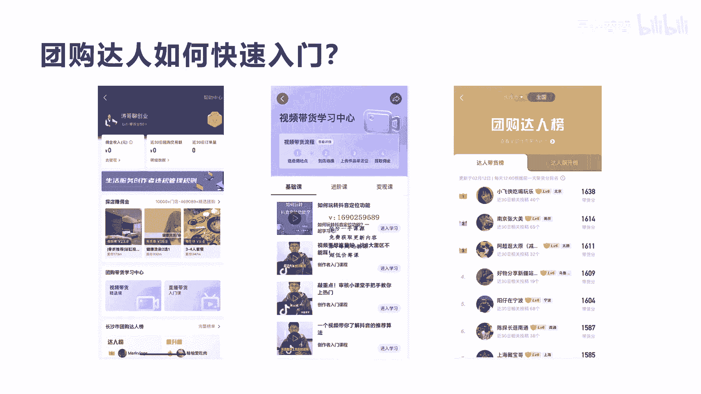

# 042 2023抖音快速起号必修课 - P30：第30节第六模式 团购达人模式-请收藏 - 早安睿睿 - BV1Gn4y1o7rC

好大家好，今天我们来讲第六大模式叫团购达人模式，坦克达人模式呢，实际上是在所有的这个模式里面，其实是最简单的，因为他只要去呃成为团购达人之后，不断的去分享视频，然后去带相关的团购券就可以进行分佣赚钱了。

它既不需要产品，也不需要太多的这种专业知识和专业能力，而且对于前期来讲，很多普通人想查是在抖音赚钱，可以用这种模式去做试错啊，有很多团购达人，一个月在啊抖音上面赚个几万块钱也很正常啊。

那我们今天来讲怎么去成为一个团购达人，那么成为团购达人的一个条件是什么呢，就是你的粉丝数量要达到1000啊，没有别的很复杂的条件，那么他怎么去进入呢，我们可以在抖音的搜索框里面输入团购达人。

然后进入到团购达人成长中心，这个时候就会有一个申请入驻的一个申请，这个申请里面唯一的条件，就是你的粉丝数量要达到1000个粉丝数，那么这个粉丝数达到完了之后，你申请带货成功，你就可以成为啊团购达人。

那么团购达人我们成功之后，我们应该到哪里去啊去做呢，这里我给大家讲一些这种相关的步骤啊。

第一个团购达人申请成功之后呢，你可以进你的啊，右右上角的三条杠，然后进入到创作者服务中心，创作者服务中心里面有个团购带货，看到没有，在中间点击这个团购带货，就可以进入到这个团购带货的啊。

平台中心这个里面，平台中心里面进去之后就会有相关的啊，选品广场以及相关的一些啊，怎么教你做团购达人的一些相关的教程，包括今天你收入多少啊，包括你30天的销售量，这些统计数据。

都会在你的团购达人的平台里面展示，那么选品广场这里，它这里就会显示出当前所有的门店的一些，团购券好，那我们来看一下他是怎么去选择的啊。

那当我们进入选品广场之后啊，这种选品广场我们看到左侧点入进去之后呢，这个左上角有一个找团购，还有一个找门店，就是你可以既可以用啊，这个搜索的方式来找团购啊，也可以来找相关的门店。

第二个呢它有一个7日热销，还有一个达人爱戴的一个相关的链接啊，包括你因为这种，它可以让你更多知道，哪一些店铺和哪一些团购券啊，容易被销售，容易被带，包括团购达人都喜欢带什么样的产品。

都可以通过上面那两个选项进入，包括下面有分类，是不是它可以是啊，美食运动健身休闲娱乐等等啊，都可以进行分类的选择，包括我们刚才讲的，你还可以通过右右边的一个筛选，你们可以去选择相关的位置。

包括你可以通过佣金多少，因为有些佣金很低，你可能带起来就没有什么好意思是吧，有些你比如说你想带佣金10%以上的，或者是30%以上的，那你可以选这佣金30%搜索出来，然后做所有的团购券。

包括团购的门店都可以展现出来，你看右边中间这个图，也就是我们讲的在选门店的时候啊，他可以既可以选这个啊地点，也可以选类目，也可以选形式，也可以选是否连锁，选完之后呢，就会呈现出你选择出来的这些啊选品。

选品之后进入某一个选品，就看到最右边这个啊一个详情页，这个详情页就可以去加入到我的选品库，这样加入到选品库有什么好处呢，如果加入到选品库，那么你在发视频带这个团购券的时候，就可以选择这个团购券。

那么这个团购券的佣金是，每一单可以赚0。21元，是不是等一下我们来演示一下，怎么在我们发作品的时候，去把相关的这种选品里面的，选品库里面的产品给啊。

带到我们的小黄车里面啊，来进行销售，那么第三步呢就是我们讲的，当你的额选品库里面加入之后啊，我们点选品库加入之后，就会呈现出我的选品库里面，就有一个这样的产品，看到没有，这个产品。

它就是按短视频来带货的，当然也有一些产品，它是在直播里面进行带货的啊，他现在越分越细了，就原来只是说通过短视频带团购券，现在竟然可以通过直播来带团购券，好这个加完了之后呢，我们现在如果去发布作品的话。

在我们的这个呃首页点发布作品，然后就会出现这种界面，大家应该都清楚是吧，这种界面在中间有一个地方，添加位置和门店推广，这个地方大家一定要去选择，就是你这个门店所相应的位置一定要添加进去。

有很多人就没有添加啊，包括你上面的话题，你一定要选择相关的，你带的这个产品的相关的话题啊，这样可以蹭到一些这种相关的流量，包括我们讲的这个下面有个添加标签，看到没有，中间有个添加标签，这个是非常核心的。

但如果你团购达人来带货的时候，你一定要选择添加标签，来带你刚才加入的选品库的这个产品好。

那我们看一下怎么去选啊，你看到没有，我们点击这个添加标签，在最下面就会有一个叫团购，是不是一个团购的标签，我们点击这个团购的标签完了之后，它就会跳出中间这个图，就是你刚才选的那个选品库里面的产品。

是不是那个选品库的这个产品，你就可以点击那个添加，这个时候呢，在你添加完之后发布短视频之后，你就会显示向右边这个里面有个购物，是不是啊，当然我们这个购物的这个参考图，不是刚才这个选品库的啊。

我是做了个样子，就是右边的这个小黄车，右边就会有个出现这个啊团购券啊，团购券包括他的呃相关的这个产品，只要点击进去，然后进行购买，你就可以赚到相关的佣金数啊，比如刚才中间我们说，卖一单可以赚0。

19元是吧，那么他的佣金数是1%啊，如果有人通过短视频，然后通过你的购物的这个小黄车，然后购买了这个相关产品，你就可以在后台分到啊，商家给你的佣金啊，这个就是整个的啊一个团购达人发布短视频啊，包括选品。

然后进行营销推广，赚取佣金的一个整个过程。

那我们看一下团购达人他如何去快速入门啊，刚才我们讲的都是非常简单的，就是团购达人怎么去申请是吧，就具备1000粉丝，那么第二个呢就是团购达人，他在发布视频的时候怎么去添加选品库，怎么到选品广场里面去选。

你相应的这个产品和相应的门店是吧，那么也还有很多一些细节，比如说拍摄的技巧啊，怎么去选商家，怎么跟商家进行沟通，怎么去啊这个啊拍摄更好的这种相关的作品，那么在我们的这个刚才说的这个呃，团购达人中心里面。

就会有一个叫团购带货学习中心，这个里面会有一个视频带货的课程，也会有一个直播带货的课程，这个两个课程其实都是免费的啊，都是免费的啊，我在这个整个课程里面不会去太细的去讲，因为在团购达人这个学习中心里面。

都有非常丰富的学习教程，当你真正啊做团购达人之后，你一定要到里面去学习每一个免费的课程啊，把你不懂的去把它高度啊，其实对于团购达人的，后面我会讲他真正核心的一些要素是什么啊，我会跟大家讲。

包括最右边这个图，你看到没有，这叫团购达人版，在每个地方去乃至全国，你都可以去查看这个相关的这个当地的啊，团购达人的带货榜以及达人飙升榜，团购达人带货版，就是在这个地区和全国做的最好的。

团购达人是哪一些人，你看他们都有个带货分，带货分的话越高，说明他带货能力越强啊，你看他有一个第一个我们看的小飞侠吃喝玩乐，是不是他的，近30天相关投稿数达到40个是吧，30天。

那么就相当于一天一天要发一个到两个作品啊，他在这个呃团购达人里面算是做的非常好的啊，算非常好的，一般来讲能排到第一名的话，一个月赚个几万块钱是很正常的啊，啊很正常的。

那么你也可以通过达人带货版的这些账号，你去了解一下别人是怎么做的啊，他为什么做的这么好，他的视频是怎么拍的，他的做他的产品选品是怎么选的啊，包括他是怎么定位的，额选店铺的方式是什么。

你都可以去学习一下别人怎么做的啊，那么我们会来讲一下团购答案，其实来带货的核心是什么呢，其实我归纳就这三点，第一个还是选店铺啊，选店铺当然就是选产品，第二个就我们讲的就是选完之后做内容啊。

第三个就是通过选店铺选内容，你把一个号做好之后，我们一定要通过举证的方式来做多个号，来把你的规模做大，当然做多个号对于很多传统的，对于很多普通人来讲可能比较难啊，但是真正团购达人。

你想在里面赚到更多的钱，你一定要通过举证的方式啊，取证的方式，那么第一个选店铺应该怎么去选啊，一定要通过你定位的人群啊，你到底是定位是卖给女孩子，还是说宝妈，还是说男性，是不是。

还是说这个呃这种30岁还是20岁的人群，这个你要搞清楚啊，包括你是啊是美食，还是说啊实体店的这种服务性的是不是等等，这些你要搞清楚你的定位，你的人群，第二个就是你选店铺一定要选稍微适当的，这个销量高的。

销量不高，说明这个店铺的啊重视度不够强，第二个他的本身店铺的啊，可能服务能力和他的产品还不太好，第三个就是位置，位置一定要选你周边的，这样对你来讲去拍摄现场也好，对你呃去批量的去沟通现场也好啊。

还是会节省很多时间，包括提高很多效率啊，当然这个位置也不是绝对的，有些好的店铺，如果你离你自己很远，但是你又觉得嗯确实很好，你也可以去，但是这种效率要注意，所以最好是能做你周边的啊。

这是我建议的选店铺的三个要素，第二个就选做内容，做内容，实际上呢很多大家都知道，团购卷无非是激发用户的需求啊，那么通过便宜，通过美女，通过这个丰富，通过浪漫，通过刺激，通过舒服等等这些关键的核心点。

你去引导用户去下单，引导用户到实体店去消费，这是你做这个内容的核心，如果你没有办法去引导用户线下去啊，去这个消费，那么你整个这个视频是白做了啊，没有起到任何的作用啊，不可能产生转化，是不是。

当然我们等下会举几个例子啊，来讲解一下，第三个我们刚才讲了就做举证，做举证呢我们一定要从多个类目，多个达人和多个地区去做举证，比如说我们在湖南啊，在湖南，如果你真的是作为一个团购达人的一个啊。

公司来运营的话，那么你在湖南的啊，各个地方要进行布布点啊，每个地区进行布点，然后每个地区你可以说呃去不点美食，也可以不点酒店，也可以不不点这种美容美发等等，这种实体服务性门店。

是不是你可以区分不同的类目来做垂直，第二个就是我们讲的你要多个达人啊，你要多个号去做啊，你要多搞几个号，一个号有可能做不起来，但另外一个号可能做起来，所以任何一个东西都不要把鸡蛋，放在一个篮子里面啊。

这是我讲的就是做举证，当然这种做矩阵是有难度的，一个人肯定是很难做，但是如果你把全店铺跑通了，你做内容也很不错，真正能赚钱，能做大规模的还是做矩阵好吧，这就是我讲的团购达人的呃，三大核心，三大核心。

那我们来看一个例子好吧，我们来看一个例子，我们看一下这个团购达人拍的啊，视频我们来感受一下好吧。

我们看一下演示，意外发现一家品质极高的西餐厅。

就在美国大使馆附近，就连奥巴马的老婆也来打卡过，是很有氛围的小店。

很适合情侣约会，他们家是为了宣传出的这个套餐，这一桌才168。

实话实说，老板真的是赔钱做的这个货，因为平时单点一个人的牛排就要238。

这一桌正常起码400，加了热红酒，在国外圣诞节是必不可少的，满满的仪式感。

前菜有两份汤，我点的是俄式红菜汤，开开胃，这个是西冷牛排，我最爱的部位。

一块肉可以吃出两种口感，中间的肉是鲜嫩多汁的，外面这一圈筋肉一定要趁热吃。

很香，很有黑椒，牛柳意面超过了我的预期，不管是味道还是量都很棒。

这沙拉和小吃的量也挺让我惊讶，大的木质量达，这品质你们也看得到，最后的甜品是六选一。

这个蛋糕真的惊艳了我，他们家真的是一个没有过多宣传的宝藏西餐厅，再到可以花便宜的价格吃到很好的品质。

记得来团购这个套餐，圣诞节和节假日都可以用好。

我们看完了是吧，这个你会发现这个团购达人，他的定位的人群是什么，情侣是不是，所以我们刚才讲到，一定要在做你短视频和做账号的时候，你的这个店铺所对应的人群一定要记住，当然你会说。

这个西餐厅也不一定是说情侣才可以去吃啊，对所以你在做这种账号定位，一定不要想着什么人都可以去揽你，一定要想好，你这个短视频所引导的精准的人群是哪一个，那我们就就打情侣这个套餐是不是。

所以情侣人群是你做这个短视频的核心人群，如果你说哎我不做情侣，我做小孩子可以吗，那你要想一下这个店铺是不是小孩子适合，所以所以西餐厅来讲，它一般代表什么浪漫啊。

那么第二个人，你看他的这个店铺，他就是叫西餐厅是吧，你如果想带货西餐厅，它有西餐厅的一些啊特色菜，包括他的一些风格，他的一些这种环境，这是你需要去渲染，需要去拍摄的呃，第三个他就是我们讲的美女出境。

她是美女，出镜会自然带一些流量，这说实话，如果你确确实实有相关的颜值，那么你出镜去讲，肯定会吸引啊的流量要大于你不拍人出境啊，要高得多，那么第四个就是它的内容是我们讲的。

他整个贯穿的就是介绍这个餐厅之外，他会试吃包拍摄，他做这种美食的这种过程，它是非常写实，非常吸引人的，所以他整个这个视频还蛮长，做了将近一分钟啊，所以一般的来讲，能做到一分钟能让用户能看下去的视频。

它具有一定的啊可看性啊，如果你的内容很单调，没有很强的啊内容的吸引度，它是很难把这个整个视频看完的，所以整个试吃的过程用美女去出镜，这种内容肯定很容易让观众把整个视频看完，他的转化率就会很高啊。

最后一个讲的特色就是，它这里面整个贯穿的就是在这种啊非常的啊，美国大使啊，总统所去过的一种这种西餐厅是吧，把他那个西餐厅的调性拉高了，然后在拉高这个调性的时候，会讲这个整个有多便宜啊，原来有多少钱。

然后现在只要390多，然后体现出这个性价比有多高，整个这个就是他的一个团购达人的一个视频。

整个过程好，我们看一下这个第二案例的这个视频啊。

大火酱爆小龙虾。

据说每天限量100斤，我们是长沙唯一一家做爆炒虾的，差不多有12年好，这个视频很简单，看到没有啊，每一点很简单，他可能还没有30秒啊，他其实也没有人物出镜，是不是啊，拍的就是他这个呃店铺的一个环境。

一个人多的一个时候的一个场景，然后也把呃相关的小龙虾这个产品啊，拍了出来啊。

包括他最后是怎么去做的，这个产品大家可以稍微看一下，对它会有一个草炒这个小龙虾的一个过程。

所以他这个人群定位的，就是爱吃夜宵的小龙虾的这群人啊，爱吃夜宵，然后喜欢吃小龙虾的精准人群，那店铺来讲，他就是呃大排档，它并不是像这种高档的西餐厅形式，就是产品的店铺的一个介绍，包括产品怎么炒。

怎么做出来的一个过程是吧，包括它的内容呢其实就是人物不出镜，人物不出镜的拍摄难度来讲，它会降低很多啊，人物出镜，他需要以后表达能力，还会有文案，包括整个贯穿起来，他的剪辑拍摄难度会非常大啊。

一天可能能拍一两个啊，很不错了，那像这种视频，它拍起来就很容易，先一天出个几几个都没问题是吧，那么他的这个呃特色来讲，他就把整个这个产品的口味啊，包括店铺很火爆，是不是。

包括他是这个他也视频里面文案里面讲到，他是个独家啊，做做口味虾在啊全长沙来讲，它是最最好吃的是吧，把这种东西拍出来，完了之后他也会吸引很多的人啊，他没有现场的这个说啊，现在99啊，多少只口味虾啊。

他如果能把这些东西加进去，把他的产品的这个价格体现出来。

他这个视频的效果会更好好，最后我们把团购达人拍摄视频的流程，给大家公式化四个步骤，这四个步骤呢第一我们就要做开头，开头要非常有吸引力，也就是说把你用户想占便宜，觉得有什么亮点的。

有什么新奇特的画面的等东西全部爆点前置，这样的话可以产生用户的这种停留，如果用户对你第一秒和前五秒，对你视频没有吸引力，他基本上就划走了，所以这种拍摄这种技巧来讲，你一定要抓住啊。

你整个店铺和整个产品最有特色的那个点啊，呃给大家举个例子啊，就有很多这种啊采耳的这种视频，我不知道大家看没看过啊，就一个美女在边上，然后躺在床边上跟女孩采耳，这个对于很多精准人群的，就是男士采耳啊。

这种他就会有吸引力，他觉得一个美女站在边上是吧啊，或者是说刚才我们看过这两个案例，你也会发现它里面有很多这种爆点前置的内容，比如说哎比如说美国总统来过的，是不是啊，美国总统来过的这个酒店啊。

西餐厅是什么啊，这就很有吸引力啊，第二个呢我们讲描述产品和店铺的特色啊，就是比如说小龙虾，你一定要把这个小龙虾是独家的这种特色，你一定要把它描绘出来，包括店铺和很热闹的这种特色，很火爆的这种特色。

你要把它描述出来，他为什么会火爆，他是什么样的啊，一个唯一和独特性的店铺啊，这个描述出来，并且拍摄出来，第三个就是试吃，试用和试住啊，刚才我们看过很多这团购达人啊，怎么去吃。

是不是他会体验一下西餐厅的吃法，包括我们很多这种刚才讲的，实体店的一些主玉啊，包括18啊，这种都是自己去试用是吧，你一定要把带着观众去沉浸于他，这种试用的过程，他才会有身临其境的感觉。

才会有购买下单的欲望，那么第四个呢就是最后就是引导客户进行下单，前面三个所有的都是做铺垫，最后其实最关键的是要去引导用户，点击左下角的小黄车进行购买，而且限时限量，把用户的核心的下单。

最后的顾虑给打消到触发他兴趣，然后继续下单啊，这整个来讲四个步骤，就是所有的啊，团购达人拍摄短视频的一个核心的四步骤啊，应该这四部都包括所有的这种视频内容，只是说在文案和拍摄前提。

以及内容上面的设计上面有不同而已，但是整个框架来讲，就这四个步骤，如果一个视频能火，那么实际上你就可以通过一个视频，在一个月之内可以坐着赚钱了啊，所以团购大人，他诱惑点就是你如果一旦拍出爆款。

拍出爆款哈，吸引更多的人啊，人去下单，那么这一个爆款可能会给你带来一个月，甚至两个月的一这个销量啊，很很可观，在这里那么两个月你都可以不去拍视频了啊，当然如果要拍爆一个产品。

它不仅仅是你要专业的设计和拍摄能力和文案，策划能力，他有时候也存在一定的运气啊，所以我们要不断的去尝试去啊，用这种东西去批量去生产，或者是前期你确实不知道怎么去做，你可以模仿刚才我们讲的达人的。

这些带货版的这些达人啊，你看看他们是怎么做的啊，前期最好用模仿一比一的模仿去拍摄啊，把他的文案，把他的场景切换的这种呃场景切换的方式，包括他拍的这种顺序，你都可以按照他的方式来拍啊，大家明白我意思吗。

啊不要去自己去原创，因为原创来讲，对于很多我们讲小白来讲，对于前期来讲，你无法去真正抓到用户的痛点，你也不知道前面到底啊应该拍什么，后面应该拍什么，是不是，它的转化率肯定是通过原来已经火过的视频。

验证过的，你去跟着拍，你少走很多弯路，好吧好，今天我们的团购达人就讲到这里啊，团购达人是非常适合普通人去前去试错去做，当然如果想做大规模，你也可以做做这种啊，以公司化团队化的去运营。

也是将来地生活服务业里面来讲，团购达人应该是抖音啊。

非常乏力的一个赛道，好吧好。