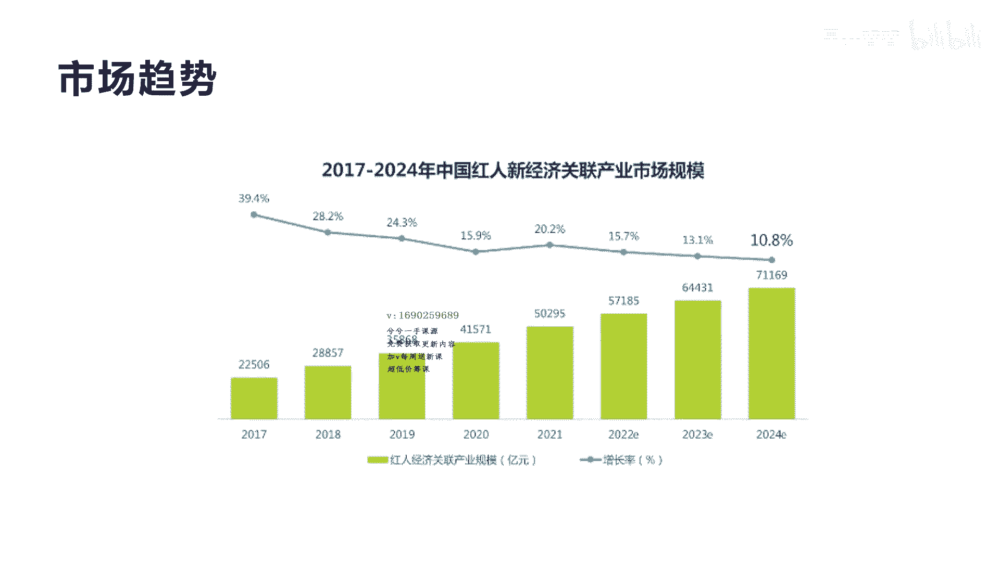
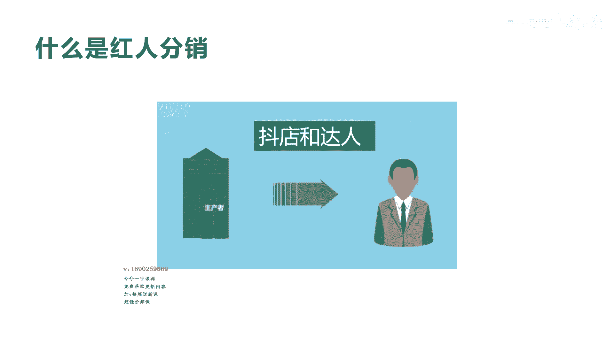
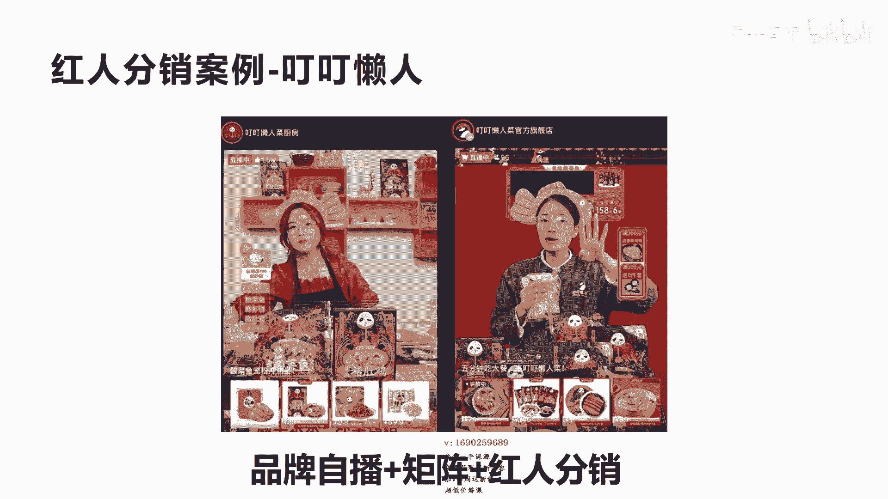
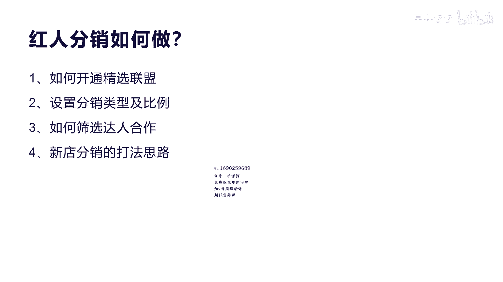
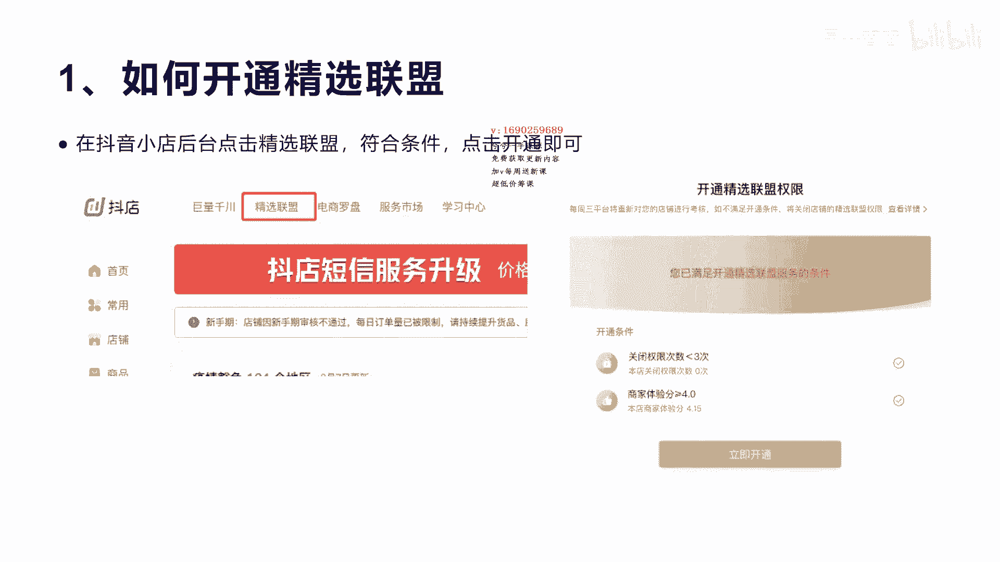
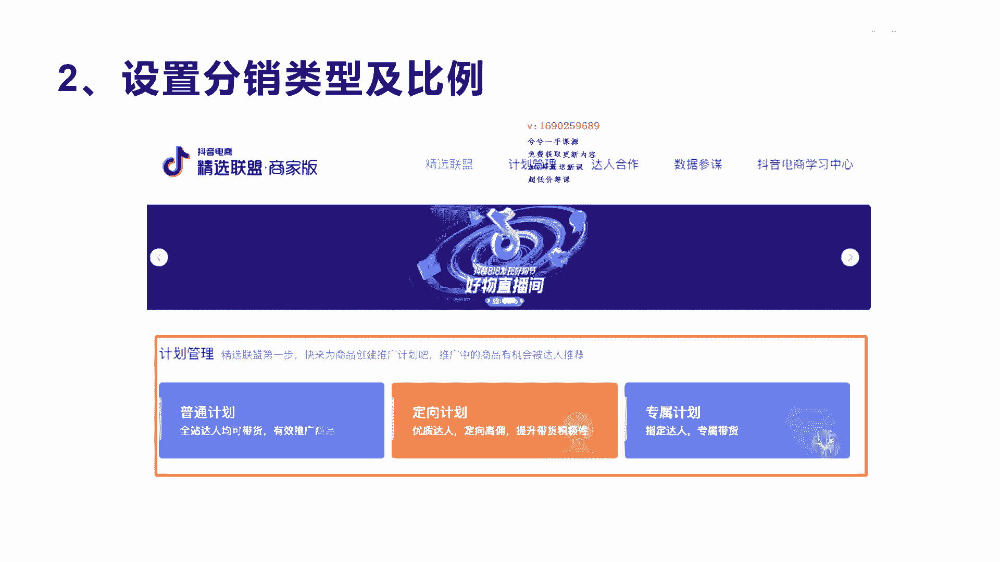
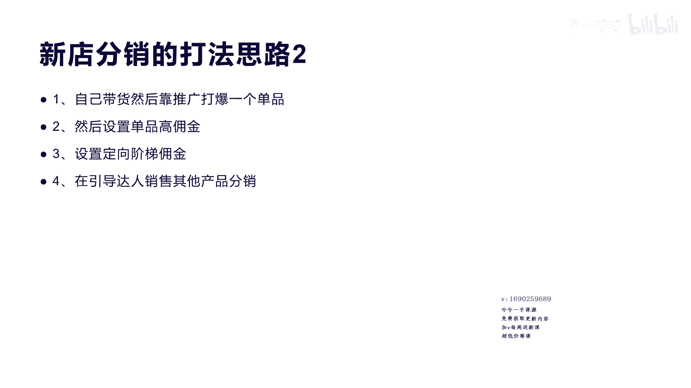

# 042 2023抖音快速起号必修课 - P31：第31节第七模式 红人分销模式-请收藏 - 早安睿睿 - BV1Gn4y1o7rC

好我们今天来讲第七大模式就是红人分销模式，这个红人分销模式呢我们今天主要是讲啊，他针对于我们讲的这个企业开店，就是我们将在抖音上面开小店的啊，老板或者是我们讲的啊创业者啊。

那么我们看一下这个红人分销的这个市场，我们了解一下它的趋势啊，2017年到2024年，它从啊2万多一直上升到5万多，到明年6万多到7万多，它会成为一个高速增长的态势，就是红人经济的份额。

所以红人经济这种模式将来一定是趋势，就是通过红人啊，就是网红嘛，网红博主这种啊，这种个人IP来带这种相关的产品，这种模式会越来越增长，越来越快啊，这种趋势是不可挡的，而且这种模式是非常成熟的。

对于抖音这种结算呀，包括他的整个这种啊服务的质量啊，包括产品的质量控制啊，这慢慢会趋于非常完善。

那我们来讲一下什么叫红人分销，红人分销其实来讲就是我们刚才说的，你必须要开个抖店是吧，你开完抖店完了之后呢，你就需要有相关的产品，这种产品他不是说开抖店的厂家，自己来进行销售。

就不需要去把自己的这种产品自己去卖，那么他通过什么啊，因为它的内容制作能力和直播能力，包括其他营销能力，他确实不强，他其实优势在于自己把产品生产出来，把服务提供好，是不是啊，所以呢达人是什么。

达人的优势就是我们讲的他有内容输出能力，他有营销能力，他有前端的直播带货的这种能力，所以达人就接到这种抖店啊，我们讲的这种有产业的，有产品的人啊，把这种产品蜂拥给他，给答案来带货。

达人通过赚佣金来赚取相关的这个利润，它其实就是撮合商家和达人的一个中间平台啊，这个中间平台我们等下会讲啊，他就是我们讲的抖音的精选联盟啊，呃这种他其实可以更快的让商家的产品。

通过达人的直播和短视频的方式把它销售出去，抖音的这种分销，其实跟原来我们讲的淘宝的阿里妈妈和我们讲，就淘宝客可能啊大家都清楚的话，都会知道有个淘宝客啊，是非常类似的啊，容易形成这种闭环啊。

之前淘宝客的它是通过什么啊，站外就是淘宝通过站外去买流量，然后呢这种站外的流量导到淘宝上面来，如果转化成功，他就分分拥给那些导流量的这些小的平台，而抖音它其实不一样在哪里呢。

它是内部的内部的流量进行互相的转化，抖店开完之后，他的产品是不是通过达人，在抖音的这个体内容体系里面进行分发，流量进行转化，所以它的自身的这种流量转化，会带会带来什么好处呢，它的流量成本就偏低。

而原来淘宝客这种方式它是站外去购买流量，那么站外的这种平台它需要呃赚取佣金的，赚取流量佣金，而对于淘宝来讲，他把这个流量分发给商家，完了进行转化之后，实际上他的固定成本是蛮高的，而对于抖音。

它本身内容就是流量，它本身有创造流量的能力，所以他的呃成本低，它的转化也很高，因为大家都在这个生态里面看内容，然后通过产品来进行转化好，那我们来看一个恒源分销的案例啊。

这个案例是一个头部的一个做预制菜的。

一个非常牛逼的一个啊产品品牌，这个产品品牌叫丁丁懒人啊，这个产品品牌是什么，呃优势呢它应该是现在是呃我们讲的抖音的呃，生鲜类目里面的第一名啊，生鲜类目的第一名，他有七成的额销量是来自于鸿门分销呃。

而且他的红润分销的都不是头部达人，他都是腰部达人，腰部就是不是非常牛逼的那种大网红，而是比如说10万粉丝，百万粉丝类似这种都是在带他的货，所以他的腰部达人带货，占到了他整个这个呃销量的五成。

就50%的销量是来自于这个呃，腰部的达人，那么根据的叮叮懒人菜的这个呃他的介绍啊，就是他现在的这种方式呢，红人分销加上自己啊品牌自播，加上自己的举证啊，这种三种模式进行合一啊，三种合一归纳成三点。

第一个就是他为什么做这么好呢，啊他因为他all in了这个抖音的赛道，他坚持爆款啊，我们讲的就是这个单品爆款啊，他的单品爆款就是它的酸菜鱼，通过这个单品爆款啊，然后引爆了其他相关产品。

第二个呢他就是非常重视红人分销，所以我们讲红人分销会起到非常大的作用，而且你如果自己通过直播方式，通过这种方式来卖自己产品的货，这个量和这个规模会受到局限性，如果让更多的红人来带你的产品。

它会让你的业绩增长非常快啊，你像他2020年10月份开始推广啊，就组建了一个十个人的一个团队，到现在2021年9月，他已经实现突破了1000万啊，突破了1000万一个月，非常牛逼了。

第三个呢就是他探索这个电波啊，它就是我们讲的自己波自己播的这个方式，占到他总销售额的50%啊，也就是说他第一个通过自播占50%，第二个通过红人分销的方式，所以他是什么自播加红人分销。

整个拉动它的这个销售额最大的，一个核心的玩法，实际上的产品确实很好，包括他的整个产品的包装包，包括它的品牌的这种品牌力，所以让很多人对他的产品非常放心，而且他的这个佣金包，这种分销的政策也是非常好的。

所以呃大家如果是自己有产品，并且呢有一定的还有品牌包装能力，有一定的产品质量保证，而且在市场上本来就是得到用户的啊认可的，这种产品一定要去做分销啊，分销对于用户来讲，它会产生一种蝴蝶效应。

就是有很多人他分销你的产品之后，会带来更多的达人自动的来分销分销你的产品，通过的这种方式会产生裂变啊，我们讲裂变啊，就是通过达人分销来裂变你的整个的销量啊。

那我们来看一下他的举证的啊，账号他有哪些啊，其实丁丁这个懒人他不是通过一个官方来直播，你看到没，我们现在这个图里面将近有七八个店，七八个店的在销售呃，第一个店，我们看到他的粉丝将近有120多万啊。

其他的都是十几万几万粉丝，那么第一个店的他的30天的销售额，我们看的是1986万啊，非常不错了，就一个月可以干将近2000万，一年将近就是两三个亿，那么其他的这个十几万的店铺。

他一个月也可以干个一两百万，两三百万，看到没有啊，确实也做的非常不错，然后整个这个矩阵一玩出来啊，一个月大概可以干到将近3000万的销售业绩啊，那么一年将近就是三四个亿。

这就是我们讲通过品牌自播来产生的销量啊，非常不错，那我们再看一下他直播啊，数据的分析，他的直播，你看一下他最后30天直播了将近33场，平均一天一场啊，平均一天一场，每一场的场官大概控制在300多人啊。

呃每一个每一个这个直播的销量，大概是5000多啊，一个月总共额销售量达到16。6万，销售量啊，那么销售额总共是30天，达到1800多万，平均每场54万左右啊，这个直播的UV值价值达到了三啊。

UV值达到三说明非常不错了，罗永浩的直播间的UVUV价值大概也就是2。5，两块五啊，他能达到三块，说明他这个呃每个用户的这个价值是非常高的，好这个是他的这个直播数据，我们再看一下他的每一场的直播数据啊。

每一场直播数据，你看到第一场就是7月26号，这一场呢他的呃直播销售额达到了30万，就一场直播30万额，最高的一次是7月20号的那一场，他是搞了周年庆，周年庆，我们就是最底下那一场，他是175万一场啊。

当然他的流量也非常大，这一场的观看人数达到108万啊，非常牛逼了啊，那么其他的平均来讲也就是几10万，比如说四五十万，二三十万，三四十万啊，呃三四十万，他的流量控制大概也就在10万左右。

平均啊10万左右，在线产数其实不多啊，你看到没有在线，像十几万的流量，他的平均在线人数最多也就是两三百啊多，但是它的转化率非常高，转化率非常高，好我们再看一下红人分销的这个数据分析，刚才我们讲了。

他有五成是自播，通过矩阵，通过自己品牌来自播，那么他还有50%的销售额，是通过我们讲的，就是红人分销，宏源分销，你看这个呃，我们看一下第一个产品啊，它79块钱的这个产品，他竟然有2120个推广人。

达人在给他做推广，大家明白我意思吗，就是他这个产品有2000多个啊，腰部的达人给他在做推广，还有我们讲第二个产品，其实有大概有1000个达人在给他推广，那么整个所有的它的产品体系里面，你看到没有。

推广达人加起来起码有三四千啊，三四千，这个还是我们的一个部分的截图产品啊，还有很多产品他都是给达人在带货啊，答案带货他的佣金设置都在20%到啊，10%几到20之间，平均都是20%的佣金。

也就是说我如果卖100块钱的这个呃，产品分销给达人来带达人销售一个，他就赚20块，所以他的佣金很高，所以导致了很多达人为什么愿意去带大的货啊，明白我意思吗，就是如果有些产品啊。

你本身只开个500%分之十的这种佣金，其实对于呃达人来讲，他没有很大的诱惑力啊，没有没有动力去带你的产品，因为他赚的很少，而且你的产品本身如果啊又有品牌啊，佣金又高，产品质量又好，用户体验又好。

达人就会纷纷自动来代理的产品啊，当然他后面我们会讲啊，红润分销的这种模式，他怎么去设置你的佣金，怎么去设置你的达人专专属达人啊，后面我们会来讲，我们再看一下他的用户画像，钉钉懒人呢。

他这个产品的画像呢一般是女性，在31~4岁左右，女性占了百分之啊，68啊，整个的基本上是女性在买，这个风度一般是在江苏浙江陕西，山东北京多一些，当然也有很多啊，可能是说男性也会喜欢方便嘛，预制菜嘛是吧。

方便我拉回来就可以开始做啊，不需要去切，我们再来看一下他的这个达人的相关数据，也就是你看我们刚才看到这个，79的这个产品啊，79他是有哪些关联的达人在带他的货，而且他们每一场带的销量怎么样。

我们都可以看到啊，你看第一个叫ha金城武啊，这个ha金城武呢它的这个产品的销量是70万，你看就带一个79的这个产品，预制菜的这个酸菜鱼的产品，达到了70万的销售量啊，下面的还有20万的，16万的。

十几万的啊，这都是这些达人带这个产品的销售，那么我们刚才算过，这个产品的佣金是20%，也就是说他通过直播带货，总共销售出去70万的话，那么20%他一个这样的单品就赚多少。

271 140000是不是14万啊，他总共是做了30场直播，然后带到了这个呃，70万的销售额，也就是一个月单品就可以赚纯赚14万，而不要考虑到发货，也不要考虑到产品质量这些售后等等这些问题。

所以这个还是非常对于达人来讲也是非常香的，对于呃店铺来讲，对于我们讲的丁丁懒人这个品牌来讲，他也是很喜欢的，因为有这么多人去带他的货，他的销量会法翻倍的去增长啊，包括其他的达人都还是做的不错。

你看最少的这个产品也可以做到将近10万，10万元，20%也可以赚2万块钱的纯利润啊，这种产品就很多人去做，我们再看一下这个呃金城武这个账号，你看他总共是一个月直播带货达到了啊，800多万啊。

这个这个账号他属于300多万粉丝的，一个不错的账号呃，但是他整个在钉钉懒人这个产品，你看到没有，他总共70万，就是说830多万里面，其实他带钉钉懒人的产品啊，就占了70万啊，一个单品啊做一个月。

你看所以他的额，这个产品的销量和对于用户的认可度来讲，是非常高的，对于达人来讲，也希望达带这种货能赚更多钱啊，好我们再看一下另外一个案例叫红人分销的，另外一个案例叫诺特兰德，诺特兰德他是一个什么品牌呢。

它实际上是专注于做营养领域的一个这样的，做大众化膳食营养的一个领域的一个品牌，他这个品牌也是通过红人分销的案例来做的，而且非常恐怖啊，它比刚才我们说的丁丁懒人的这种品牌的达人，分销的人数更多啊，更多。

它主要的产品的理念呢主要是呃精准营养，精准营养，就比如我们平时吃的这种维生素啊，啊这还有蓝色的多维元素片啊，包括益生菌啊等等，这些产品，包括很多有健身健美的这种营养品，所以他有很多这种达人啊。

是搞这种运动健身啊，或者是啊修身养生的这种达人，他最喜欢带这种产品，这种产品最适合这些达人来进行什么销售，而这些达人来讲又没有相关的产品，他们必须要通过相关的这种啊营养产品，来给他们做啊增值服务。

这也是我们在呃免费增值模式里面讲到这种，如果你有一定的技能，那么你要带一些货，你必须这种货跟你的内容和，跟你账号的定位和人设要相关是吧，那你的销售转化就会很高，好我们来看一下，你看这个图啊。

这就是这个啊，诺特兰德的相关的一个达人的分销的一个数，你看第一个产品它有5000多人在带货，5000多人在带这个产品啊，九块九，还有第二个产品24块钱，有4000多人在带这个产品等等，你看他每一个产品。

都将近有1000多人在带他的产品啊，所以他的分销啊，分销这个产品的力度非常大啊，非常大，但产品质量好，而且你会发现一个数，你看到中间这个佣金数啊，都基本上是30%，40%啊，这种利润率是非常大的。

我一个24块钱的东西，如果卖出去一个，我可以分佣到40%，也就将近可以分到一十块钱啊，就要24块钱，我可以分到一十块钱，你说多香啊，而且它的品牌力度在这里，它的产品质量也不怕，是不是啊。

所以这种产品品牌他去做红润分销，第一个让达人有非常强的选择力度，第二个让让达人来讲，更多的放心去分销他的产品啊，因为有第一个有钱赚，第二个产品质量得到保证，他也可以跟用户有交代。

是不是服务的质量也会达到更好，这就是我们讲的这个红人分销的好处啊，那我们看一下他的额用户画像，他的用户画像呢跟刚才那个又不一样了啊，他虽然都是女性，你看到没有，都是70。93的，都是全女性在购买。

男性只有20。9%，但是他的年龄人群呢偏向哪里呢，偏向31~40到至上的人去走，就是比如说41~50还占了蛮多的分量啊，51岁，所以他人群是30岁之到50岁之间的，用户人群比较多一点啊。

然后他的地域呢一般是山东江苏湖南广东啊，所以这种一线消费城市啊还是主力军，他们更追求这种什么养生好，我们看一下他的这个达人，这个达人，你会看一下他的这个达人的名字叫尊善堂，就做最好的一个八个直播。

八场直播给他带来了22。7万的销售额啊，啊他其实还是通过了很多这种视频带货，你看到没有，他视频带货转化的力度还不错啊，做不错，他的这个整场的这个这个产品，它的佣金是15%，也就是说如果卖20万的销售额。

那么15%的话，他将近可以赚到3万，对于达人来讲还是不错的，包括第四个，你看到没有，一个叫央视网选，央视网选是800多万粉丝，央视也在开做直播带货，他基本上啊也是每场直播都会带这个呃。

这个产品它将近也卖了9。2万啊，虽然不多啊，但你会发现它的量还蛮多，有销售了9000多个销量，因为它单品价不高啊，能做到这个很不错了，然后我们看一下他的这个刚才讲的排在第一的，尊善堂，这个产品排第一的。

他是一个110万粉丝的一个达人，他主要做的是讲的运动健身这一块啊，保健食品啊，包括美容护肤，所以他整个他的人群的定位跟他这个品牌的啊，产品非常符合，所以他30天销售了将近34。90000，看到没有。

30天销售了30。9万啊，他主要核心销售的产品，就是他的这个诺特兰德的这个产品啊，是一个啊复合的B族维生素啊，啊这个维生素它你看它销售了22。7万，就刚才我们讲的九块九啊。

那其他的产品呢销售的力度就没那么大了，要1。9万与1。2万，所以你会发现他的产品好，有很多达人就专门来带他的产品啊，就靠他一个产品就够了，其他都不要去卖，这个我们就看完了啊，另外这个品牌的案例我没看完。

这两个，通过这两个案例我们可以总结出来啊，其实红润分销怎么去做呢，其实就四步，第一个呢对于商家对于我们开小店的人来讲，老板来讲啊，首先你得去开通我们讲的红人分销的这个啊，政策。

这个我们就是通过呃去到精选联盟，精选联盟会有一个开通的一个要求，等下我们会讲，第二个呢就是设置分销类型和比例啊，就是分销它会有很多种类型，普通的分销专属分销，还有佣金定定制分销。

还有佣金的这个阶梯分销等等啊，他们每个比例你都会自动的去专属去设置，第三个我们讲的是如何筛选达人合作，就是你把精选联盟开通，把分销类型和比例都设置好，那么这这个时候你就去，你可以主动去邀请和筛选达人啊。

这是怎么去做，后面我们也会讲，包括第四个就是对于新店来讲啊，他们刚开始起电的时候，你的销量没有你的产品，大家都不知道，这个时候你通过什么样的打法的思路来啊，让你的分销可以啊马上开拓起来啊。

那么我们来先讲一下啊，就第一个如何去开通精选联盟，其实很简单，我们如果有抖店的话啊，进入我们的抖音小店的后台，点击上面那个一级菜单，有一个叫精选联盟啊，只要你符合条件，点击开通就可以了，这个条件很简单。

他就是你的体验分要大于4。0，那当然新店的话，60天内新店铺是不需要考核店铺分数的啊，如果是小于3。5分，那么精选联盟就会把你给清退，如果你清退三次，你基本上就永远的不可能去什么，加入到精选联盟了。

所以这里会有上面第一个条件叫关闭权限，次数是小于三的，就是你没有被关三次，就是如果你的店铺违规了，或者做了一些违规的操作，违规的一些东西，他就会关关闭你的这个权限，如果关闭三次啊，关闭商城。

你就基本上没有办法再去开通你的啊，竞选联盟的这个权限了，就分销这个权限就就关闭了啊，所以我们一般来讲用户来讲呃，我们都具备这个先决条件，但是经过你运营和分销的这个过程，产生一些投诉啊，产生一些违规啊。

就可以触发掉你这个精选联盟的开通条件，如果关闭三次，你基本上永久永久就清对了。

大家要稍微注意一下这一点，第二个我们讲呃设置开通完之后呢，我们就是怎么去设置分销类型，分销类型其实他这里有三种，第一种是普通计划，第二种定向计划，第三个叫专属计划啊。

那我们来看一下这个专属计划和定向计划，到底有什么区别，普通计划其实很简单，普通计划就是你设置一个佣金，对某个产品，那大家都可以来带，就团购达人都可以在精选联盟，看到你这个产品的一个情况啊。

然后他加入啊自己的选品就可以了啊，加入到自己的橱窗。

普通计划呢他就是普通的达人，全部的达人都可以在进行里面查看你的产品，到他的这个商品橱窗进行带货，那么第二个专属计划，就是你可以指定某一个达人，把达人的相关的UID传递给你啊，UID你可以找啊达人去要啊。

一般是在他的这个个人主页的用户中心里面，去找到他的UIDUID给你完了之后，你添加到这个里面去，然后指定这个人只能代理某一个产品，它的佣金固定是多少，这就是我们讲的专属计划，指定达人，指定产品。

指定佣金啊，然后第三个就是定向计划，就是给定指定的达人定向佣金和阶梯佣金，就有些他是你的这个专，跟这个专属计划也有点类似，但是这个上面再产生一个阶梯的奖励，比如说你达到多少销售额啊，达到多少量。

然后我给你再多的一种专项的，专属的一种分佣政策啊，这就是给专项的定向达人，因为有很多人，他呃说我的业绩可以帮你做到10万个呃，那你要给我更多的佣金，那我就愿意贷啊。

这样就可以刺激更多的达人呢去代理的产品啊，这就是我们讲的分销计划的三种类型，那我们怎么去选择达人合作呢，其实选择达人合作呢有呃有几个呃核心方法，精选联盟之后，我们在这个精选联盟的里面会查。

上面有个叫达人合作，达人合作里面有个达人广场，这个达人广场里面就可以找到，所有的这个相关的达人，然后你就可以啊去筛选相关的，比如说通过内幕去筛选，然后你可以筛选一些相关的你这个产品的类目。

比如说你是卖玩具的，那么你就选择玩具这个类目去查询，做玩具类目的达人，第二个就是我们讲的要通过带货数据，比如说他的呃带货数据，每一场大概是卖呃5万到10万，那么这群人啊就更适合啊，有能力去带你的产品啊。

当你的产品好，他愿意同意是另外一回事啊，那我们要去选，还是要选这种达人，就是他有直播带货的，能力一定是每一场直播能达到个5万啊，10万左右的这种比较厉害的这种达人，第三个我们讲就是达人的这个等级啊。

等级一般我们会选择三级以上的等级，这里面有个达人属性啊，里面有个等级，一般选三级以上，你通过这种方式选出来的答案呢，你再去通过跟他去合啊，去合作，去加他，让他去啊，带你的产品啊，去主动的带你的产品好。

还有一个步骤呢，就是我们讲的就是30天，带货天数至少要达到15天，也就是说他一个月的额直播带货，直播带货的产数一定要大于15天，是最好有些人他一个月就开两场，这种你就不要去找他了，或者直播的时间不多。

你就没有必要去选它，第二个呢就是呃合作的店铺数量啊，一般就是他的合作店铺数量越多，那说明他的这种直播带货的能力很强，他肯定不可能只带你一个产品，所以一般的合作店铺数额，最好是能达到30个或者四五十家。

这种啊比较好，第三步呢就是你可以进他的达人带货的数据，相关数据去分析啊，去看他是不是有做相关的，类似于你这个产品的带货，如果有，那更好，比如说你的价格比他原来带货的品牌啊，它的质量是一样的。

但是品牌和相关的佣金不一样，让你去联系他，给他更多的好的政策，他才会选你的产品，来看一下新店分销的打法思路，如果你通过刚才这些方式找到你对应的达人，比如说通过对应的类目，然后他的额达人的这个相关的指标。

符合你的要求，那么你就可以去看他的，之前带过这个产品的佣金啊，他带货产品佣金，比如原来带一个玩具是15 15%的佣金，那么你就可以看一下，他这个产品是不是还有空间，你可以把他这个产品到某拼多多啊。

或者是呃到淘宝或者是1688上面，平台上面去找同款啊，同一个产品，同一个品牌，如果你还可以更多的佣金给到达人，那么你就可以把这个产品给下下来，下下来之后放到你的这个平台里面，放到你的这个产品里面。

然后你给达人啊20%的佣金，那么这个时候你去联系他之后，你原来达人只能赚15%，而你现在可以给他20%的佣金，你说他愿不愿意带同一个品牌，同一个产品，是不是，所以对于达人来讲，只要你的额佣金给的多。

你的产品质量和相关的东西没有问题，那他肯定会选择你啊，这就是第一种思路，第一种打法啊，这是可以让你快速起新店的一个一个玩法啊，分享的第二个打法思路就是你自己带货呢，呃靠通过广告营销，通过直播。

通过自己的一些视频带货，把一个单品先打爆啊，比如说我们有个九块九的一个啊，一个这样的卤料包，那么你九块九的卤料包通过你自己直播，通过你自己的这种呃推广付费推广，然后通过你自己的短视频等等。

通过全部集中精力把一个单品做到，比如说做到1万的销量，做到5万的销量，这个时候就打爆了一个单品，因为达人在找我们刚才讲的，达人在找一个产品的时候，他首先看的指标就是你的销量如何是吧，你的销量越好。

说明你对于用户的使用体验会会非常好，这样他去带你的获得评分也会高，那么第二个呢，你的这个那销量越高的话啊，他就说明对于用户购买的时候，他的下单欲望是非常强的，转化非常高。

所以你如果单品销量突破1万到5万，这说明你的达人主动找你的这个人，就会越来越多，那么你就可以筛选，是不是，那么第二个呢，你通过这种单品打爆之后呢，你可以把这个单品的这个佣金设的高一点。

当然要保证你不亏本的情况下，比如说九块九，你的利润还有百分之啊20，那么你分出15%给什么给达人，那么九块九分出15%给达人，达人也是愿意愿意去带的，因为你的销量起来了，所以第二个第三个呢。

就是我们讲的设置相定的阶梯佣金，比如说你啊卖1000个是给你15%，那么你如果卖了1万单，我给你16%，17等等这种方式来激励这种达人，卖的更多啊，而你啊通过他们卖的更多之后。

你的销量上去之后会产生啊这种良性循环，有更多的达人来对你进行带货啊，这样你就可以通过我们刚才讲的，红人分销的这种模式来把你的销量，把你整个这个规模做大，第四个呢就是引导达人销售其他的产品。

因为当他到你的产品里面来额选，到你店铺里面来选某一个分销之后，如果你有其他产品，他顺带的可以去带，何乐不为呢啊，那么这个时候设置其他的产品的蜂拥，你就有讲究了啊，那么如果说这个是15%。

那么其他的产品你可以把它设置高一点，比如说25%到30啊，把你的让他有利润的更多化，就是让他在代理其他产品的时候，有更多的想象力，而不是说哎你原来15%，那么现在我给你百分之啊，还是15%。

那他带其他产品的动力不多啊，当然如果你一个单品让他可以做爆，那么它顺其自然，在你这个店铺去选择，其他同类型产品的可能性就更大啊更大，这也是我们讲的新店来讲，分销的这个呃一些打法思路的第二点好。

那么整个来讲对于红人分销这个市场来讲，对于呃小店啊是非常好的一种方式，因为我们在讲抖音的这种模式来讲，它是呃非常完善的一个体系，所以不管你是后面怎么去做抖店啊，啊通过自己去直播肯定是需要的。

但是通过红人去分销你的产品，去把你的规模和力度，把你的品牌做大也是非常重要的，所以这两条路一定不能说啊，只走单单线的路线啊，当然有很多人说哎我没有很强的这种产品能力，那你就不断的去打打造你的产品。

那你的产品越让用户感受到非常的啊不错，性价比又高，又是品牌，那就有更多的达人来代理的货啊，所以你自己去做矩阵的难度是比较大的啊，你要做三个矩阵，四个五个矩阵，对你的运营团队，对你的销售能力都非常要求强。

那么有100个，1000个或者1万个达人来带你的货，实际上你只要考虑到什么，售后的问题和生产的问题就可以了，所以这对于老板来讲来做抖店，比你去原来去做这种淘宝也好，拼多多也好，不断的自己去开店。

绝对是一种非常好的模式啊，像我们像拼多多，淘宝京东这种它是没有分销体系的，他分销是很难分销出去的啊，懂我意思吧，他分销无非也是在他们内部进行销售，而对于抖音来讲，他是通过什么达人的这种影响力和IP。

和这种信任度来代理的产品，他的带货转化率肯定是要高的，对于品牌商来讲，你肯定会损失前期损失一些什么蜂佣的佣金，但是你要想你这些佣金，你你自己去开的话，你也需要什么相应的成本啊。

所以这种东西一定要产生共鸣啊，封销对于老板来讲一定要去做，而且不要舍不得啊，不要舍不得好，今天我们就讲完了这个红人分销模式，非常好的一种分销模式，我觉得每个如果开抖店的人。

都可以去尝试去把自己的分销体系策划好。

怎么去做，怎么去打好。