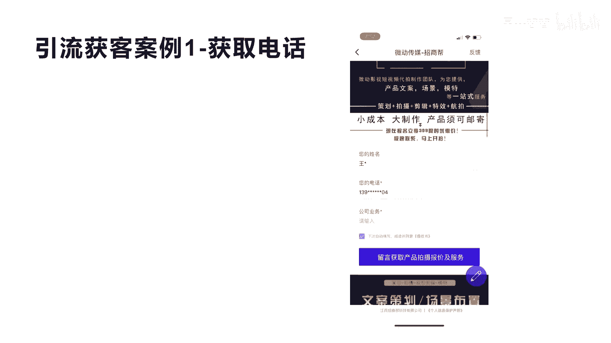
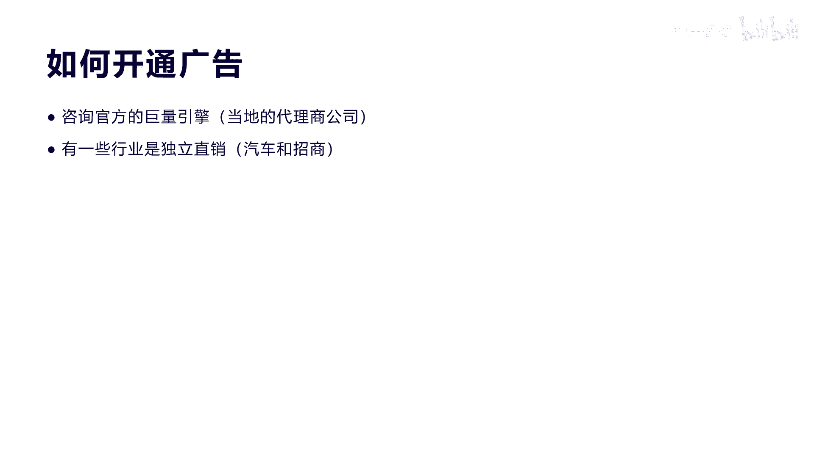

# 042 2023抖音快速起号必修课 - P32：第32节第八模式 引流获客模式-请收藏 - 早安睿睿 - BV1Gn4y1o7rC

大家好，今天我们来讲第八个模式叫引流获客模式，呃，引流获客模式呢，也就是我们讲的对于很多人他不想去做内容，也不想去啊做直播，那么他直接通过广告获客，引流的方式来获得用户的客户线索。

然后通过线下私域的方式来进行转化，而这种模式呢呃更适合于那种产品，销售型企业和服务性企业，这种模式呢它更适合于下列以下这种类型啊，第一个就是我们讲的本地生活啊，这种类型，你比如说是我们讲美业这个行业。

它就属于本地服务型的，包括呃酒店啊，包括呃民宿，还有我们讲的一些足浴啊，类似这种服务器的本地生活，他就需要引流获客直接进行转化，第二呢就是像这种招商加盟的，招商加盟的这种呃。

就更适合于在里面去做一些这种呃广告，然后通过广告来直接获得线索来进行招商加盟，因为招商加盟这种东西，它不可能通过某一个抖店的产品，或者是某一个呃固定的价格来进行成交。

他一定是通过线下的洽谈和相关的线下合同，包括线下私域的这种转化，还有教育产品，金融产品，包括汽车行业，都有很多都属于这个引流获客，直接转化私域的这种方式。

好，我们来看一下引流获客的案例啊，第一个案例就是他直接去获取电话号码，然后转私域，我们看他的视频是广告怎么做的啊。

找不到专业视频拍摄团队，担心拍摄成本太高，别担心，我们是专业的一站式拍摄团队。

好，大家看到没有。

他的这个视频，其实我们从刚开始来看，你就知道它下面有一个什么，有一个广告两个字，我不知道大家看得清楚不啊，实际上你看上去像一个短视频，实际上它是一个广告切片，你看到没有，当他讲的差不多中间的内容的时候。

就会有一个叫查看详情，点击这个查看详情的按钮进去。

完了之后就会有个这样的啊落地页的文案，这个文案就是促进大家去购买，下单的一个这样的落地页啊，它提供非常强啊，非常专业的产品信息拍摄啊，一站式服务，全程不操心，仅需要399，然后看到这个内容之后呢。

在它的下面我们就会发现有一个这样的啊。

姓名电话以及相关的公司业务，然后点下面那个蓝色的按钮留言，获取产品拍摄报价，这个线索获取完之后，在你的后台，巨量引擎的后台就可以有一个这样的信息，然后你通过销售人员拉到这个电话，然后直接跟他去联系。

去转化好。

我们再看另外一个啊，第二个案例。

这是个游戏的案例啊，这个邮箱呢你看到没有个广告。

然后下面有个查看详情，是不是啊，这个游戏叫剑侠世界。

那么这个游戏之后他点击之后是直接干什么呢，我们来看一下啊，直接他就是一个下载。

看到没有，叫立即下载，然后他下载的就会跳到，如果我们是苹果手机，就会跳到这个剑侠世界三的app的下载的页面，然后这里就会点击获取，就相当于把这个app给下载了，所以如果你要推广自己的app。

用这种模式也是非常适合的啊，这就是我们讲的引流，获客的第二种模式叫下载引流，然后转化自己的私人的app。

我们再来看第三种好吧，橘黄色的日落吞没在海平线。

这也是一个眉页啊，眉形设计的一个广告。

你会发现下面也会有一个查看详情啊，然后我们看一下那个他的详情页啊，他的这个详情页呢你看到没，他的详情页在这个地方的时候，它会有一个落地页，这个落地页下面有个点击领取活动名额，是不是啊。

那么下面点击这个领取活动名额之后呢。

它实际上会转到哪里去呢，会转到微信的私域。

也就是直接添加企业微信，然后我们扫码你会发现诶，它会让你打开企业微信名片，去添加这个企业微信，这就是我们讲直接通过广告引流，获客转到企业微信的一种全链路，这种电路呢有很多人在用啊，因为它转化效率啊。

整个打通它不需要再去什么用电话去沟通，所以这比第一个线索获取要会好一些，就是获取电话号码，但是这个地方也会有一个问题，有很多人看到要扫二维码，他不愿意去扫了，所以啊这种转化率来讲也相应的会弱一点。

因为很多人可能到这里还不知道，怎么去识别二维码，当然不管是什么样的转化效果，其实就是转化漏斗，转化转化漏斗是什么意思呢，就是我们第一个广告打出来之后，让1000个人看到。

那么实际上只有100个人愿意进你的啊，敬你的那个广告详情页，进你的详情页之后，他并不代表他就会留电话号码，那么100个人里面可能只有十个人留电话号码，这个下载也是的，因为有可能100个人看到落地页。

下载这个游戏app，可能就只有啊五个是不是，然后转私信，转企业私信也是有可能100个里面只有什么，只有两三个了啊，所以他每一个链路的相关的呃，转化效果它是不一样的，所以我们讲这是一个漏洞。

你如果要转化效率高，你就不断的去优化你的内容和，优化你的什么面目，包括我们讲的这个最后的转化，所以呃怎么去做这种广告引流获客啊，我们后面来详细来讲，会有很多种方式，刚才我们也看到有引流获客。

直接填话电话号码，还有一种是直接下app，还有一种我们讲直接去转企业微信，是不是，这几种都是现在比较常用通用的一种方式，而且对于很多门店来讲，对于很多这种啊相关的实体店来讲。

用这种方式是比较简单粗暴的啊，不用去天天去做短视频，天天去直播，那这种输出就是今天投放啊，今天就会有效果啊，至于效果的多少，那要根据你的内容，每个链路转化化的效果来定。

那么这种引流获客模型的核心呢，它就是通过广告来获得线索，然后再通过私域啊来进行变现啊，这种方式其实很简单，就是我们去打一个广告，通过抖音和今日头条，包括等一下我们会讲啊，这种抖音体系的字节。

跳动体系的广告到底有哪些类型，这个广告播出去之后获得相关的用户的需求，这种需求，然后进行什么进行私域的相关转化啊，这就是引流获客的相关的这个核心模型，我们看一下广告的形式啊，对于抖音体系来讲。

我们会发现它有一个叫巨量纵横，巨量纵横就跟我们平常听到的什么巨量引擎啊，巨量千川啊是吧，包括巨量星图啊等等都类似，但是他这个实际上就是呃整个的呃，所有的广告体系啊，所有的变现体系都在巨量综合里面。

那巨量综合里面第一个位置，我们就是说的巨量广告，第二个巨量千川就专门做抖音体系的直播啊，包括短视频带带货的这种直播，带货的这种方式的投放，广告投放，那么还会有企业号跟巨量星图。

那么最主要我们今天来看一下这个巨量广告啊，那么巨量广告里面有个非常牛逼的一个产品，叫穿山甲，这个穿山甲是我跟大家介绍一下是什么意思啊，他就是说啊抖音字节体系，它啊跟10万的这种app的应用进行合作。

然后呢，他们的覆盖人群大概是全球的8亿用户是吧啊，然后每每一天的广告求请求，大概达到了630亿次啊，日均的广告展示达到110亿次，实际上是构建了一个移动生态流量。

那我们来看一下穿山甲，它它的这个具体的流量布局啊，它实际上其实刚才我们也讲到啊，他合作了很多这种应用，这种应用它有不同的类型的啊，像阅读的娱乐的啊是吧，生活记录的啊，包括我们讲的还有一些行为软件啊。

啊行为软件之后，他还有一些自带的一些这个厂家自带的，比如说像华为啊，小米啊，他们自带会有生态里面也有应用，也有流量，把所有的这些流量然后都开放给穿山甲，就跟字节合作啊。

然后大家都可以通过这些相关的属性人群，你在投放的时候进行选择啊。

或者他智能来推荐好了，我们来看一下巨量广告的相关的界面，刚才说了，所有的广告其实都是通过巨量广告这个平台来，什么来获取，推广计划的设计和相关线索的获取啊，那我们来看一下这个。

实际上它巨量广告分为第一个叫品牌任职，第二个叫用户意向，第三个叫行为转化啊，一般用的多的都是用户的意向和行为的转化，这两个比较多啊，因为品牌认知这个上面呢，对于很多大的这种品牌商可能多一点。

对于我们中小卖家和更多的这个企业，中小微企业来讲，更更多是什么卖自己的产品，然后获取线索进行转化等行为转化的时候，我们这下面会有一排的啊，五个类似的这种推广的方式，可以什么推广你的app啊。

如果我说我们有一些呃公司做自己的app，想推广的话，那你就选择行为转化，推广自己的app，第二个就是销售线索的收集，就比如我们刚才讲有这种美业的啊，美业的他需要推广自己的产品。

获得更多想要呃修眉毛啊是吧，祛斑啊等等类似这种服务，那么他就可以用这种销售线索收集的方式，来收集更多的啊意向啊，通过电话号码，通过相关的加微信或者企业微信来进行啊，思域的转化，那么抖音号也是的。

他对于抖音号就是比如说某个账号的加粉啊，互动啊，评论数就跟我们平时投放斗家一样的啊，在这里面也可以做投放，那么第四个呢就是门店啊，就很多我们刚才讲的实体门店，这种实体店它需要引导用户去线下去消费。

比如说一个做餐饮的啊，他卖小龙虾的，那么他通过线上的这种88块钱啊，多少的一个团购券，或者是一个广告啊，一个营销广告引导用户到线下去购买啊，这就是我们的门店的转化，至于电商店铺的推广呢。

也就是它可以引导用户呢到嗯小店去推广啊，当然它原来是可以引导用户到淘宝，拼多多这种外部电商平台去推广，都已经封住了，现在直接到抖抖店里面去进行购买啊，这就是我们讲的整个他行为转化的，一些相关的类型。

我们来看一下具体的投放的范围啊，投放的方式是什么，他投放的范围在我们在点击新建计划，进行投放的时候呢，你会发现你可以去选择媒体啊，我们可以选抖音和今日头条，是不是，当然他也有什么。

他也有可能会选其他的媒体啊，因为有不同的投放类型，就刚才讲的我们叫app的这种应用推广啊，他就不能在抖音和今日头条，他可以在更多的其他平台，穿山甲啊的流量平台会给你推推广，就中间这个图啊。

包括中间的我们看到今日头条，西瓜视频抖音是吧，还有番茄小说穿山甲，包括其他的精品游戏平台，整个这就是他们的我们的投放的首选媒体啊，呃这个我们看到最后右边这个受众的预估啊，你会发现头条的覆盖用户数达到1。

3亿是吧，他的展示数是9。2亿啊，包括西瓜视频少一点，当然我们的看了抖音，它是最大的，抖音现在是6亿的覆盖人群，70亿的展示量啊，其他的就比较少了，你看我们说的这个穿山甲，为什么它有13亿啊。

因为穿山甲我们刚才讲他是为了干什么啊，贯穿整个线上app的啊，一些渠道，一些这种应用的流量集合体一起形成13亿啊，13亿它会覆盖的展示数达到68亿啊，每个广告位对应的多少的这个流量体，他都会展现出来。

让你去选择好吧，因为你选的越广的话，你的投放的额面就越广，那么你获得线索的可能性就越大啊，当然你的推广越广，你所付出的成本就越高啊，这是相对应的好，我们看一下这里面一些相关的设置。

我跟大家稍微分享一下我的经验啊，包括我们也用过很多这种投放的一些呃，带头发的和一些小的技巧，给大家分享一下如何做定向投放，一般来讲你前期你如果你的产品固定的人群，比如说是只推女孩子，那你可以选女。

比如说你第一个你是推广推广的是本本土啊，本地城市，而不是全国，那你可以在这个地域这里，选择自己的相关的区域，你只推湖南省还是推北上广啊，包括你每一个商圈，你都可以去限制他的投放啊，当然你限制的越窄。

你所投放出去的流量口子就越窄，这是相对应的啊，那么性别这一块呢，你也可以选男女，看你的产品而定，年龄也是一样的啊，如果你觉得你的产品只面向于啊30~40岁，那你可以选中间的30~4岁。

如果你的产品限于50岁加的，你可以选50岁啊，包括下面的一些行为，包括抖音达人，包括其他的啊，穿山甲的媒体定向等等，你都可以去相应的设置，但是前期来讲一般建一个大的计划来讲。

最好是把你的范围尽量的放开一点，因为如果你设置了太多的条件的话啊，有可能你就跑不出量啊，跑不出量，这个计划就效果非常差，而第二右边这个投放展示的话，你可以输入你的第三方的监控链接。

就比如说我们说要投放到我的自己的啊，一个应用程序的下载的订单上面，你可以写上你的呃展示的地址，包括你的出发点啊，包括视频播放的地址啊等等，这些都可以在这个链接里面去输入，因为有很多。

它并不是在抖音的生态的应用里面去进行转化，它有可能是我自己做了一个网页，网站或者是一个程序，那么到那个地方去转化，我更容易收集到资料，我们来讲一下，如果投放广告的一些相关的技巧啊。

第一个你一定要刚才说的，一定要确定你的人群，这个人群其实我们比如说一般的企业来讲，要不就是to b，要不就是to c，是不是，那我们建议呢如果你是做to b的，就是销售给企业的这种产品。

那你可以做做头条，因为对于销售企业的这种产品，一般来讲中小微企业都是老板做决策，懂我意思吗，老板做决策的这种老版的用户群体，很多都是喜欢在头条上面看新闻，看一些呃相关的深度一些的文字啊。

所以老板类型的这种在头条的粘性非常高，那么如果你是读消费c to c的这种产品啊，我建议我们还是去做短视频，最主要还是核心做抖音是吧，因为现在抖音的流量体系是最大的，性价比也是最高的是吧。

他的转化路径和包括这些东西都是打通的，所以如果你是做C的消费产品啊，那你建议更加用短视频的方式去做抖音啊，习惯视频也可以覆盖一些，但是量不是很大，第二个我们讲形式，头条呢如果你是做头条。

更加适合于做图文的形式，因为头条本身他就是看新闻，看图文，看深度的文字类型的东西啊，那么你可以在自己设置创意的时候多一些维度，这个创意我就不细讲了哈，因为在每建一个计划的时候。

他都需要大量的去建相应的创意，每一个创意对应的相应的转化都是不同的，所以你不断的要试出来你最好的那个创意，最性价比高的创意或者是转化最好的创意啊，所以创意一定要多维度的去展示，那么如果是做抖音的话。

这种推广短视频是肯定不少的，所以抖音的短视频的这种维度，和他的拍摄的转化，你也要实时去跟踪，你也要不断的去有创意，多做一些这种短视频的维度，这样可以测出哪个短视频的效果最好啊。

第三个就是我们讲的就是落地页啊，不管你是短视频形式还是图文形式，最后会有个转化的落地页，就是让用户去填那个手机号码，或者是说有很多现在不填手机号码，直接加，可以加什么，可以直接加企业微信啊。

那么这种东西你都需要不断的去调整，看哪一种落地页转化的效果最好啊，因为落地页它主要是对于文字性的描述，包括一些东西进行一些什么进行一些展示啊，这种展示可以更多的让用户点击完之后，进行一个转化。

我们讲第三个就是我们讲的计划，计划是什么意思，计划就是我们讲的呃，就像跟我们说的这个斗家一样，我不知道大家投放过斗家没有斗家，他可以推N个作品进行同时来投放，是不是，那么这个也是一样，你可以开N个计划。

比如说我们上午呃呃八点到12点，我开一个计划，这个计划大概预算是300块钱啊，这个计划跑完了，那么他获得的相关的转化，因为每一个时间段他可能对于用户的这种行为，包括用户群体都不一样。

那么上午我可以开一个计划，下午我可以开一个计划，晚上我可以开个计划，但是晚上由于由于流量竞争热度比较大，所以晚上的这个计划你可以什么，你可以把他的金额开的更高，就是竞价的金额开的更高。

因为晚上的竞争激烈一些，而对于早上来讲，你可以把成本缩低一点啊，成本可以开低一点，竞价成本开低一点，这样你的话就会形成三个计划，做最优的这种匹配，当然还有一种，比如说我们呃每个产品可以开个计划啊。

这种产品比如说我面向的用户群，我做一个计划啊，是全天开放，那么第二个我另我另外一个产品，也可以开一个计划啊，这就是我们讲的针对于产品，你也可以该计划，针对于不同的时间段，你可以改计划。

针对于不同的地域也可以改计划，还有我们针对的不同的人群都可以开计划，这就是我们讲的多计划的好处，然后你根据这些计划开出来的，那个跑出来的效果，然后来判断到底我应该怎么去控制预算，然后做某一个计划好。

第二个就是我们讲的目标转化出价，你可以建议建议出价，我们在每一次开始出价出价的时候，就是比如说我转化一个线索，出价300块钱呃，在我们的呃巨量广告里面投放，他都是投线索啊，线索就是意向客户啊。

但是说实话啊，我们投放之后也有很多这种莫名其妙的，他根本就没有意向，他也去填这个表单的，有绝对会有这种，有的话你可以去申诉啊，可以去申诉，申诉的话抖音他还是比较认可的，如果你因为每一次进行沟通的话。

他都会有一个录音啊，都会有个录音，这种录音的效果会让你啊举证，然后说哎这个人根本没有没有意向，但是他什么他提交了表单，那么这个时候你可以让他什么啊，让他撤掉这个呃虚假的这种线索，他会把相应的成本还给你。

他里面有个建议出价，就是你开的某一个计划和某一个产品，他建议你出价，比如说300块钱，那你一定要设置300，不要去设100啊，如果你设100，它的效果不好啊，如果你是350块钱的话。

你的效果可能会比一般的人出价，因为他是靠竞价来来推你的流量的，呃你如果进价是400，那他肯定比300的那个人推的流量，覆盖面更广一些，大家明白我意思，所以适当的在建议出价上面去加高你的出价。

然后在过程中你慢慢再去调，就跑起来量之后再去调啊，这是我们讲的一些分享啊，就是广告投放的一些技巧，因为我们给很多人做过这种带头发啊，它里面会有很多的一些技巧，我们来看一下，就是哎这种广告既然这么有效果。

我们怎么去开通，其实我也跟大家分享一下，在每一个城市，至少一线城市和省会城市，都会有相应的分公司啊，就是巨量引擎，巨量引擎大家去搜一下官方啊，巨量引擎上面有一些电话，就你问官方打400。

他会引导到当地的代理商，就比如说你是你是这个湖北的，湖北的公司，那么他湖北武汉的，他会有一个代理商会直接跟你联系，然后中国通过线下来进行跟你啊签订合同，然后把充值充到你的账户里面去啊。

叫巨量广告的充值啊，当然他会对你的资质进行一些审核，如果你不符合某一个产品的这个啊资质，或者是某一些某一些类别，他是不允许这这种投放的，那你就投不了啊，当然还有一些就是某一些像我们刚才讲的。

汽车行业和招商行业，它是有专门的独立直销的，它就不属于当地的代理商来进行额开户的啊，他就可以他就是总部直接开户的啊，当然总部会扶持你，比如说这个招商他总不扶持你，就是呃教你怎么去投放。

或者给你准备一些素材，这些相关的都会在他的服务范围之内啊，因为有很多啊这些公司啊，实际上自己确实都不知道操作，就刚才我讲了这么多，可能很多人都不懂啊，虽然你只是略懂一二，但实际上你要真正要开始推广。

你还需要更多的让代理商来扶持和协助你，帮助你把整个广告推翻出去啊，有时候他们短视频包括落地页，包括一些素材创意的设计，他们也免费，包括在里面可能会出一务费啊，当然比你自己去不懂或者招一个人来做。

成本稍微要偏低一点，但是他们做一般的呃不会很精品啊，就是说呃为了为了为了完成而完成，他不会做的很好，比如说拍个短视频，他不会拍的很牛逼啊，他也不会拍的非常精致，非常好，他就弄一些素材拼凑成一些短视频。

然后发给你去推广这种效果，所以不怎么好，这情整个的关于或引流获客这种模式的呃，内容的讲解我就到此为止了，因为这种东西它没办法讲的非常细啊，引流获客模式一定是你快速前期，打通你的销售链路。

获客的一种非常好的方式啊，我们现在知道你要去卖一个东西，你要去转化一个呃产品，你靠原来的传统的方式是很难做的，打电话是现在是不可能的，因为电话营销这种呃方式，已经被运营商给掐断了。

每天领一个电话号码打出去大概30个吧，电话就会被封掉啊，如果没有加入白名单的，你这个电话号码就作废了，所以对于这种直接去打电话去营销的这种方式，慢慢会被淘汰或者关闭这个通道。

只有现在通过什么线上的这种流量啊，然后获取线索之后进行二次转化，就是私域转化，这种方式是未来的趋势，所以现在很多人为什么抢线上的流量，得流量者得天下，所以抖音现在牛逼就在这里。

他整个形成巨量引擎的这种呃，我们刚才说的穿山甲这种平台，它具备了线上所有的大量的这种，流量体的集中集合，然后再把这种流量集合体把他打包卖给呃，相应的这个精准的呃商户，然后进行转化。

这种这种东西一旦形成规模了，他的这个后面的影响力是非常大的，包括现在抖音现在日活将近67亿是吧，他的每天的这个用户体量也非常大，你如果能在上面每天获得个几个线索是吧，或者十几个线索。

你一个月能转化这么多，那你对于你公司来讲，销售产品的渠道就把真正打通了，其实零几年的时候，我们通过线上销售渠道一般就是第一个是淘宝，那是属于纯电商的，第二个就七八十%的，这种靠引流获客的方式都是啊。

百度是不是都是百度，而现在来讲，今日头条系的额覆盖面和他的流量体系，是全网来讲最大的，所以在抖音做线上流量的这种呃推广的第一啊，我觉得是第一要具备的一种，所以去年抖音在广告这个营收上面。

都占了将近他的六七十%的份额啊，就是整个他卖广告非常赚钱，其实做电商来讲，他现在还刚刚起步好今天我们就讲完了。

这个我给大家分享一下，今天我们总共啊八大赚钱模式，第一个是打印机模式，体验销售模式，服务定制模式，免费增值模式，品牌矩阵模式，团购达人模式，红人分销模式，包括最后我们讲的引流获客模式，大家听完这八个。

你应该会有很大的收获，你应该也了解了，我其实对于这所有的模式的一个呃，实战能力和一个理解能力，包括他底层的逻辑能力，但是不是每个人都适合做，所以你一定要选择自己擅长的啊，适合的够得着的模式。

不论什么模式都想着自己去做，比如说我们重要讲的这个引流获客模式，它实际上你必须是企业，你要去通过线上的流量去获客，用这种模式，其他的当然也可以用一些服务，定制模式来穿插去做啊，比如说还有个红砖分销。

你必须要有抖店你才可以做，那对于普通人真正合适做的，我觉得是第一个就是啊打印机模式，体验销售模式啊，包括我们讲的这个免费增值模式，包括最后我们还分享的团购达人模式，那都属于跟普通人相关的一些模式。

这些模式大家可以去学习，去实操，那么最后呢我跟大家讲，就是呃我给大家分享三个，我这么18年来的一个创业经验，就三个字叫轻快报啊，清怪报，是我做了18年的一个创业的，一个精华的积累啊。

确确告诉大家为什么要注重这三点呢，三个字呢，因为穿越确实是九死一生啊，可以说每一次的选择就包括你开始选产品，开始创业那一瞬间就决定你的生死，所以我们做创业一定要轻装上阵，一定要轻模式，轻资本去做创业啊。

不要做太重，特别现在这种大环境下面，第二个要快，其实互联网最厉害的武功是什么，就是唯快不破啊，你不快，你就很容易被淘汰，或者是你本来这个东西很有优势，但是你被别人超越了速度，别人比你快，效率比你快。

执行比你快，那就很容易你就是一个什么，你就是一个帮他人做嫁衣的，所以呢呃如果你能快一步，那么你就可能你成功会多一份胜算啊，最后我们讲就说爆这个爆呢，其实就是做我们讲的极致单品的爆款。

极致单品爆款就是我们讲的，千万你开始的时候不要去做大而全的产品，什么都想做，什么产品都想做，前期最好是做一个单品，就做一个产品啊，因为你产品越多，你越难把控你要付出的学习成本，对于产品的认知。

包括产品的这种运营，你你会很难去控制啊，所以你的时间分散了，你的精力分散了，那么你啊就很难做，所以对于普通人啊，呃这里我分享的这三点希望对你有价值，最后我还想讲一下，如果大家看完我这个所有的课程。

听到现在你看完了啊，觉得我的课程有价值，你可以帮我多分享和推广给你，相应的啊一些朋友是吧啊，如果大家觉得看完了不知道怎么去实操，你也可以加一下我们的徒弟班啊，这个徒弟班我们会提供一对一的指导服务啊。

一对一我的指导服务，我亲自指导啊，当然这种数量有限啊，我不会给所有人来做指导，或者带这个徒弟，最后呢，我也是希望大家看完我的所有的这些课程，必修课之后啊，让大家能在创业的呃之路早日成功啊。

愿你们啊成就自己的人生啊，当然我们的课程也会不断的去优化更新，这些都是免费的，就是可能在某一些知识点里面，出现一些新的东西，我会去更新迭代这个课程好。

今天我们的课程就全部结束了啊。