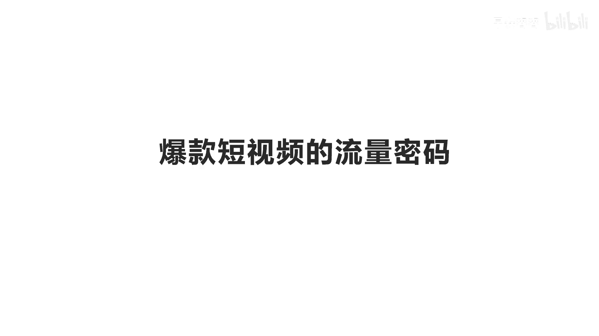
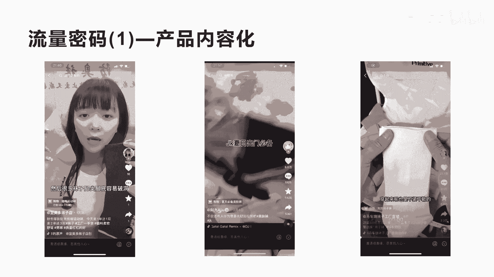
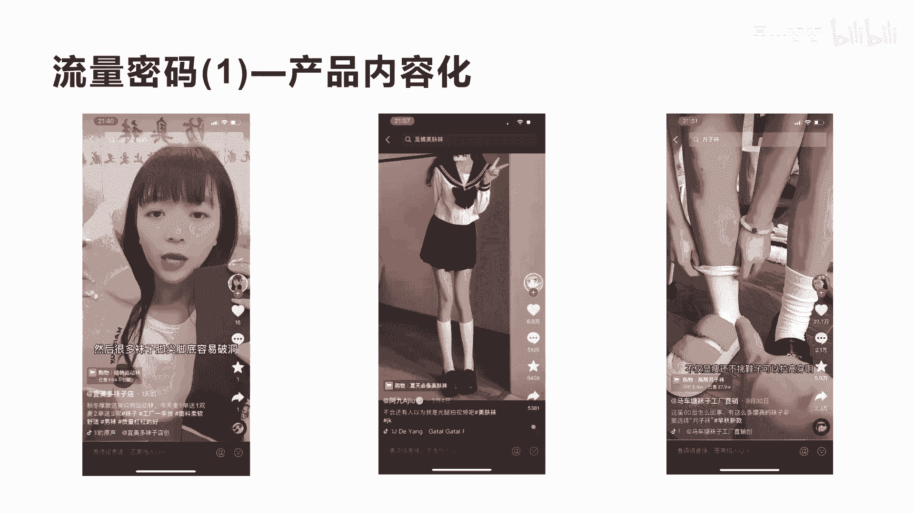
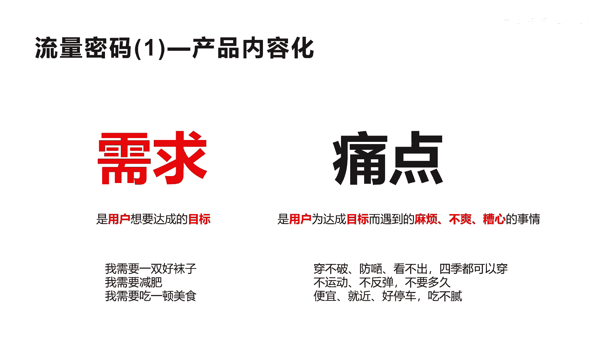

# 042 2023抖音快速起号必修课 - P33：第33节流量密码(1)—产品内容化-请收藏 - 早安睿睿 - BV1Gn4y1o7rC

好大家好，今天我们来讲一个非常非常重要的一个课程，内容，就是爆款短视频的流量密码，大家知不知道所有的短视频，其实每一个爆款就上热门的短视频，都有它相应的流量密码，所以从今天开始，我会分享非常多的。

关于抖音上热门的一些流量密码，有可能你学会这些某一个流量密码，就可以成功的让你的短视频带来大量的流量，那么这些流量密码呢我会分成很多个节来讲啊，有可能会更新到30个流量密码，50个流量密码。

甚至100个流量密码，所以大家如果听完流量密码，这个课程有很多都是可以实际操作，把别人的浏览密码应用到你的赛道。

和你的账号里面来，所以今天这个课程非常重要啊，好我们来先来讲什么呢，先来讲，第一个就是我们讲的非常关键的一个流量密，就是产品内容化，我为什么会讲产品内容化，是所有流量密码的核心呢。

因为抖音它就是一个多媒体的内容平台，那么这种多媒体的内容平台，你光在上面直接讲产品，卖产品去宣传产品，他是很难带来流量和播放，如果你是单独的去卖产品，你可以去拼多多和淘宝去卖，是不是，如果你在抖音卖。

因为抖音它的基因就是一个内容化平台，它是一个多媒体平台，它需要有大量的让观众可以看下去的理由，那么怎么让用户看下去的理由呢，其实很简单，就是把你的产品用外面的内容去包装一下，所以我们称为产品内容化啊。

这就是今天讲的第一个流量密码，那什么是产品路优化呢，我们来看一下第一个案例，很多铁子们问我有没有秋冬的运动，厚款的防臭棉袜，我手上这个就是啊喜欢运动跑步，汗液多的可以拍这个，我们在运动的时候。

这个袜口这里是长相机，不上下松动不卷边，然后很多袜子好，我们看完了啊，这个短视频是直接卖袜子的，挂了小黄车，它的播放量应该是非常少，16个点赞，一个收藏和一个转发啊。

你会发现有很多人其实在抖音卖自己的产品，不管是卖袜子也还是还是卖别的产品，都会这样去讲，这个还算好啊，他会人物出镜，有些人人物不出镜，拉着产品在那里，巴拉巴拉讲卖产品，你说这种你怎么可能有流量。

怎么可能有流量，这双袜子在任何地方难道找不到吗，是不是啊，我们现在在淘宝也好，在拼多多也好，还是在京东也好，你去购物这种棉袜是吧，大量的比它品质高，价格性价比高的多的是。

而且它整个内容没有让你有很强的欲望，去购买的理由，这也是核心，整个短视频我跟大家讲，核心在于情绪化的设计，短视频就是我们讲的内容的载体，是不是如果你也想让用户购买下单。

你必须要有相应的内容去设计你的情绪，激发观众的购买兴趣，然我如果大家理解，我们来看第二个短视频，就中间这个短视频，他的短视频的点赞数是6万，他的转发和收藏以及他评论数都有5000多。

说明这个短视频的流量其实蛮高的，他也挂了小黄车，也是卖袜子的，我们来看他怎么卖的。

JK夏日出门必备，一定是美肤袜啦，这是室内光穿了和没穿的对比，上腿一键磨皮穿，出门也不用害怕，勾丝不会反光，还可以防晒，超级自然，就跟光腿一样，我们来看完了这个短视频。

你会发现这个短视频对你的感觉会非常有什么，有兴趣看下去，这也是为什么会，第一个短视频没有我们讲的兴趣，而第二个短视频它的内容化，真正用产品内容化，内容化是什么意思，我刚才讲有很多元素啊。

第一个我们讲背景音乐是不是画面感，然后呢呃有产品之间的对比，有产品的体验，有产品的场景等等，这组合出来才成为我们真正讲的产品的内容化，而不是你拉一个产品直接在那里讲，这个产品是什么功效，大家理不理解。

我跟着大家讲的这个产品内化的特点，产品内容化，我刚才还强调一遍音乐产品的对比，产品的体验，产品的使用场景，这些都是属于内容化，而这个短视频都用到了，我们来看一下出门带定，首先他会讲诶。

产品适合于在夏天的一个什么都可以穿的袜子，是讲产品的一个痛点啊，一个一个很重要的痛，夏天我到底需要穿什么，他可以明确的用户是夏天我要穿这个袜子的，用户，想可以去买的是美肤袜啦，这是室内光。

第二个他做了一个对比，室内光她穿了袜子有些跟没穿一样的是吧，他的产品的一个使用场景，穿了和没穿了对比，上腿一键磨皮，看出门也不用害，这个也是讲的一个呃使用的体验，他用手去刮擦自己穿过的这个袜子。

发现没有被勾，有勾丝的感觉是吧，这个产品体验爱看公丝不会反光，还可以防晒，而且这里还讲了它可以防晒是吧，也是讲的一个一个一个他的痛点，高级自然就跟光腿一样，所以他的短视频不是很长不是很长。

但是它带来的流量和转化非常高，这就是讲的怎么去输出你的产品内容化，产品内容化非常关键，我们再看看第三个好吧，我们再看第三个，第三个案例，我的一个月子袜居然被零零后买爆了，你们知道是一种好。

我们先来看这个第一句话，我的一个月子袜竟然被零零后买爆了，首先他这里第一句话，其实就锁定了用户和让用户停留，有期待看下去的理由，他首先面对的用户就是零零后，是不是第二个他面向的用户群体就是月租二。

第三个，很多观众在看他这个内容的时候，第一会想到什么，会想到他可能会在讲一个故事，而且这个故事可能会让我很好奇是吧，我去看下去，所以你会发现其实做短视频带货，他有两个维度的考核，第一个是你的内容的数据。

就是我们讲的诶，你不挂小黄车，你的内容的数据，第二个是你挂了小黄车之后，你的产品转化的数据，这两个维度的考核，所以挂小黄车的短视频啊，有很多有很多的播放量，有很多次挂了小黄车就没有流量的。

原因就是两个指标考核你都不合格，一个讲这个内容没有很多人愿意看完，所以它会存在一个呃内容的数据不好，第二个是我们讲的就是你的转化不行啊，这个小黄车没人买，没人点击，那么就会导致你的啊转化数据不行。

他就不会继续给你推流，而这个短视频你看到他27。7万的点赞，这个27。7万的点赞，既然一般可以给他带来将近呃，至少是5000万到8000万的一个播放量非常大，而且他的收藏数达到了5。9和，转发达到2。

3万，他的评论数也2。1万，为什么评论数会有那么高呢，我会在后面给大家讲，首先他开头这句话，其实就是以相应的故事方式引导你们停留下来，把他整个短视频看完，什么样的体验嘛，就是这个袜子啊。

本来是给那种生完小孩坐月子的女孩子穿的，因为她这个含棉量高，面料柔软舒服，穿起来呢也是不紧胖，这个地方你看到没有，他讲到中间的时候，他还是也会讲产品的功效，但是他会在什么在中间去讲，如果他开头讲这个话。

绝对没有这么大量，很多人就划走了，大家理不理我讲的意思，所以内容化一定是说，而不是说你不讲产品功效，不讲产品痛点，而是在什么时间内，很顺其自然的去植入你的产品的啊，一个讲解非常关键啊，勒的也不会掉下来。

然后他这个袜筒是比较高的，因为坐月子的人，他要保暖了，结果也不知道是哪几个零，零后突然发现这个袜子穿起来特别好搭，然后她还不仅自己买，她还艾特自己的姐妹，一起来，有这么多好看的袜子，不买。

她非要买月子袜，也真的会谢，不过这袜子确实还可以，不仅显瘦，还不挑鞋子，可以拉高穿啊，看这个短视频也用到场景体验，是不是，虽然而且他这个场景体验很有意思，他是自己的一个男士的一个一个角来试月子袜。

就形成了一个反差，这个反差会让更多的人觉得这个很搞笑，这个地方其实他就设计了一个槽点，就让更多的观众去吐槽，在评论区去讲，哇，你这个月子袜穿到男士的这个脚上，还这么这么好是吧，这个男士在穿这个月子袜。

而且一个脚用月子鞋是吧，应该用用一个皮鞋，是不是，这样就让很多人有这个想吐槽的这种感觉，我跟大家讲，所有的短视视频其实上热门有一个核心的观点，诶，你的你的视频的五秒完播率，和你整体完播率都数据不错。

但是并不一定会上热门，但是如果你的评论数很大，你一定会上热门，所以你在短视频的过程中，如果能制造更多的这种槽点，你是很容易让抖音助推你上热门，介绍产品的时候和讲内容的时候，怎么去制造自己的一些槽点。

非常关键好吧，所以你看整个短视频，他其实你会看上去很新，很自然，但实际上它都是经过他精心设计的，从开头的五秒到中间产品的讲解，以及到后面的这个呃产品的这个体验，都是一个一个经过设计的。

所以任何一个短视频都不是无冤无无故的火，而是经过相应的设计才真正火的，所以你们一定要发短视频，不要轻而易举的去乱发啊，一定要经过设计好，这就是我们讲的产品，内容化的三个作品的一个对比。

那怎么到底怎么去做产品内容方，我再给大家做个总结啊，内容化一定是多媒体的，第一个我们讲就是我们讲的这个有音乐，有背景是吧，有产品的对比，有人群痛点的讲解，有相关的故事的发生等等，这都属于内容。

而内容不仅仅是拉着一个产品在那里，巴拉巴拉去讲，那不叫讲内容，那叫广告，是不是那叫推销，所以如果你是第一种这个短视频来讲的，你肯定不会有流量，那么如果你把它把它轻松娱乐化一点，把它变成一种内容形态。

那它可能就会带来更大的效果，用故事的方式，用体验的方式，用对比的方式，用这种相关的人群痛点的一展示啊，这都属于我们讲的内容化，那痛点和需求，就是我们成为内容化的一个核心了。

我们来看一下真正的内容化的痛点和需求。

到底应该怎么去设计呢，因为我们的内容化里面需要有痛点，需要挖掘用户的需求和痛点，那什么是需求呢，其实需求就是我们讲的是，用户想要达成的目标啊，这就是需求，等下我们来讲啊，什么叫用户所要达到的目标。

那痛点是什么，痛点就是我们用户为了达到这个目标，所遇到的麻烦不爽，糟心的事情等等，这些就成为了痛点，那我们举个例子，比如说我想要一双袜子，我想要一双好的袜子，这是我想用户所需要的一个目标是吧。

呃我想需要减肥啊，我想需要吃一种美食，这都是用户所要达成的一个目标是吧，他的需求，这就是他的需求，那为了这个需求，他可能再要一双袜子和减肥和吃美食的过程中，他会遇到一些麻烦不爽是吧，那怎么去挖掘呢。

其实我想要一双好的袜子，我要知道他在达到这个目标的时候，他会遇到一些麻烦，一些不爽是吧，一些糟心的事情，比如说穿破，那我就让你穿不破，比如说可不可以防晒，我让你可以防晒，比如穿了袜子和没穿一样。

会让你看不出，比如说这个袜子只能夏季穿，我能不能四季都穿呢，所以整个这四个点就达到了用户相应的痛点，大家理不理解这个意思了，比如说我们在讲减肥，那我很想减肥，我需要减肥这个目标，那在这个目标过程中。

我会遇到不爽啊，遇到麻烦啊，是不是，那什么麻烦呢，什么不爽呢，因为减肥需要运动，我不想运动，我很懒，是不是，而且减肥完之后会反弹，我的产品能不能让你不反弹，而且有很多人减肥呢还需要很久，两三个月。

四五个月，我想很快能让你减肥的达到这个目标，这就是我们讲的在减肥的过程中，你遇到的麻烦不爽和糟心的事情是吧，哎我用我的产品给你解决，并且产生对比啊，别人的产品是什么，我的产品是什么。

哎我的产品的体验结果是什么啊，包括我们吃一顿美食，也是我们在很多看到团购达人带带货啊，团购达人在带美食的这个呃视频的时候，你会发现他其实就讲到嗯，你很想吃这个美食，没问题，我这个美食第一个很便宜。

第二个就在你附近不远很方便，第三个它好停车，是不是它不会让你诶开车过来没地方停，对吧啊，或者还免停车票，是不是第四个就吃不腻，哎你吃完这一顿不会感觉很腻，他下次还想来吃等等。

这些相关的用户想要吃美食的这个过程中，所遇到的麻烦不爽，这就是讲的真正的痛点，你只有挖掘出用户的痛点，才能构建你内容的核心骨干，然后我们再加上一些音乐，加上一些场景，加上一些体验，加上一些故事。

这就形成了你的产品内容化，我不知道大家听懂了没有，所以整个产品内容化是你做抖音来进行营销，和进行带货，以及做更大流量非常重要的一个流量密码，好吧，今天我们就讲到这个，后面我们还会讲什么样的内容化。

怎么样的内容化。

后面第二个第三个，第四个都会讲内容化的流量密码好。