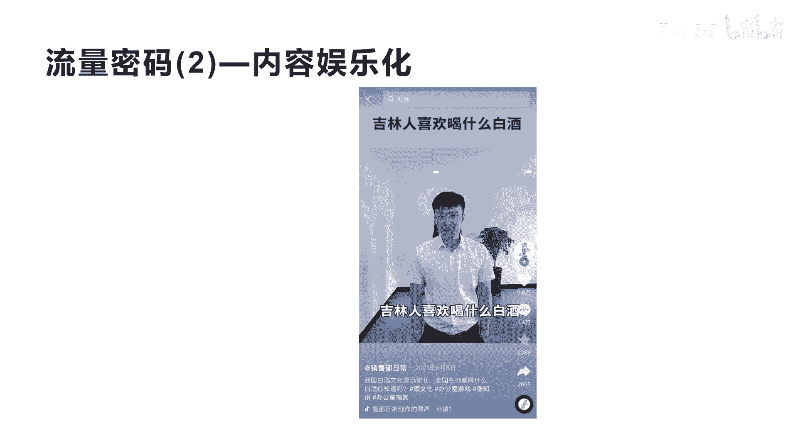
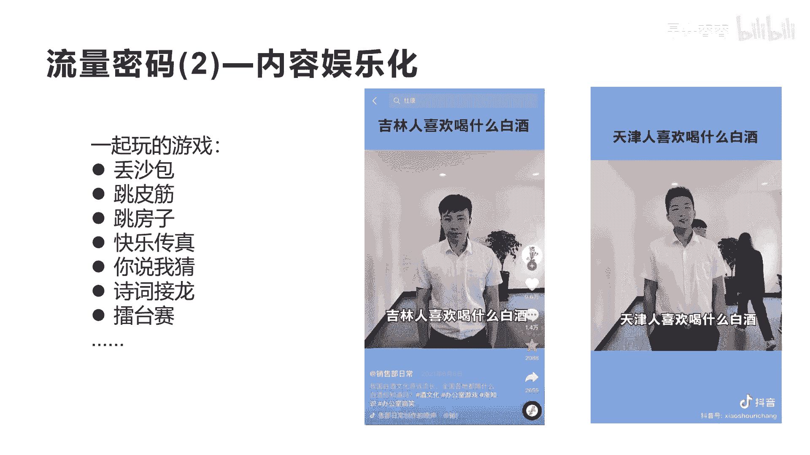
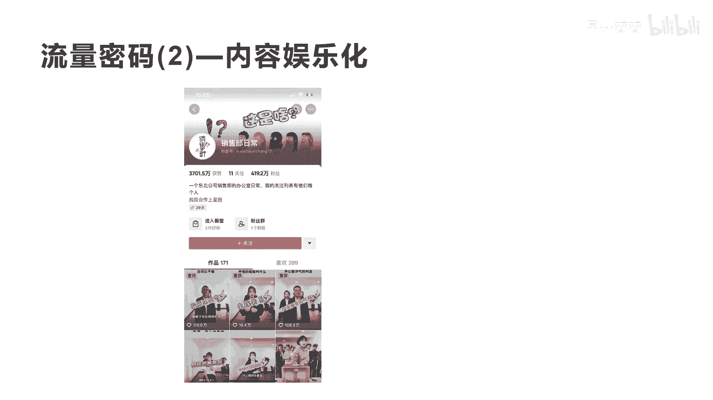
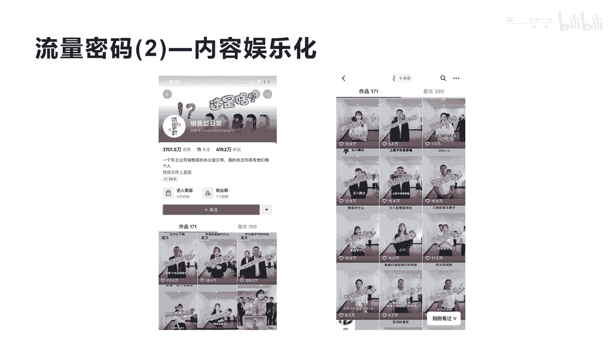

# 042 2023抖音快速起号必修课 - P34：第34节流量密码(2)—内容娱乐化-请收藏 - 早安睿睿 - BV1Gn4y1o7rC

我们今天来学习一下第二个流量密码啊，上一个我们讲的流量密码叫产品内容化，那怎么去内容化呢，今天我们要讲的第二个流量密码叫内容娱乐化，内容娱乐化呢，今天我们讲一个案例啊。

你听完你应该就知道什么叫内容娱乐化，这个短视频，它是讲一个吉林人喜欢喝什么样的白酒，的一个知识分享的内容啊，这个短视频的点赞数啊，首先是9。6万，他的评论数是1。4万。

他的转发大家都看到了2000多是吧啊，他的9。6万的播放点赞率，基本上可以达到将近1000万到2000万的，一个流量体，一个流量体，那他为什么会用这种方式带来这么大的流量呢。

我们来看他的真挚的视频内容啊，吉林人喜欢喝什么白酒，吉林人当然是喝榆树钱了，榆树钱刀白凤，河南人喜欢喝什么白酒，河南人不理你，不说简单吗，我一人玩呢，河南人喜欢喝杜康可以解忧，山西人喜欢喝什么白酒。

山西山西哎，山西山红酒，东北天津人喜欢喝什么白酒好，我们看完了，大概就是这个意思，就整个这个这个短视频它还蛮长啊，他会有这么多点赞率，也是因为就是我们讲的，他把整个短视频设计的娱乐化来讲知识。

所以你会发现用娱乐化的方式，就符合抖音内容的基因，抖音的人大家都知道都是跑的娱乐消遣时间的，我不喜欢看很多人跟我讲解这些什么哎，喝白酒的相关的知识，我只想知道，用轻松的方式来体验别人给我传授的知识。

所以他的整个的视频会让观众产生很轻松的，很放松的这种心态，把整个短视频看完，既学到知识，也觉得好像很搞笑，是不是诶让自己消遣，所以你会发现这种模式的这种，我们就是讲叫内容娱乐化，其实他这里能用到一个。

我们经常小时候，或者是在很多单位用过的一种方式，叫排队答题的一种游戏方式，就是多人的一个游戏方式，多个人一起来玩一场答题的游戏，所以这种游戏呢会让这种整个内容哎，产生娱乐化，产生很放松的感觉啊。

那这种方式其实还有别的没有有，我们其实小时候一起玩的这种游戏很多啊，像丢沙包，跳皮筋，跳房子，还有快乐传真，我不知道大家听没看没看过，原来湖南卫视的一个节目，快乐传真也是讲知识传递的。

还有你说我猜是不是包括诗词接龙，包括擂台赛等等，这些都是属于游戏，而且有很多是属于这种知识加游戏的方式，去传递，这些游戏都可以成为一个一个的流量密码，也就是我们讲的内容娱乐化是吧。

而且我跟大家讲一个核心，你只要玩懂一个游戏，内容化，就是一内容娱乐化，你就可以做爆一个短视频，你知道这个短视频的账号叫销售部，日常他就通过这一个模式，就是答题加内容的一个方式。

你知道他获得了多少的粉丝吗，我们来看一下他的账号，这个账号呢，现在目前为止是419万的粉丝啊，他总共发了170一个作品，基本上都是讲的办公室的日常，而且他用的就是这个一个模式。

叫多人答题娱乐休闲模式，他这种模式你会发现全部都是非常大的流量体，你看从上我们只截了一个图啊，你会发现他第一个作品，就是13。8万的点赞，你看中间随便的都是十几万的点赞，全部是这种相应的找一个话题。

然后多个人来进行答题的一种方式啊，所以你们一定要知道这个内容的流量密码，你们可以用更多其他的形式去相应的去做啊，只是看你怎么去设计好吧，怎么去设计好，这个就是我今天要讲的这个内容，娱乐化的内容啊。

内容不长，但是我相信听完今天这个课程，你一定有非常大的深刻的一个启发。

好吧。