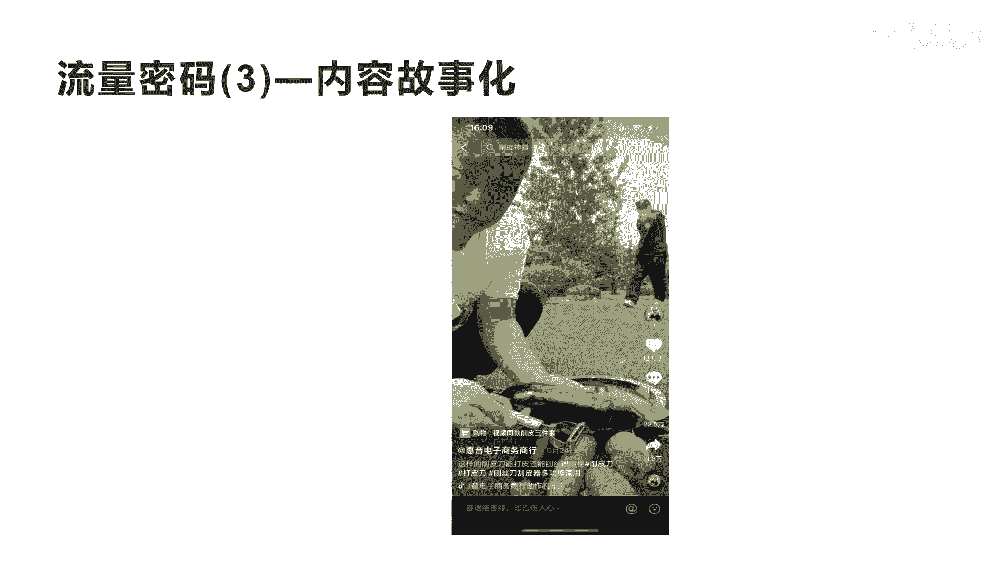
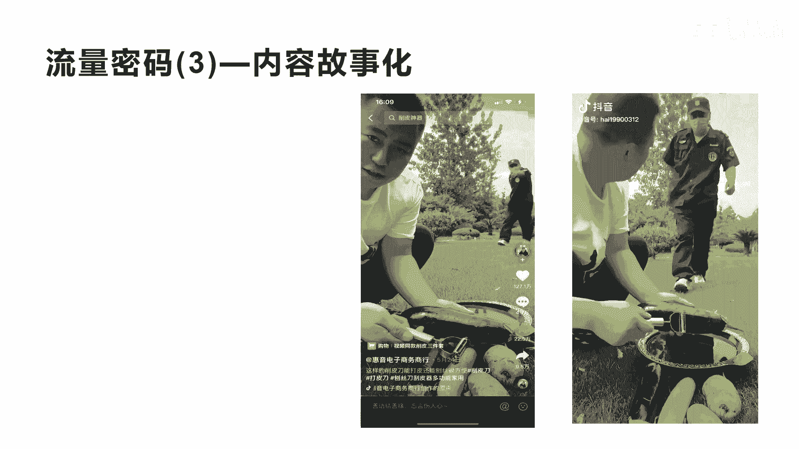
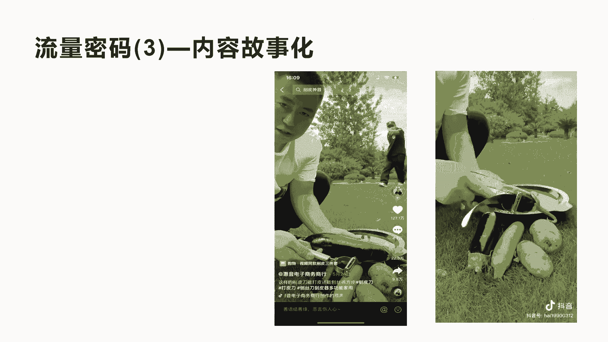
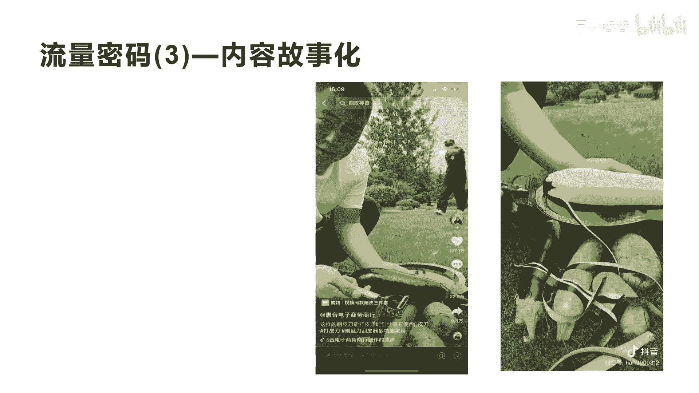
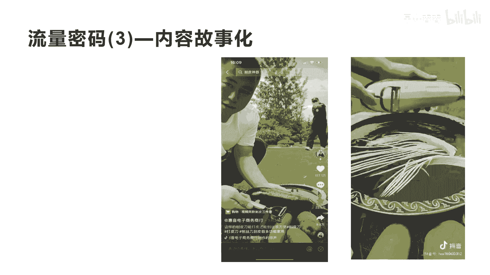
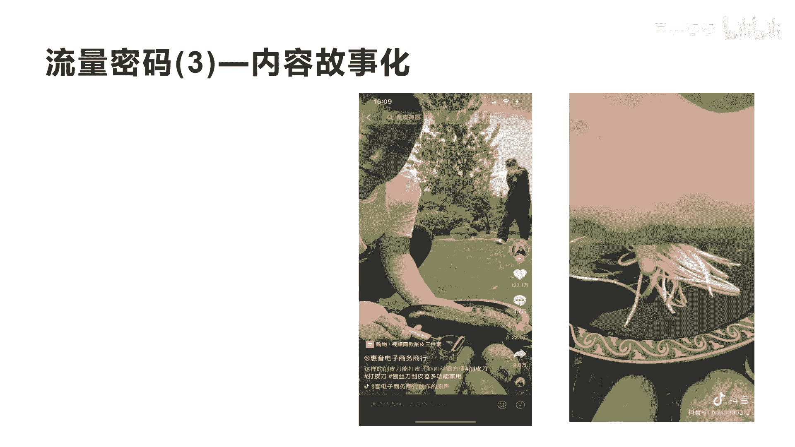
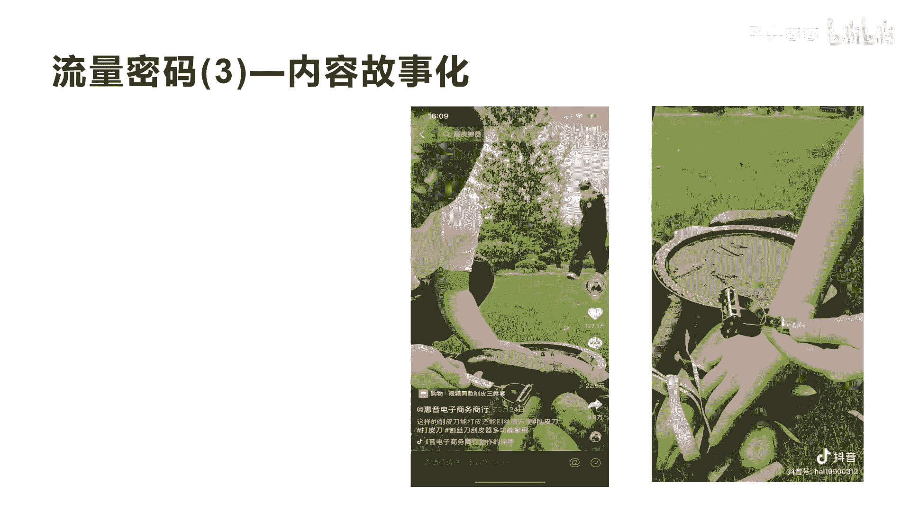
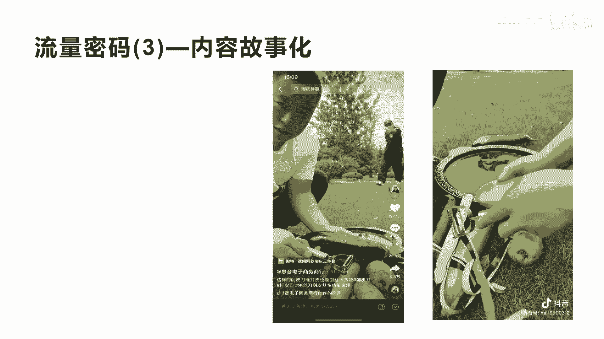
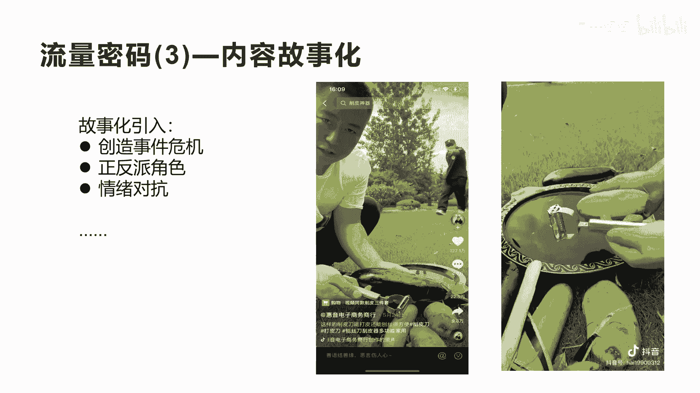

# 042 2023抖音快速起号必修课 - P35：第35节流量密码(3)—内容故事化-请收藏 - 早安睿睿 - BV1Gn4y1o7rC

好我们今天来讲第三个流量密码叫内容故事化，为什么讲讲这个啊，前面我们讲的产品内容化，内容娱乐化，今天我们要讲内容故事化，内容怎么去故事化呢，你看这个短视频，挂了小黄车，是不是他的点赞数是127。1万。

非常恐怖，一个挂小黄车的，能达到127。1万的点赞，他最少是最少是8000万到一个亿的播放量，所以你会发现它的这个流量大到这么大的程度，是因为什么呢，因为他做了一个故事化的设计。

所以你看他的收藏数的吓人，收藏数达到22。5万啊，他的评论数4。7万，转发数是9。8万，非常吓人。

我们来看一下他怎么做的，来，就是这个车啊，我没告帮大哥。

我是卖这个叫皮劲了，啥用呢，咱家这削皮刀，你看一下，打平的时候，咱们往前推啊。

往回拉，能前推能回拉，想推就推，想拉就拉。

这边能打皮，这边能刨丝，咱们在家里面削个茄子丝，土豆丝，黄瓜丝儿。

往下一拉，一小堆根根啊，那还不错。

左手能用吗，左手能用，那个你慢点，大哥去好，我们先看完这一点啊，从刚才开始的这一段到现在为止，其实你们已经被经历过了什么，被他内容设计化，他的内容刚开始的时候用一段故事，这个故事是什么呢。

就是一个保安指着这个人，你在这里干什么，他好像让观众产生了一种什么，产生了一种会发生什么样的事件，这种事件可能还很严重啊，对于老百姓，对于观众来讲就喜欢看热闹，是不是诶这里有故事发生，我看他到后面。

到底这个保安会抓到他什么样的事情呢，这样他前面的五秒完播率，以及他的留住观众的这种能力就非常强了，让观众继续有期待看完这个短视频的核心，而且故事化它有个核心，就是它一定会有主角和配角。

就是正派和反派是吧，这里面的这个保安呢，实际上他对于前面来讲，他指的这个人，他实际上是想抓现行是吧，真正的主角其实不是保安，真正的主角是这个刮皮刀的这个这个人是吧，所以它会产生我们讲的叫对抗啊，对抗的。

因为任何故事的主角跟反派，或者正反跟反派之间的这种对抗对抗的越激烈，这个故事越精彩，这个电视剧越好看，这也是为什么他的播放量会这么好，我一直从前面我就讲过任何一个短视频，特别是直播带货短视频。

带货的这个短视频，它考核的是两个内容，两个数据，第一个数据是内容的数据，看的人多不多，完播率好不好是吧，点赞率，互动率的互动数据好不好，第二个就是我们讲的他的购买的转化数据。

怎么样把它看完用吗，你是左手是吧，对这边打皮的推拉都行。

哎你翻过来包丝对好，看到这里其实有很多人，你会发现他这里又经过了一道，我们讲的槽点的设计，这里为什么会有槽点的设计呢，因为刚开始这个保安本来是作为一个诶，好像要发现某个问题的一个发现者。

是不是他是个发现者，但是到这个时候，此时此刻他已经变成了一个什么，变成一个参与者啊，他参与了我们相应的这个产品的体验，他允许了这种事情的发生是吧，刚开始他不允许哎，你在干什么好吧。

哎产生一种这种不允许反抗，反对他的这个意见，但是到后面他到此时此刻，他已经变成一个参与者，所以这里他设计了一个槽点啊，这个槽点让他的评论数啊暴增暴增额，而且这个地方就是我们通常讲的叫反转啊。

角色的反转啊，从刚开始作为一个指责的一个对象啊，到现在变成一个参与它一起来体验这个产品，是不是这里面包括了我们刚才讲的内容，故事化的开头，加上真中间的一种产品体验，包括啊在现在此时此刻的角色故事。

角色的一个反转，所以会让更多的观众产生情绪的调动啊，情绪一调动整个评论区这就炸了，评论区一炸，整个短视频的内容数据就非常好，而且他这个短视频的呃，带货的产品确确实实也非常不错是吧。

而且是九块九三件套的一个削皮刀，功效也很特别，所以它的转化数据也非常好，这就是我们讲的，为什么他会那127万的点赞的核心，那我们再看一下，就是内容故事化的核心几个点，我给大家总结一下。

第一个你在做内容故事化的引入的时候，一定要制造事件危机，这是讲的核心啊，就是你在做故事化前期引入，跟你产品结合的时候，你一定要做制造一些事件的危机感，让观众产生一种好奇，和产生一种想看热闹的感觉。

这种危机感就必须要有对抗啊，对抗就是我们第二个讲的叫正反派角色要出现，第三个就是情绪的对抗，这种对抗的情绪一定在你的短视频的前期，在故事里面要产生，如果没有产生对抗的情绪，没有正派和反派。

他就没办法产生我们讲的事件，而且没有产生危机感，这就是我们讲的，如果你搞懂了这个短视频，前期的三个核心关键点，你也可以通过这种方式去相应的内容故事化，这种内容故事化，你可以把你的产品放在某个场景里面。

让他产生另外一个主角和反派的，一个这样的角色，在你的短视频内容里面，并且产生一种情绪的对抗好，这就会产生大量的流量，好我不知道大家听没听没听清楚啊，听没听清，这个案例其实非常有说服力，非常有说服力。

好今天的流量密码，第三个就讲到这里，希望通过简短的这些内容的展示和内容提炼，能让你瞬间有启发，然后通过这个启发去应用到你。

拍摄短视频的过程中。