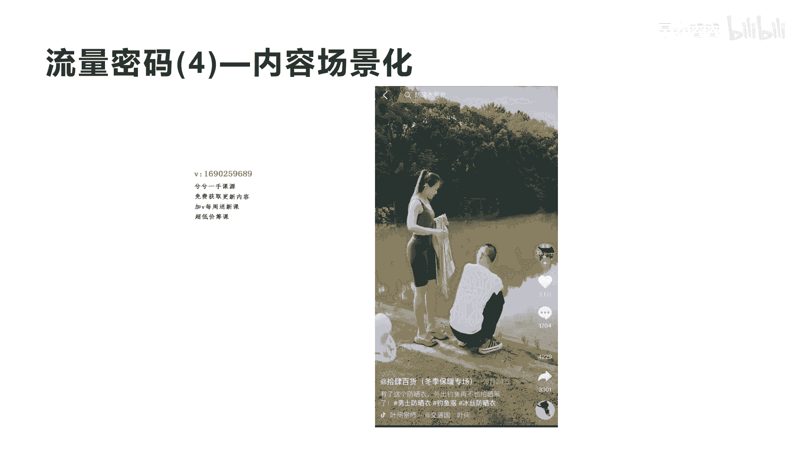
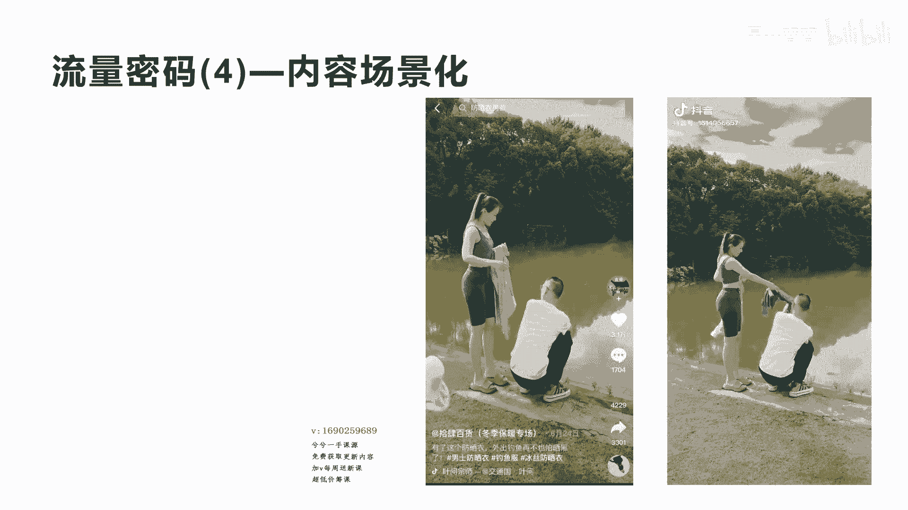
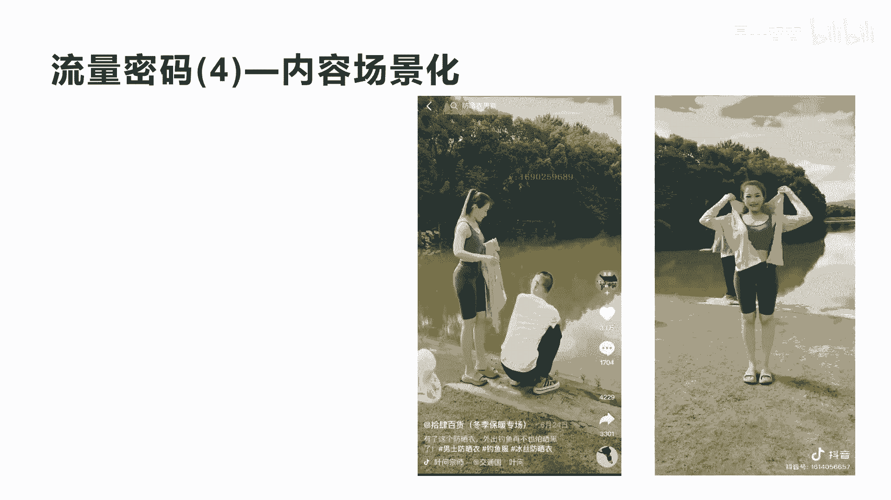
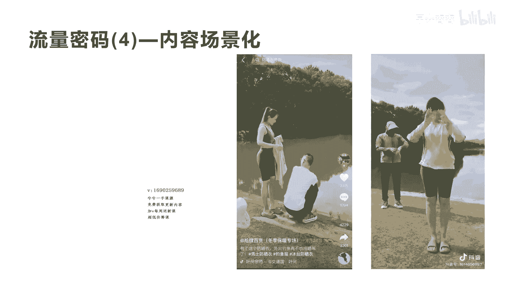
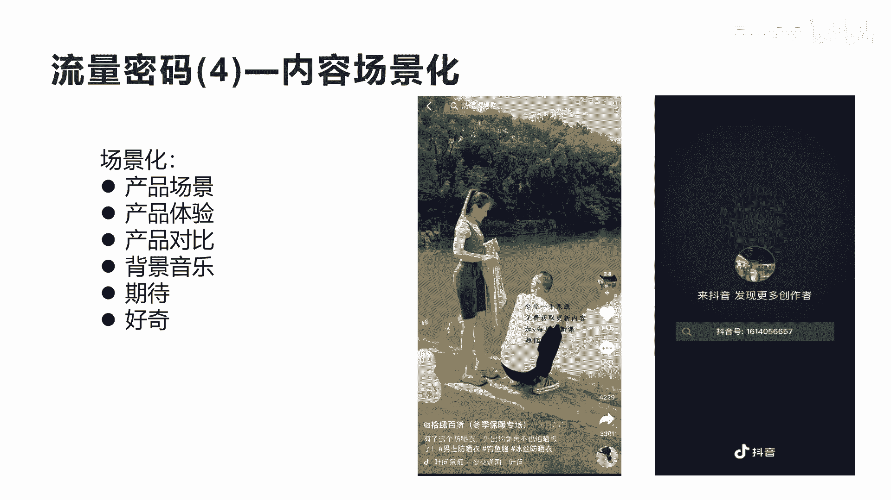
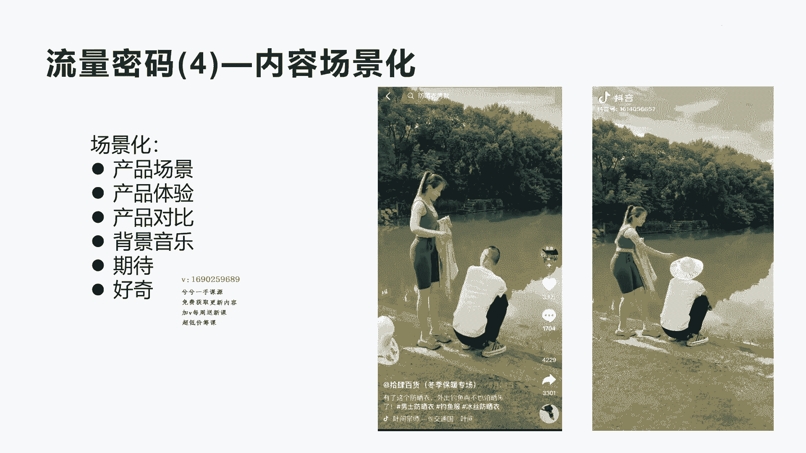
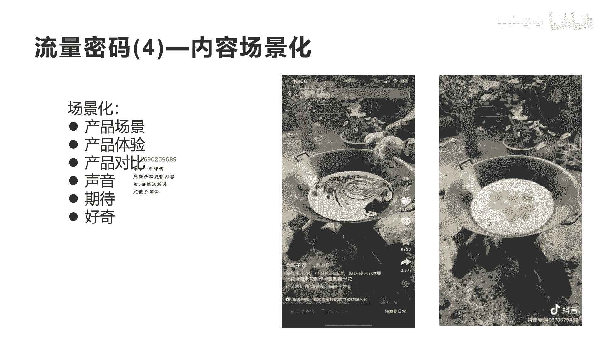
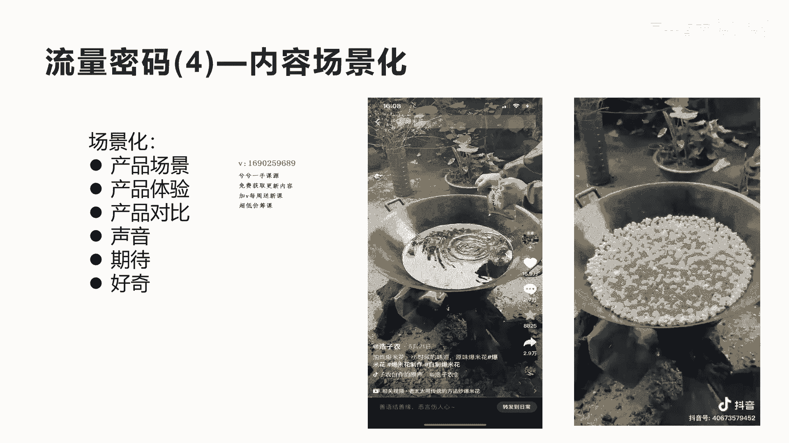
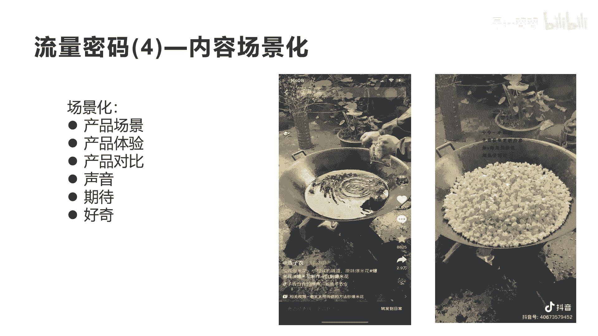

# 042 2023抖音快速起号必修课 - P36：第36节流量密码(4)—内容场景化-请收藏 - 早安睿睿 - BV1Gn4y1o7rC

好今天我们来讲流量密码四，内容场景化，那什么是内容场景化呢，我们还是来看一个案例啊，这个案例呢我们看一下，这个是一个卖防晒衣的一个视频，他的点赞率是3。1万啊，转发评论和收藏数据都还不错。

那他是怎么来做内容场景化呢，我们看一下他的视频啊。

大家感受一下，一步一拳功夫意念秒转身。

靠酒曲中仙敲准熟记。

方得真，徒手相搏，风中游，骏马将手拳亦宠用，那标志真的控若有他。

大家看完了啊，这个场景你会感受到就是哎整个他是在卖什么，卖防晒衣，但是这个防晒衣呢他用了一个在户外啊，一个鱼塘边的一个场景，体现出整个防晒衣的穿着，和它的相关的一些特点是吧，包括这个产品的功效。

所以你会发现，如果你是卖产品的，一定要找一个场景去，把你的产品在这个场景里面去展现出来，这样才会让用户有身临其境的感觉，那么这种场景的话我们就要注意几个点啊，第一把你的产品所使用的这个场景。

去找到这一个这样的场景，在这个场景里面去掩饰，去演示和体验出这个场景，防晒服他一定会是在户外，他不可能在户内，是不是，你不可能在户内去找一个这样的场景去拍，就没有那种感觉了，而且防晒服啊它一定是什么。

它一定是在很大的太阳下面啊，有日光的情况下，它可以体现出它防晒服的这个功效是不是好，我们看到第二个就是他一定要有产品的体验，第一个是产品的场景，第二个是产品的体验，第三个是什么呢，我们再看一下。

刚才可能还没看到，发现这个问题。

再看一下，你看他刚开始的时候，实际上是怎么做产品对比的，就是我们讲的第三点叫产品的对比，这个图片的第二秒，第三秒的时候，他其实就把这个男士的上面戴的，这个草帽给摘下来，这个其实就是在暗示观众。

他在做一个非常明显的一个对比啊，草帽怎么可能跟防晒衣来比呢，所以他老婆把他的帽子一摘掉，这个就形成了产品的对比的开始，再加上呢第四点就是我们整个这个短视频，你会感觉很欢快是吧，这种音乐很舒服。

也会刺激用户对于这个短视频的停留啊，所以反五秒完播率和它的整体完播率，就会比较高，所以你会发现他这个整体的短视频，3。1万将近，可能会带来200万到300万的一个播放量啊，第五个呢就是要有一个期待感。

哎就是整个画面让你感受到诶非常新奇特，让我想把这个女士和这个男士所演的这个场景，我想看完，第六个呢就是我们讲还是有好奇感，他刚开始一进入这个画面的时候，观众有很多人都不知道他在干什么，是不是啊。

所以他用这种啊场景的布局，这个男士面对的这个胡，然后女士去摘她的这个帽子，实际上让前三秒五秒的人都其实很难，看得出他们是在推销产品，大家理不理解我这样的意思，会好奇感，在构建场景的时候，一定要想清楚。

前面的3~5秒确实非常重要，前面我们也讲到很多内容的娱乐化，内容故事化，包括我们产品内容化，怎么做到前面的3~5秒能抓住用户停留，非常非常关键，他这里其实用到了我们讲的场景，用到了体验，用到的对比。

用到了音乐，也用到了我们讲的好奇和期待的这个元素，所以整个让这个短视频推上了热门。

我们来再看另外一个场景化，这是一个卖什么呢，他是一个在演这个爆米花哎，用油炸爆米花啊，他其实也是用到了我们刚才讲的这啊五大元素，我们来看一下他的视频，你看他这里就用了一个场景是吧，搭建好了一个呃。

一般人想不到的一个大油锅是吧，然后呢呃用柴火去烧火，好奇感是吧，但而且会让你有期待感，这么好奇的一个场景，诶，他后面会发生什么呢，它放进去的这个东西，这个爆米花以后会发生什么样的变化呢。

好整个这个场景会让你期待有好奇感，最后我们加上啊所谓的体验，看完诶，这个时候你会发现，他为什么会在这个锅上面敲三声呢，为什么他其实是在暗示观众，等一等后续的内容更精彩。

所以他这个敲三下的这个声音非常关键，这也让观众有了更多的期待感，其实很多观众被他暗示了，哎，敲三下就告诉你，等一等，后面还会有更精彩的内容啊，所以观众就会把完播率做的更高。

所以你看他的这个点赞率是19点，16。9万的点赞率，评论是2。7万是吧，然后转发2。9万非常高了啊，非常高了，一个这样的普普通通的一个场景，我们把它看完。

哈哈哈好，最后呢你会发现这个爆米花，在这个大的这个锅子里面炸出来，像一朵花一样的爆米花，非常漂亮，也非常让你觉得好奇是吧，哎这种期待感被满足了，所以他点赞和关注和转化非常高。

这也就是我们讲的真正的场景化，为什么会出现这么好的一个效果呢，也是因为这个场景呢，它让更多的人，还有一种就是怀旧的和反差的一种感觉，是吧啊，就是让很多人感觉诶这个好像是我小时候诶，父母也用这个柴火。

用个大锅子在煮这个爆米花啊，有怀旧的感觉，所以他的评论区又炸了评论区，2。7万的这个评论，很多人会看到这种煮爆米花的方式，跟现在我们用微波炉去炸爆米花呃，有很多不一样啊，这种反差的场景你在构建的时候。

它其实是自带流量的，所以我们在做内容，做短视频的时候，除了我们讲的文案，除了故事，除了娱乐，其实直接用场景的构建，也是可以打造出流量爆款的。

