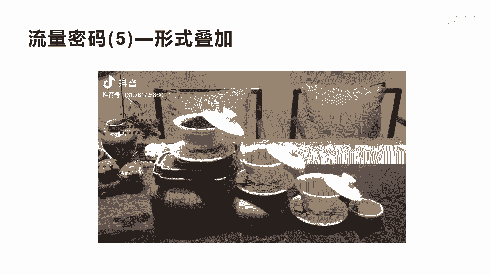
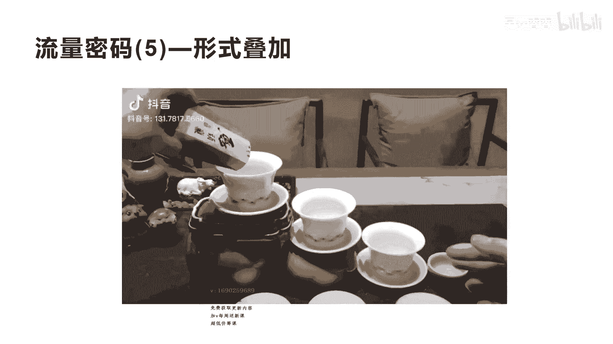
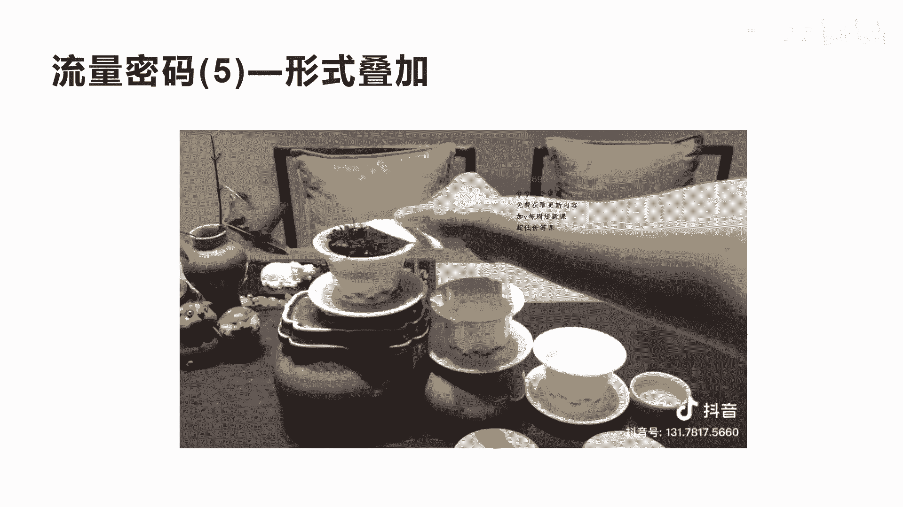
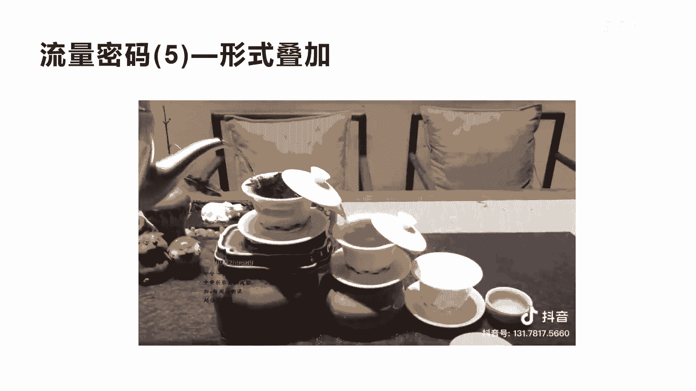
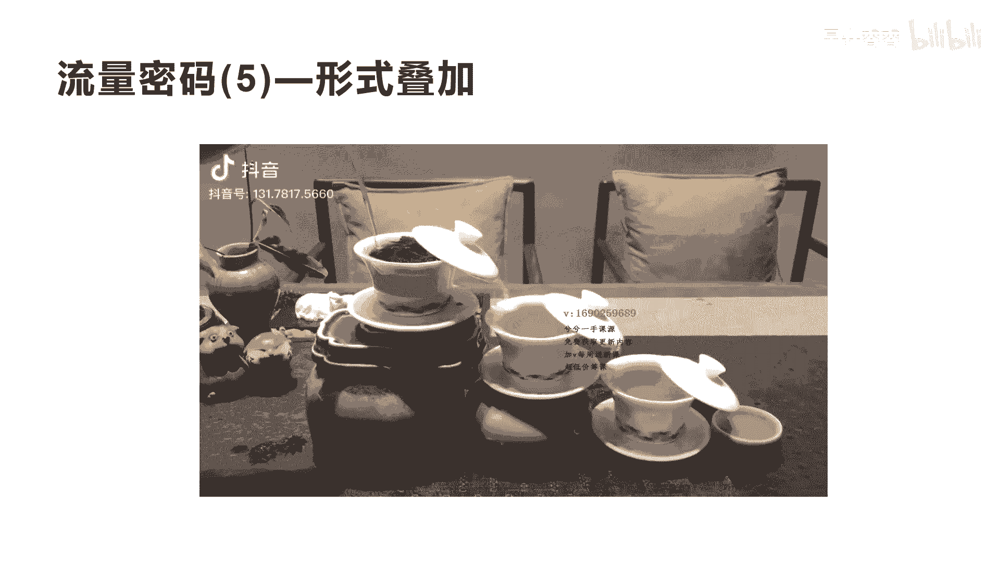
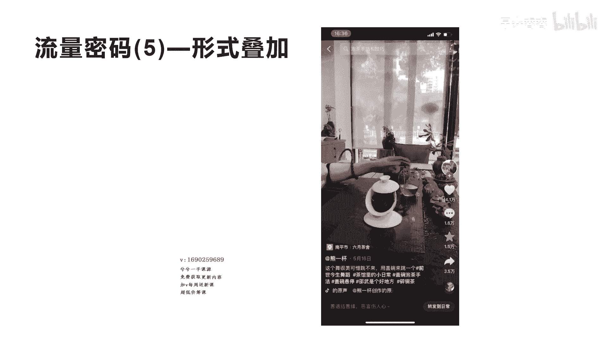
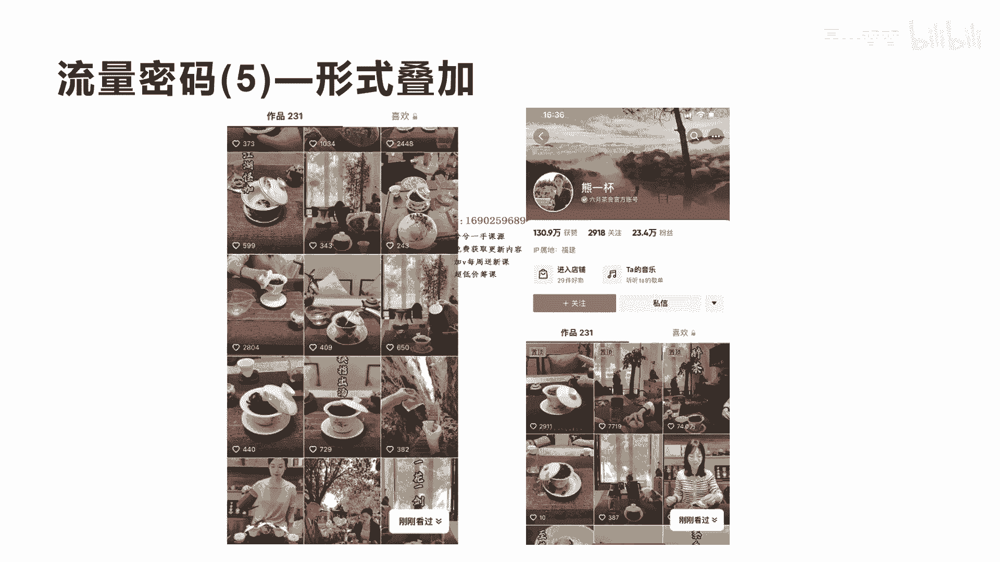

# 042 2023抖音快速起号必修课 - P37：第37节流量密码(5)—形式叠加-请收藏 - 早安睿睿 - BV1Gn4y1o7rC

好今天我们来讲流量密码五啊，叫形式叠加，形式叠加是什么意思呢，其实我们在前面几场流量密码里面都提到过，就是啊内容的娱乐化，内容的故事化和内容的场景化，那么这些流量密码呢。

有很多都是可以独立的去形成读流量密码，其实这三种形式呢可以把它进行形式的叠加。

我们来看一下这个视频啊，呜啦啦。

好我们看完了，其实你会发现整个这个短视频，它其实除了我们讲的场景化，它是个做茶的，是不是啊是一个做茶叶的，他在演绎着茶叶怎么去泡，把这个茶道给大家演示出来，但实际上在这个啊场景化的这个内容里面呢。

他其实把它组成了三个杯子，然后呢用这种哎高山流水的这种方式，让它流下来，一层一层的流下来，形成了娱乐化，就把它变成了一种娱乐形式，而原来我们说如果仅仅只是在这里介绍茶道诶，你会觉得很枯燥是吧。

这种视频没什么很很很好看，留不住人，而这个时候你会发现它进行了场景化，加上娱乐化的方式，这样让整个视频就更加有生动感啊，所以你们在做任何的这种产品的时候，一定要发现用你的场景去叠加一些好玩的形式。

可以增加更多的内容的趣味性，这种趣味性的，其实可以让视频获得更多的观众的停留，也就是我们讲的获得更多的流量，其实前面的内容场景化，内容故事化和内容娱乐化里面，其实也提到了这一点。

他们之间的视频都互相的叠加，我们在前面看到那个刮皮刀的那个短视频，你有发现刮皮刀其实刚开始是用故事化，但是中间呢用了场景体验，是不是啊，所以他每一个这样的爆款短视频的流量密码。

其实都可以用这三种形式进行叠加使用好，除了这个茶叶的这个呃形式叠加。

我们再看一个案例，莫非前世那一夜，只为今生见一面，啊啊啊啊，苍空美梦蓝蓝天三炮好，这个视频呢，其实也是刚才那个视频的博主做的啊，他的这个视频的播放量啊，比刚才那个更高，这个达到了14。1万的点赞。

也上了一个非常大的热门啊，应该是上千万，2000到3000万的一个流量啊，他的收藏数是1。5万，评论数也1。6万呃，他的转发是3。5万啊，非常一个大热门，他这个其实也用到了刚才我们讲的呃，他的场景化。

他在掩饰自己怎么去泡茶，但是他更多的是把这种娱乐化啊，用这种茶的这种泡茶的这种娱乐化的方方式，来展现自己的短视频啊，达到了非常好的效果，但是他的背景啊的这个音乐，加上他的这个呃泡茶的这个动作啊。

包括这个节奏掌握的非常好，所以你会发现你如果要做一个呃内容场景化，你只是内容场景化，那还不够，更加的让观众停留，让观众更喜欢，而你要做到什么去叠加一些，比如说一些故事，比如说是一些娱乐啊，好玩的。

像这个视频有趣的啊等等这种内容形式，让更加的这种内容具体好。

我们看一下他这个视频，其实他的账号叫熊一杯，他是个卖杯子的啊，所以你会发现啊，一般的人卖杯子，他可能卖茶杯，他就把这个茶杯的这个呃功效啊，形状啊，产品类型做一些拍摄，然后来买了它呢做了一些内容的创新啊。

真正的内容娱乐化加上内容场景化的一个演示，也有很多人物不出镜，也有很多人物出境，他这个账号做了将近啊200多个额，短视频都是以这种形式做的，而且涨了23。4万的粉丝也很不错，是吧啊，只是一个卖杯子的。

所以你没发现你们任何人卖什么产品，一定要围绕着你的产品的场景去搭建，这样的场景体验，场景体验之后呢，在这个场景体验里面去加上一些娱乐化，加上一些故事化，这个短视频就会更容易爆好。

今天这个呃流量密码五形式叠加啊。

