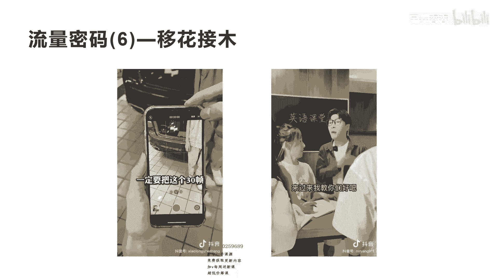

# 042 2023抖音快速起号必修课 - P38：第38节流量密码(6)—移花接木-请收藏 - 早安睿睿 - BV1Gn4y1o7rC

好今天我们来讲流量密码六，叫移花接木啊，这是涛哥取了一个名字啊，叫移花接木，那什么是移花接木呢，啊整场今天这场课程，我让大家真正的掌握这门技术啊，其实对于很多人来讲，创作短视频他是比较困难的。

就算你知道刚才我们之前讲的这些流量密码，比如说啊娱乐化啊，呃这个故事化呀，包括这个场景化，但是你自己很难得有临时的创意，就这种创意形式，你有时候我无法想到，是不是无法想到，那么怎么办呢。

其实我们就可以在抖音上面去找到一些这种，比较火的，比较热门的一些相关的形式，然后通过他们的形式和框架，移到你的相关的赛道啊，我们不叫搬运啊，我们其实可以把它称为，就是真正的叫借鉴它的框架。

然后啊通过他的这个娱乐形式和他的场景形式，然后移到你的啊产品和赛道里面来，好我们看这个视频他是怎么做的，这个短视频他其实就是前面我们其实讲到过，叫内容娱乐化很相似，他也是一个答题的一个方式，收藏数是8。

2万，他的转发是5。4万啊，所以这样一个短视频，最少带来了将近1000万到2000万的一个播放量，非常大非常大，而且他这个是一个垂直赛道讲短视频的啊。

大家可能都刷到过这个短视频，好我们来看一下这个短视频的内容，播放量卡才200。

正常吗，不正常发作品一定要添加这三个话题，通过来下一个一天发几条作品容易火啊。

十条错了啊，错了啊，上一个一天发几条作品容易滑。

肯定是20条错啦，哈哈哈哈好。

一天发几条作品容易火啊，啊不是你问的不是这个问题，哈哈哈哈哈好，我们不看完了啊，这个短视频其实跟我们呃之前看的那个叫呃，内容娱乐化里面那个关于呃卖白酒的那个内容，形式非常相似，它其实这个短视频。

就是模仿的移花接木的那个呃账号的形式，而通过把形式固定不变，而把内容和话术，以及相关的其他东西进行一些变化。

就是我们今天所讲的移花接木，我不知道大家听没听明白，这个就是我们前面讲的，叫吉林人喜欢喝什么白酒，吉林人喜欢喝什么白酒的形式，就是多人答题的一个游戏，而对于刚才这个短视频，大家看到没有。

其实跟这个非常相似，我们再看一下吉林人喜欢喝什么白酒，吉林人当然是喝榆树钱了吗，哈哈于树钱喽，还不河南人喜欢喝什么白酒，河南人你不说简单吗，哈哈哈哈好，我们不看完了，是不是跟刚才我们讲的。

把播放量卡在啊200正常吗，这个短视频两个是不是非常相似，它们区别在哪里，它们相同的在哪里，它相同的是他们的形式是非常相同的，这种形式非常受到观众的喜爱，观众对于这种形式，这种娱乐方式，这种娱乐的内容。

他会有更大的完播率啊，所以观众会更加更多的停留去看，这是核心，因为你苦巴巴干巴巴的去讲，那些比较非常干的内容，没有很多人喜欢他看，所以他更多的是先要用这种形式，把你的用户人群给扩大。

然后再让这些慢慢的留下垂直喜欢知识的人，他其实也是做一个泛娱乐的垂直，那移婚积木的核心是什么呢。

其实优化建模的核心密码，就是我们讲的A赛道的爆款密码，转移到B赛道的爆款密码，就是刚才我们讲的白酒的这个爆款，短视频的形式转移到讲短视频这个赛道的啊。

短视频最主要的是他的移花花是什么，花其实就是它的形式，它的框架，他的音乐，他的画面等等这些东西我可以不变，我把它移过来，而真正要变的要接的是什么，就是木木是什么，它的标题，他的话术。

他的文案或者他的人物的表情，这就是为什么火过的，爆过的短视频，会持续爆的一种非常重要的原理啊，因为他很多人看短视频之所以能给它做报，就是核心在于它的这个花，而这个花不变的情况下，你把他一个赛道。

其实对于很多其他观众其实没有看过这种形式，那没有看过这种形式，他就会有新鲜感，咱们有新鲜感的情况下，他就会在这个人群的赛道会进行再爆一次，这就是我跟大家讲的，为什么是A赛道的爆款，移到B赛道的爆款。

因为A爆款的这个视频，虽然让很多人已经看到了，但是他还是属于A赛道的人群，而你到B赛道的这个人群，其实有很多人没有看过这种形式，那么你要做出这种内容，你必须用它的形式而带上你这个赛道的内容，标题和文案。

好吧，这就是我今天讲的真正的核心，在于你能否找到大量的这种爆款短视频的形式，并且把这种形式应用到你的赛道啊，他一定是跨赛道，如果你是在同类的赛道会出现什么情况，他爆款的短视频基本上已经被你同类的短视频。

爆款，基本上已经被你同类人群看完了，没有什么新鲜感，那这种没有新鲜感的情况下呢，你用这种形式再去复制它的形式，就很可能不一定会爆啊，不一定会发，因为大家都看过，没有新鲜感的形式。

我不知道大家理不理解我讲的这个意思啊，所以一定是跨界去找你的这个花，而用你的木，尤其是你本赛道的mo啊去接上它啊，这就是我今天跟大家分享的这移花接木，其实在我的呃内容的那个课程里面，也讲到这一点。

这一点是做短视频非常重要的一点啊，对于普通人想做一个非常好的短视频爆款，用这种方式是，实际上对于初创者和普通人来讲是非常好的好。

我们再来看一个案例啊，你就真正搞明白了，你看这个短视频他就是跨赛道，一个是讲英语的，一个是讲短视频的。

我们看他们的形式是不是一样的，我们先来看这个短视频，你在干嘛，我在拍抖音呢。

你这样拍，拍了也是摆拍，我跟你讲啊，怎么样拍出高清的视频来，摄影师过来，首先我们在拍摄视频的时候哈。

把这个四K1定要调为高清，这样子呢拍摄出来的视频才不会被抖音给压缩，发出去才会是信息的，第二个呢一定要把这30帧好，我们不看完了，我们再看另外一个，我们都看前面的，因为后面都是讲知识干货了。

没有什么很多好看的，你是背单词吗，对啊你这样背背了也是白背呀，为什么这个单词你会读了吗，你连读都不会读，你怎么背呢，你现在连学英语最基本的基础都没有啊，那我教你三招，学完之后呢。

我可以让你快速获得一个东西叫自学技能，真的吗，肯定真的来过来，我教你们好不好，我们也不看完了，这个你发现没有，两个人都是异曲同工之效，形式都一样，但是他的文案和内容不一样而已是吧。

都是说诶你在这里干什么，指出别人犯错的问题，然后跟别人讲，诶让跟着我的方法来，我教你这个正确的方法是什么，这种开头和整个这个呃内容的结构形式，它是一模一样的，这就是我们讲的花不动。

框架和它的形式和它的结构不动啊，把这个结构和形式，包括开头和中间的这种转换的形式保留，用我们的这个行业的这个内容来替代掉它啊，包括人货场这些东西的构建啊，相应的匹配啊，这样你会发现诶一样的爆款。

通过你的改变换成不同的赛道，你也可以获，我不知道大家理不理解了，那你应该怎么去创作呢，大量的去找这种不在你这个赛道的，热门的爆款短视频，取出它们的结构，取出它们的开头短视频的内容形式。

把这种形式移到你的相关的短视频赛道，然后用你的内容和你的相关的话术去填充，这样爆款的短视频，所产生的上热门的可能性非常大。

今天我们就讲到这个流量密码六，移花接木啊，未来我讲过的所有的关于流量密码，其实都可以用移花接木的方式来做啊，后续我们做的所有的流量密码的介绍，你都可以用这种举一反三。

移花接木的方式来做你那个类目的相关的爆款，短视频啊，这是有很多这个专业的账号，都在用这种方法在做，所以今天这个短视频的内容啊，这个流量密码是对大家非常重要。

我不知道大家有没有吸取到啊。