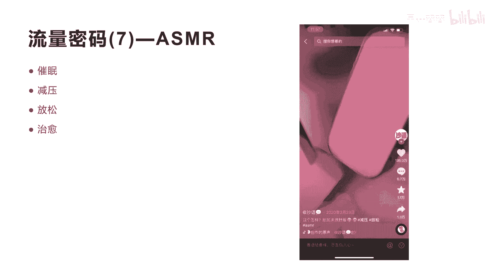

# 042 2023抖音快速起号必修课 - P39：第39节流量密码(7)—ASMR公式-请收藏 - 早安睿睿 - BV1Gn4y1o7rC

好今天我们来讲流量密码七叫S码啊，这个单词呢就是实际上是四个英文单词组合的，手写字母组合的，它其实的英文翻译就是我们讲的叫自主感应，经络反应其实俗称要叫颅内高潮，那什么是颅内高潮呢，其实它就是视觉。

听觉，触觉，味觉和嗅觉的共振，这种共振是什么呢，它其实就是一种让你很平静，很愉悦的一种感觉的方式，这种兴奋感它其实就起源于你的头部，所以由于这种刺激呢会扩展到你的脊椎，那如何触发这种感觉呢。

其实它有很多种方式啊，比如说呃大家有没有去听过这种俄语是吧，还有嘴唇，还有牙齿，还有咀嚼，包括挠痒等等啊，其实看过S码的这个视频的人，他有98%的人都是为了放松自己，催眠自己放松。

有些有些时候有些人睡不着，他可以睡助眠，它可以注明，还有一些人是为了缓解压力啊，做S码，在抖音上面有很多，大量这种S码的视频和直播间，非常火爆，非常火爆啊，因为大量的人通过抖音其实都是在想放松自己。

平时的一些工作压力，他会去看这种特意看这种AS码的视频好，那我们看一下这种SM视频到底有哪些。

他的流量密码是什么呢，我们看一个短视频啊，这个短视频你会发现他是一个播西瓜的短视频，他有将近211。7万的点赞，12。2万的啊，评论13。5万的收藏，和27。5万的转发啊，这个视频爆的不行啊。

起码是上亿的播放量，这个是上亿的播放量，这个呃账号叫蔡澜，大家都可以去关注一下，通过这个S码的短视频，他整个就涨了200多万粉丝，从今年开始做的也就几个月的时间，全部是做的S码的视频，要不就是剥西瓜。

要不就是啊这个剥鸡蛋，等下我们一个一个来看啊，我们看一下第一个这个剥西瓜。

它怎么播的啊。

好我看完了时间很短啊，但是让你感受到什么哎耳朵是吧，视觉听觉，包括这种看到这种场景的这种味觉，都让你产生了是吧，这种产生了共鸣，这就是我们讲的AS码的，一个专门做美食的一个S码的一个这样的啊。

短视频所带来的这个效果非常厉害，当然他的可能呃专业的收音器材啊，他的拍摄要求稍微也比较高啊，这收音器材有什么呢，像麦克风啊，声卡啊，包括还有一些软件来进行采集编辑啊，但是他的这个拍摄也非常关键。

你发现没有拍摄的非常精美啊，非常这个清晰高清，第二个就是他的声音，他声音里面发现没有，他全部是动作声音是吧，哎摩擦声音，动作声音，当然我怕后面会讲到他还有一些咀嚼的声音啊，第四个呢就是他不说话。

整个短视频以声音和动作和画面展现给你看，让你真正体会到一种啊这个颅内的高潮是吧，一种刺激，第五个第四个呢我们讲就是他需要有道具，你要不就剥西瓜，哎，后面我们会来看怎么剥，他就剥鸡蛋怎么剥的。

所以他一定要有道具产生这种声音，产生这种共振，好，我们来看一下这个，后面这个它也是219万的点赞，非常高是吧，这个播放量都是上亿的播放量啊。

上亿的播放量，我们来看一下这个播鸡蛋的。

哎我们停一下，你会发现他把鸡蛋剥的那一刻，是不是那个声音非常的清脆是吧，让你瞬间刺激你的耳膜啊，这就是我们讲的S码的一个特点，它是真正让你的耳膜瞬间的受到强烈的刺激，啧啧啧，哎你看这种刺激。

它会有让很多人他没办法划走，他会继续看，继续享受这种刺激。

啊嘿呀呀好，就是一个这么简单的一个短视频是吧，哎他就达到了上亿的流量啊，其实这个S码的视频呢，你说它很难吗，他也不是很难，你说它不难吗，他有一定的这个啊拍摄和一定的这个收音的啊，这个要求是吧。

他不是每个人都去都去做，当你如果去模仿，其实有很多这个相关的S码的一个制作教程啊，在抖音上面都有，而且啊这种设备也有啊，在很多地方都有的卖啊，你们都可以去买，如果想实现这种，而且这种S码呢它是一种啊。

没有应用到产品上面，后面我们会来讲应用到产品里面，他是怎么去做的，其实对于S码的，我还讲一个，就是18~23岁的左右的年轻人，其实对S码的这种治愈性的，这种吃播短视频的喜好度，喜好度是非常高的。

达到了20。8%，所以这种人群非常多啊，非常多好。

我们看一下这个S码爆款短视频的，其实他的公式我给大家总结了四个这样的公式，它分别包括道具，视觉，声音和场景四大维度，那什么是道具呢，其实就是我们刚才讲的这个，比如说西瓜鸡蛋，毛巾肥皂等等。

这都属于道具啊，那视觉是什么呢，视觉就是拍的极致的非常美好，拍的非常美，极致的美啊，声音是什么呢，声音比如说咀嚼声音，动作声音和口音啊，刚才我们看过的短视频，他的这个案例都是动作的声音是吧。

动作的那个玻璃的那个清脆的那个声音啊，动作声音当然还往后面，我们会看到很多这种关于嘴巴去吃东西的，口唇音和咀嚼的声音好，那么场景是什么呢，场景就是比如说你是在房里面，在房间里面还是在车里面。

还是在锅子里面等等这种场景，那么这整个这四个公司，就构建了S码的相关的啊，一个非常爆款短视频的一个制作方式，制作内容好，我们通过这个公式呢，我们再来看一个就是刚才讲的S码的一个呃，用香皂我们来看一下啊。

好这个短视频你会发现就那么十几秒，但是没有任何的内容，就是一个人用一把刀是吧，在这个可能是可能是香皂啊，我可能我把它认为是香皂，因为在我们的那个八大抖音变现模式里面，其中有一个变现模式。

体验销售模式里面有一个这样的啊，用那个用那个刀片去刮那个香皂，跟这个是完全一样的，那个直播间其实模仿的就是这个短视频啊，模仿了这个短视频的这种S码的这种方式，让整个人看的人会有催眠减压。

放松治愈的这种效果，就很多人停下来去去看完这个短视频，其实没有什么很好看的是吧，你会发现他还有135万的点赞，6。7万的评论哈，1。3万的转发，其实你会发现，其实看这个短视频，你说有内容吗，有效果吗。

有价值吗，没有是不是，但是它会让观众停留下来，而且有很多人会反复的听，反复的看，这就是讲的这个S码的神奇之处，那么这个短视频它的道具是什么，道具用一把刀在刮这个香皂，然后它会产生这种刮的这种声音。

还没有搭建很复杂的场景，他也不是在车里，也不是在房里面是吧，他就是一个在桌子上面去刮这个香皂，产生的这种声音啊，而且他这个颜色非常重要，所以S码有可能用的好的话，带来很大的流量。

而且还会在直播间里面用到一些这种方式，其实对于转化非常有作用，在我们的八大模式里面，大家都可以去看一下那个八大模式里面，我跟大家就讲用一个刮刀在刮香皂啊，非常非常火啊，也是用到这个S版的一个方式。

好吧好。

