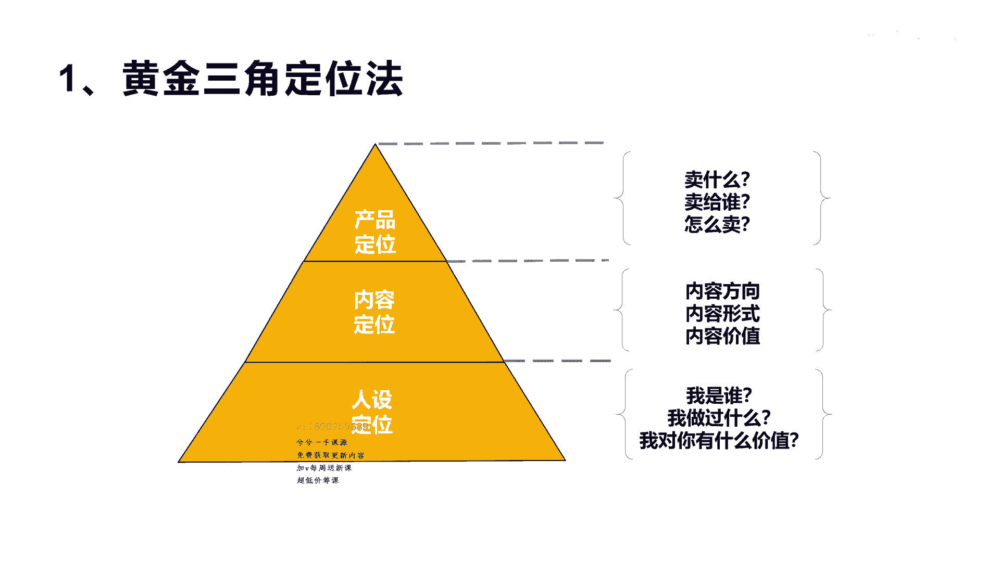
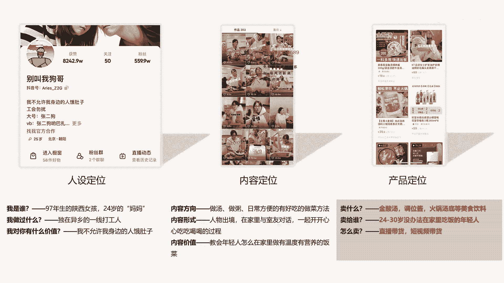

# 042 2023抖音快速起号必修课 - P3：第03节黄金三角定位法-请收藏 - 早安睿睿 - BV1Gn4y1o7rC

好大家好，今天我们来正式秋到运营这个实操的课程，今天我们看一下这个短视频创业的游戏，闯关的完整路径，我为什么说他是我游戏闯关啊，呃因为在做这个创意的时候，它实际上就像我们去玩一次游戏，它需要每一个节点。

每一个关卡去不断的去努力，去去闯关，这样才能达到最后的创业成功，或者是说打完通关，所以我们把这个整个的这个短视频创业，分为下面的这十个完整的路径，第一个我们讲就是定位，第二个就是选品，第三个是选题。

第四个是文案，包括拍摄剪辑，带货直播投反复盘啊，整个十个过程，这十个过程呢其实就已经概括了整个所有的啊，短视频创业的一个环节，那么这里面有头有尾，中间的部分和后面的部分，都代表了一些什么意思呢。

实际上对于定位来讲，它是叫定生死，没有定位牵头就不会有后面所有的东西，但是没有尾巴的复盘，你也不知道前期这些东西是否正确，或者是说调整什么东西，你搞不清是吧，所以有头有尾，这是非常关键的。

那么对于第二呢，在起完开头之后，其实对于创业这个词来讲，如果你是来创业的，一定是要变现的，那么你一定是卖产品的，这个产品有可能是服务，也有可能是别人的货，也有可能是你自己的货是吧，所以我们讲创业来讲。

你一定要最后还是要赚钱变现，而选品之后呢，我们就叫做内容的创作，内容创作我们可以分为啊，像选题文案拍摄剪辑的都属于内容创作的啊，这个部分当内容创作完了之后，就会形成我们讲的抖音。

会分配流量机制给你分配流量，完了之后通过这个流量来直播带货，也是短视频带货，然后通过带货发现这个我要提高转化率，提高货，提高这个整个的这个体量，我们就需要投放广告，投放完了之后，我们再进行循环啊。

这样就形成了整个游戏闯关的闭环，也就是我们短视频创业的整个流程，好让我们开始先讲第一个定位，定位呢我们讲定位定生死，那到底怎么去定位啊，我们有一个非常好的一个模型啊，黄金三角定位法。

这个黄金三角定位法的顶部我们叫做产品定位，它是起到什么作用呢，卖什么，卖给谁，怎么卖，这叫定位啊，那么第二个环节我们讲就是内容的定位，它叫内容的方向，内容的形式，内容的价值啊。

这就是讲的内容怎么去输出的一个方法，那么第三个就是讲的人设定位，人设定位就是我们讲的诶，我是谁，我做过什么，我对你有什么价值是吧，然后我们怎么去利好我们的人设，我们在后面也会讲。

所以整个你会发现黄金三角定位法，它不仅仅是一个定位，它实际上是立体的一个三角形的定位，这个立体的三角形定位，最底下这一部分是叫做人设定位，没有人设定位做基支撑的话，上面的内容和产品它是没有办法顶得住的。

所以我们在任何做抖音账号之前，你得想好设计好自己到底要做什么类型的人设，只有这样你才可能把人群定好，人群定好完了之后，他们喜欢看什么内容，他们想看什么内容，他们对什么内容有兴趣，然后才可能去输出内容。

最后通过输出内容之后，把你的产品跟它进行呼应，那么这个时候才可能产生销售，这就是我们讲的整个的黄金三角定位法，那么通过这个定位法，我们来看几个例子啊。

看举个例子好，我们看一下，这里有一个叫做别叫我狗哥的一个账号，这个账号呢呃他的人设定位啊，大家看一下啊，他是说我是一个97年生的陕西女孩，24岁的妈妈是吧，这是她的视频里面展现她给自己的一个定位。

那我做过什么呢，他在他写的是独在异乡的什么一线打工人啊，这是他做过的，他在打工是吧，而且在一线啊，一线打工，而不是一个很普，他是一个很普普通通的打工人，那么他对你有什么价值呢。

他说我不允许我身边的人饿肚子哎，这个slog直接给他定了位，他就是告诉你，我可以让你什么不饿肚子啊，这就是他整个人设的一个定位，那么他的内容定位呢，因为我们看一下他的内容方向，做汤做粥，日常方便的。

有吃有好吃的做菜的方法啊，这是他利用的方向，它可以做汤啊，做做做这个粥啊，还有平时喜欢吃的一些做菜的方法，但内容的形式呢他很轻松啊，对啊，这个大家可以去看一下他抖音的一些账号，他实际上就是人物出镜。

在家里有很多朋友一起跟他，包括一些室友跟他对话，然后一起开开心心的一边做饭一边吃饭，这就是他的内容形式，全部都是这样子，那么它的内容价值是什么呢，它就是教会和他一样在一线打工人的这种啊。

让他们能在家里做有温度有营养的饭菜，这就是它的内容价值啊，好我们再看一下它的产品定位啊，呃这个图可能不知道，大家看不清楚吧，它的产品定位基本上就是围绕着卖这个金酸汤，卖这个调味酱。

卖这个火锅的汤底啊等等一些美食的这个辅料，那卖给谁呢，就卖给刚才我讲的24岁到30岁，没有办法在家里吃饭的这些年轻人，那很精准是吧，那怎么卖呢，直播带货跟短视频带货啊，这就是整个他的人设定位。

内容定位和产品定位，互相呼应的一个非常好的一个一个案例。

