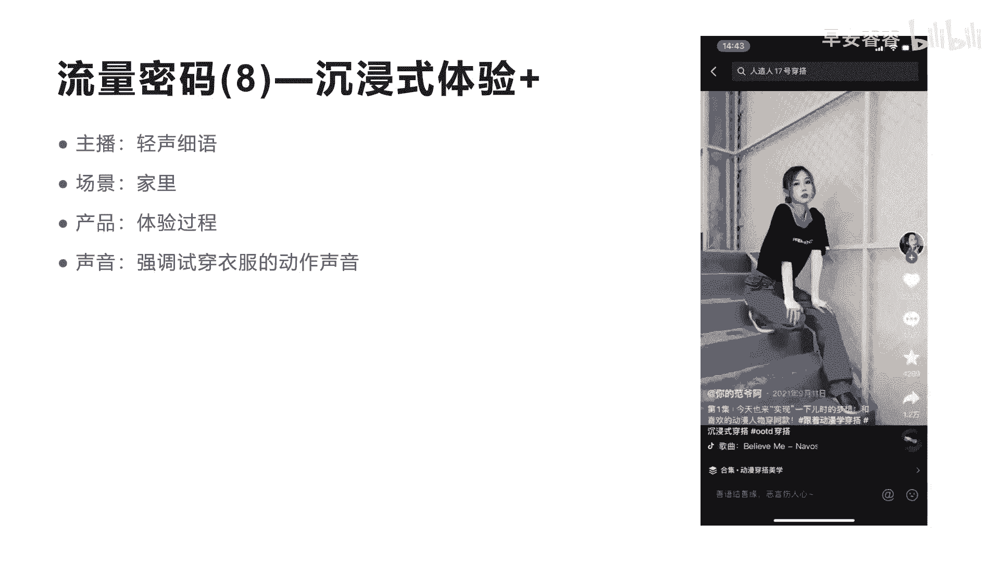

# 042 2023抖音快速起号必修课 - P40：第40节流量密码(8)—沉浸式体验+-请收藏 - 早安睿睿 - BV1Gn4y1o7rC

我相信很多人看到流量密码八，应该都嗯看完了前面的所有的流量密码啊，因为每一个流量密码都是一环套一环的，今天我们讲流量密码八，那其实跟前面那个S码的密码，流量密码其实非常相似。

但是当我们把它另命名为沉浸式的体验啊，这样可以更加应用到你的账号和你的实体，以及你的产品里面啊，等下我们会来讲什么叫沉浸式体验，家好，我们先来看这个短视频，它是一个叫培根日记。

这个别人日记在抖音上面很火啊，很火，他的这个短视频的点赞数，你看这个短视频是207。9万，也是上亿的流量，他的评论转发和收藏都还比较大是吧，都还比较大，但是这个短视频他为什么会有这么多人呢，啊为什么呢。

其实在S码的这个短视频密码里面，我给大家也讲过，靠视觉听觉，还有你的场景以及你的道具，产生一个共鸣的公式是吧。

其实在这个啊培根日记里面，他也用到了这些啊公式，而且你看到没有，他通过这一系列的这种方式，他做到了账号粉丝达到了605。8万啊，非常不错啊，就是发了400多个作品，全部是用这种在车内里面去。

此时我用S码的方式，S码这套公式做到了，605万的粉丝们看一下这个视频啊，你有感觉了，嘶啊好视频很短是吧，视频很短，也没有看出什么东西，但是你会让观众感觉看了他这个内容，好像自己都觉得很好吃是吧啊。

这就是让你产生了味觉和嗅觉的相关的刺激，通过他整个短视频在车内的这个场景，用手里面拉的一个喷雾，喷这个手的一个超级符号，然后后面陆续的用咀嚼的这个声音，发出这种相关的美食的这种反应。

让你联想到哇这个食品非常好吃，所以你会看到他有几个特点啊，沉浸式体验，他有五个特点，我这人左边写出来的第一个是主播，他不会讲话，这是沉浸式的体验的核心，第二个他是吃美食，口播美食的这个声音。

第三个他有场景在车内，第四个呢他有道具啊，道具这里面前前面还有个喷手的动作，都是他的道具，那产品是什么，它这个美食就是它的产品。

我们再来看一个另外一个沉浸式，这个沉浸式的大家可能没有刷到过，女孩子喜欢看啊。

跟着头妈去穿看。

If you only believe me，Don't do things like that。

Oh，这个地方很有意思，是不是看完这个短视频，你也会觉得嗯很享受，他这个短视频是32。1万的点赞，也是将近几千万的播放量，非常大的一个一个这样的啊短视频，而他的整个过程中。

你会发现跟前面那个短视频有一点区别，他也是没有讲话，但是他讲话是什么轻声细语的讲，而且只在开头讲了一下，讲他的具体要做什么内容是吧，那他的场景是什么呢，他的场景就在家里是吧，他的产品是什么产品。

就是换衣服啊，穿搭啊，把它整个穿搭衣服的这个过程啊展现出来，那他声音是什么呢，声音其实没有发出任何其他的声音，都是故意在摇晃的这个衣服，故意在抖动的衣服所产生的那个声音来刺激你，是吧啊，停留下来。

专业的词叫感官营销，通过感官营销，然后让你来种草，让你购买啊，其实这个呃沉浸式的体验的这种感官营销呢，在很多品牌方其实都拍过这种类似的广告，像日本有一家这个专门卖雪糕的公司啊，叫生永智国。

他当当时就是通过S码拍了一个这样的，吃冰棒的一个这样的广告片，就是只发出声音啊，结果这个呃销量翻了三倍，所以你会发现沉浸式体验这种形式，它其实是会让更多人人有这种新鲜感啊，会沉静下来。

会去看整个短短视频，而且它会刺激他的销售啊，刺激他的销售啊，这是穿搭的沉浸式的体验，我们再看一下另外的哎。

有很多人做好物是吧，今天我们再来看一个就沉浸式体验加好物分享，毫无风险，有很多人就是拍那种诶拉这个产品，不断的去搬运别人的短视频，有些呢可能就是通过自己拍一拍，然后就变成了营销广告。

然后就没有什么没有什么流量，这个博主是叫麦麦小佳，你看他那个短视频啊，也是毫无分享，他是用沉浸式体验的方式在做好物分享，他是104。4万的点赞非常高的，也是将近应该是啊。

8000万左右到一个亿的一个啊播放量左右，那么他这个曾经是怎么做的呢。

我们来看一下他的视频，指纹识别成功好我们不看完啊，你会发现他整个都没有讲话，是不是就沉静下来看他到底在干什么，他每一个声音发出来，都是他的一些相关的动作啊，比如说推推这个抽屉。

比如说放某一个东西产生的这种轻微的声音。

它其实都会对用户有相关的刺激作用，天猫精灵打印语文作业的。

好这个视频比较长啊，我们不就看完了，你们就可以去关注一下这个账号，你看见没，他整个这个短视频里面毫无分享，用沉浸式把整个家里全部都展示体验了一遍，他不是分享某一个产品，它是分享了整个这个家里所有的人。

该分享的好物，所以说大家也可以用这种方式去做啊，这种方式去做啊，这里我们核心要讲就是万物皆可，沉浸式，这里面我们前面看到沉浸式口播吃美食是吧啊，包括沉浸式做饭，沉浸式穿搭，沉浸式好物，沉浸式这个化妆。

沉浸式护肤，沉浸式学习，沉浸式收拉等等，只要你相关的有场景的，都可以用沉浸式的方式来做自己的账号形式啊，并且有时候你看他这个外卖小将，就用一个这样的形式，就用一个这样的形式啊。

他做到了将近几百万的一个粉丝啊，非常不错，我们来看一下他的那个内容啊，他是做到了165。2万的粉丝啊，120万，而且他的额销量也非常不错，我们看他的销量，他的橱窗里面是已售10万加已售10万加的。

他的带货口碑是4。95分，也非常不错，也就是说通过全部是沉浸式的一种好物分享，而且他会跟你讲，所有的视频分享的好物都在他的橱窗里面，他的橱窗有很多人就进去到，进到他的橱窗直接购买啊，都不需要直播带货啊。

都不需要直播带货去购买，所以这种沉浸式的这种，第一个让很多啊粉丝觉得这个账号很有意思，第二个呢，这种沉浸式的视频，可以让观众带来更多的啊停留啊，和这种呃感官营销的刺激啊，所产生消费。

所以这就是我们今天要讲的这个流量密码八，流量密码八啊，希望大家看完这个整个流量密码吧，对你有非常大的启发。

