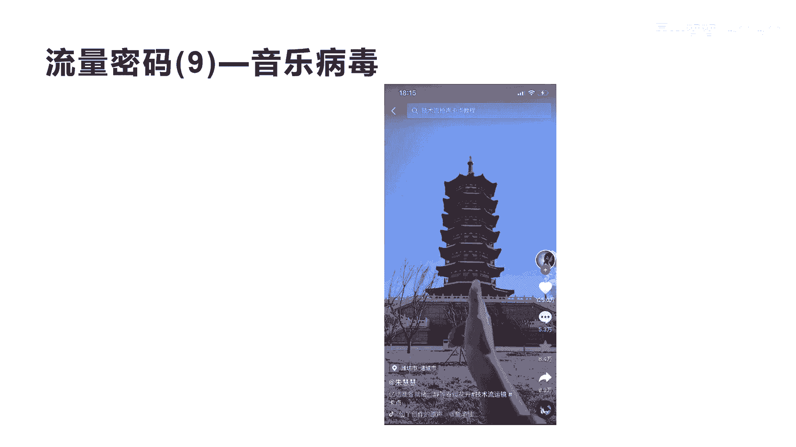
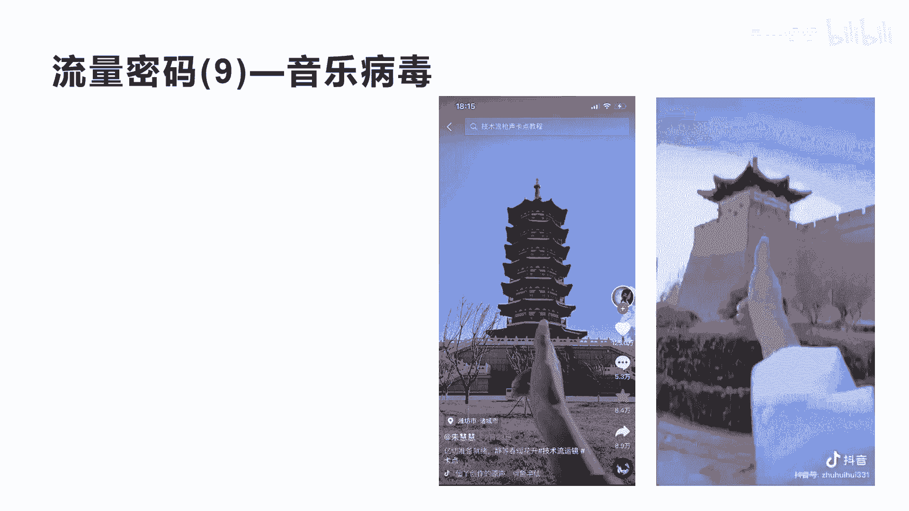
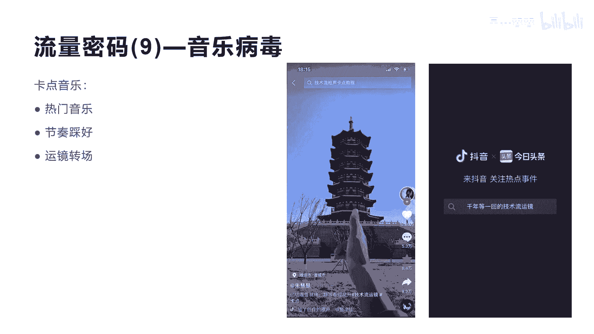
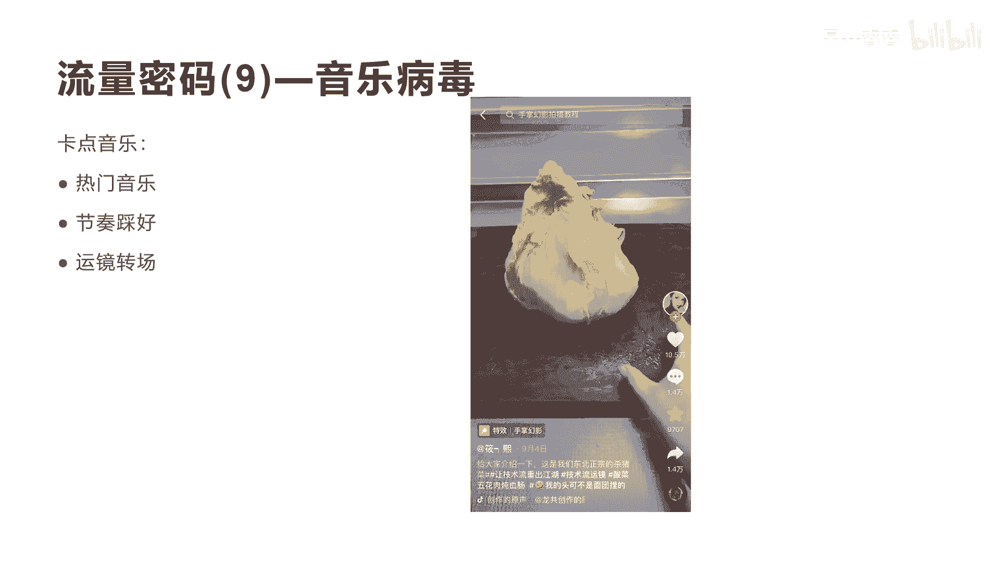
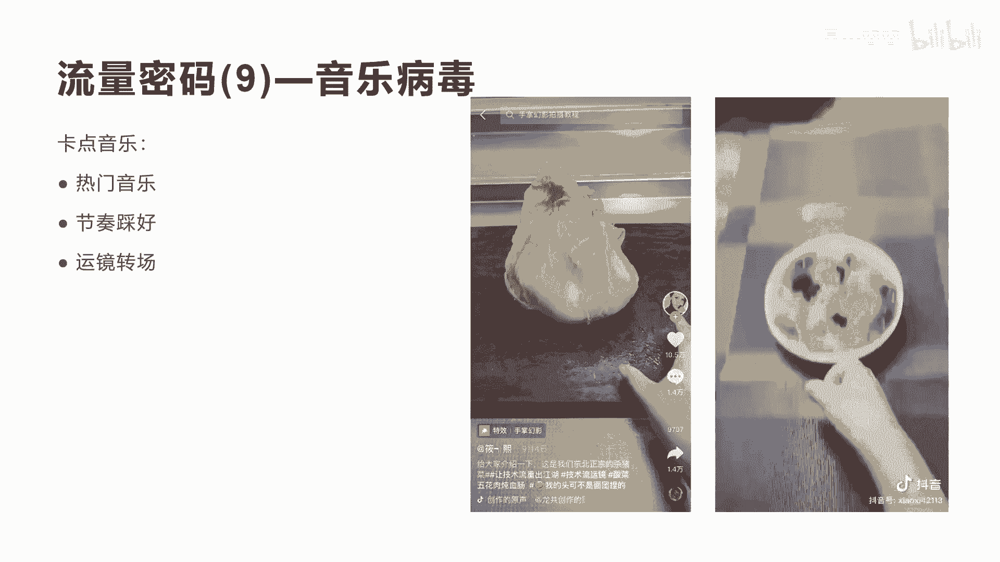
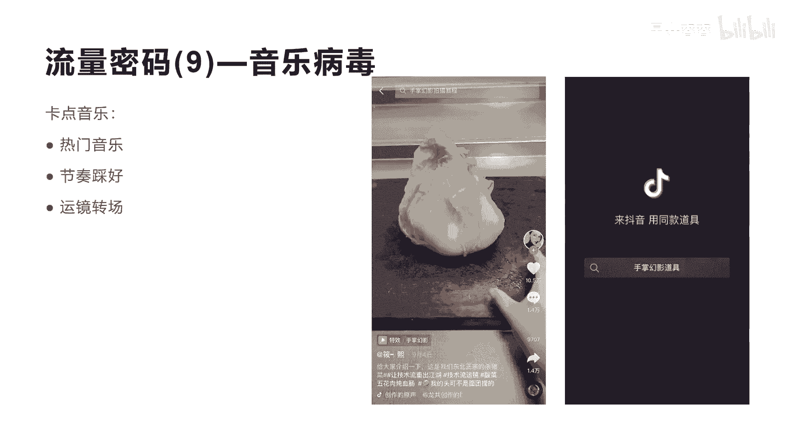
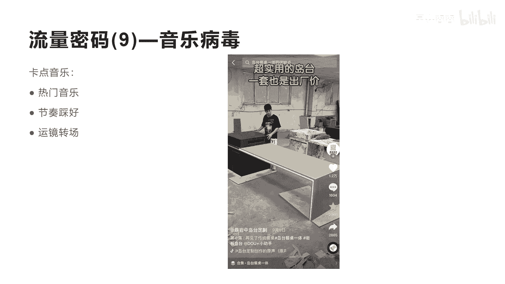
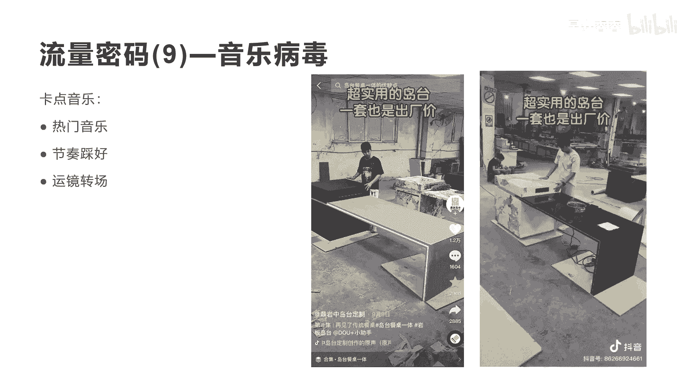
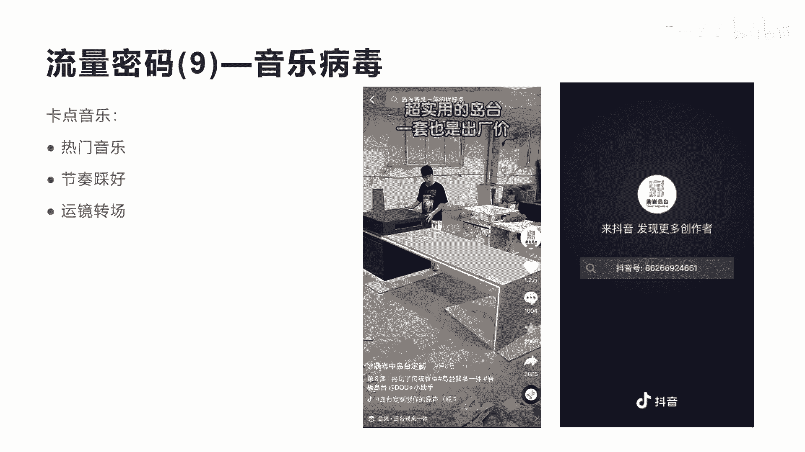

# 042 2023抖音快速起号必修课 - P41：第41节流量密码(9)—音乐病毒-请收藏 - 早安睿睿 - BV1Gn4y1o7rC

好我们来讲流量密码九叫音乐病毒啊，我把它取名叫音乐病毒啊，因为我感觉这个音乐的这个神奇的魅力，它可以让你真正产生病毒式的传播，所以音乐它一直是所有的呃，营销的一个非常好的手段啊。

它可以增强与消费者之间的这种沟通和交流，满足这个消费者的一些这种心理需求和啊，促进产品的销售，更多的消费者的注意，这也是音乐所带来的神奇之处，所以今天我们要讲一个就是流量密码九，关于音乐的一个流量密码。

我们来看一下这个短视频，这个短视频他是125万的点赞，125万的点赞呃，他这个转发和收藏数也有几万啊，那个评论数是5。3吗，啊这么大的一个流量是为什么啊，一个音乐我们叫卡点音乐。

我们来听一下这个音乐啊，你看看是不是很很神奇，哈尼哈尼哈尼哈尼哈尼。

好抖音，我们看完了啊，这个卡点音乐很有味是吧，那你看完之后还想看，但是他实际上他的制作成本其实不高啊，制作方式也不难啊，抖音上面有很多这种教这种卡点音乐的，后面这种卡点音乐。

现在也演变出各种各样的玩法啊，他对于用户呃这种流量的吸取，它是非常啊非常大的，有很多人玩这种啊，卡点音乐和技术流的这种短视频，带来很大的流量啊，那么这种卡领域到底有些什么样的神奇之处呢。

我这里给大家总结三个点，第一个呢，它的这个短视频的核心在于他的音乐啊，这个音乐的选择非常重要，选一些比较热门的，然后呢节奏一定要踩好，就是他的整个节奏，在你的整个短视频和你的画面的运运运景上面。

要做非常好的一些踩点，第三个就是讲到运景，运镜转场的这种方式和动作，它实际上是很容易让观众产生觉得很神奇是吧，很惊讶，会产生这种效果啊，节奏踩得非常好，这里我就没有专门讲怎么去做了，你们可以如果想学。

可以到抖音上面去搜卡点音乐的教程啊，这里面很多人教怎么去做，第一步怎么做，第二步怎么做啊，当然他前期你要选择好一点的这种音乐啊，并且额选择好一点的这种画面，进行跟音乐的结合。

然后用过用这种运镜转场的方式把它做出来好，我们再来看一个啊。

我们再看一个，这是一个把呃这种卡点音乐运用到实际的啊，赛道里面，这个赛道就是我们讲的美食，我们看这种账号，他有10。5万的这个点赞也将近有啊，10。5万，基本上大概是个1000万到2000万之间的。

一个播放量，流量也非常大啊，我们看他怎么用这个卡点音乐认证。

技术流的方式来做短视频的，江山难消，夜雨摇涛浪淘尽红尘，世俗知多少。

怎么样，看完之后就感觉不一样是吧，很让它看上去的时候，你会觉得诶很有感觉，然后看看着很好玩是吧，很好玩，然后这种音乐的刺激也也导致你呃不想划走，不想划走，所以他流量很大的原因，通过拍摄运景。

通过剪映的工具进行这个二次加工啊，它就让整个这个短视频非常流畅好，这个就是我们讲的这个啊，把卡点音乐应运用到这个美食，做美食的这个赛道，我们再看最后一个啊。

这是一个把卡点音乐运用到家居的啊，一个餐桌的一个做家居的一个赛道的短视频，他的点赞数也达到了1。2万啊，非常不错，用卡点音乐的方式来踩节奏，然后把整个自己产品的一些相关的呃一个展示。

用卡点音乐啊展现出来，用这个运镜。

我们来看一下他怎么做的。

啊怎么样好，整个你会发现这种卡点音乐的这种方式，会让你觉得诶很神奇，如果我们把音乐给去掉，你会发现这个短视频没有任何的感觉，它无法产生这种营销的效果，就会让这个短视频的这个效果很差啊。

所以用卡点音乐去应用到你的赛道去拍短视频，做节奏，做愿景的变化，其实是一种非常好的一种流量获取的方式啊。

