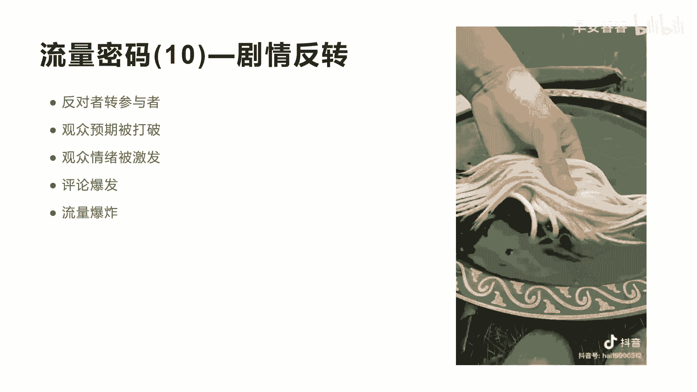
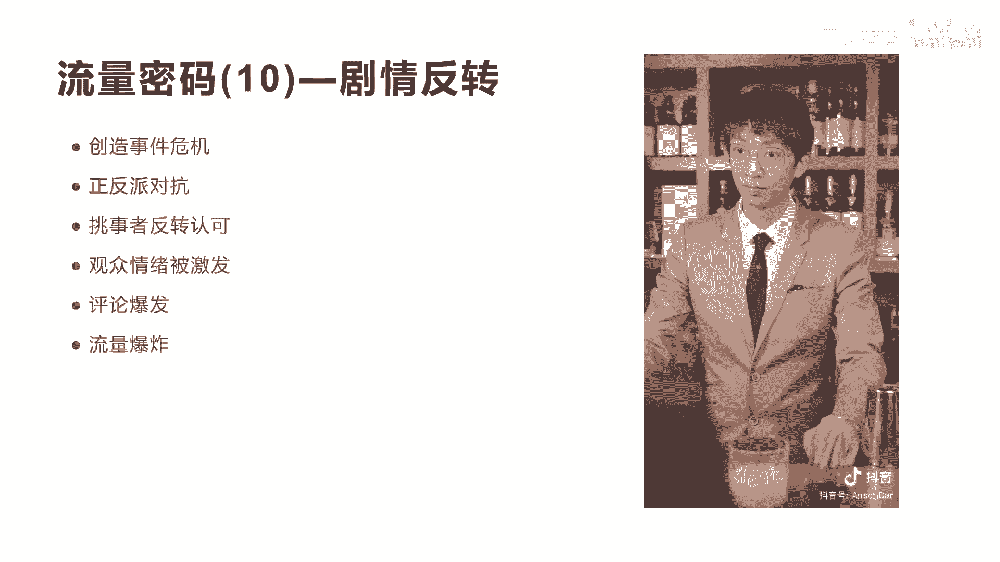
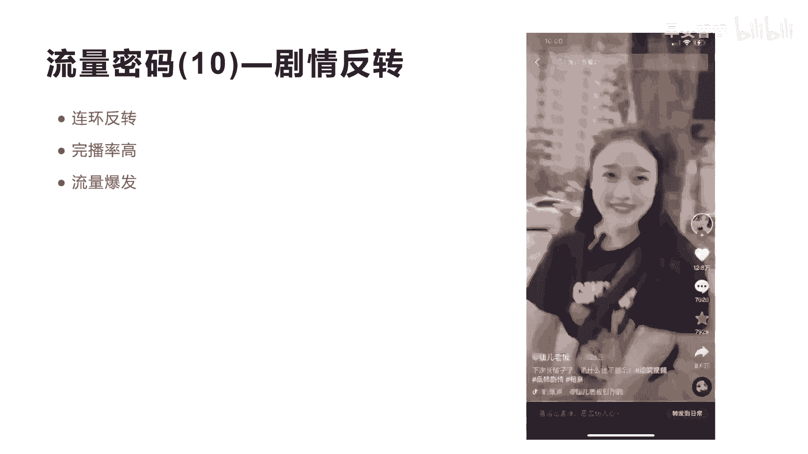

# 042 2023抖音快速起号必修课 - P42：第42节流量密码(10)—剧情反转-请收藏 - 早安睿睿 - BV1Gn4y1o7rC

好今天我们来讲第十个流量密码叫剧情反转，其实这瓜皮刀的这个短视频在前面，我们已经在呃，第二个内容故事化的流量密码里面讲过了，但是实际上我还讲一下，就是他在做这个呃故事化的过程中。

其实在中间做了一个反转啊，这个反转也是成为一个核心的一个流量密码啊，所以单独我把它拎出来，等下我再用别的案例来讲，我们先看一下这个案例来帮做饭啊。

我没做饭大哥，我是卖这个消皮镜的，咋用呢，咱家这削皮刀。

你看一下，打平的时候，咱们往前推啊，往回一拉，能前推能回拉。

想推就推，想拉就拉，这边能打皮，这边能刨丝，咱们在家里面削个茄子丝。

土豆丝，黄瓜丝儿，往下一拉一小堆根根啊。

那还不错，左手能用吗，左手能用，大哥你慢点，大哥你会用吗，你是左手是吧。

好这个地方我就不看完了啊，这实际上就是刚才我们讲的哎，反对者变成了参与者是吧啊，产生了剧情的反转啊，这就是它的设计与核心，第二个就是要阻止某一个事件发生，但是到最后呢观众的预期被打破了。

而没有没有发生什么事情，所以会引起观众的情绪被激发出来，所以他评论数很高，所以他评论数高，我前面一直讲过，评论数高的短视频，他一定会有大量的流量，所以评论市爆发之后，流量短视频爆上的大热门。

那这个就是我们讲在整个故事化的过程中，一定要想办法做一些剧情上的反转啊，让观众的预期被打破，让观众的情绪被激发，就是让观众的情绪能进行波动啊。

这是核心的一个剧情反转，我们再看另外一个剧情反转，大家看一下这个短视频。

你们调酒师调出的酒就这样。

没问题，好，我们再来看这个前几秒的时候，我跟大家讲一下，就是在这个时间我一再跟大家讲故事化的前期，前期一定要制造事件，而且要让他知道事件的危机，也就是可能有危机事件发生，所以你会发现这个喝酒的。

跟前面我们那个保安指着你诶，你不能在这里啊，这个煮饭一样的，这个地方也是一样，他制造了一个事件，你们这个白酒为什么会这么烈，是不是产生的事件。

我们来再继续看呀，这么呛口，还说没问题，先生你刚刚点的是烈酒。

所以有我就不信了，有本事你给我杯白酒，但不要抢喉的好，这里我会讲到就是反正反派进行对抗，刚才说是不是你有本事你给我做一个主角呢，他就会按到啊，反派的这个要求。

顺理成章的就去做他相关的内容，当当当，传统白酒往往难以入口。

很多年轻人不太喜欢哈，这个地方也跟刚才那个也刮皮刀一样的，在这个过程中，实际上就开始了什么演示和介绍产品，所以你会发现爆款短视频的所有的逻辑，其实都是底层是相似的是吧，底层是相似。

所以你能不能把它底层的逻辑翻出来，然后能举一反三，应用到你的产品和你的赛道是非常关键的啊，所有被市场验证过的爆款短视频，你再用这种结构再去拍一遍，一定会火啊。

一定会火，所以这个时候我们再继续看，但有一款白酒，它从酿造原料上就突破了传统又新颖。

独特的口感，刷新着传统的白酒观切。

这不就是普通的白酒吗，你先试试，咦为什么一点都不辣，和传统白酒不同。

开山酒以大米作为主要原料，经磨掉表层的杂质，保留了精华胚芽。

米刚开瓶，米香花香扑鼻而来，入喉柔顺丝滑。

中间还回味出清酒和葡萄酒的清新甜味，但这里我要讲他们的这个视频拍摄的这个呃，能力是非常强的是吧，他整个把一个广告片植入到这个故事剧情里面，所以你们能不能拍出这种感觉啊，非常重要。

当然也不像前面那个刮皮刀一样的，他其实也没有经过专业的团队拍摄啊，所以他不一定只要你按照这个结构来，它一定也可以达到很好的预期效果。

最后带走WHISKY的强劲收尾，但他的血肉之躯还是中国的传统白酒。

没想到还有这么特别的白酒诶，这个地方开始了，就是前面的挑事者防转被认可，态度发生能一个180度的转弯，是不是，所以观众的情绪一下就被这个东西给吊起来，然后激发了观众去评论，评论完了之后流量暴增。

而且他的视频不短啊，非常长，这种长视频，这个短视频其实也将近有啊，将近有20多万的这个的一个点赞数，大概也有500到1000万的这个播放量，而真正的这种短视频的设计非常关键，好非常关键。

其实你是在担心过年回家吧，不知道你对白雪这么反感，今晚还一直看着车票发愁。

应该是怕过年的各种白酒局吧，不好意思啊，刚才是我态度不好。

哈哈这个时候这个挑事者被呃承认错误了，承认错误了，他整个就变成了一个其实是故事，融入了产品讲解，是不是啊，这就是真正的内容，而不像我们真正就来讲，你放一个广告片，你说有人看吗，没人看。

是不是广告片是没人看的，但是我用故事的方式吸引观众停留啊，其实观众就会被认可，我还跟大家讲一个流量密码，就是为什么前期用故事，后面大家明明知道是广告了，为什么还不划走，为什么，因为我刚才讲一个核心。

一个短视频，在刚开始三秒的时候，他划走的啊，成本和华子的意愿度是最高的，当他看完十秒或者半分钟之后，他其实划走的意愿和划走的成本，其实会越来越低，也就是他不愿意划走，因为他看完了十秒。

再看完20秒其实也不难了，但是随着这种内容的吸引，让他不知不觉就把整个短视频看完了，所以你会发现，如果我刚开始的三秒和五秒就来讲这个呃，产品介绍绝对会划走，因为他的滑走成本和划走的意愿度，是非常强的啊。

非常高的啊，划走成本非常低啊，随时可以划走，但是越看完越看到中间他越不想划走啊，反正已经看了半分钟了，我把它看完算了，大家理不理解，所以这就是为什么在剧情过程中融入，在中间的时候。

融入产品是比较好的一种方式。

我们再来看另外一个案例，剧情反转的，这里面用到了连环反转，我们来看一下这个视频。

我妈说相亲的时候玩手机就跟随地大小便一样，你妈事儿怎么那么多。

我妈说随便评论长辈是非常不礼貌的行为，你妈还说什么了。

我妈说结婚的时候要给对方500万彩礼，不能委屈了人家女孩子哇一人哈哈哈哈。

看我还行吗哈，你看这个地方发生了一次反转啊，发生一次反转，前面都在说他不行，现在说呃要给媳妇500万的礼金之后，她这个女孩子发生了反转是吧，故剧情上面的反转。

我们再看，我妈说让我亲你一下，看看有没有触电的感觉，哈哈哈哈哈哈咳嗯咳有吗。

我妈说如果一次没有的话，就亲第二次。

有没有触电的感觉，你别笑。

我妈说，第一次见面就让人家亲的女孩子不能用哈哈，我们看完第这个，第三个又进行了反转是吧，前面说哎需要清，但现在说轻的不需要，所以你会发现剧本的反转设计是非常关键的啊，虽然他没有带货。

但是你从他的这个剧情里面来讲，不停的去反转自己的剧情内容，是会起到让用户调动他这个情绪，而且会不断的吊打用户的这种情绪，他的这个点赞数达到12。6万啊，这个视频播放数也差不多，将近有上千万的流量啊。

所以非常非常的重要，就是我们讲的剧情的反转，哈哈哈哈哈哈哈好。

我们就整个剧情反转的流量密码啊，就已经讲完了，所以今天讲的这个剧情反转，他可以去找一些这种真正的做剧情反转的视频，你可以把这种剧情反转的，前期和比较高潮的内容，植入到你的产品介绍前面。

然后再通过相应的反转，然后来真正的啊激发你短视频的上热门的概率。

