# 042 2023抖音快速起号必修课 - P43：第43节流量密码(11)—地域冲突-请收藏 - 早安睿睿 - BV1Gn4y1o7rC

好今天我们来讲流量密码，11就是叫地域对抗，什么叫地域对抗啊，就是每个地域，每个区域，比如说南方和北方，他们都会有他们的一些文化差异，比如说地理位置不一样啊，气候不一样，美食不一样，居住环境不一样。

居住的习惯不一样等等，所以就导致了南方和北方的这种人群，会有很多存在争议的话题，所以这些其实我们就称也叫啊地域话题，其实从心理学上来讲，他这种地域话题呢，能让观众产生这种对抗的情绪。

其实来讲呢就是煽风点火啊，内容的目的是煽风点火，来引起不同地区之间的人群的对抗，从而引发他们的吐槽，让更多吐槽的人呢在评论区把他炸爆，然后这个上热门，这就是地域话题对抗的一个核心的底层逻辑。

我们来看一下这个视频啊，这次讲的一个男方女婿和北方老丈人的，吃南方烧烤的一段视频。

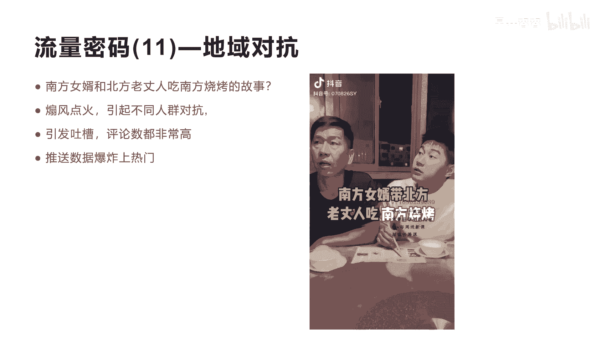

那我们看到的这个流量是很吓人啊，点赞数是271。8万啊，这个基本上上亿的流量，然后他的收藏数和转发数都是20几万啊，我们看一下它具体的这个内容，南方女婿带北方老丈人吃南方烧烤。

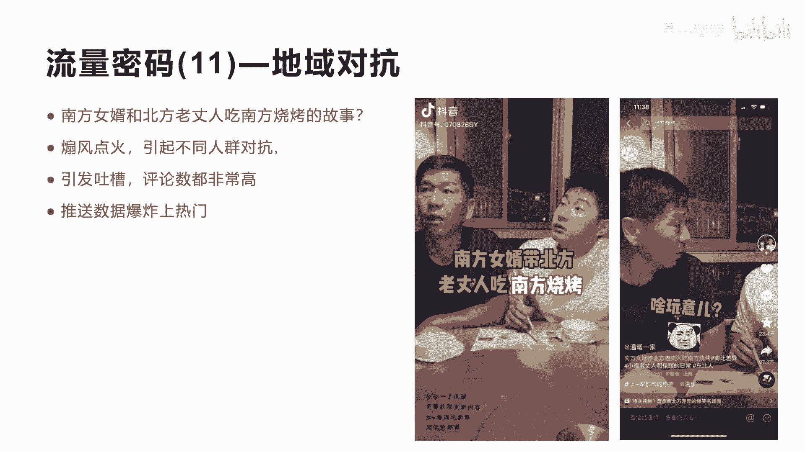

你先给我来二纯玉米，再给我啥玩意，来20串啊，我的妈呀，你请我出去烧烤，你让我吃吃吃苞米啊，我跟你说家伙，我平常可没那个亏待我。

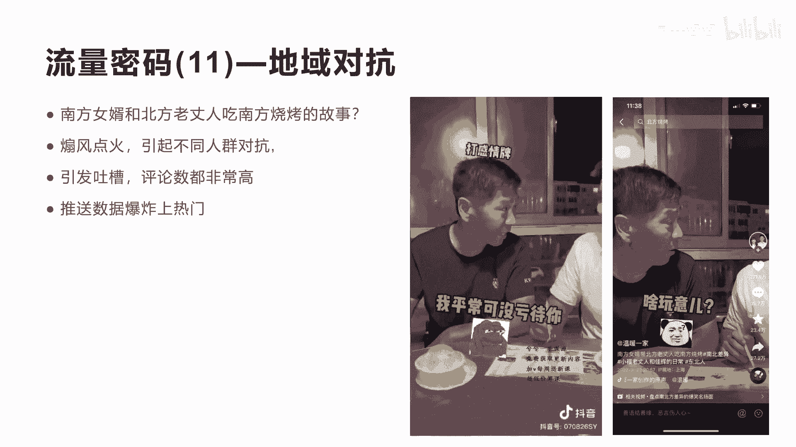

我就吃一个，剩下你我也吃点别的，别的呢，你就吃一根是吧对啊。

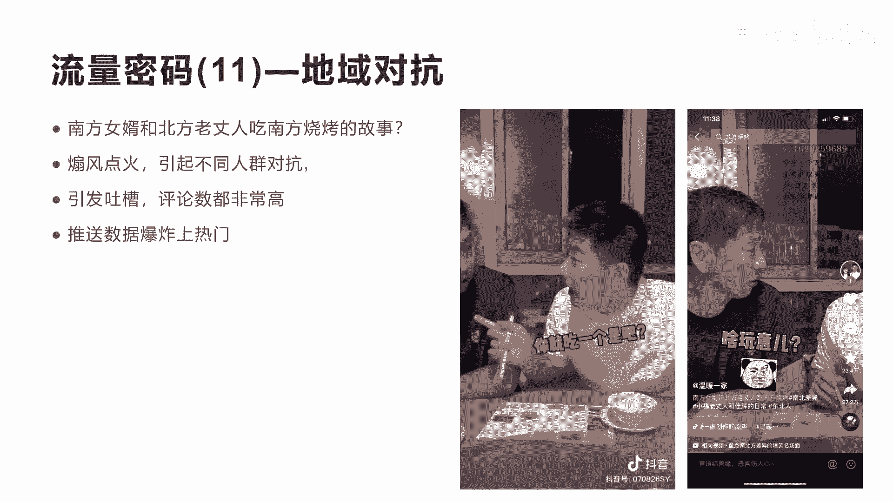

你一会不够吃，别抢我的啊，抢别拿鸡蛋拿去，随机都给我来个四肉串。

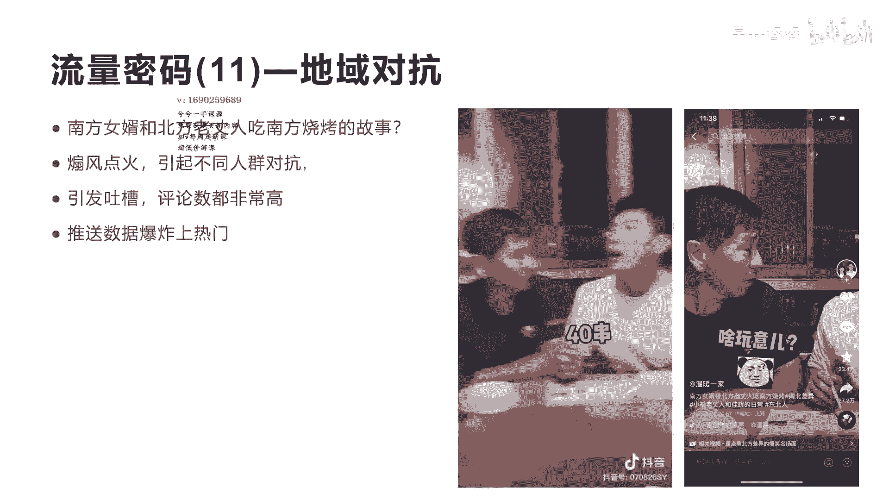

四不卷啊，咋的了，哎就就就就咱俩人能能能吃了吗。

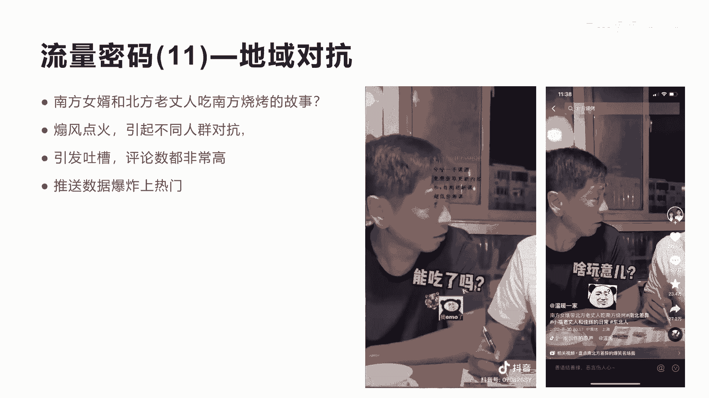

和多大不合呀，多大不合呀，再来20串的五花肉，然后二十二十串这个腊肠，然后再给我拿出个十串年糕，对对对对对。

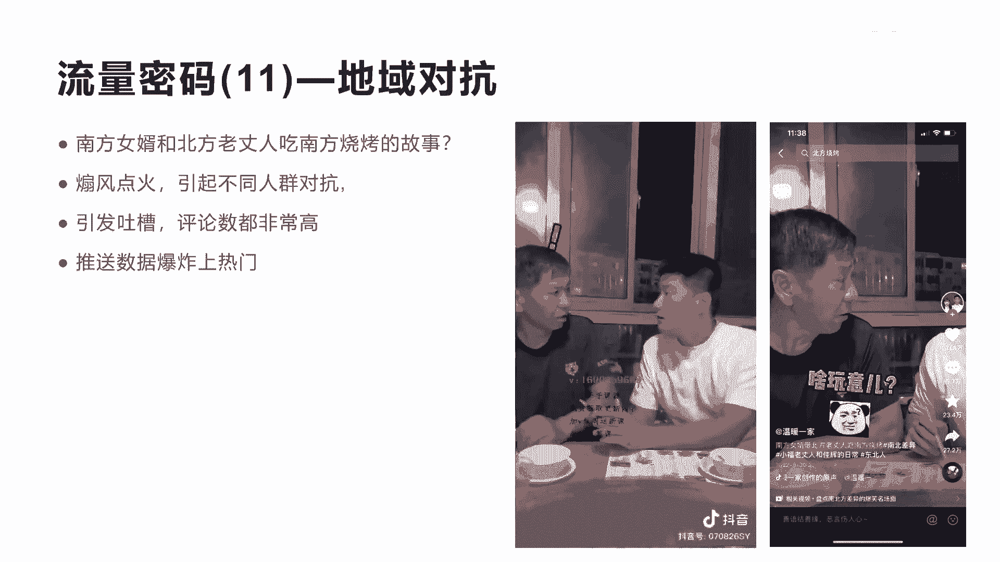

你再来五串这个青椒，五块家，你吃不了这玩意，你剩下一打包就不吃了。

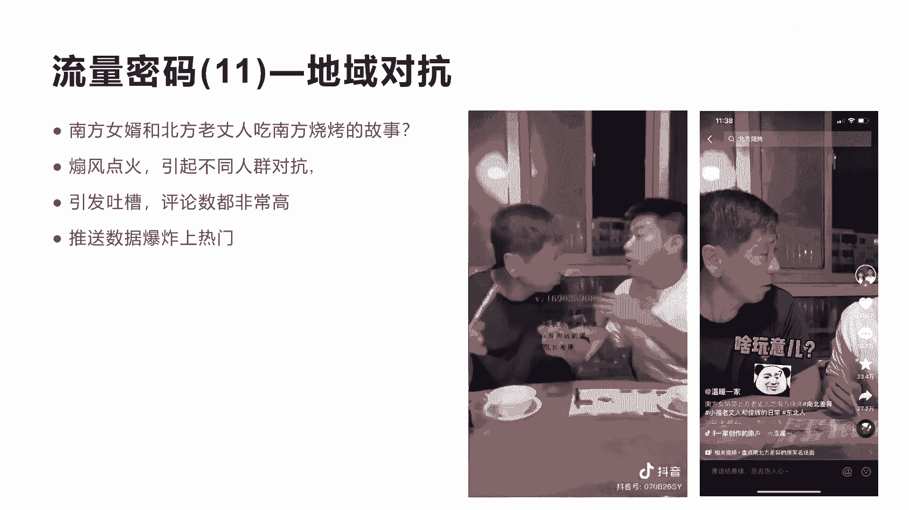

你买下这不够代价，这还不够啊。

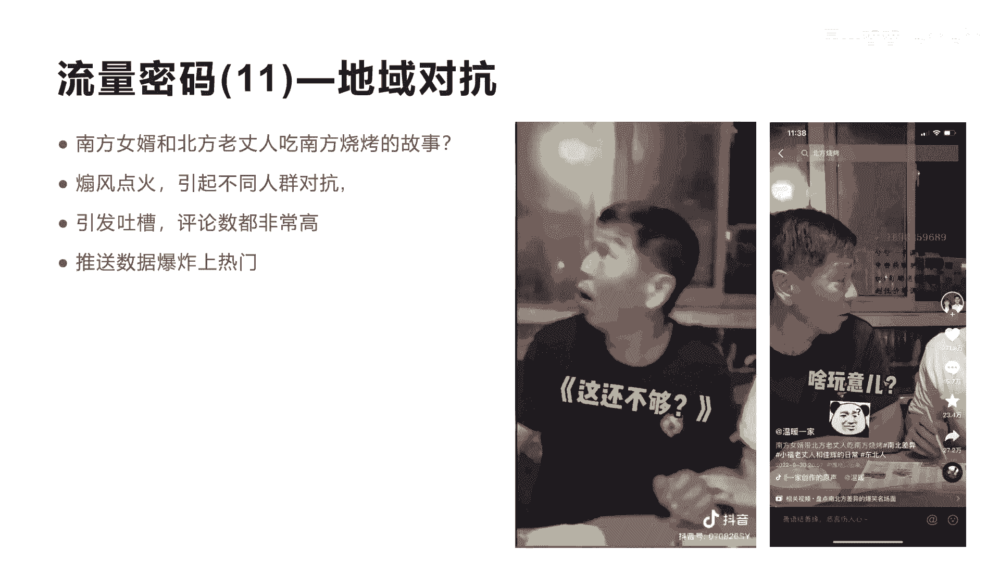

老二吃啥，烤玉米来吧吃吧，哎哎呦，我天呐，这哪是爆爆苞米棒。

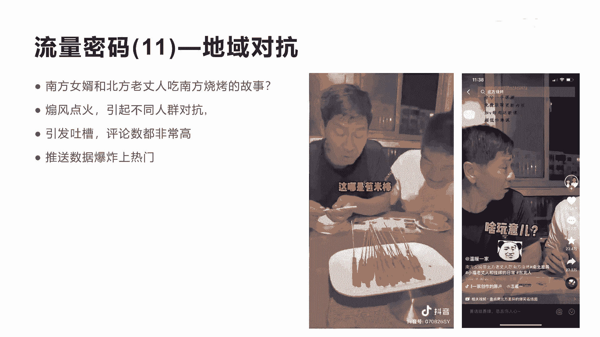

这不苞米粒吗，在我们这个东东东北这边烤我烤东西整不让烤，这一串都都给我撕下来，塞牙缝的就好了，那你看完了这个会很馋，它体现的这个内容还是很搞笑的啊，这两个人的演技非常非常强。

这个说明这个短视频它不仅仅是说呃，南方女婿和北方老丈人的一个故事，是烧烤的故事，南方跟北方的这个人吃这个烤串呢，它是不一样的是吧，所以他把这个内容淋漓尽致展现出来啊，所以这个是会引起了很多人的一个评论。

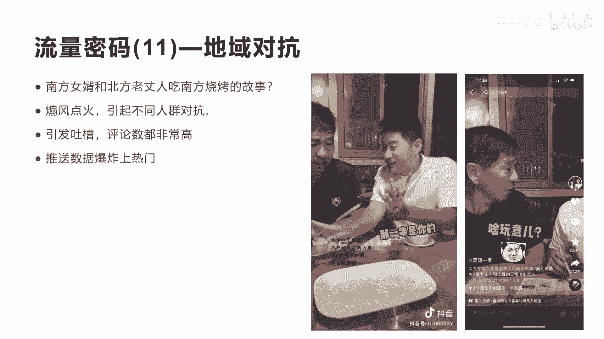

我们看一下他这个评论啊，啊你看这个评论区会非常吓人，他这个评论区将近有15万的一个评论，而他的每一条的评论的右边那个点赞，都达到了一十几万啊，虽然我是南方人，但觉得南方烧烤真的不但迷你。

一个人吃半饱都不到，就要上上百元，一个这样的评论上了17。5万的点赞啊，包括下面也有很多1万2万的点赞，而且你会发现他用这种方式去讲，去吃美食也好，去做任何南方和北方的这种话题的选择也好。

他这个账号已经达到了428万啊，428万，拍视频的能力，以及他们的内容的制作能力非常强，因为看他每一个短视频几百万啊，他只发了170多个短视频，都涨到了400多万的粉丝啊。

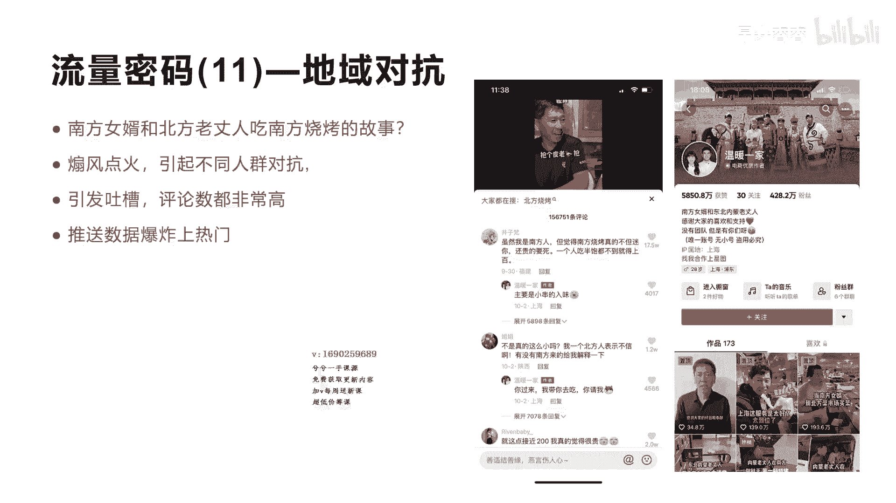

非常厉害，我们再来看一个好吧，我们再来看这个短视频，它是讲的呃，最能吃辣的省，他不是湖南省，也不是四川省，而是江西省啊，这里有，这就是讲的，把湖南跟四川以及江西来做吃美食的，这个话题的对比。

目的也是为了煽风点火，然后让更多的人呃不同地区的人，他这不是南方和北方，他是每个省与省之间的这个区域，来进行人群的对抗啊，引发吐槽，然后评论区也很高，评论区也很高，有5万多个评论，然后引发了吐槽。

然后可以上热门，我们来看看它这个内容，正常吃辣的时候，为什么是江喜，提起吃辣，湖南湖北四川贵州都榜上有名，都说自己无辣不欢，湖南的火辣，湖北的香辣，四川的麻辣，贵州的酸辣，但要选吃辣冠军。

人人都会在心里默念坚定的大名，江西的辣是真辣，江西的辣就像江西老表的性格太低调了，江西的周遭分别诞生了楚菜，湘菜和川菜，贵州的菜系虽然没有出圈，却靠一瓶辣椒酱走红，唯独江西的菜名不见经传。

这就很说明问题了，川菜和湘菜之所以能在其他省遍地开花，说明辣味辣的流行好，这个内容也比较长，我们就不看完了啊，其实他这个内容也就是告诉大家，他在不停的讲湖南和四川，以及各国全国各地的这些啊。

辣为什么没有江西的辣，他讲了很多理由，但确确实实呢，江西呃是比较辣的啊，江西有很多人知不知道呃，全国很多人都只知道这个湖南的菜比较辣，四川的菜比较啊比较麻是吧，那这两个省份吃麻辣的人会非常多。

但是江西吃辣的人可能有很多人不知道是吧，所以你看到的评论区有很多人啊就炸了，其实江西和湖南隔的很近是吧，江西和湖南我们称为老表嘛是吧，江西湖南交界都是吃辣的，所以你会发现在我们讲的呃。

地域对抗这个里面不光光是讲美食啊，这里面还有很多啊，关于区域和地域，包括省份的一些话题非常多啊，有些讲美食就做一个号，专门讲美食都火的不行啊，有些就专门讲，比如说嗯男方人跟女方人的性格。

南方人跟女方人的做生意怎么个做法，南方人跟女方人的媳妇和老婆是什么样的，就等等这种话题太多，所以你如果要做一个好面，向于针对于需跟你的产品结合，然后去对比你相关的区域啊，这是一个非常好的选题。

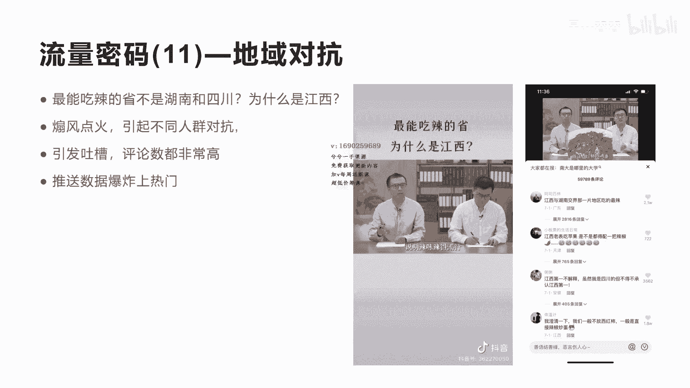

好我们看他这个账号也是一样的，就是刚才这种鲁生可畏，他的账号是，那他做这个就是做了很多这种省份的话题，他整他总共做了呃952个短视频啊，每个省份的文化故事等等，全不用这种方式在讲。

涨了将近200多个粉丝啊，这个好也非常的不错啊，非常不错，他也没有讲很多东西，讲全国各地每个地域的文化差异，他们的一些故事，包括他们的一些美食的吃法等等啊，就这种账号主题的定位啊，做到了240一个好。

这就是我们今天要讲的地域的对抗的。

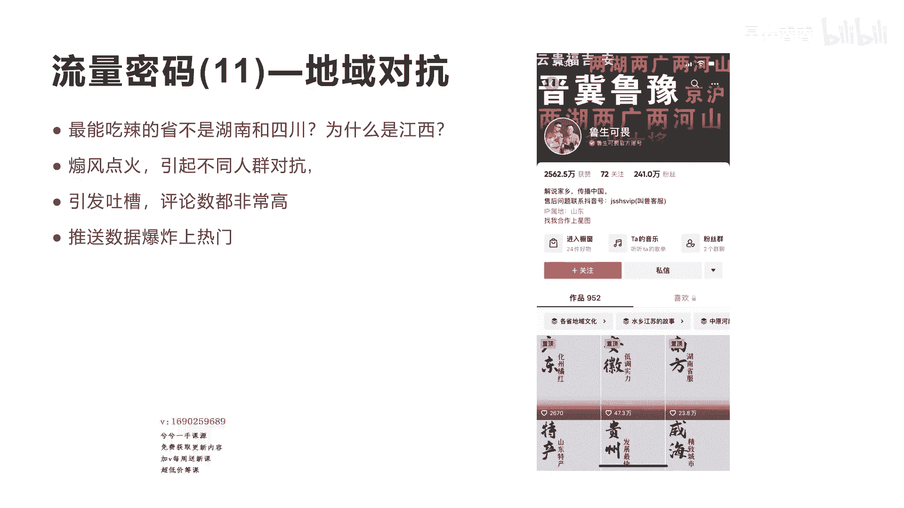