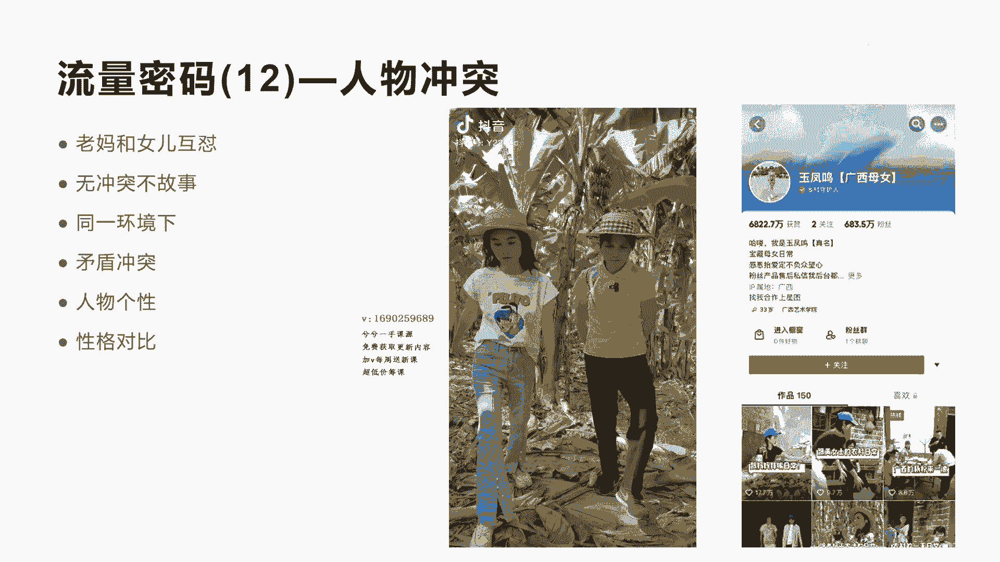

# 042 2023抖音快速起号必修课 - P44：第44节流量密码(12)—人物冲突-请收藏 - 早安睿睿 - BV1Gn4y1o7rC

好今天我们来讲流量密码12叫人物冲突呃，上一个流量密码我们讲了地域对抗啊，其实他也是地域的一种啊冲突，今天我们讲人物这个冲突呢，其实就是人与人之间的这种冲突，特别是我们今天分享的第一个案例。

就是一个老妈和她女儿，而这种互怼啊产生了一种呃很明显的这种冲突，我们知道任何一个没有冲突的故事，其实它不成为故事，所以当一个短视频，一个人设一个这种剧情，或者是一个故事产生了这种冲突之后。

其实很容易吸引请观众去观看。

好我们先来看一下这个短视频，这种人物冲突，他的这个账号叫呃玉凤鸣啊，玉凤明，她是一对广西的母女啊，这个账号做的非常不错，他只发了150个，这个视频涨到了将近快700万。

额视频对于人物之间的这种冲突把握的非常好。

我们来看一下他的具体的内容。

给你500万，你选钱考虑买什么，我省钱考虑谁给，你就没想过我这辈子会拥有500万吗。

我真是蹭了个笑话，你离500万最近的一次应该是。

上次口袋里有500块的时候，还差一个万，就够500万了，他这里面的这个广西母女呢，两个人反差也非常大，这个母亲呢她就是我们称为宝藏级母亲啊，非常贴近老百姓的这种生活，但是她很有特点啊，人设非常突出啊。

讲话各方面都很搞笑，用继续来看完。

你可真是够毒舌的，反正我是炒过的，跟你就没办法好好说话，长得稀里糊涂。

傻的胸有成竹，虽然大山跟脑袋长得有点像，那你也没必要在里面装的东西都一样吧。

是你看到他不是普通话不怎么标准，但是他讲的这话都非常搞笑，非常吸引观众啊，啊我们不看完了，那具体的实际上就是说哎一个老妈和一个女儿，在围绕着各种各样的生活日常来进行互怼啊，互怼来突出两个。

特别是突出他妈妈的这种啊人物性格是吧啊，让大家都非常喜欢这个广西的这一对母女，所以我们要知道人物冲突，这里面一定是在一个环境下面，产生两个非常反差的一种对比的性格啊，然后他们之间进行互怼。

更加突出某一个人的人设，所以利用好这种冲突的这种技巧啊，这种矛盾的冲突的技巧，它是可以撬动你的流量密码，其实通过这个人物的冲突，他是可以体现出啊我们讲的人设，包括人物的个性以及他的性格这种方面的不同。

我们再来看第二个短视频，这个是讲的一个老公和老婆的互怼啊，也是在同一个环境下，居住在这个自己的一个家里，也产生了这种矛盾的冲突，而且它体现的也是两个不同人的这种性格。

他做的这个短视频呢，现在呃不多啊，只有49。7万，就一个南方的这个和一个北方的啊，两个人组合了一个小夫妻，通过162个作品也涨到了将近快50万，很有一些特点，我们来看一下他的视频，夫妻谁生气的区别。

老婆生气，老婆你别生气了，别逗我，我错了还不行吗，你别生气了嘛，没有生气，是你的教训，切嗯开始制造动静，不要喂，老妹你咋啦，别管我，你咋啦，不让你管滚滚，一边呆着去一边呆着哟，有人我让你这样带出去。

把他带上去是吧，不是你不让我拐啊，我让你不要拐，你就不要管了啊，你真的变了，跟以前完全不一样，我跟你讲个死骗子，哼哼哎呀，我错了，老婆别生气了。

不要唱，你不要唱，老公生气，找不到好，你看一下，老公不要生气啊，你别生气了，我都向你道歉了。

嗯我还在生气呢，我还没原谅他呢，这老板你咋啦，嗯好我们干完了，这个时间比较长，实际上他就是产生了一种这种人物的呃冲突，人物冲突之之后呢，它会产生一些人物性格的一些反差对吧，然后体现大家呃。

这个让观众产生一些情绪上的喜悦，他其实冲突来讲，它也是反映我们啊，夫妻生活中一些日常的这种呃情景啊，一些情景，所以制造了一种呃，让大家都很感同身受的一些感觉，所以他的这个播放量非常大啊。

他有很多这种呃剧情的演出都是百万级的点赞，你看他有很多是100到200万的点赞，所以我们在构建人物冲突的时候呢，他啊用这种娱乐剧情，可以让你快速的去攒一些粉，但是要真正把你的这种呃人物冲突。

跟你的残人品和情景，以及你的场景进行一些挂钩的话，那更加好，当然做剧情号的这种呃账号来讲，他也需要有一定的演技能力啊，需要有一定的演技能，当然我们可以把这种人物冲突，贯穿到你的产品和你的场景里面。

这样更利于你在抖音去做，因为纯粹的去做这种娱乐的啊，搞笑的这种视频，对于你后续变现来讲，其实还是是很难，除非你能做到将近前面那个短视频，做了几百万粉丝之后呢，通过接一些广告插入到你的额短视频里面来。

然后进行变现，但这种路径和这种难度来讲，他还是比较大，好吧好，这就是今天我们要讲的两种，通过人物冲突，他是可以让啊短视频啊。

很快速的能达到一定的流量，那么其实除了刚才我们讲的这个呃，母女之间的冲突啊，老公与老婆的冲突，其实还有更多其他的冲突，比如说员工和老板的冲突，这里有一个号，我给大家做个建议啊。

就是大家可以去关注一下这个七喜，他做的就是跟老板的这种互怼啊，也产生人物冲突啊，这个七喜他有将近658万的粉丝，658万的粉丝非常不错，他就是专门做员工和老板，在工作环境中出现的一些互怼。

所以你会发现人物冲突这种主题啊，其实非常呃吸引流量啊，当然除了刚才说的这三种，我们还有说有婆媳关系，刚才讲过夫妻关系，还有一些相关的能产生这种冲突的关系，结婚和没结婚的关系，而现男友和前的关系等等。

你只要能产生人物与人物之间关联的这种冲突，其实他都可以设定这种主题，围绕这种主题去不断的去输出这种内容啊，其实他是可以去做报的，并不一定说你要去做这种啊，剧情类，娱乐类，搞笑类的啊，还是我刚才讲的。

把你的人物冲突贯穿到你的产品和赛道里面，其实它更容易啊产生很好的商业价值，今天我们讲的这个流量密码，意思二呢就是讲的人物冲突好吧，也容易冲动好。

