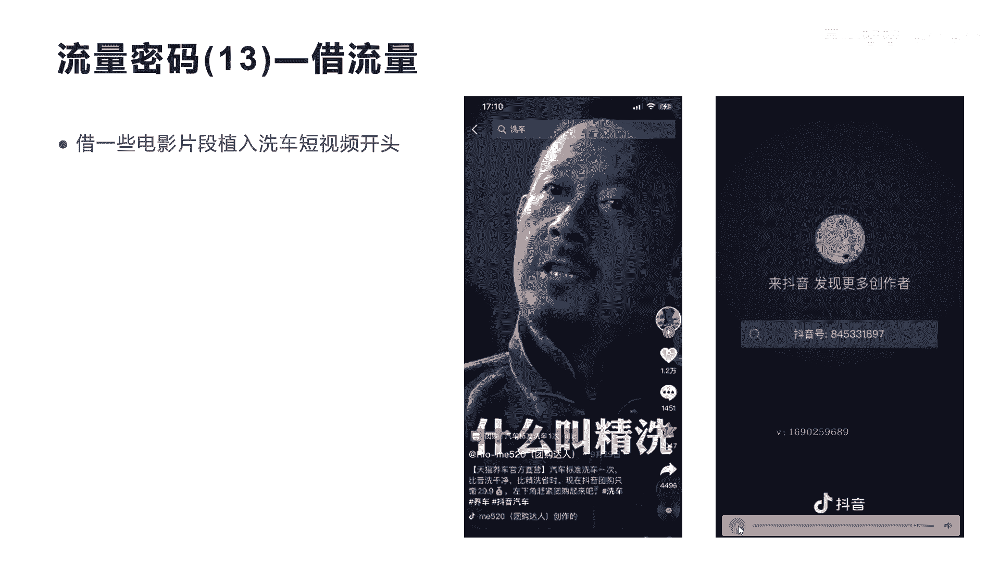

# 042 2023抖音快速起号必修课 - P45：第45节流量密码(13)—借流量-请收藏 - 早安睿睿 - BV1Gn4y1o7rC

好今天我们来讲流量密码13叫借流量，那为什么要借流量呢，其实就是平时我们自己在拍摄短视频的时候呢，呃没人看是吧，那么没有流量没人看的原因是，因为你第一个账号没有名气，第二个你的啊人物也没有名气。

所以你在拍摄自己和拍摄自己，这个短视频和人物的时候啊，就有很多人就会划走，那怎么通过一些方式让用户不划走呢，借用一些有流量的电影啊，或者影片植入到你的短视频里面，来让观众停留下来。

让观众觉得诶这个视频有很好看的内容啊，这种借流量的方式在抖音上面有很多啊，很多今天我们会举几个例子啊，让你真正感受到借别人的影片的流量，会让你的作品会产生事半功倍的效果，非常的非常的重要啊。

好我们来看一下这个第一个视频，这是一个金城武在某一个电影里面，这个泡方便面的整个过程啊，他把他用一个讲解讲出来了。

我们先看一下这个视频的讲解，金城武告诉我们，高端的泡面需要最精准的烹饪。

水只能烧到94度，千万不能沸腾，不然就挥发了面的香气，将泡面放进锅里3分钟煮透。

再将透味透视最Q弹，紧接着立刻捞出，放进冰水中搅拌。

再加上一克芝麻油，多一毫克都不行，然后30秒内放入所有调料，再上下搅拌。

772 11下，这个视频比较长，我们就不看完了，金城武在演一个影片的时候，他正在办这个方便面是吧，方便面的流程时间都卡的很准，所以方便面才会泡的很好吃是吧啊，我讲的并不是要大家去像这种视频一样的。

去讲解某一个影片啊。

核心在于第二个视频，我们来看第二个啊，这个视频呢就是用到了刚才金城武的这个影片，里面的一个片段植入到他的自己的短视频里面，然后他用他自己短视频去做这种，方便面的制作过程，然后跟金城武之间互动啊。

我们来看一下这个视频，你看他的点赞数达到218。9万啊，非常高了，这个点赞数其实已经突破了，应该也会上亿的流量啊。

起码是上亿的流量，我们来看一下他是怎么做的，好吧，欣赏一下这个作品，你干嘛不能放调理包，先煮面看时间啊，好我们来看一下这个人物呢，他其实他是把金城武的那个片段，跟自己拍的这个片段进行了融合，是吧。

金城武并没有说啊，让他不动，它实际上是用来影片的某一个片段植入，然后切到他的自己的这个呃拍摄中，然后让观众感觉他们两个在真实的互动在演，是不是啊，而且他也在说方便面的事情，这样就更加真实啊。

这就是刚才我为什么说，方便面的整个制作的这个电影，他把中间的片段切出来，某一些片段刚好符合他自己拍摄这个啊，方便面的过程进行很好的融合，我们继续看完，干啥呀，嗯嗯还一遍，好可以了，发水发电了哈。

你看到没有，其实你会有些人说哎，这难道真的是金城武跟他在对话吗，这么融洽，就是因为他其实是把金城武演的那个电影，中间进行提取，然后再拍自己可以跟得上的内容，这样就让整个影片。

好像是金城武跟他一起在演是吧，这种东西大家都应该看的多啊，我讲的意思就是说，所以你要用这种方法去啊，很好的找到一个影片跟你的产品啊，跟你的场景相挂钩的一些这种内容，它是非常好的一种啊，借流量的方式啊。

我们继续把它看完，全放全放，赶快找回来，对不起，怎么办啊，倒热水，八杯奶油。

咳咳好好，我们不看完了啊，好整个过程就是这个意思，实际上他就是我们讲的，借用一些影片本身自带的流量的这种属性，植入到你的整个拍摄产品和过程中，进行二次创作，然后让观众感受到。

这就是我们一直讲的流量密码仪，叫让内容娱乐化，让内容故事化。

大家理不理解好，我们再来看另外一个案例，这个案例也是一样的，他用的是啊，他整个这个账号用的全部是这个江苏卫视的，这种采访的节目啊，包括一些影视片段啊，来做美食，整个过整个账号全部是这样做的啊。

上面放的是影片，下面放的是这个做菜的过程，我们来看一下这个视频啊，生蚝煮熟了以后还叫生蚝吃高粱，砍短了以后还叫高粱，这里我讲一下，他整个做美食的都没有自己的啊，口播也没有自己的文案。

全部是用的就上面这个影片的所有的内容啊，但是他会提醒这个做美食，中间我要放一些什么样的呃调料，比如说耗油是吧，我做几分钟，要就是要用什么样的配料等等，它会在这里面提醒出来，在门挤了以后再吃核桃补脑。

晚上吃午餐肉，还能叫午餐肉，眼镜没发明之前，眼镜蛇叫什么，黑狗跟黄狗打架，把黄狗打出了屎，黑狗会不会以为黄狗是用美好，我们不看完了这个作品，你会发现跟上面刚才金城武的那个影片，确实差距很大。

他感受不到这个电视的，跟这个我们讲的这个做美食的片段的呃，融洽度是不是不是很紧密，但是这种作品也带来很大的流量啊，因为大家可能会看到上面的这个影片诶，跟下面这个内容好像诶，蛮有意思的是吧。

呃然后大家也去看看上面那个影片的一些段子，一些讲话的一些内容，所以他就是借了，借了这个影片和电视剧的一个流量，突出自己这个拍美食的相关的啊，短视频我看一下他这个作品涨了多少粉丝啊。

他整个就全部是用这种方式涨了，29万的粉丝，只拍了60多个作品啊，400多万的点赞，这个账号大家可以去关注一下，叫方宇爱做菜，所以你要发现我们讲的所有的流量密码里面，只要你能用一个方式去做好，你的账号。

其实都可以做起来啊，一定要用一个符合你自己的流量密码的方式，去做你的账号好，我们再看另外一个啊。

这个这个作品其实可能有很多人看到过，他是一个洗车的，洗车的在融入了啊，融入了一个电影的一个片段啊。

我们看一下它叫惊喜，这个点赞数也不错，有1。2万的点赞，相当于也会有50万到80万的一个流量啊，就是把一个本地生活的一个团购达人，惊喜的一个短视频给抛拍爆了啊，可拍爆了，那什么叫惊喜。

我们看一下他怎么说的，什么他妈的叫惊喜，什么什么他妈的叫他妈的惊喜。

什么他妈的叫惊喜啊。

大哥这他妈是惊喜啊哈，呃我不知道，这个片子，其实你看起来其实制作难度来额也不大，他前面就是用了3~5秒啊的时间，把这个影片的这个很经典的一个片段啊，融入到自己前面的。

然后中间在不断的展示自己洗车精洗的过程啊，然后最后结尾其实他这里就是一个TMD，引起了大多数人的这个关注啊，呃这就是我们讲的真正在抖音里面，前面3~5秒是非常重要，所以他这个账号他用的这种方式。

实际上就解决了用流量借流量的方式，解决了3~5秒的前期的啊完播率的问题啊，他的完播率很高，会推动它整个短视频的持续推流啊，所以整个前面3~5秒他用了这种方式，刚才我们看到啊，有三种借流量的方式。

第一种是呃金城武这种非常高度融合的进行切，进行二次创作，这是一种借流量，借美借这种呃电影和电视剧的片段，融入到你的拍摄内容里面，融洽的非常好，第二种就是一个在上面，一个在下面啊，我只是把它放出来。

但是跟我的内容没有很大相关，也是一种借流量，而这种借流量就是第三种借流量的方式，就是我把它借到我的开头啊，让开头更加有人能关注，我能看得懂，能留下来，然后在中间植入我自己的产品的介绍啊。

这就是我们讲的三大件流量的影片的方式。

好我们最后再来看最后一个啊，就这个片段其实他也是融入的很好，类似于我们第一个片段，但是他比第一种跟金城武的这种方式呢，又更容易一些啊，更容易一些，我们看一下现在比较流行的，让子弹飞的一个电影。

它是怎么融合的，卖茶叶的，信不信一个人对茶叶的喜好，就能看出这个人的性格，听黄爷给咱们聊聊聊聊喜欢红茶的茶友，性格随和，何以见得，因为红茶的味道好接受，并且茶性温和，喜欢白茶的呢阳光简简单单。

他这个表演你看到没有，就相当于他跟两个大佬一起在这里聊天，聊这个茶叶啊，实际上都是他一个人在讲，而其他两个人呢那个呃电影里面片段的人，只是用它的内容来转接一下，让整个它的内容看起来很连贯。

普洱茶包容长寿，懂得品味时间的沉淀，喜欢乌龙茶的茶友儒雅从容，因为它是所有茶类中香味最多最丰富的，最后喜欢绿茶的追求完美，不仅要好喝好闻，而且还要好看，如果这个视频里面没有让子弹飞的。

这个片段的转接切换，没有让子弹飞的这个背景音乐，和没有让子弹飞的这两个演员的配合，这个短视频就去讲刚才说的喝一个从一个喝茶，怎么看出你的性格的，一个这样的内容是没有人看，也不可能跑到现在7万的点赞。

大家理不理解我讲的意思了啊，1。8万的转发，这是流量非常大，这基本上是应该是达到了，800万到1000万的播放量了啊，这个这个形式就让他从原来只是讲干货，带上了娱乐化，借用了电影这个流量密码。

大家理不理解，如果你要创作，你其实也可以用这种方式去切换，你你的作品和影片，电影之间的这种片段，当然也不一定去找，像子弹飞，你可以找很多像周星驰啊是吧，像很多一些类似于这种比较娱乐，搞笑的一些哎片段。

在中间片段的中去，找到一些跟你的场景和产品非常结合的小片段，然后进行植入啊，这就是我们今天讲的啊，关于流量密码143的借流量，好吧好，希望大家能通过这个内容的讲解，能知道举一反三啊。

能真正自己把自己的短视频的流量形式给打开，因为每一个人都有自己的流量密码好。

