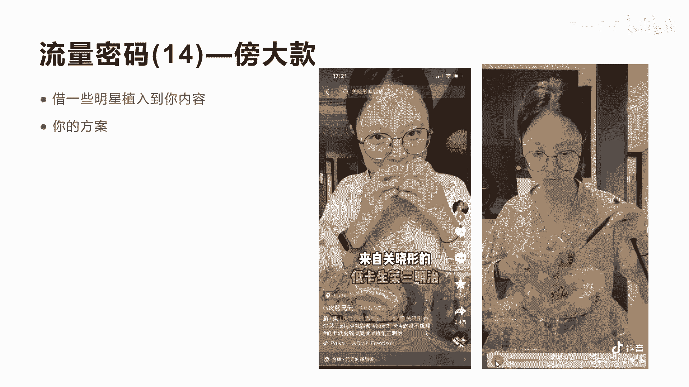

# 042 2023抖音快速起号必修课 - P46：第46节流量密码(14)—傍大款-请收藏 - 早安睿睿 - BV1Gn4y1o7rC

好上一节课我们讲到这个借流量，其实就是借一些影片啊，一些电影电视剧的相关的呃，一些自带的流量IP，那么今天我们要讲就是傍大款，傍大款其实也是一种借流量的方式，只是说我们怎么去借用明星的相关的流量啊。

前面我们是讲借电影这个IP的流量，现在我们讲的是借明星IP的流量，怎么去借呢，这里面我们会讲几个案例。

让你真正体会到，比如说我们先来看第一个视频，刘德华在9月27号生日会的时候。

穿的是怎样的鞋子，你知道吗，溶解鞋她真的很喜欢，包括在前段时间开演唱会的时候。

穿的也是溶解鞋，不过她穿的是三原康裕的好，我们不讲，不看完了啊，从前面这个片段你就会发现，他就在借用刘德华这个IP的流量，他前妻就在讲刘德华在前期穿的是什么样的鞋，溶解鞋是吧，他为什么会穿溶解鞋呢。

呃因为等等他会讲我的鞋是什么，这就转入了我的自己的产品，这就是我们讲的，在前期3~5秒和前期15秒之内，你用刘德华，类似于这种明星，大款的这种IP的流量植入到你的内容里面去，会让观众有更大的希。

其实说白了，不管我们是这个借流量也好，还是傍大款也好，目的都是为了让观众能持续留下来看下去，这是核心，当然如果我们能在产品中，对于呃明星IP的一些产品的对比啊，也会更多体现出你产品的优质性。

你要学会借明星的流量植入到你的产品，第二因为明星的啊IP是自带流量，所以可以赋能你的整个短视频的流量，第三个就是你在讲内容的时候，尽量的去讲明星的优点和缺点，优点是什么，缺点是什么啊，进行一个对比。

让更多的观众对你的产品形成一个认知，然后就是我们最后讲的就是你的产品，你的产品怎么植入进去，这个短视频我们看了一下，他就是讲的刘德华的鞋子啊，有很多人用这种方式在讲，都带来的一些流量。

虽然不是非常大的爆款，但是蹭到了非常大的流量，我们再看另外一个作品。

好吧啊，这个是他借用了另外一个明星叫关晓彤，也是比较火的啊，关晓彤的低卡生菜三明治啊，他也是借用了这个明星的一个热度IP啊，达到了227。7万的一个点赞，非常大了，这个27。7万。

基本上可以应该是5000万以上的流量，所以利用IP明星的这个核心元素，植入到你的内容里面，再用你的方案去做讲解。

他这里面我们看一下他的视频啊，来自关晓彤的低卡生菜三明治，靠吃瘦了30斤的肉脸圆。

拿一个大胆一点，怎么没买到求生菜，其实你会发现，他刚开始的时候就讲了一个关晓彤的三明治，后面就算做自己的东西，因为当你提到关晓彤这个词这个名字，这个明星的名字之后。

用户就会有期待感诶到底这个关晓彤这个明星，他的三明治是怎么做的呢，如果你说你没有讲关晓彤这个词，其实军用户对你的期待感就大大的降低了，大家理不理解非常关键的一个元素啊，只要你讲和不讲天壤之别。

鸡蛋用醋汁撒一点鸡蛋，来点黑胡椒，海盐芝士，三明治来点肉松好，这个视频我们就不看完了，他整个过程就在其实除了开始来讲，关晓彤后面都是自己在做呃，三明治的整个过程啊，整个过程。

所以你会发现呃借和不借啊是天壤之别。

再来看第三个案例，这个是什么呢，就是呃我们讲的另外一个形式，它是一个穿搭的穿搭的短视频，这个视频更恐怖啊，达到48。6万的一个点赞啊，评论数也有2。4万啊，他是用一种方式来呃。

演绎所有的明星穿搭的一个过程啊。

我们来看一下他的视频，盘点不同的明星穿搭。

2。0，Baby tonight the night，I let you know baby tonight，The night，We lose control baby tonight。

You need that tonight，Believe that tonight，I'll be the back，我们不看完，你会发现它其实就是很简单一个场景啊，换不同的服装。

然后上面只是写了个名字而已是吧，如果没有上面那个明星的名字，你看他每一次这样的进入，其实对你来讲没有什么很大的感受，正因为上面写了易烊千玺是吧，正因为上面写了蔡徐坤啊，类似于这个明明星的名字。

就让整个这个视频的流量啊爆炸，这就是核心，这就是借贷款，所以你们一定要知道啊，任何的这种流量的形式，其实都可以用这种方式去举一反三，其实我这里面也讲到，除了和刚才说的易烊千玺这种方式去做穿搭。

你也可以和什么和杨幂穿搭嘛，是不是你也可以和王嘉，王嘉尔穿搭等等，包括张艺兴同管的零食，这里面很多很多这种类似的，不管你是做穿搭，做美食还是做刚才讲的汽车呀，修车也好，像你的赛道里面能跟明星能挂的钩的。

你都可以用他们的名字和他们的电影，以及他们的IP去蹭一些流量啊，这就是整个我们讲的流量密码的第14，叫傍大款啊，非常重要，因为这个内容跟我们前面讲的流量密码13呢，其实非常相似。

但是两个用的方式是不一样的啊，方式有时候不一样，我希望通过两种这种傍大款和借流量的方式，能让真正你的流量形式能爆炸，能真正打开你的呃自己的流量密码好吧，今天我们的流量密码144就讲到这里。

